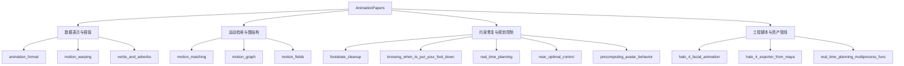

# AnimationPapers 博客导航

AnimationPapers 分组对应论文复现和动画系统工程案例。notebook 学习优先使用 `start_animationpapers_lab.ps1` 打开的稳定副本，入口目录是 `.reports/study/AnimationPapers`；脚本类案例保留为验证、导出和数据生成支撑。

```powershell
powershell -NoProfile -ExecutionPolicy Bypass -File .\tools\start_animationpapers_lab.ps1
```

单案例验证使用：

```powershell
powershell -NoProfile -ExecutionPolicy Bypass -File .\tools\run_case.ps1 <slug>
```

发布状态：14 个受管案例全部有 README、assets 清单、v5 媒体和运行入口；其中 10 个案例已深写完成，4 个案例保持媒体完整的发布基底。12 个 notebook 使用稳定 study 副本作为学习面，2 个 Python module 使用源码卡、命令日志和产物摘要作为执行证据。

## 分组模块图



## 推荐阅读路线

1. 数据入口：[`animation_format`](animation_format/README.md)、[`motion_warping`](motion_warping/README.md)、[`verbs_and_adverbs`](verbs_and_adverbs/README.md)。
2. 约束与标注：[`footskate_cleanup_for_motion_capture_editing`](footskate_cleanup_for_motion_capture_editing/README.md)、[`knowing_when_to_put_your_foot_down`](knowing_when_to_put_your_foot_down/README.md)。
3. 检索与图结构：[`motion_matching`](motion_matching/README.md)、[`motion_graph`](motion_graph/README.md)、[`motion_fields_for_interactive_character_animation`](motion_fields_for_interactive_character_animation/README.md)。
4. 规划与控制：[`real_time_planning_for_parameterized_human_motion`](real_time_planning_for_parameterized_human_motion/README.md)、[`near_optimal_character_animation_with_continuous_control`](near_optimal_character_animation_with_continuous_control/README.md)、[`precomputing_avatar_behavior`](precomputing_avatar_behavior/README.md)。
5. 资产与支撑脚本：[`halo_4_facial_animation`](halo_4_facial_animation/README.md)、[`halo_4_exporter_from_maya`](halo_4_exporter_from_maya/README.md)、[`real_time_planning_multiprocess_func`](real_time_planning_multiprocess_func/README.md)。

## 深写完成案例

| slug | 读它时重点看什么 |
| --- | --- |
| [`animation_format`](animation_format/README.md) | Skeleton、channel、motion buffer 和坐标约定如何成为全部动画系统的输入层。 |
| [`footskate_cleanup_for_motion_capture_editing`](footskate_cleanup_for_motion_capture_editing/README.md) | 如何检测脚滑、建立足底约束，并把修复结果解释为“接触更可信”。 |
| [`motion_fields_for_interactive_character_animation`](motion_fields_for_interactive_character_animation/README.md) | 如何把局部 pose、速度和目标查询成 motion field 中的候选动作。 |
| [`motion_matching`](motion_matching/README.md) | 如何把未来轨迹和姿态特征做成检索向量，并在实时循环中选下一帧。 |
| [`motion_graph`](motion_graph/README.md) | 如何用距离度量找可转移片段，再把动作库变成可遍历的图。 |
| [`motion_warping`](motion_warping/README.md) | 如何把时间轴和根轨迹重映射到新的命中点，同时保住接触约束。 |
| [`near_optimal_character_animation_with_continuous_control`](near_optimal_character_animation_with_continuous_control/README.md) | 如何在连续控制空间中扩展候选并用代价函数裁剪出近似最优路径。 |
| [`precomputing_avatar_behavior`](precomputing_avatar_behavior/README.md) | 如何把昂贵的行为搜索提前离线预计算，运行时只做轻量查询。 |
| [`real_time_planning_for_parameterized_human_motion`](real_time_planning_for_parameterized_human_motion/README.md) | 如何把参数化动作、目标和代价函数组织成实时规划。 |
| [`verbs_and_adverbs`](verbs_and_adverbs/README.md) | 如何用 RBF 把动作“动词”和风格“副词”合成可调控制空间。 |

## 全量案例列表

| slug | 类型 | 发布状态 |
| --- | --- | --- |
| [`animation_format`](animation_format/README.md) | `notebook` | 深写完成 + 媒体完整 |
| [`footskate_cleanup_for_motion_capture_editing`](footskate_cleanup_for_motion_capture_editing/README.md) | `notebook` | 深写完成 + 媒体完整 |
| [`halo_4_facial_animation`](halo_4_facial_animation/README.md) | `notebook` | 媒体完整 + 发布基底 |
| [`knowing_when_to_put_your_foot_down`](knowing_when_to_put_your_foot_down/README.md) | `notebook` | 媒体完整 + 发布基底 |
| [`motion_fields_for_interactive_character_animation`](motion_fields_for_interactive_character_animation/README.md) | `notebook` | 深写完成 + 媒体完整 |
| [`motion_graph`](motion_graph/README.md) | `notebook` | 深写完成 + 媒体完整 |
| [`motion_matching`](motion_matching/README.md) | `notebook` | 深写完成 + 媒体完整 |
| [`motion_warping`](motion_warping/README.md) | `notebook` | 深写完成 + 媒体完整 |
| [`near_optimal_character_animation_with_continuous_control`](near_optimal_character_animation_with_continuous_control/README.md) | `notebook` | 深写完成 + 媒体完整 |
| [`precomputing_avatar_behavior`](precomputing_avatar_behavior/README.md) | `notebook` | 深写完成 + 媒体完整 |
| [`real_time_planning_for_parameterized_human_motion`](real_time_planning_for_parameterized_human_motion/README.md) | `notebook` | 深写完成 + 媒体完整 |
| [`verbs_and_adverbs`](verbs_and_adverbs/README.md) | `notebook` | 深写完成 + 媒体完整 |
| [`real_time_planning_multiprocess_func`](real_time_planning_multiprocess_func/README.md) | `python_module` | 媒体完整 + 源码证据 |
| [`halo_4_exporter_from_maya`](halo_4_exporter_from_maya/README.md) | `python_module` | 媒体完整 + 源码证据 |

## 媒体与阅读建议

本分组当前有 100 张结果 PNG、100 张学习卡 PNG、27 个 GIF 预览、27 个 MP4/H.264、27 个 WebM/VP9 和 14 段 walkthrough WebM。正文中的“代码 Cell 与可视化结果”或“源码模块与执行证据”会把每张素材绑定到 cell、源码片段、输出类型和结果意义。

先读总模块图，确认输入数据、核心算法和输出之间的关系。再读“代码执行路径”，把 notebook cell 顺序翻译成工程流水线。最后读“执行结果的意义”，明确 viewer、曲线、日志或导出文件到底在验证什么。

原始 `labs/AnimationPapers/*.ipynb` 保留为作者源码参考；交互学习的保证入口是 `.reports/study/AnimationPapers` 中的 stable 副本。
