# Animation Format：骨骼动画数据格式

## 元信息

| 字段 | 值 |
| --- | --- |
| slug | `animation_format` |
| source path | `labs/AnimationPapers/Animation Format.ipynb` |
| env prefix | `.envs/animation_format` |
| kernel | `animationtech-animation_format` |
| validation status | 自动执行已通过；交互部分仍建议在 JupyterLab 中人工检查 |

## 问题背景

角色动画通常不直接保存网格每个顶点的轨迹，而是保存骨架层级中每根骨骼随时间变化的局部位移和局部旋转。网格会被绑定到骨架上，播放时由骨骼姿态驱动蒙皮变形。理解这个数据格式，是后续 motion matching、retargeting、footskate cleanup、motion warping 等案例的共同入口。

这篇 notebook 用 LAFAN1 的 `aiming1_subject1.bvh` 展示一段动作如何被表示为两个按帧采样的张量：

- `animation.pos = (7184, 22, 3)`：每帧、每根骨骼的 local translation。
- `animation.quats = (7184, 22, 4)`：每帧、每根骨骼的 local rotation quaternion。

它还进一步说明 raw BVH 骨架和可渲染角色资产骨架并不总是同构，因此需要 `AnimMapper` 把 BVH 动画映射到 `AnimLabSimpleMale.usd` 的角色骨架上。最后的 Root 投影段落则展示了如何把 Hips 的水平位移和朝向抽出到 `Root`，为后续 root motion 控制打基础。

## 阅读前置知识

建议先掌握这些概念：

1. Skeleton hierarchy：骨骼是一棵父子树，子骨骼的姿态相对父骨骼保存。
2. Local transform：`pos[i]` 和 `quats[i]` 描述第 `i` 根骨骼相对父骨骼的位移和旋转。
3. Quaternion：四元数用于稳定表示三维旋转，避免欧拉角万向节锁。
4. Forward Kinematics：沿父子关系把 local transform 累乘到 world transform。
5. Root motion：把角色整体在地面上的平移和朝向单独放在根节点，方便原地播放、重定向和游戏控制。

如果把整套动画系统看成流水线，`Animation Format` 回答的是最基础的问题：一段动作在内存里到底长什么样，哪些张量驱动渲染，哪些层级关系决定它们的含义。

## 总模块图

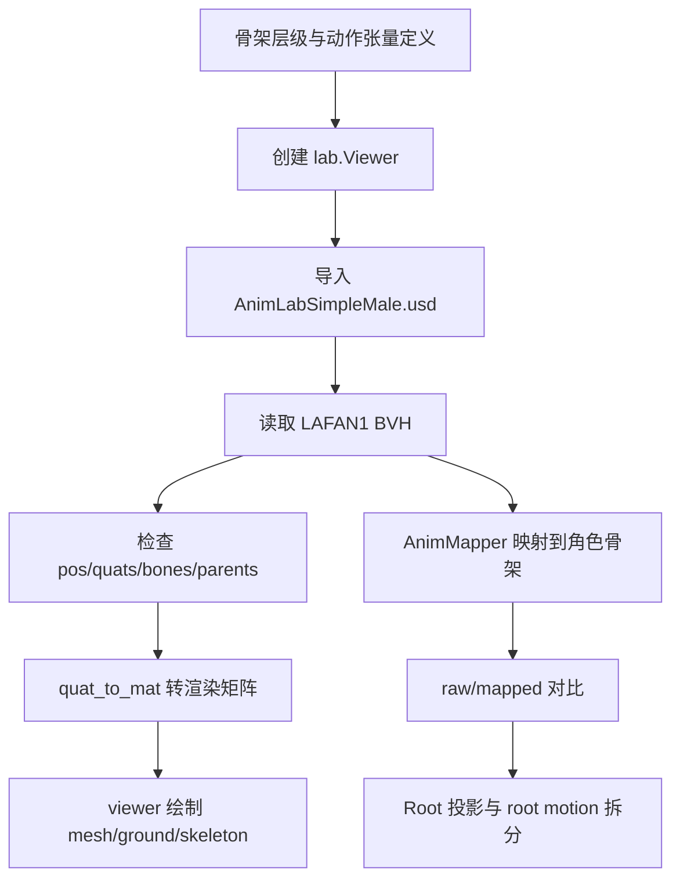

## 代码执行路径

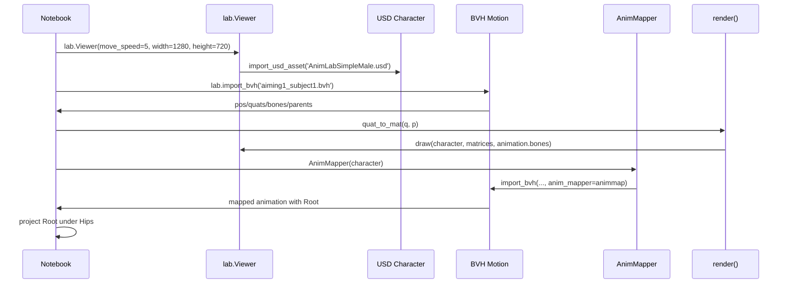

这条路径有两个观察层次：第一层是 raw BVH 怎么被读成张量并渲染；第二层是 raw BVH 和角色资产骨架不一致时，如何通过映射把动作放到可用角色上。

## 模块拆解

### 1. 骨架结构与动画表示

开头 Markdown cell 用树状结构说明角色骨架：`Hips` 下有左右腿、脊柱，脊柱下有头部和双臂。每根骨骼只保存相对父节点的局部姿态，最终世界姿态由父链逐层累积得到。

notebook 用公式把动作写成：

```text
M(t) = (P(t), Q(t))
P(t) = (p0(t), ..., pb(t))
Q(t) = (q0(t), ..., qb(t))
```

其中 `t` 是离散帧，LAFAN1 以 30 FPS 采样。`P` 的最后一维是三维位置，`Q` 的最后一维是四元数。这个表示的优点是紧凑、可插值、可被 IK 和 retargeting 直接操作。

### 2. Viewer 与角色资产

第一段代码导入基础依赖并创建 viewer：

```python
import numpy as np
from ipywidgets import widgets, interact
import ipyanimlab as lab

viewer = lab.Viewer(move_speed=5, width=1280, height=720)
```

随后使用：

```python
character = viewer.import_usd_asset('AnimLabSimpleMale.usd')
```

导入角色资产。这里的 `character` 不只是 mesh，它同时包含骨架、材质和 viewer 可绘制的资源信息。紧接着的展示 cell 画出角色、地面、坐标轴和骨架线，用于确认资产本身的 bind pose 和 skeleton topology。

### 3. BVH 动画读取与张量检查

BVH 读取代码是：

```python
animation = lab.import_bvh('../../resources/lafan1/bvh/aiming1_subject1.bvh')
```

notebook 随后打印 `animation.pos.shape` 与 `animation.quats.shape`，得到 `(7184, 22, 3)` 和 `(7184, 22, 4)`。这说明 raw BVH 有 7184 帧、22 根骨骼。后面的 inspect cell 会继续输出第 0 帧所有骨骼的位置和四元数，以及前 2 帧、前 3 根骨骼的局部数据，用来验证维度、数值范围和采样结构。

这里要特别注意 `bones` 和 `parents`。`bones` 给出骨骼名称顺序，`parents` 给出每根骨骼的父节点索引。相同的 `pos/quats` 数组，如果配上不同的骨骼顺序或父子关系，语义会完全不同。

### 4. 从 local pose 到 viewer 矩阵

渲染函数的核心是：

```python
p = animation.pos[frame].copy()
q = animation.quats[frame].copy()
a = lab.utils.quat_to_mat(q, p)
viewer.draw(character, a, animation.bones)
```

`quat_to_mat` 把每根骨骼的 local translation 和 local rotation 转成 4x4 transform 矩阵。`viewer.draw(character, a, animation.bones)` 再根据骨骼名称把矩阵交给角色资产绘制。这个 cell 还会画 `world_skeleton_xforms` 和 `world_skeleton_lines`，让我们同时看到 mesh 和骨架调试线。

另一个 `render_skeleton` cell 只画骨架不画角色 mesh。它适合检查骨骼数据本身是否合理，避免被蒙皮或材质遮挡。

### 5. AnimMapper 骨架映射

raw BVH 的骨架顺序以 `Hips` 为根，映射后的角色动画会引入 `Root`，并调整骨骼顺序以匹配 `AnimLabSimpleMale.usd`：

```python
animmap = lab.AnimMapper(character)
animation = lab.import_bvh(
    '../../resources/lafan1/bvh/aiming1_subject1.bvh',
    anim_mapper=animmap
)
```

`AnimMapper` 的职责不是“美化动作”，而是解决数据契约：BVH 的骨骼命名、顺序、offset 和角色资产不完全相同，必须先映射到同一骨架空间，后续算法才能稳定地用 `character.bone_index('LeftFoot')`、`character.world_skeleton_xforms()` 等 API 操作。

notebook 的对比段落同时导入 raw 与 mapped 两个版本，打印骨骼树和 parent table。raw 版本是 22 根骨骼，mapped 版本是 23 根骨骼，多出的 `Root` 作为全身运动节点。这一对比是理解后续案例里 Root/Hips 分工的关键。

### 6. Root 投影与 root motion 拆分

最后一段把 Hips 的水平朝向和水平位置投影给 `Root`：

```python
hips_v = lab.utils.quat_mul_vec(animation.quats[:, 1], [0, 1, 0])
angle = np.arctan2(hips_v[:, 0], hips_v[:, 2]) / 2
root_q[:, 0] = np.cos(angle)
root_q[:, 2] = np.sin(angle)
root_p[:, [0, 2]] = animation.pos[:, 1, [0, 2]]
```

随后用 `qp_inv` 与 `qp_mul` 把 Hips 变回 Root 的局部空间：

```python
animation.quats[:, 1], animation.pos[:, 1] = lab.utils.qp_mul(
    lab.utils.qp_inv((root_q, root_p)),
    (animation.quats[:, 1], animation.pos[:, 1])
)
animation.quats[:, 0], animation.pos[:, 0] = root_q, root_p
```

这一步把角色整体在地面上的移动与朝向交给 `Root`，让 `Hips` 更专注于身体姿态。后续如果想原地播放，只需要固定 `Root` 的位置或旋转；如果想把动作接入游戏角色控制，也可以把 `Root` 看作导航层与动画层之间的接口。

## 基础函数读法

### `lab.import_bvh`

`import_bvh` 负责把 BVH 文件解析成 `lab.Anim` 对象。最重要的输出是 `pos`、`quats`、`bones` 和 `parents`。没有 `anim_mapper` 时，它保留 raw BVH 骨架；传入 `AnimMapper` 后，它会把动作重排并补齐到角色资产骨架。

### `lab.utils.quat_to_mat`

这一步是数据和渲染之间的桥。动画算法通常处理 `pos/quats`，viewer 更适合吃矩阵。`quat_to_mat(q, p)` 把每根骨骼的局部姿态转成矩阵数组 `a`，再交给 `viewer.draw()`、`world_skeleton_xforms()` 和 `world_skeleton_lines()`。

### `inspect_animation`

这个调试函数把动画对象的 shape、骨骼名、parent 表、第 0 帧位置和四元数都打印出来。它的价值不在漂亮输出，而在建立“数组下标和骨骼语义”的对应关系。调试 retargeting 错位、左右腿颠倒、Root/Hips 多一层时，这类输出比直接看画面更可靠。

### `print_skeleton_tree`

`parents` 是一维索引数组，人眼不容易直接阅读。`print_skeleton_tree` 先根据 `parents` 建 children 表，再 DFS 打印树结构。它把 raw BVH 与 mapped skeleton 的差异变得非常直观：raw 以 `Hips` 为根，mapped 以 `Root` 为根。

### Root projection cell

Root 投影 cell 是本篇最关键的工程 cell。它展示了如何把“角色整体在地面上的运动”从 Hips 中抽离出来，并通过四元数乘法保持局部关系一致。它也是后续 footskate cleanup 中 root/hips offset 概念的前置。

## 关键数据结构

| 名称 | 形状或类型 | 作用 |
| --- | --- | --- |
| `animation.pos` | `[frame_count, bone_count, 3]` | 每帧、每根骨骼的局部位移 |
| `animation.quats` | `[frame_count, bone_count, 4]` | 每帧、每根骨骼的局部旋转四元数 |
| `animation.bones` | `list[str]` | 动画骨骼名称顺序 |
| `animation.parents` | `array[int]` | 父节点索引，`-1` 表示根节点 |
| `character` | ipyanimlab 资产对象 | USD 角色网格、材质与骨架 |
| `animmap` | `lab.AnimMapper` | 将 BVH 骨架映射到角色资产骨架 |
| `a` | `[bone_count, 4, 4]` | 当前帧可绘制的骨骼矩阵数组 |
| `root_q` | `[frame_count, 4]` | 从 Hips 抽出的 Root 水平朝向 |
| `root_p` | `[frame_count, 3]` | 从 Hips 抽出的 Root 水平位移 |
| `static_position` / `static_rotation` | widget bool | 验证 Root motion 拆分效果的交互开关 |

## 执行结果的意义

本 notebook 的结果不是为了产出一个新动作文件，而是建立整个动画技术栈的基础语义。运行完成后，你应该能回答这些问题：

1. BVH 读入后，动作在内存中如何组织成 `pos/quats`。
2. 为什么同一段动作必须同时看 `bones` 和 `parents` 才能理解。
3. raw BVH 为什么不能总是直接驱动角色资产，`AnimMapper` 解决了什么契约问题。
4. `Root` 和 `Hips` 的职责如何拆开，为什么 root motion 对后续控制、重定向和修脚很重要。

理解这里之后，后面的 motion warping、footskate cleanup、verbs/adverbs 等案例都可以看作对同一套数据结构的进一步变换：有的改轨迹，有的改约束，有的改局部姿态，但底层仍是骨架层级和逐帧 `pos/quats`。

## 关键 cell / 函数深讲

### Cell 11 - Character bind pose and skeleton viewer

使用 `render(frame)` 函数将 BVH 通道数据转换为角色骨骼矩阵，并驱动资产模型、地面和骨架的绘制，以确认动画流可以正确激活引擎内的 Mesh。

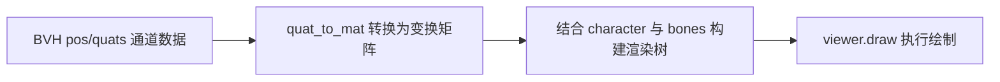

- 代码做什么：Run render(frame), convert BVH channels to character bone matrices, then draw the character, ground, skeleton lines, and local axes.
- 运行后看到什么：`viewer`
- 结果说明什么：确认动画数据能驱动实时 viewer，后续格式、映射和 Root motion 讨论都以它为基准。
- 可视化主体：Character bind pose and skeleton viewer
- 捕获方式：`canvas`

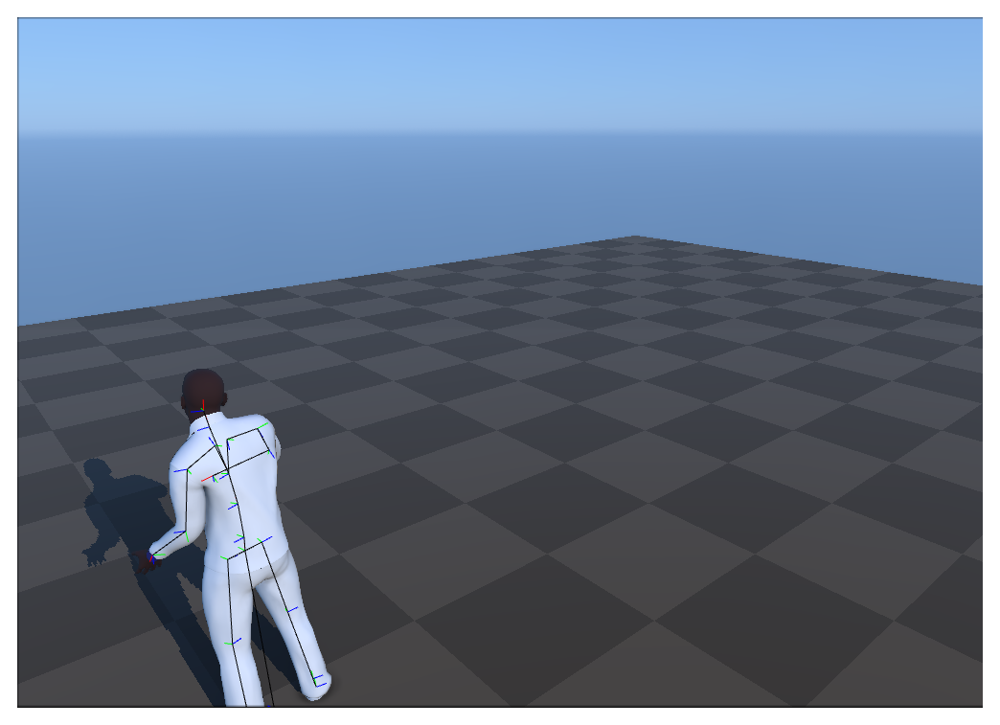

### Cell 12 - Raw BVH skeleton-only view

脱离具体的 Mesh 模型，仅绘制 BVH 原生骨架的线条和关节坐标系，以便直接观察关节层级。


- 代码做什么：Run render_skeleton(frame) and draw only BVH skeleton lines and joint axes.
- 运行后看到什么：`viewer`
- 结果说明什么：去掉 mesh 后，可以直接检查关节层级。
- 可视化主体：Raw BVH skeleton-only view
- 捕获方式：`canvas`

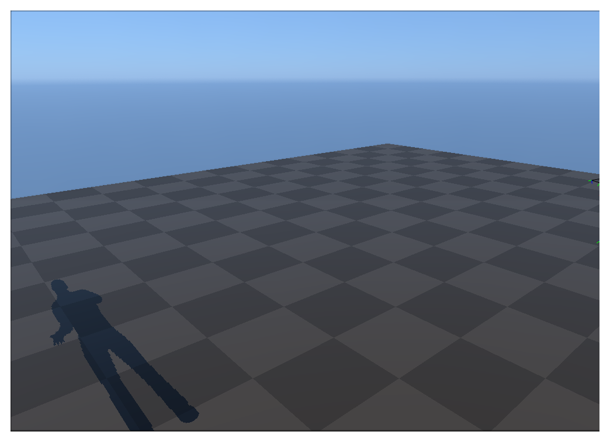

### Cell 9 - pos/quats tensor shape output

打印读取到的 BVH 张量维度，确认动作在内存中的物理排布。

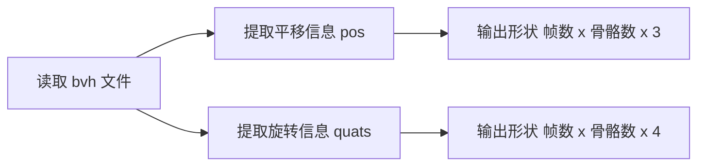

- 代码做什么：Print the position and quaternion tensor shapes after importing BVH data.
- 运行后看到什么：`log`
- 结果说明什么：日志说明动画会被表示成 frame x bone x channel 的数组。
- 可视化主体：pos/quats tensor shape output
- 捕获方式：`log`

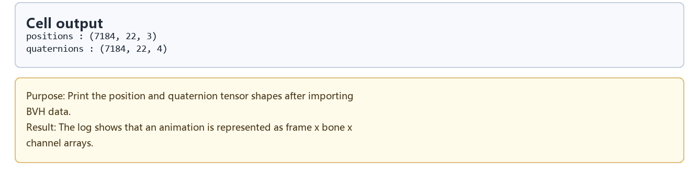

### Cell 19 - Raw skeleton versus mapped skeleton

将未经过滤的 BVH 原生骨架与经过 `AnimMapper` 重定向到角色模型上的骨架并排显示，观察它们在时间流上的完全匹配，以及空间拓扑上的差异。


- 代码做什么：Render the raw BVH skeleton beside the AnimMapper result on the target character.
- 运行后看到什么：`viewer`
- 结果说明什么：展示映射如何在保留时间结构的同时，把层级和姿态适配到角色资产。
- 可视化主体：Raw skeleton versus mapped skeleton
- 捕获方式：`canvas`

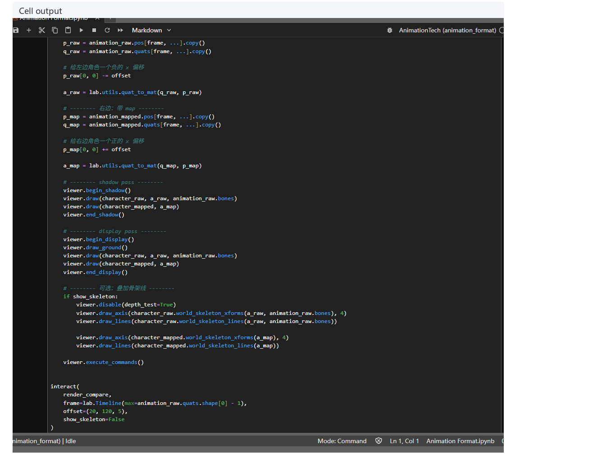

### Cell 21 - Skeleton parent tree output

将抽象的 `parents` 一维数组通过深度优先遍历转化为层次分明的树状文本输出，对比映射前后的拓扑根节点差异。


- 代码做什么：Print the raw and mapped skeleton parent trees.
- 运行后看到什么：`log`
- 结果说明什么：文本树把 viewer 中的差异落到可检查的父子层级上。
- 可视化主体：Skeleton parent tree output
- 捕获方式：`log`

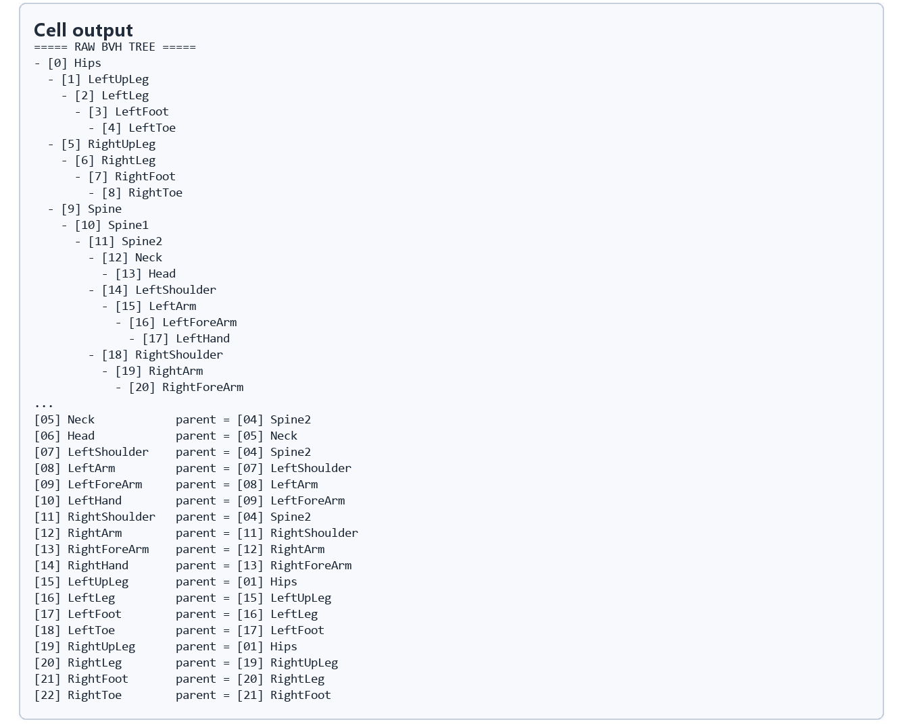

### Cell 24 - Root projection and Root/Hips split

演示将骨盆（Hips）在水平地面上的位移和偏航角（Yaw）剥离，转移给全新的 `Root` 骨骼，将全局移动与局部姿态解耦。

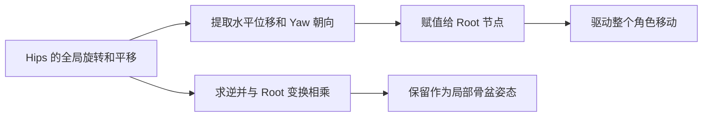

- 代码做什么：Use static_position/static_rotation controls to inspect root motion and local pelvis motion.
- 运行后看到什么：`timeline_viewer`
- 结果说明什么：说明全局位移和局部身体姿态如何分开存储。
- 可视化主体：Root projection and Root/Hips split
- 捕获方式：`canvas`

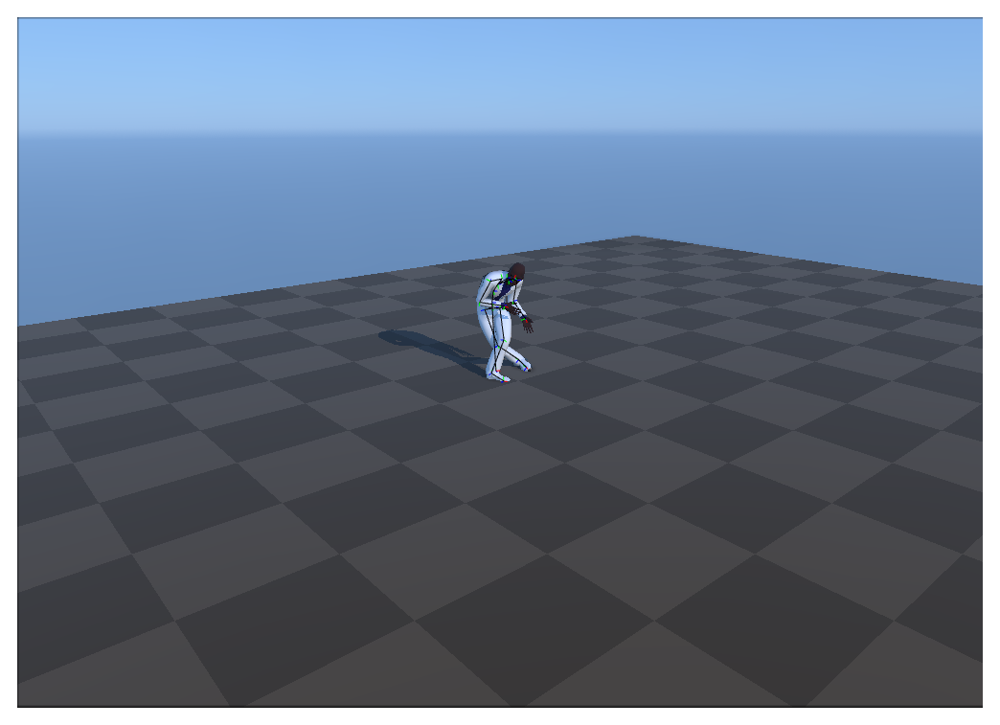

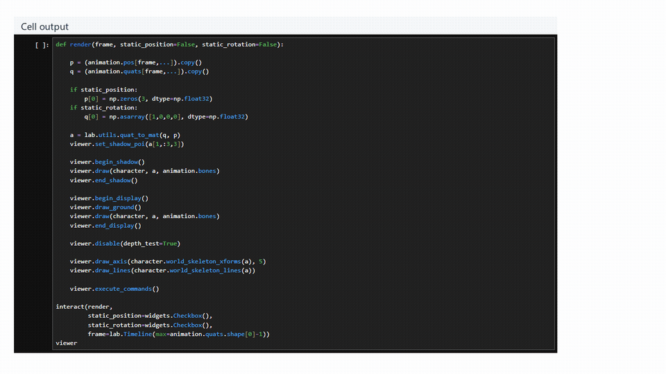


https://github.com/user-attachments/assets/f1a58680-65d5-444c-bae3-d5b51c46e0f0

<video controls muted loop playsinline preload="metadata" width="100%" poster="assets/06_root_projection_motion_result.png" src="assets/06_root_projection_motion_preview.mp4"></video>

### Cell 24 - Static Root toggle comparison

通过切换交互开关锁定 `Root` 的变换，直观展现当全局位移被抽离后，仅剩的局部关节动画（原地跑步等）的样子。

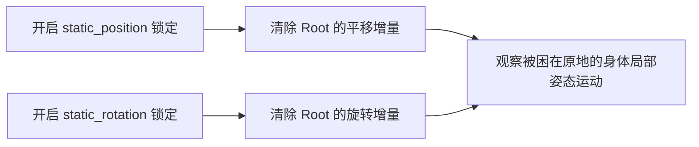

- 代码做什么：Enable a Root toggle and observe which motion remains in the local skeleton.
- 运行后看到什么：`timeline_viewer`
- 结果说明什么：让 Root 平移和旋转在动画中的作用变得可见。
- 可视化主体：Static Root toggle comparison
- 捕获方式：`canvas`

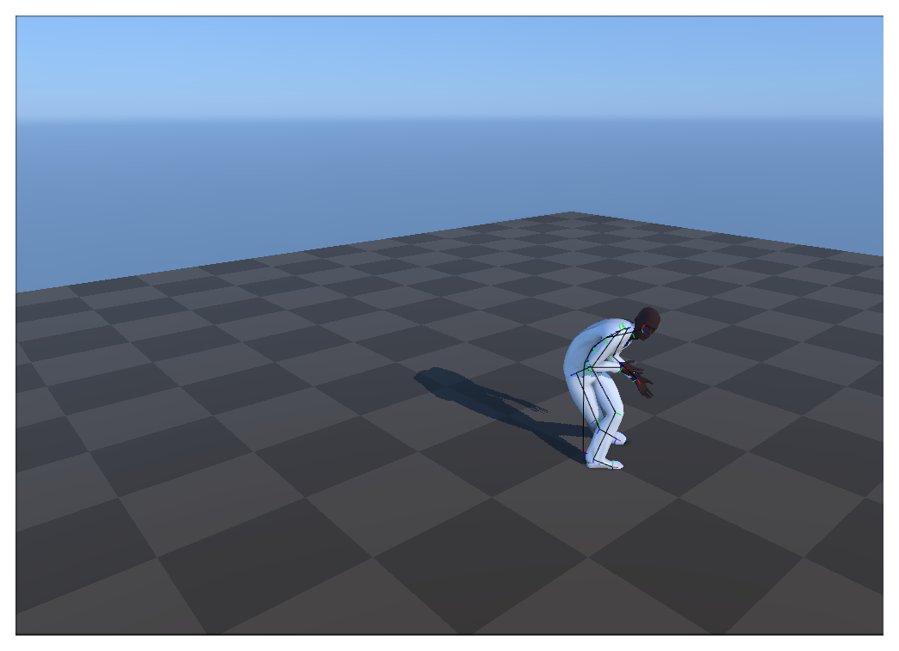

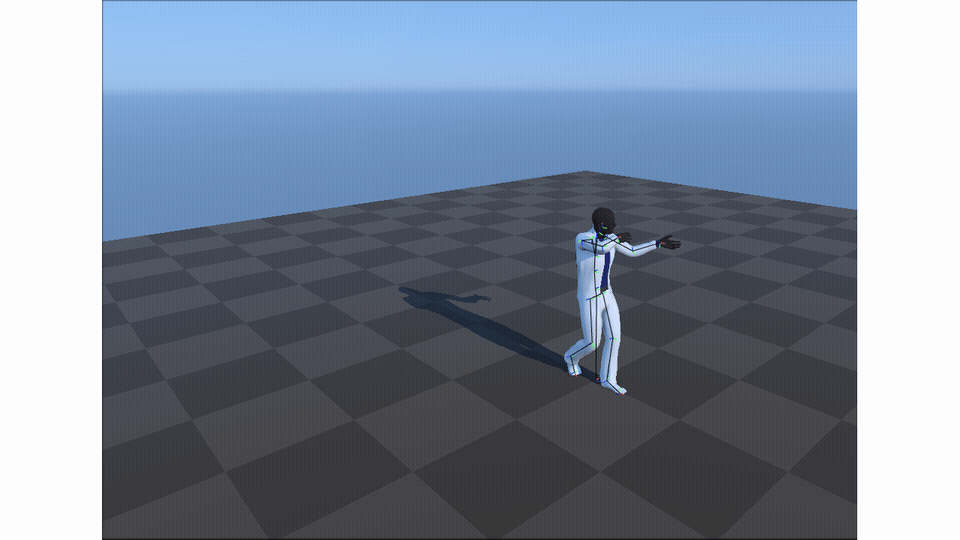


https://github.com/user-attachments/assets/93d326a8-60dd-439d-bc97-452968275553

<video controls muted loop playsinline preload="metadata" width="100%" poster="assets/07_static_root_toggles_result.png" src="assets/07_static_root_toggles_preview.mp4"></video>

## 运行方式

启动 AnimationPapers 的 JupyterLab 环境后，打开 `labs/AnimationPapers/Animation Format.ipynb`，选择 kernel `animationtech-animation_format`，按 cell 顺序运行。

```powershell
powershell -NoProfile -ExecutionPolicy Bypass -File .\tools\start_animationpapers_lab.ps1
powershell -NoProfile -ExecutionPolicy Bypass -File .\tools\run_case.ps1 animation_format
```

建议先看 raw BVH 的 shape 和骨架树，再看 mapped skeleton 的树结构，最后打开 `static_position` 与 `static_rotation` 开关观察 Root motion 被固定后的播放差异。

## 重点可视化 / 动画

本节只保留最能说明算法结果的图像和动画。代码学习卡移到文末证据表，供需要复现或追溯 cell 上下文时查看。


https://github.com/user-attachments/assets/f1a58680-65d5-444c-bae3-d5b51c46e0f0

<video controls muted loop playsinline preload="metadata" width="100%" poster="assets/06_root_projection_motion_result.png">
  <source src="assets/06_root_projection_motion_preview.mp4" type="video/mp4">
  <source src="assets/06_root_projection_motion_preview.webm" type="video/webm">
</video>


**Cell 24 - Static Root toggle comparison**

<video controls muted loop playsinline preload="metadata" width="100%" poster="assets/07_static_root_toggles_result.png">
  <source src="assets/07_static_root_toggles_preview.mp4" type="video/mp4">
  <source src="assets/07_static_root_toggles_preview.webm" type="video/webm">
</video>

| Cell | 输出类型 | 阅读位置 | 可视化主体 | 捕获方式 | 结果媒体 |
| --- | --- | --- | --- | --- | --- |
| Cell 11 | `viewer` | 核心图解 | 角色绑定姿势与骨架预览：确认动画数据能驱动实时 viewer，后续格式、映射和 Root motion 讨论都以它为基准。 | `canvas` | [结果 PNG](assets/01_character_bind_pose_result.png) |
| Cell 12 | `viewer` | 核心图解 | 仅显示原始 BVH 骨架：去掉 mesh 后，可以直接检查关节层级。 | `canvas` | [结果 PNG](assets/02_raw_bvh_skeleton_result.png) |
| Cell 19 | `viewer` | 核心图解 | 原始骨架与映射后骨架对比：展示映射如何在保留时间结构的同时，把层级和姿态适配到角色资产。 | `canvas` | [结果 PNG](assets/04_raw_vs_mapped_compare_result.png) |
| Cell 24 | `timeline_viewer` | 核心动画 | Root 投影与 Root/Hips 拆分：说明全局位移和局部身体姿态如何分开存储。 | `canvas` | [结果 PNG](assets/06_root_projection_motion_result.png) / [GIF](assets/06_root_projection_motion_preview.gif) / [MP4](assets/06_root_projection_motion_preview.mp4) / [WebM](assets/06_root_projection_motion_preview.webm) |
| Cell 24 | `timeline_viewer` | 核心动画 | Static Root 开关对比：直接显示 Root 平移和旋转在动画中的作用。 | `canvas` | [结果 PNG](assets/07_static_root_toggles_result.png) / [GIF](assets/07_static_root_toggles_preview.gif) / [MP4](assets/07_static_root_toggles_preview.mp4) / [WebM](assets/07_static_root_toggles_preview.webm) |


## 代码 Cell 与可视化结果

下面是附录式证据索引：结果 PNG 便于快速核对，代码卡用于追溯代码摘要与输出来源；带时间轴或参数滑杆的条目同时保留 GIF、MP4 和 WebM。

| Cell / 片段 | 结果说明 | 证据 |
| --- | --- | --- |
| Cell 11 | 确认动画数据能驱动实时 viewer，后续格式、映射和 Root motion 讨论都以它为基准。 | [结果 PNG](assets/01_character_bind_pose_result.png) / [代码卡](assets/01_character_bind_pose.png) |
| Cell 12 | 去掉 mesh 后，可以直接检查关节层级。 | [结果 PNG](assets/02_raw_bvh_skeleton_result.png) / [代码卡](assets/02_raw_bvh_skeleton.png) |
| Cell 9 | 日志说明动画会被表示成 frame x bone x channel 的数组。 | [结果 PNG](assets/03_tensor_shape_output_result.png) / [代码卡](assets/03_tensor_shape_output.png) |
| Cell 19 | 展示映射如何在保留时间结构的同时，把层级和姿态适配到角色资产。 | [结果 PNG](assets/04_raw_vs_mapped_compare_result.png) / [代码卡](assets/04_raw_vs_mapped_compare.png) |
| Cell 21 | 文本树把 viewer 中的差异落到可检查的父子层级上。 | [结果 PNG](assets/05_skeleton_tree_output_result.png) / [代码卡](assets/05_skeleton_tree_output.png) |
| Cell 24 | 说明全局位移和局部身体姿态如何分开存储。 | [结果 PNG](assets/06_root_projection_motion_result.png) / [GIF](assets/06_root_projection_motion_preview.gif) / [MP4](assets/06_root_projection_motion_preview.mp4) / [WebM](assets/06_root_projection_motion_preview.webm) / [代码卡](assets/06_root_projection_motion.png) |
| Cell 24 | 让 Root 平移和旋转在动画中的作用变得可见。 | [结果 PNG](assets/07_static_root_toggles_result.png) / [GIF](assets/07_static_root_toggles_preview.gif) / [MP4](assets/07_static_root_toggles_preview.mp4) / [WebM](assets/07_static_root_toggles_preview.webm) / [代码卡](assets/07_static_root_toggles.png) |
