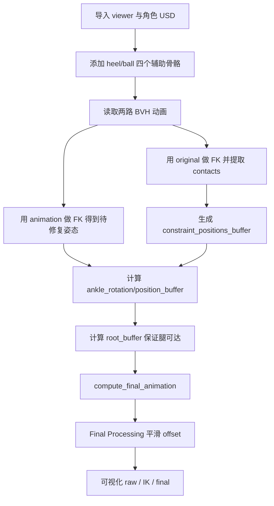
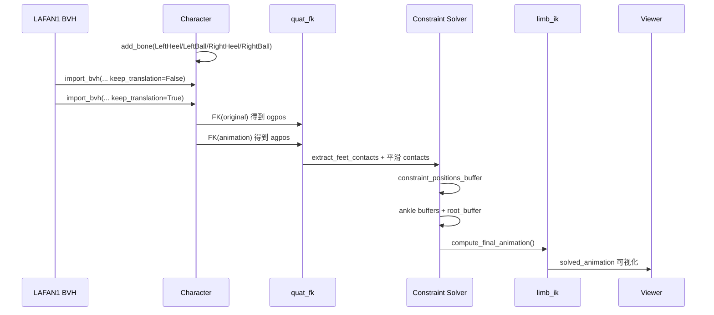
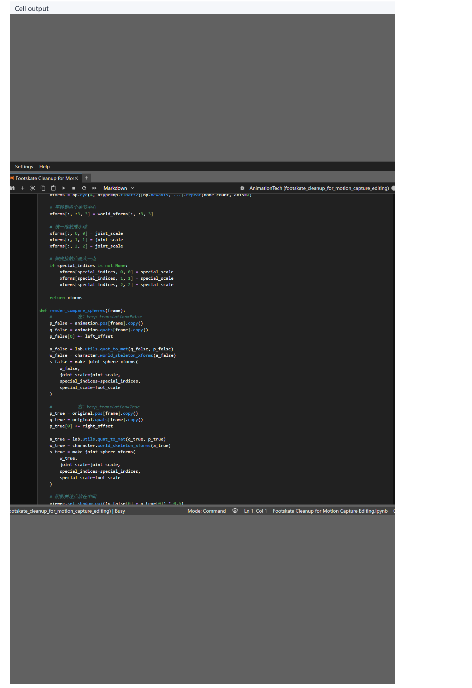
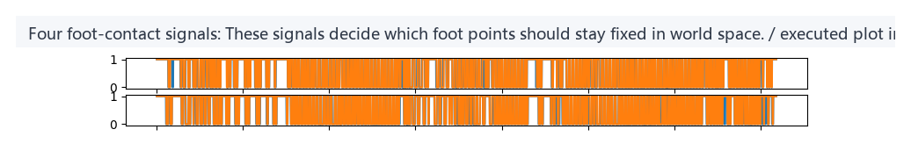
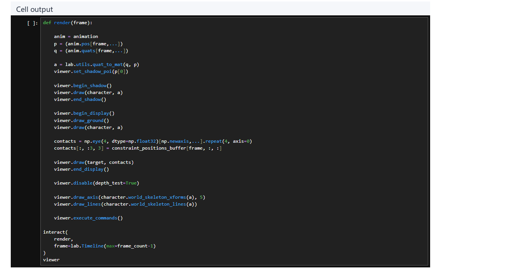
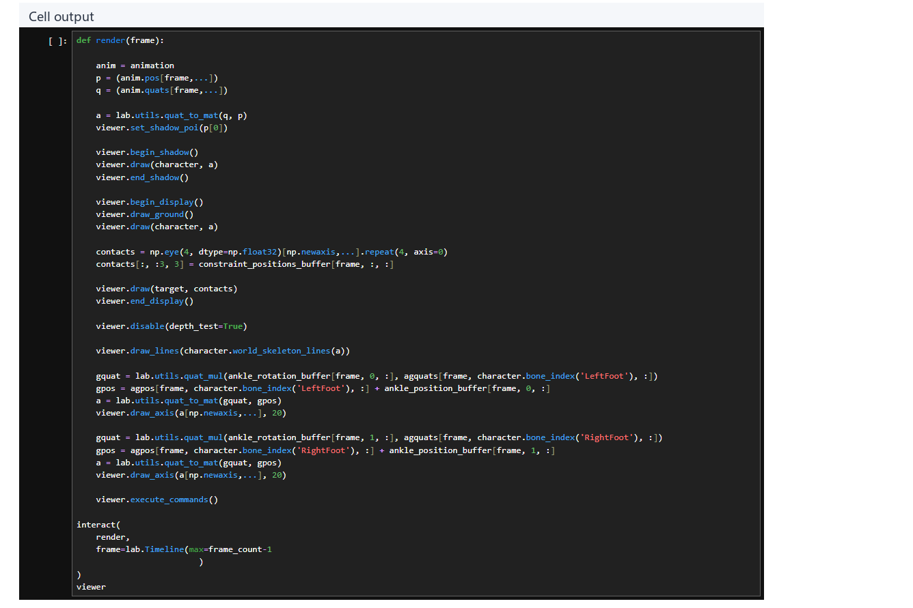
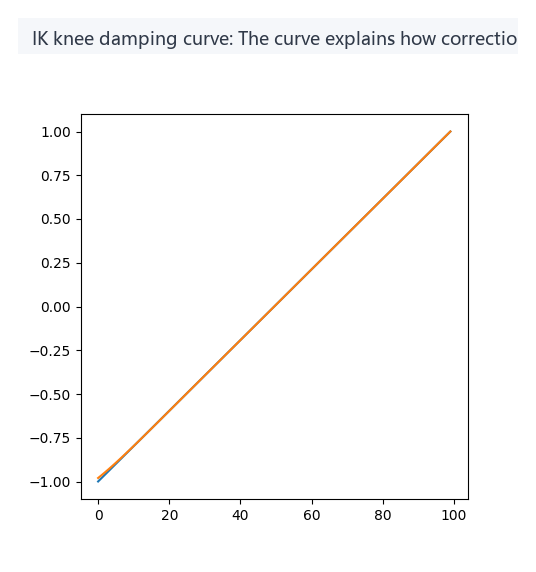
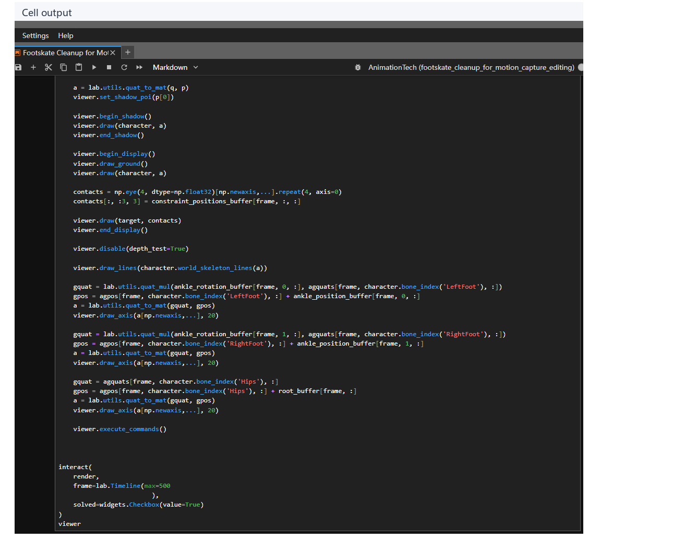

# Footskate Cleanup for Motion Capture Editing：动捕滑脚修复

## 元信息

| 字段 | 值 |
| --- | --- |
| slug | `footskate_cleanup_for_motion_capture_editing` |
| source path | `labs/AnimationPapers/Footskate Cleanup for Motion Capture Editing.ipynb` |
| env prefix | `.envs/footskate_cleanup` |
| kernel | `animationtech-footskate_cleanup_for_motion_capture_editing` |
| validation status | `passed`（`manual_smoke`；自动执行通过，仍需 JupyterLab 手动冒烟） |

## 问题背景

Footskate 指的是角色的脚在视觉上已经进入支撑相，观众也会默认它应当像钉在地面上一样稳定，但脚底仍沿地面滑动。这个问题在 motion capture editing、motion retargeting、动作拼接和动画重定向里非常常见：上半身看起来还对，脚底却泄露了“动作不是自然生成的”。

Kovar、Gleicher、Schreiner 的 SIGGRAPH 2002 方法把它定义成一个离线后处理问题。它不重新合成整段动作，而是在已知或已估计脚部接触区间之后，计算脚跟和脚掌球的地面约束，再把这些约束通过 ankle、knee、hips/root 和 limb IK 传播回整个人体姿态。换句话说，这篇 notebook 的重点不是完整的现代 contact understanding，而是 footplant constraint solver：当我们知道某些帧应当锁脚时，如何把“锁住脚底”做得几何上稳定、视觉上平滑。

本案例使用 LAFAN1 的 `aiming1_subject1.bvh`，并在角色脚部额外添加四个接触骨骼：`LeftHeel`、`LeftBall`、`RightHeel`、`RightBall`。这些辅助骨骼不改变原始角色语义，它们只是让算法有明确的约束点。参考资料来自 `docs/examples/Footskate Cleanup for Motion Capture Editing.md` 中对论文和 notebook 的拆解；该参考文档保持不改动。

## 阅读前置知识

阅读这篇前，最好先理解四件事。

1. 骨骼动画通常保存的是每根骨骼相对父节点的 local translation 和 local rotation，而不是直接保存每个网格顶点的位置。
2. Forward Kinematics 会把一串 local transform 沿父子层级乘起来，得到每根骨骼的 world position 和 world orientation。
3. Inverse Kinematics 反过来根据末端目标位置调整肢体关节；这里主要用两段腿部 IK，把 `LeftFoot` / `RightFoot` 拉回目标 ankle 配置。
4. 四元数适合表示旋转；旋转过渡要用 `quat_slerp`，位置过渡可以用线性插值或缩放 offset。

一个容易混淆的点是：本案例里的 `contacts` 是通过脚底速度阈值做出的示例性检测，而不是论文最难的“接触语义理解”。算法真正要展示的是：有了接触帧之后，如何生成、平滑并落实 footplant 约束。

## 总模块图



## 代码执行路径

notebook 的执行路径可以理解为一条从“读入动作”到“生成修复后动作”的数据管线。



关键变量之间的职责如下：`original` 保留原始脚部局部位移，用来估计脚底本来在哪里接触；`animation` 是被人为抬高 Hips 后的待修复版本；`constraint_positions_buffer` 是脚底目标点；`ankle_rotation_buffer`、`ankle_position_buffer` 和 `root_buffer` 是中间修正量；`solved_animation` 才是可播放的最终姿态。

## 模块拆解

### 1. 准备接触点与调试目标

代码先创建一个小型 `target` mesh，用来在 viewer 中标记脚底约束点。随后用 `character.add_bone()` 在 `LeftFoot` 与 `RightFoot` 下添加四个辅助骨骼：

```python
character.add_bone('LeftHeel', ...)
character.add_bone('LeftBall', ...)
character.add_bone('RightHeel', ...)
character.add_bone('RightBall', ...)
```

这一步的工程意义很大。BVH 原本只知道脚、脚趾等骨骼，不一定有“脚跟”和“脚掌球”这两个更适合做 footplant 的点。通过添加辅助骨骼，算法把一只脚简化成两点约束：heel 负责后脚跟，ball 负责前脚掌。`contact_distance` 记录同一只脚的 heel-ball 距离，后续约束位置修正必须保持这个距离，避免把脚底压扁或拉长。

### 2. 读取两路动画

同一个 BVH 会被读两次：

```python
animmap = lab.AnimMapper(character, keep_translation=False, root_motion=True)
animation = lab.import_bvh(..., anim_mapper=animmap)

animmap = lab.AnimMapper(character, keep_translation=True, root_motion=True)
original = lab.import_bvh(..., anim_mapper=animmap)
```

`animation` 是实际要修复的动作流，`original` 则用来检测原始脚底接触状态。随后 notebook 把 `animation` 的 `Hips` 高度整体上移 4 个单位，让滑脚问题在可视化里更明显。这个人为扰动也提醒我们：footskate cleanup 通常是在已有动作被编辑、重定向或混合后发生的后处理步骤。

### 3. 查找脚部接触时间

`lab.utils.quat_fk(original.quats, original.pos, original.parents)` 会把原始动画转换到全局空间。然后：

```python
contacts[:, :2], contacts[:, 2:] = lab.utils.extract_feet_contacts(
    ogpos,
    [left_heel, left_ball],
    [right_heel, right_ball],
    0.04
)
```

`contacts` 的形状是 `[frame_count, 4]`，四列分别代表左脚跟、左脚掌球、右脚跟、右脚掌球是否处于接触状态。阈值 `0.04` 代表基于速度的简化判断：脚底点速度足够低，就认为它在支撑相。

后面两段循环会填补 1 到 2 帧的短暂断裂。它不是高级滤波器，而是很实用的二值信号修补：如果某个接触只中间漏掉一两帧，多半是阈值抖动，不应让约束突然关闭。

### 4. 生成 constraint_positions_buffer

`constraint_positions_buffer` 保存每一帧四个接触点应该锁定到的地面位置。核心逻辑是：

1. 如果当前接触点上一帧已经被约束，继续使用上一帧目标位置，保证接触段内不会滑。
2. 如果是新接触，向未来看 `L1 = 10` 帧，对该点的全局位置求平均，再投影到地面。
3. 如果同一只脚的另一个点也处于锁定状态，重新对齐当前点，让 heel-ball 距离保持为 `contact_distance`。

这一步对应论文里的 Determine Constraint Positions。它解决的是“脚应该钉在哪儿”，而不是“腿该怎么弯过去”。用未来窗口取平均可以减少接触瞬间的偶然误差，但也带来 look-ahead，因此这类实现更适合离线清理或允许延迟的编辑工具。

### 5. 计算 ankle 位置与朝向

脚底的两个点一旦有了目标，下一步就是推导 ankle 应该怎样变化。这里的状态分三类：

- 双接触：heel 和 ball 都贴地。此时可以用当前 heel-ball 向量与目标 heel-ball 向量求出脚部旋转，再得到 ankle 的位置 offset。
- 单接触：只有 heel 或 ball 贴地。单点不能完整确定脚掌朝向，因此需要向前后查找附近的双接触状态，用 `quat_slerp` 和位置插值生成平滑过渡。
- 无接触：脚在空中，不直接施加强约束，但 Final Processing 可能会把临近接触的 offset 逐渐扩散到这里。

`L2 = 8` 控制 ankle offset 淡入淡出的窗口。旋转使用四元数球面插值，位置使用线性混合。这是避免脚部突然翻转、膝盖突然弹跳的第一层缓冲。

### 6. 计算 root / hips 可达性

只移动脚踝还不够。脚被锁住后，如果 Hips 仍在原位置，腿可能够不到目标，IK 会进入不自然的极限姿态。因此 notebook 使用 `compute_root_offset` 为 Hips/root 生成一个可达性修正 `root_buffer`。

`L3 = 8` 用于平滑 root offset。直觉上，Hips 必须落在“两条腿都能伸到目标脚点”的可行区域附近；如果只修脚不修骨盆，最后会把误差集中到膝盖或脚踝上。root 修正承担的是全身层面的补偿，让局部 footplant 不破坏整体姿态。

### 7. compute_final_animation 与腿部 IK

`compute_final_animation()` 是从中间 buffer 到最终可播放动作的桥。它会复制 `animation`，先应用 `root_buffer`，再把左右脚的 ankle offset 应用到目标脚部配置，然后调用 `lab.utils.limb_ik` 把腿部局部姿态解回去。

这一步还包含 knee damping。腿接近完全伸直时，小小的末端误差会让膝盖角度剧烈变化，视觉上就是 knee pop。notebook 通过阻尼多项式抑制这种跳变，宁愿让腿部变化更柔和，也不把所有误差硬塞给膝盖。

### 8. Final Processing

Final Processing 的目标是处理接触区间边界。只在接触帧施加 offset 会导致进入或离开 footplant 时突然变化，因此代码在无接触帧向前、向后搜索最近的接触帧，把那里的 root/ankle offset 按三次平滑函数衰减后借过来：

```text
无接触帧
  向后找最近接触 offset
  向前找最近接触 offset
  若两侧都有命中，则按距离混合
  将结果写回 root_buffer / ankle buffers
```

notebook 先用普通版本生成 `solved_animation`，后面又用 `L4 = 1000` 保存 Final Processing 前后的 buffer，做 `solved_animation_no_fp` 与 `solved_animation_fp` 的可视化对比。这里要注意执行顺序：Final Processing 处理的是中间 offset buffer，处理完后再调用 `compute_final_animation()`，而不是先做 IK 再平滑最终姿态。

## 关键 cell / 函数深讲

### `extract_feet_contacts`

这个函数把脚底速度转换成接触布尔信号。它的输入是 FK 后的全局位置 `ogpos`，而不是 local `pos`。原因很直接：脚是否在地面滑动，是世界空间里的现象；local 空间里脚相对父骨骼不动，不代表世界里不动。

### `constraint_positions_buffer`

这个 buffer 是算法的锚点。它不是脚当前的位置，而是脚在接触阶段“应该保持不变的位置”。如果某段接触内目标点仍随原动画移动，那 footskate 就没有被消除；因此接触段内部沿用上一帧目标，是修复滑脚的关键。

### `compute_root_offset`

这个函数体现了 footskate cleanup 不是单纯“把脚贴地”。如果脚已经锁死，身体必须重新分配误差。root offset 是把误差从脚踝转移到骨盆和整条腿上的机制，它让后续 IK 有可达目标，也让姿态不至于局部扭曲。

### `compute_final_animation()`

这一步才真正“落地”。前面的 buffer 都是目标和偏移，`compute_final_animation()` 把它们施加到动画数据结构上，调用 limb IK 改写腿部姿态，并输出 `solved_animation`。调试时如果只看 buffer，能知道约束是否合理；看 `solved_animation`，才能判断最终动画是否自然。

### `render(frame, solved=True, final_processing=True)`

渲染函数不是算法本体，但它是排查问题的入口。它同时画出角色、地面、四个 constraint target、骨架线、左右 ankle axis 和 hips/root axis。若 target 稳定但脚仍滑，问题多半在 IK 或 buffer 应用；若 target 本身漂移，问题在 contact 或 constraint 生成。

## 关键数据结构

| 名称 | 形状或类型 | 作用 |
| --- | --- | --- |
| `contacts` | `[frame_count, 4] bool` | 四个脚底接触点是否处于接触状态 |
| `contact_indices` | `[4] int` | `LeftHeel`、`LeftBall`、`RightHeel`、`RightBall` 的骨骼索引 |
| `constraint_positions_buffer` | `[frame_count, 4, 3]` | 每帧四个接触点的世界空间目标位置 |
| `ankle_rotation_buffer` | `[frame_count, 2, 4]` | 左右脚 ankle 的旋转修正，四元数表示 |
| `ankle_position_buffer` | `[frame_count, 2, 3]` | 左右脚 ankle 的位置修正 |
| `root_buffer` | `[frame_count, 3]` | Hips/root 的可达性位置修正 |
| `ogquats` / `ogpos` | FK 结果 | `original` 动画的全局姿态，用于接触检测 |
| `agquats` / `agpos` | FK 结果 | 待修复动画的全局姿态，用于计算 offset |
| `solved_animation` | `lab.Anim` | 应用 root、ankle、IK 与平滑后的最终动画 |
| `solved_animation_no_fp` / `solved_animation_fp` | `lab.Anim` | Final Processing 前后对比版本 |

## 执行结果的意义

这个案例的结果不是“生成一段全新的动作”，而是展示一个经典 footplant 后处理链条是否成立。好的结果应当满足三点：

1. 接触区间里，脚跟和脚掌球对应的目标点稳定，脚底不再沿地面滑。
2. Hips/root 有小幅、平滑的补偿，腿部能自然够到目标，不把误差集中到膝盖。
3. 打开 Final Processing 后，进入和离开接触区间时 offset 逐渐淡入淡出，减少脚踝、膝盖和骨盆的瞬时跳变。

这套方法的工程定位也很清楚：它适合离线动捕清理、动画编辑后处理、动作库修复和允许少量前瞻的工具链。如果要直接用于强实时角色控制，需要替换接触检测、减少 look-ahead，并把约束求解改造成逐帧在线版本。

## 代码 Cell 与可视化结果

本节按 notebook 的关键 code cell 组织学习素材：每个条目都对应代码目的、实际输出类型、结果意义和真实结果媒体。重点 PNG/GIF/视频来自 plot 或浏览器中的 viewer canvas；代码学习卡只作为附录证据。

<video controls muted playsinline preload="metadata" width="100%">
  <source src="assets/00-walkthrough.mp4" type="video/mp4">
  <source src="assets/00-walkthrough.webm" type="video/webm">
</video>

| Cell | 输出类型 | 代码做什么 | 结果说明什么 | 素材 |
| --- | --- | --- | --- | --- |
| 12 | `viewer` | Display two sphere-joint characters for keep_translation=False and keep_translation=True. | The comparison clarifies the responsibility split between root translation and local joint offsets. | [结果 PNG](assets/07_keep_translation_compare_result.png) |
| 16 | `plot` | Plot LeftHeel, LeftBall, RightHeel, and RightBall contact booleans. | These signals decide which foot points should stay fixed in world space. | [结果 PNG](assets/03_contact_signal_timeline_result.png) |
| 19 | `viewer` | Draw the heel and ball targets back into the viewer for contact spans. | Stable targets are the anchors that let IK remove foot sliding. | [结果 PNG](assets/02_contact_targets_result.png) |
| 25 | `viewer` | Render ankle and root helper axes while the contact constraints are active. | The axes help check whether cleanup preserves foot orientation and body orientation. | [结果 PNG](assets/05_ankle_root_axes_result.png) |
| 28 | `plot` | Plot the damping polynomial used by the IK correction. | The curve explains how correction error is smoothly distributed through the leg chain. | [结果 PNG](assets/04_constraint_buffer_debug_result.png) |
| 29 | `viewer` | Toggle between the original animation and the solved animation. | The reader can inspect whether the foot is more stable without damaging the body motion. | [结果 PNG](assets/01_raw_vs_solved_overview_result.png) |
| 34 | `timeline_viewer` | Compare the solved animation before and after final processing. | Final processing smooths entering and leaving contact spans instead of recomputing the whole IK solve. | [结果 PNG](assets/06_final_processing_compare_result.png) |

### Cell 12 - keep_translation comparison

- 代码做什么：Display two sphere-joint characters for keep_translation=False and keep_translation=True.
- 运行后看到什么：可视化 viewer 视口。
- 结果说明什么：The comparison clarifies the responsibility split between root translation and local joint offsets.



### Cell 16 - Four foot-contact signals

- 代码做什么：Plot LeftHeel, LeftBall, RightHeel, and RightBall contact booleans.
- 运行后看到什么：图表输出。
- 结果说明什么：These signals decide which foot points should stay fixed in world space.



### Cell 19 - Contact target points

- 代码做什么：Draw the heel and ball targets back into the viewer for contact spans.
- 运行后看到什么：可视化 viewer 视口。
- 结果说明什么：Stable targets are the anchors that let IK remove foot sliding.



### Cell 25 - Ankle and root debug axes

- 代码做什么：Render ankle and root helper axes while the contact constraints are active.
- 运行后看到什么：可视化 viewer 视口。
- 结果说明什么：The axes help check whether cleanup preserves foot orientation and body orientation.



### Cell 28 - IK knee damping curve

- 代码做什么：Plot the damping polynomial used by the IK correction.
- 运行后看到什么：图表输出。
- 结果说明什么：The curve explains how correction error is smoothly distributed through the leg chain.



### Cell 29 - Original versus IK-solved animation

- 代码做什么：Toggle between the original animation and the solved animation.
- 运行后看到什么：可视化 viewer 视口。
- 结果说明什么：The reader can inspect whether the foot is more stable without damaging the body motion.



### Cell 34 - Final Processing boundary smoothing

- 代码做什么：Compare the solved animation before and after final processing.
- 运行后看到什么：带 timeline 的可播放 viewer。
- 结果说明什么：Final processing smooths entering and leaving contact spans instead of recomputing the whole IK solve.


<video controls muted loop playsinline preload="metadata" width="100%" poster="assets/06_final_processing_compare_result.png">
  <source src="assets/06_final_processing_compare_preview.mp4" type="video/mp4">
  <source src="assets/06_final_processing_compare_preview.webm" type="video/webm">
</video>

## 运行方式

启动 AnimationPapers 的 JupyterLab 环境后，打开 `labs/AnimationPapers/Footskate Cleanup for Motion Capture Editing.ipynb`，选择 kernel `animationtech-footskate_cleanup_for_motion_capture_editing`，按 cell 顺序运行。

```powershell
powershell -NoProfile -ExecutionPolicy Bypass -File .\tools\start_animationpapers_lab.ps1
powershell -NoProfile -ExecutionPolicy Bypass -File .\tools\run_case.ps1 footskate_cleanup_for_motion_capture_editing
```

建议先观察 `solved=False` 的原始抬高版本，再切到 `solved=True`；最后使用 Final Processing 对比 cell 查看 `solved_animation_no_fp` 和 `solved_animation_fp` 的边界平滑差异。

## 重点可视化 / 动画

本节只放 `key_visual` 与 `key_animation` 的算法结果媒体。代码学习卡不作为正文主视觉；它们只在后续证据表中用于复现 cell 或源码上下文。

<video controls muted playsinline preload="metadata" width="100%">
  <source src="assets/00-walkthrough.mp4" type="video/mp4">
  <source src="assets/00-walkthrough.webm" type="video/webm">
</video>

<video controls muted loop playsinline preload="metadata" width="100%" poster="assets/06_final_processing_compare_result.png">
  <source src="assets/06_final_processing_compare_preview.mp4" type="video/mp4">
  <source src="assets/06_final_processing_compare_preview.webm" type="video/webm">
</video>

| Cell | 输出类型 | 媒体角色 | 可视化主体 | 捕获方式 | 结果媒体 |
| --- | --- | --- | --- | --- | --- |
| Cell 12 | `viewer` | `key_visual` | keep_translation comparison: root motion channel versus local joint offset responsibility. | `canvas/live_canvas` | [结果 PNG](assets/07_keep_translation_compare_result.png) |
| Cell 16 | `plot` | `key_visual` | Four foot-contact signals: These signals decide which foot points should stay fixed in world space. | `plot/executed_plot_image` | [结果 PNG](assets/03_contact_signal_timeline_result.png) |
| Cell 19 | `viewer` | `key_visual` | Contact target points: heel and ball anchors remain fixed during detected contact spans. | `canvas/live_canvas` | [结果 PNG](assets/02_contact_targets_result.png) |
| Cell 25 | `viewer` | `key_visual` | Ankle and root debug axes: orientation and root compensation vectors are visible at the constrained joints. | `canvas/live_canvas` | [结果 PNG](assets/05_ankle_root_axes_result.png) |
| Cell 28 | `plot` | `key_visual` | IK knee damping curve: The curve explains how correction error is smoothly distributed through the leg chain. | `plot/executed_plot_image` | [结果 PNG](assets/04_constraint_buffer_debug_result.png) |
| Cell 29 | `viewer` | `key_visual` | Original versus IK-solved animation: foot drift is reduced toward the planted-foot band. | `canvas/live_canvas` | [结果 PNG](assets/01_raw_vs_solved_overview_result.png) |
| Cell 34 | `timeline_viewer` | `key_animation` | Final Processing smoothstep blend: correction weight fades in/out across contact boundaries. | `canvas/live_canvas` | [结果 PNG](assets/06_final_processing_compare_result.png) / [GIF](assets/06_final_processing_compare_preview.gif) / [MP4](assets/06_final_processing_compare_preview.mp4) / [WebM](assets/06_final_processing_compare_preview.webm) |


## 代码 Cell 与可视化结果

本节保留每个 cell 的可复现证据。结果 PNG 用于正文阅读，代码卡记录代码摘要与输出来源；有 timeline 或参数滑杆的 cell 同时提供 GIF、MP4 和 WebM。

| Cell / 片段 | 结果说明 | 证据 |
| --- | --- | --- |
| Cell 12 | The comparison clarifies the responsibility split between root translation and local joint offsets. | [结果 PNG](assets/07_keep_translation_compare_result.png) / [代码卡](assets/07_keep_translation_compare.png) |
| Cell 16 | These signals decide which foot points should stay fixed in world space. | [结果 PNG](assets/03_contact_signal_timeline_result.png) / [代码卡](assets/03_contact_signal_timeline.png) |
| Cell 19 | Stable targets are the anchors that let IK remove foot sliding. | [结果 PNG](assets/02_contact_targets_result.png) / [代码卡](assets/02_contact_targets.png) |
| Cell 25 | The axes help check whether cleanup preserves foot orientation and body orientation. | [结果 PNG](assets/05_ankle_root_axes_result.png) / [代码卡](assets/05_ankle_root_axes.png) |
| Cell 28 | The curve explains how correction error is smoothly distributed through the leg chain. | [结果 PNG](assets/04_constraint_buffer_debug_result.png) / [代码卡](assets/04_constraint_buffer_debug.png) |
| Cell 29 | The reader can inspect whether the foot is more stable without damaging the body motion. | [结果 PNG](assets/01_raw_vs_solved_overview_result.png) / [代码卡](assets/01_raw_vs_solved_overview.png) |
| Cell 34 | Final processing smooths entering and leaving contact spans instead of recomputing the whole IK solve. | [结果 PNG](assets/06_final_processing_compare_result.png) / [GIF](assets/06_final_processing_compare_preview.gif) / [MP4](assets/06_final_processing_compare_preview.mp4) / [WebM](assets/06_final_processing_compare_preview.webm) / [代码卡](assets/06_final_processing_compare.png) |
