# Halo 4 Exporter from Maya：面部顶点动画导出桥

## 元数据

| 字段 | 内容 |
| --- | --- |
| slug | `halo_4_exporter_from_maya` |
| source path | [`labs/AnimationPapers/Halo 4 exporter from maya.py`](<../../../../labs/AnimationPapers/Halo 4 exporter from maya.py>) |
| transcript sources | [`docs/transcripts/JNR7iFONGmg_Halo4 Facial Animations.txt`](<../../../../docs/transcripts/JNR7iFONGmg_Halo4 Facial Animations.txt>) |
| kind | `python_module` |
| env | `.envs/halo_4_exporter_from_maya` |
| kernel | `animationtech-halo_4_exporter_from_maya` |
| validation | `passed` (`automated`) |
| publish tier | `媒体完整 + 发布基底` |
| media quality | key_visual/key_animation 必须是算法输出本身，禁止滚动截图、整页 cell、代码卡裁剪和静态假动画 |

## 问题背景

Halo 4 facial animation 案例讨论的是一个经典生产约束：离线制作可以使用昂贵的面部 rig、mocap、blend shape 或类似 Alembic 的逐顶点缓存，但 Xbox 360 运行时不能每帧执行完整高成本 rig。transcript 中的解法是先把面部动画烘焙成顶点动画，再用 PCA 把“220 帧、每帧大量顶点位置”的数据压缩成平均脸、少量 principal components 和每帧权重；运行时只需要把少量权重送到 GPU，由 shader 组合出当前脸部形状。

`Halo 4 exporter from maya.py` 位于这条链路的上游。它负责把 Maya 场景中选中的面部 mesh 导出为 notebook 可消费的 `animated_face.dat`，格式是 `(indices, normals, frames)`。同时，因为自动化环境通常没有 Maya，它还提供 synthetic fallback，生成结构兼容的简化面部动画，让后续 notebook、PCA 和发布验证不依赖 DCC 软件。

## 阅读前置知识

- Vertex animation：每一帧直接记录所有顶点位置，绕过运行时 rig 计算；数据量很大，但播放语义简单。
- Maya mesh 数据：导出时需要拓扑三角索引、顶点法线和逐帧顶点坐标；拓扑通常只记录一次，顶点位置随时间变化。
- Facial rig 与 baked mesh：shape、curve、bone、control rig 是制作侧驱动面部表情的结构；导出脚本不保存这些控制器，只保存最终网格结果。
- PCA facial animation：下游 notebook 把每帧顶点向量视为高维样本，拟合平均形状和少数主成分，再用每帧权重重建。
- Reproducible fallback：没有 Maya 时，synthetic asset 不是假 README 媒体，而是同格式测试数据，用于验证下游读取、渲染和 PCA 管线。

## 总模块图

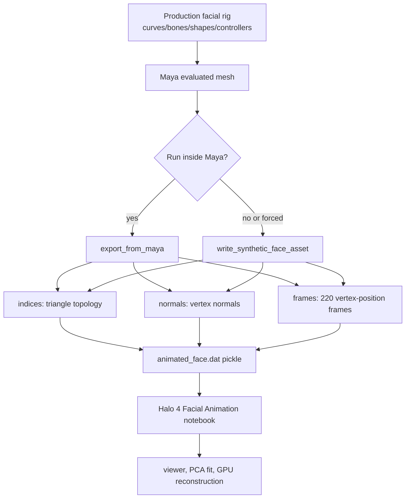

这张图里的重点是边界转换：Maya 里的 rig 关系很复杂，但 exporter 输出的是一个更底层、更稳定的 mesh animation artifact。下游 Halo 案例不需要知道控制曲线和骨骼如何驱动表情，只需要知道每帧顶点在哪里。

## 代码执行路径

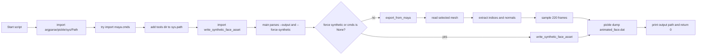

脚本被设计成既能在 Maya Python 环境里跑，也能在普通 Python 环境里跑。普通环境下的 `cmds = None` 是预期状态，不是错误；这会把执行路径导向 synthetic fallback。

## 模块拆解

### 1. 制作侧关系：shape、curve、bone、rig 到 evaluated mesh

真实 Halo facial pipeline 中，动画师可能操作的是面部 rig：控制曲线驱动 blend shapes，骨骼或 joint influence 修正大范围运动，shape targets 处理嘴型、眉眼和细微表情。Maya 在当前帧会把这些关系求值成最终 mesh 顶点位置。

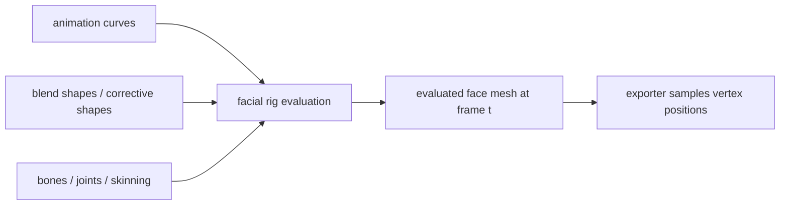

exporter 不试图导出 rig graph。本案例关心的是 Halo-style runtime 数据，所以脚本只抓 evaluated mesh 的结果：三角形连接关系、法线和每帧顶点位置。

### 2. Maya API fallback 与 synthetic writer

脚本开头尝试 `import maya.cmds as cmds`。导入失败时把 `cmds` 设为 `None`，然后从仓库 `tools` 目录导入 `write_synthetic_face_asset`。这个结构让同一个 source file 既能作为 Maya exporter，也能作为自动化可验证的数据生成器。

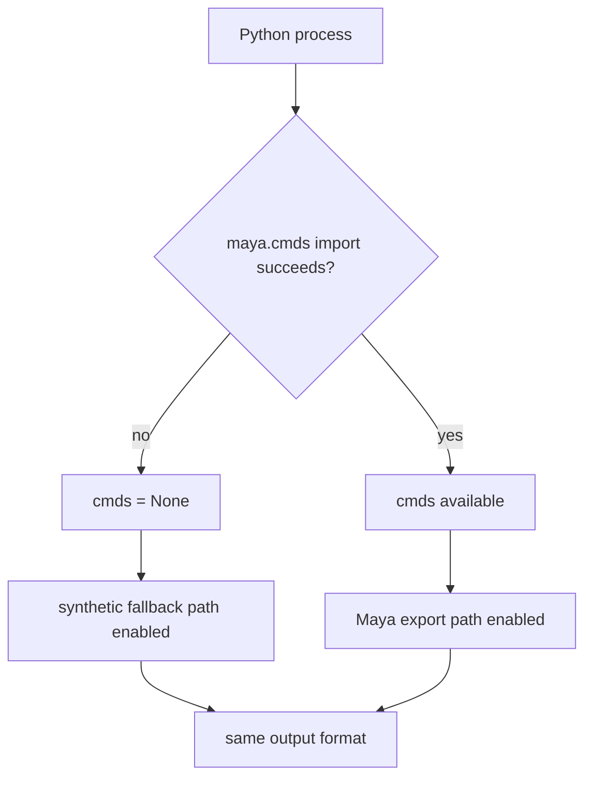

### 3. Maya 导出路径

`export_from_maya(output_path)` 要求场景中已有选中对象。它读取第一个 selected mesh，获取 vertex count 和 face count；三角索引用 `cmds.polyInfo(..., faceToVertex=True)` 逐面解析；法线用 `cmds.polyNormalPerVertex` 逐顶点查询；帧数据则在 `0..219` 上调用 `cmds.currentTime(frame)`，再用 `cmds.xform(..., q=True, t=True)` 获取每个顶点位置。

```mermaid
flowchart TD
    A[cmds.ls(sl=True)] --> B[selected mesh]
    B --> C[polyEvaluate vertex_count/face_count]
    C --> D[polyInfo faceToVertex -> indices]
    C --> E[polyNormalPerVertex -> normals]
    C --> F[for frame in FRAME_COUNT]
    F --> G[currentTime frame]
    G --> H[xform each vertex -> position]
    H --> I[frames list]
    D --> J[pickle tuple]
    E --> J
    I --> J
```

这一路径把 Maya 当前 scene 的动画求值结果固定下来。后续 PCA 不需要 Maya，也不需要 rig，只需要读取 pickle。

### 4. Synthetic fallback 路径

fallback 调用 `tools/generate_halo_face_asset.py` 中的 `write_synthetic_face_asset(output_path)`。该工具生成一个规则网格：`GRID_WIDTH = 12`、`GRID_HEIGHT = 10`，拓扑由网格三角面组成，法线为向上方向，`FRAME_COUNT = 220` 帧中顶点高度由多组正弦/余弦波变化。

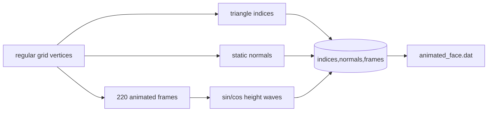

synthetic 数据不代表真实角色脸，但它忠实保留了下游需要的结构：拓扑、法线和逐帧顶点数组。因此它适合做 CI、README 证据和 notebook 读取 smoke test。

### 5. 与 Halo facial animation notebook 的连接

`animated_face.dat` 被下游 notebook 当成面部顶点动画缓存读取。notebook 可以直接播放“每帧上传完整顶点位置”的 ground truth，也可以把 `frames` reshape 成高维矩阵做 PCA：平均形状 + 7 个 component + 每帧权重。最终 shader-style 重建只需要每帧权重，不再每帧从 CPU 向 GPU 传完整顶点缓存。

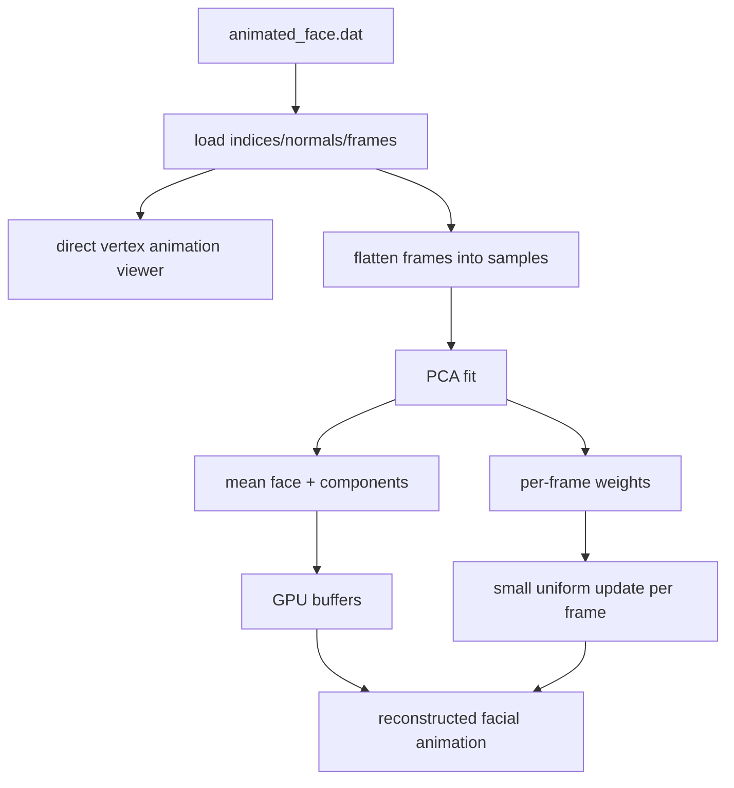

这就是 exporter 与 Halo facial animation 的连接点：exporter 负责把复杂制作数据变成可压缩的顶点矩阵，PCA 案例负责解释这种矩阵如何被压缩和实时渲染。

## 关键 cell / 函数深讲

本篇是 `.py` 支撑模块，没有 notebook cell；下面按源码片段、命令日志和产物摘要对应到函数层面讲解。

### maya-fallback - Maya API fallback and synthetic writer

这段代码建立脚本的双环境能力。Maya 环境可走真实场景导出；普通 Python 环境可走 synthetic fallback；两者输出同一个 `.dat` 结构。

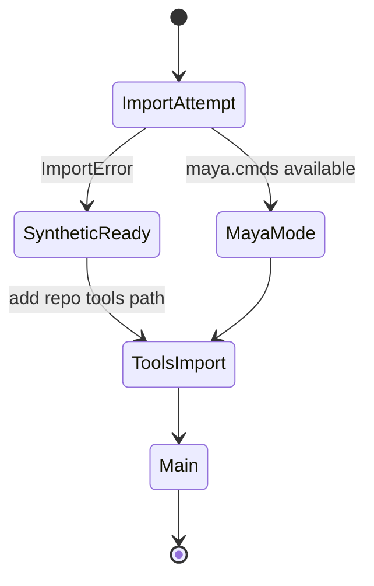

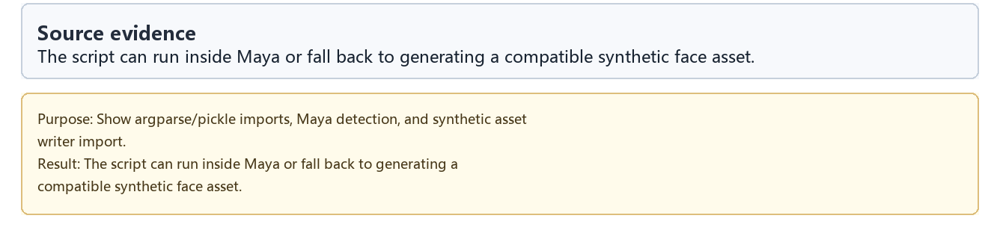

### maya-export - Maya mesh export function

`export_from_maya` 是真实 DCC 导出路径。它一次性记录拓扑和法线，再在时间轴上采样顶点位置。这样做符合 vertex animation 的数据模型：拓扑稳定，位置随帧变化。

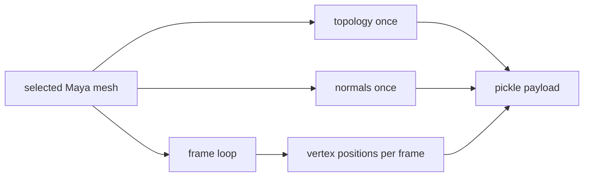

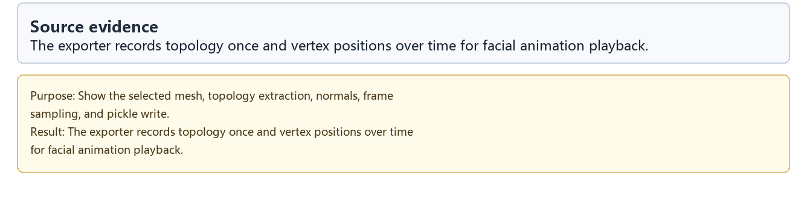

### cli-path - CLI output path and fallback switch

CLI 提供 `--output` 和 `--force-synthetic`。`--output` 让验证脚本或用户指定 artifact 位置；`--force-synthetic` 让普通 Python 环境也能稳定复现，不受是否安装 Maya 影响。

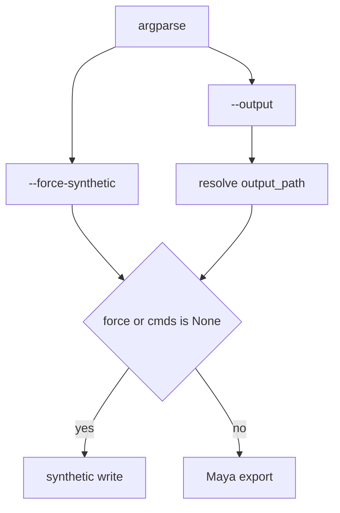

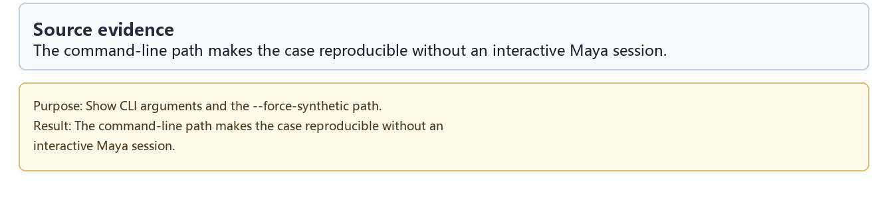

### export-log - Exporter validation log

导出日志说明自动化路径已经成功写出 artifact。对这个模块而言，日志不是视觉结果，而是工程证据：脚本能在没有交互 Maya 的环境下完成输出。

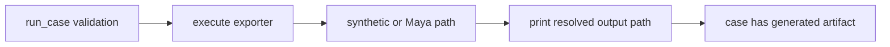

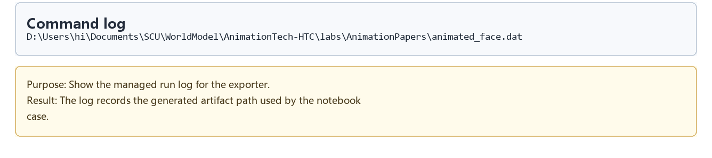

### artifact-summary - animated_face.dat artifact summary

artifact summary 验证 pickle 的结构，而不仅是文件存在。它确认 payload 包含三角索引、法线和逐帧顶点位置，正好对应下游 notebook 的读取假设。

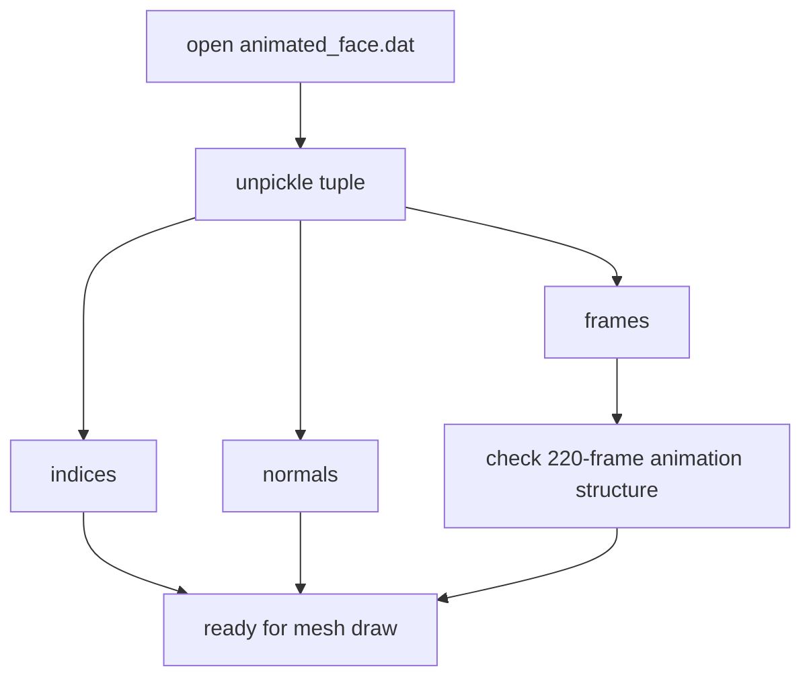

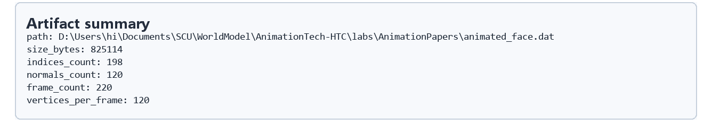

### dataflow - Exporter data flow

数据流证据把脚本从“一个工具文件”放回完整案例：Maya selected mesh 或 synthetic fallback 进入 exporter，产出 `.dat`，再被 Halo 4 Facial Animation notebook 的 viewer 和 PCA pipeline 消费。

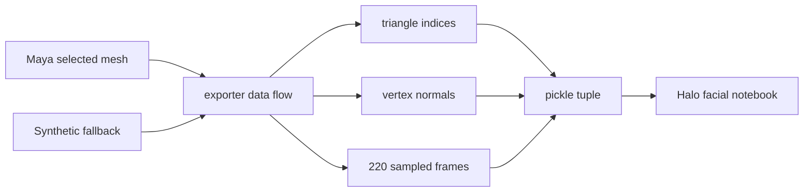

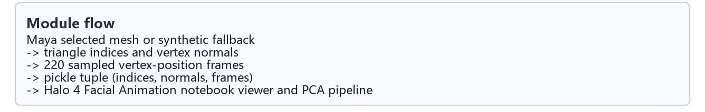

## 关键数据结构

| 名称 | 类型 / 形状 | 生命周期与作用 |
| --- | --- | --- |
| `FRAME_COUNT` | int, `220` | Maya 导出和 synthetic fallback 都采样 220 帧 |
| `cmds` | Maya Python module or `None` | 决定是否可走真实 Maya 导出路径 |
| `TOOLS_DIR` | `Path` | 指向仓库 `tools` 目录，用于导入 synthetic writer |
| `output_path` | `Path` | 目标 `.dat` 文件路径，默认是 `labs/AnimationPapers/animated_face.dat` |
| `selected` / `obj` | Maya selected object | 真实导出路径里的源 mesh |
| `vertex_count` | int | 每帧需要采样的顶点数量 |
| `face_count` | int | 需要解析的 mesh 面数量 |
| `indices` | list of `[a,b,c]` | 三角面顶点索引，描述 mesh topology |
| `normals` | list of `[x,y,z]` | 每个顶点的法线，当前脚本静态记录一次 |
| `frames` | list `[frame][vertex][xyz]` | 顶点动画主体，保存每帧所有顶点位置 |
| `animated_face.dat` | pickle tuple | `(indices, normals, frames)`，下游 notebook 的输入 artifact |
| `GRID_WIDTH/GRID_HEIGHT` | synthetic generator constants | fallback 规则网格的尺寸 |

## 执行结果的意义

脚本成功运行意味着 Halo facial animation notebook 获得了稳定输入：真实 Maya 路径下，它是制作场景中选中面部 mesh 的逐帧顶点动画；普通自动化路径下，它是结构兼容的 synthetic mesh animation。两种路径都服务同一个目标：让后续 PCA 和 shader-style 重建案例从同一种 `(indices, normals, frames)` 数据结构开始。

这也解释了为什么本文强调 shape/curve/bone/rig 关系但不把它们写入 artifact。生产 rig 是生成表情的工具；Halo-style runtime 不需要复现 rig，只需要复现每一帧的最终脸部形状。exporter 正是把“制作侧可控性”转换成“运行时可压缩顶点数据”的桥。

## 重点可视化 / 动画

这个模块本身是导出工具，不强行包装成算法动画。正文只引用源码摘录、产物摘要、数据流和 walkthrough；学习卡放在后续证据表里。

| 片段 | 重点媒体 | visual_subject | media_role | 捕获方式 | 结果说明 |
| --- | --- | --- | --- | --- | --- |
| maya-fallback | [结果 PNG](assets/01_maya_fallback_imports_result.png) | Maya API fallback and synthetic writer | `code_evidence` | `code_evidence` | 展示双环境入口 |
| maya-export | [结果 PNG](assets/02_maya_export_function_result.png) | Maya mesh export function | `code_evidence` | `code_evidence` | 展示真实 Maya mesh 采样路径 |
| cli-path | [结果 PNG](assets/03_cli_entrypoint_result.png) | CLI output path and fallback switch | `code_evidence` | `code_evidence` | 展示可复现命令行入口 |
| export-log | [结果 PNG](assets/04_export_command_log_result.png) | Exporter validation log | `code_evidence` | `code_evidence` | 记录 artifact 输出路径 |
| artifact-summary | [结果 PNG](assets/05_animated_face_artifact_summary_result.png) | animated_face.dat artifact summary | `code_evidence` | `artifact_summary` | 验证 topology、normals、frames |
| dataflow | [结果 PNG](assets/06_exporter_dataflow_result.png) | Exporter data flow | `code_evidence` | `artifact_summary` | 连接 exporter 与 Halo notebook |
| walkthrough | [WebM](assets/00-walkthrough.webm) | module walkthrough | 补充证据 | `step_sequence` | 辅助回放源码证据顺序 |

## 源码模块与执行证据

| 片段 | 输出类型 | 媒体角色 | 捕获方式 | 发布必需 | 结果媒体 | 代码学习卡 |
| --- | --- | --- | --- | --- | --- | --- |
| `maya-fallback` | `source_excerpt` | `code_evidence` | `code_evidence` | `false` | [PNG](assets/01_maya_fallback_imports_result.png) | [PNG](assets/01_maya_fallback_imports.png) |
| `maya-export` | `source_excerpt` | `code_evidence` | `code_evidence` | `false` | [PNG](assets/02_maya_export_function_result.png) | [PNG](assets/02_maya_export_function.png) |
| `cli-path` | `source_excerpt` | `code_evidence` | `code_evidence` | `false` | [PNG](assets/03_cli_entrypoint_result.png) | [PNG](assets/03_cli_entrypoint.png) |
| `export-log` | `command_log` | `code_evidence` | `code_evidence` | `false` | [PNG](assets/04_export_command_log_result.png) | [PNG](assets/04_export_command_log.png) |
| `artifact-summary` | `artifact_summary` | `code_evidence` | `artifact_summary` | `false` | [PNG](assets/05_animated_face_artifact_summary_result.png) | [PNG](assets/05_animated_face_artifact_summary.png) |
| `dataflow` | `diagram` | `code_evidence` | `artifact_summary` | `false` | [PNG](assets/06_exporter_dataflow_result.png) | [PNG](assets/06_exporter_dataflow.png) |

## 运行方式

自动化验证使用：

```powershell
powershell -NoProfile -ExecutionPolicy Bypass -File .\tools\run_case.ps1 halo_4_exporter_from_maya
```

普通 Python 环境下可显式走 synthetic fallback：

```powershell
python "labs/AnimationPapers/Halo 4 exporter from maya.py" --force-synthetic --output "labs/AnimationPapers/animated_face.dat"
```

在 Maya Python 环境中，选中目标 mesh 后省略 `--force-synthetic`，脚本会尝试读取当前选中对象并导出真实逐帧顶点动画。本 README 只引用已有源码摘录、日志和产物摘要证据。
