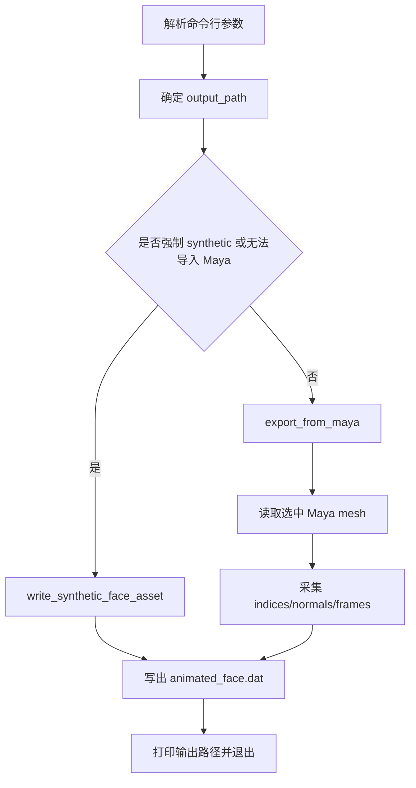
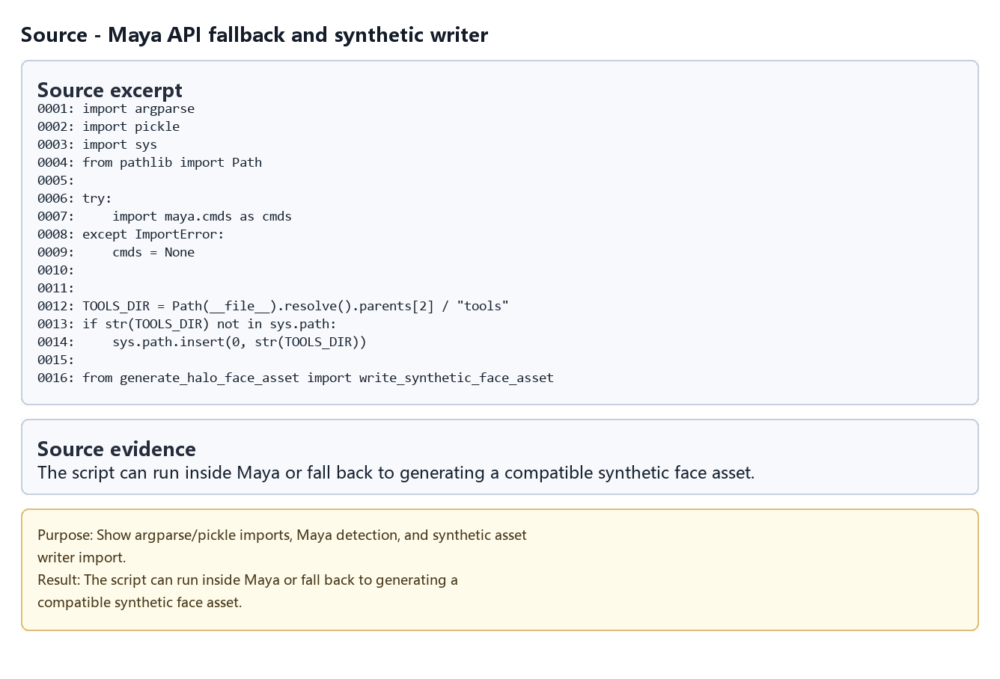
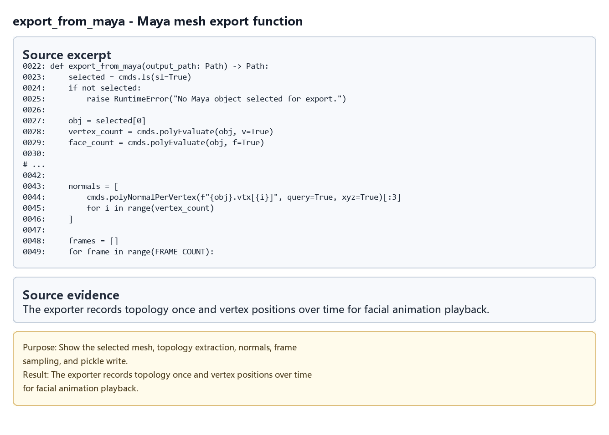
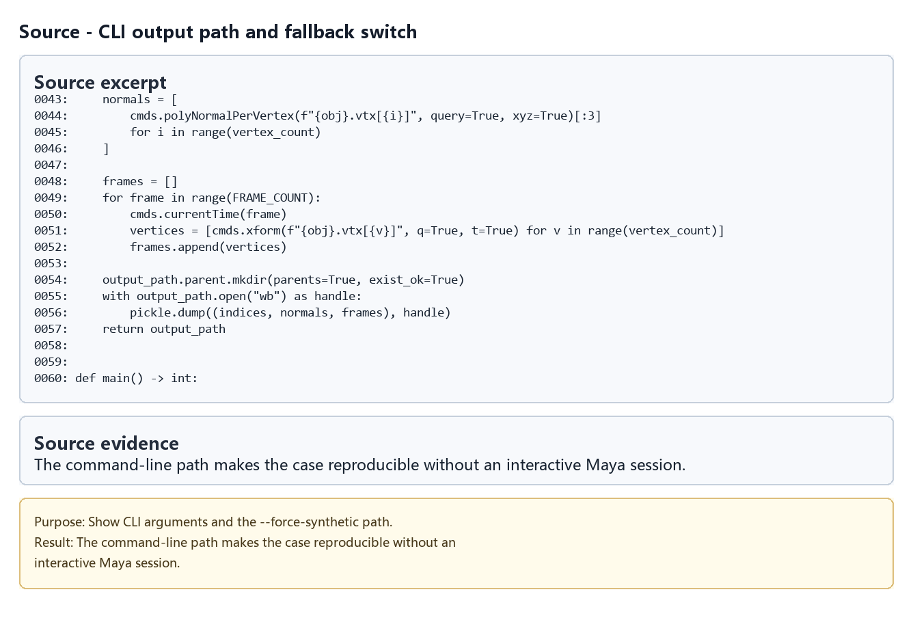
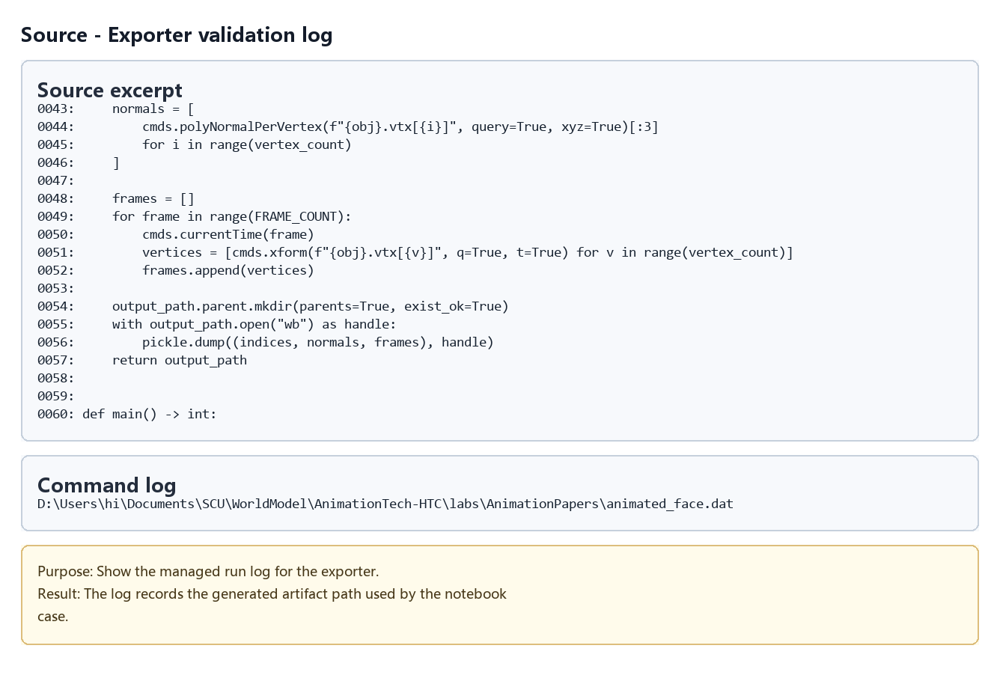
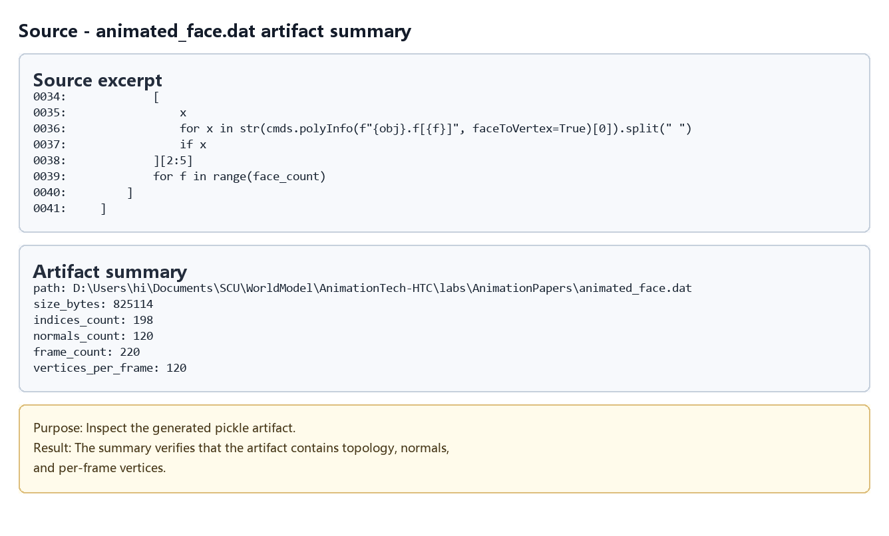
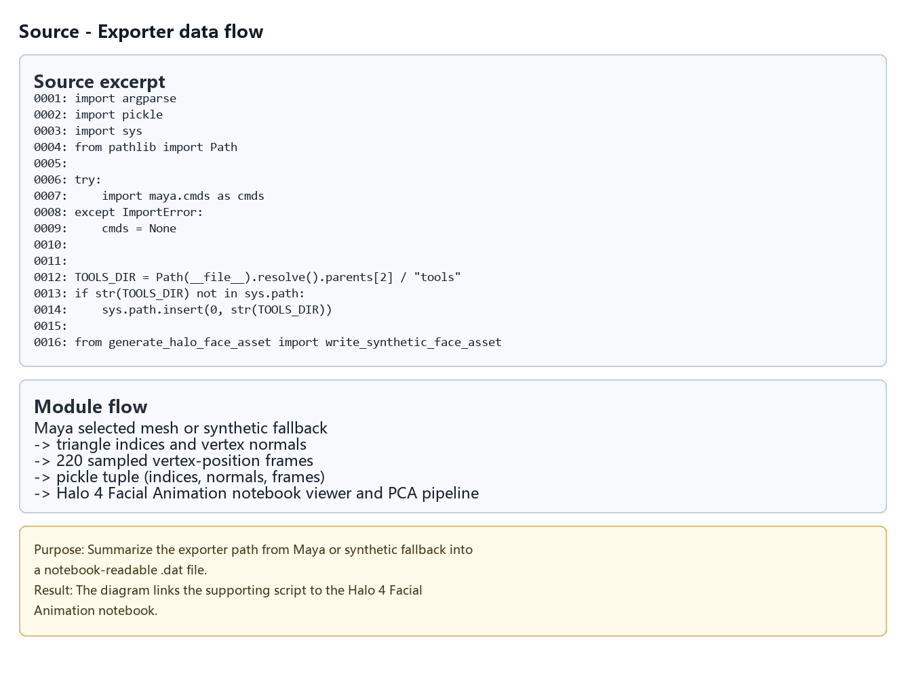

# Halo 4 Exporter from Maya

## 元数据

| 字段 | 内容 |
| --- | --- |
| slug | `halo_4_exporter_from_maya` |
| source path | [`labs/AnimationPapers/Halo 4 exporter from maya.py`](../../../../labs/AnimationPapers/Halo%204%20exporter%20from%20maya.py) |
| env prefix | `.envs/halo_4_exporter_from_maya` |
| kernel | `animationtech-halo_4_exporter_from_maya` |
| validation status | `passed`，`automated`；脚本级验证已通过 |

## 问题背景

这个文件不是浏览器 notebook，而是 Halo 4 面部动画案例的数据导出支撑脚本。真实制作流程中，面部网格和逐帧顶点位置可能来自 Maya；但自动化环境通常没有 Maya，也没有当前选择的 DCC 场景对象。因此脚本同时提供 Maya 导出路径和 synthetic fallback 路径，保证下游 notebook 需要的 `animated_face.dat` 可以稳定生成。

输出文件保存为 pickle，内容为 `(indices, normals, frames)`：三角面索引、顶点法线和 220 帧顶点动画。这个格式供 Halo 4 facial animation notebook 继续做面部网格播放、PCA 或 shader 相关实验。

## 总模块图



## 模块拆解

1. **Maya API 探测**
   脚本尝试 `import maya.cmds as cmds`。导入失败时把 `cmds` 设为 `None`，让同一份脚本能在普通 Python 环境中走 fallback，而不是因为缺少 Maya 包直接崩溃。

2. **工具路径注入**
   通过 `Path(__file__).resolve().parents[2] / "tools"` 找到仓库的 `tools` 目录，并把它加入 `sys.path`。随后导入 `generate_halo_face_asset.write_synthetic_face_asset`，用于生成合成面部动画数据。

3. **Maya 导出**
   `export_from_maya(output_path)` 要求 Maya 场景中已有选中物体。函数读取选中 mesh 的顶点数和面数，逐面提取三角索引，逐顶点提取法线，并在 `FRAME_COUNT = 220` 帧内逐帧调用 `cmds.currentTime` 与 `cmds.xform` 采集顶点位置。

4. **Synthetic fallback**
   当传入 `--force-synthetic` 或无法导入 Maya 时，`main` 调用 `write_synthetic_face_asset(output_path)`。该工具函数会生成一个规则网格，并用多组正弦波创建 220 帧顶点高度变化，保持与真实导出相同的 `(indices, normals, frames)` 格式。

5. **命令行入口**
   `main` 使用 `argparse` 提供 `--output` 和 `--force-synthetic`。默认输出路径是同目录的 `animated_face.dat`。脚本成功后打印生成文件的绝对路径，并以 `0` 退出。

## 关键数据结构

- `FRAME_COUNT`：导出或合成的动画帧数，当前为 `220`。
- `indices`：三角面顶点索引列表，描述面部网格拓扑。
- `normals`：每个顶点的法线向量。
- `frames`：逐帧顶点位置列表，结构为 `frame -> vertex -> [x, y, z]`。
- `output_path`：目标 `.dat` 文件路径，默认是 `labs/AnimationPapers/animated_face.dat`。
- `write_synthetic_face_asset`：无 Maya 环境下生成兼容数据的工具函数。
- `export_from_maya`：从当前 Maya 选中 mesh 导出真实数据的函数。

## 执行结果的意义

脚本运行成功意味着下游 Halo 4 面部动画案例可以拿到稳定的面部网格动画资产。若在 Maya 内运行，它会捕获真实选中模型的逐帧顶点变化；若在普通自动化环境运行，它会生成结构兼容的合成数据，让后续 notebook 和 case 验证不用依赖 DCC 软件。

## 源码模块与执行证据

本节把 Python module 当作支撑子工程来阅读：每个条目绑定源码片段、命令日志、产物摘要或流程图，说明它如何服务对应 notebook 案例。


| 片段 | 输出类型 | 代码/证据做什么 | 结果说明什么 | 素材 |
| --- | --- | --- | --- | --- |
| `maya-fallback` | `source_excerpt` | Show argparse/pickle imports, Maya detection, and synthetic asset writer import. | The script can run inside Maya or fall back to generating a compatible synthetic face asset. | [PNG](assets/01_maya_fallback_imports.png) |
| `export_from_maya` | `source_excerpt` | Show the selected mesh, topology extraction, normals, frame sampling, and pickle write. | The exporter records topology once and vertex positions over time for facial animation playback. | [PNG](assets/02_maya_export_function.png) |
| `cli-path` | `source_excerpt` | Show CLI arguments and the --force-synthetic path. | The command-line path makes the case reproducible without an interactive Maya session. | [PNG](assets/03_cli_entrypoint.png) |
| `export-log` | `command_log` | Show the managed run log for the exporter. | The log records the generated artifact path used by the notebook case. | [PNG](assets/04_export_command_log.png) |
| `artifact-summary` | `artifact_summary` | Inspect the generated pickle artifact. | The summary verifies that the artifact contains topology, normals, and per-frame vertices. | [PNG](assets/05_animated_face_artifact_summary.png) |
| `dataflow` | `diagram` | Summarize the exporter path from Maya or synthetic fallback into a notebook-readable .dat file. | The diagram links the supporting script to the Halo 4 Facial Animation notebook. | [PNG](assets/06_exporter_dataflow.png) |

### maya-fallback - Maya API fallback and synthetic writer

- 代码/证据做什么?Show argparse/pickle imports, Maya detection, and synthetic asset writer import.
- 运行后看到什么：源码片段。
- 结果说明什么：The script can run inside Maya or fall back to generating a compatible synthetic face asset.



### export_from_maya - Maya mesh export function

- 代码/证据做什么?Show the selected mesh, topology extraction, normals, frame sampling, and pickle write.
- 运行后看到什么：源码片段。
- 结果说明什么：The exporter records topology once and vertex positions over time for facial animation playback.



### cli-path - CLI output path and fallback switch

- 代码/证据做什么?Show CLI arguments and the --force-synthetic path.
- 运行后看到什么：源码片段。
- 结果说明什么：The command-line path makes the case reproducible without an interactive Maya session.



### export-log - Exporter validation log

- 代码/证据做什么?Show the managed run log for the exporter.
- 运行后看到什么：命令日志。
- 结果说明什么：The log records the generated artifact path used by the notebook case.



### artifact-summary - animated_face.dat artifact summary

- 代码/证据做什么?Inspect the generated pickle artifact.
- 运行后看到什么：产物摘要。
- 结果说明什么：The summary verifies that the artifact contains topology, normals, and per-frame vertices.



### dataflow - Exporter data flow

- 代码/证据做什么?Summarize the exporter path from Maya or synthetic fallback into a notebook-readable .dat file.
- 运行后看到什么：模块流程图。
- 结果说明什么：The diagram links the supporting script to the Halo 4 Facial Animation notebook.



## 运行方式

通过 case runner 做自动化验证：

```powershell
powershell -NoProfile -ExecutionPolicy Bypass -File .\tools\run_case.ps1 halo_4_exporter_from_maya
```

也可以直接运行脚本生成指定输出。普通 Python 环境建议显式使用 synthetic fallback：

```powershell
python "labs/AnimationPapers/Halo 4 exporter from maya.py" --force-synthetic --output "labs/AnimationPapers/animated_face.dat"
```

在 Maya 的 Python 环境中，选中目标 mesh 后可省略 `--force-synthetic`，脚本会尝试走真实导出路径。

## 重点可视化 / 动画

本节只放 `key_visual` 与 `key_animation` 的算法结果媒体。代码学习卡不作为正文主视觉；它们只在后续证据表中用于复现 cell 或源码上下文。


| Cell | 输出类型 | 媒体角色 | 可视化主体 | 捕获方式 | 结果媒体 |
| --- | --- | --- | --- | --- | --- |


## 代码 Cell 与可视化结果

本节保留每个 cell 的可复现证据。结果 PNG 用于正文阅读，代码卡记录代码摘要与输出来源；有 timeline 或参数滑杆的 cell 同时提供 GIF、MP4 和 WebM。

| Cell / 片段 | 结果说明 | 证据 |
| --- | --- | --- |
| maya-fallback | The script can run inside Maya or fall back to generating a compatible synthetic face asset. | [结果 PNG](assets/01_maya_fallback_imports_result.png) / [代码卡](assets/01_maya_fallback_imports.png) |
| maya-export | The exporter records topology once and vertex positions over time for facial animation playback. | [结果 PNG](assets/02_maya_export_function_result.png) / [代码卡](assets/02_maya_export_function.png) |
| cli-path | The command-line path makes the case reproducible without an interactive Maya session. | [结果 PNG](assets/03_cli_entrypoint_result.png) / [代码卡](assets/03_cli_entrypoint.png) |
| export-log | The log records the generated artifact path used by the notebook case. | [结果 PNG](assets/04_export_command_log_result.png) / [代码卡](assets/04_export_command_log.png) |
| artifact-summary | The summary verifies that the artifact contains topology, normals, and per-frame vertices. | [结果 PNG](assets/05_animated_face_artifact_summary_result.png) / [代码卡](assets/05_animated_face_artifact_summary.png) |
| dataflow | The diagram links the supporting script to the Halo 4 Facial Animation notebook. | [结果 PNG](assets/06_exporter_dataflow_result.png) / [代码卡](assets/06_exporter_dataflow.png) |
