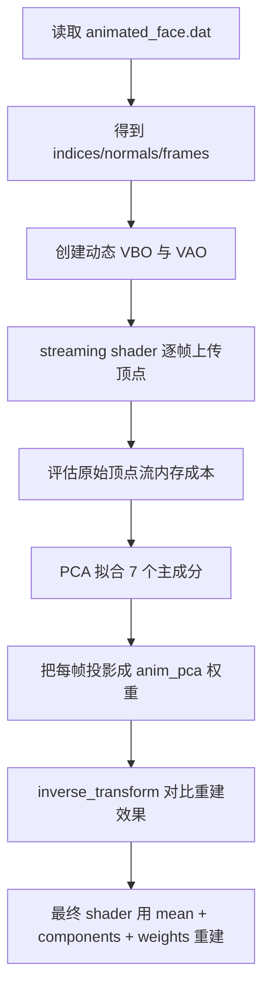
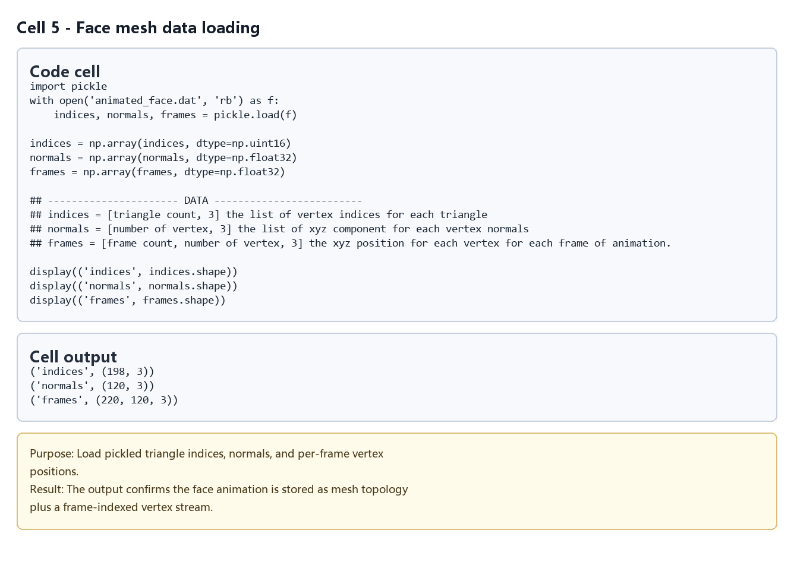
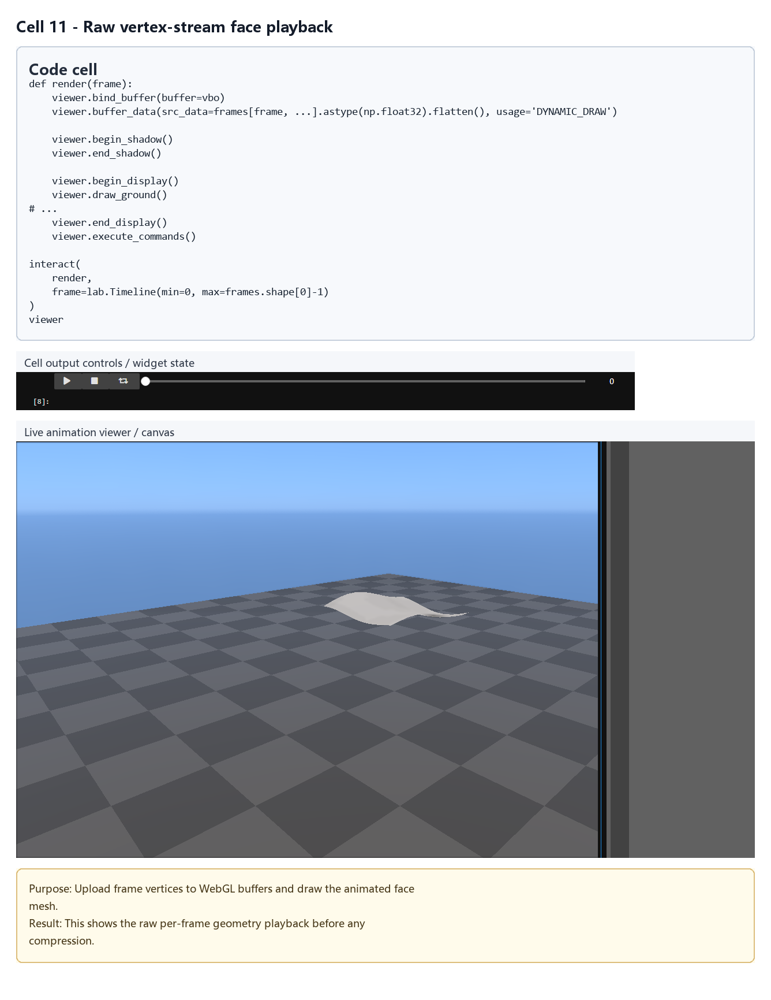
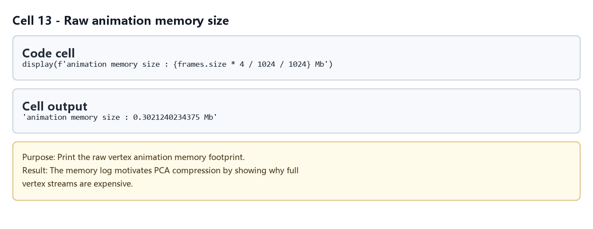
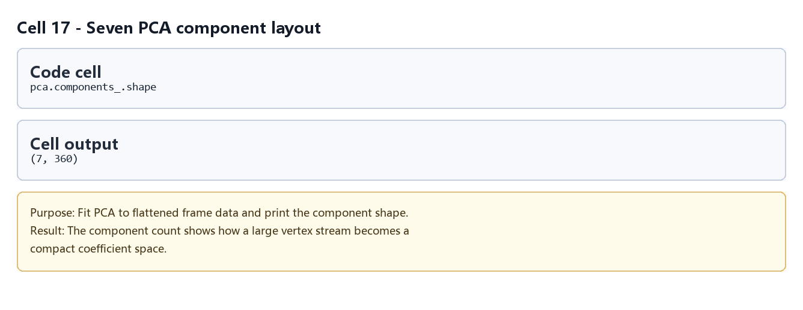
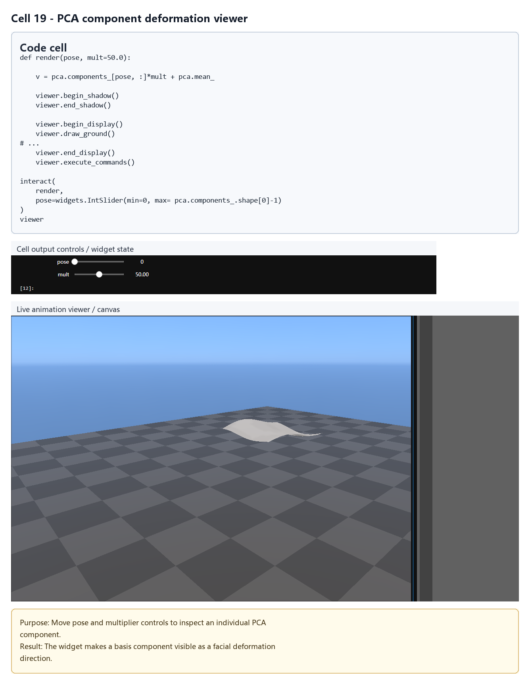
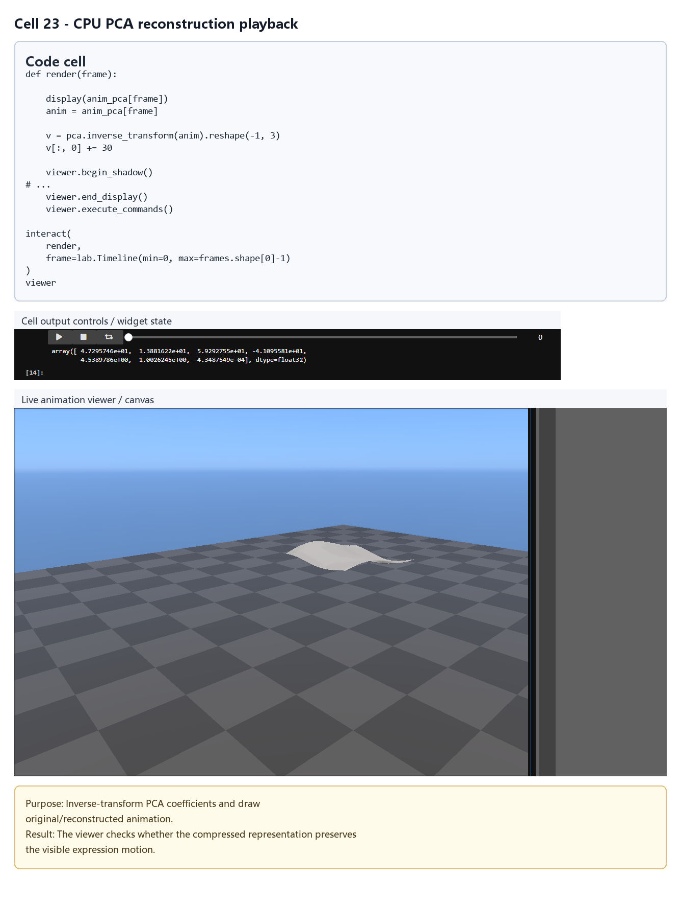
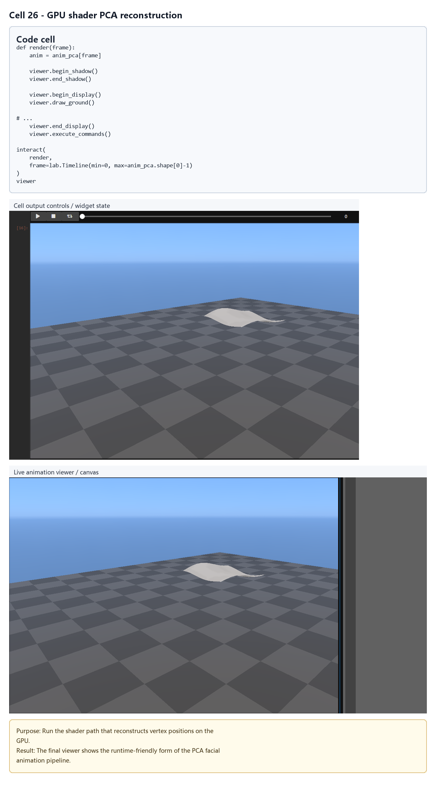

# Halo 4 Facial Animation：PCA 顶点动画压缩

## 元数据

| 字段 | 值 |
| --- | --- |
| slug | `halo_4_facial_animation` |
| source path | `labs/AnimationPapers/Halo 4 Facial Animation.ipynb` |
| env prefix | `.envs/halo_4_facial_animation` |
| kernel | `animationtech-halo_4_facial_animation` |
| validation status | `passed`（`manual_smoke`；自动执行通过，仍需 JupyterLab 手动冒烟） |

## 问题背景

Halo 4 facial animations 这个 notebook 演示如何用主成分分析压缩面部顶点动画。原始数据是逐帧的完整头部顶点位置流：每帧都要把大量位置数据送到 GPU，内存和带宽都很昂贵。Notebook 先实现最直接的动态顶点流渲染，再用 PCA 把 220 帧面部动画压缩成 7 个主成分权重，最后写 shader 在 GPU 端用 mean head 和 7 个 component head 重建最终顶点位置。

案例配置中记录的生成产物是 `labs/AnimationPapers/animated_face.dat`，公开资源包含 `halo_animated_face` 和 `ipyanimlab_package_assets`。

## 总模块图



## 模块拆解

### 1. 数据读取

Notebook 通过 `pickle` 打开 `animated_face.dat`，读取 `indices`、`normals` 和 `frames`。其中 `frames` 是 220 帧顶点位置动画，后续会被 reshape 成 `[220, -1]` 作为 PCA 输入矩阵。

### 2. 构建 streaming shader

第一版渲染直接把 `frames[frame]` 展平成动态 VBO：`viewer.bind_buffer(buffer=vbo)` 后调用 `viewer.buffer_data(...)` 更新当前帧顶点位置。`vbo_normals` 保存法线，`vao` 描述顶点属性，shader 负责把流式顶点位置送入常规渲染管线。

### 3. 暴露原始数据成本

Notebook 用 `frames.size * 4 / 1024 / 1024` 估算完整顶点流的内存占用。这个步骤说明为什么不能只依赖逐帧顶点缓存：面部表情细节多、帧数多时，直接 streaming 会很快变成存储和传输瓶颈。

### 4. PCA 压缩

`data = frames.reshape(220, -1)` 后，`decomposition.PCA(n_components=7)` 提取 7 个主成分。PCA 会保留 `pca.mean_` 作为平均脸，并把主要变化方向放进 `pca.components_`。这些 component 可以理解为可加权的“表情基”。

### 5. 主成分检查与逐帧权重

Notebook 用 slider 放大显示单个 component，检查它捕获的局部形变是否合理。随后 `anim_pca = pca.transform(data)` 将每一帧压成 7 个系数。原来每帧需要完整顶点数组，现在每帧只需要 7 个权重加上共享的 mean/components。

### 6. PCA 重建与最终 shader

中间版本用 `pca.inverse_transform(anim_pca[frame])` 在 CPU 端重建完整头部，并把原始流与 PCA 重建结果并排比较。最终版本创建 `vbo_mean` 和 `vbo_pca_0` 到 `vbo_pca_6`，shader 接收 7 个权重，在顶点阶段直接计算最终位置，避免每帧上传完整顶点流。

## 关键数据结构

| 名称 | 形状或类型 | 作用 |
| --- | --- | --- |
| `indices` | index buffer | 头模三角形索引 |
| `normals` | `[vertex_count, 3]` | 顶点法线 |
| `frames` | `[220, vertex_count, 3]` | 原始逐帧顶点位置流 |
| `data` | `[220, vertex_count * 3]` | PCA 的二维输入矩阵 |
| `pca.mean_` | `[vertex_count * 3]` | 平均脸顶点位置 |
| `pca.components_` | `[7, vertex_count * 3]` | 7 个主成分形变方向 |
| `anim_pca` | `[220, 7]` | 每帧的 PCA 权重 |
| `vbo_mean` / `vbo_pca_*` | GPU buffer | shader 重建时使用的共享形变数据 |

## 执行结果的意义

这份 notebook 展示了一个典型的面部动画压缩思路：把高维顶点序列拆成少量共享形变基和逐帧权重。PCA 重建结果如果与原始流足够接近，就说明主要表情变化已被 7 个分量捕获；最终 shader 版本则说明这些权重可以直接用于实时渲染管线，而不必每帧上传完整 mesh。

## 代码 Cell 与可视化结果

本节按 notebook 的关键 code cell 组织学习素材：每个条目都对应代码目的、实际输出类型、结果意义和 PNG 学习卡片。PNG 由指定 cell 的代码摘要、输出区、viewer/canvas 或图表/日志合成，不使用整页滚动截图替代。

<video controls muted src="assets/00-walkthrough.webm"></video>

[下载 WebM](assets/00-walkthrough.webm)

| Cell | 输出类型 | 代码做什么 | 结果说明什么 | 素材 |
| --- | --- | --- | --- | --- |
| 5 | `table` | Load pickled triangle indices, normals, and per-frame vertex positions. | The output confirms the face animation is stored as mesh topology plus a frame-indexed vertex stream. | [PNG](assets/01_data_load_shapes.png) |
| 11 | `timeline_viewer` | Upload frame vertices to WebGL buffers and draw the animated face mesh. | This shows the raw per-frame geometry playback before any compression. | [PNG](assets/02_raw_vertex_stream_viewer.png) |
| 13 | `log` | Print the raw vertex animation memory footprint. | The memory log motivates PCA compression by showing why full vertex streams are expensive. | [PNG](assets/03_memory_size_log.png) |
| 17 | `table` | Fit PCA to flattened frame data and print the component shape. | The component count shows how a large vertex stream becomes a compact coefficient space. | [PNG](assets/04_pca_components_shape.png) |
| 19 | `widget_controls` | Move pose and multiplier controls to inspect an individual PCA component. | The widget makes a basis component visible as a facial deformation direction. | [PNG](assets/05_pca_component_viewer.png) |
| 23 | `timeline_viewer` | Inverse-transform PCA coefficients and draw original/reconstructed animation. | The viewer checks whether the compressed representation preserves the visible expression motion. | [PNG](assets/06_cpu_reconstruction_compare.png) |
| 26 | `timeline_viewer` | Run the shader path that reconstructs vertex positions on the GPU. | The final viewer shows the runtime-friendly form of the PCA facial animation pipeline. | [PNG](assets/07_gpu_shader_reconstruction.png) |

### Cell 5 - Face mesh data loading

- 代码做什么：Load pickled triangle indices, normals, and per-frame vertex positions.
- 运行后看到什么：表格或结构化数据输出。
- 结果说明什么：The output confirms the face animation is stored as mesh topology plus a frame-indexed vertex stream.



### Cell 11 - Raw vertex-stream face playback

- 代码做什么：Upload frame vertices to WebGL buffers and draw the animated face mesh.
- 运行后看到什么：带 timeline 的可播放 viewer。
- 结果说明什么：This shows the raw per-frame geometry playback before any compression.



### Cell 13 - Raw animation memory size

- 代码做什么：Print the raw vertex animation memory footprint.
- 运行后看到什么：运行日志或文本输出。
- 结果说明什么：The memory log motivates PCA compression by showing why full vertex streams are expensive.



### Cell 17 - Seven PCA component layout

- 代码做什么：Fit PCA to flattened frame data and print the component shape.
- 运行后看到什么：表格或结构化数据输出。
- 结果说明什么：The component count shows how a large vertex stream becomes a compact coefficient space.



### Cell 19 - PCA component deformation viewer

- 代码做什么：Move pose and multiplier controls to inspect an individual PCA component.
- 运行后看到什么：交互控件状态。
- 结果说明什么：The widget makes a basis component visible as a facial deformation direction.



### Cell 23 - CPU PCA reconstruction playback

- 代码做什么：Inverse-transform PCA coefficients and draw original/reconstructed animation.
- 运行后看到什么：带 timeline 的可播放 viewer。
- 结果说明什么：The viewer checks whether the compressed representation preserves the visible expression motion.



### Cell 26 - GPU shader PCA reconstruction

- 代码做什么：Run the shader path that reconstructs vertex positions on the GPU.
- 运行后看到什么：带 timeline 的可播放 viewer。
- 结果说明什么：The final viewer shows the runtime-friendly form of the PCA facial animation pipeline.



## 运行方式

启动 AnimationPapers 的 JupyterLab 环境后，打开 `labs/AnimationPapers/Halo 4 Facial Animation.ipynb`，选择 kernel `animationtech-halo_4_facial_animation` 按 cell 顺序运行。

```powershell
powershell -NoProfile -ExecutionPolicy Bypass -File .\tools\start_animationpapers_lab.ps1
powershell -NoProfile -ExecutionPolicy Bypass -File .\tools\run_case.ps1 halo_4_facial_animation
```

本文档只整理 notebook 结构与工程含义，未重新执行 notebook。
