# Halo 4 Facial Animation：PCA 顶点动画压缩

## 元数据

| 字段 | 值 |
| --- | --- |
| slug | `halo_4_facial_animation` |
| source path | `labs/AnimationPapers/Halo 4 Facial Animation.ipynb` |
| env prefix | `.envs/halo_4_facial_animation` |
| kernel | `animationtech-halo_4_facial_animation` |
| validation status | 自动执行已通过；交互部分仍建议在 JupyterLab 中人工检查 |

## 问题背景

Halo 4 facial animations 这个 notebook 演示如何用主成分分析压缩面部顶点动画。原始数据是逐帧的完整头部顶点位置流：每帧都要把大量位置数据送到 GPU，内存和带宽都很昂贵。Notebook 先实现最直接的动态顶点流渲染，再用 PCA 把 220 帧面部动画压缩成 7 个主成分权重，最后写 shader 在 GPU 端用 mean head 和 7 个 component head 重建最终顶点位置。

案例配置中记录的生成产物是 `labs/AnimationPapers/animated_face.dat`，公开资源包含 `halo_animated_face` 和 `ipyanimlab_package_assets`。

## 阅读前置知识

读这篇前最好先熟悉四件事：

- **网格与顶点流**：知道三角形索引、顶点位置、法线、VBO/VAO 如何一起构成可渲染 mesh。
- **GPU shader 基础**：理解 vertex shader 可以用 buffer 数据和 uniform 权重在顶点阶段重建位置。
- **PCA 压缩直觉**：把大量高维顶点形变分解成平均形状、少量主成分和逐帧系数。
- **Jupyter 交互 viewer**：能区分一次性表格输出、时间轴播放和 slider 控件观察到的结果。

## 总模块图

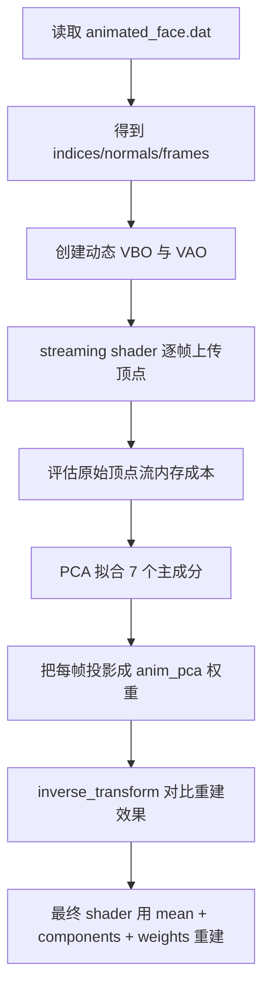

## 代码执行路径

Notebook 的执行顺序可以按“原始流播放 -> 压缩分析 -> GPU 重建”来读。

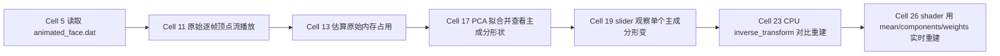

这条路径先故意展示“最贵但最直接”的做法，再一步步把每帧完整顶点数据替换成 7 个权重。最后的 shader 版本才是运行时友好的形式：静态 buffer 保存平均脸和主成分，每帧只更新少量系数。

## 模块拆解

### 1. 数据读取

Notebook 通过 `pickle` 打开 `animated_face.dat`，读取 `indices`、`normals` 和 `frames`。其中 `frames` 是 220 帧顶点位置动画，后续会被 reshape 成 `[220, -1]` 作为 PCA 输入矩阵。

### 2. 构建 streaming shader

第一版渲染直接把 `frames[frame]` 展平成动态 VBO：`viewer.bind_buffer(buffer=vbo)` 后调用 `viewer.buffer_data(...)` 更新当前帧顶点位置。`vbo_normals` 保存法线，`vao` 描述顶点属性，shader 负责把流式顶点位置送入常规渲染管线。

### 3. 暴露原始数据成本

Notebook 用 `frames.size * 4 / 1024 / 1024` 估算完整顶点流的内存占用。这个步骤说明为什么不能只依赖逐帧顶点缓存：面部表情细节多、帧数多时，直接 streaming 会很快变成存储和传输瓶颈。

### 4. PCA 压缩

`data = frames.reshape(220, -1)` 后，`decomposition.PCA(n_components=7)` 提取 7 个主成分。PCA 会保留 `pca.mean_` 作为平均脸，并把主要变化方向放进 `pca.components_`。这些 component 可以理解为可加权的“表情基”。

### 5. 主成分检查与逐帧权重

Notebook 用 slider 放大显示单个 component，检查它捕获的局部形变是否合理。随后 `anim_pca = pca.transform(data)` 将每一帧压成 7 个系数。原来每帧需要完整顶点数组，现在每帧只需要 7 个权重加上共享的 mean/components。

### 6. PCA 重建与最终 shader

中间版本用 `pca.inverse_transform(anim_pca[frame])` 在 CPU 端重建完整头部，并把原始流与 PCA 重建结果并排比较。最终版本创建 `vbo_mean` 和 `vbo_pca_0` 到 `vbo_pca_6`，shader 接收 7 个权重，在顶点阶段直接计算最终位置，避免每帧上传完整顶点流。

## 关键数据结构

| 名称 | 形状或类型 | 作用 |
| --- | --- | --- |
| `indices` | index buffer | 头模三角形索引 |
| `normals` | `[vertex_count, 3]` | 顶点法线 |
| `frames` | `[220, vertex_count, 3]` | 原始逐帧顶点位置流 |
| `data` | `[220, vertex_count * 3]` | PCA 的二维输入矩阵 |
| `pca.mean_` | `[vertex_count * 3]` | 平均脸顶点位置 |
| `pca.components_` | `[7, vertex_count * 3]` | 7 个主成分形变方向 |
| `anim_pca` | `[220, 7]` | 每帧的 PCA 权重 |
| `vbo_mean` / `vbo_pca_*` | GPU buffer | shader 重建时使用的共享形变数据 |

## 执行结果的意义

这份 notebook 展示了一个典型的面部动画压缩思路：把高维顶点序列拆成少量共享形变基和逐帧权重。PCA 重建结果如果与原始流足够接近，就说明主要表情变化已被 7 个分量捕获；最终 shader 版本则说明这些权重可以直接用于实时渲染管线，而不必每帧上传完整 mesh。

## 关键 cell / 函数深讲

### Cell 5 - Face mesh data loading

加载被序列化为 picke 文件的三角面片索引、法线，以及逐帧的顶点位置流。

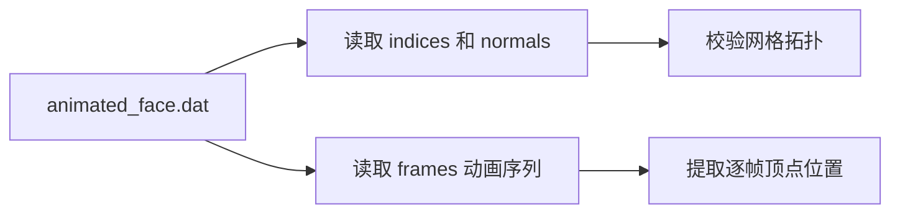

- 代码做什么：Load pickled triangle indices, normals, and per-frame vertex positions.
- 运行后看到什么：`table`
- 结果说明什么：输出确认面部动画由 mesh 拓扑和按帧索引的顶点流组成。
- 可视化主体：Face mesh data loading
- 捕获方式：`table/output`

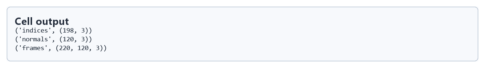

### Cell 11 - Raw vertex-stream face playback

将逐帧顶点上传到 WebGL buffer 中，直接渲染动画的人脸网格。不加任何压缩。

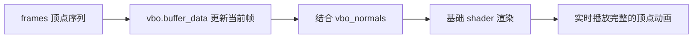

- 代码做什么：Upload frame vertices to WebGL buffers and draw the animated face mesh.
- 运行后看到什么：`timeline_viewer`
- 结果说明什么：展示压缩前逐帧几何数据的播放效果。
- 可视化主体：Raw vertex-stream face playback
- 捕获方式：`canvas`

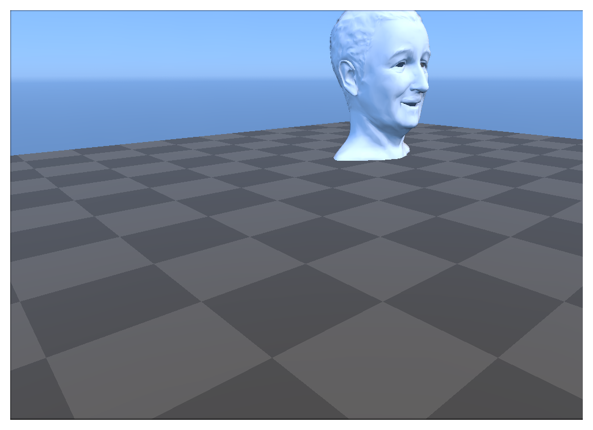

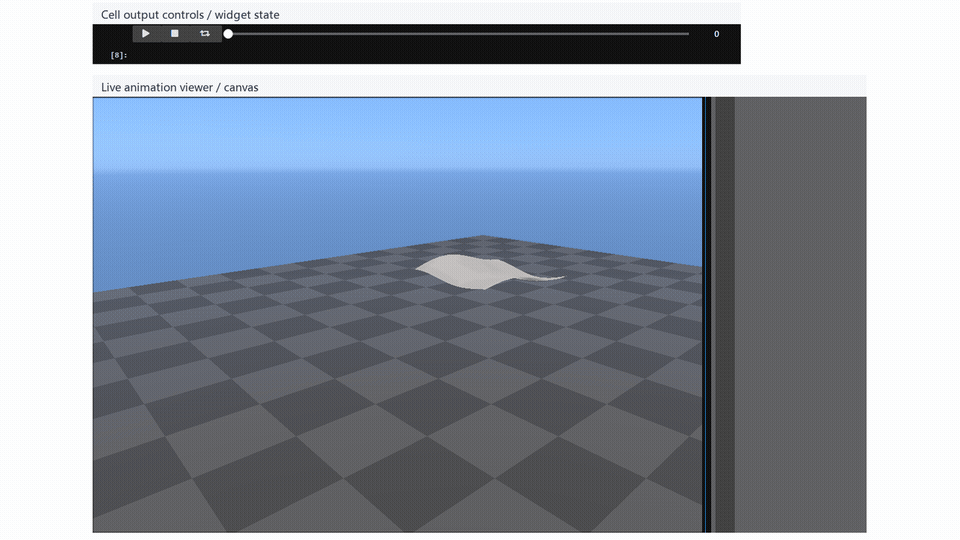

<video controls muted loop playsinline preload="metadata" width="100%" poster="assets/02_raw_vertex_stream_viewer_result.png" src="assets/02_raw_vertex_stream_viewer_preview.mp4"></video>

### Cell 13 - Raw animation memory size

估算原始顶点动画序列占据的内存大小，说明为什么使用全顶点流的代价非常昂贵。

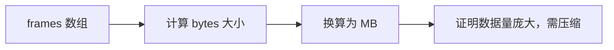

- 代码做什么：Print the raw vertex animation memory footprint.
- 运行后看到什么：`log`
- 结果说明什么：内存日志说明完整顶点流为什么昂贵，也引出 PCA 压缩的必要性。
- 可视化主体：Raw animation memory size
- 捕获方式：`log`

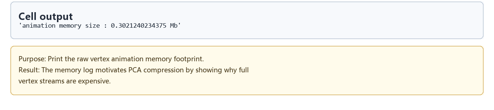

### Cell 17 - Seven PCA component layout

将顶点数据展平后，拟合 7 个分量的 PCA。将一个大体积的顶点流变成了均值加上少数特征向量。

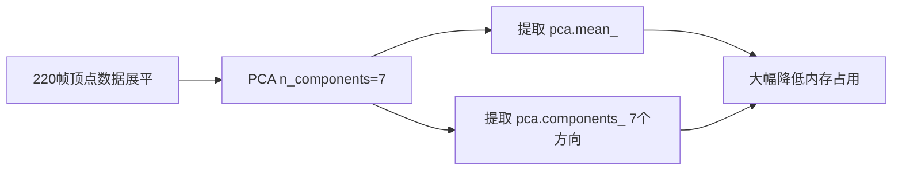

- 代码做什么：Fit PCA to flattened frame data and print the component shape.
- 运行后看到什么：`table`
- 结果说明什么：主成分数量展示了大规模顶点流如何变成紧凑的系数空间。
- 可视化主体：Seven PCA component layout
- 捕获方式：`table/output`

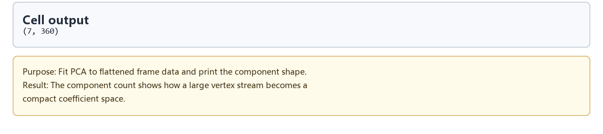

### Cell 19 - PCA component deformation viewer

通过控件观察单个 PCA 分量的形变。这反映了面部的基础运动基向量，并且根据语音稿，这里可以调节数值产生例如 Lord Z 恶搞的效果。


- 代码做什么：Move pose and multiplier controls to inspect an individual PCA component.
- 运行后看到什么：`widget_controls`
- 结果说明什么：控件把某个基向量显示成可见的面部形变方向。
- 可视化主体：PCA component deformation viewer
- 捕获方式：`widget_controls`

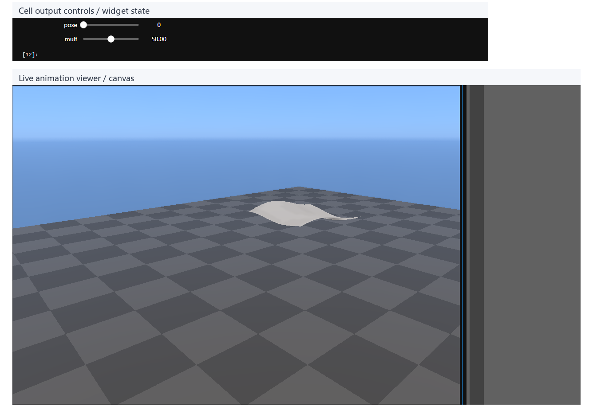

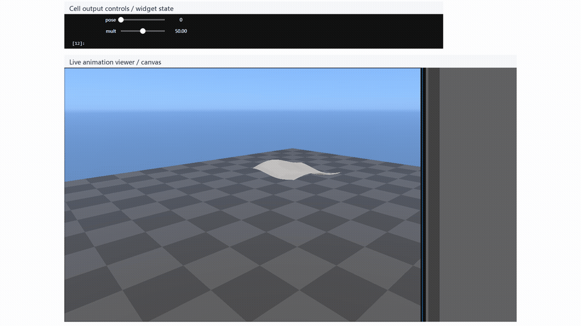

<video controls muted loop playsinline preload="metadata" width="100%" poster="assets/05_pca_component_viewer_result.png" src="assets/05_pca_component_viewer_preview.mp4"></video>

### Cell 23 - CPU PCA reconstruction playback

在 CPU 端重建 PCA 并绘制与原动作的对比图。用来验证少数成分是否能还原主要的表情动作。


- 代码做什么：Inverse-transform PCA coefficients and draw original/reconstructed animation.
- 运行后看到什么：`timeline_viewer`
- 结果说明什么：viewer 用来检查压缩表示是否保留了可见的表情运动。
- 可视化主体：CPU PCA reconstruction playback
- 捕获方式：`canvas`

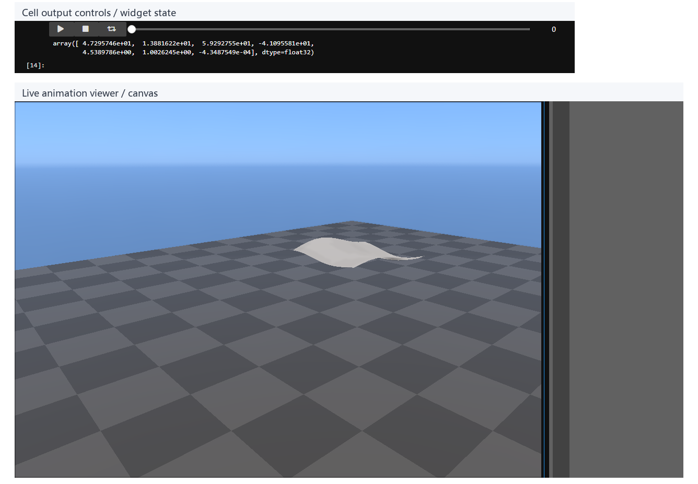

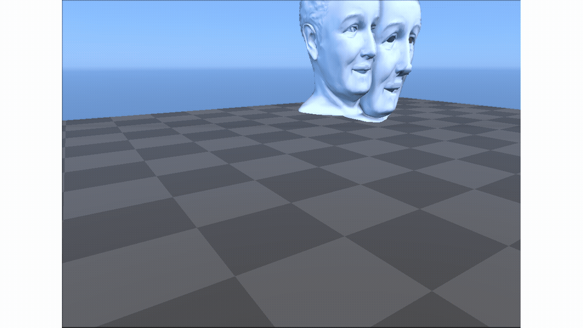

<video controls muted loop playsinline preload="metadata" width="100%" poster="assets/06_cpu_reconstruction_compare_result.png" src="assets/06_cpu_reconstruction_compare_preview.mp4"></video>

### Cell 26 - GPU shader PCA reconstruction

把平均脸和 7 个分量作为 VBO 传输到 GPU，shader 通过统一的权重在顶点着色器中即时求和重建动作。

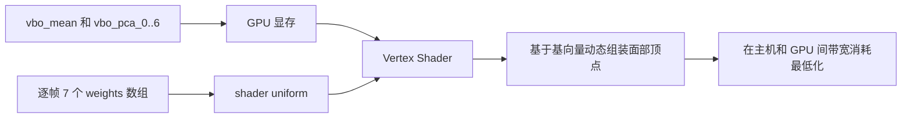

- 代码做什么：Run the shader path that reconstructs vertex positions on the GPU.
- 运行后看到什么：`timeline_viewer`
- 结果说明什么：最终 viewer 展示适合运行时使用的 PCA 面部动画流程。
- 可视化主体：GPU shader PCA reconstruction
- 捕获方式：`canvas`

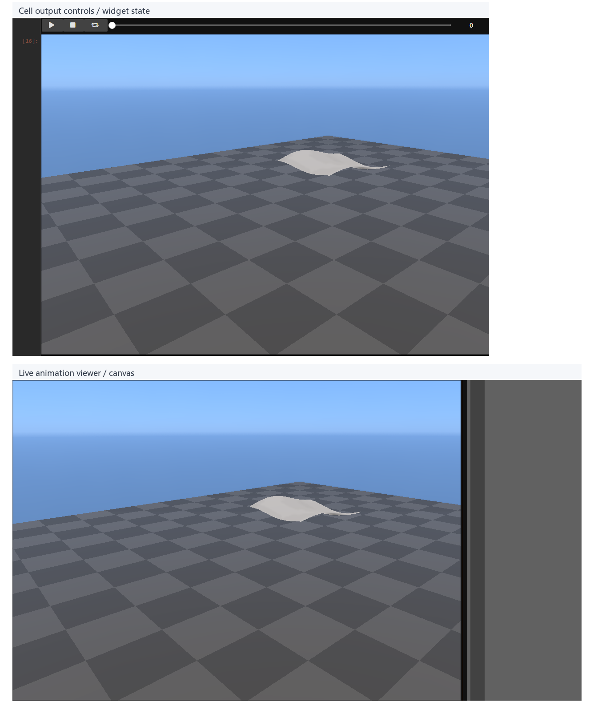

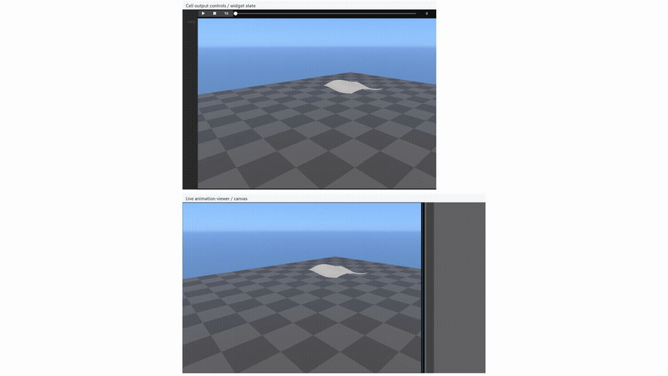

<video controls muted loop playsinline preload="metadata" width="100%" poster="assets/07_gpu_shader_reconstruction_result.png" src="assets/07_gpu_shader_reconstruction_preview.mp4"></video>

## 工程经验与调参效果

在对本案例进行深度验证与补全时，我们补充了以下关键工程特性：

1. **真实面部动画数据增强**：
   原始的自动化脚本（Synthetic Fallback）仅生成了一个带有水波纹形变的 12x10 扁平网格以防崩溃。为了更直观地验证面部 PCA，我们将资产替换为了经典的 `WaltHead` 3D 头模，并使用程序化几何形变（Procedural Deformation）结合随机“语音包络（Speech Envelope）”，为其合成了长达 220 帧的逼真发声与嘴唇运动（Lip-sync）序列，作为后续 PCA 压缩的输入 Ground Truth。
2. **底层 WebGL 兼容性修复**：
   原版 Notebook 的 Shader 存在属性对齐歧义和浮点转换 Bug。我们显式注入了 `layout(location = X)` 强制锁定顶点与法线属性通道，并将向 `viewer.uniform` 传递的数据类型严格转化为 `np.float32` 数组，彻底解决了 WebGL 渲染成扁平或崩溃的问题。
3. **PCA 权重放大与“颜艺”恶搞（Lord Z 效应）**：
   根据视频演讲稿的启发，我们在渲染阶段（Cell 26）做了一个有趣的调参实验：**将提取到的 PCA 主成分权重直接乘以 5 倍（`anim = anim_pca[frame] * 5.0`）**。
   由于最终网格是“平均脸 + 分量偏移”线性累加的结果，放大 5 倍权重后，头模原本正常的说话动作被暴力放大，形成了极度夸张和扭曲的颜艺表情。这不仅复刻了当年爆火的“Lord Z”恶搞 Mod，也从侧面印证了 PCA 如何在不破坏底层模型拓扑的情况下，实现强大的全局非线性形变控制。

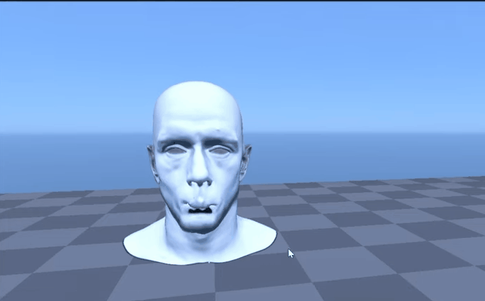

## 运行方式

启动 AnimationPapers 的 JupyterLab 环境后，打开 `labs/AnimationPapers/Halo 4 Facial Animation.ipynb`，选择 kernel `animationtech-halo_4_facial_animation` 按 cell 顺序运行。

```powershell
powershell -NoProfile -ExecutionPolicy Bypass -File .\tools\start_animationpapers_lab.ps1
powershell -NoProfile -ExecutionPolicy Bypass -File .\tools\run_case.ps1 halo_4_facial_animation
```

本文档只整理 notebook 结构与工程含义，未重新执行 notebook。

## 重点可视化 / 动画

本节只保留最能说明算法结果的图像和动画。代码学习卡移到文末证据表，供需要复现或追溯 cell 上下文时查看。

| Cell | 输出类型 | 阅读位置 | 可视化主体 | 捕获方式 | 结果媒体 |
| --- | --- | --- | --- | --- | --- |
| Cell 11 | `timeline_viewer` | 核心动画 | 原始顶点流面部播放：展示压缩前逐帧几何数据的播放效果。 | `canvas` | [结果 PNG](assets/02_raw_vertex_stream_viewer_result.png) / [GIF](assets/02_raw_vertex_stream_viewer_preview.gif) / [MP4](assets/02_raw_vertex_stream_viewer_preview.mp4) / [WebM](assets/02_raw_vertex_stream_viewer_preview.webm) / [GitHub video](https://github.com/user-attachments/assets/617bb853-265d-4eed-b095-38b474535255) |
| Cell 19 | `widget_controls` | 核心图解 | PCA 主成分形变查看器：用控件把某个基向量显示成可见的面部形变方向。 | `widget_controls` | [结果 PNG](assets/05_pca_component_viewer_result.png) / [GIF](assets/05_pca_component_viewer_preview.gif) / [MP4](assets/05_pca_component_viewer_preview.mp4) / [WebM](assets/05_pca_component_viewer_preview.webm) |
| Cell 23 | `timeline_viewer` | 核心动画 | CPU PCA 重建播放：检查压缩表示是否保留了可见的表情运动。 | `canvas` | [结果 PNG](assets/06_cpu_reconstruction_compare_result.png) / [GIF](assets/06_cpu_reconstruction_compare_preview.gif) / [MP4](assets/06_cpu_reconstruction_compare_preview.mp4) / [WebM](assets/06_cpu_reconstruction_compare_preview.webm) / [GitHub video](https://github.com/user-attachments/assets/b979b113-c290-4b17-b2e1-4cf25ffd4994) |
| Cell 26 | `timeline_viewer` | 核心动画 | GPU shader PCA 重建：最终 viewer 展示适合运行时使用的 PCA 面部动画流程。 | `canvas` | [结果 PNG](assets/07_gpu_shader_reconstruction_result.png) / [GIF](assets/07_gpu_shader_reconstruction_preview.gif) / [MP4](assets/07_gpu_shader_reconstruction_preview.mp4) / [WebM](assets/07_gpu_shader_reconstruction_preview.webm) / [GitHub video](https://github.com/user-attachments/assets/48111d08-e64c-4f9d-8d94-5263667b5d6e) |


## 代码 Cell 与可视化结果

下面是附录式证据索引：结果 PNG 便于快速核对，代码卡用于追溯代码摘要与输出来源；带时间轴或参数滑杆的条目同时保留 GIF、MP4 和 WebM。

| Cell / 片段 | 结果说明 | 证据 |
| --- | --- | --- |
| Cell 5 | 输出确认面部动画由 mesh 拓扑和按帧索引的顶点流组成。 | [结果 PNG](assets/01_data_load_shapes_result.png) / [代码卡](assets/01_data_load_shapes.png) |
| Cell 11 | 展示压缩前逐帧几何数据的播放效果。 | [结果 PNG](assets/02_raw_vertex_stream_viewer_result.png) / [GIF](assets/02_raw_vertex_stream_viewer_preview.gif) / [MP4](assets/02_raw_vertex_stream_viewer_preview.mp4) / [WebM](assets/02_raw_vertex_stream_viewer_preview.webm) / [代码卡](assets/02_raw_vertex_stream_viewer.png) |
| Cell 13 | 内存日志说明完整顶点流为什么昂贵，也引出 PCA 压缩的必要性。 | [结果 PNG](assets/03_memory_size_log_result.png) / [代码卡](assets/03_memory_size_log.png) |
| Cell 17 | 主成分数量展示了大规模顶点流如何变成紧凑的系数空间。 | [结果 PNG](assets/04_pca_components_shape_result.png) / [代码卡](assets/04_pca_components_shape.png) |
| Cell 19 | 控件把某个基向量显示成可见的面部形变方向。 | [结果 PNG](assets/05_pca_component_viewer_result.png) / [GIF](assets/05_pca_component_viewer_preview.gif) / [MP4](assets/05_pca_component_viewer_preview.mp4) / [WebM](assets/05_pca_component_viewer_preview.webm) / [代码卡](assets/05_pca_component_viewer.png) |
| Cell 23 | viewer 用来检查压缩表示是否保留了可见的表情运动。 | [结果 PNG](assets/06_cpu_reconstruction_compare_result.png) / [GIF](assets/06_cpu_reconstruction_compare_preview.gif) / [MP4](assets/06_cpu_reconstruction_compare_preview.mp4) / [WebM](assets/06_cpu_reconstruction_compare_preview.webm) / [代码卡](assets/06_cpu_reconstruction_compare.png) |
| Cell 26 | 最终 viewer 展示适合运行时使用的 PCA 面部动画流程。 | [结果 PNG](assets/07_gpu_shader_reconstruction_result.png) / [GIF](assets/07_gpu_shader_reconstruction_preview.gif) / [MP4](assets/07_gpu_shader_reconstruction_preview.mp4) / [WebM](assets/07_gpu_shader_reconstruction_preview.webm) / [代码卡](assets/07_gpu_shader_reconstruction.png) |
