# Knowing When To Put Your Foot Down：脚接触标注与近邻 Oracle

## 元数据

| 字段 | 内容 |
| --- | --- |
| slug | `knowing_when_to_put_your_foot_down` |
| source path | [`labs/AnimationPapers/Knowing When To Put Your Foot Down.ipynb`](<../../../../labs/AnimationPapers/Knowing When To Put Your Foot Down.ipynb>) |
| transcript sources | [`docs/transcripts/2k3xZQgXc9s_Knowing When To Put Your Foot Down.txt`](<../../../../docs/transcripts/2k3xZQgXc9s_Knowing When To Put Your Foot Down.txt>) |
| kind | `notebook` |
| env | `.envs/foot_down` |
| kernel | `animationtech-knowing_when_to_put_your_foot_down` |
| validation | `passed` (`manual_smoke`；自动执行通过，viewer 建议 JupyterLab 人工检查) |
| publish tier | `媒体完整 + 发布基底` |
| media quality | key_visual/key_animation 必须是算法输出本身，禁止滚动截图、整页 cell、代码卡裁剪和静态假动画 |

## 问题背景

Footskate cleanup 想解决的是脚在应该贴地时继续滑动的问题，但 cleanup 之前必须先知道“哪一帧哪只脚应当贴地”。这篇案例对应 2006 年的 Knowing When To Put Your Foot Down，目标不是直接修脚滑，而是训练一个 foot contact oracle：给定一帧附近的脚腿运动窗口，判断左脚、左脚尖、右脚、右脚尖是否处于接触。

讲解中的训练策略很务实。先从 Lafan1 中取 walk、run、dance、aiming 等多类动作，构造约 22600 帧的 feature vector；再手工标注少量 clip 的四通道 contact；然后用镜像增强和 k-nearest neighbor classifier 把标签传播到未标注帧。模型简单，重点在数据定义和迭代挑样：当 oracle 对某段动作最不熟悉，就把这段拿出来继续人工修正。

## 阅读前置知识

- Foot contact：本文的标签不是“脚在世界空间速度为零”，而是动画师认可的接触状态，包含脚掌和脚尖四条轨道。
- Root-local feature：脚部轨迹会被转换到当前 root 局部坐标，避免世界位置和朝向污染分类。
- Sliding window：每个样本看当前帧前后各 `window_size = 5` 帧，因此特征既包含当前高度，也包含入地和离地趋势。
- k-NN classifier：`NearestNeighbors` 只负责找邻居，最终标签由邻居 label 的平均概率和阈值逻辑决定。
- Footskate cleanup 关系：cleanup 使用 contact 标签决定何时锁脚和何时释放脚，本案例提供的是这个锁定决策的输入。

## 总模块图

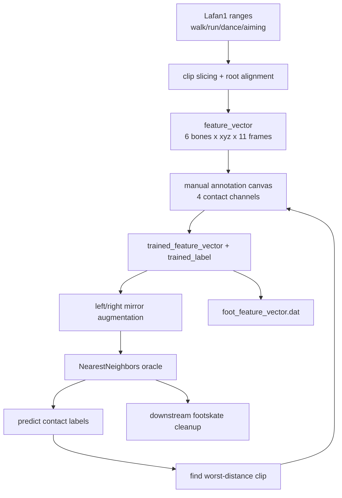

## 代码执行路径

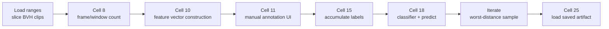

已生成证据中的 Cell 8、10、11、15、18、25 已经生成了稳定结果媒体。原始 notebook 里还有交互 canvas 和保存单元，这些单元在 prepared 版本中会谨慎跳过或改为读取已有 artifact，以避免误写训练数据。

## 模块拆解

### 1. 动作加载、切片与 root 对齐

`ranges` 指定参与训练的 BVH 片段，包括 walking、running、dancing 和 aiming。每段会额外取前后 `window_size` 帧，随后构造新的 `lab.Anim`。root 会通过第一帧的逆变换重新对齐，这样不同 clip 起点不再携带任意世界位置。

这一步的输出不是训练标签，而是一组可统一遍历的 animation slices。`clip_length = 200` 决定一次人工标注界面默认处理的片段长度，`total_frames / clip_length` 则告诉标注者整个数据池大概能切成多少个训练窗口。

### 2. Feature Vector：脚腿局部时间窗

特征选取六根骨骼：`LeftLeg`、`LeftFoot`、`LeftToe`、`RightLeg`、`RightFoot`、`RightToe`。每个样本取当前帧前后各 5 帧，共 11 帧，每帧存 6 个骨骼的 3D 位置，因此维度是 `6 * 3 * 11 = 198`。

位置先由 forward kinematics 得到全局坐标，再乘当前 root 的逆旋转和平移，转到 root-local 空间。这样 oracle 看到的是“脚相对于身体如何运动”，而不是“角色在场景哪里”。

### 3. Foot Contact 标注界面

标注界面由 `ipycanvas.Canvas`、timeline 和 viewer 组成。canvas 高度分成四条轨道：左脚、左脚尖、右脚、右脚尖；`current_label` 的形状是 `[clip_length, 4]`。鼠标移动会同步更新当前帧，鼠标按下和拖动会切换某一轨道的 contact 值。

界面里还有 `generate using speed` 按钮，它调用 `lab.utils.extract_feet_contacts` 生成初始猜测。标注者不是从空白开始，而是在速度阈值结果上修正，尤其关注起跳、落地、转身和脚尖轻触地面的不确定帧。

### 4. Oracle / Classifier

一次 clip 标完后，`trained_feature_vector` 与 `trained_label` 累加当前特征和标签。训练 classifier 前，代码把所有特征 reshape 成 xyz 坐标，令 x 坐标取反做左右镜像，并把 label 从 `[left foot, left toe, right foot, right toe]` 交换成 `[right foot, right toe, left foot, left toe]`。这样一段人工标注同时贡献原始样本和镜像样本。

`classifier = NearestNeighbors(n_neighbors=10)` 拟合增强后的特征。`predict(features)` 对每个 query 找 10 个近邻，把四通道标签平均成概率：小于等于 0.4 视为未接触，大于等于 0.6 视为接触，介于两者之间则沿用上一帧状态，减少 0/1 抖动。

### 5. 迭代挑样

训练完第一版 oracle 后，代码会把当前片段或更长片段送进 `predict` 看效果。下一轮标注不随机选样，而是用 `classifier.kneighbors(feature_vector, n_neighbors=1, return_distance=True)` 找全数据集中最近邻距离最大的帧，再对齐到 `clip_length` 边界。

这个策略的含义很直接：优先标注 oracle 最不熟悉的动作区域。每次人工修正后重新 fit classifier，直到不熟悉样本减少，或者预测已经满足后续 cleanup 的质量要求。

### 6. 与 Footskate Cleanup 的关系

Footskate cleanup 通常需要两个信息：脚应该固定在哪个世界位置，以及这段固定应持续多久。本案例不直接做 IK cleanup，但它提供第二个信息的判定来源。后续系统可以把 `predict` 得到的 contact 标签作为锁脚区间，在接触段保持脚掌或脚尖锚点，在非接触段释放约束。

因此这篇的质量评估不能只看 classifier accuracy。更重要的是错误类型：把空中脚误判成接触会让 cleanup 把脚吸到地面；把落地脚误判成非接触会留下滑步。0.4/0.6 的滞回阈值正是为了减少这些边界帧的闪烁。

## 关键 cell / 函数深讲

### Cell 8 - Animation windows and frame count

这一步统计所有切片在扣掉前后窗口后还能贡献多少训练帧。讲解中提到总规模约 22600 帧，这决定了 feature matrix 的第一维，也决定了人工标注迭代面对的数据池大小。

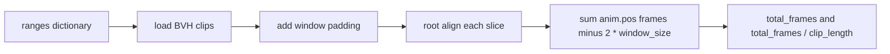

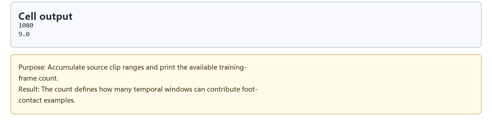

如果 `total_frames` 偏小，oracle 见不到足够多的步态变化；如果 `total_frames / clip_length` 与预期不符，说明 ranges 或 padding 可能有错。

### Cell 10 - Foot-contact feature vector construction

feature vector 是 oracle 的“眼睛”。它只看脚腿六根骨骼在 11 帧窗口中的 root-local 轨迹，不直接看角色全身，也不使用渲染图像。

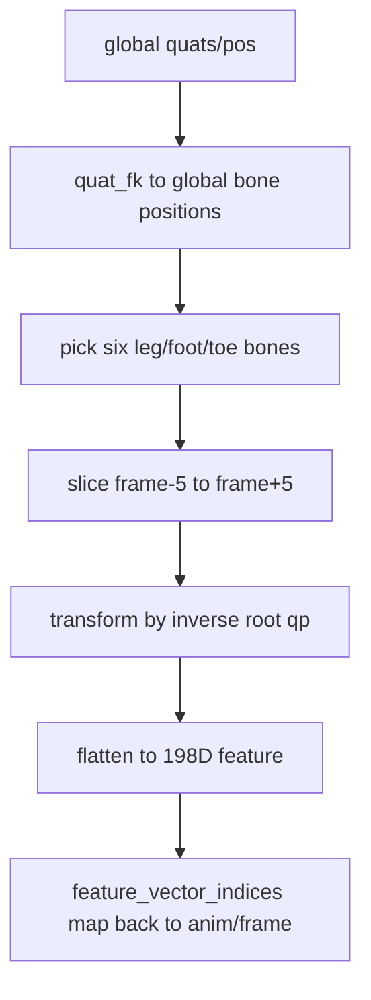

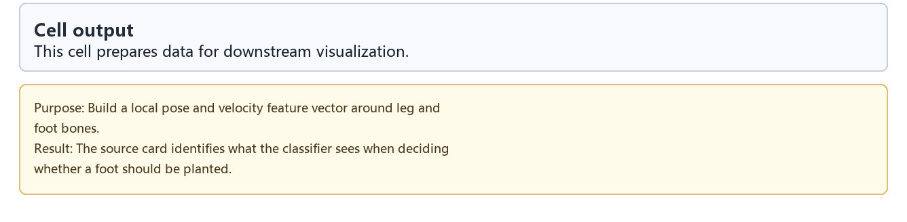

`feature_vector_indices` 很容易被忽略，但它决定了 classifier 找到“最差样本”后能否回到正确动画和帧号继续标注。

### Cell 11 - Manual annotation UI stability note

原始交互单元负责人工标注四条 contact 轨道。prepared notebook 会记录跳过原因，因为自动化环境不能可靠复现鼠标拖动、canvas 绘制和 viewer 同步。

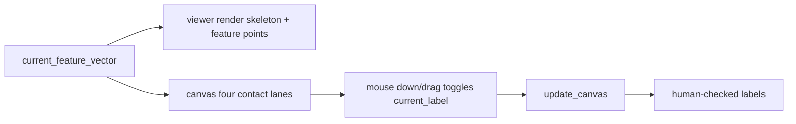

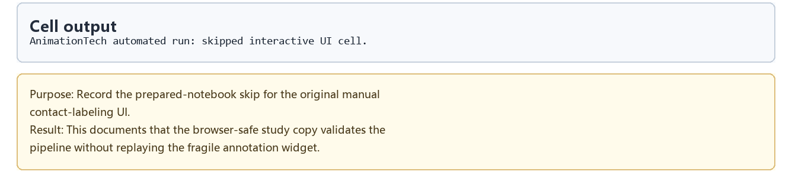

正文仍然要讲这个 UI，因为它定义了标签语义：四条轨道不是算法自动生成的真值，而是人工对“脚是否应该锁地”的判断。

### Cell 15 - Training-set accumulation

标完一个 clip 后，当前样本才被纳入训练集。prepared 版本跳过这里的交互累加，但数据流本身很简单：把 `current_feature_vector` 追加到 `trained_feature_vector`，把 `current_label` 追加到 `trained_label`。

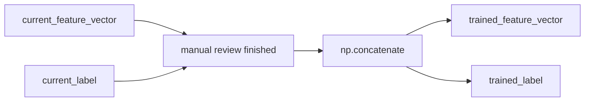

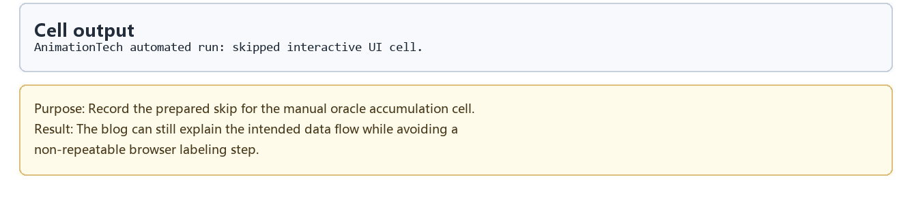

这个累加步骤是“少量高质量标注”的核心。后续 classifier 没有复杂监督训练过程，它完全依赖这里进入训练集的标签是否可靠。

### Cell 18 - Classifier construction 与 predict

classifier 的构建和预测由两部分组成：镜像增强让左右脚共享经验，概率阈值让 contact label 更稳定。

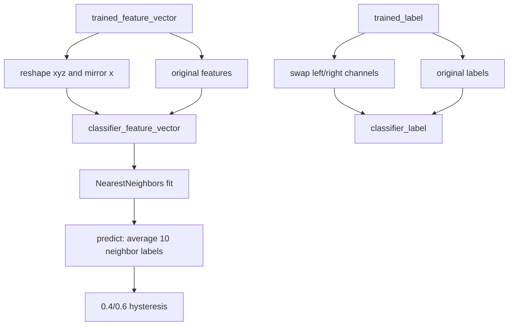

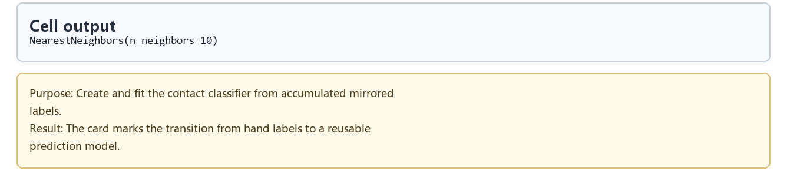

这里的 oracle 本质上是数据检索器。它不会学习一组神经网络权重，而是把“和这个脚部轨迹最像的 10 个已标注轨迹”取出来投票。

### Iterate and Cell 25 - 挑选最不熟悉样本与 artifact load

迭代阶段先用当前 oracle 预测一段片段，再寻找最近邻距离最大的训练帧作为下一段人工标注目标。最终已经标好的训练数据会写入或读取 `foot_feature_vector.dat`。

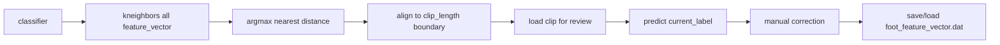

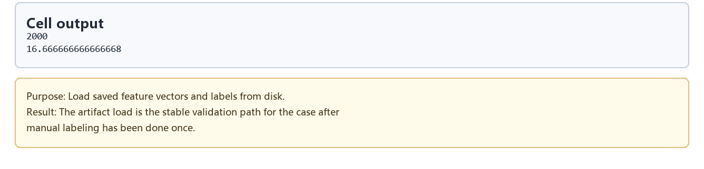

prepared notebook 默认读取 artifact，而不是自动保存，原因是保存会覆盖人工标注成果。稳定复现时，`foot_feature_vector.dat` 代表“已经完成若干轮人工迭代后的 oracle 训练集”。

## 关键数据结构

| 名称 | 形状 / 类型 | 作用 |
| --- | --- | --- |
| `ranges` | dict of BVH ranges | 规定参与训练的动作类型和帧区间 |
| `animations` | list of `lab.Anim` | root 对齐后的可遍历 clip slices |
| `feature_vector` | `[total_frames, 198]` | 每帧脚腿 11 帧窗口特征 |
| `feature_vector_indices` | `[total_frames, 2]` | 从特征行映射回 animation id 和 frame |
| `current_feature_vector` | `[clip_length, 198]` 或更长 | 当前正在标注或检查的片段特征 |
| `current_label` | `[clip_length, 4]` | 左脚、左脚尖、右脚、右脚尖四路 contact |
| `trained_feature_vector` | `[N, 198]` | 累计人工确认的训练特征 |
| `trained_label` | `[N, 4]` | 与训练特征对应的四通道标签 |
| `classifier_feature_vector` | `[2N, 198]` | 原始样本加镜像样本 |
| `classifier_label` | `[2N, 4]` | 原始标签加左右交换标签 |
| `classifier` | `sklearn.neighbors.NearestNeighbors` | 近邻检索器，也就是 oracle 的核心 |
| `foot_feature_vector.dat` | pickle artifact | 持久化的训练特征和标签 |

## 执行结果的意义

这篇的结果不是一个最终动画片段，而是一条可复用的 contact-labeling workflow。Cell 8 确认训练数据池规模；Cell 10 定义 oracle 能看到的证据；Cell 11 和 Cell 15 说明人工标签如何进入训练集；Cell 18 把人工标签变成可预测的新片段标签；Cell 25 则让已有标注能被下游案例复用。

与 Footskate cleanup 放在一起看，oracle 的价值在于把“什么时候锁脚”从手工规则变成可迭代数据。cleanup 可以继续负责修正脚的位置和 IK，oracle 负责告诉 cleanup 哪些帧应该约束脚掌、哪些帧应该释放脚。

## 重点可视化 / 动画

正文重点只放源 notebook 真实输出：foot-contact oracle 的角色 viewer、root-local feature axes、脚跟/脚尖 contact 标记和原始标注时间条。代码、日志和 walkthrough 都放到后面的证据索引。

媒体审计说明：本节现有 PNG/WebM 都是复现证据，不是动态 foot-contact 预览；不要把 walkthrough 当作 key animation。真正的 footfall classifier preview 需要从项目 reproduction/artifact 生成后再提升为主视觉。

| 媒体 | 证据类型 | 阅读重点 |
| --- | --- | --- |
| [Animation windows and frame count](assets/01_clip_window_count_result.png) | 补充证据 | 数据池规模与可切片数量 |
| [Classifier construction](assets/05_classifier_training_code_result.png) | 补充证据 | 从人工标签到 k-NN oracle 的转换 |
| [Saved feature-vector artifact load](assets/06_saved_feature_vectors_result.png) | 补充证据 | 已标注训练集的稳定复现入口 |
| [Knowing When To Put Your Foot Down walkthrough](assets/00-walkthrough.webm) | 补充证据 | 按 cell 顺序回放学习卡与结果证据 |

这段动画对应语音稿里“用少量人工标注训练一个脚接触 oracle”的核心步骤。画面来自源案例 notebook 的 `render(frame)` 与同一个 cell 中的 `Canvas` 标注条：viewer 里能看到角色、局部 feature axes 和脚部 contact marker；下方时间条显示四路 heel/toe label 随帧推进。阅读时看脚底标记是否在接触帧稳定出现，而不是看后处理脚本重绘的解释图。

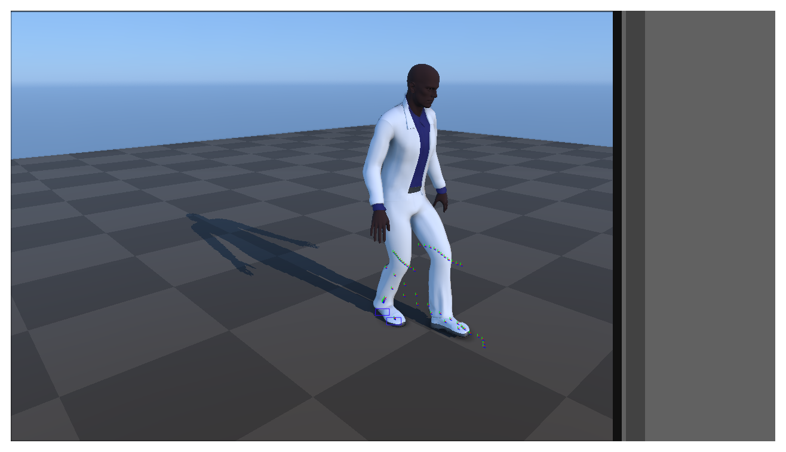

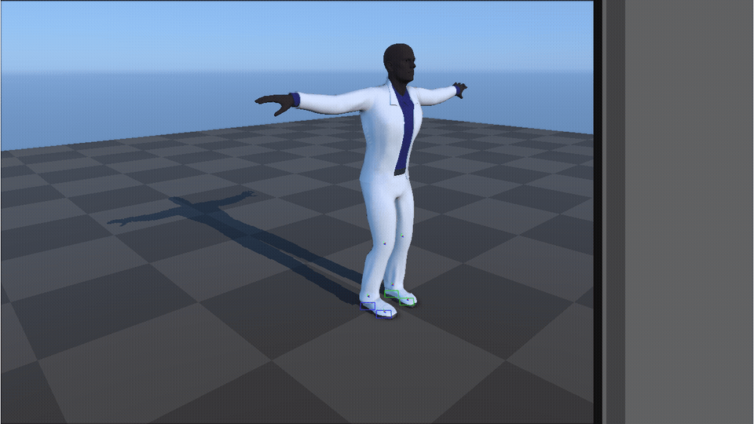

<video controls muted loop playsinline preload="metadata" width="100%" poster="assets/07_foot_contact_oracle_playback_result.png" src="assets/07_foot_contact_oracle_playback_preview.mp4"></video>

## 代码 Cell 与可视化证据

下面的表作为证据索引保留各学习步骤。结果 PNG 用于阅读，代码卡只用于追溯 cell 摘要和输出来源。

| Cell / 片段 | 结果说明 | 证据 |
| --- | --- | --- |
| Cell 8 | 统计可用训练帧和可切分的 200 帧窗口数量。 | [结果 PNG](assets/01_clip_window_count_result.png) / [代码卡](assets/01_clip_window_count.png) |
| Cell 10 | 构造 root-local 的脚腿 11 帧窗口特征。 | [结果 PNG](assets/02_feature_vector_construction_result.png) / [代码卡](assets/02_feature_vector_construction.png) |
| Cell 11 | prepared notebook 记录并跳过原始 manual contact-labeling UI。 | [结果 PNG](assets/03_annotation_ui_stability_note_result.png) / [代码卡](assets/03_annotation_ui_stability_note.png) |
| Cell 15 | 记录人工标注样本进入训练集的累加阶段。 | [结果 PNG](assets/04_training_set_accumulation_result.png) / [代码卡](assets/04_training_set_accumulation.png) |
| Cell 18 | 构建镜像增强后的 NearestNeighbors classifier。 | [结果 PNG](assets/05_classifier_training_code_result.png) / [代码卡](assets/05_classifier_training_code.png) |
| Cell 25 | 读取已保存的 `foot_feature_vector.dat`，作为稳定复现路径。 | [结果 PNG](assets/06_saved_feature_vectors_result.png) / [代码卡](assets/06_saved_feature_vectors.png) |
| Cell 15 | Source notebook foot-contact viewer shows the character, root-local feature axes, and four contact-label channels generated by the original render/canvas cell. | [Result PNG](assets/07_foot_contact_oracle_playback_result.png) / [GIF](assets/07_foot_contact_oracle_playback_preview.gif) / [MP4](assets/07_foot_contact_oracle_playback_preview.mp4) / [WebM](assets/07_foot_contact_oracle_playback_preview.webm) / [代码卡](assets/07_foot_contact_oracle_playback.png) |
| walkthrough | 按 cell 顺序回放学习卡与结果证据，不作为正文核心算法媒体。 | [WebM](assets/00-walkthrough.webm) |
## 运行方式

先启动 AnimationPapers 的 JupyterLab 环境，并选择元数据表中的 kernel：

```powershell
powershell -NoProfile -ExecutionPolicy Bypass -File .\tools\start_animationpapers_lab.ps1
```

如需按案例脚本做自动化检查，使用 slug 运行：

```powershell
powershell -NoProfile -ExecutionPolicy Bypass -File .\tools\run_case.ps1 knowing_when_to_put_your_foot_down
```
