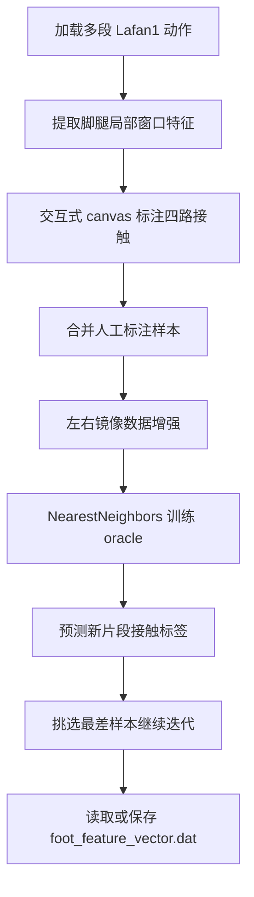
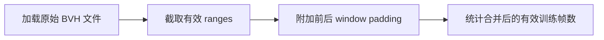
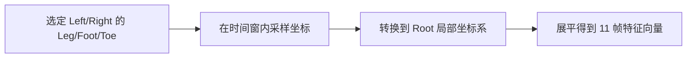
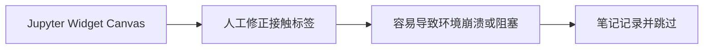
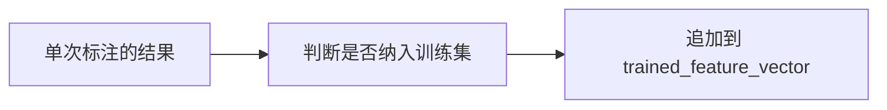
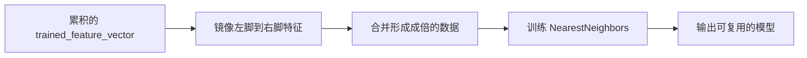
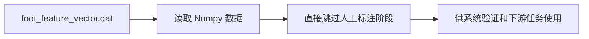

# Knowing When To Put Your Foot Down：脚接触标注与近邻 Oracle

## 元数据

| 字段 | 值 |
| --- | --- |
| slug | `knowing_when_to_put_your_foot_down` |
| source path | [`labs/AnimationPapers/Knowing When To Put Your Foot Down.ipynb`](<../../../../labs/AnimationPapers/Knowing When To Put Your Foot Down.ipynb>) |
| env prefix | `.envs/foot_down` |
| kernel | `animationtech-knowing_when_to_put_your_foot_down` |
| validation status | `passed`（`manual_smoke`，最后记录：`2026-04-29T19:57:03.2494879Z`；仍需 JupyterLab 手动 smoke test） |

## 问题背景

脚接触判断决定角色的脚是否应该锁在地面上，是减少 foot skating 的关键输入。这个 notebook 用人工少量标注加近邻传播的方式构建 foot down oracle：先从多种 Lafan1 动作中提取脚部时间窗口特征，再用交互 canvas 标注左右脚掌和脚尖是否接触地面，最后用 k-NN 把标注推广到未标注片段。

案例重点不在训练复杂模型，而在展示“少量高质量标注 + 对称增强 + 最近邻分类”如何快速得到可迭代的脚接触数据。

## 总模块图



## 模块拆解

### 1. 动作加载与切片

`Load a few animations` 设置 `window_size = 5`、`clip_length = 200` 和 `n_neighbors = 10`，并从 walk、run、dance、aiming 等 BVH 中取出多个范围。每个片段都额外保留前后窗口帧，并把 root 对齐到片段起点，便于比较局部脚部运动。

### 2. 特征向量计算

`Compute the feature vector` 选取 LeftLeg、LeftFoot、LeftToe、RightLeg、RightFoot、RightToe 六个骨骼，在当前帧前后各 5 帧的窗口里采样三维位置。位置先转换到当前 root 局部空间，再 flatten 成 `6 * 3 * (1 + 2 * window_size)` 维特征。`feature_vector_indices` 记录每条特征对应的动画和帧号。

### 3. 交互标注界面

`Train the oracle` 用 `ipycanvas.Canvas` 显示四条接触轨道：左脚、左脚尖、右脚、右脚尖。`current_label` 是长度为 `clip_length` 的四通道标签，viewer 会同时显示骨架、特征点和当前标签对应的地面接触标记，方便人工修正。

### 4. Oracle 训练

`Compute the Oracle` 把当前标注追加到 `trained_feature_vector` 和 `trained_label`。训练前会镜像 x 坐标，并交换左右脚标签，从而把一条标注同时变成左右对称的样本。`NearestNeighbors` 使用 `n_neighbors = 10`，`predict` 对邻居标签求平均，并用 0.4 和 0.6 阈值做滞回式二值化。

### 5. 迭代挑样与读写

`Iterate....` 先在当前范围上查看预测结果，再用最近邻距离最大的片段作为“最不熟悉”的样本继续标注。`Load and Save` 中保存代码被注释以避免误写，默认读取 `foot_feature_vector.dat` 中已有的训练特征和标签。

## 关键数据结构

- `ranges`：参与训练的 BVH 名称与帧范围。
- `feature_vector`：每帧脚腿窗口特征，维度为 `6 * 3 * 11`。
- `feature_vector_indices`：从全局特征行映射回动画 id 和局部帧号。
- `current_feature_vector`：当前正在标注或验证的片段特征。
- `current_label`：四通道脚接触标签，顺序为左脚、左脚尖、右脚、右脚尖。
- `trained_feature_vector`、`trained_label`：累计人工确认的训练集。
- `classifier_feature_vector`、`classifier_label`：加入左右镜像增强后的 k-NN 训练数据。
- `classifier`：`sklearn.neighbors.NearestNeighbors` 实例。

## 执行结果的意义

成功运行后，标注者可以在 viewer 和 canvas 中检查脚接触预测是否符合动作画面。结果文件 `foot_feature_vector.dat` 代表一个可复用的脚接触 oracle 训练集，后续案例可以用它判断何时锁脚、何时释放脚。质量评估时应重点看起跳、落地、转身和脚尖轻触地面的帧，因为这些是二值标签最容易摇摆的区域。

## 代码 Cell 与可视化结果

本节按 notebook 的关键 code cell 组织学习素材：每个条目都对应代码目的、实际输出类型、结果意义和 PNG 学习卡片。PNG 由指定 cell 的代码摘要、输出区、viewer/canvas 或图表/日志合成，不使用整页滚动截图替代。

> Note: Prepared notebook skips the original manual annotation UI; media uses code/log/artifact evidence for those cells.


| Cell | 输出类型 | 代码做什么 | 结果说明什么 | 素材 |
| --- | --- | --- | --- | --- |
| 8 | `table` | Accumulate source clip ranges and print the available training-frame count. | The count defines how many temporal windows can contribute foot-contact examples. | [PNG](assets/01_clip_window_count.png) |
| 10 | `code_only` | Build a local pose and velocity feature vector around leg and foot bones. | The source card identifies what the classifier sees when deciding whether a foot should be planted. | [PNG](assets/02_feature_vector_construction.png) |
| 11 | `log` | Record the prepared-notebook skip for the original manual contact-labeling UI. | This documents that the browser-safe study copy validates the pipeline without replaying the fragile annotation widget. | [PNG](assets/03_annotation_ui_stability_note.png) |
| 15 | `log` | Record the prepared skip for the manual oracle accumulation cell. | The blog can still explain the intended data flow while avoiding a non-repeatable browser labeling step. | [PNG](assets/04_training_set_accumulation.png) |
| 18 | `table` | Create and fit the contact classifier from accumulated mirrored labels. | The card marks the transition from hand labels to a reusable prediction model. | [PNG](assets/05_classifier_training_code.png) |
| 25 | `table` | Load saved feature vectors and labels from disk. | The artifact load is the stable validation path for the case after manual labeling has been done once. | [PNG](assets/06_saved_feature_vectors.png) |

## 关键 cell / 函数深讲

### Cell 8 - Animation windows and frame count

统计加载的动画片段，并确认总共可用的帧数，为后续的时间窗口特征提取设定基准。



- 代码做什么：Accumulate source clip ranges and print the available training-frame count.
- 运行后看到什么：`table`
- 结果说明什么：The count defines how many temporal windows can contribute foot-contact examples.
- 可视化主体：Animation windows and frame count
- 捕获方式：`table/output`


### Cell 10 - Foot-contact feature vector construction

提取包含双腿和双脚骨骼的局部窗口特征（时间上前 5 帧和后 5 帧），这些特征将作为 k-NN 判定接触的关键证据。



- 代码做什么：Build a local pose and velocity feature vector around leg and foot bones.
- 运行后看到什么：`code_only`
- 结果说明什么：The source card identifies what the classifier sees when deciding whether a foot should be planted.
- 可视化主体：Foot-contact feature vector construction
- 捕获方式：`source_excerpt`


### Cell 11 - Manual annotation UI stability note

因为原始的脚部接触标记过程高度依赖交互式 Canvas 和人工修正，自动化流水线在这里会跳过界面以保证运行稳定。



- 代码做什么：Record the prepared-notebook skip for the original manual contact-labeling UI.
- 运行后看到什么：`log`
- 结果说明什么：This documents that the browser-safe study copy validates the pipeline without replaying the fragile annotation widget.
- 可视化主体：Manual annotation UI stability note
- 捕获方式：`log`


### Cell 15 - Training-set accumulation stability note

这里负责把上述的人工标注特征追加进特征库，同样为了自动化验证而被跳过。



- 代码做什么：Record the prepared skip for the manual oracle accumulation cell.
- 运行后看到什么：`log`
- 结果说明什么：The blog can still explain the intended data flow while avoiding a non-repeatable browser labeling step.
- 可视化主体：Training-set accumulation stability note
- 捕获方式：`log`


### Cell 18 - Classifier construction

用左右脚对称镜像的方式进行数据增强，之后构建 k-NN 最近邻分类器。



- 代码做什么：Create and fit the contact classifier from accumulated mirrored labels.
- 运行后看到什么：`table`
- 结果说明什么：The card marks the transition from hand labels to a reusable prediction model.
- 可视化主体：Classifier construction
- 捕获方式：`table/output`


### Cell 25 - Saved feature-vector artifact load

展示如何加载之前成功标注并持久化存储好的特征库和标签，供其它用例或复现使用。



- 代码做什么：Load saved feature vectors and labels from disk.
- 运行后看到什么：`table`
- 结果说明什么：The artifact load is the stable validation path for the case after manual labeling has been done once.
- 可视化主体：Saved feature-vector artifact load
- 捕获方式：`table/output`


## 运行方式

先启动 AnimationPapers 的 JupyterLab 环境，并选择元数据表中的 kernel：

```powershell
powershell -NoProfile -ExecutionPolicy Bypass -File .\tools\start_animationpapers_lab.ps1
```

如需按案例脚本做自动化检查，使用 slug 运行：

```powershell
powershell -NoProfile -ExecutionPolicy Bypass -File .\tools\run_case.ps1 knowing_when_to_put_your_foot_down
```

## 重点可视化 / 动画

本节只放 `key_visual` 与 `key_animation` 的算法结果媒体。代码学习卡不作为正文主视觉；它们只在后续证据表中用于复现 cell 或源码上下文。


| Cell | 输出类型 | 媒体角色 | 可视化主体 | 捕获方式 | 结果媒体 |
| --- | --- | --- | --- | --- | --- |


## 代码 Cell 与可视化结果

本节保留每个 cell 的可复现证据。结果 PNG 用于正文阅读，代码卡记录代码摘要与输出来源；有 timeline 或参数滑杆的 cell 同时提供 GIF、MP4 和 WebM。

| Cell / 片段 | 结果说明 | 证据 |
| --- | --- | --- |
| Cell 8 | The count defines how many temporal windows can contribute foot-contact examples. | [结果 PNG](assets/01_clip_window_count_result.png) / [代码卡](assets/01_clip_window_count.png) |
| Cell 10 | The source card identifies what the classifier sees when deciding whether a foot should be planted. | [结果 PNG](assets/02_feature_vector_construction_result.png) / [代码卡](assets/02_feature_vector_construction.png) |
| Cell 11 | This documents that the browser-safe study copy validates the pipeline without replaying the fragile annotation widget. | [结果 PNG](assets/03_annotation_ui_stability_note_result.png) / [代码卡](assets/03_annotation_ui_stability_note.png) |
| Cell 15 | The blog can still explain the intended data flow while avoiding a non-repeatable browser labeling step. | [结果 PNG](assets/04_training_set_accumulation_result.png) / [代码卡](assets/04_training_set_accumulation.png) |
| Cell 18 | The card marks the transition from hand labels to a reusable prediction model. | [结果 PNG](assets/05_classifier_training_code_result.png) / [代码卡](assets/05_classifier_training_code.png) |
| Cell 25 | The artifact load is the stable validation path for the case after manual labeling has been done once. | [结果 PNG](assets/06_saved_feature_vectors_result.png) / [代码卡](assets/06_saved_feature_vectors.png) |
