# Motion Fields for Interactive Character Animation：Pose+Velocity 样本场控制

## 元数据

| 字段 | 内容 |
| --- | --- |
| slug | `motion_fields_for_interactive_character_animation` |
| source path | [`labs/AnimationPapers/Motion Fields For Interactive Character Animation.ipynb`](<../../../../labs/AnimationPapers/Motion Fields For Interactive Character Animation.ipynb>) |
| transcript sources | [`docs/transcripts/ukobLRLKZDM_Reinforcement Learning 04 _ Motion Fields For Interactive Character Animation_.txt`](<../../../../docs/transcripts/ukobLRLKZDM_Reinforcement Learning 04 _ Motion Fields For Interactive Character Animation_.txt>) |
| kind | `notebook` |
| env | `.envs/motion_fields` |
| kernel | `animationtech-motion_fields_for_interactive_character_animation` |
| validation | `passed` (`manual_smoke`；自动执行通过，viewer 建议 JupyterLab 人工检查) |
| publish tier | `深写完成 + 媒体完整` |
| media quality | key_visual/key_animation 必须是算法输出本身，禁止滚动截图、整页 cell、代码卡裁剪和静态假动画 |

## 问题背景

Motion Fields 把交互角色动画从“选择某段 clip 播放”改写成“在姿态速度样本场里积分”。讲解中反复强调四个对象：`pose`、`velocity`、`motion state` 和 `similarity metric`。一个 motion state 是当前姿态 `x` 加上从当前帧走向下一帧的有限差分速度 `v`；把多段 walk/jog 动画逐帧拆成这样的 `(x, v)` 后，就得到一个高维样本数据库。

运行时控制器并不直接拼接原始片段，而是把当前角色状态投到同一个 metric 空间，找出最相似的 `K_NEIGHBORS = 15` 个样本。最基础的 passive action 会按反距离权重混合这些邻居的速度；可控版本则把其中某个邻居权重拉高，形成离散动作集合。value function 再估计“现在选择这个动作，对未来朝向目标方向是否更好”，从而让角色能在 motion field 中长期稳定地转向、行走或慢跑。

## 阅读前置知识

- 姿态代数：`pose_add` 表示 `x ⊕ v`，`pose_subtract` 表示 `x' ⊖ x`，四元数部分需要归一化并处理符号翻转。
- 角色局部空间：数据库中的 root 会被归零，root 朝向会设为单位四元数，让相似度比较关注局部姿态和相对运动。
- k-NN 插值：近邻索引给出候选样本，`1 / distance^2` 归一化后成为 velocity blending 权重。
- Bellman backup：value iteration 用 `reward + gamma * expected_next_value` 反复更新状态价值，这里的状态还包含目标朝向 `theta`。
- Foot contact 与 IK：数据库保留左右脚接触 `states_c`，runtime 末尾会用接触权重约束脚尖位置，减少控制时的脚滑。

## 总模块图

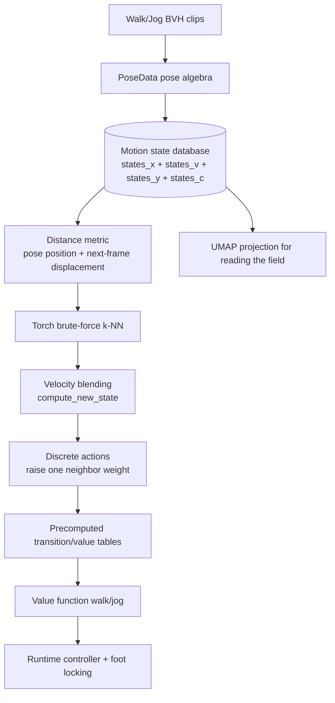

## 代码执行路径

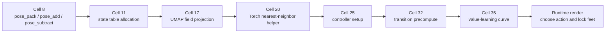

这条路径有两层含义。前半段把原始动画变成可查询的 motion field，后半段把查询结果变成控制策略。已生成证据中的 Cell 编号对应已经生成的博客结果媒体；实验 notebook 的原始单元里，部分实现代码和说明 markdown 相邻出现，因此正文会同时标出关键函数名。

## 模块拆解

### 1. Pose+Velocity 状态表达

`PoseData` 只是轻量容器，真正重要的是统一的 buffer 形状：`POSESHAPE = (bone_count + 2, 4)`。前两行分别存 root 平移和 hips 平移，后面存每根骨骼的四元数。`pose_pack` 和 `pose_unpack` 让 numpy 数组与结构化字段互转；`pose_add`、`pose_subtract`、`pose_lerp`、`pose_blend` 则给 motion field 提供最小的姿态代数。

这个设计把“姿态”和“速度”放进同一种存储形状，速度并不是欧式向量的单独类型，而是“能被加回 pose 的差分 pose”。因此 `states_v[i] = states_x[i+1] ⊖ states_x[i]`，积分时再做 `states_x[i] ⊕ blended_v`。

### 2. Motion Field 数据库

`add_states_ex` 从 walk 和 jog 片段逐帧取三帧：`a` 是当前姿态，`b` 是下一帧，`c` 是下下帧。它存下 `states_x = a`、`states_v = b ⊖ a`、`states_y = c ⊖ b`，并把左右脚接触存进 `states_c`。讲解里提到数据库规模约 6400 个 pose states，对应几千帧可交互样本。

`states_x` 的 root 被归零、root 朝向被重置，这一步很关键：相似度比较不应因为角色站在世界坐标的不同位置而失效。数据库更像是“局部运动趋势表”，而不是一条固定世界路径。

### 3. Similarity Metric 与 k-NN 候选

论文原始方法更偏向使用旋转信息；这个 notebook 用骨骼位置和下一帧位移构造 `build_distance_metric(x, v)`。它先 forward kinematics 得到当前骨骼位置 `p_a`，再把 `v` 加到 pose 得到下一帧位置 `p_b`，最后拼接加权的 `p_a` 与 `p_b - p_a`。脚、腿和 root 附近的权重更高，所以近邻更容易保持步态和落脚节奏。

`toch_knn_features` 把整个 metric matrix 放进 GPU 张量。`get_nns_by_vector` 通过 broadcast 计算 query 与所有样本的逐点距离，再 `topk(largest=False)` 取最近邻。这不是近似搜索，但数据库规模小，暴力法足够清楚，也方便教学。

### 4. Action、Transition 与 Value/Policy 学习

passive action 使用 k-NN 的相似度权重原样混合。为了产生控制动作，代码复制一份权重，把第 `n_idx` 个邻居的权重设为 1，再重新归一化。于是 15 个邻居就变成 15 个候选动作。`compute_new_state` 会混合 `states_v` 与 `states_y`，同时用 `tug_ratio` 把结果拉回最强邻居对应的数据库区域，避免在高维场外漂移。

value function 训练前，Cell 32 会把“每个状态、每个动作、动作后的下一批 value 查询邻居”预计算到 `all_states_actions_*`。Cell 35 的 `_train(is_walking, factor)` 再在 GPU 上做 fitted value iteration：每个方向格 `theta` 都有一列价值，walk 与 jog 分别得到 `value_function_walk` 和 `value_function_jog`。

### 5. Runtime Controller

runtime 渲染函数读取 gamepad 轴向生成 desired direction。每帧先找当前 `(current_x, current_v)` 的 15 个邻居，再枚举 15 个动作，查询 value function 估计未来奖励，选择 `argmax(future_rewards)`。这个选择不是“当前哪一帧最像目标方向”这么短视，而是“沿这个邻居推进后，未来更可能对齐目标方向”。

最后，`states_c` 的接触权重会驱动脚尖锁定逻辑：接触概率高时保留脚位置，释放时逐渐跟随当前脚尖，再用 `limb_ik` 把脚部约束传回骨架。这也是 Motion Fields 和 foot contact 数据天然相连的地方。

## 关键 cell / 函数深讲

### Cell 8 - PoseData 与姿态代数

`PoseData` 系列函数是后面所有 motion state 操作的语法层。它把 root、hips 和关节四元数塞进同一块数组，让 pose、velocity 和 blended velocity 都能走同一套接口。

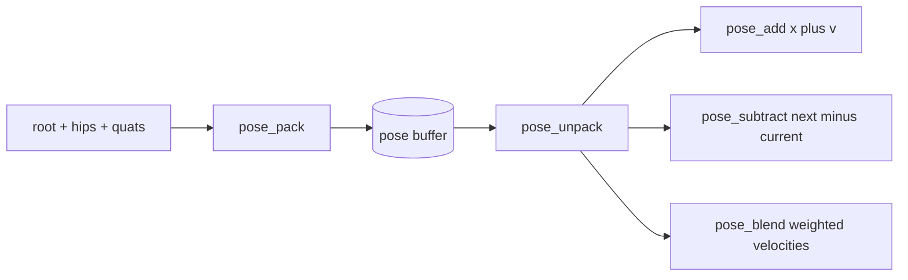

读这段时要注意，`pose_subtract` 对四元数做的是 `inv(b) * a`，不是简单相减；`pose_add` 则用 `qp_mul` 把 root delta 叠到当前 root 上。这样 velocity 才能随着角色当前朝向一起旋转。

### Cell 11 - Motion-field state table allocation

这一步把多段 BVH 片段变成数据库。`states_x` 保存规范化后的当前 pose，`states_v` 保存当前到下一帧的速度，`states_y` 保存下一帧到下下帧的速度，`states_c` 保存左右脚接触。

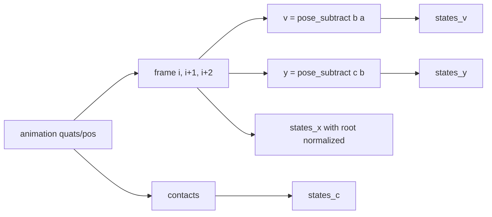


结果图的意义不在美观，而在确认数据库确实被分配并裁剪到实际 `states_count`。如果这个表的规模、shape 或 contact 列不对，后续 k-NN 和 value precompute 都会在错误的状态空间里工作。

### Cell 17 - UMAP motion-field embedding

UMAP 只是阅读工具，不参与 runtime 控制。它把 `metric_matrix.reshape(-1, FEATURE_SHAPE[0] * 3)` 投影到 3D，让读者看到相近姿态在低维图上形成连续团块。

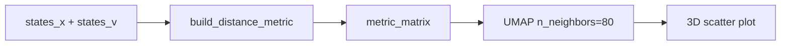


这张图不能证明 metric 完美，但能快速暴露两个问题：样本是否被严重撕裂，walk 与 jog 是否混到无法区分。讲解中也强调它只是帮助理解高维 motion field 的投影。

### Cell 20 - Torch nearest-neighbor helper 与相似度权重

近邻查询由 `get_nns_by_vector` 和 `get_k_neighbors` 分成两层。前者只返回最近索引与距离，后者把距离转成归一化反距离权重，供 motion blending 使用。

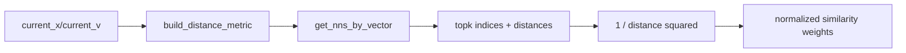


这段代码解释了 controller state 如何变成候选未来动作。注意 `torch.topk` 找的是 metric 空间距离最小的样本，而不是动画时间上相邻的帧。

### Cell 21 - compute_new_state 的积分与 drift correction

`compute_new_state` 用当前权重混合邻居 velocity，再加入一个朝向最大权重邻居的 tug。这个 tug 是 motion field 的稳定器：角色可以在场里移动，但不会被混合速度推到数据库完全没有样本的区域。

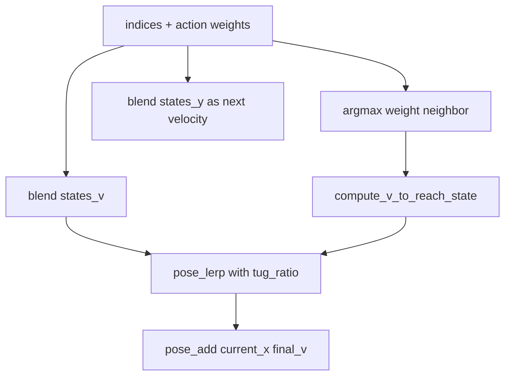

如果只做平均速度，短时间看起来能走，长时间会逐渐离开训练数据流形；加入 tug 后，系统每一步都被轻微拉回“真实动画曾经出现过”的区域。

### Cell 32 - Transition table precompute

value iteration 需要反复问：“从状态 `i` 采取动作 `a` 后，会落到哪些 value states 以及对应权重是多少？”在线做这件事太慢，所以 Cell 32 把这些查询提前存进大表。

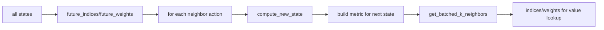


这就是用存储换交互速度。预计算完成后，训练和 runtime 都可以用数组索引加权求和，而不用在每次 Bellman backup 中重新扫完整数据库。

### Cell 35 - Value-learning score curve

`_train` 维护形状为 `[states_count, theta_count]` 的 value table。`theta_count = 17` 把目标朝向离散成 17 个格点；动作造成的朝向变化会落在两个 theta 格之间，因此代码还做了线性插值。

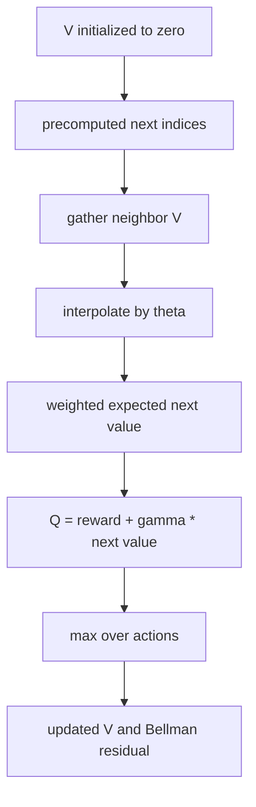


曲线关注的是 Bellman residual 的收敛趋势。它不是角色动画质量的最终评测，但能说明 value table 不再大幅震荡，策略学习进入稳定区间。

### Cell 36 - Runtime policy 选择与脚部约束

runtime 的核心是把 learned value 用回控制器。对 15 个候选动作分别预测下一状态、查 value、按 theta 插值，然后取未来奖励最高的一项。

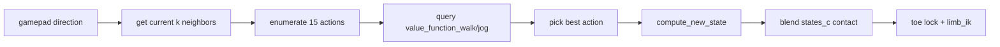

`gamepad.buttons[1]` 在 walk/jog value function 之间切换；接触锁脚则来自数据库里的 `states_c`。这说明本案例虽然主题是 motion field 控制，但完整 runtime 仍然依赖脚接触信息来保持视觉可信度。

## 关键数据结构

| 名称 | 形状 / 类型 | 作用 |
| --- | --- | --- |
| `PoseData` | `root`、`hips`、`quats` | 将统一 pose buffer 解释成可读字段 |
| `states_x` | `[states_count, bone_count + 2, 4]` | 规范化后的当前 pose |
| `states_v` | 同 `states_x` | 从当前帧到下一帧的 velocity |
| `states_y` | 同 `states_x` | 下一帧到下下帧的 velocity，用于更新未来速度 |
| `states_c` | `[states_count, 2]` | 左右脚接触标记，用于 runtime lock |
| `metric_matrix` | `[states_count, bone_count * 2, 3]` | k-NN 查询空间，包含姿态位置和下一帧位移 |
| `toch_knn_features` | Torch tensor on CUDA | GPU 暴力近邻查询的数据库张量 |
| `all_states_actions_states_x/v` | `[S, K, bone_count + 2, 4]` | 每个状态和动作对应的下一 motion state |
| `all_states_actions_value_function_indices/weights` | `[S, K, K]` | 下一状态查询 value table 时的近邻索引与权重 |
| `thetas` | `17` 个方向格 | value function 的目标方向离散化 |
| `value_function_walk/jog` | `[states_count, theta_count]` | walk 和 jog 两套 learned policy value |

## 执行结果的意义

这个 prepared notebook 跳过了若干依赖真实浏览器交互的 viewer/gamepad 单元，但保留了可复现的核心证据：状态表、UMAP、k-NN 代码、transition precompute 和 value-learning 曲线。

从结果读法上看，Cell 11 证明 motion state database 已经成型；Cell 17 帮读者理解 metric 空间的邻域结构；Cell 20 与 Cell 21 说明 runtime 如何从当前状态找候选并积分；Cell 32 解释为什么 value iteration 能在合理时间内跑；Cell 35 说明 learned value 的更新正在趋于稳定。把这些连起来，才是 Motion Fields 相比简单 clip selection 的关键：角色每一帧都在数据场中重新选择方向，而不是沿固定片段被动播放。

## 重点可视化 / 动画

本节只放源 notebook 真实输出。学习卡、skip log、controller log 和 walkthrough 只保留在后续证据表。

媒体审计说明：`00-walkthrough.webm` 是补充 walkthrough，只回放 cell 学习卡与结果证据；正文核心媒体仍以 UMAP 和 value-learning 两张 executed plot 为准。

媒体审计说明：`00-walkthrough.webm` 是补充 walkthrough，只回放 cell 学习卡与结果证据；正文核心媒体仍以 UMAP 和 value-learning 两张 executed plot 为准。

| 媒体 | 证据类型 | 阅读重点 |
| --- | --- | --- |
| [UMAP motion-field embedding](assets/03_umap_motion_field_result.png) | 核心图解 | 高维 motion field 在低维投影中的邻域连续性 |
| [Value-learning score curve](assets/07_value_learning_curve_result.png) | 核心图解 | Bellman residual 随 epoch 下降并进入稳定区间 |
| [Motion Fields walkthrough](assets/00-walkthrough.webm) | 补充证据 | 按 cell 顺序回放学习卡与结果证据 |

这段动画直接来自源案例 notebook 的 `render(frame, ratio=.1, select=..., on_spot=...)`。viewer 中间是当前 pose，旁边一排角色是 k-NN 候选动作，灰度强弱来自源代码里的邻居权重；每次调用 render 都会把当前状态推进到下一步。阅读时看当前角色如何不断从候选动作条中吸收局部运动，而不是看博客脚本重绘的矢量示意图。

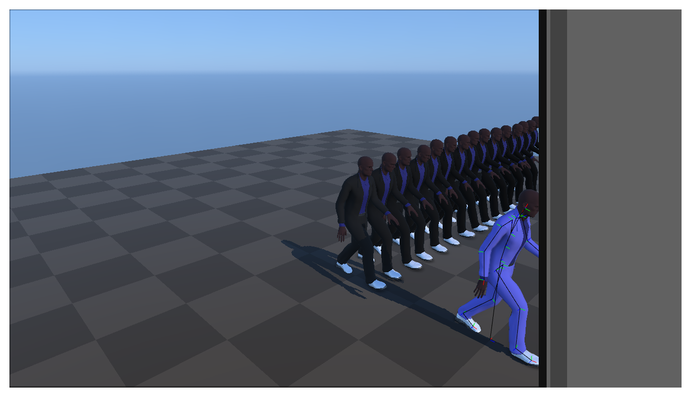

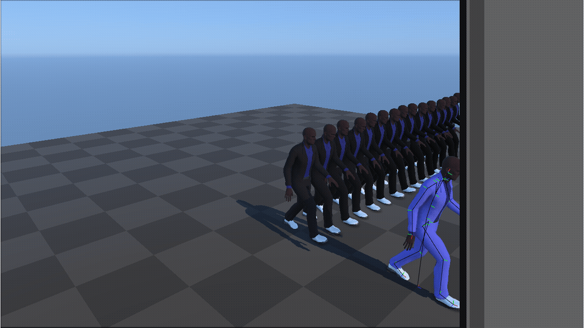

<video controls muted loop playsinline preload="metadata" width="100%" poster="assets/08_motion_field_neighbor_rollout_result.png" src="assets/08_motion_field_neighbor_rollout_preview.mp4"></video>

## 代码 Cell 与可视化证据

下面的表用于复现证据。`结果 PNG` 是正文可读结果媒体；`代码卡` 只作为源码摘要和输出来源记录。

| Cell / 片段 | 结果说明 | 证据 |
| --- | --- | --- |
| Cell 7 | prepared notebook 记录并跳过原始交互 viewer，保证浏览器安全验证可以继续。 | [结果 PNG](assets/01_interactive_ui_skip_note_result.png) / [代码卡](assets/01_interactive_ui_skip_note.png) |
| Cell 11 | state table 的日志展示了 pose、velocity、trajectory 和 contact 数据库的规模。 | [结果 PNG](assets/02_state_table_build_result.png) / [代码卡](assets/02_state_table_build.png) |
| Cell 17 | UMAP 图让 motion-field 的高维邻域结构变成可检查的低维散点。 | [结果 PNG](assets/03_umap_motion_field_result.png) / [代码卡](assets/03_umap_motion_field.png) |
| Cell 20 | Torch k-NN helper 说明当前控制状态如何转成候选未来动作。 | [结果 PNG](assets/04_torch_knn_functions_result.png) / [代码卡](assets/04_torch_knn_functions.png) |
| Cell 25 | controller widget 日志说明验证环境使用安全默认输入，不依赖物理手柄。 | [结果 PNG](assets/05_controller_widget_note_result.png) / [代码卡](assets/05_controller_widget_note.png) |
| Cell 32 | transition table 预计算把昂贵搜索从 runtime 移到离线阶段。 | [结果 PNG](assets/06_transition_table_precompute_result.png) / [代码卡](assets/06_transition_table_precompute.png) |
| Cell 35 | value-learning 曲线展示策略价值更新是否趋于稳定。 | [结果 PNG](assets/07_value_learning_curve_result.png) / [代码卡](assets/07_value_learning_curve.png) |
| Cell 23 | Source notebook motion-field viewer shows the current character and k-NN candidate strip generated by the original render function. | [Result PNG](assets/08_motion_field_neighbor_rollout_result.png) / [GIF](assets/08_motion_field_neighbor_rollout_preview.gif) / [MP4](assets/08_motion_field_neighbor_rollout_preview.mp4) / [WebM](assets/08_motion_field_neighbor_rollout_preview.webm) / [代码卡](assets/08_motion_field_neighbor_rollout.png) |
| walkthrough | 按 cell 顺序回放学习卡与结果证据，不作为正文核心算法媒体。 | [WebM](assets/00-walkthrough.webm) |
## 运行方式

AnimationPapers 案例优先使用：

```powershell
powershell -NoProfile -ExecutionPolicy Bypass -File .\tools\start_animationpapers_lab.ps1
```

单案例验证使用：

```powershell
powershell -NoProfile -ExecutionPolicy Bypass -File .\tools\run_case.ps1 motion_fields_for_interactive_character_animation
```
