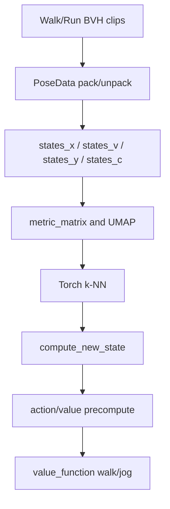
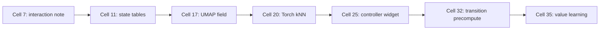
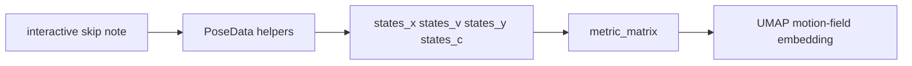
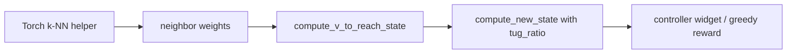
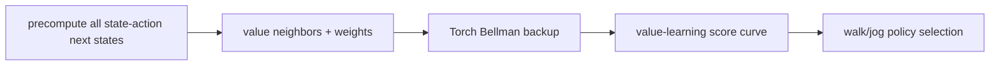

# Motion Fields for Interactive Character Animation：Pose+Velocity 样本场控制

## 元数据

| 字段 | 内容 |
| --- | --- |
| slug | `motion_fields_for_interactive_character_animation` |
| source path | [`labs/AnimationPapers/Motion Fields For Interactive Character Animation.ipynb`](../../../../labs/AnimationPapers/Motion Fields For Interactive Character Animation.ipynb) |
| transcript sources | [`docs/transcripts/ukobLRLKZDM_Reinforcement Learning 04 _ Motion Fields For Interactive Character Animation_.txt`](../../../../docs/transcripts/ukobLRLKZDM_Reinforcement Learning 04 _ Motion Fields For Interactive Character Animation_.txt) |
| env prefix | `.envs/motion_fields` |
| kernel | `animationtech-motion_fields_for_interactive_character_animation` |
| validation status | `passed` (`manual_smoke`) |

## 问题背景

Motion Fields 不把动作表示成 clip graph，而是把每一帧编码为 pose 和 velocity 的样本状态。语音稿强调四个核心概念：pose、velocity、motion state 和 similarity metric。运行时根据当前状态和目标速度在样本场中找邻居，插值得到下一状态，再用 value function 改善长期行为。

## 阅读前置知识

- pose/velocity state：姿态与下一帧 delta 一起构成 motion field。
- quaternion 姿态代数：pose pack/unpack/add/subtract/lerp。
- k-NN 与 metric matrix：距离定义决定动作相似性。
- fitted value iteration：用预计算邻居和权重做 Bellman backup。

## 总模块图



## 代码执行路径



## 模块拆解

### 1. Motion State Database

`PoseData` 把 root、hips 和 bone quaternions 打包进统一 buffer。`states_x` 是 pose，`states_v` 是 velocity，二者合起来描述当前状态和自然通向的下一帧。

### 2. Similarity Metric 与 k-NN

`metric_matrix` 给不同 pose 维度分配权重。UMAP 只是可视化投影，真正运行时依赖 Torch k-NN 在高维空间中找邻居。

### 3. Value Function

greedy action 只看即时目标；transition table 和 value function 让系统估计不同 theta/action 的未来收益。

## 关键 cell / 函数深讲

### Cell 7-17 - 从 pose algebra 到 motion field



UMAP 图只用来理解样本场结构，不是运行时算法本身。


### Cell 20-25 - k-NN 查询与控制入口



k-NN helper 说明 controller state 如何变成候选未来动作。


### Cell 32-35 - Transition Table 与 Value Learning



value-learning 曲线验证离线策略是否稳定。


## 关键数据结构

- `PoseData`：pose buffer 的 pack/unpack/add/subtract/lerp 接口。
- `states_x`、`states_v`、`states_y`、`states_c`：motion field 样本、速度、标签和 contact。
- `metric_matrix`、`toch_knn_features`：近邻查询的距离空间。
- `all_states_actions_states_x/v`、`all_states_actions_value_function_indices/weights`：预计算转移表。
- `thetas`、`value_function_walk`、`value_function_jog`：策略学习结果。

## 执行结果的意义

当前 prepared notebook 跳过了部分原始交互 cell，因此正文把重点放在可复现的 state table、UMAP、k-NN 和 value learning 证据上。

## 重点可视化 / 动画

README 中优先引用结果 PNG、GIF 预览和视频链接；代码学习卡保留为复现证据。

[打开/下载总览 WebM](assets/00-walkthrough.webm)

| Cell | 输出类型 | 媒体角色 | 代码目的 | 结果媒体 |
| --- | --- | --- | --- | --- |
| Cell 7 | `log` | `supporting_evidence` | Record the prepared skip for the first interactive viewer cell. | [结果 PNG](assets/01_interactive_ui_skip_note_result.png) / [代码卡](assets/01_interactive_ui_skip_note.png) |
| Cell 11 | `table` | `supporting_evidence` | Allocate pose, velocity, and trajectory state arrays for the motion field. | [结果 PNG](assets/02_state_table_build_result.png) / [代码卡](assets/02_state_table_build.png) |
| Cell 17 | `plot` | `key_visual` | Project high-dimensional motion states to a two-dimensional field. | [结果 PNG](assets/03_umap_motion_field_result.png) / [代码卡](assets/03_umap_motion_field.png) |
| Cell 20 | `code_only` | `code_evidence` | Define vector-based nearest-neighbor queries for runtime motion lookup. | [结果 PNG](assets/04_torch_knn_functions_result.png) / [代码卡](assets/04_torch_knn_functions.png) |
| Cell 25 | `log` | `supporting_evidence` | Create the browser gamepad/controller widget with safe defaults. | [结果 PNG](assets/05_controller_widget_note_result.png) / [代码卡](assets/05_controller_widget_note.png) |
| Cell 32 | `log` | `supporting_evidence` | Run the precompute cell that fills transition/value tables. | [结果 PNG](assets/06_transition_table_precompute_result.png) / [代码卡](assets/06_transition_table_precompute.png) |
| Cell 35 | `plot` | `key_visual` | Plot the learning score over epochs. | [结果 PNG](assets/07_value_learning_curve_result.png) / [代码卡](assets/07_value_learning_curve.png) |

## 代码 Cell 与可视化结果

本节保留每个 cell 的可复现证据。结果 PNG 用于正文阅读，代码卡记录代码摘要与输出来源；有 timeline 或参数滑杆的 cell 同时提供 GIF、MP4 和 WebM。

| Cell / 片段 | 结果说明 | 证据 |
| --- | --- | --- |
| Cell 7 | The note separates browser-safe validation from the original exploratory UI. | [结果 PNG](assets/01_interactive_ui_skip_note_result.png) / [代码卡](assets/01_interactive_ui_skip_note.png) |
| Cell 11 | The table-like log shows the scale and layout of the state database. | [结果 PNG](assets/02_state_table_build_result.png) / [代码卡](assets/02_state_table_build.png) |
| Cell 17 | The plot makes the motion-field neighborhood structure visible. | [结果 PNG](assets/03_umap_motion_field_result.png) / [代码卡](assets/03_umap_motion_field.png) |
| Cell 20 | The source card explains how a controller state becomes candidate future motions. | [结果 PNG](assets/04_torch_knn_functions_result.png) / [代码卡](assets/04_torch_knn_functions.png) |
| Cell 25 | The log documents why browser capture uses default input rather than requiring physical hardware. | [结果 PNG](assets/05_controller_widget_note_result.png) / [代码卡](assets/05_controller_widget_note.png) |
| Cell 32 | Moving the expensive search offline is what makes runtime interaction feasible. | [结果 PNG](assets/06_transition_table_precompute_result.png) / [代码卡](assets/06_transition_table_precompute.png) |
| Cell 35 | The curve gives a quick read on whether the learned policy is stabilizing. | [结果 PNG](assets/07_value_learning_curve_result.png) / [代码卡](assets/07_value_learning_curve.png) |


## 运行方式

AnimationPapers 案例优先使用：

```powershell
powershell -NoProfile -ExecutionPolicy Bypass -File .\tools\start_animationpapers_lab.ps1
```

单案例验证使用：

```powershell
powershell -NoProfile -ExecutionPolicy Bypass -File .\tools\run_case.ps1 motion_fields_for_interactive_character_animation
```
