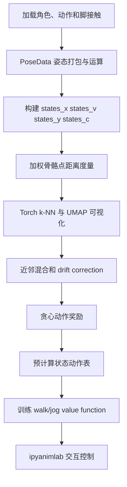
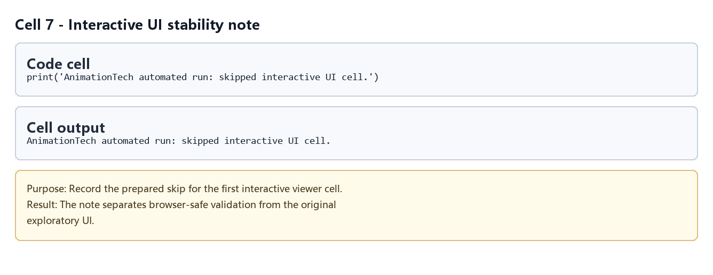
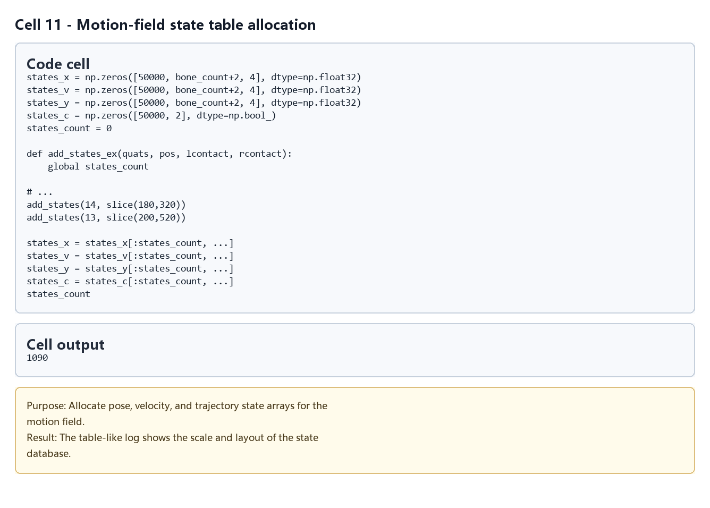
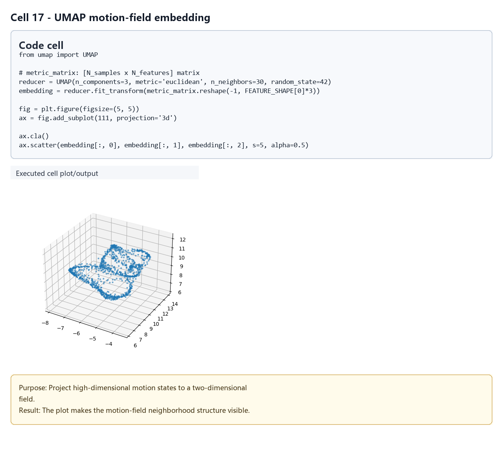
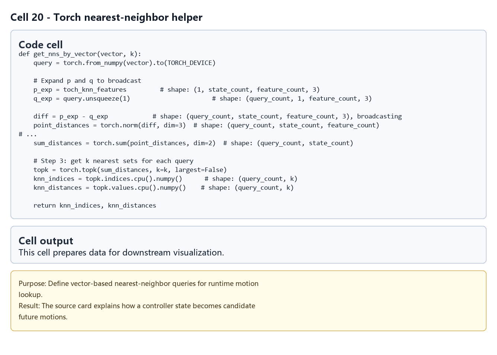
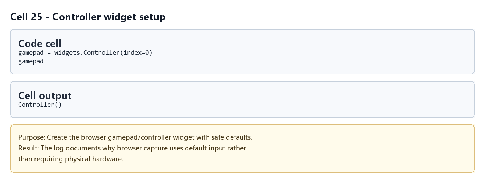
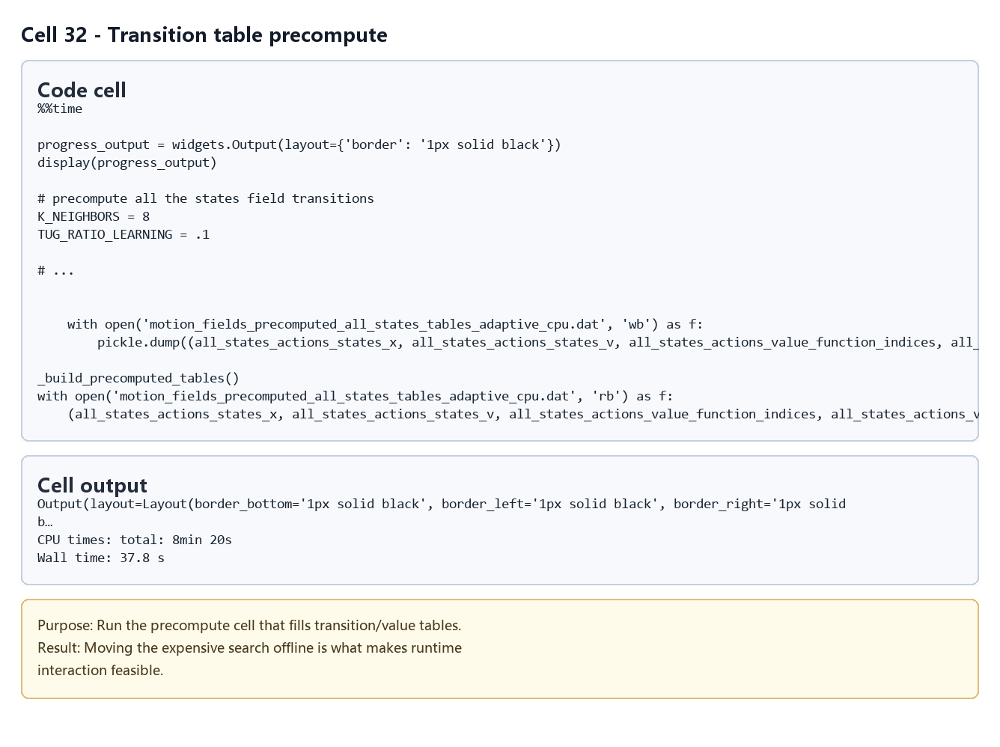
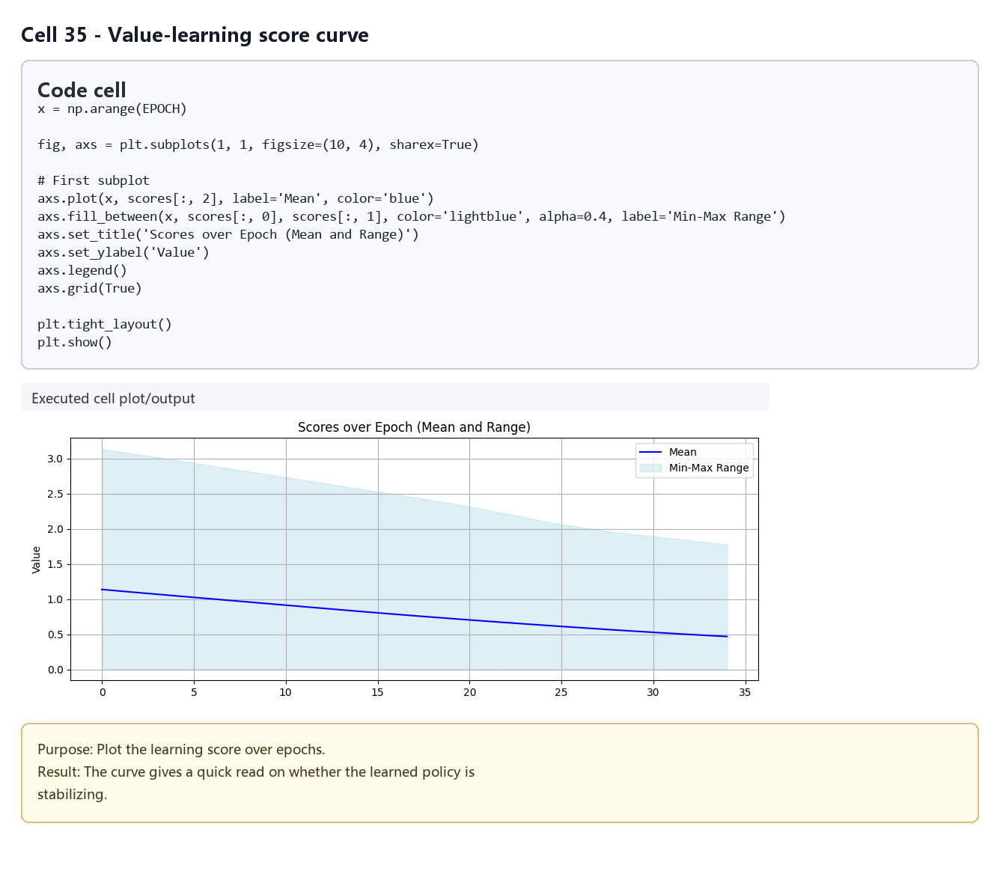

# Motion Fields：基于近邻状态场的交互角色控制

## 元数据

| 字段 | 值 |
| --- | --- |
| slug | `motion_fields_for_interactive_character_animation` |
| source path | [`labs/AnimationPapers/Motion Fields For Interactive Character Animation.ipynb`](<../../../../labs/AnimationPapers/Motion Fields For Interactive Character Animation.ipynb>) |
| env prefix | `.envs/motion_fields` |
| kernel | `animationtech-motion_fields_for_interactive_character_animation` |
| validation status | `passed`（`manual_smoke`，最后记录：`2026-04-29T19:58:18.2493674Z`；仍需 JupyterLab 手动 smoke test） |

## 问题背景

Motion Fields 把动作库看成连续状态空间中的样本集合。每个状态包含当前姿态 `x`、下一步速度 `v`、再下一步增量 `y` 和脚接触信息。运行时系统不直接选单一帧，而是在 k 个近邻之间混合速度，并用“拉向某个近邻”的比例保持动作真实感。

Notebook 先实现姿态代数和相似度度量，再用 Torch 做 GPU k-NN，最后加入动作奖励和 value function，让角色可以根据期望方向在 walk/jog 风格之间选择动作。

## 总模块图



## 模块拆解

### 1. 姿态状态定义

`Motion states and notation` 定义 `POSESHAPE = (bone_count + 2, 4)`，把 root 平移、hips 平移和所有骨骼四元数统一打包成一个 pose。`pose_add`、`pose_subtract`、`pose_lerp`、`pose_blend` 和 `pose_to_qp` 让姿态能像向量场一样做增量、差分、插值和混合。

### 2. 状态表构建

`Build the states` 预分配 `states_x`、`states_v`、`states_y` 和 `states_c`。`add_states_ex` 从连续三帧中提取当前归一化姿态、当前到下一帧的速度、下一帧到再下一帧的增量，并记录左右脚接触。数据覆盖 walk 和 jog 片段，`end_of_walk_ids` 用于区分两种运动风格。

### 3. 相似度度量与嵌入

`Similarity metric and similarity weights` 用当前姿态的 FK 点位和一步后的点位差构造 `FEATURE_SHAPE = (bone_count * 2, 3)`。`metric_weights` 和 `metric_velocity_weights` 强调脚、腿和根部等关键骨骼。UMAP 单元把高维度量矩阵降到三维，用来观察 motion field 的样本分布。

### 4. GPU k-NN

`Use Pytorch for knn` 把 `metric_matrix` 放到 CUDA 上，`get_nns_by_vector` 用广播计算 query 到所有状态的点云距离，并返回最近的 k 个状态及距离。距离再转成反平方权重，作为后续混合的基础。

### 5. 状态积分与漂移修正

`Integration function and drift correction` 中，`compute_v_to_reach_state` 计算从当前姿态拉向某个近邻所需的速度；`compute_new_state` 混合近邻速度与目标近邻速度，再混合 `states_y` 得到下一状态增量。`tug_ratio` 控制“平滑混合”和“贴近真实样本”的平衡。

### 6. 动作选择与 value function

`Greedy action selection from k-NN` 用 `signed_angle` 和 `action_reward` 让角色朝向期望方向。后半部分 `Using the value function` 预计算每个状态和动作的下一状态近邻表，训练 `value_function_walk` 和 `value_function_jog`。交互阶段根据 gamepad 和按钮选择 walk 或 jog 的 value function，并在候选动作里取未来奖励最高者。

## 关键数据结构

- `PoseData`：封装 root、hips 和骨骼四元数的轻量姿态对象。
- `states_x`：当前姿态样本表。
- `states_v`：从当前姿态到下一帧的速度或姿态增量。
- `states_y`：下一步之后的增量，用于积分预测。
- `states_c`：左右脚接触状态。
- `metric_matrix`：每个状态的加权骨骼点特征，用于 k-NN。
- `all_states_actions_states_x`、`all_states_actions_states_v`：每个状态下每个候选动作产生的下一状态。
- `all_states_actions_value_function_indices`、`all_states_actions_value_function_weights`：value function 查表所需的下一状态近邻和权重。
- `value_function_walk`、`value_function_jog`：按目标朝向离散角度训练出的长期回报表。

## 执行结果的意义

运行成功后，角色不是简单播放某一段 BVH，而是在近邻状态场中连续积分。UMAP 图可以帮助判断样本是否形成连贯运动流形；交互 viewer 则验证近邻混合、方向奖励和 value function 是否能产生稳定的 walk/jog 控制。若状态权重或 tug 比例不合适，常见问题是姿态漂移、脚步抖动、转向迟钝或风格切换不清晰。

## 代码 Cell 与可视化结果

本节按 notebook 的关键 code cell 组织学习素材：每个条目都对应代码目的、实际输出类型、结果意义和 PNG 学习卡片。PNG 由指定 cell 的代码摘要、输出区、viewer/canvas 或图表/日志合成，不使用整页滚动截图替代。

> Note: Prepared notebook skips several original interactive cells; media prioritizes stable plots, logs, and source evidence.

<video controls muted src="assets/00-walkthrough.webm"></video>

[下载 WebM](assets/00-walkthrough.webm)

| Cell | 输出类型 | 代码做什么 | 结果说明什么 | 素材 |
| --- | --- | --- | --- | --- |
| 7 | `log` | Record the prepared skip for the first interactive viewer cell. | The note separates browser-safe validation from the original exploratory UI. | [PNG](assets/01_interactive_ui_skip_note.png) |
| 11 | `table` | Allocate pose, velocity, and trajectory state arrays for the motion field. | The table-like log shows the scale and layout of the state database. | [PNG](assets/02_state_table_build.png) |
| 17 | `plot` | Project high-dimensional motion states to a two-dimensional field. | The plot makes the motion-field neighborhood structure visible. | [PNG](assets/03_umap_motion_field.png) |
| 20 | `code_only` | Define vector-based nearest-neighbor queries for runtime motion lookup. | The source card explains how a controller state becomes candidate future motions. | [PNG](assets/04_torch_knn_functions.png) |
| 25 | `log` | Create the browser gamepad/controller widget with safe defaults. | The log documents why browser capture uses default input rather than requiring physical hardware. | [PNG](assets/05_controller_widget_note.png) |
| 32 | `log` | Run the precompute cell that fills transition/value tables. | Moving the expensive search offline is what makes runtime interaction feasible. | [PNG](assets/06_transition_table_precompute.png) |
| 35 | `plot` | Plot the learning score over epochs. | The curve gives a quick read on whether the learned policy is stabilizing. | [PNG](assets/07_value_learning_curve.png) |

### Cell 7 - Interactive UI stability note

- 代码做什么：Record the prepared skip for the first interactive viewer cell.
- 运行后看到什么：运行日志或文本输出。
- 结果说明什么：The note separates browser-safe validation from the original exploratory UI.



### Cell 11 - Motion-field state table allocation

- 代码做什么：Allocate pose, velocity, and trajectory state arrays for the motion field.
- 运行后看到什么：表格或结构化数据输出。
- 结果说明什么：The table-like log shows the scale and layout of the state database.



### Cell 17 - UMAP motion-field embedding

- 代码做什么：Project high-dimensional motion states to a two-dimensional field.
- 运行后看到什么：图表输出。
- 结果说明什么：The plot makes the motion-field neighborhood structure visible.



### Cell 20 - Torch nearest-neighbor helper

- 代码做什么：Define vector-based nearest-neighbor queries for runtime motion lookup.
- 运行后看到什么：代码逻辑片段。
- 结果说明什么：The source card explains how a controller state becomes candidate future motions.



### Cell 25 - Controller widget setup

- 代码做什么：Create the browser gamepad/controller widget with safe defaults.
- 运行后看到什么：运行日志或文本输出。
- 结果说明什么：The log documents why browser capture uses default input rather than requiring physical hardware.



### Cell 32 - Transition table precompute

- 代码做什么：Run the precompute cell that fills transition/value tables.
- 运行后看到什么：运行日志或文本输出。
- 结果说明什么：Moving the expensive search offline is what makes runtime interaction feasible.



### Cell 35 - Value-learning score curve

- 代码做什么：Plot the learning score over epochs.
- 运行后看到什么：图表输出。
- 结果说明什么：The curve gives a quick read on whether the learned policy is stabilizing.



## 运行方式

先启动 AnimationPapers 的 JupyterLab 环境，并选择元数据表中的 kernel：

```powershell
powershell -NoProfile -ExecutionPolicy Bypass -File .\tools\start_animationpapers_lab.ps1
```

如需按案例脚本做自动化检查，使用 slug 运行：

```powershell
powershell -NoProfile -ExecutionPolicy Bypass -File .\tools\run_case.ps1 motion_fields_for_interactive_character_animation
```
