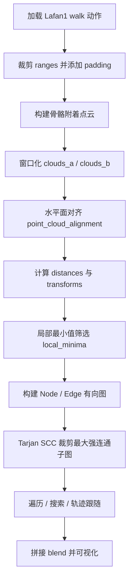
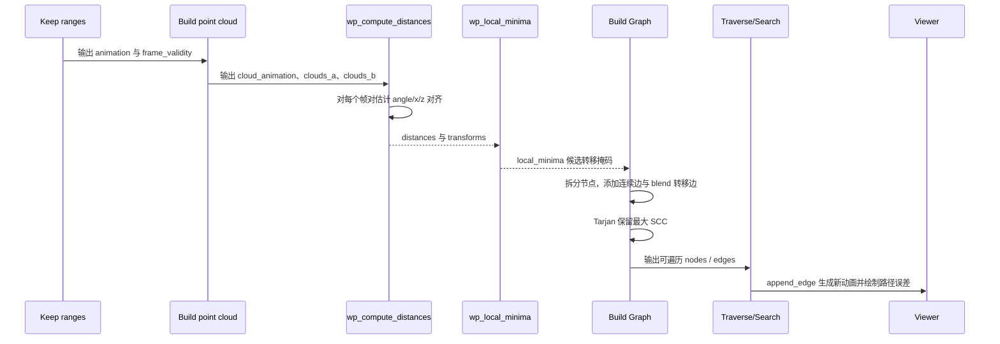
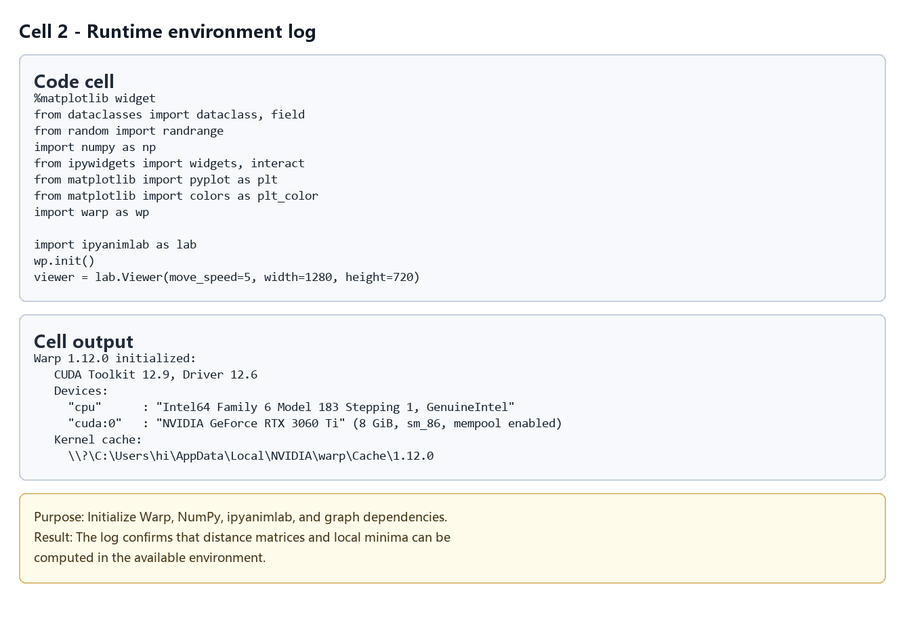
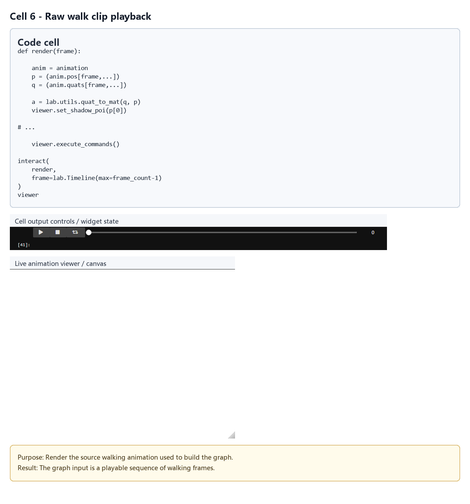
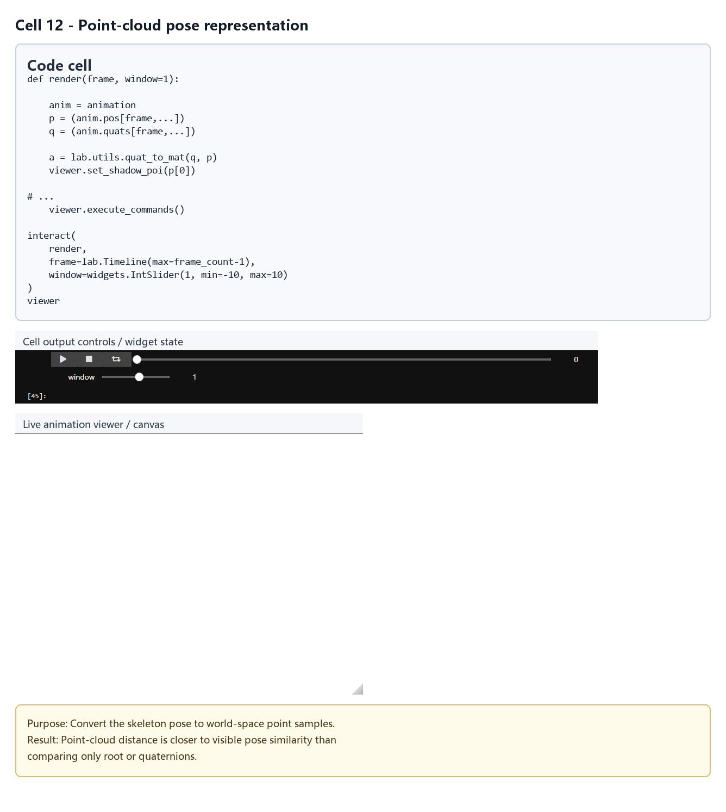
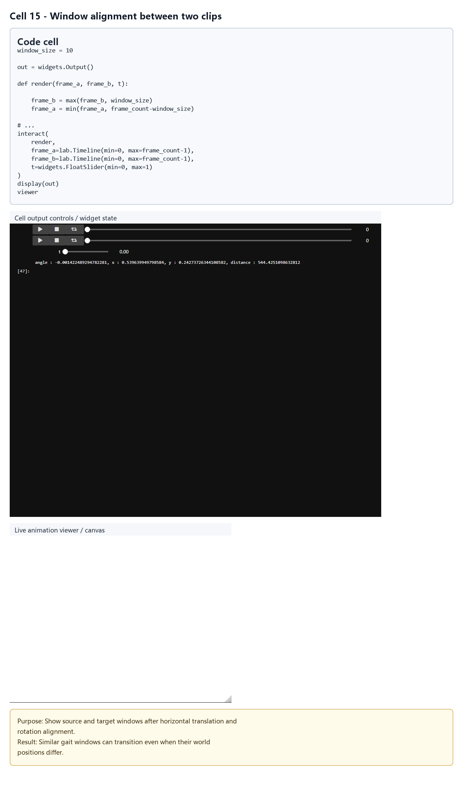
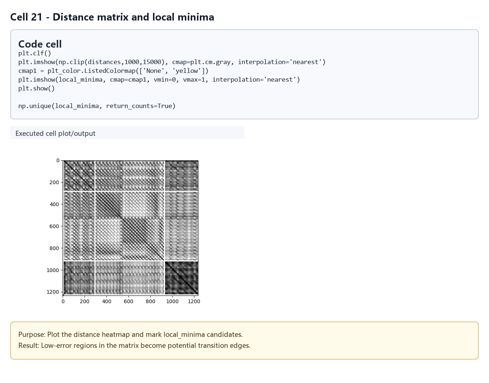
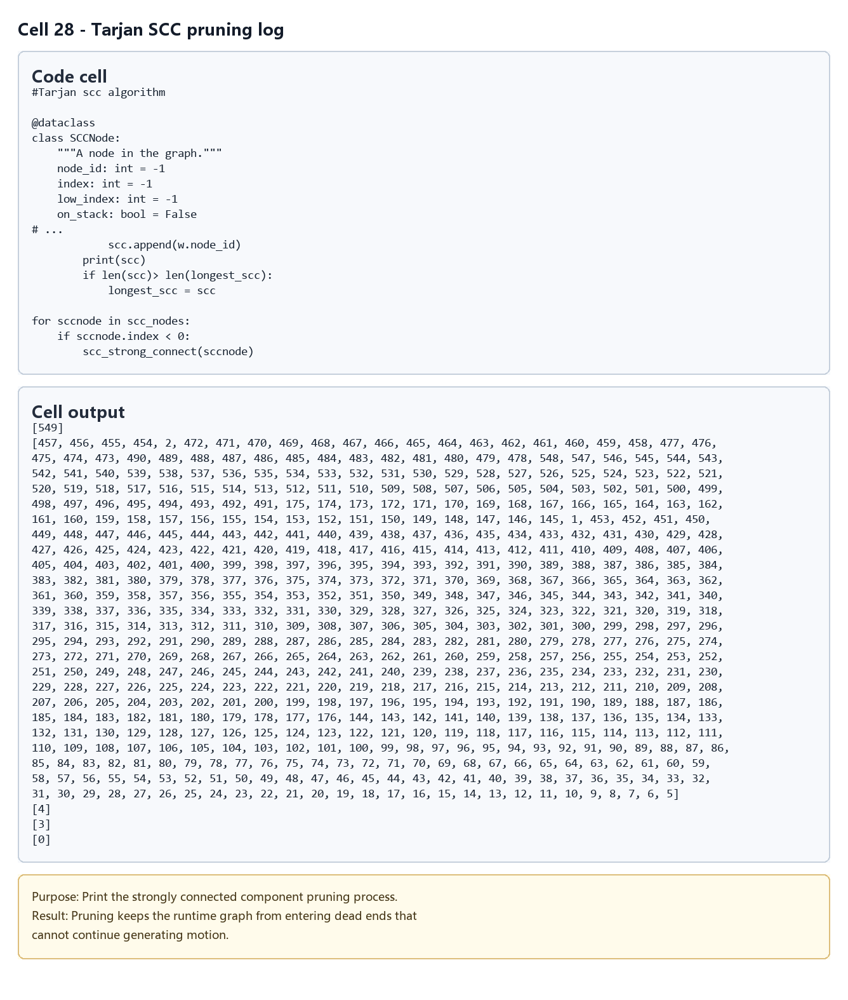
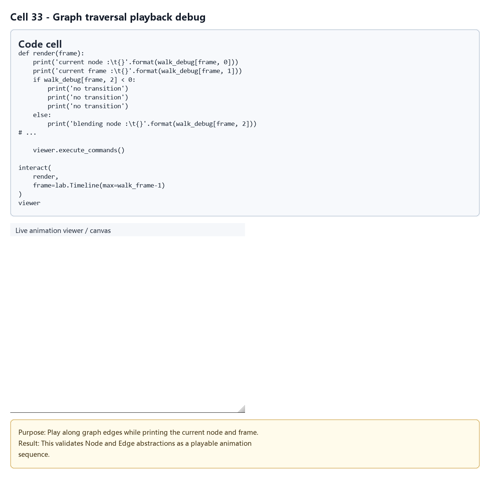
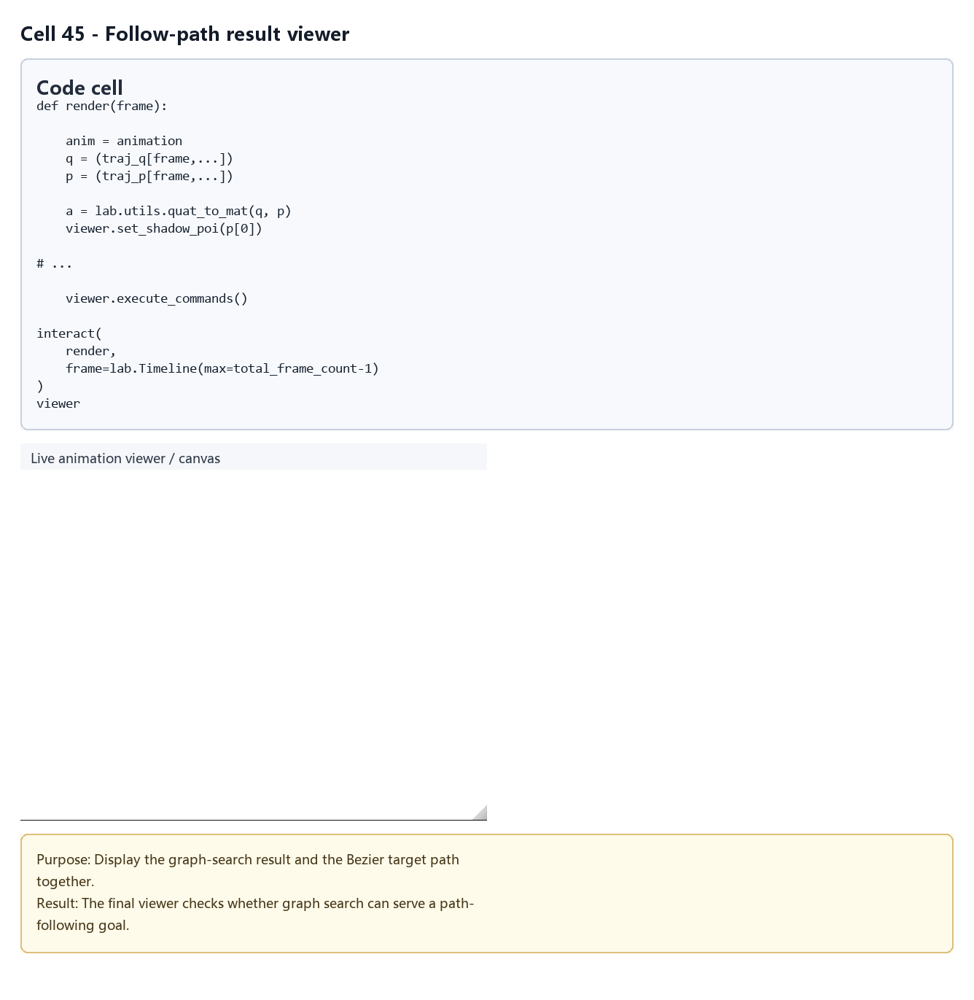

# Motion Graph：从相似姿态中构建动作转移图

## 元数据

| 字段 | 值 |
| --- | --- |
| slug | `motion_graph` |
| source path | [`labs/AnimationPapers/Motion Graph.ipynb`](<../../../../labs/AnimationPapers/Motion Graph.ipynb>) |
| env prefix | `.envs/motion_graph` |
| kernel | `animationtech-motion_graph` |
| validation status | `passed`（`manual_smoke`，最后记录：`2026-04-29T19:59:27.0611060Z`；仍需 JupyterLab 手动 smoke test） |

## 问题背景

Motion Graph 把动捕片段变成一张有向图：节点是可以连续播放的动作区间，边是可以从一个区间跳到另一个区间的转移。它和 Motion Matching 都依赖动捕数据，但关注点不同。Motion Matching 每帧做最近邻查询；Motion Graph 先离线找出“哪些帧之间能接”，再在图上遍历、随机游走或搜索路径。

这个 notebook 从 Lafan1 的行走片段出发，先裁剪有效区间并保留前后 padding，然后用绑定在骨骼上的点云表示姿态窗口。系统对任意两帧附近的窗口做水平面对齐，计算点云误差矩阵，从误差矩阵里找局部最小值作为候选转移边。最后它构建 `Node`/`Edge` 图，用 Tarjan 强连通分量裁剪掉不可循环的部分，并把图路径重新拼接成可预览动画。

案例的价值在于把“相似姿态”这个直觉变成完整数据结构：距离度量决定候选边，转移边决定图的连通性，图遍历决定生成动画的多样性，可视化则帮助判断边是否真的可用。

## 阅读前置知识

- 需要知道骨骼动画、root 运动、FK 和局部/世界空间变换。
- 需要理解图结构：有向边、节点、出边、路径、强连通分量。
- 需要知道点云距离的直觉：不用直接比较四元数，而是比较角色身体采样点在空间中的形状。
- 需要了解窗口匹配：比较单帧容易误判，比较前后多帧能把速度和步态趋势一起纳入距离。
- 若要深入 GPU cell，需要能读 Warp kernel 的输入输出数组，但理解算法本身不依赖写 CUDA。

## 总模块图



## 代码执行路径



Notebook 的前半段是离线建图：`Keep only a few ranges`、`Build point cloud`、`Find the alignment and errors`、`Build the potential transition points`、`Build Graph` 和 `Prune the graph`。后半段是用图生成动画：`Traverse the graph` 随机或按边拼接，`Search` 找满足帧数和低误差的路径，`Follow Path` 则把图路径与 Bezier 目标轨迹进行比较。

## 模块拆解

### 1. 动作裁剪与有效帧

`Keep only a few ranges` 从 `walk1_subject5.bvh` 中取出多个行走区间，并在每段前后加 `padding_frame_count = 10`。padding 不算真正的图节点，但它在窗口距离和 blend 过渡里很重要：比较某一帧是否能跳转时，需要看它前后若干帧的姿态趋势；混合时，也需要源帧和目标帧周围有足够上下文。

`frame_validity` 区分有效帧与 padding 帧。后续构建候选转移时，只允许有效帧成为节点或转移端点，这样可以避免图边落在裁剪片段的边缘，导致播放时缺少前后文。

### 2. 点云姿态表示

`Build point cloud` 定义 `point_cloud_def`：每个采样点绑定到一个骨骼，并带有该骨骼局部空间中的偏移。代码通过 FK 把这些点变换到每一帧的世界空间，得到 `cloud_animation`。采样点覆盖 Hips、腿、脚、脊柱、手臂和头部，因此距离不仅看 root，也能看脚步接触和身体姿态。

点云的好处是距离更接近视觉结果。两个四元数数值差不一定意味着观感差异大，尤其在骨骼层级里误差会传播；点云则直接比较身体表面附近的空间点。如果两个窗口点云在水平面对齐后仍然接近，说明这两段动作在姿态和运动趋势上都可能接得上。

### 3. 距离度量与水平面对齐

`Find the alignment and errors` 中的 `point_cloud_alignment` 估计从点云 A 到点云 B 的水平旋转角和 x/z 平移。Motion Graph 不应该因为角色站在不同世界位置或朝向不同就拒绝转移，所以比较前要把两个窗口对齐到同一局部参考下。

距离不是只看单帧，而是看窗口。`Build the potential transition points` 用 Warp kernel `wp_compute_distances` 对所有帧对计算窗口点云误差，并输出两张核心表：`distances` 保存误差，`transforms` 保存把目标片段对齐到源片段所需的 `angle`、`x`、`z`。后面真正播放转移时，这个 transform 会用于修正 root，使目标片段接到当前世界位置。

### 4. 候选转移边筛选

距离矩阵里低误差点很多，但不是每个都适合做边。`wp_local_minima` 会筛掉三类点：误差超过 `max_error` 的点、离自身时间邻域太近的点、不是八邻域局部最小的点。这个规则避免图里充满重复边，也避免把同一段动画附近的连续帧误判成有意义转移。

筛选结果 `local_minima` 是一个掩码，表示哪些 `(source_frame, target_frame)` 可以作为候选转移。Notebook 还把 `animation`、`window_size`、`frame_validity` 和候选信息写入 `motion_graph_walking_rawdata.dat`，这说明 motion graph 的离线结果可以被其他行为系统复用。

### 5. 图构建、节点拆分与强连通裁剪

`Build Graph` 定义 `Node` 和 `Edge`。节点代表连续播放区间，普通连续边表示从当前节点自然走到下一个节点，不需要 blend；候选转移边则记录源帧、目标帧、是否需要 blend，以及距离计算得到的对齐 transform。

一个细节是节点拆分：如果候选转移发生在节点内部，Notebook 会把原节点拆成更短的节点，使边从节点末端出发。这样图遍历时只需要沿节点播放到末端，再选择出边，逻辑更清晰。

`Prune the graph` 使用 Tarjan SCC 算法保留最大的强连通分量。强连通意味着任意节点理论上都能沿有向边回到彼此所在区域，这对可持续生成动画很重要。没有这一步，随机遍历可能走进死胡同，或者图只生成一小段就没有出边。

### 6. 图遍历、搜索与可视化

`Traverse the graph` 提供 `append_no_blend`、`append_blend` 和 `append_edge`。`append_no_blend` 复制连续片段；`append_blend` 会把源窗口和目标窗口在对齐 transform 下混合；`append_edge` 则根据边类型选择拼接方式。这里把抽象图路径还原成真正可播放的骨骼动画。

`Search` 用 `Path` 维护候选路径的边序列、累计帧数和误差，并用栈式搜索扩展低成本路径。`Follow Path` 构造 Bezier 轨迹，把图路径生成的 root 轨迹与目标曲线比较，选出更接近目标的路径。可视化时，角色动画、目标曲线和误差线一起出现，能帮助判断问题是“图边不够”“边质量差”还是“搜索目标太难”。

## 关键 cell / 函数深讲

- `Keep only a few ranges`：控制输入数据规模和有效帧范围。`padding_frame_count` 决定窗口匹配和 blend 是否有足够上下文。
- `Build point cloud`：把骨骼姿态转成点云。它决定距离度量看到的是哪些身体部位，脚点和 hips 点通常最影响行走转移质量。
- `point_cloud_alignment`：在水平面上估计旋转和平移，使同一姿态在不同位置、朝向下仍可比较。
- `wp_compute_distances`：批量计算帧对窗口距离，输出 `distances` 与 `transforms`。这是离线建图中最重的计算。
- `wp_local_minima`：从距离矩阵里筛出真正有意义的候选转移。`max_error` 和邻域排除半径会直接改变图边数量。
- `Node` / `Edge`：把候选帧对组织成可遍历图。`Edge` 中的 blend 标记和对齐 transform 是从“相似”到“可播放”的关键。
- `scc_strong_connect`：Tarjan 强连通算法实现。它把候选图裁剪成能长期遍历的核心子图。
- `append_blend`：根据边 transform 对齐目标片段，并混合源/目标窗口。它决定转移边在视觉上是否平滑。
- `search` 与 `Path`：把图遍历变成优化问题，可以按帧数、累计误差或目标轨迹条件选择路径。

## 关键数据结构

- `ranges`：从原始 BVH 保留的行走帧区间。
- `frame_validity`：区分有效帧与 padding 帧的标记，决定哪些帧可成为图节点或转移端点。
- `point_cloud_def`、`point_cloud_parent`、`point_cloud_local`：点云采样点的骨骼归属和局部坐标。
- `cloud_animation`：每帧完整点云，来自 FK 后的世界空间采样点。
- `clouds_a`、`clouds_b`：窗口化后的点云比较输入，用于批量计算帧对误差。
- `transforms`：每个候选帧对的水平面对齐变换，包含旋转和平移信息。
- `distances`：帧对窗口误差矩阵，是候选边筛选的主要依据。
- `local_minima`：局部最小值掩码，标记哪些帧对可转成转移边。
- `Node`：图节点，记录 `node_id`、连续动作区间 `start/end` 和出边。
- `Edge`：有向边，记录源帧、目标帧、是否 blend、对齐 transform 与误差信息。
- `Path`：搜索过程中的候选路径，保存边序列、累计帧数、累计误差和轨迹比较状态。

## 执行结果的意义

成功运行后，角色可以从少量行走片段中生成更长、更有变化的行走动画。随机遍历能展示图的连通性；固定帧数搜索能展示路径代价如何影响结果；轨迹跟随则展示 motion graph 是否能被更高层行为目标驱动。

如果距离度量过严，`local_minima` 会很少，图会断裂或缺少可选边；如果距离度量过松，图边很多但转移会脚滑、跳姿态。若 Tarjan 裁剪后节点大幅减少，说明候选边不能形成可循环结构。可视化的意义就在这里：它不只是播放动画，还把距离矩阵、候选边、图路径和轨迹误差串起来，让你能定位是哪一层破坏了生成质量。

## 代码 Cell 与可视化结果

本节按 notebook 的关键 code cell 组织学习素材：每个条目都对应代码目的、实际输出类型、结果意义和 PNG 学习卡片。PNG 由指定 cell 的代码摘要、输出区、viewer/canvas 或图表/日志合成，不使用整页滚动截图替代。

<video controls muted src="assets/00-walkthrough.webm"></video>

[下载 WebM](assets/00-walkthrough.webm)

| Cell | 输出类型 | 代码做什么 | 结果说明什么 | 素材 |
| --- | --- | --- | --- | --- |
| 2 | `log` | Initialize Warp, NumPy, ipyanimlab, and graph dependencies. | The log confirms that distance matrices and local minima can be computed in the available environment. | [PNG](assets/cropped_ranges_padding.png) |
| 6 | `viewer` | Render the source walking animation used to build the graph. | The graph input is a playable sequence of walking frames. | [PNG](assets/motion_graph_overview.png) |
| 12 | `viewer` | Convert the skeleton pose to world-space point samples. | Point-cloud distance is closer to visible pose similarity than comparing only root or quaternions. | [PNG](assets/point_cloud_pose.png) |
| 15 | `viewer` | Show source and target windows after horizontal translation and rotation alignment. | Similar gait windows can transition even when their world positions differ. | [PNG](assets/alignment_pair.png) |
| 21 | `plot` | Plot the distance heatmap and mark local_minima candidates. | Low-error regions in the matrix become potential transition edges. | [PNG](assets/distance_matrix_minima.png) |
| 28 | `log` | Print the strongly connected component pruning process. | Pruning keeps the runtime graph from entering dead ends that cannot continue generating motion. | [PNG](assets/scc_pruning.png) |
| 33 | `viewer` | Play along graph edges while printing the current node and frame. | This validates Node and Edge abstractions as a playable animation sequence. | [PNG](assets/graph_nodes_edges.png) |
| 45 | `timeline_viewer` | Display the graph-search result and the Bezier target path together. | The final viewer checks whether graph search can serve a path-following goal. | [PNG](assets/follow_path_visualization.png) |

### Cell 2 - Runtime environment log

- 代码做什么：Initialize Warp, NumPy, ipyanimlab, and graph dependencies.
- 运行后看到什么：运行日志或文本输出。
- 结果说明什么：The log confirms that distance matrices and local minima can be computed in the available environment.



### Cell 6 - Raw walk clip playback

- 代码做什么：Render the source walking animation used to build the graph.
- 运行后看到什么：可视化 viewer 视口。
- 结果说明什么：The graph input is a playable sequence of walking frames.



### Cell 12 - Point-cloud pose representation

- 代码做什么：Convert the skeleton pose to world-space point samples.
- 运行后看到什么：可视化 viewer 视口。
- 结果说明什么：Point-cloud distance is closer to visible pose similarity than comparing only root or quaternions.



### Cell 15 - Window alignment between two clips

- 代码做什么：Show source and target windows after horizontal translation and rotation alignment.
- 运行后看到什么：可视化 viewer 视口。
- 结果说明什么：Similar gait windows can transition even when their world positions differ.



### Cell 21 - Distance matrix and local minima

- 代码做什么：Plot the distance heatmap and mark local_minima candidates.
- 运行后看到什么：图表输出。
- 结果说明什么：Low-error regions in the matrix become potential transition edges.



### Cell 28 - Tarjan SCC pruning log

- 代码做什么：Print the strongly connected component pruning process.
- 运行后看到什么：运行日志或文本输出。
- 结果说明什么：Pruning keeps the runtime graph from entering dead ends that cannot continue generating motion.



### Cell 33 - Graph traversal playback debug

- 代码做什么：Play along graph edges while printing the current node and frame.
- 运行后看到什么：可视化 viewer 视口。
- 结果说明什么：This validates Node and Edge abstractions as a playable animation sequence.



### Cell 45 - Follow-path result viewer

- 代码做什么：Display the graph-search result and the Bezier target path together.
- 运行后看到什么：带 timeline 的可播放 viewer。
- 结果说明什么：The final viewer checks whether graph search can serve a path-following goal.



## 运行方式

先启动 AnimationPapers 的 JupyterLab 环境，并选择元数据表中的 kernel：

```powershell
powershell -NoProfile -ExecutionPolicy Bypass -File .\tools\start_animationpapers_lab.ps1
```

如需按案例脚本做自动化检查，使用 slug 运行：

```powershell
powershell -NoProfile -ExecutionPolicy Bypass -File .\tools\run_case.ps1 motion_graph
```
