# Motion Matching: 基于特征检索的交互角色动画

## 元数据

| 字段 | 内容 |
| --- | --- |
| slug | `motion_matching` |
| source path | [`labs/AnimationPapers/Motion Matching.ipynb`](<../../../../labs/AnimationPapers/Motion Matching.ipynb>) |
| study path | `.reports/study/AnimationPapers/Motion Matching.ipynb` |
| kernel | `animationtech-motion_matching` |

## 问题背景

Motion Matching 不先把动作库拆成 idle、walk、run、turn 之类的有限状态，而是在每一帧把“当前身体状态 + 未来运动意图”拼成 query，从动作库的特征表里找最近的一帧，再播放它的下一帧。动作细节仍来自动捕，交互响应则来自轨迹预测、特征设计、归一化权重和 Player 的平滑跳转。

这个 notebook 使用 Lafan1 locomotion 片段构建可检索数据库。运行时输入先经 spring-damper 变成平滑的目标速度和朝向，再预测未来 10、20、30 帧 root 轨迹；系统把当前脚步、速度和未来轨迹拼成 33 维特征，在归一化数据库里做最近邻检索，最后由 `Player.set_next_frame` 和 inertialization 把离散跳转变成可看的连续动画。

## 阅读前置知识

- 骨骼动画的 root 位移、局部旋转、FK、世界空间和局部空间转换。
- 四元数的朝向表示，以及用 log/exp 在旋转空间做弹簧阻尼更新。
- 最近邻检索的直觉：一行特征代表一个候选帧，query 与每行计算距离，距离最小者胜出。
- 特征归一化和权重：脚位置、root 速度、未来方向单位不同，不能直接相加成欧氏距离。

## 总模块图

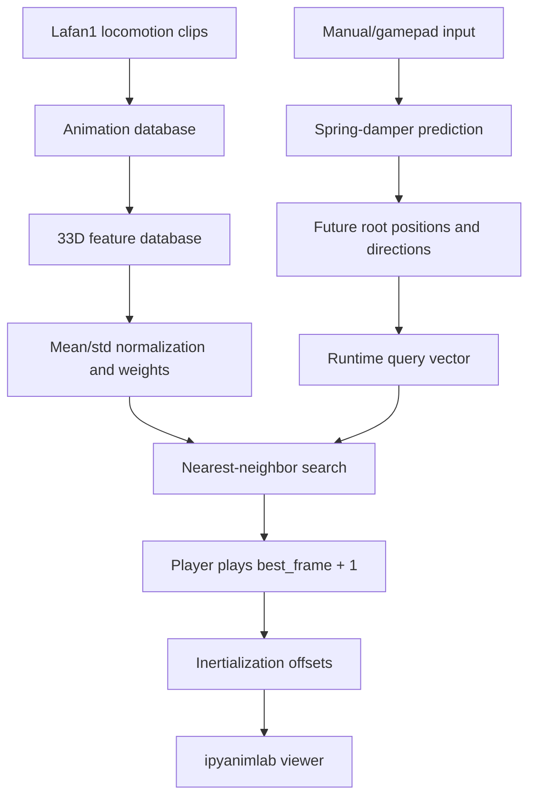

## 代码执行路径

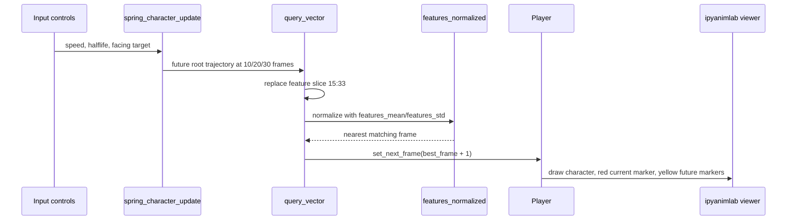

离线部分从角色和 BVH 片段加载开始，经过 `prepare_data`、`build_database`、33 维特征构建和归一化，得到可搜索的 `features_normalized`。实时部分从 `render` 开始，每次输入变化都会更新未来轨迹，替换 query 的未来轨迹段，搜索数据库，再让 Player 播放或跳转到新的候选帧。

## 模块拆解

### 1. 输入预测

`spring_character_update` 把瞬时输入变成有惯性的 root 位置、速度和未来轨迹。半衰期越短，角色越快追随输入；半衰期越长，轨迹更稳但响应更慢。

### 2. 动作数据库

`prepare_data` 清理 root 轨迹并计算线速度、角速度。`build_database` 把多个 locomotion 片段拼成统一数组，同时保留 `frame_ranges`，避免最近邻选到无法播放下一帧的片段末尾。

### 3. 特征向量

每帧的 `features[f, 0:33]` 前 15 维描述当前身体状态，后 18 维描述未来 root 位置和朝向。所有位置都转换到当前 root 局部空间，这样同一段动作可以复用到不同世界位置。

### 4. 归一化和权重

`features_mean`、`features_std` 和 `feature_weights` 共同决定距离度量。代码把权重写进标准差缩放里，使运行时 query 只需同一套归一化公式，就能让未来方向、脚步状态等语义块按期望贡献距离。

### 5. Player 和 inertialization

`Player.set_next_frame` 负责把检索结果变成连续播放。若候选帧不是自然下一帧，就记录位置和旋转 offset，再用 inertialization 在短时间内衰减偏差，避免硬切换。

## 执行结果的意义

现在的关键结果图来自 live canvas 重新采集：静态图能看到角色、地面和调试轨迹；两个 runtime 动画能看到角色随着输入向前移动或急转，红色标记表示当前模拟 root，黄色标记表示未来轨迹目标。若画面只有棋盘地面，说明 Player 不在视野内或输入没有真正进入 `render`；若只有 widget 错误卡片，说明采集没有拿到真实 viewer。

评价 motion matching 结果时，重点看三件事：脚步是否连续、低速输入是否抖动、急转和停止是否选到合理的历史片段。角色响应很快但脚滑，通常是未来轨迹权重过强或姿态约束过弱；动作稳定但不听控制，通常是当前身体状态或脚步特征压过了轨迹目标。

## 重点可视化 / 动画

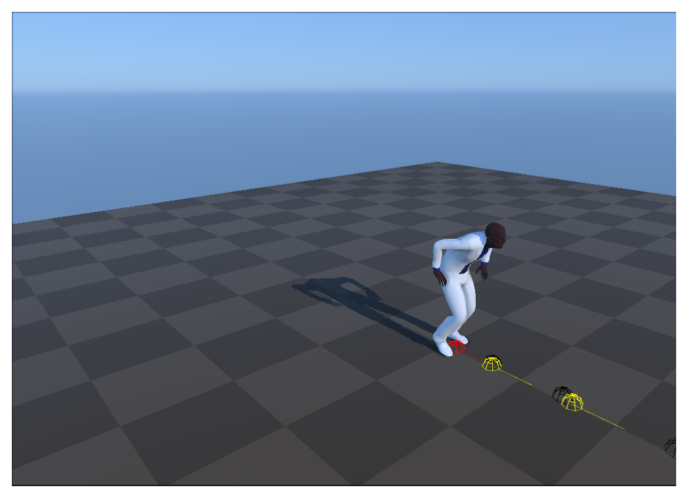

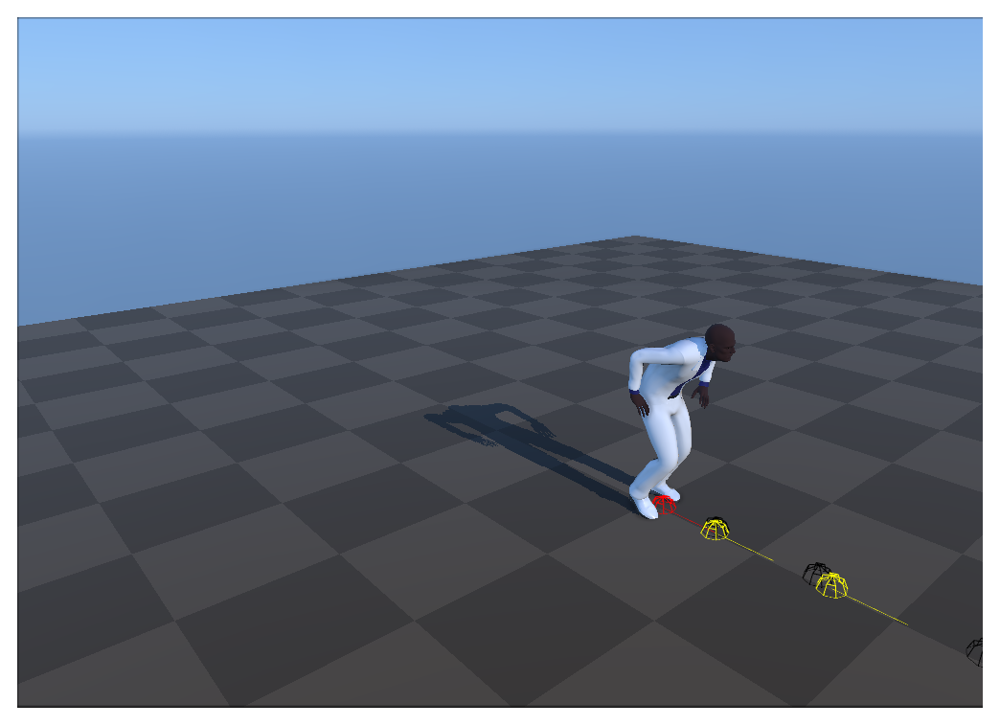

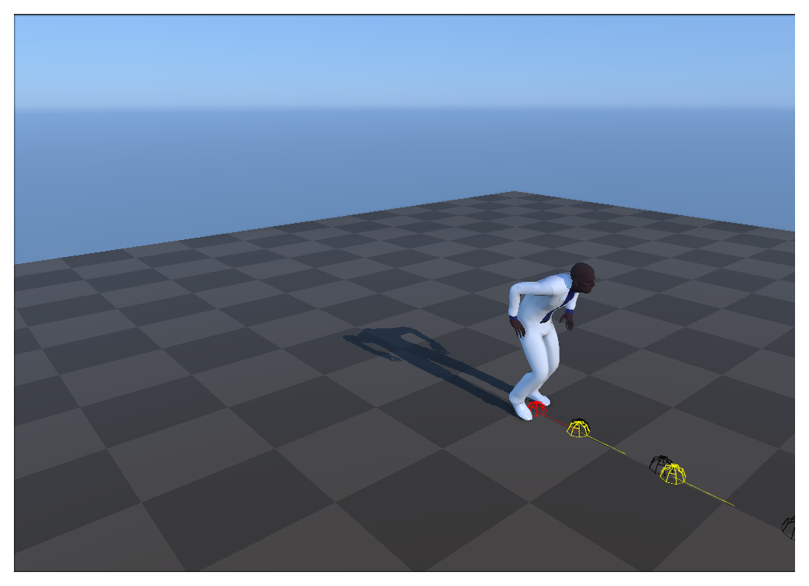


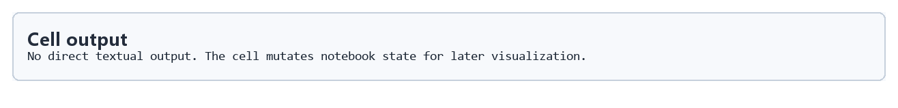

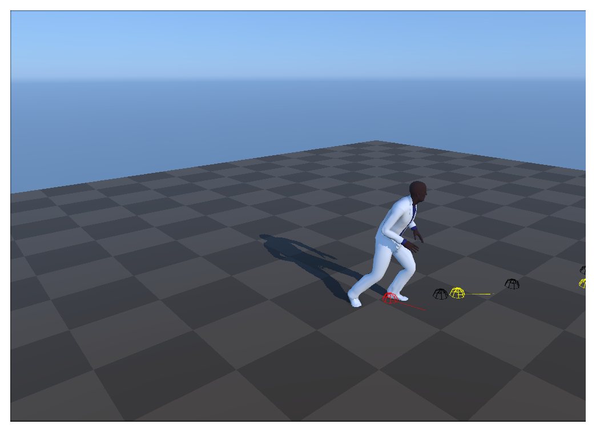

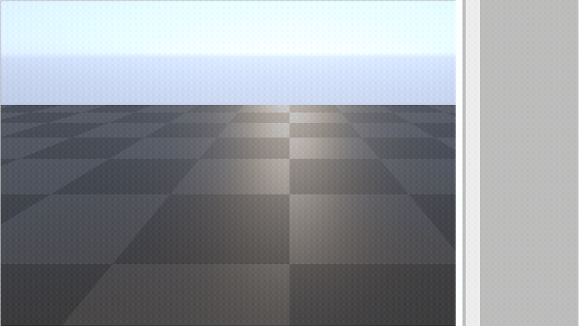

<video controls muted loop playsinline preload="metadata" width="100%" poster="assets/inertialization_transition_result.png">
  <source src="assets/inertialization_transition_preview.mp4" type="video/mp4">
  <source src="assets/inertialization_transition_preview.webm" type="video/webm">
</video>

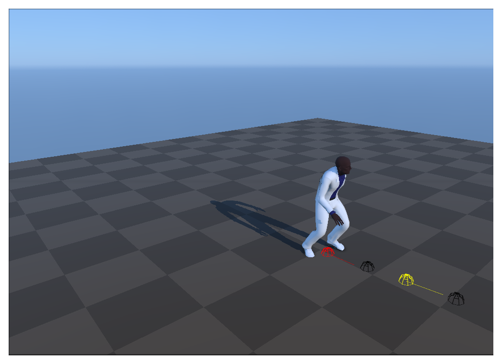

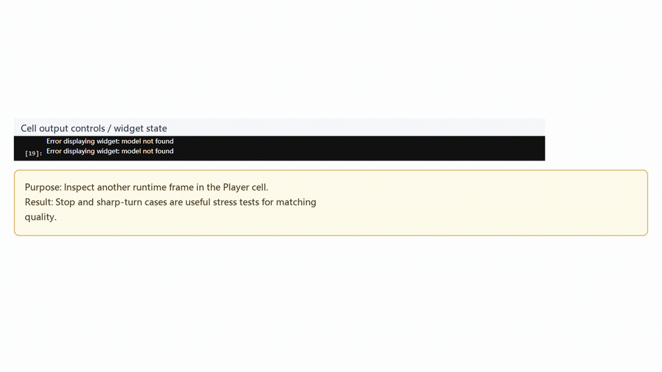

<video controls muted loop playsinline preload="metadata" width="100%" poster="assets/fast_stop_turn_cases_result.png">
  <source src="assets/fast_stop_turn_cases_preview.mp4" type="video/mp4">
  <source src="assets/fast_stop_turn_cases_preview.webm" type="video/webm">
</video>

## 关键 cell / 函数深讲

### Cell 9 - Spring-damper future trajectory

这个 cell 展示输入预测本身：红色当前 marker 和黄色未来 marker 是后续 motion matching query 的轨迹目标来源。

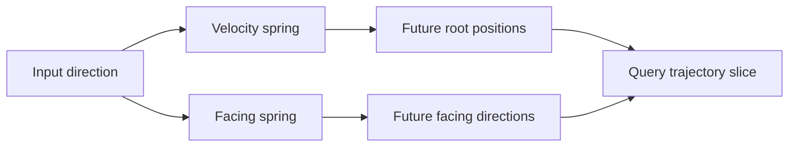

### Cell 21 - 33-dimensional feature layout

这个 cell 把抽象特征重新画回 viewer：脚、hips 和未来轨迹都能在同一画面里检查。它适合用来判断“最近邻搜索在比较什么”，也适合发现某个特征块权重过高或过低。

### Cell 23 - Feature normalization code

这个 cell 是距离度量的核心。不同物理量先标准化，再按语义权重缩放，最终进入欧氏距离。调 `feature_weights` 时，应优先观察停止、急转、慢走这类最容易暴露匹配质量的输入。

### Cell 26 - Runtime Player search loop

`render` 在每帧构造 query，搜索 `features_normalized`，然后调用 `Player.set_next_frame(best_frame + 1)`。重新采集后的 runtime 结果图不再是空地面：角色、红色当前位置和黄色未来轨迹都在画面内。

## 运行方式

推荐从托管学习副本进入，而不是直接编辑原始 notebook：

```powershell
powershell -NoProfile -ExecutionPolicy Bypass -File .\tools\start_animationpapers_lab.ps1
```

博客媒体重新采集使用：

```powershell
powershell -NoProfile -ExecutionPolicy Bypass -File .\tools\start_animationpapers_lab.ps1 -NoOpen
python .\docs\blog\capture_blog_media.py --slug motion_matching --run-timeout 900
```

## 代码 Cell 与可视化证据

| Cell | 作用 | 媒体 |
| --- | --- | --- |
| 9 | Spring-damper 未来轨迹预测。 | [结果 PNG](assets/spring_damper_prediction_result.png) / [代码卡](assets/spring_damper_prediction.png) |
| 14 | 源 locomotion 片段播放，确认数据库来自真实动作帧。 | [结果 PNG](assets/motion_matching_overview_result.png) / [代码卡](assets/motion_matching_overview.png) |
| 18 | 滤波后的 root 位移和朝向，降低速度与方向噪声。 | [结果 PNG](assets/trajectory_query_runtime_result.png) / [代码卡](assets/trajectory_query_runtime.png) |
| 21 | 33 维特征布局，把身体状态和未来轨迹画回 viewer。 | [结果 PNG](assets/feature_vector_layout_result.png) / [代码卡](assets/feature_vector_layout.png) |
| 23 | 特征均值、标准差、权重和归一化代码证据。 | [结果 PNG](assets/feature_database_debug_result.png) / [代码卡](assets/feature_database_debug.png) |
| 26 | Runtime Player 搜索循环。 | [结果 PNG](assets/inertialization_transition_result.png) / [GIF](assets/inertialization_transition_preview.gif) / [MP4](assets/inertialization_transition_preview.mp4) / [WebM](assets/inertialization_transition_preview.webm) / [代码卡](assets/inertialization_transition.png) |
| 26 | 停止与急转压力测试。 | [结果 PNG](assets/fast_stop_turn_cases_result.png) / [GIF](assets/fast_stop_turn_cases_preview.gif) / [MP4](assets/fast_stop_turn_cases_preview.mp4) / [WebM](assets/fast_stop_turn_cases_preview.webm) / [代码卡](assets/fast_stop_turn_cases.png) |
| walkthrough | 按步骤串联的学习记录。 | [WebM](assets/00-walkthrough.webm) |
