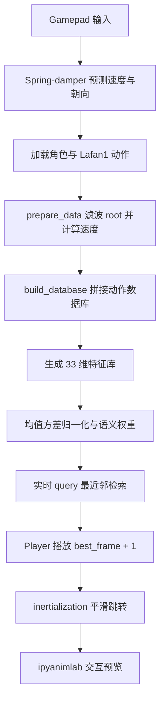
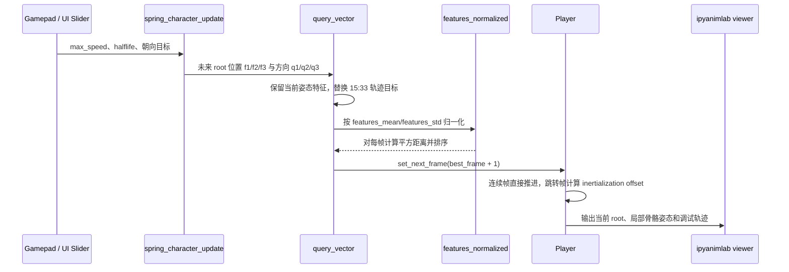
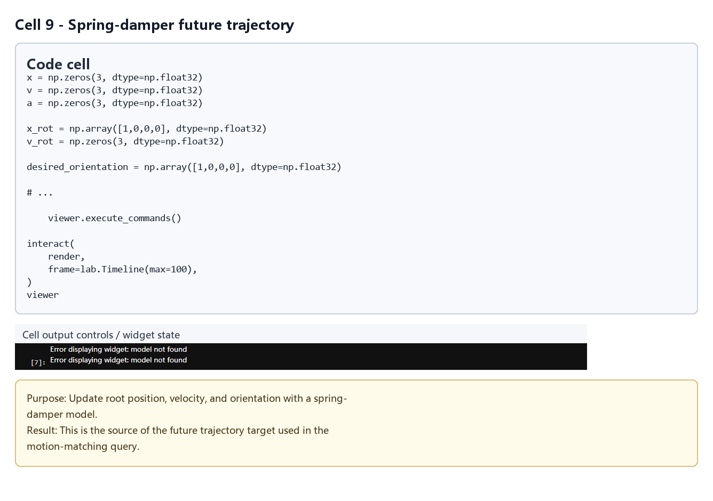
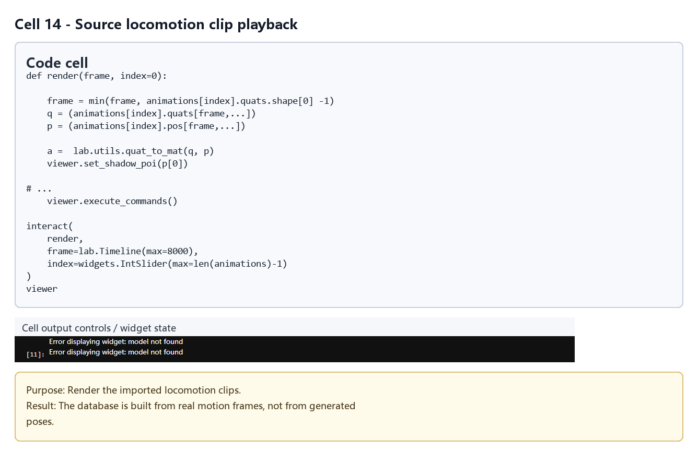
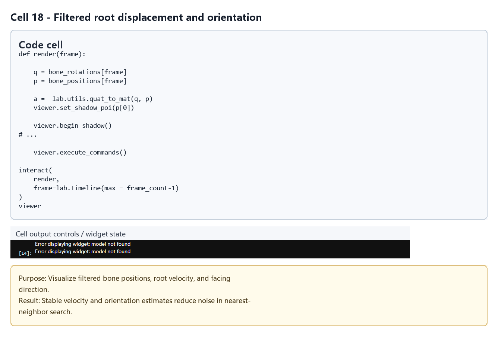
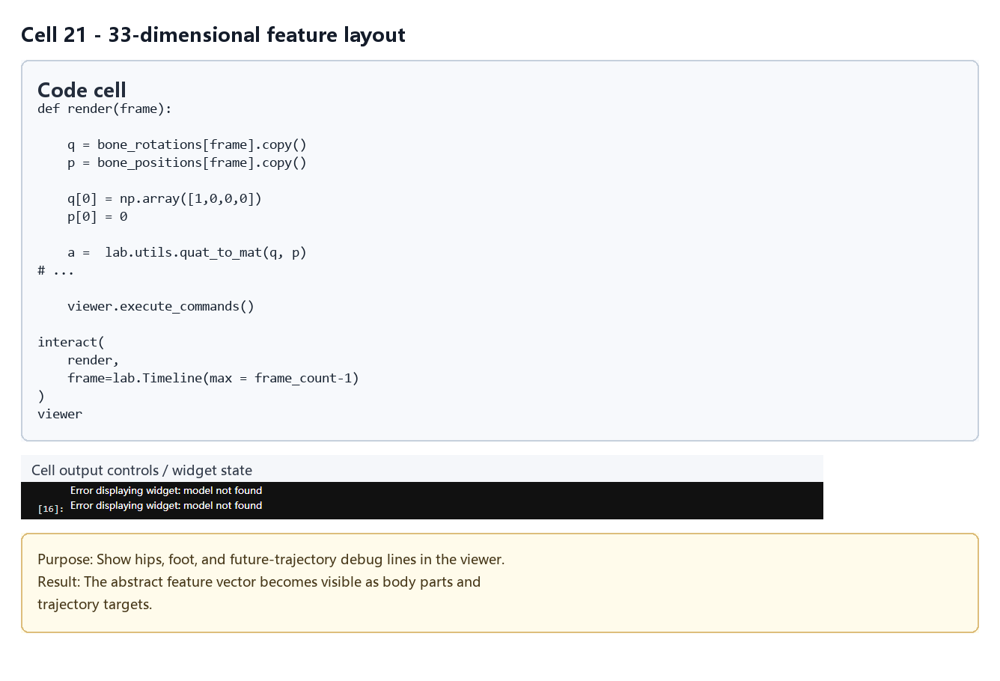
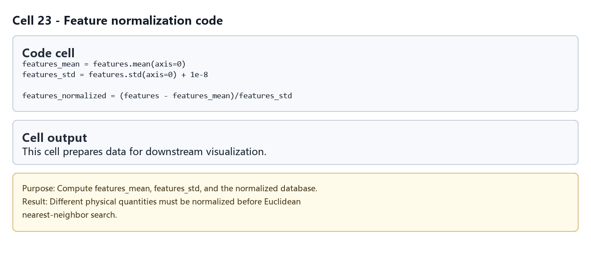
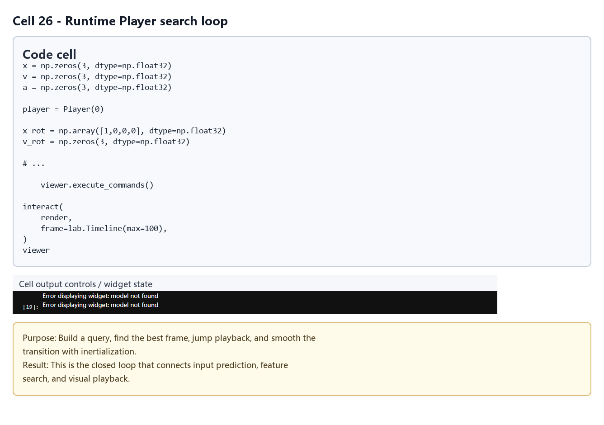
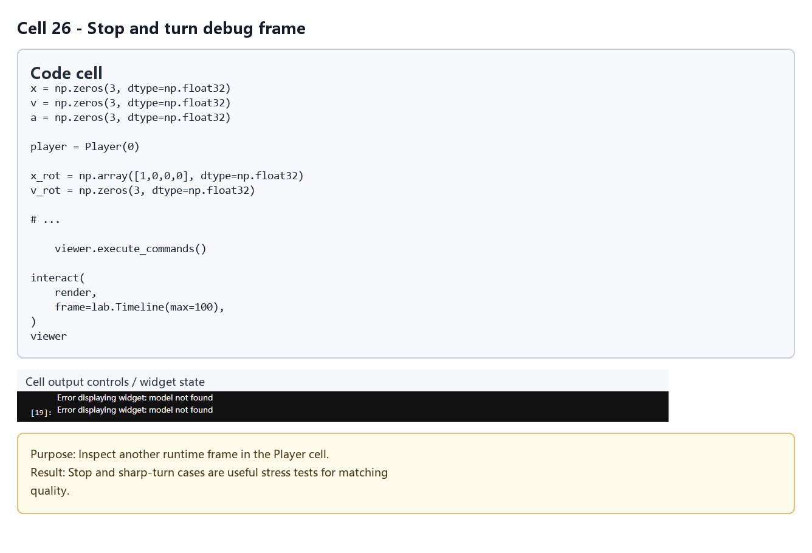

# Motion Matching：基于特征检索的交互角色动画

## 元数据

| 字段 | 值 |
| --- | --- |
| slug | `motion_matching` |
| source path | [`labs/AnimationPapers/Motion Matching.ipynb`](<../../../../labs/AnimationPapers/Motion Matching.ipynb>) |
| env prefix | `.envs/motion_matching` |
| kernel | `animationtech-motion_matching` |
| validation status | `passed`（`manual_smoke`，最后记录：`2026-04-29T19:59:40.3510337Z`；仍需 JupyterLab 手动 smoke test） |

## 问题背景

Motion Matching 的核心想法很直接：不要先把动作库拆成 idle、walk、run、turn 之类的有限状态，也不要手写大量过渡规则；而是在每一帧根据“当前身体状态 + 未来运动意图”从动作库里检索最像的一帧，然后播放它的下一帧。这样，动作细节仍然来自原始动捕，控制响应则来自特征设计、轨迹预测和距离度量。

这个 notebook 用 Lafan1 行走/跑动片段构建一个可检索的特征库。交互运行时，gamepad 输入先经过 spring-damper 变成平滑的目标速度和朝向，再预测未来 10、20、30 帧的 root 轨迹；系统把当前脚步、速度和未来轨迹拼成 query，在归一化后的特征库里做最近邻检索。检索到的候选不是直接播放“这一帧”，而是播放 `best_frame + 1`，因此它像是在问：历史动作中哪一个时刻的“当前状态与下一步趋势”最像现在？

案例的重点不在于得到一段固定动画，而在于理解一个实时闭环：输入预测决定角色想去哪里，特征库决定哪些历史姿态可选，距离度量决定哪一帧最像，Player 与 inertialization 决定切换是否可看。

## 阅读前置知识

- 需要知道骨骼动画的基本表示：root 位移、局部骨骼旋转、FK、世界空间与局部空间转换。
- 需要理解四元数的用途，尤其是用四元数表示朝向、用 log/exp 在旋转空间里做弹簧阻尼更新。
- 需要熟悉最近邻检索的直觉：一行特征向量代表一个候选帧，query 与每一行计算距离，距离最小者胜出。
- 需要理解归一化与加权：不同特征单位不同，脚的位置、root 速度和未来方向不能直接裸算欧氏距离。
- 如果要调 notebook，需要能读 NumPy 数组形状，并知道 Jupyter cell 是按顺序累积状态执行的。

## 总模块图



## 代码执行路径



按 notebook 顺序看，执行路径可以分成离线建库和实时运行两段。离线部分从 `Load Character and Animations` 开始，经过 `prepare_data`、`build_database`、`Building the Feature Vector for Motion Matching` 和 `Feature Normalization`，得到 `features_normalized` 这张可搜索表。实时部分从 `Player` 之后的交互 `render` 开始，每帧根据输入预测未来轨迹，改写 query 的轨迹段，搜索数据库，然后让 Player 播放或跳转。

## 模块拆解

### 1. Spring-damper 输入预测

`Predicting Character Motion with a Spring-Damper Model` 是控制侧的入口。`fast_negexp` 和 `halflife_to_damping` 把半衰期参数转换成稳定的指数衰减；`simple_spring_damper_exact` 用解析更新式推进位置和速度；`simple_spring_damper_exact_quat` 则通过四元数 log/exp 在旋转空间里做同样的事。它们共同服务于 `spring_character_update`：把瞬时摇杆输入变成连续的位移、速度、加速度和朝向。

这一步的意义是让 query 的未来轨迹有惯性。没有弹簧阻尼时，摇杆方向每次抖动都会导致未来轨迹大幅变化，最近邻检索会频繁跳到不同片段；有了半衰期控制，角色会更像一个有质量的身体，而不是每帧重新下命令的点。

### 2. 角色与动作加载

`Load Character and Animations` 用 `viewer.import_usd_asset('AnimLabSimpleMale.usd')` 加载角色，再用 `lab.AnimMapper` 将 Lafan1 BVH 映射到展示骨架。这里的关键不是“读文件”本身，而是把不同动画片段统一到同一个骨骼拓扑、同一套局部旋转和 root 位移表示上。后面的特征库要求每一帧都能用相同索引访问 Hips、LeftFoot、RightFoot 等骨骼。

`prepare_data` 会对 root 位移与朝向做 Savitzky-Golay 滤波，并重新对齐局部骨骼数据。动捕 root 常有细小抖动，直接用于速度和未来轨迹会放大噪声；滤波后再计算 `bone_velocities` 和 `bone_angular_velocities`，数据库的可检索性会稳定很多。

### 3. 特征库与动作数据库构建

`build_database` 把多个动作切片拼接成统一数组：`bone_rotations`、`bone_positions`、`bone_velocities`、`bone_angular_velocities`、`frame_ranges` 和 `frame_count`。其中 `frame_ranges` 很容易被忽略，但它是检索系统能否稳定运行的安全线：如果候选帧已经在片段末尾，播放 `best_frame + 1` 就会越界或跨到不相干片段，所以后续检索必须知道每一帧的合法延续范围。

这一步形成的数据库仍然是“动画数据库”，还不是“检索数据库”。动画数据库保存完整骨骼姿态，负责真正播放；检索数据库只保存 33 维摘要，负责快速判断相似性。

### 4. 33 维特征向量

`Building the Feature Vector for Motion Matching` 为每帧生成 `features[f, 0:33]`。前 15 维描述当前身体状态：Hips 速度、左右脚位置、左右脚速度。后 18 维描述未来轨迹：10、20、30 帧后的 root 位置，以及同三个时间点的朝向方向。

所有这些量都会被转换到当前 root 的局部空间。这个选择非常关键：如果用世界坐标，角色站在场景不同位置时会被误判为不同姿态；转到 root 局部空间后，检索关注的是“脚相对身体在哪、未来相对身体往哪走”。这也是 motion matching 能复用同一段动捕在任意场景位置运动的基础。

### 5. 归一化、语义权重与最近邻

`Feature Normalization` 计算 `features_mean` 和 `features_std`，并得到 `features_normalized`。这一步解决单位问题：米、米每帧、方向向量的数值范围不同，不归一化会让某些维度天然支配距离。

`Feature Weighting via Scaled Standard Deviation` 进一步把权重写进标准差缩放里。代码中的 `feature_weights` 按语义块设置，例如脚位置权重略低、未来方向权重更高，并对更远未来使用 `.99**10/.99**20/.99**30` 衰减。直觉上，近期目标更可靠，远期目标提供趋势但不该过度约束；方向比位置更能体现玩家希望转向哪里。

实时检索时，query 不是从零构造完整身体特征，而是以 Player 当前状态为基础，只替换 `15:33` 的未来轨迹段。随后按同一套均值、标准差和权重归一化，和 `features_normalized` 做平方距离。这样检索同时回答两个问题：当前姿态能否接上，以及接上后是否朝目标方向发展。

### 6. Player 与 inertialization

`Player` 是播放侧的状态机，但它不依赖手写动作状态。`set_next_frame` 会根据候选帧决定是连续播放还是跳转。连续播放时只推进一帧；跳转时，它会计算新旧 root、骨骼位置和骨骼旋转之间的差异，并把差异存成 inertialization offset。

`inertialize_transition_vec3`、`inertialize_update_vec3`、`inertialize_transition_quat` 和 `inertialize_update_quat` 的作用不是简单 blend 两段动画，而是把跳转瞬间的偏差作为一个会衰减的误差项。这样目标姿态可以立刻切换到检索结果，同时视觉上保留一个短暂、自然的缓冲。对交互动画来说，这比固定时长交叉淡入更适合频繁、不可预测的跳转。

## 关键 cell / 函数深讲

- `spring_character_update`：把玩家输入映射成带速度和朝向惯性的模拟 root。它决定 query 的未来轨迹是否平滑，直接影响检索稳定性。
- `prepare_data`：清洗 root 轨迹、对齐骨架、计算线速度和角速度。它是从原始 BVH 到可检索数据的桥。
- `build_database`：把多个片段合成一张动画表，同时记录每帧的合法边界。它保证播放和检索能用相同帧索引互相引用。
- `features[f, 0:33]` 构造 cell：把身体状态和未来轨迹压缩成固定长度向量。这个 cell 是 motion matching 的“设计空间”，改这里就等于改系统认为的相似性。
- `Feature Normalization` 与 `Feature Weighting`：把统计尺度和人工偏好合并进距离度量。调权重时建议先观察停步、急转、慢走这三类最容易出问题的输入。
- `render` 中的 `query_vector[15:33]`：实时循环的核心。它把输入预测写入 query，再用最近邻把“控制意图”投射回动捕数据库。
- `Player.set_next_frame`：把检索结果变成可播放动画。它处理 root 位移重建、帧跳转和 inertialization，是离散检索到连续视觉结果之间的最后一道关。

## 关键数据结构

- `bone_rotations`、`bone_positions`：拼接后的动作数据库，按帧和骨骼索引保存局部旋转与位置。
- `bone_velocities`、`bone_angular_velocities`：由中心差分估计的线速度与角速度，用于特征构造和惯性化过渡。
- `frame_ranges`：每一帧所属片段的合法延续范围，避免检索选到无法播放下一帧的位置。
- `features`：每帧 33 维原始特征，前 15 维偏身体状态，后 18 维偏未来意图。
- `features_mean`、`features_std`、`features_normalized`：归一化统计量与归一化后的检索表。
- `feature_weights`：按语义块重复到 33 维的权重，实际通过缩放 `features_std` 改变距离贡献。
- `query_vector`：实时构造的检索向量，当前身体状态来自 Player，未来轨迹来自 spring-damper 预测。
- `Player`：保存当前帧、root 位姿、局部骨骼姿态、速度和 inertialization offset 的播放对象。

## 执行结果的意义

成功运行后，viewer 中的角色会根据输入实时启动、停步、转向和换步。一个好的结果应该满足三点：脚步接触看起来连续，低速输入不会频繁抽动，急转时角色愿意选到能转过去的历史片段。若角色响应很快但脚滑明显，通常是未来轨迹权重过强或姿态特征太弱；若动作很稳但不听控制，通常是当前姿态或脚步特征压过了轨迹目标；若偶发大跳，优先检查 `frame_ranges` 和 inertialization。

这个 notebook 的可视化意义在于把 motion matching 拆成可调的工程闭环。你可以单独观察输入弹簧、特征点、未来轨迹、最近邻结果和最终播放结果，从而判断问题出在“目标预测”“相似性定义”还是“播放过渡”。

## 代码 Cell 与可视化结果

本节按 notebook 的关键 code cell 组织学习素材：每个条目都对应代码目的、实际输出类型、结果意义和 PNG 学习卡片。PNG 由指定 cell 的代码摘要、输出区、viewer/canvas 或图表/日志合成，不使用整页滚动截图替代。

<video controls muted src="assets/00-walkthrough.webm"></video>

[下载 WebM](assets/00-walkthrough.webm)

| Cell | 输出类型 | 代码做什么 | 结果说明什么 | 素材 |
| --- | --- | --- | --- | --- |
| 9 | `viewer` | Update root position, velocity, and orientation with a spring-damper model. | This is the source of the future trajectory target used in the motion-matching query. | [PNG](assets/spring_damper_prediction.png) |
| 14 | `viewer` | Render the imported locomotion clips. | The database is built from real motion frames, not from generated poses. | [PNG](assets/motion_matching_overview.png) |
| 18 | `viewer` | Visualize filtered bone positions, root velocity, and facing direction. | Stable velocity and orientation estimates reduce noise in nearest-neighbor search. | [PNG](assets/trajectory_query_runtime.png) |
| 21 | `viewer` | Show hips, foot, and future-trajectory debug lines in the viewer. | The abstract feature vector becomes visible as body parts and trajectory targets. | [PNG](assets/feature_vector_layout.png) |
| 23 | `code_only` | Compute features_mean, features_std, and the normalized database. | Different physical quantities must be normalized before Euclidean nearest-neighbor search. | [PNG](assets/feature_database_debug.png) |
| 26 | `timeline_viewer` | Build a query, find the best frame, jump playback, and smooth the transition with inertialization. | This is the closed loop that connects input prediction, feature search, and visual playback. | [PNG](assets/inertialization_transition.png) |
| 26 | `timeline_viewer` | Inspect another runtime frame in the Player cell. | Stop and sharp-turn cases are useful stress tests for matching quality. | [PNG](assets/fast_stop_turn_cases.png) |

### Cell 9 - Spring-damper future trajectory

- 代码做什么：Update root position, velocity, and orientation with a spring-damper model.
- 运行后看到什么：可视化 viewer 视口。
- 结果说明什么：This is the source of the future trajectory target used in the motion-matching query.



### Cell 14 - Source locomotion clip playback

- 代码做什么：Render the imported locomotion clips.
- 运行后看到什么：可视化 viewer 视口。
- 结果说明什么：The database is built from real motion frames, not from generated poses.



### Cell 18 - Filtered root displacement and orientation

- 代码做什么：Visualize filtered bone positions, root velocity, and facing direction.
- 运行后看到什么：可视化 viewer 视口。
- 结果说明什么：Stable velocity and orientation estimates reduce noise in nearest-neighbor search.



### Cell 21 - 33-dimensional feature layout

- 代码做什么：Show hips, foot, and future-trajectory debug lines in the viewer.
- 运行后看到什么：可视化 viewer 视口。
- 结果说明什么：The abstract feature vector becomes visible as body parts and trajectory targets.



### Cell 23 - Feature normalization code

- 代码做什么：Compute features_mean, features_std, and the normalized database.
- 运行后看到什么：代码逻辑片段。
- 结果说明什么：Different physical quantities must be normalized before Euclidean nearest-neighbor search.



### Cell 26 - Runtime Player search loop

- 代码做什么：Build a query, find the best frame, jump playback, and smooth the transition with inertialization.
- 运行后看到什么：带 timeline 的可播放 viewer。
- 结果说明什么：This is the closed loop that connects input prediction, feature search, and visual playback.



### Cell 26 - Stop and turn debug frame

- 代码做什么：Inspect another runtime frame in the Player cell.
- 运行后看到什么：带 timeline 的可播放 viewer。
- 结果说明什么：Stop and sharp-turn cases are useful stress tests for matching quality.



## 运行方式

先启动 AnimationPapers 的 JupyterLab 环境，并选择元数据表中的 kernel：

```powershell
powershell -NoProfile -ExecutionPolicy Bypass -File .\tools\start_animationpapers_lab.ps1
```

如需按案例脚本做自动化检查，使用 slug 运行：

```powershell
powershell -NoProfile -ExecutionPolicy Bypass -File .\tools\run_case.ps1 motion_matching
```
