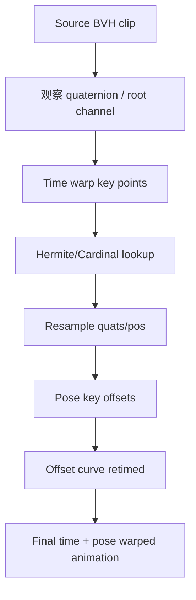
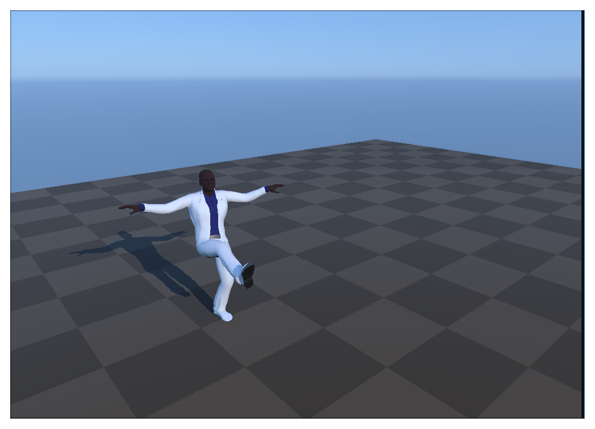
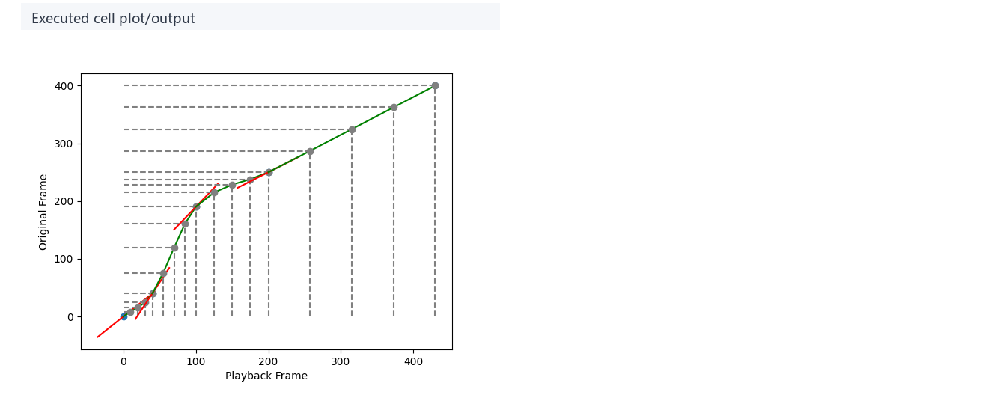
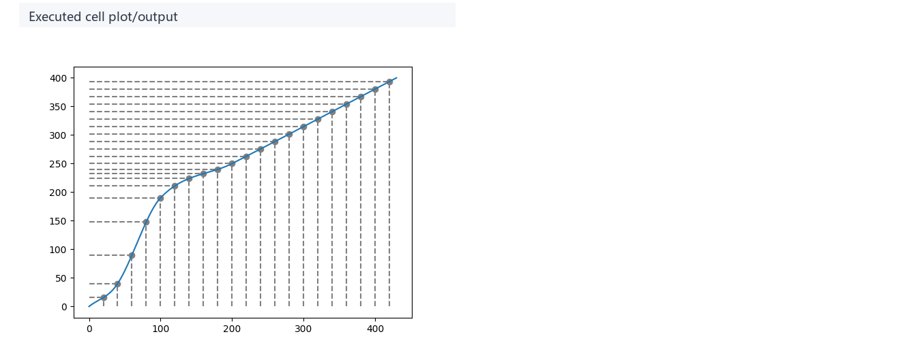
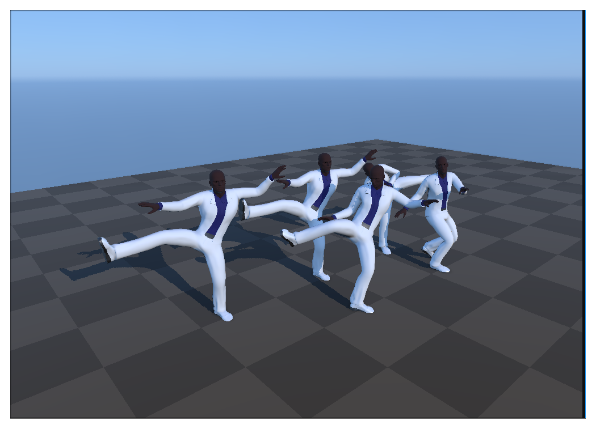
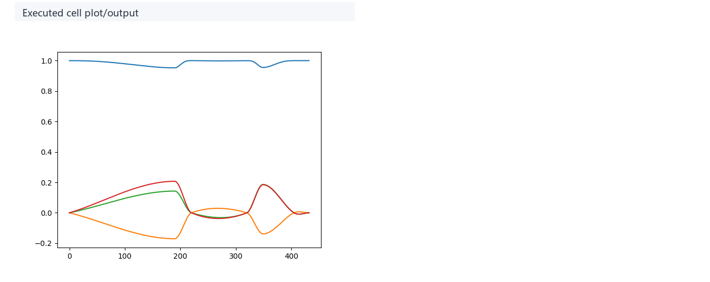

# Motion Warping：用时间曲线和姿态偏移重定向动作

## 元数据

| 字段 | 内容 |
| --- | --- |
| slug | `motion_warping` |
| source path | [`labs/AnimationPapers/Motion Warping.ipynb`](<../../../../labs/AnimationPapers/Motion Warping.ipynb>) |
| transcript sources | [`docs/transcripts/COzRpFPZ4rk_Motion Warping.txt`](<../../../../docs/transcripts/COzRpFPZ4rk_Motion Warping.txt>) |
| kind | `notebook` |
| env | `.envs/motion_warping` |
| kernel | `animationtech-motion_warping` |
| validation | `passed` (`manual_smoke`；自动执行通过，viewer 建议 JupyterLab 人工检查) |
| publish tier | `深写完成 + 媒体完整` |
| media quality | key_visual/key_animation 必须是算法输出本身，禁止滚动截图、整页 cell、代码卡裁剪和静态假动画 |

## 问题背景

Motion warping 处理的是已有动作大体正确但关键事件时间或空间位置不符合新目标的问题。语音稿把动画拆成曲线：time warp 决定新帧应该读取旧动画的哪一帧，pose warp 决定在特定时间附近叠加多少姿态偏移。notebook 先观察原始动画和 quaternion channel，再用 Cardinal/Hermite 生成 timewarp lookup，随后构造局部 offset layer，最后合成 time + pose warped animation。

## 阅读前置知识

- 动画通道曲线、逐帧 resampling 和 lookup table。
- Cardinal/Hermite spline：用稀疏 timing key 生成连续映射。
- quaternion normalization 与局部 offset：姿态 warp 是叠加差异，不是覆盖原 pose。
- 动画 layer 思想：time layer 和 pose layer 要在同一时间轴上对齐。

## 总模块图



## 代码执行路径


## 模块拆解

### 1. 输入动画与曲线视角

原始 viewer 建立动作语境，raw quaternion channel 把动画还原成一组随帧变化的数值通道。

### 2. Time Warp

`time_wrap_points` 给出旧时间和新时间的对应关系。代码把 sparse keys 转成 Hermite/Cardinal 表达，再采样出每个新帧读取旧动画的位置。

### 3. Pose Warp

pose warp 先取关键姿态差异，转换成局部 offset，再用曲线控制 offset 随时间进入和退出。

## 关键 cell / 函数深讲

### Cell 5 - Source animation playback

播放并观察未经修改的原始动作。这是建立后续 Warp 对比基准的第一步。


- 代码做什么：源动画播放：给后续 warping 结果提供原始动作基准。
- 运行后看到什么：`timeline_viewer`
- 结果说明什么：给后续 warping 结果提供原始动作基准。
- 可视化主体：Source animation playback
- 捕获方式：`canvas`




<video controls muted loop playsinline preload="metadata" width="100%" poster="assets/01_source_animation_playback_result.png" src="assets/01_source_animation_playback_preview.mp4"></video>

### Cell 6 - Raw quaternion channel plot

将原始四元数通道数据作为曲线图展示，揭示了动画的数值连续性本质，是后续进行重采样和曲线编辑的理论依据。


- 代码做什么：原始四元数通道曲线：说明 animation warping 往往从曲线编辑开始。
- 运行后看到什么：`plot`
- 结果说明什么：曲线说明 animation warping 往往从曲线编辑开始。
- 可视化主体：Raw quaternion channel plot
- 捕获方式：`plot`


### Cell 12 - Time-warp keypoints and tangents

手动定义一系列时间映射的关键帧（Timing Keys），建立旧时间与期望新时间之间的映射关系。


- 代码做什么：Time-warp 关键点与切线：展示稀疏时间编辑如何变成连续时间扭曲曲线。
- 运行后看到什么：`plot`
- 结果说明什么：图中展示稀疏时间编辑如何变成连续 time-warp 曲线。
- 可视化主体：Time-warp keypoints and tangents
- 捕获方式：`plot`



### Cell 15 - Resampled time-warp curve

使用 Hermite 样条曲线对稀疏的 Timing Keys 进行密集插值重采样，生成一根完整的时间映射曲线。


- 代码做什么：重采样后的 time-warp 曲线：展示动画采样实际使用的逐帧时间查找表。
- 运行后看到什么：`plot`
- 结果说明什么：输出展示动画采样实际使用的逐帧时间查找表。
- 可视化主体：Resampled time-warp curve
- 捕获方式：`plot`



### Cell 20 - Time-warped animation comparison

应用生成的 Time Warp 查找表，重采样子动作并播放，验证关键事件是否被成功“挪动”到了目标时间点，且动作过渡仍然平滑。


- 代码做什么：Time-warp 动画对比：展示只改变时序、不改变底层姿态内容的效果。
- 运行后看到什么：`timeline_viewer`
- 结果说明什么：viewer 展示只改变时序、不改变底层姿态内容的效果。
- 可视化主体：Time-warped animation comparison
- 捕获方式：`canvas`


<video controls muted loop playsinline preload="metadata" width="100%" poster="assets/05_timewarped_animation_compare_result.png" src="assets/05_timewarped_animation_compare_preview.mp4"></video>

### Cell 23 - Pose-warp key poses

定义空间上的姿态偏移关键帧（如改变打拳的高度或击打方向）。计算新姿态相对于旧姿态的局部差值（Offset）。


- 代码做什么：Pose-warp 关键姿态：展示将被混入片段的空间修正量。
- 运行后看到什么：`viewer`
- 结果说明什么：关键姿态 viewer 展示将被混入片段的空间修正量。
- 可视化主体：Pose-warp key poses
- 捕获方式：`canvas`



### Cell 27 - Offset warp curve

生成控制姿态偏移量的权重曲线，让 Offset 能够随着时间渐入渐出，避免姿态发生突变。


- 代码做什么：Offset warp 曲线：说明局部姿态编辑如何被平滑分配。
- 运行后看到什么：`plot`
- 结果说明什么：曲线说明局部姿态编辑如何被平滑分配。
- 可视化主体：Offset warp curve
- 捕获方式：`plot`



### Cell 31 - Final time and pose warped animation

将节奏改变后的动画（Time Warped）与随时间衰减的姿态偏移（Pose Warped）结合，生成最终既对齐了新时间戳又达成了新目标点的高级编辑动作。


- 代码做什么：最终时间与姿态 warping 动画：检查时序编辑和姿态编辑能否合成连贯动作。
- 运行后看到什么：`timeline_viewer`
- 结果说明什么：最终 viewer 检查时序编辑和姿态编辑能否合成连贯动作。
- 可视化主体：Final time and pose warped animation
- 捕获方式：`canvas`


<video controls muted loop playsinline preload="metadata" width="100%" poster="assets/08_combined_warped_animation_result.png" src="assets/08_combined_warped_animation_preview.mp4"></video>

## 关键数据结构

- `animation.quats/pos`：输入 BVH 的旋转和位移通道。
- `pose_A/pose_B`：用于构造 warp 的关键姿态。
- `time_wrap_points`、`timewarp_curve`：时间映射控制点和逐帧 lookup。
- `keyframes_q/keyframes_p`、`local_offset_poses`：姿态偏移层。
- `new_q/new_p`、`full_warp_q/full_warp_p`：time warp 和最终组合结果。

## 执行结果的意义

Time warp 图验证事件是否发生在新时间；pose warp viewer 验证关键姿态是否被推向目标；最终动画验证两者是否同步。若动作时间正确但姿态突跳，通常是 offset curve 太窄或 quaternion 处理不连续。

## 重点可视化 / 动画

本节只保留最能说明算法结果的图像和动画。代码学习卡移到文末证据表，供需要复现或追溯 cell 上下文时查看。


| Cell | 输出类型 | 阅读位置 | 可视化主体 | 捕获方式 | 结果媒体 |
| --- | --- | --- | --- | --- | --- |
| Cell 5 | `timeline_viewer` | 核心动画 | 源动画播放：给后续 warping 结果提供原始动作基准。 | `canvas` | [结果 PNG](assets/01_source_animation_playback_result.png) / [GIF](assets/01_source_animation_playback_preview.gif) / [MP4](assets/01_source_animation_playback_preview.mp4) / [WebM](assets/01_source_animation_playback_preview.webm) |
| Cell 6 | `plot` | 核心图解 | 原始四元数通道曲线：说明 animation warping 往往从曲线编辑开始。 | `plot` | [结果 PNG](assets/02_raw_quaternion_channel_result.png) |
| Cell 12 | `plot` | 核心图解 | Time-warp 关键点与切线：展示稀疏时间编辑如何变成连续时间扭曲曲线。 | `plot` | [结果 PNG](assets/03_timewarp_keypoints_result.png) |
| Cell 15 | `plot` | 核心图解 | 重采样后的 time-warp 曲线：展示动画采样实际使用的逐帧时间查找表。 | `plot` | [结果 PNG](assets/04_resampled_timewarp_curve_result.png) |
| Cell 20 | `timeline_viewer` | 核心动画 | Time-warp 动画对比：展示只改变时序、不改变底层姿态内容的效果。 | `canvas` | [结果 PNG](assets/05_timewarped_animation_compare_result.png) / [GIF](assets/05_timewarped_animation_compare_preview.gif) / [MP4](assets/05_timewarped_animation_compare_preview.mp4) / [WebM](assets/05_timewarped_animation_compare_preview.webm) |
| Cell 23 | `viewer` | 核心图解 | Pose-warp 关键姿态：展示将被混入片段的空间修正量。 | `canvas` | [结果 PNG](assets/06_pose_warp_key_poses_result.png) |
| Cell 27 | `plot` | 核心图解 | Offset warp 曲线：说明局部姿态编辑如何被平滑分配。 | `plot` | [结果 PNG](assets/07_offset_warp_curve_result.png) |
| Cell 31 | `timeline_viewer` | 核心动画 | 最终时间与姿态 warping 动画：检查时序编辑和姿态编辑能否合成连贯动作。 | `canvas` | [结果 PNG](assets/08_combined_warped_animation_result.png) / [GIF](assets/08_combined_warped_animation_preview.gif) / [MP4](assets/08_combined_warped_animation_preview.mp4) / [WebM](assets/08_combined_warped_animation_preview.webm) |

发布视频镜像：

- https://github.com/user-attachments/assets/2a3e910d-fd40-4620-b0e0-28ac59b0f917
- https://github.com/user-attachments/assets/cab0161e-4390-49df-87ab-de3b9aa1515a
- https://github.com/user-attachments/assets/d871efca-08a5-4cee-9139-2380a4cc6d2b


## 代码 Cell 与可视化证据

下面是附录式证据索引：结果 PNG 便于快速核对，代码卡用于追溯代码摘要与输出来源；带时间轴或参数滑杆的条目同时保留 GIF、MP4 和 WebM。

| Cell / 片段 | 结果说明 | 证据 |
| --- | --- | --- |
| Cell 5 | 给后续 warping 结果提供原始动作基准。 | [结果 PNG](assets/01_source_animation_playback_result.png) / [GIF](assets/01_source_animation_playback_preview.gif) / [MP4](assets/01_source_animation_playback_preview.mp4) / [WebM](assets/01_source_animation_playback_preview.webm) / [代码卡](assets/01_source_animation_playback.png) |
| Cell 6 | 曲线说明 animation warping 往往从曲线编辑开始。 | [结果 PNG](assets/02_raw_quaternion_channel_result.png) / [代码卡](assets/02_raw_quaternion_channel.png) |
| Cell 12 | 图中展示稀疏时间编辑如何变成连续 time-warp 曲线。 | [结果 PNG](assets/03_timewarp_keypoints_result.png) / [代码卡](assets/03_timewarp_keypoints.png) |
| Cell 15 | 输出展示动画采样实际使用的逐帧时间查找表。 | [结果 PNG](assets/04_resampled_timewarp_curve_result.png) / [代码卡](assets/04_resampled_timewarp_curve.png) |
| Cell 20 | viewer 展示只改变时序、不改变底层姿态内容的效果。 | [结果 PNG](assets/05_timewarped_animation_compare_result.png) / [GIF](assets/05_timewarped_animation_compare_preview.gif) / [MP4](assets/05_timewarped_animation_compare_preview.mp4) / [WebM](assets/05_timewarped_animation_compare_preview.webm) / [代码卡](assets/05_timewarped_animation_compare.png) |
| Cell 23 | 关键姿态 viewer 展示将被混入片段的空间修正量。 | [结果 PNG](assets/06_pose_warp_key_poses_result.png) / [代码卡](assets/06_pose_warp_key_poses.png) |
| Cell 27 | 曲线说明局部姿态编辑如何被平滑分配。 | [结果 PNG](assets/07_offset_warp_curve_result.png) / [代码卡](assets/07_offset_warp_curve.png) |
| Cell 31 | 最终 viewer 检查时序编辑和姿态编辑能否合成连贯动作。 | [结果 PNG](assets/08_combined_warped_animation_result.png) / [GIF](assets/08_combined_warped_animation_preview.gif) / [MP4](assets/08_combined_warped_animation_preview.mp4) / [WebM](assets/08_combined_warped_animation_preview.webm) / [代码卡](assets/08_combined_warped_animation.png) |


## 运行方式

AnimationPapers 案例优先使用：

```powershell
powershell -NoProfile -ExecutionPolicy Bypass -File .\tools\start_animationpapers_lab.ps1
```

单案例验证使用：

```powershell
powershell -NoProfile -ExecutionPolicy Bypass -File .\tools\run_case.ps1 motion_warping
```
