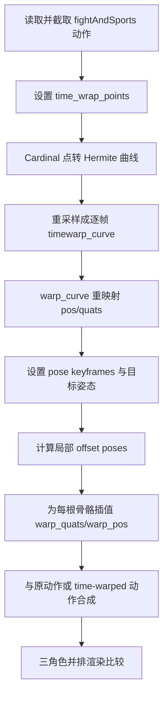
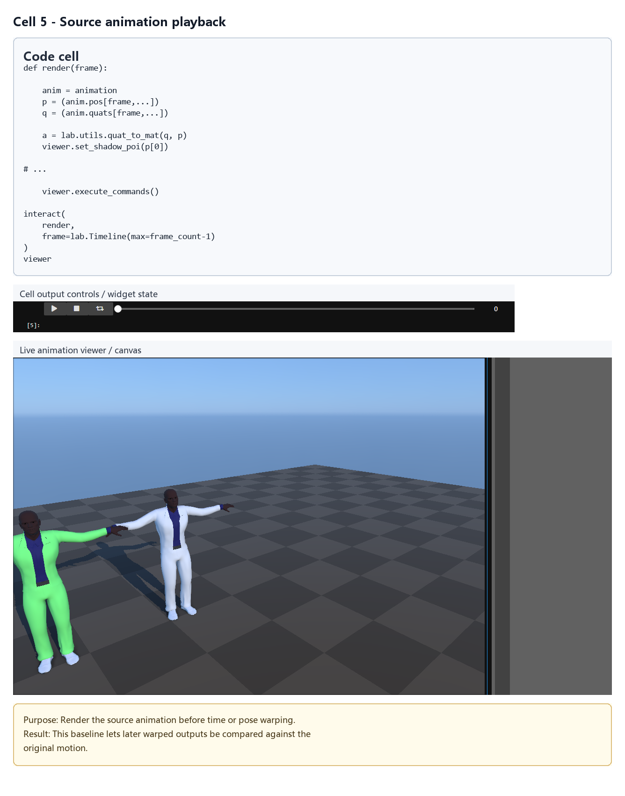
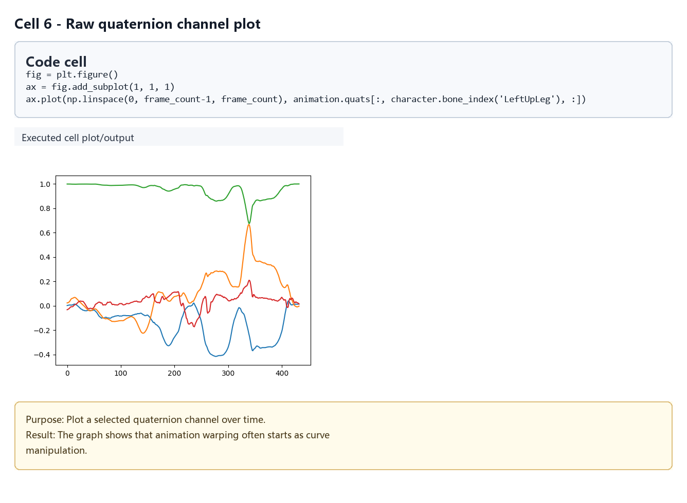
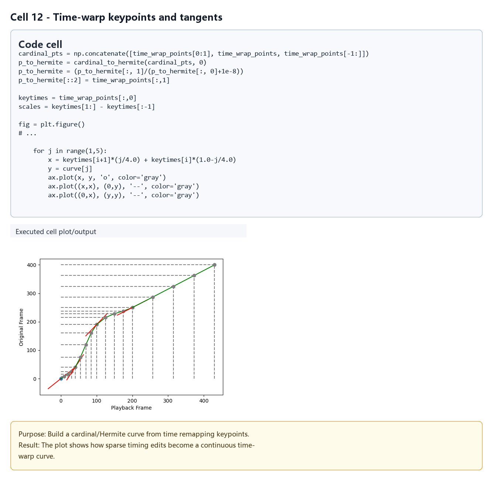
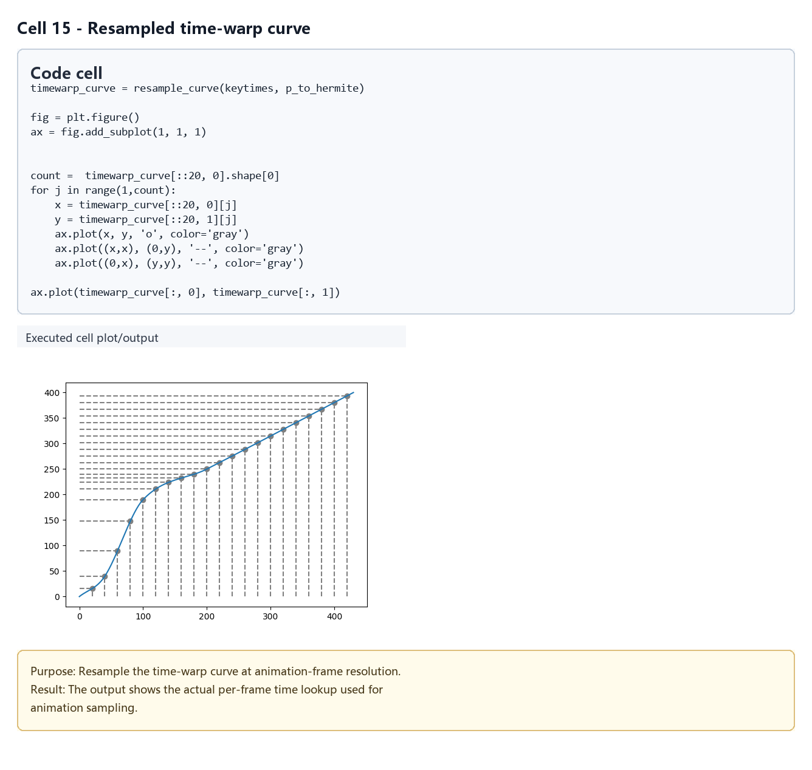
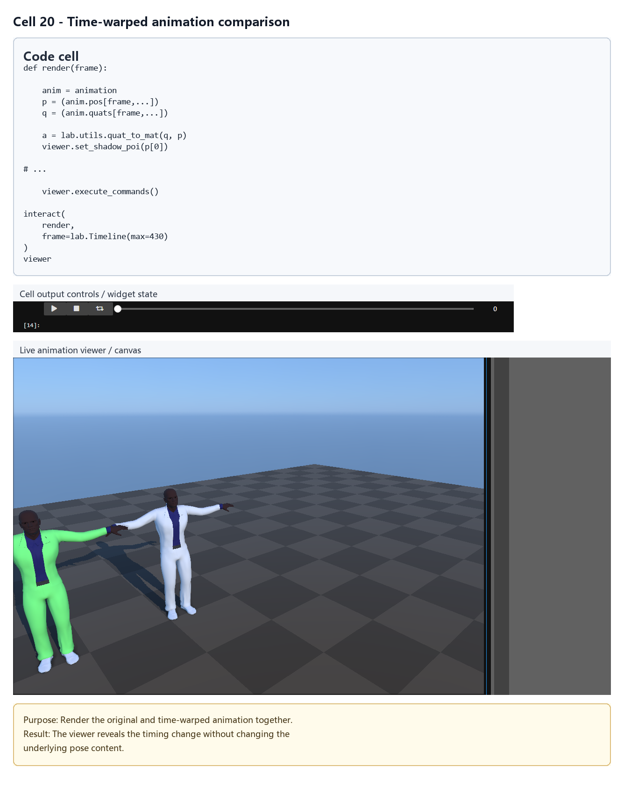
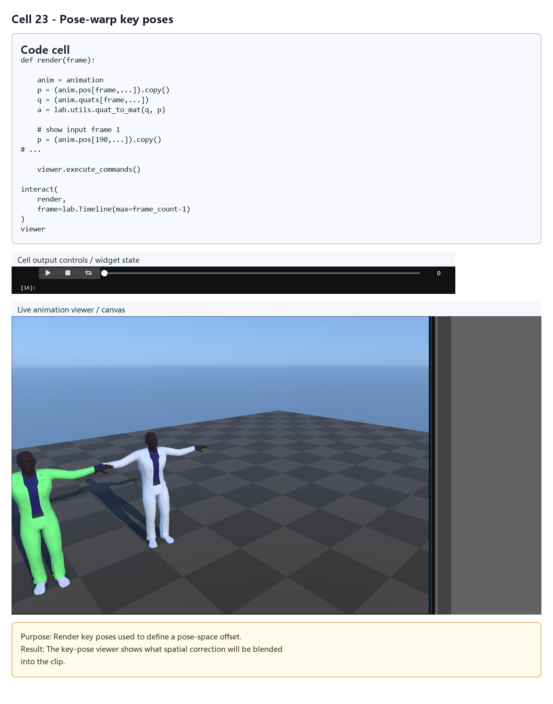
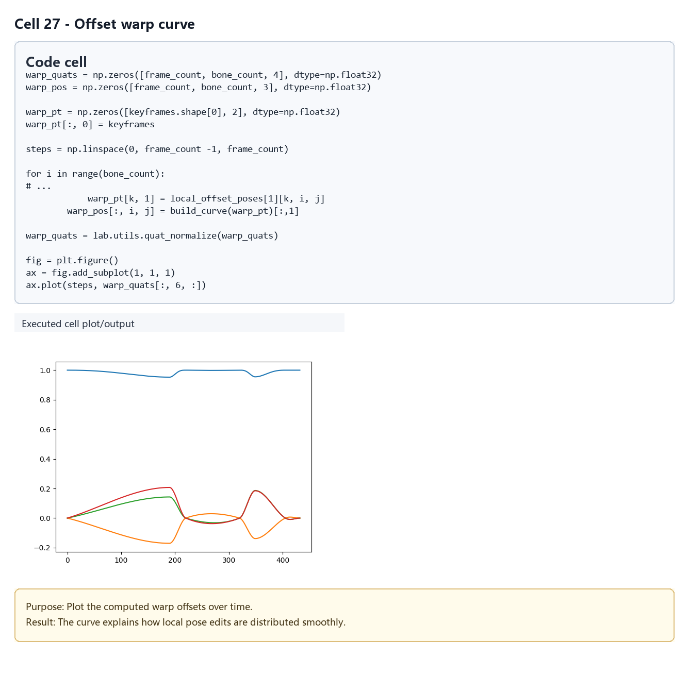
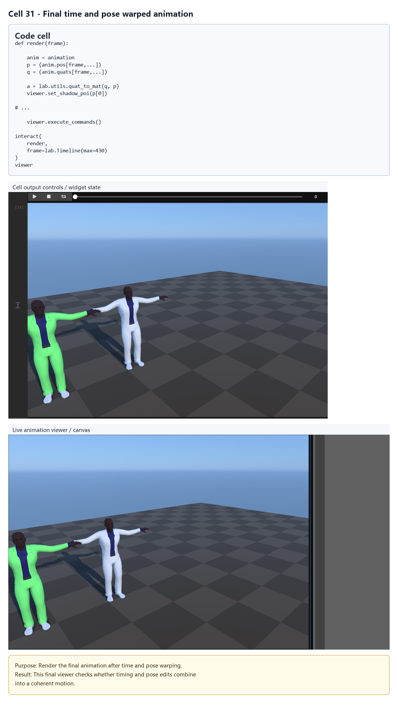

# Motion Warping：时间与姿态约束下的动作变形

## 元数据

| 字段 | 值 |
| --- | --- |
| slug | `motion_warping` |
| source path | `labs/AnimationPapers/Motion Warping.ipynb` |
| env prefix | `.envs/motion_warping` |
| kernel | `animationtech-motion_warping` |
| validation status | `passed`（`manual_smoke`；自动执行通过，仍需 JupyterLab 手动冒烟） |

## 问题背景

Motion Warping 来自 Witkin 和 Popovic 1995 年的工作，目标是在保留原动作细节的前提下，满足新的时间或姿态约束。工程上它常用于“已有动作大体正确，但某些关键时刻或关键姿态需要改到指定目标”的场景。Notebook 把问题拆成两层：先做 time warp 改变动作播放进度，再做 pose warp 在关键帧附近插入局部姿态偏移。

该例使用 `fightAndSports1_subject1.bvh`，通过 `AnimMapper(root_motion=True, match_effectors=True, local_offsets={'Hips':[0, 2, 0]})` 映射到角色骨架，并截取原动画的 `97:530` 片段作为演示范围。

## 总模块图



## 模块拆解

### 1. 动作准备

Notebook 导入一个主角色和两个副本，并给副本设置不同颜色与水平偏移，方便比较原始、time-warped、fully-warped 三种结果。`pose_A` 和 `pose_B` 分别从原始长动画的第 695 帧和第 1940 帧取出，作为后续 pose warp 的目标姿态。

### 2. Time warp inputs

时间重映射控制点是 `(原始帧时间, 新帧时间)`：

```text
(0, 0), (40, 40), (100, 190), (200, 250), (430, 400)
```

这些点表达了“某些区段加速或减速”的需求。例如原始第 100 帧被映射到新时间 190，说明前段动作被拉长。

### 3. Spline/Hermite mapping

`cardinal_to_hermite` 将 cardinal 控制点转换为 Hermite 形式，`resample_curve` 再把分段曲线重采样成逐帧查表。这样后续可以用简单数组 `timewarp_curve` 查询每个新帧应该采样原动作的哪个浮点帧。

### 4. Time Warp

`build_curve(time_wrap_points)` 生成最终映射表，`warp_curve(timewarp_curve, animation.quats)` 与 `warp_curve(timewarp_curve, animation.pos)` 对四元数和位置做逐帧重采样。四元数重采样后会再做 `lab.utils.quat_normalize`，避免插值造成长度漂移。

### 5. Pose Warp

姿态约束关键帧为：

```text
0, 190, 220, 320, 349, 405, 432
```

其中部分关键帧使用原动作，部分关键帧替换为 `pose_A` 或 `pose_B`。为了不破坏根运动，代码将这些目标姿态的 root 通道重新对齐到当前动画的 root。

### 6. 输入姿态转 offset

`local_offset_poses = lab.utils.qp_mul(qp_inv(animation_at_keyframes), target_keyframes)` 计算“从原关键帧到目标关键帧”的局部偏移。这样 pose warp 不直接覆盖整段动作，而是在原动作上叠加一条平滑的 offset 曲线。

### 7. Offset 曲线插值与合成

`warp_quats` 和 `warp_pos` 分别保存每帧、每骨骼的旋转和平移 offset。代码对每根骨骼、每个通道都调用 `build_curve(warp_pt)`，把 sparse keyframe offset 展开成 dense offset。最终通过 `lab.utils.qp_mul((animation.quats, animation.pos), (warp_quats, warp_pos))` 合成空间变形结果。

### 8. Timewarp the warped offsets

最后一段把 offset 曲线也通过 `timewarp_curve` 重映射，再与 `new_q/new_p` 合成。这样时间变形和姿态变形处在同一个新时间轴上，避免只 retime 原动作而没有同步 retime pose offset。

## 关键数据结构

| 名称 | 形状或类型 | 作用 |
| --- | --- | --- |
| `animation.pos` / `animation.quats` | `[frame_count, bone_count, 3/4]` | 截取后的原动作 |
| `time_wrap_points` | `[5, 2] int` | 稀疏时间重映射控制点 |
| `timewarp_curve` | `[new_frame_count, 2]` | 逐帧时间查表 |
| `pose_A` / `pose_B` | `(quats, pos)` | 从长动画中取出的目标姿态 |
| `keyframes` | `[7] int` | pose warp 的关键帧位置 |
| `local_offset_poses` | `(quats, pos)` | 从原姿态到目标姿态的局部偏移 |
| `warp_quats` / `warp_pos` | `[frame_count, bone_count, 4/3]` | 每帧姿态 offset 曲线 |
| `new_q` / `new_p` | time-warped 动作 | 只做时间变形后的动画 |
| `full_warp_q` / `full_warp_p` | fully-warped 动作 | 同时应用时间与姿态变形后的动画 |

## 执行结果的意义

结果比较展示了 motion warping 的两条轴线：time warp 改变动作事件发生的速度和位置，pose warp 改变关键时刻的姿态目标。两者合成后，可以让动作在指定时间到达指定姿态，同时尽量保留原始动作中的连续性、惯性和骨架细节。

## 代码 Cell 与可视化结果

本节按 notebook 的关键 code cell 组织学习素材：每个条目都对应代码目的、实际输出类型、结果意义和 PNG 学习卡片。PNG 由指定 cell 的代码摘要、输出区、viewer/canvas 或图表/日志合成，不使用整页滚动截图替代。

<video controls muted src="assets/00-walkthrough.webm"></video>

[下载 WebM](assets/00-walkthrough.webm)

| Cell | 输出类型 | 代码做什么 | 结果说明什么 | 素材 |
| --- | --- | --- | --- | --- |
| 5 | `timeline_viewer` | Render the source animation before time or pose warping. | This baseline lets later warped outputs be compared against the original motion. | [PNG](assets/01_source_animation_playback.png) |
| 6 | `plot` | Plot a selected quaternion channel over time. | The graph shows that animation warping often starts as curve manipulation. | [PNG](assets/02_raw_quaternion_channel.png) |
| 12 | `plot` | Build a cardinal/Hermite curve from time remapping keypoints. | The plot shows how sparse timing edits become a continuous time-warp curve. | [PNG](assets/03_timewarp_keypoints.png) |
| 15 | `plot` | Resample the time-warp curve at animation-frame resolution. | The output shows the actual per-frame time lookup used for animation sampling. | [PNG](assets/04_resampled_timewarp_curve.png) |
| 20 | `timeline_viewer` | Render the original and time-warped animation together. | The viewer reveals the timing change without changing the underlying pose content. | [PNG](assets/05_timewarped_animation_compare.png) |
| 23 | `viewer` | Render key poses used to define a pose-space offset. | The key-pose viewer shows what spatial correction will be blended into the clip. | [PNG](assets/06_pose_warp_key_poses.png) |
| 27 | `plot` | Plot the computed warp offsets over time. | The curve explains how local pose edits are distributed smoothly. | [PNG](assets/07_offset_warp_curve.png) |
| 31 | `timeline_viewer` | Render the final animation after time and pose warping. | This final viewer checks whether timing and pose edits combine into a coherent motion. | [PNG](assets/08_combined_warped_animation.png) |

### Cell 5 - Source animation playback

- 代码做什么：Render the source animation before time or pose warping.
- 运行后看到什么：带 timeline 的可播放 viewer。
- 结果说明什么：This baseline lets later warped outputs be compared against the original motion.



### Cell 6 - Raw quaternion channel plot

- 代码做什么：Plot a selected quaternion channel over time.
- 运行后看到什么：图表输出。
- 结果说明什么：The graph shows that animation warping often starts as curve manipulation.



### Cell 12 - Time-warp keypoints and tangents

- 代码做什么：Build a cardinal/Hermite curve from time remapping keypoints.
- 运行后看到什么：图表输出。
- 结果说明什么：The plot shows how sparse timing edits become a continuous time-warp curve.



### Cell 15 - Resampled time-warp curve

- 代码做什么：Resample the time-warp curve at animation-frame resolution.
- 运行后看到什么：图表输出。
- 结果说明什么：The output shows the actual per-frame time lookup used for animation sampling.



### Cell 20 - Time-warped animation comparison

- 代码做什么：Render the original and time-warped animation together.
- 运行后看到什么：带 timeline 的可播放 viewer。
- 结果说明什么：The viewer reveals the timing change without changing the underlying pose content.



### Cell 23 - Pose-warp key poses

- 代码做什么：Render key poses used to define a pose-space offset.
- 运行后看到什么：可视化 viewer 视口。
- 结果说明什么：The key-pose viewer shows what spatial correction will be blended into the clip.



### Cell 27 - Offset warp curve

- 代码做什么：Plot the computed warp offsets over time.
- 运行后看到什么：图表输出。
- 结果说明什么：The curve explains how local pose edits are distributed smoothly.



### Cell 31 - Final time and pose warped animation

- 代码做什么：Render the final animation after time and pose warping.
- 运行后看到什么：带 timeline 的可播放 viewer。
- 结果说明什么：This final viewer checks whether timing and pose edits combine into a coherent motion.



## 运行方式

启动 AnimationPapers 的 JupyterLab 环境后，打开 `labs/AnimationPapers/Motion Warping.ipynb`，选择 kernel `animationtech-motion_warping` 按 cell 顺序运行。

```powershell
powershell -NoProfile -ExecutionPolicy Bypass -File .\tools\start_animationpapers_lab.ps1
powershell -NoProfile -ExecutionPolicy Bypass -File .\tools\run_case.ps1 motion_warping
```

本文档只整理 notebook 结构与工程含义，未重新执行 notebook。
