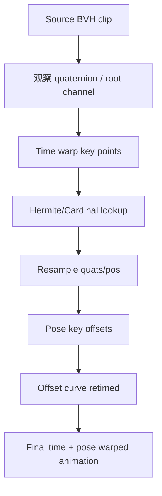
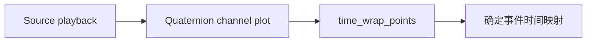
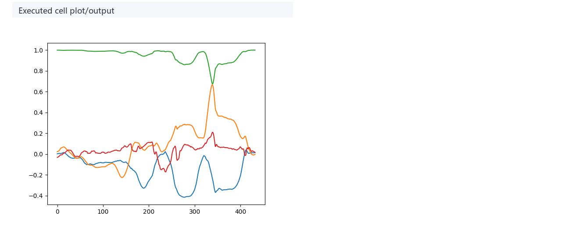
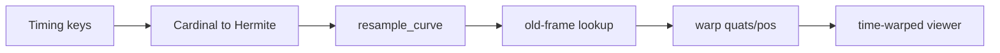
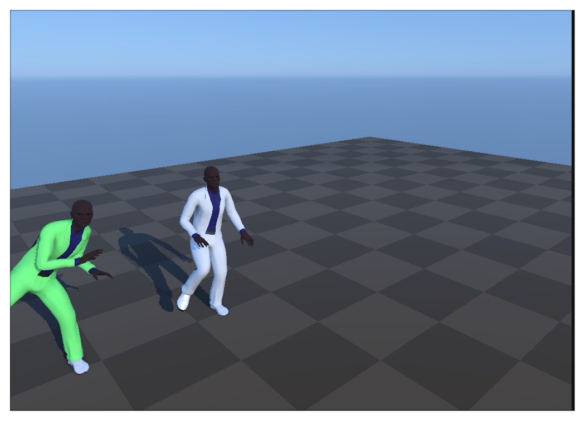
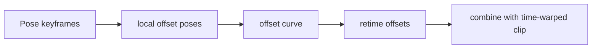
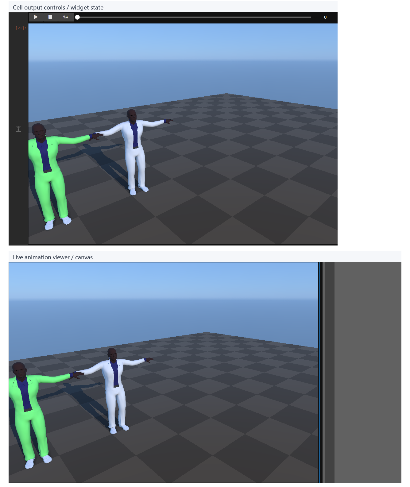
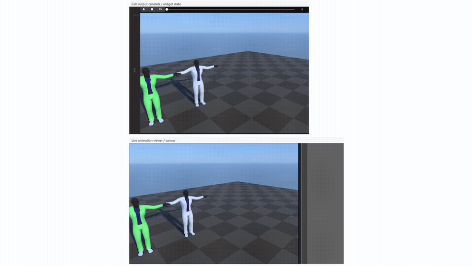
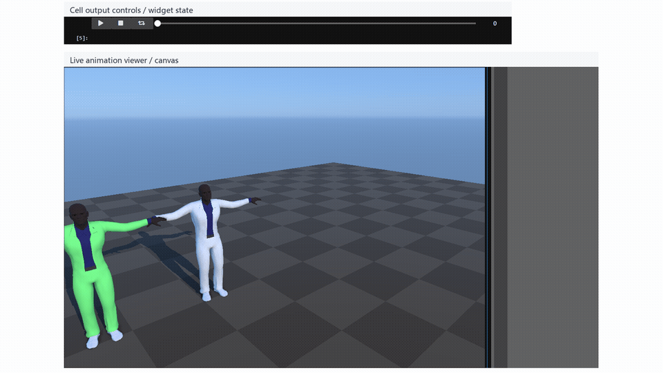

# Motion Warping：用时间曲线和姿态偏移重定向动作

## 元数据

| 字段 | 内容 |
| --- | --- |
| slug | `motion_warping` |
| source path | [`labs/AnimationPapers/Motion Warping.ipynb`](../../../../labs/AnimationPapers/Motion Warping.ipynb) |
| transcript sources | [`docs/transcripts/COzRpFPZ4rk_Motion Warping.txt`](../../../../docs/transcripts/COzRpFPZ4rk_Motion Warping.txt) |
| env prefix | `.envs/motion_warping` |
| kernel | `animationtech-motion_warping` |
| validation status | `passed` (`manual_smoke`) |

## 问题背景

Motion warping 处理的是已有动作大体正确但关键事件时间或空间位置不符合新目标的问题。语音稿把动画拆成曲线：time warp 决定新帧应该读取旧动画的哪一帧，pose warp 决定在特定时间附近叠加多少姿态偏移。notebook 先观察原始动画和 quaternion channel，再用 Cardinal/Hermite 生成 timewarp lookup，随后构造局部 offset layer，最后合成 time + pose warped animation。

## 阅读前置知识

- 动画通道曲线、逐帧 resampling 和 lookup table。
- Cardinal/Hermite spline：用稀疏 timing key 生成连续映射。
- quaternion normalization 与局部 offset：姿态 warp 是叠加差异，不是覆盖原 pose。
- 动画 layer 思想：time layer 和 pose layer 要在同一时间轴上对齐。

## 总模块图



## 代码执行路径


## 模块拆解

### 1. 输入动画与曲线视角

原始 viewer 建立动作语境，raw quaternion channel 把动画还原成一组随帧变化的数值通道。

### 2. Time Warp

`time_wrap_points` 给出旧时间和新时间的对应关系。代码把 sparse keys 转成 Hermite/Cardinal 表达，再采样出每个新帧读取旧动画的位置。

### 3. Pose Warp

pose warp 先取关键姿态差异，转换成局部 offset，再用曲线控制 offset 随时间进入和退出。

## 关键 cell / 函数深讲

### Cell 5-8 - 动画作为曲线



这一步把动画问题转成曲线问题。读图时先看原始通道是否连续，再看关键事件应该如何重定时。



### Cell 10-20 - Time warp lookup



结果重点看同一个动作事件是否被挪到目标帧，同时姿态连续性是否保留。




<video controls muted loop playsinline preload="metadata" width="100%" poster="assets/05_timewarped_animation_compare_result.png">
  <source src="assets/05_timewarped_animation_compare_preview.mp4" type="video/mp4">
  <source src="assets/05_timewarped_animation_compare_preview.webm" type="video/webm">
</video>

### Cell 22-31 - Pose offset layer



pose warp 的输出应该像在目标窗口附近轻推姿态，而不是整段动画突然换姿势。





<video controls muted loop playsinline preload="metadata" width="100%" poster="assets/08_combined_warped_animation_result.png">
  <source src="assets/08_combined_warped_animation_preview.mp4" type="video/mp4">
  <source src="assets/08_combined_warped_animation_preview.webm" type="video/webm">
</video>

## 关键数据结构

- `animation.quats/pos`：输入 BVH 的旋转和位移通道。
- `pose_A/pose_B`：用于构造 warp 的关键姿态。
- `time_wrap_points`、`timewarp_curve`：时间映射控制点和逐帧 lookup。
- `keyframes_q/keyframes_p`、`local_offset_poses`：姿态偏移层。
- `new_q/new_p`、`full_warp_q/full_warp_p`：time warp 和最终组合结果。

## 执行结果的意义

Time warp 图验证事件是否发生在新时间；pose warp viewer 验证关键姿态是否被推向目标；最终动画验证两者是否同步。若动作时间正确但姿态突跳，通常是 offset curve 太窄或 quaternion 处理不连续。

## 重点可视化 / 动画

本节只放 `key_visual` 与 `key_animation` 的算法结果媒体。代码学习卡不作为正文主视觉；它们只在后续证据表中用于复现 cell 或源码上下文。




<video controls muted loop playsinline preload="metadata" width="100%" poster="assets/01_source_animation_playback_result.png">
  <source src="assets/01_source_animation_playback_preview.mp4" type="video/mp4">
  <source src="assets/01_source_animation_playback_preview.webm" type="video/webm">
</video>


**Cell 20 - Time-warped animation comparison**

<video controls muted loop playsinline preload="metadata" width="100%" poster="assets/05_timewarped_animation_compare_result.png">
  <source src="assets/05_timewarped_animation_compare_preview.mp4" type="video/mp4">
  <source src="assets/05_timewarped_animation_compare_preview.webm" type="video/webm">
</video>

**Cell 31 - Final time and pose warped animation**

<video controls muted loop playsinline preload="metadata" width="100%" poster="assets/08_combined_warped_animation_result.png">
  <source src="assets/08_combined_warped_animation_preview.mp4" type="video/mp4">
  <source src="assets/08_combined_warped_animation_preview.webm" type="video/webm">
</video>

| Cell | 输出类型 | 媒体角色 | 可视化主体 | 捕获方式 | 结果媒体 |
| --- | --- | --- | --- | --- | --- |
| Cell 5 | `timeline_viewer` | `key_animation` | Source animation playback: This baseline lets later warped outputs be compared against the original motion. | `canvas` | [结果 PNG](assets/01_source_animation_playback_result.png) / [GIF](assets/01_source_animation_playback_preview.gif) / [MP4](assets/01_source_animation_playback_preview.mp4) / [WebM](assets/01_source_animation_playback_preview.webm) |
| Cell 6 | `plot` | `key_visual` | Raw quaternion channel plot: The graph shows that animation warping often starts as curve manipulation. | `plot` | [结果 PNG](assets/02_raw_quaternion_channel_result.png) |
| Cell 12 | `plot` | `key_visual` | Time-warp keypoints and tangents: The plot shows how sparse timing edits become a continuous time-warp curve. | `plot` | [结果 PNG](assets/03_timewarp_keypoints_result.png) |
| Cell 15 | `plot` | `key_visual` | Resampled time-warp curve: The output shows the actual per-frame time lookup used for animation sampling. | `plot` | [结果 PNG](assets/04_resampled_timewarp_curve_result.png) |
| Cell 20 | `timeline_viewer` | `key_animation` | Time-warped animation comparison: The viewer reveals the timing change without changing the underlying pose content. | `canvas` | [结果 PNG](assets/05_timewarped_animation_compare_result.png) / [GIF](assets/05_timewarped_animation_compare_preview.gif) / [MP4](assets/05_timewarped_animation_compare_preview.mp4) / [WebM](assets/05_timewarped_animation_compare_preview.webm) |
| Cell 23 | `viewer` | `key_visual` | Pose-warp key poses: The key-pose viewer shows what spatial correction will be blended into the clip. | `canvas` | [结果 PNG](assets/06_pose_warp_key_poses_result.png) |
| Cell 27 | `plot` | `key_visual` | Offset warp curve: The curve explains how local pose edits are distributed smoothly. | `plot` | [结果 PNG](assets/07_offset_warp_curve_result.png) |
| Cell 31 | `timeline_viewer` | `key_animation` | Final time and pose warped animation: This final viewer checks whether timing and pose edits combine into a coherent motion. | `canvas` | [结果 PNG](assets/08_combined_warped_animation_result.png) / [GIF](assets/08_combined_warped_animation_preview.gif) / [MP4](assets/08_combined_warped_animation_preview.mp4) / [WebM](assets/08_combined_warped_animation_preview.webm) |


## 代码 Cell 与可视化结果

本节保留每个 cell 的可复现证据。结果 PNG 用于正文阅读，代码卡记录代码摘要与输出来源；有 timeline 或参数滑杆的 cell 同时提供 GIF、MP4 和 WebM。

| Cell / 片段 | 结果说明 | 证据 |
| --- | --- | --- |
| Cell 5 | This baseline lets later warped outputs be compared against the original motion. | [结果 PNG](assets/01_source_animation_playback_result.png) / [GIF](assets/01_source_animation_playback_preview.gif) / [MP4](assets/01_source_animation_playback_preview.mp4) / [WebM](assets/01_source_animation_playback_preview.webm) / [代码卡](assets/01_source_animation_playback.png) |
| Cell 6 | The graph shows that animation warping often starts as curve manipulation. | [结果 PNG](assets/02_raw_quaternion_channel_result.png) / [代码卡](assets/02_raw_quaternion_channel.png) |
| Cell 12 | The plot shows how sparse timing edits become a continuous time-warp curve. | [结果 PNG](assets/03_timewarp_keypoints_result.png) / [代码卡](assets/03_timewarp_keypoints.png) |
| Cell 15 | The output shows the actual per-frame time lookup used for animation sampling. | [结果 PNG](assets/04_resampled_timewarp_curve_result.png) / [代码卡](assets/04_resampled_timewarp_curve.png) |
| Cell 20 | The viewer reveals the timing change without changing the underlying pose content. | [结果 PNG](assets/05_timewarped_animation_compare_result.png) / [GIF](assets/05_timewarped_animation_compare_preview.gif) / [MP4](assets/05_timewarped_animation_compare_preview.mp4) / [WebM](assets/05_timewarped_animation_compare_preview.webm) / [代码卡](assets/05_timewarped_animation_compare.png) |
| Cell 23 | The key-pose viewer shows what spatial correction will be blended into the clip. | [结果 PNG](assets/06_pose_warp_key_poses_result.png) / [代码卡](assets/06_pose_warp_key_poses.png) |
| Cell 27 | The curve explains how local pose edits are distributed smoothly. | [结果 PNG](assets/07_offset_warp_curve_result.png) / [代码卡](assets/07_offset_warp_curve.png) |
| Cell 31 | This final viewer checks whether timing and pose edits combine into a coherent motion. | [结果 PNG](assets/08_combined_warped_animation_result.png) / [GIF](assets/08_combined_warped_animation_preview.gif) / [MP4](assets/08_combined_warped_animation_preview.mp4) / [WebM](assets/08_combined_warped_animation_preview.webm) / [代码卡](assets/08_combined_warped_animation.png) |


## 运行方式

AnimationPapers 案例优先使用：

```powershell
powershell -NoProfile -ExecutionPolicy Bypass -File .\tools\start_animationpapers_lab.ps1
```

单案例验证使用：

```powershell
powershell -NoProfile -ExecutionPolicy Bypass -File .\tools\run_case.ps1 motion_warping
```
