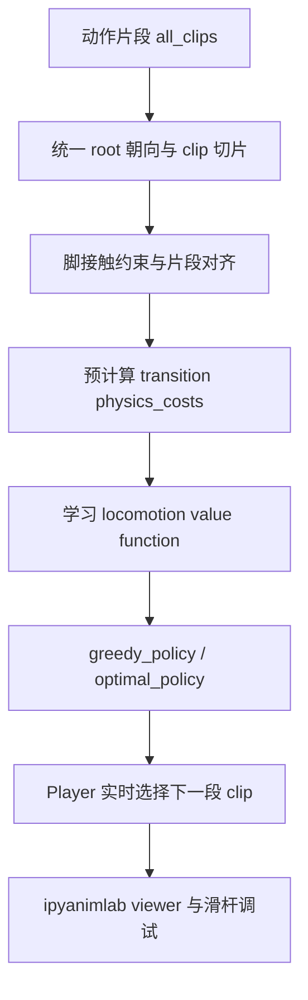
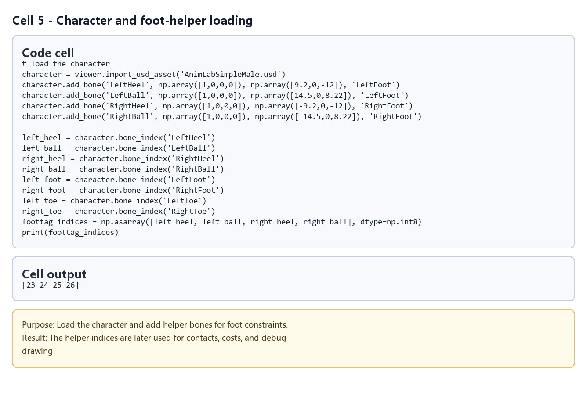
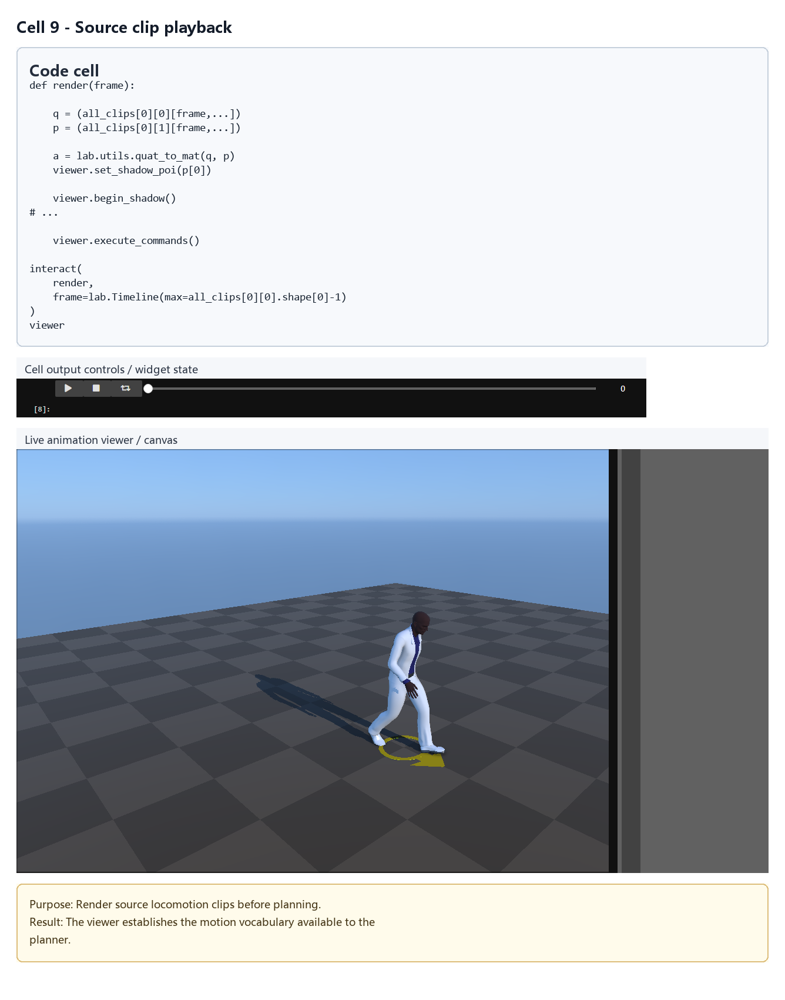
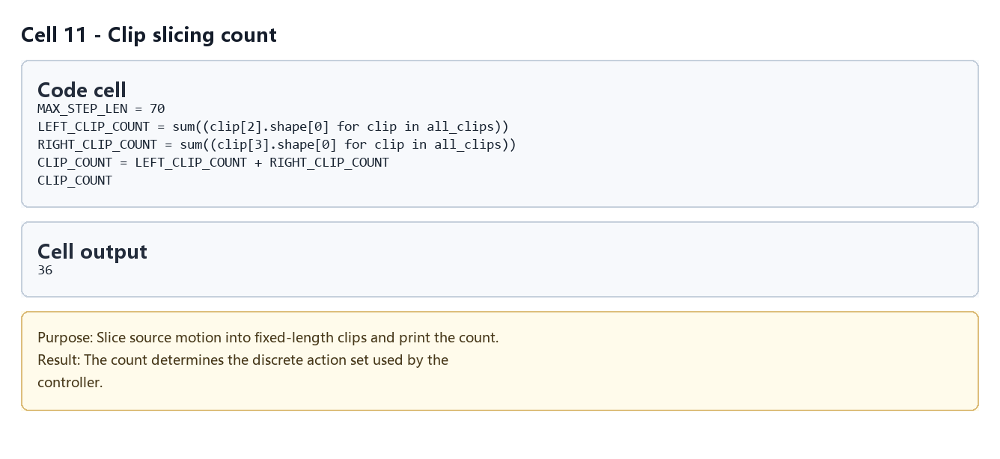
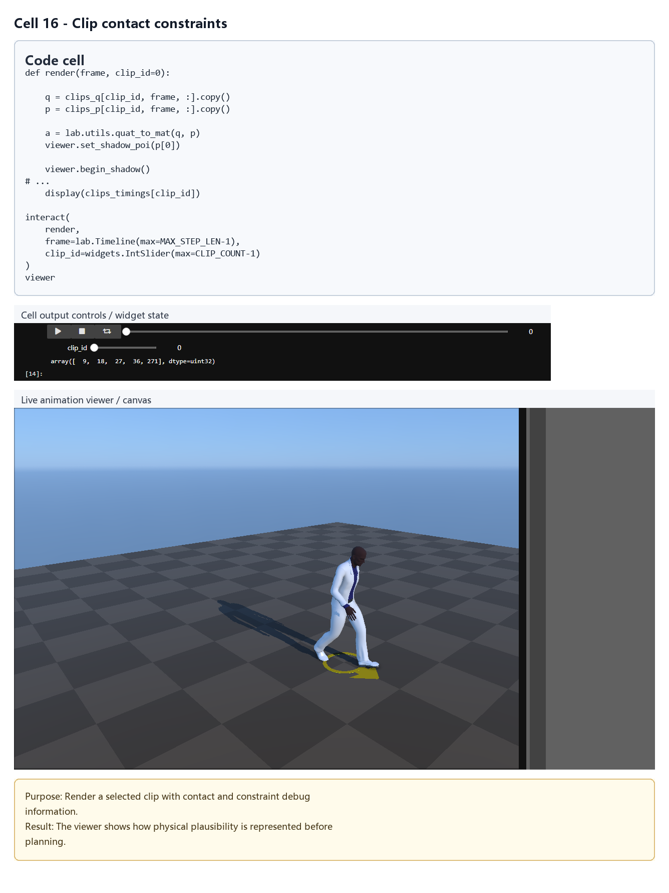
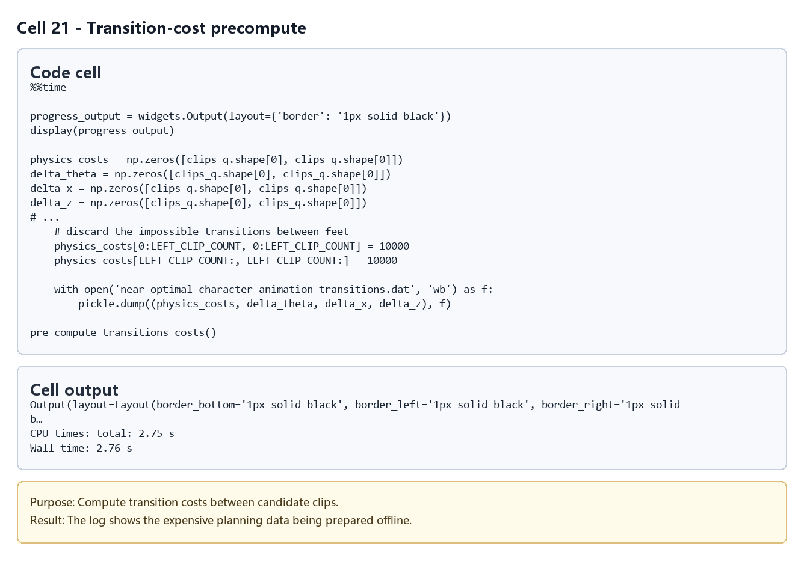
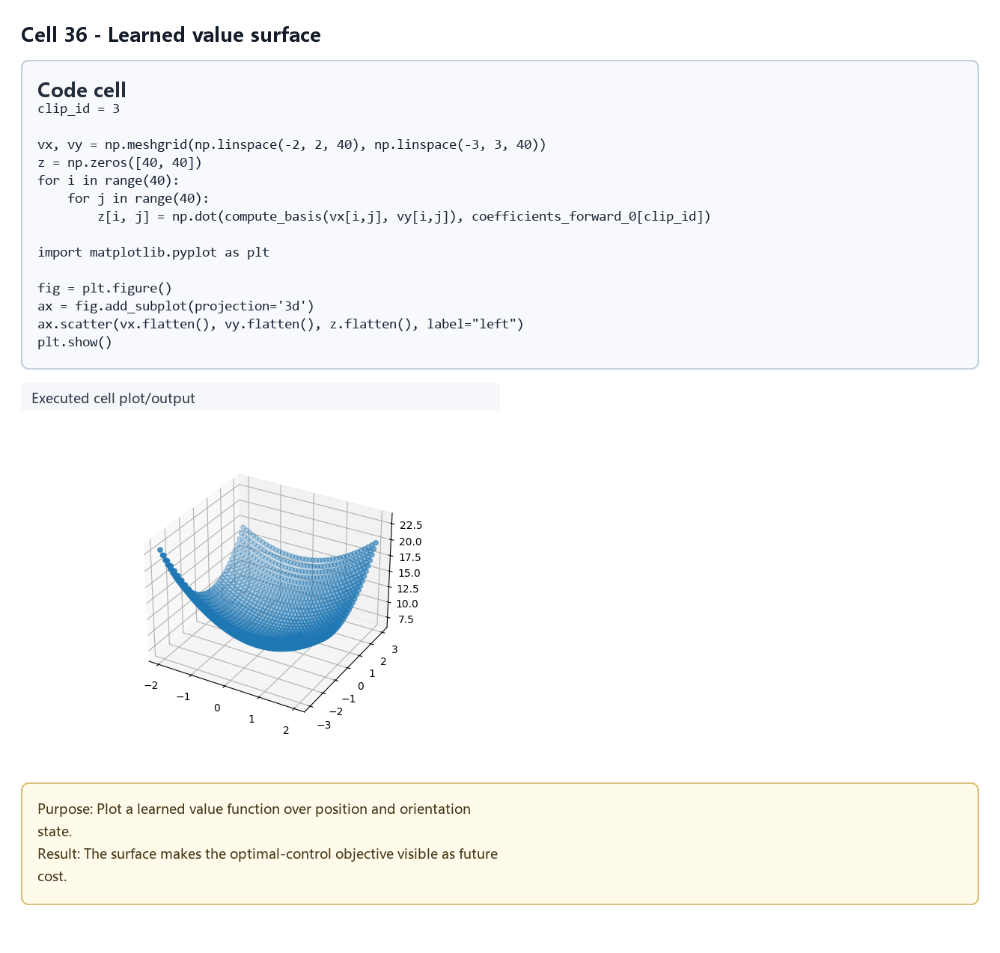
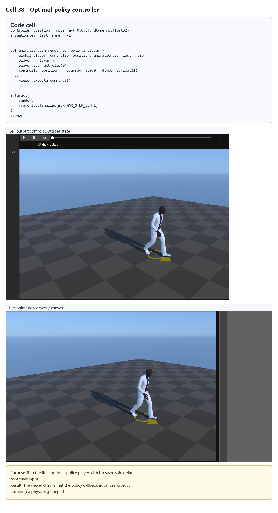

# Near-optimal Character Animation with Continuous Control

## 元数据

| 字段 | 内容 |
| --- | --- |
| slug | `near_optimal_character_animation_with_continuous_control` |
| source path | [`labs/AnimationPapers/Near-optimal Character Animation with Continuous Control.ipynb`](../../../../labs/AnimationPapers/Near-optimal%20Character%20Animation%20with%20Continuous%20Control.ipynb) |
| env prefix | `.envs/near_opt_ctrl` |
| kernel | `animationtech-near_optimal_character_animation_with_continuous_control` |
| validation status | `passed`, `manual_smoke`; 自动执行已通过，交互 viewer 仍建议在 JupyterLab 中人工检查 |

## 问题背景

这篇 notebook 复现 Treuille、Lee 和 Popovic 在 2007 年提出的 continuous control 角色动画思路：先把长运动切成可衔接的步态片段，计算片段之间的物理连续性代价，再用价值函数在连续控制状态中选择下一段动作。它关注的不是单纯播放 clip，而是在玩家方向输入不断变化时，让角色以较低转接代价持续行走和转向。

案例从 `near_optimal_character_animations.dat` 读取骨骼与动画片段，生成或读取 `near_optimal_character_animation_transitions.dat` 作为转移代价缓存。后续 cell 用 `ipyanimlab` viewer 和 `ipywidgets` 控制器比较贪心策略与 near-optimal 策略的交互效果。

## 与 Real-Time Planning 篇的关系

建议先把这篇当作 Real-time planning for parameterized human motion 的前置章节。两者共享同一类核心问题：如何把 motion clip、转移代价、状态增量和 value function 组合成实时可查询的动作策略。

区别在于，本篇主要使用固定的离散 clip 集合，状态重点放在行进方向和偏移误差上；Real-time planning 篇在此基础上加入参数化动作、reach-goal 二维目标位置、rollback 采样和 MotionGroup 混合动作。因此，如果这里的 `transition`、`physics_costs`、`optimal_policy` 和 `Player` 已经读懂，下一篇中的局部规划和参数化 MotionGroup 会更容易串起来。

## 总模块图



这张图可以把本篇和 Real-Time Planning 篇串起来看：两者都先把动作库整理成“可查询的状态转移空间”，再用代价函数决定下一步。Near-optimal 的状态空间更小，更适合先看清 value function 和 transition cost 的作用。

## 模块拆解

1. **加载与可视化**：导入 `pickle`、`numpy`、`ipyanimlab`、`scipy.optimize.linprog` 等依赖，创建 `lab.Viewer`，加载 `AnimLabSimpleMale.usd`，读取 `(bones, parents, all_clips)`。早期 `render` cell 用来确认原始动画能正常播放。
2. **Motion Model**：`compute_root` 统一根骨骼朝向，`compute_clip` 截取固定长度步态片段，`compute_constraint_qp` 提取脚接触约束。输出包括 `clips_q`、`clips_p`、`clips_timings`、`clips_constraints_q` 和 `clips_constraints_p`。
3. **播放器与切换**：`ClipPlayer` 负责单个 clip 的帧推进和对齐，`Player` 管理当前 clip 与下一 clip。`align_to_out` 使用接触脚约束对齐新片段，减少切换时的脚滑和身体跳变。
4. **转移代价**：`pre_compute_transitions_costs` 遍历所有片段对，计算 `physics_costs`、`delta_theta`、`delta_x`、`delta_z`。这些表构成策略搜索的图结构。
5. **策略学习**：`greedy_policy` 只看较近的即时收益；`optimal_policy` 会结合线性 value function 的未来代价。`learn_locomotion_value_function` 通过 Bellman 约束和 `linprog` 学习 `coefficients_forward_0`。
6. **交互控制**：最后的 viewer 读取 `widgets.Controller(index=0)` 的方向输入，在每个可切换时刻选择下一 clip，并绘制角色和期望方向。

## 无手柄/滑杆学习入口

如果本机没有可被浏览器识别的 gamepad，仍然可以按下面顺序阅读和运行：

- 先运行加载、clip 构建、transition cost 和 value function 学习相关 cell，确认缓存可以生成或读取。
- 对 `greedy_policy(...)` 和 `optimal_policy(...)` 直接传入固定参数，例如 `start_clip`、`x`、`theta`，观察返回的下一 clip 与调试信息。
- 对带 `ipywidgets.interactive` 的 viewer，可以使用 notebook 里的滑杆参数调节 `deviation_factor`、`physic_factor`、`direction_factor`，不依赖真实手柄也能比较策略倾向。
- 只有读取 `widgets.Controller(index=0)` 的 cell 需要真实控制器输入；没有设备时，把它作为在线控制入口代码阅读即可。

## 执行结果的意义

运行成功后，应能看到从原始步态片段到连续可控运动的完整链条：先检查 clip 与脚接触约束，再观察低代价转移是否足够平滑，最后通过贪心策略和 near-optimal 策略对比下一步选择。`physics_costs` 说明哪些片段组合在骨骼连续性上可靠；`coefficients_forward_0` 则编码了对未来方向误差和位移误差的估计。

这篇的价值在于给出实时角色控制的最小完整框架。它不处理参数化 MotionGroup，也不追求更复杂的目标到达策略；这些内容放在 Real-time planning 篇中继续展开。

## 代码 Cell 与可视化结果

本节按 notebook 的关键 code cell 组织学习素材：每个条目都对应代码目的、实际输出类型、结果意义和 PNG 学习卡片。PNG 由指定 cell 的代码摘要、输出区、viewer/canvas 或图表/日志合成，不使用整页滚动截图替代。

<video controls muted src="assets/00-walkthrough.webm"></video>

[下载 WebM](assets/00-walkthrough.webm)

| Cell | 输出类型 | 代码做什么 | 结果说明什么 | 素材 |
| --- | --- | --- | --- | --- |
| 5 | `log` | Load the character and add helper bones for foot constraints. | The helper indices are later used for contacts, costs, and debug drawing. | [PNG](assets/01_load_character_helpers.png) |
| 9 | `timeline_viewer` | Render source locomotion clips before planning. | The viewer establishes the motion vocabulary available to the planner. | [PNG](assets/02_source_clip_playback.png) |
| 11 | `table` | Slice source motion into fixed-length clips and print the count. | The count determines the discrete action set used by the controller. | [PNG](assets/03_clip_count_table.png) |
| 16 | `timeline_viewer` | Render a selected clip with contact and constraint debug information. | The viewer shows how physical plausibility is represented before planning. | [PNG](assets/04_contact_constraint_viewer.png) |
| 19 | `timeline_viewer` | Play through clip transitions with the Player abstraction. | This validates that clips can be stitched into continuous playback. | [PNG](assets/05_random_transition_player.png) |
| 21 | `log` | Compute transition costs between candidate clips. | The log shows the expensive planning data being prepared offline. | [PNG](assets/06_transition_cost_precompute.png) |
| 36 | `plot` | Plot a learned value function over position and orientation state. | The surface makes the optimal-control objective visible as future cost. | [PNG](assets/07_learned_value_surface.png) |
| 38 | `timeline_viewer` | Run the final optimal-policy player with browser-safe default controller input. | The viewer checks that the policy callback advances without requiring a physical gamepad. | [PNG](assets/08_optimal_policy_player.png) |

### Cell 5 - Character and foot-helper loading

- 代码做什么：Load the character and add helper bones for foot constraints.
- 运行后看到什么：运行日志或文本输出。
- 结果说明什么：The helper indices are later used for contacts, costs, and debug drawing.



### Cell 9 - Source clip playback

- 代码做什么：Render source locomotion clips before planning.
- 运行后看到什么：带 timeline 的可播放 viewer。
- 结果说明什么：The viewer establishes the motion vocabulary available to the planner.



### Cell 11 - Clip slicing count

- 代码做什么：Slice source motion into fixed-length clips and print the count.
- 运行后看到什么：表格或结构化数据输出。
- 结果说明什么：The count determines the discrete action set used by the controller.



### Cell 16 - Clip contact constraints

- 代码做什么：Render a selected clip with contact and constraint debug information.
- 运行后看到什么：带 timeline 的可播放 viewer。
- 结果说明什么：The viewer shows how physical plausibility is represented before planning.



### Cell 19 - Random transition player

- 代码做什么：Play through clip transitions with the Player abstraction.
- 运行后看到什么：带 timeline 的可播放 viewer。
- 结果说明什么：This validates that clips can be stitched into continuous playback.


### Cell 21 - Transition-cost precompute

- 代码做什么：Compute transition costs between candidate clips.
- 运行后看到什么：运行日志或文本输出。
- 结果说明什么：The log shows the expensive planning data being prepared offline.



### Cell 36 - Learned value surface

- 代码做什么：Plot a learned value function over position and orientation state.
- 运行后看到什么：图表输出。
- 结果说明什么：The surface makes the optimal-control objective visible as future cost.



### Cell 38 - Optimal-policy controller

- 代码做什么：Run the final optimal-policy player with browser-safe default controller input.
- 运行后看到什么：带 timeline 的可播放 viewer。
- 结果说明什么：The viewer checks that the policy callback advances without requiring a physical gamepad.



## 运行方式

用于学习和交互查看时，启动 AnimationPapers 的 JupyterLab，再打开对应 notebook：

```powershell
powershell -NoProfile -ExecutionPolicy Bypass -File .\tools\start_animationpapers_lab.ps1
```

用于自动化验证或重新生成缓存时，运行对应 case：

```powershell
powershell -NoProfile -ExecutionPolicy Bypass -File .\tools\run_case.ps1 near_optimal_character_animation_with_continuous_control
```

注意：该案例的验证策略是 `manual_smoke`。自动执行状态为 `passed`，但交互 viewer、timeline 和 controller 输入仍需要在 JupyterLab 中人工确认。
