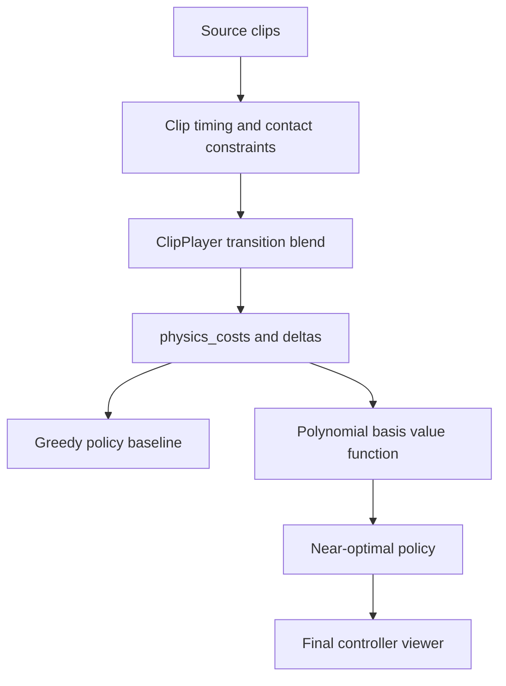
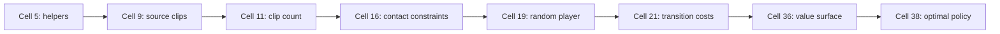
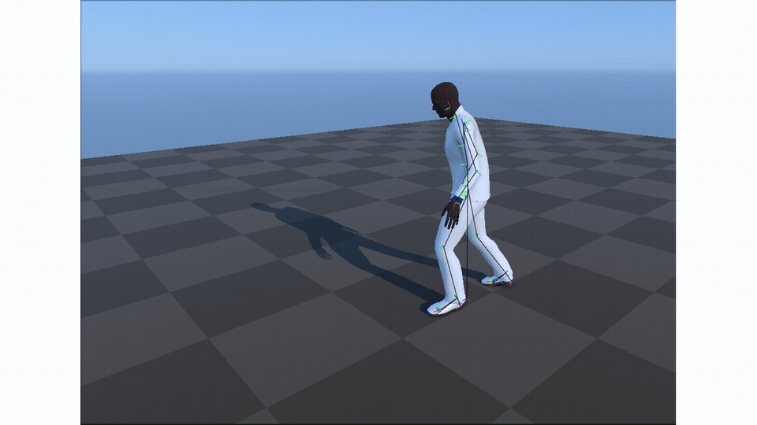
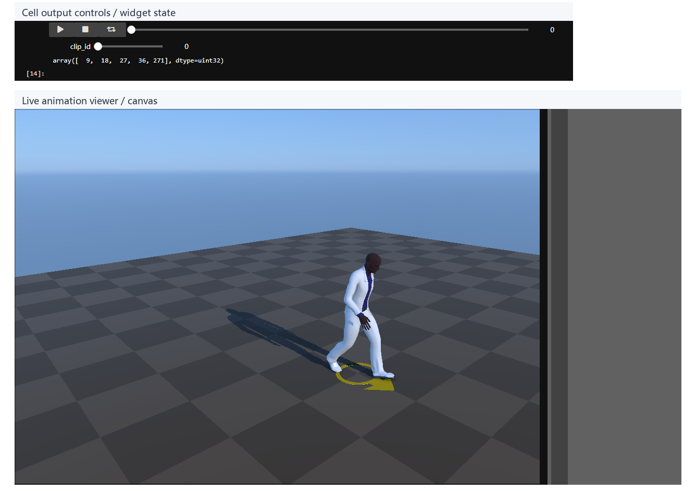
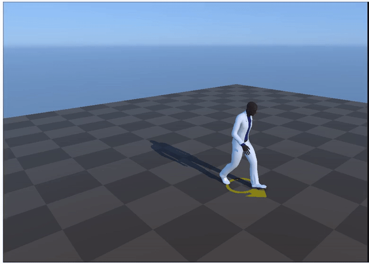
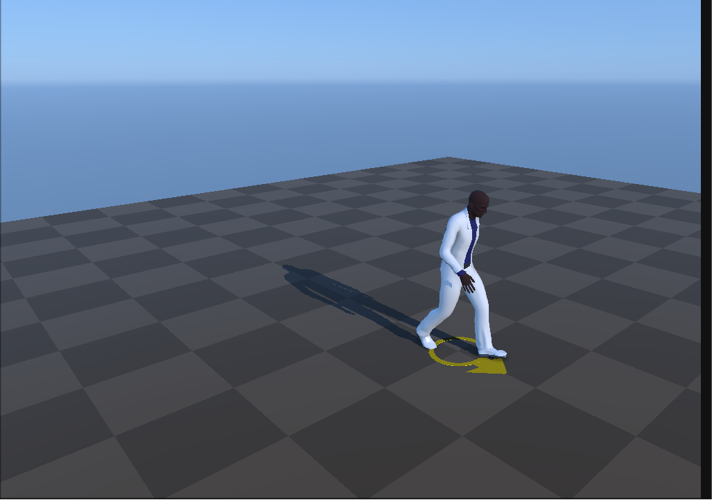
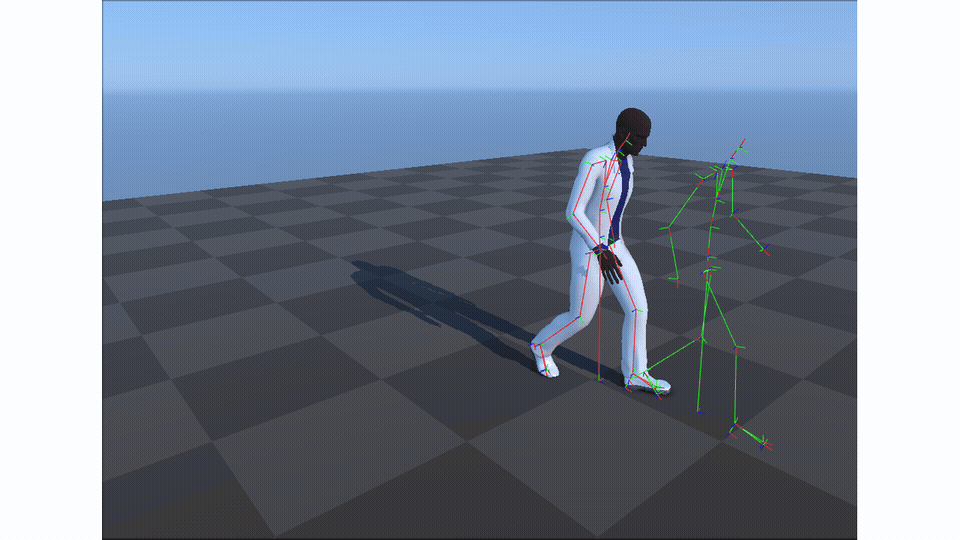
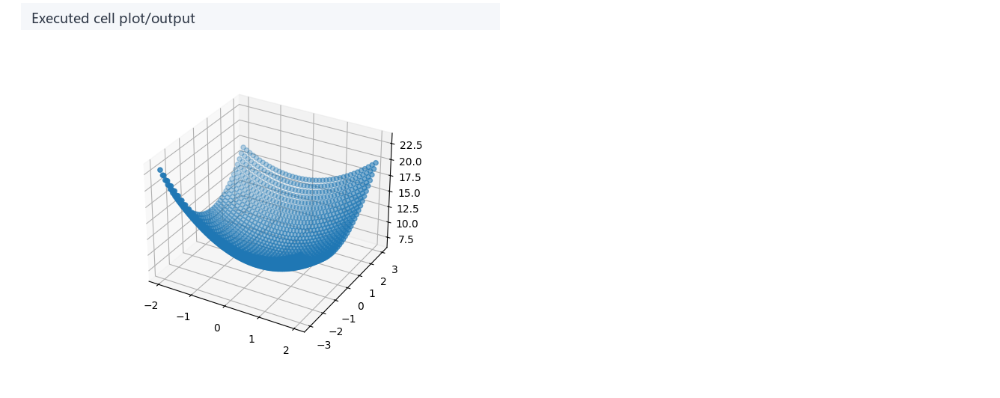
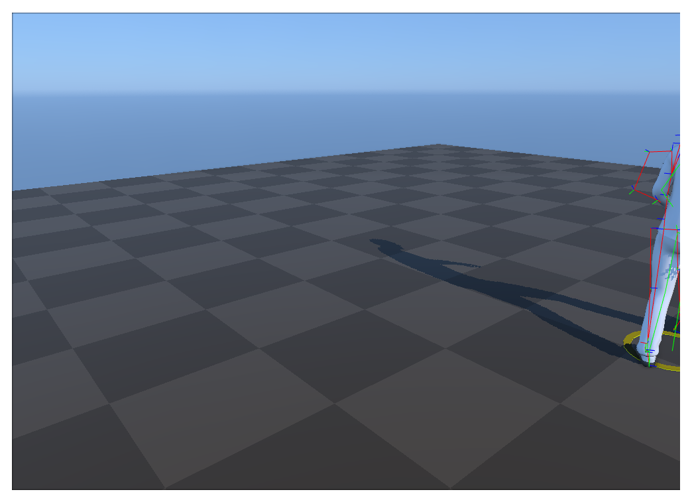
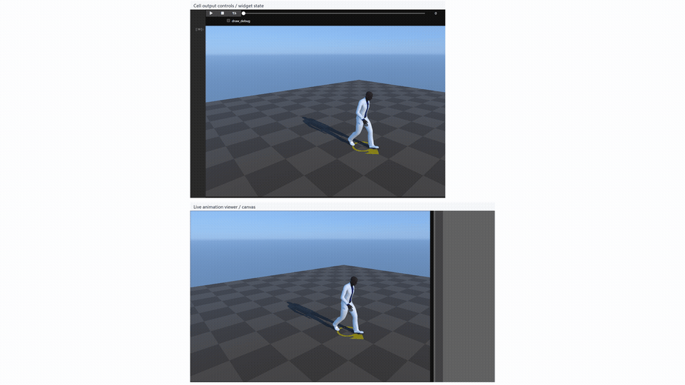

# Near-optimal Character Animation with Continuous Control：离散片段与连续状态的近似最优控制

## 元数据

| 字段 | 内容 |
| --- | --- |
| slug | `near_optimal_character_animation_with_continuous_control` |
| source path | [`labs/AnimationPapers/Near-optimal Character Animation with Continuous Control.ipynb`](../../../../labs/AnimationPapers/Near-optimal Character Animation with Continuous Control.ipynb) |
| transcript sources | [`docs/transcripts/_S4vpMV0-UY_Reinforcement Learning 02 _ Near Optimal Character Animation with Continuous Con.txt`](../../../../docs/transcripts/_S4vpMV0-UY_Reinforcement Learning 02 _ Near Optimal Character Animation with Continuous Con.txt) |
| env prefix | `.envs/near_opt_ctrl` |
| kernel | `animationtech-near_optimal_character_animation_with_continuous_control` |
| validation status | `passed` (`manual_smoke`) |

## 问题背景

这个案例把动作控制建模为离散 clip 选择加连续状态代价。语音稿强调 greedy transition 容易陷入局部最优，所以 notebook 预计算 clip 之间的 physics cost 和 root delta，再用 polynomial basis 与线性规划学习未来代价，让运行时策略不只看下一步。

## 阅读前置知识

- clip 切分、contact timing 和接触脚对齐。
- transition cost：姿态连续性、接触约束和方向目标共同决定代价。
- 连续状态 `(clip, x, z, theta)` 与 basis function。
- value function / policy iteration 的基本直觉。

## 总模块图



## 代码执行路径



## 模块拆解

### 1. Clip Motion Model

`compute_root` 和 `compute_clip` 把长动作切成可比较的片段。contact constraints 标出脚接触窗口。

### 2. Transition Cost

`ClipPlayer` 和 `Player` 验证片段能被 blend。`physics_costs`、`delta_x/z/theta` 把每个候选转移的代价和状态变化离线保存。

### 3. Near-optimal Policy

greedy policy 只看当前 deviation、physics 和 direction；near-optimal policy 额外查询 value function，估计未来代价。

## 关键 cell / 函数深讲

## 关键 cell / 函数深讲

### Cell 9 - Source clip playback

渲染最初被裁切出的所有离散片段，建立动作规划的可用词汇表。


- 代码做什么：Source clip playback: The viewer establishes the motion vocabulary available to the planner.
- 运行后看到什么：`timeline_viewer`
- 结果说明什么：The viewer establishes the motion vocabulary available to the planner.
- 可视化主体：Source clip playback
- 捕获方式：`canvas`





https://github.com/user-attachments/assets/bfff5417-4489-4a83-819b-d4d05318fe99

<video controls muted loop playsinline preload="metadata" width="100%" poster="assets/02_source_clip_playback_result.png" src="assets/02_source_clip_playback_preview.mp4"></video>

### Cell 16 - Clip contact constraints

提取每个片段的脚部接触窗口和位置，用以约束后续拼接动作的物理合理性。


- 代码做什么：Clip contact constraints: The viewer shows how physical plausibility is represented before planning.
- 运行后看到什么：`timeline_viewer`
- 结果说明什么：The viewer shows how physical plausibility is represented before planning.
- 可视化主体：Clip contact constraints
- 捕获方式：`canvas`






https://github.com/user-attachments/assets/6f827c0f-ea4c-4ed3-b7d2-36571202bd12

<video controls muted loop playsinline preload="metadata" width="100%" poster="assets/04_contact_constraint_viewer_result.png" src="assets/04_contact_constraint_viewer_preview.mp4"></video>

### Cell 19 - Random transition player

通过随机选择可接续的动作片段进行播放，验证基础过渡算法能否顺利将片段拼接起来。


- 代码做什么：Random transition player: This validates that clips can be stitched into continuous playback.
- 运行后看到什么：`timeline_viewer`
- 结果说明什么：This validates that clips can be stitched into continuous playback.
- 可视化主体：Random transition player
- 捕获方式：`canvas`






https://github.com/user-attachments/assets/85a27653-0c55-408c-b5be-5e945b46adc9

<video controls muted loop playsinline preload="metadata" width="100%" poster="assets/05_random_transition_player_result.png" src="assets/05_random_transition_player_preview.mp4"></video>

### Cell 36 - Learned value surface

使用多项式基函数拟合未来收益（Value Function），并将空间状态对应的代价分布可视化。

```mermaid
flowchart LR
    A[定义关于 (x, z, theta) 的基函数] --> B[迭代计算每个状态的 Bellman Cost]
    B --> C[回归得到系数 coefficients]
    C --> D[将未来收益绘制成等高线/曲面图]
```

- 代码做什么：Learned value surface: The surface makes the optimal-control objective visible as future cost.
- 运行后看到什么：`plot`
- 结果说明什么：The surface makes the optimal-control objective visible as future cost.
- 可视化主体：Learned value surface
- 捕获方式：`plot`



### Cell 38 - Optimal-policy controller

在运行时评估贪婪选择和价值表（Value Policy），让角色自主做出更长远的最优动作规划。


- 代码做什么：Optimal-policy controller: The viewer checks that the policy callback advances without requiring a physical gamepad.
- 运行后看到什么：`timeline_viewer`
- 结果说明什么：The viewer checks that the policy callback advances without requiring a physical gamepad.
- 可视化主体：Optimal-policy controller
- 捕获方式：`canvas`

这段动画要看黄色方向箭头、白色角色和调试骨架一起移动。策略不是随机换片段，而是在当前 clip、连续位移和朝向误差上查询 value policy，选择包含未来代价的下一段动作。






https://github.com/user-attachments/assets/4a71849b-72a9-47d3-b778-40811c83b5b9

<video controls muted loop playsinline preload="metadata" width="100%" poster="assets/08_optimal_policy_player_result.png" src="assets/08_optimal_policy_player_preview.mp4"></video>

## 关键数据结构

- `all_clips`、`clips_q`、`clips_p`、`clips_timings`：离散动作片段。
- `clips_constraints_q/p`：接触和姿态约束。
- `ClipPlayer`、`Player`：运行时转移播放模型。
- `physics_costs`、`delta_x`、`delta_z`、`delta_theta`：离线 transition model。
- `samples`、`coefficients_forward_0`：value function 训练与评估数据。

## 执行结果的意义

contact viewer 验证物理约束；transition cost 说明离线控制模型；value surface 展示未来代价；final viewer 检查 near-optimal policy 的实际动作选择。

## 重点可视化 / 动画

本节只放 `key_visual` 与 `key_animation` 的算法结果媒体。代码学习卡不作为正文主视觉；它们只在后续证据表中用于复现 cell 或源码上下文。


https://github.com/user-attachments/assets/bfff5417-4489-4a83-819b-d4d05318fe99

<video controls muted loop playsinline preload="metadata" width="100%" poster="assets/02_source_clip_playback_result.png">
  <source src="assets/02_source_clip_playback_preview.mp4" type="video/mp4">
  <source src="assets/02_source_clip_playback_preview.webm" type="video/webm">
</video>


**Cell 16 - Clip contact constraints**

<video controls muted loop playsinline preload="metadata" width="100%" poster="assets/04_contact_constraint_viewer_result.png">
  <source src="assets/04_contact_constraint_viewer_preview.mp4" type="video/mp4">
  <source src="assets/04_contact_constraint_viewer_preview.webm" type="video/webm">
</video>

**Cell 19 - Random transition player**

<video controls muted loop playsinline preload="metadata" width="100%" poster="assets/05_random_transition_player_result.png">
  <source src="assets/05_random_transition_player_preview.mp4" type="video/mp4">
  <source src="assets/05_random_transition_player_preview.webm" type="video/webm">
</video>

**Cell 38 - Optimal-policy controller**

<video controls muted loop playsinline preload="metadata" width="100%" poster="assets/08_optimal_policy_player_result.png">
  <source src="assets/08_optimal_policy_player_preview.mp4" type="video/mp4">
  <source src="assets/08_optimal_policy_player_preview.webm" type="video/webm">
</video>

| Cell | 输出类型 | 媒体角色 | 可视化主体 | 捕获方式 | 结果媒体 |
| --- | --- | --- | --- | --- | --- |
| Cell 9 | `timeline_viewer` | `key_animation` | Source clip playback: The viewer establishes the motion vocabulary available to the planner. | `canvas` | [结果 PNG](assets/02_source_clip_playback_result.png) / [GIF](assets/02_source_clip_playback_preview.gif) / [MP4](assets/02_source_clip_playback_preview.mp4) / [WebM](assets/02_source_clip_playback_preview.webm) |
| Cell 16 | `timeline_viewer` | `key_animation` | Clip contact constraints: The viewer shows how physical plausibility is represented before planning. | `canvas` | [结果 PNG](assets/04_contact_constraint_viewer_result.png) / [GIF](assets/04_contact_constraint_viewer_preview.gif) / [MP4](assets/04_contact_constraint_viewer_preview.mp4) / [WebM](assets/04_contact_constraint_viewer_preview.webm) |
| Cell 19 | `timeline_viewer` | `key_animation` | Random transition player: This validates that clips can be stitched into continuous playback. | `canvas` | [结果 PNG](assets/05_random_transition_player_result.png) / [GIF](assets/05_random_transition_player_preview.gif) / [MP4](assets/05_random_transition_player_preview.mp4) / [WebM](assets/05_random_transition_player_preview.webm) |
| Cell 36 | `plot` | `key_visual` | Learned value surface: The surface makes the optimal-control objective visible as future cost. | `plot` | [结果 PNG](assets/07_learned_value_surface_result.png) |
| Cell 38 | `timeline_viewer` | `key_animation` | Optimal-policy controller: The viewer checks that the policy callback advances without requiring a physical gamepad. | `canvas` | [结果 PNG](assets/08_optimal_policy_player_result.png) / [GIF](assets/08_optimal_policy_player_preview.gif) / [MP4](assets/08_optimal_policy_player_preview.mp4) / [WebM](assets/08_optimal_policy_player_preview.webm) |


## 代码 Cell 与可视化结果

本节保留每个 cell 的可复现证据。结果 PNG 用于正文阅读，代码卡记录代码摘要与输出来源；有 timeline 或参数滑杆的 cell 同时提供 GIF、MP4 和 WebM。

| Cell / 片段 | 结果说明 | 证据 |
| --- | --- | --- |
| Cell 5 | The helper indices are later used for contacts, costs, and debug drawing. | [结果 PNG](assets/01_load_character_helpers_result.png) / [代码卡](assets/01_load_character_helpers.png) |
| Cell 9 | The viewer establishes the motion vocabulary available to the planner. | [结果 PNG](assets/02_source_clip_playback_result.png) / [GIF](assets/02_source_clip_playback_preview.gif) / [MP4](assets/02_source_clip_playback_preview.mp4) / [WebM](assets/02_source_clip_playback_preview.webm) / [代码卡](assets/02_source_clip_playback.png) |
| Cell 11 | The count determines the discrete action set used by the controller. | [结果 PNG](assets/03_clip_count_table_result.png) / [代码卡](assets/03_clip_count_table.png) |
| Cell 16 | The viewer shows how physical plausibility is represented before planning. | [结果 PNG](assets/04_contact_constraint_viewer_result.png) / [GIF](assets/04_contact_constraint_viewer_preview.gif) / [MP4](assets/04_contact_constraint_viewer_preview.mp4) / [WebM](assets/04_contact_constraint_viewer_preview.webm) / [代码卡](assets/04_contact_constraint_viewer.png) |
| Cell 19 | This validates that clips can be stitched into continuous playback. | [结果 PNG](assets/05_random_transition_player_result.png) / [GIF](assets/05_random_transition_player_preview.gif) / [MP4](assets/05_random_transition_player_preview.mp4) / [WebM](assets/05_random_transition_player_preview.webm) / [代码卡](assets/05_random_transition_player.png) |
| Cell 21 | The log shows the expensive planning data being prepared offline. | [结果 PNG](assets/06_transition_cost_precompute_result.png) / [代码卡](assets/06_transition_cost_precompute.png) |
| Cell 36 | The surface makes the optimal-control objective visible as future cost. | [结果 PNG](assets/07_learned_value_surface_result.png) / [代码卡](assets/07_learned_value_surface.png) |
| Cell 38 | The viewer checks that the policy callback advances without requiring a physical gamepad. | [结果 PNG](assets/08_optimal_policy_player_result.png) / [GIF](assets/08_optimal_policy_player_preview.gif) / [MP4](assets/08_optimal_policy_player_preview.mp4) / [WebM](assets/08_optimal_policy_player_preview.webm) / [代码卡](assets/08_optimal_policy_player.png) |


## 运行方式

AnimationPapers 案例优先使用：

```powershell
powershell -NoProfile -ExecutionPolicy Bypass -File .\tools\start_animationpapers_lab.ps1
```

单案例验证使用：

```powershell
powershell -NoProfile -ExecutionPolicy Bypass -File .\tools\run_case.ps1 near_optimal_character_animation_with_continuous_control
```
