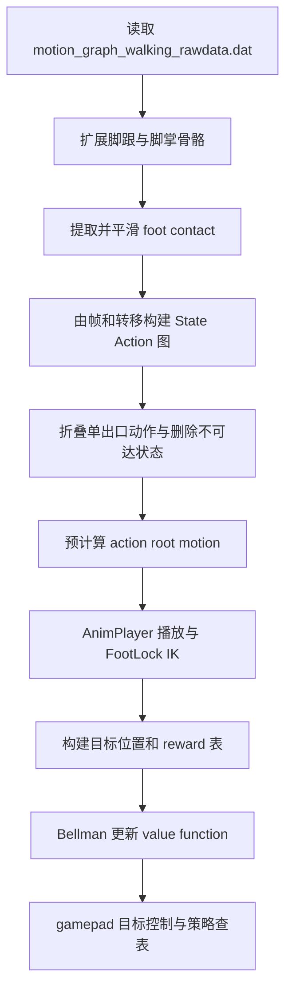
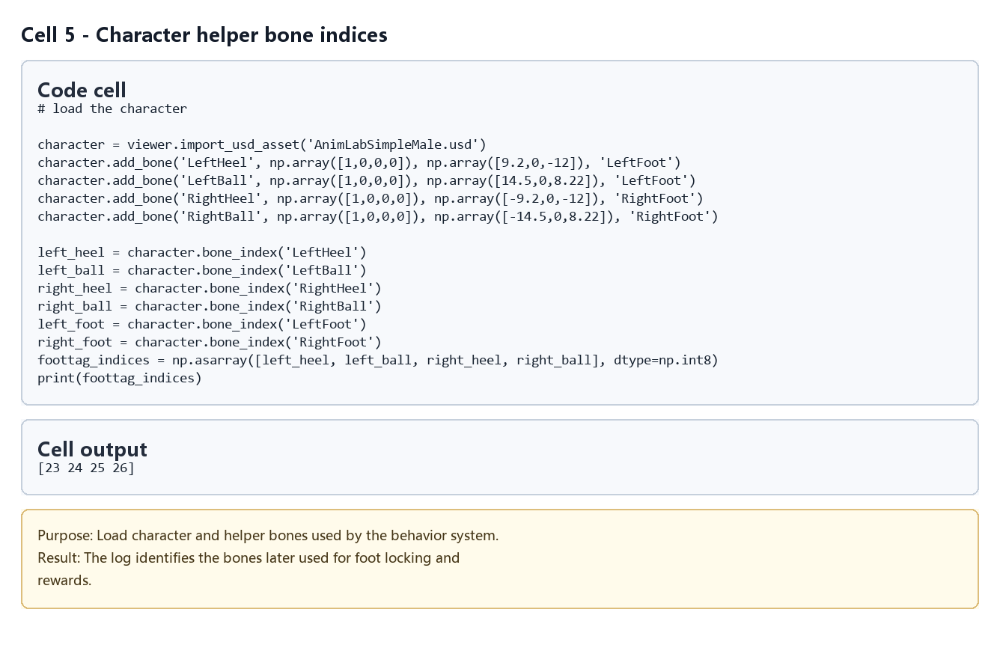
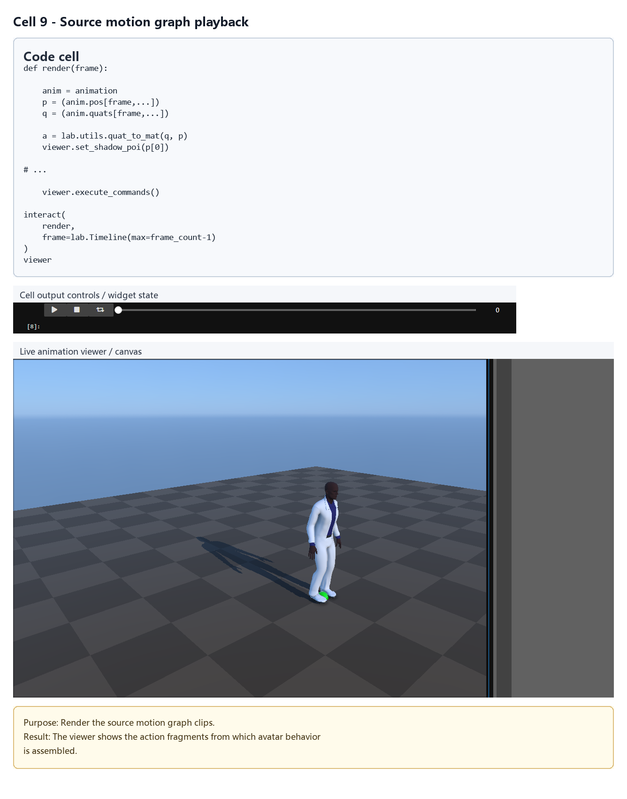
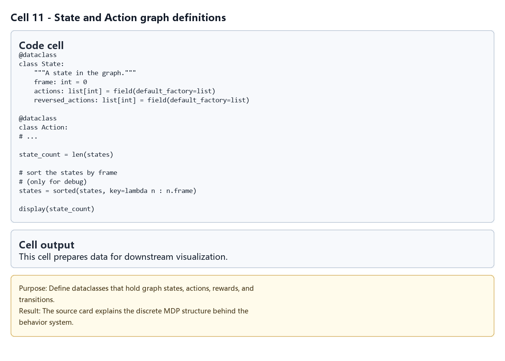
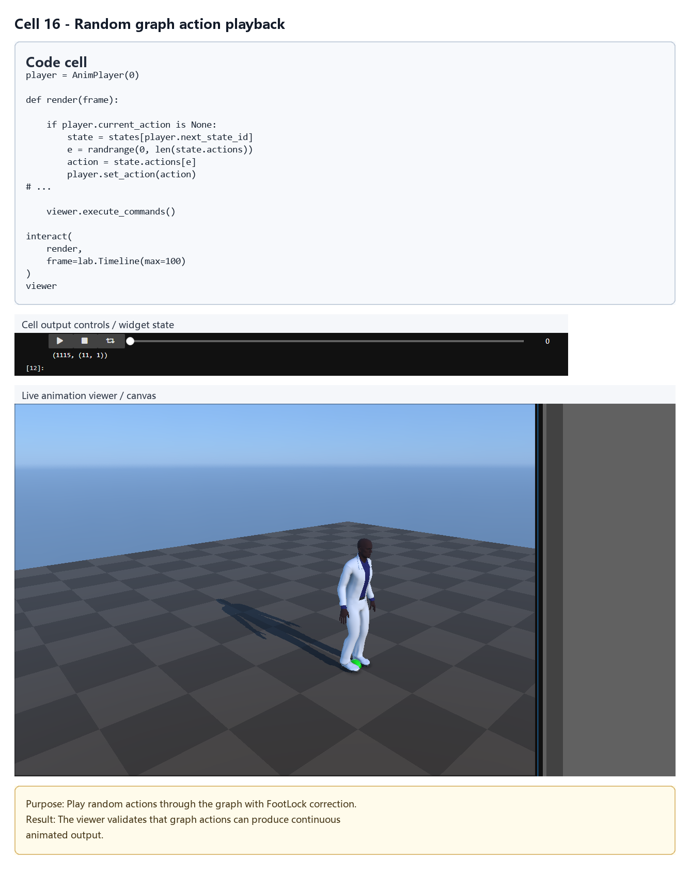
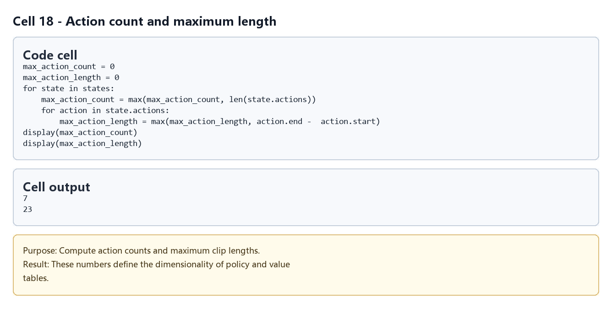
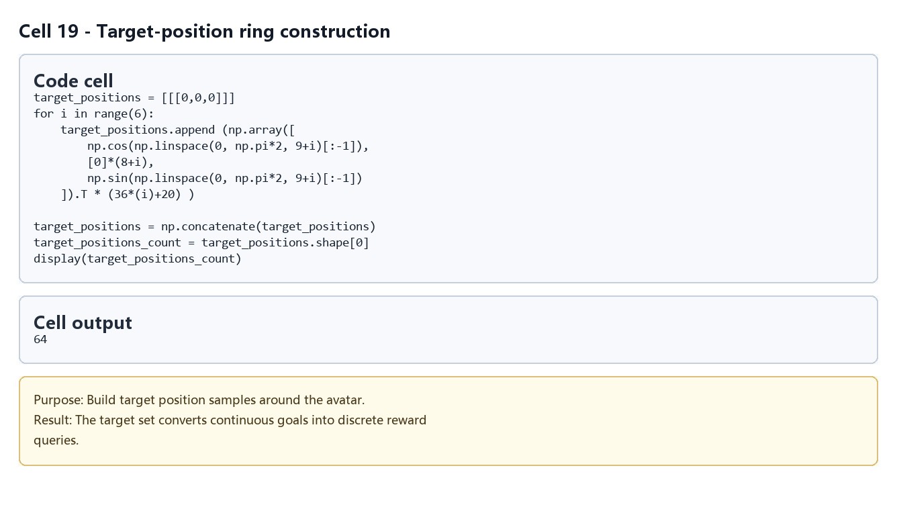
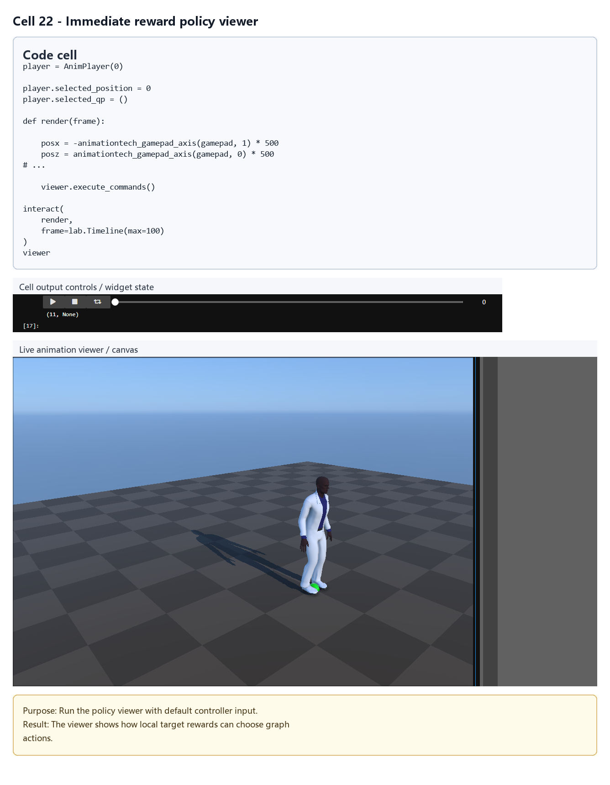
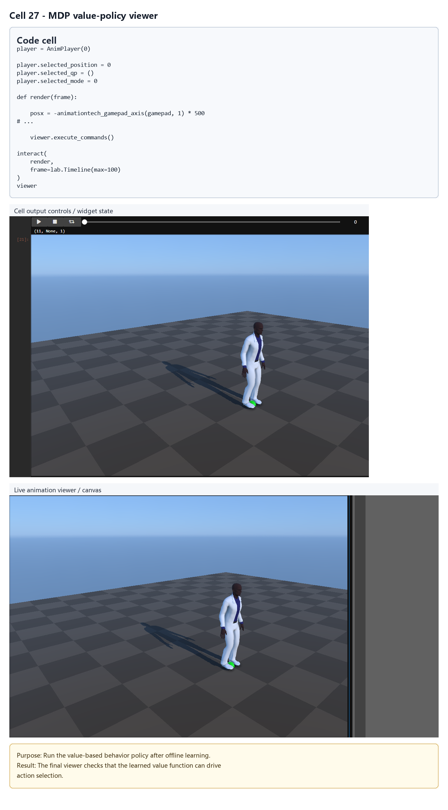

# Precomputing Avatar Behavior：从 Motion Graph 到预计算控制策略

## 元数据

| 字段 | 值 |
| --- | --- |
| slug | `precomputing_avatar_behavior` |
| source path | [`labs/AnimationPapers/Precomputing Avatar Behavior.ipynb`](<../../../../labs/AnimationPapers/Precomputing Avatar Behavior.ipynb>) |
| env prefix | `.envs/avatar_behavior` |
| kernel | `animationtech-precomputing_avatar_behavior` |
| validation status | `passed`（`manual_smoke`，最后记录：`2026-04-29T20:01:02.6532461Z`；仍需 JupyterLab 手动 smoke test） |

## 问题背景

这个 notebook 接在 Motion Graph 之后，把离线得到的动作转移数据进一步组织成可决策的控制问题。它先读取 `motion_graph_walking_rawdata.dat`，重建状态与动作，再为每个动作预计算 root 位移轨迹和脚接触信息。随后系统把目标位置离散成有限集合，并用 Markov Decision Process 的 value function 预计算“从当前图状态应该选哪条动作边”。

案例展示的是一种早期但很实用的思路：把运行时昂贵的规划问题提前离线展开，交互时只做查表和播放。

## 总模块图



## 模块拆解

### 1. Motion Graph 数据加载

`Motion Graph / Load Motion Graph Data` 读取 Motion Graph 案例生成的 `motion_graph_walking_rawdata.dat`，得到 `animation`、`window_size`、`animation_frame_validity` 和 `animation_local_minima`。Notebook 还给角色添加 LeftHeel、LeftBall、RightHeel、RightBall 四个辅助骨骼，用于更细的脚接触判断。

### 2. 脚接触预处理

`compute the foot contacts` 对动画做 FK，调用 `lab.utils.extract_feet_contacts` 得到四通道 `foot_tags`。后续两轮平滑会把只断开一两帧的接触补回去，避免 FootLock 因单帧噪声频繁开关。

### 3. 状态与动作图

`Create the Motion Graph States` 定义 `State` 和 `Action`。每个有效帧先有一条顺序播放动作，`animation_local_minima` 则添加 blend 转移动作。`collapse_action` 会把只有单一出口的链条折叠到下一个分叉状态，随后删除无效动作和不可达状态，并为每个 action 写入 `next_state_id`。

### 4. Root motion 预计算

`Precompute root motion` 遍历每个 action，把动作区间内 root 的四元数和位置都转换到 action 起始帧的局部坐标系，保存为 `trajectory_quats`、`trajectory_pos`、`local_trajectory_quats` 和 `local_trajectory_pos`。这样运行时可以把 root 增量叠加到当前角色位置，而不用重新分析原始动画。

### 5. 播放器与锁脚

`Animation Player` 实现 `FootLock` 和 `AnimPlayer`。`AnimPlayer.tick` 负责推进 action、处理 blend 窗口、累积 root motion，并调用 `FootLock.compute` 与 `lab.utils.limb_ik` 把接触脚稳定在地面。`set_action` 则在状态图中切换下一条动作边。

### 6. Reward 与 value function

`Control Policy` 先统计 `max_action_count` 和 `max_action_length`，再把目标位置离散成围绕角色的多个环。`immediate_rewards` 衡量某个 action 的轨迹离目标有多近，`next_states` 给出执行该 action 后的离散状态。`Markov Decision Process` 用 Bellman 更新迭代 `value_function`，后续还训练了一个静态奖励表 `value_function_static`，用于到达目标附近后的行为切换。

## 关键数据结构

- `animation_frame_validity`：Motion Graph 中可作为状态的有效帧标记。
- `animation_local_minima`：候选转移矩阵，来自点云距离局部最小值。
- `foot_tags`：四通道脚接触表，对应脚跟和脚掌辅助骨骼。
- `State`：图状态，包含当前帧、出动作和反向动作列表。
- `Action`：有向动作边，包含起止帧、是否 blend、有效性、目标状态和预计算轨迹。
- `states`：折叠和清理后的状态图。
- `target_positions`：离散目标位置集合，用于把连续目标转成有限 MDP 目标索引。
- `immediate_rewards`、`next_states`：MDP 的即时奖励表和状态转移表。
- `value_function`、`value_function_static`：策略查表数据，分别用于趋近目标和目标附近的静态行为。
- `AnimPlayer`、`FootLock`：运行时播放、混合、root motion 累积和锁脚 IK 状态。

## 执行结果的意义

运行成功后，角色会根据 gamepad 指定的目标位置在预计算策略中选择 action，沿 Motion Graph 动作边移动，并在接近目标后切换到静态奖励策略。这个案例的结果可以用来检查三件事：图结构是否保留足够可选动作，reward 是否真的鼓励靠近目标，以及 FootLock 是否能在 blend 和转向时压住脚滑。

## 代码 Cell 与可视化结果

本节按 notebook 的关键 code cell 组织学习素材：每个条目都对应代码目的、实际输出类型、结果意义和 PNG 学习卡片。PNG 由指定 cell 的代码摘要、输出区、viewer/canvas 或图表/日志合成，不使用整页滚动截图替代。

<video controls muted src="assets/00-walkthrough.webm"></video>

[下载 WebM](assets/00-walkthrough.webm)

| Cell | 输出类型 | 代码做什么 | 结果说明什么 | 素材 |
| --- | --- | --- | --- | --- |
| 5 | `log` | Load character and helper bones used by the behavior system. | The log identifies the bones later used for foot locking and rewards. | [PNG](assets/01_character_helper_indices.png) |
| 9 | `timeline_viewer` | Render the source motion graph clips. | The viewer shows the action fragments from which avatar behavior is assembled. | [PNG](assets/02_source_motion_graph_playback.png) |
| 11 | `code_only` | Define dataclasses that hold graph states, actions, rewards, and transitions. | The source card explains the discrete MDP structure behind the behavior system. | [PNG](assets/03_state_action_graph.png) |
| 16 | `timeline_viewer` | Play random actions through the graph with FootLock correction. | The viewer validates that graph actions can produce continuous animated output. | [PNG](assets/04_random_action_playback.png) |
| 18 | `table` | Compute action counts and maximum clip lengths. | These numbers define the dimensionality of policy and value tables. | [PNG](assets/05_action_count_table.png) |
| 19 | `table` | Build target position samples around the avatar. | The target set converts continuous goals into discrete reward queries. | [PNG](assets/06_target_position_rings.png) |
| 22 | `timeline_viewer` | Run the policy viewer with default controller input. | The viewer shows how local target rewards can choose graph actions. | [PNG](assets/07_reward_policy_viewer.png) |
| 27 | `timeline_viewer` | Run the value-based behavior policy after offline learning. | The final viewer checks that the learned value function can drive action selection. | [PNG](assets/08_mdp_value_policy_viewer.png) |

### Cell 5 - Character helper bone indices

- 代码做什么：Load character and helper bones used by the behavior system.
- 运行后看到什么：运行日志或文本输出。
- 结果说明什么：The log identifies the bones later used for foot locking and rewards.



### Cell 9 - Source motion graph playback

- 代码做什么：Render the source motion graph clips.
- 运行后看到什么：带 timeline 的可播放 viewer。
- 结果说明什么：The viewer shows the action fragments from which avatar behavior is assembled.



### Cell 11 - State and Action graph definitions

- 代码做什么：Define dataclasses that hold graph states, actions, rewards, and transitions.
- 运行后看到什么：代码逻辑片段。
- 结果说明什么：The source card explains the discrete MDP structure behind the behavior system.



### Cell 16 - Random graph action playback

- 代码做什么：Play random actions through the graph with FootLock correction.
- 运行后看到什么：带 timeline 的可播放 viewer。
- 结果说明什么：The viewer validates that graph actions can produce continuous animated output.



### Cell 18 - Action count and maximum length

- 代码做什么：Compute action counts and maximum clip lengths.
- 运行后看到什么：表格或结构化数据输出。
- 结果说明什么：These numbers define the dimensionality of policy and value tables.



### Cell 19 - Target-position ring construction

- 代码做什么：Build target position samples around the avatar.
- 运行后看到什么：表格或结构化数据输出。
- 结果说明什么：The target set converts continuous goals into discrete reward queries.



### Cell 22 - Immediate reward policy viewer

- 代码做什么：Run the policy viewer with default controller input.
- 运行后看到什么：带 timeline 的可播放 viewer。
- 结果说明什么：The viewer shows how local target rewards can choose graph actions.



### Cell 27 - MDP value-policy viewer

- 代码做什么：Run the value-based behavior policy after offline learning.
- 运行后看到什么：带 timeline 的可播放 viewer。
- 结果说明什么：The final viewer checks that the learned value function can drive action selection.



## 运行方式

先启动 AnimationPapers 的 JupyterLab 环境，并选择元数据表中的 kernel：

```powershell
powershell -NoProfile -ExecutionPolicy Bypass -File .\tools\start_animationpapers_lab.ps1
```

如需按案例脚本做自动化检查，使用 slug 运行：

```powershell
powershell -NoProfile -ExecutionPolicy Bypass -File .\tools\run_case.ps1 precomputing_avatar_behavior
```
