# Precomputing Avatar Behavior：把 Motion Graph 预计算成运行时策略

## 元数据

| 字段 | 内容 |
| --- | --- |
| slug | `precomputing_avatar_behavior` |
| source path | [`labs/AnimationPapers/Precomputing Avatar Behavior.ipynb`](<../../../../labs/AnimationPapers/Precomputing Avatar Behavior.ipynb>) |
| transcript sources | [`docs/transcripts/tv3ZwY1mvIw_Reinforcement Learning 01 _ Precomputing Avatar Behavior From Human Motion Data.txt`](<../../../../docs/transcripts/tv3ZwY1mvIw_Reinforcement Learning 01 _ Precomputing Avatar Behavior From Human Motion Data.txt>) |
| kind | `notebook` |
| env | `.envs/avatar_behavior` |
| kernel | `animationtech-precomputing_avatar_behavior` |
| validation | `passed` (`manual_smoke`；自动执行通过，viewer 建议 JupyterLab 人工检查) |
| publish tier | `深写完成 + 媒体完整` |
| media quality | key_visual/key_animation 必须是算法输出本身，禁止滚动截图、整页 cell、代码卡裁剪和静态假动画 |

## 问题背景

语音稿中的关键思想是：运行时不要在庞大的动作图上做昂贵搜索，而是把行为决策预计算成状态、动作、reward 和 value table。这个 notebook 从 motion graph 片段出发，构造离散 MDP，让 avatar 面对局部目标时可以通过查表选择动作。

## 阅读前置知识

- Motion Graph：动作片段、转移边和 loopable playback。
- MDP：state、action、reward、next state 和 Bellman backup。
- root motion 局部化：动作效果要在角色局部坐标中比较。
- FootLock：随机或策略动作播放时用于减少脚滑。

## 总模块图

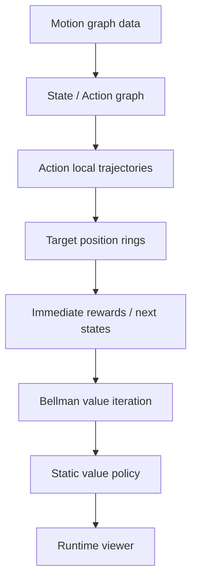

## 代码执行路径

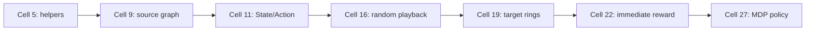

## 模块拆解

### 1. 从 Motion Graph 到决策状态

`State` 和 `Action` dataclass 把可播放片段整理成决策点和可执行动作。单出口链会被折叠，减少运行时策略需要考虑的节点数量。

### 2. Reward 查询空间

`target_positions` 把连续目标离散成角色周围的采样环。每个 state-action 都预计算 immediate reward 和 next state。

### 3. Value Function

immediate reward 只看当前动作，容易短视。Bellman 更新把未来 reward 叠回当前动作，形成更稳定的查表策略。

## 关键 cell / 函数深讲

### Cell 9 - Source motion graph playback

播放和预览由 Motion Graph 算法生成的离散动作片段，作为后续构建决策状态的基础数据源。


- 代码做什么：源 Motion Graph 播放：展示 avatar behavior 所使用的动作片段来源。
- 运行后看到什么：`timeline_viewer`
- 结果说明什么：viewer 展示 avatar behavior 所使用的动作片段来源。
- 可视化主体：Source motion graph playback
- 捕获方式：`canvas`

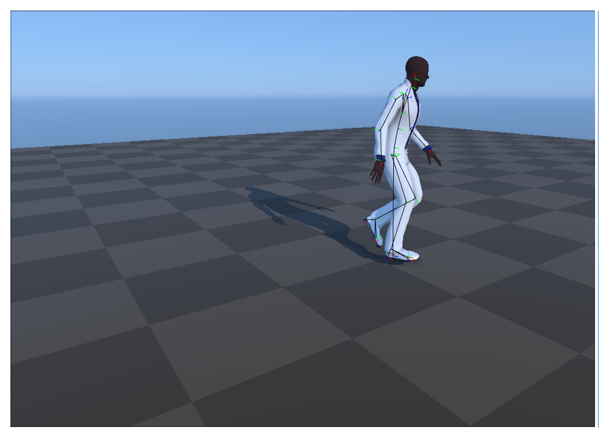

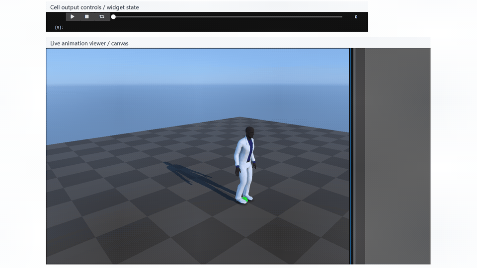


https://github.com/user-attachments/assets/85426882-4855-4eec-b894-42f8d0445259

<video controls muted loop playsinline preload="metadata" width="100%" poster="assets/02_source_motion_graph_playback_result.png" src="assets/02_source_motion_graph_playback_preview.mp4"></video>

### Cell 16 - Random graph action playback

使用提取出的 State 和 Action 拓扑图，通过随机选择下一步动作，验证图的连通性和片段间播放的连续性。

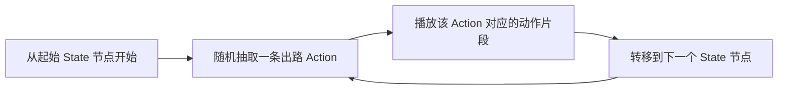

- 代码做什么：随机图动作播放：验证图动作能否生成连续动画输出。
- 运行后看到什么：`timeline_viewer`
- 结果说明什么：viewer 验证图动作能否生成连续动画输出。
- 可视化主体：Random graph action playback
- 捕获方式：`canvas`

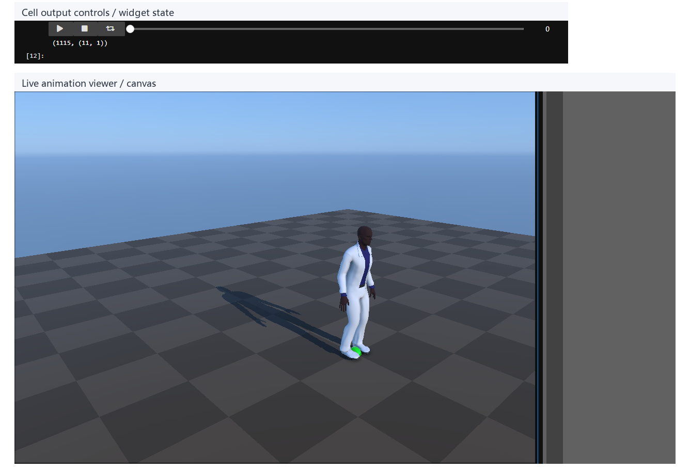

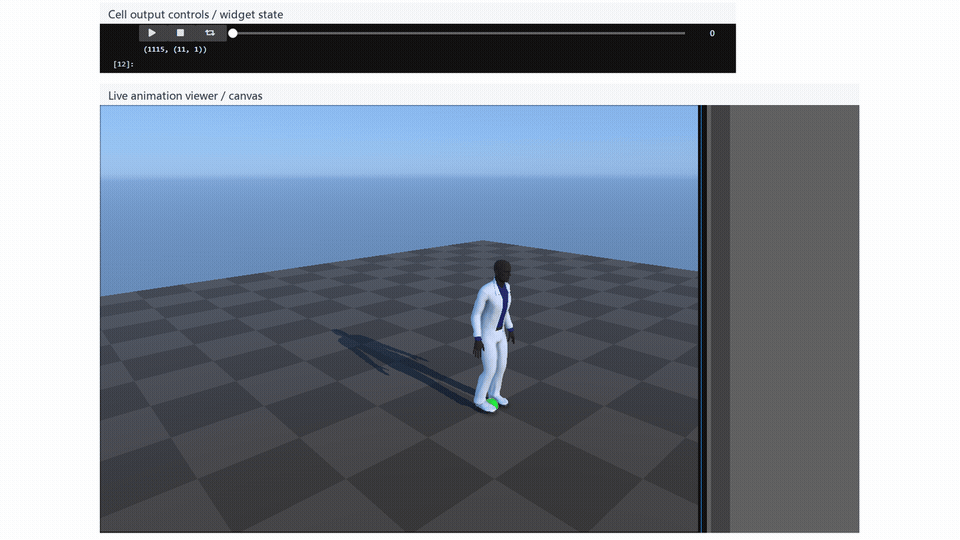


https://github.com/user-attachments/assets/cb9b9a98-336d-4890-8450-360a1391e6ae

<video controls muted loop playsinline preload="metadata" width="100%" poster="assets/04_random_action_playback_result.png" src="assets/04_random_action_playback_preview.mp4"></video>

### Cell 22 - Immediate reward policy viewer

不考虑长远未来，仅根据当前离目标采样点的距离立即给出最大奖励，生成短视（Myopic）的最优动作策略。


- 代码做什么：即时奖励策略 viewer：展示局部目标奖励如何选择图动作。
- 运行后看到什么：`timeline_viewer`
- 结果说明什么：viewer 展示局部目标奖励如何选择图动作。
- 可视化主体：Immediate reward policy viewer
- 捕获方式：`canvas`

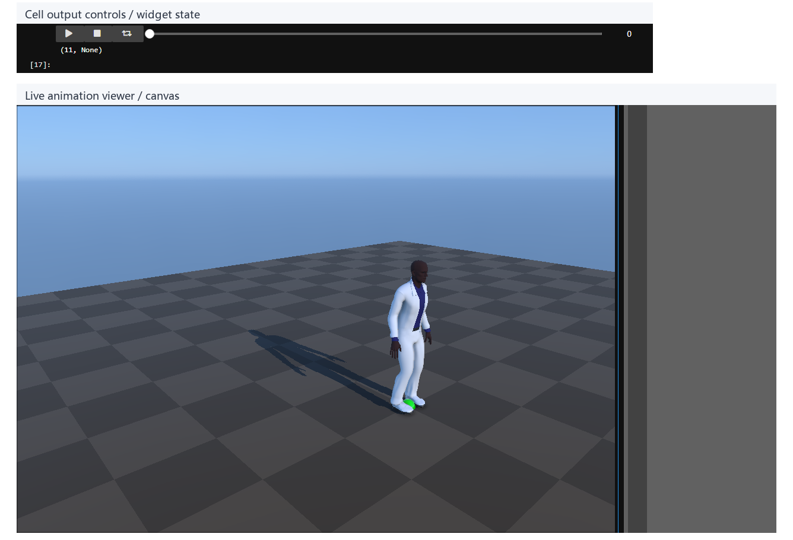

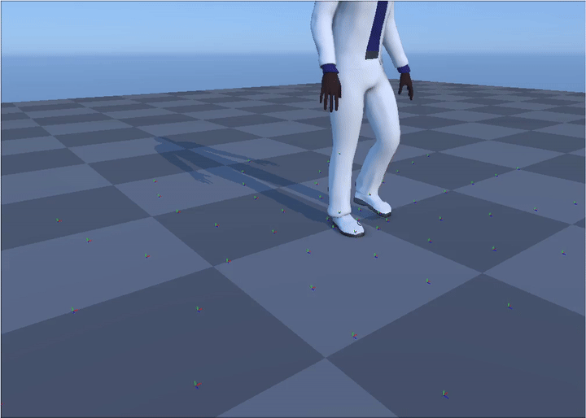


https://github.com/user-attachments/assets/9e34bd3e-5368-4303-a4d6-7df9792c3603

<video controls muted loop playsinline preload="metadata" width="100%" poster="assets/07_reward_policy_viewer_result.png" src="assets/07_reward_policy_viewer_preview.mp4"></video>

### Cell 27 - MDP value-policy viewer

通过 Bellman 方程预计算的价值函数（Value Function），在运行时只需查表即可做出具有长远预见性的动作决策。


- 代码做什么：MDP 价值策略 viewer：最终检查学到的价值函数能否驱动动作选择。
- 运行后看到什么：`timeline_viewer`
- 结果说明什么：最终 viewer 检查学到的价值函数能否驱动动作选择。
- 可视化主体：MDP value-policy viewer
- 捕获方式：`canvas`

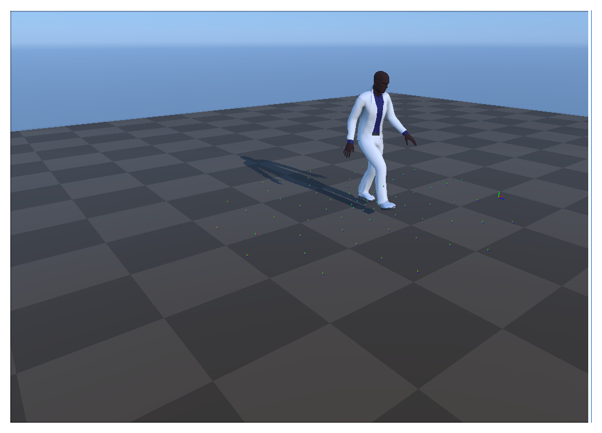

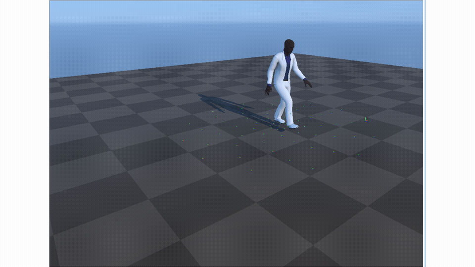


https://github.com/user-attachments/assets/475172d6-5ade-4363-a68c-79936b2630a3

<video controls muted loop playsinline preload="metadata" width="100%" poster="assets/08_mdp_value_policy_viewer_result.png" src="assets/08_mdp_value_policy_viewer_preview.mp4"></video>

## 关键数据结构

- `State`、`Action`、`states`：MDP 图结构。
- `foot_tags`、`AnimPlayer`、`FootLock`：播放和脚部稳定。
- `target_positions`：局部目标采样。
- `immediate_rewards`、`next_states`：预计算 Bellman 输入。
- `value_function`、`value_function_static`：最终查表策略。

## 执行结果的意义

source graph viewer 说明动作来源；random action viewer 验证播放连续；value-policy viewer 验证预计算策略能把当前目标和未来收益连接起来。

## 重点可视化 / 动画

本节只保留最能说明算法结果的图像和动画。代码学习卡移到文末证据表，供需要复现或追溯 cell 上下文时查看。


https://github.com/user-attachments/assets/85426882-4855-4eec-b894-42f8d0445259

<video controls muted loop playsinline preload="metadata" width="100%" poster="assets/02_source_motion_graph_playback_result.png">
  <source src="assets/02_source_motion_graph_playback_preview.mp4" type="video/mp4">
  <source src="assets/02_source_motion_graph_playback_preview.webm" type="video/webm">
</video>


**Cell 16 - Random graph action playback**

<video controls muted loop playsinline preload="metadata" width="100%" poster="assets/04_random_action_playback_result.png">
  <source src="assets/04_random_action_playback_preview.mp4" type="video/mp4">
  <source src="assets/04_random_action_playback_preview.webm" type="video/webm">
</video>

**Cell 22 - Immediate reward policy viewer**

<video controls muted loop playsinline preload="metadata" width="100%" poster="assets/07_reward_policy_viewer_result.png">
  <source src="assets/07_reward_policy_viewer_preview.mp4" type="video/mp4">
  <source src="assets/07_reward_policy_viewer_preview.webm" type="video/webm">
</video>

**Cell 27 - MDP value-policy viewer**

<video controls muted loop playsinline preload="metadata" width="100%" poster="assets/08_mdp_value_policy_viewer_result.png">
  <source src="assets/08_mdp_value_policy_viewer_preview.mp4" type="video/mp4">
  <source src="assets/08_mdp_value_policy_viewer_preview.webm" type="video/webm">
</video>

| Cell | 输出类型 | 阅读位置 | 可视化主体 | 捕获方式 | 结果媒体 |
| --- | --- | --- | --- | --- | --- |
| Cell 9 | `timeline_viewer` | 核心动画 | 源 Motion Graph 播放：展示 avatar behavior 所使用的动作片段来源。 | `canvas` | [结果 PNG](assets/02_source_motion_graph_playback_result.png) / [GIF](assets/02_source_motion_graph_playback_preview.gif) / [MP4](assets/02_source_motion_graph_playback_preview.mp4) / [WebM](assets/02_source_motion_graph_playback_preview.webm) |
| Cell 16 | `timeline_viewer` | 核心动画 | 随机图动作播放：验证图动作能否生成连续动画输出。 | `canvas` | [结果 PNG](assets/04_random_action_playback_result.png) / [GIF](assets/04_random_action_playback_preview.gif) / [MP4](assets/04_random_action_playback_preview.mp4) / [WebM](assets/04_random_action_playback_preview.webm) |
| Cell 22 | `timeline_viewer` | 核心动画 | 即时奖励策略 viewer：展示局部目标奖励如何选择图动作。 | `canvas` | [结果 PNG](assets/07_reward_policy_viewer_result.png) / [GIF](assets/07_reward_policy_viewer_preview.gif) / [MP4](assets/07_reward_policy_viewer_preview.mp4) / [WebM](assets/07_reward_policy_viewer_preview.webm) |
| Cell 27 | `timeline_viewer` | 核心动画 | MDP 价值策略 viewer：最终检查学到的价值函数能否驱动动作选择。 | `canvas` | [结果 PNG](assets/08_mdp_value_policy_viewer_result.png) / [GIF](assets/08_mdp_value_policy_viewer_preview.gif) / [MP4](assets/08_mdp_value_policy_viewer_preview.mp4) / [WebM](assets/08_mdp_value_policy_viewer_preview.webm) |


## 代码 Cell 与可视化证据

下面是附录式证据索引：结果 PNG 便于快速核对，代码卡用于追溯代码摘要与输出来源；带时间轴或参数滑杆的条目同时保留 GIF、MP4 和 WebM。

| Cell / 片段 | 结果说明 | 证据 |
| --- | --- | --- |
| Cell 5 | 日志标出后续用于锁脚和奖励计算的骨骼。 | [结果 PNG](assets/01_character_helper_indices_result.png) / [代码卡](assets/01_character_helper_indices.png) |
| Cell 9 | viewer 展示 avatar behavior 所使用的动作片段来源。 | [结果 PNG](assets/02_source_motion_graph_playback_result.png) / [GIF](assets/02_source_motion_graph_playback_preview.gif) / [MP4](assets/02_source_motion_graph_playback_preview.mp4) / [WebM](assets/02_source_motion_graph_playback_preview.webm) / [代码卡](assets/02_source_motion_graph_playback.png) |
| Cell 11 | 源码卡说明行为系统背后的离散 MDP 结构。 | [结果 PNG](assets/03_state_action_graph_result.png) / [代码卡](assets/03_state_action_graph.png) |
| Cell 16 | viewer 验证图动作能否生成连续动画输出。 | [结果 PNG](assets/04_random_action_playback_result.png) / [GIF](assets/04_random_action_playback_preview.gif) / [MP4](assets/04_random_action_playback_preview.mp4) / [WebM](assets/04_random_action_playback_preview.webm) / [代码卡](assets/04_random_action_playback.png) |
| Cell 18 | These numbers define the dimensionality of policy and value tables. | [结果 PNG](assets/05_action_count_table_result.png) / [代码卡](assets/05_action_count_table.png) |
| Cell 19 | 目标集合把连续目标转换成离散奖励查询。 | [结果 PNG](assets/06_target_position_rings_result.png) / [代码卡](assets/06_target_position_rings.png) |
| Cell 22 | viewer 展示局部目标奖励如何选择图动作。 | [结果 PNG](assets/07_reward_policy_viewer_result.png) / [GIF](assets/07_reward_policy_viewer_preview.gif) / [MP4](assets/07_reward_policy_viewer_preview.mp4) / [WebM](assets/07_reward_policy_viewer_preview.webm) / [代码卡](assets/07_reward_policy_viewer.png) |
| Cell 27 | 最终 viewer 检查学到的价值函数能否驱动动作选择。 | [结果 PNG](assets/08_mdp_value_policy_viewer_result.png) / [GIF](assets/08_mdp_value_policy_viewer_preview.gif) / [MP4](assets/08_mdp_value_policy_viewer_preview.mp4) / [WebM](assets/08_mdp_value_policy_viewer_preview.webm) / [代码卡](assets/08_mdp_value_policy_viewer.png) |


## 运行方式

AnimationPapers 案例优先使用：

```powershell
powershell -NoProfile -ExecutionPolicy Bypass -File .\tools\start_animationpapers_lab.ps1
```

单案例验证使用：

```powershell
powershell -NoProfile -ExecutionPolicy Bypass -File .\tools\run_case.ps1 precomputing_avatar_behavior
```
