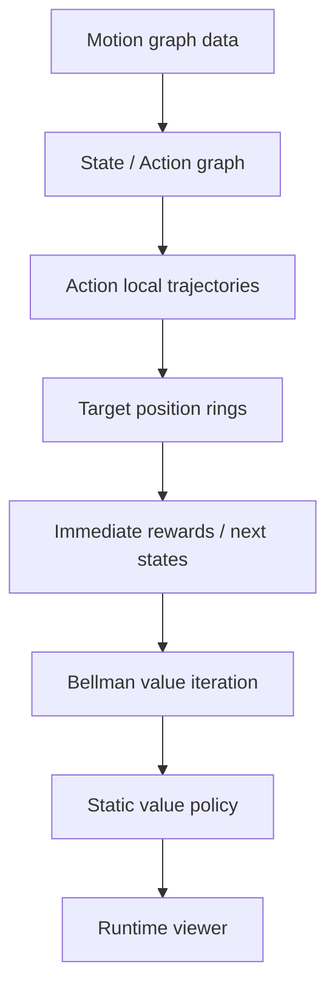
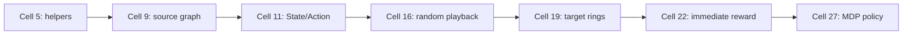
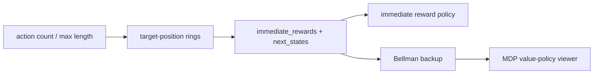

# Precomputing Avatar Behavior：把 Motion Graph 预计算成运行时策略

## 元数据

| 字段 | 内容 |
| --- | --- |
| slug | `precomputing_avatar_behavior` |
| source path | [`labs/AnimationPapers/Precomputing Avatar Behavior.ipynb`](../../../../labs/AnimationPapers/Precomputing Avatar Behavior.ipynb) |
| transcript sources | [`docs/transcripts/tv3ZwY1mvIw_Reinforcement Learning 01 _ Precomputing Avatar Behavior From Human Motion Data.txt`](../../../../docs/transcripts/tv3ZwY1mvIw_Reinforcement Learning 01 _ Precomputing Avatar Behavior From Human Motion Data.txt) |
| env prefix | `.envs/avatar_behavior` |
| kernel | `animationtech-precomputing_avatar_behavior` |
| validation status | `passed` (`manual_smoke`) |

## 问题背景

语音稿中的关键思想是：运行时不要在庞大的动作图上做昂贵搜索，而是把行为决策预计算成状态、动作、reward 和 value table。这个 notebook 从 motion graph 片段出发，构造离散 MDP，让 avatar 面对局部目标时可以通过查表选择动作。

## 阅读前置知识

- Motion Graph：动作片段、转移边和 loopable playback。
- MDP：state、action、reward、next state 和 Bellman backup。
- root motion 局部化：动作效果要在角色局部坐标中比较。
- FootLock：随机或策略动作播放时用于减少脚滑。

## 总模块图



## 代码执行路径



## 模块拆解

### 1. 从 Motion Graph 到决策状态

`State` 和 `Action` dataclass 把可播放片段整理成决策点和可执行动作。单出口链会被折叠，减少运行时策略需要考虑的节点数量。

### 2. Reward 查询空间

`target_positions` 把连续目标离散成角色周围的采样环。每个 state-action 都预计算 immediate reward 和 next state。

### 3. Value Function

immediate reward 只看当前动作，容易短视。Bellman 更新把未来 reward 叠回当前动作，形成更稳定的查表策略。

## 关键 cell / 函数深讲

### Cell 5-9 - Motion Graph 输入


source graph viewer 说明可选动作来自真实 motion graph。


[打开 MP4](assets/02_source_motion_graph_playback_preview.mp4) / [打开 WebM](assets/02_source_motion_graph_playback_preview.webm)

### Cell 11-16 - State/Action 与播放器


random action viewer 验证动作能连续播放，FootLock 负责减少脚部伪影。


[打开 MP4](assets/04_random_action_playback_preview.mp4) / [打开 WebM](assets/04_random_action_playback_preview.webm)

### Cell 18-27 - Reward 到 Value Policy



value-policy viewer 验证预计算策略能根据目标选择更有远见的动作。


[打开 MP4](assets/08_mdp_value_policy_viewer_preview.mp4) / [打开 WebM](assets/08_mdp_value_policy_viewer_preview.webm)

## 关键数据结构

- `State`、`Action`、`states`：MDP 图结构。
- `foot_tags`、`AnimPlayer`、`FootLock`：播放和脚部稳定。
- `target_positions`：局部目标采样。
- `immediate_rewards`、`next_states`：预计算 Bellman 输入。
- `value_function`、`value_function_static`：最终查表策略。

## 执行结果的意义

source graph viewer 说明动作来源；random action viewer 验证播放连续；value-policy viewer 验证预计算策略能把当前目标和未来收益连接起来。

## 重点可视化 / 动画

本节只放 `key_visual` 与 `key_animation` 的算法结果媒体。代码学习卡不作为正文主视觉；它们只在后续证据表中用于复现 cell 或源码上下文。

[打开/下载总览 WebM](assets/00-walkthrough.webm)


[打开 MP4](assets/02_source_motion_graph_playback_preview.mp4) / [打开 WebM](assets/02_source_motion_graph_playback_preview.webm)

| Cell | 输出类型 | 媒体角色 | 可视化主体 | 捕获方式 | 结果媒体 |
| --- | --- | --- | --- | --- | --- |
| Cell 9 | `timeline_viewer` | `key_animation` | Source motion graph playback: The viewer shows the action fragments from which avatar behavior is assembled. | `canvas` | [结果 PNG](assets/02_source_motion_graph_playback_result.png) / [GIF](assets/02_source_motion_graph_playback_preview.gif) / [MP4](assets/02_source_motion_graph_playback_preview.mp4) / [WebM](assets/02_source_motion_graph_playback_preview.webm) |
| Cell 16 | `timeline_viewer` | `key_animation` | Random graph action playback: The viewer validates that graph actions can produce continuous animated output. | `canvas` | [结果 PNG](assets/04_random_action_playback_result.png) / [GIF](assets/04_random_action_playback_preview.gif) / [MP4](assets/04_random_action_playback_preview.mp4) / [WebM](assets/04_random_action_playback_preview.webm) |
| Cell 22 | `timeline_viewer` | `key_animation` | Immediate reward policy viewer: The viewer shows how local target rewards can choose graph actions. | `canvas` | [结果 PNG](assets/07_reward_policy_viewer_result.png) / [GIF](assets/07_reward_policy_viewer_preview.gif) / [MP4](assets/07_reward_policy_viewer_preview.mp4) / [WebM](assets/07_reward_policy_viewer_preview.webm) |
| Cell 27 | `timeline_viewer` | `key_animation` | MDP value-policy viewer: The final viewer checks that the learned value function can drive action selection. | `canvas` | [结果 PNG](assets/08_mdp_value_policy_viewer_result.png) / [GIF](assets/08_mdp_value_policy_viewer_preview.gif) / [MP4](assets/08_mdp_value_policy_viewer_preview.mp4) / [WebM](assets/08_mdp_value_policy_viewer_preview.webm) |


## 代码 Cell 与可视化结果

本节保留每个 cell 的可复现证据。结果 PNG 用于正文阅读，代码卡记录代码摘要与输出来源；有 timeline 或参数滑杆的 cell 同时提供 GIF、MP4 和 WebM。

| Cell / 片段 | 结果说明 | 证据 |
| --- | --- | --- |
| Cell 5 | The log identifies the bones later used for foot locking and rewards. | [结果 PNG](assets/01_character_helper_indices_result.png) / [代码卡](assets/01_character_helper_indices.png) |
| Cell 9 | The viewer shows the action fragments from which avatar behavior is assembled. | [结果 PNG](assets/02_source_motion_graph_playback_result.png) / [GIF](assets/02_source_motion_graph_playback_preview.gif) / [MP4](assets/02_source_motion_graph_playback_preview.mp4) / [WebM](assets/02_source_motion_graph_playback_preview.webm) / [代码卡](assets/02_source_motion_graph_playback.png) |
| Cell 11 | The source card explains the discrete MDP structure behind the behavior system. | [结果 PNG](assets/03_state_action_graph_result.png) / [代码卡](assets/03_state_action_graph.png) |
| Cell 16 | The viewer validates that graph actions can produce continuous animated output. | [结果 PNG](assets/04_random_action_playback_result.png) / [GIF](assets/04_random_action_playback_preview.gif) / [MP4](assets/04_random_action_playback_preview.mp4) / [WebM](assets/04_random_action_playback_preview.webm) / [代码卡](assets/04_random_action_playback.png) |
| Cell 18 | These numbers define the dimensionality of policy and value tables. | [结果 PNG](assets/05_action_count_table_result.png) / [代码卡](assets/05_action_count_table.png) |
| Cell 19 | The target set converts continuous goals into discrete reward queries. | [结果 PNG](assets/06_target_position_rings_result.png) / [代码卡](assets/06_target_position_rings.png) |
| Cell 22 | The viewer shows how local target rewards can choose graph actions. | [结果 PNG](assets/07_reward_policy_viewer_result.png) / [GIF](assets/07_reward_policy_viewer_preview.gif) / [MP4](assets/07_reward_policy_viewer_preview.mp4) / [WebM](assets/07_reward_policy_viewer_preview.webm) / [代码卡](assets/07_reward_policy_viewer.png) |
| Cell 27 | The final viewer checks that the learned value function can drive action selection. | [结果 PNG](assets/08_mdp_value_policy_viewer_result.png) / [GIF](assets/08_mdp_value_policy_viewer_preview.gif) / [MP4](assets/08_mdp_value_policy_viewer_preview.mp4) / [WebM](assets/08_mdp_value_policy_viewer_preview.webm) / [代码卡](assets/08_mdp_value_policy_viewer.png) |


## 运行方式

AnimationPapers 案例优先使用：

```powershell
powershell -NoProfile -ExecutionPolicy Bypass -File .\tools\start_animationpapers_lab.ps1
```

单案例验证使用：

```powershell
powershell -NoProfile -ExecutionPolicy Bypass -File .\tools\run_case.ps1 precomputing_avatar_behavior
```
