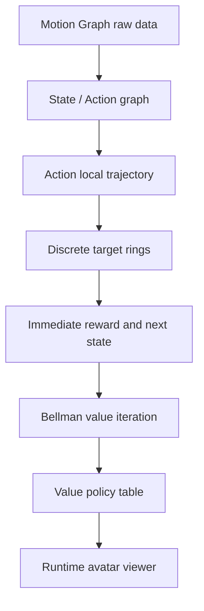
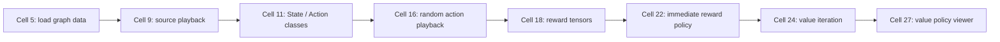
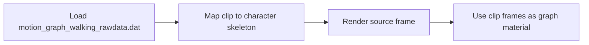
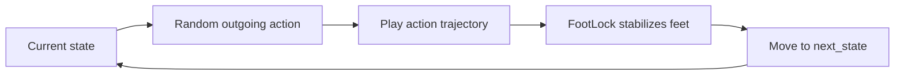
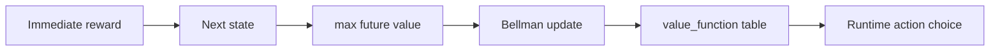

# Precomputing Avatar Behavior: 把 Motion Graph 预计算成运行时策略

## 元数据

| 字段 | 内容 |
| --- | --- |
| slug | `precomputing_avatar_behavior` |
| source path | [`labs/AnimationPapers/Precomputing Avatar Behavior.ipynb`](../../../../labs/AnimationPapers/Precomputing%20Avatar%20Behavior.ipynb) |
| transcript sources | [`docs/transcripts/tv3ZwY1mvIw_Reinforcement Learning 01 _ Precomputing Avatar Behavior From Human Motion Data.txt`](../../../../docs/transcripts/tv3ZwY1mvIw_Reinforcement%20Learning%2001%20_%20Precomputing%20Avatar%20Behavior%20From%20Human%20Motion%20Data.txt) |
| env prefix | `.envs/avatar_behavior` |
| kernel | `animationtech-precomputing_avatar_behavior` |
| validation status | `passed` |

## 问题背景

这篇 notebook 对应 Lee 与 Lee 的 *Precomputing Avatar Behavior From Human Motion Data*。语音稿里最重要的动机是：运行时不要在庞大的 Motion Graph 上临时搜索，而是把“面对某个局部目标时该选哪段动作”提前算成表。运行时的 avatar 只需要知道当前 graph state 和目标方向，就可以查表选择 action。

它和普通 Motion Graph 的区别在于，Motion Graph 只回答“哪些片段可以接到一起”；这里进一步把 state、action、reward、next state 和 value function 都离线算好，让角色在游戏循环里用很便宜的查询做决策。

## 阅读前置知识

- Motion Graph: 动作片段、转移边、局部拼接和循环播放。
- MDP: `state`、`action`、`reward`、`next_state` 与 Bellman backup。
- Root motion 局部化: 动作位移要放到角色局部坐标里比较，才能和目标方向对齐。
- Foot lock: 随机或策略驱动播放时，用脚部约束减少脚滑。

## 总模块图



## 模块拆解

这篇案例可以读成三层：底层是 Motion Graph 片段和转移边，中层是把片段包装成 MDP 的 state/action/reward/next-state 表，顶层是运行时 viewer 按 value policy 查表播放。后面的四段动画正好对应这条链路里的四个检查点。

## 代码执行路径



## 关键 cell / 函数深讲

### Cell 9 - Source motion graph playback

这一步先确认输入动作不是抽象矩阵，而是一组真实的人体运动片段。新版录制只截取 viewer canvas，并把镜头拉近到角色，使读者能看到脚步、骨架辅助线和原始片段的步态变化。



看这段时，重点是“动作素材从哪里来”：后面的 state/action 都会从这些片段里切出来。


https://github.com/user-attachments/assets/85426882-4855-4eec-b894-42f8d0445259

<video controls muted loop playsinline preload="metadata" width="100%" poster="assets/02_source_motion_graph_playback_result.png" src="assets/02_source_motion_graph_playback_preview.mp4"></video>

### Cell 16 - Random graph action playback

`State` 保存当前可选的 `Action`，`Action` 保存一段动作的起止帧、是否需要 blend，以及结束后跳到哪个 state。随机播放不是最终策略，但它是一个很好的连通性测试：如果随机 action 都能连续播，说明 graph 拓扑和 foot lock 至少能支持运行时拼接。



新版录制固定随机种子，并连续推进多个 action。看这段时，重点是动作片段之间是否能连续接上，而不是单帧姿态。


https://github.com/user-attachments/assets/cb9b9a98-336d-4890-8450-360a1391e6ae

<video controls muted loop playsinline preload="metadata" width="100%" poster="assets/04_random_action_playback_result.png" src="assets/04_random_action_playback_preview.mp4"></video>

### Cell 18 / 22 - Immediate reward policy

`target_positions` 把连续目标离散成角色周围的采样环。对每个 `(state, target, action)`，代码预计算两个量：当前 action 能带来多高的 immediate reward，以及 action 播完后目标会落到哪个离散 target state。

```mermaid
flowchart TD
    A[State i] --> B[Outgoing action a]
    C[Target sample j] --> D[Compare action trajectory to target]
    B --> D
    D --> E[immediate_rewards[i,j,a]]
    D --> F[next_states[i,j,a]]
```

Immediate reward 只看眼前哪段动作最接近目标，因此它很直观，也很短视。新版录制给 viewer 一个非零目标输入，画面里可以看到目标点、采样环和当前被选中的局部轨迹。


https://github.com/user-attachments/assets/9e34bd3e-5368-4303-a4d6-7df9792c3603

<video controls muted loop playsinline preload="metadata" width="100%" poster="assets/07_reward_policy_viewer_result.png" src="assets/07_reward_policy_viewer_preview.mp4"></video>

### Cell 24 / 27 - MDP value-policy viewer

Value iteration 把未来收益折回当前 state。这样运行时选择 action 时，不只是问“这一步离目标近不近”，而是问“这一步之后，后续动作是否还能继续把角色带向目标”。



看这段时，重点是角色每次到达 action 边界后，会用预计算的 value table 重新选下一段动作。青色目标点和采样环说明目标查询仍然存在，但决策依据已经从短视 reward 升级为长期 value。


https://github.com/user-attachments/assets/475172d6-5ade-4363-a68c-79936b2630a3

<video controls muted loop playsinline preload="metadata" width="100%" poster="assets/08_mdp_value_policy_viewer_result.png" src="assets/08_mdp_value_policy_viewer_preview.mp4"></video>

## 关键数据结构

| 名称 | 作用 |
| --- | --- |
| `State` | 保存 graph 节点对应的帧和可执行 action 列表。 |
| `Action` | 保存动作起止帧、blend 标记、局部轨迹和 `next_state_id`。 |
| `target_positions` | 角色局部坐标下的离散目标采样点。 |
| `immediate_rewards` | 每个 state-target-action 的短期奖励表。 |
| `next_states` | 每个 action 执行后落到的下一个离散状态。 |
| `value_function` | Bellman 迭代后的长期价值表。 |
| `AnimPlayer` / `FootLock` | 把离散 action 播放回连续角色动画，并稳定脚部接触。 |

## 执行结果的意义

这篇案例的结果不是“角色能走路”这么简单。它展示的是一条完整的离线到在线链路：Motion Graph 给出可拼接素材，MDP 把目标追踪问题离散成查表问题，value function 把未来收益编码进当前 action 选择。运行时 viewer 只是最终读表结果的可视化。

新版媒体的验收标准也更严格：正文动画必须来自真实 viewer canvas；不能用滚动代码录屏、整页截图、cell 截图、代码卡裁剪图，不能把静态图平移缩放成假动画。

## 代码 Cell 与可视化结果

本节只作为复现索引。正文主视觉已经在上面按算法步骤展开；这里保留每个 cell 的结果图、视频文件和代码卡，方便回到 notebook 对照。

| Cell / 片段 | 结果说明 | 复现证据 |
| --- | --- | --- |
| Cell 5 | 骨骼和 foot-lock 相关索引加载完成。 | [结果 PNG](assets/01_character_helper_indices_result.png) / [代码卡](assets/01_character_helper_indices.png) |
| Cell 9 | 原始 Motion Graph 片段可以被角色 viewer 播放。 | [结果 PNG](assets/02_source_motion_graph_playback_result.png) / [GIF](assets/02_source_motion_graph_playback_preview.gif) / [MP4](assets/02_source_motion_graph_playback_preview.mp4) / [WebM](assets/02_source_motion_graph_playback_preview.webm) / [代码卡](assets/02_source_motion_graph_playback.png) |
| Cell 11 | `State` / `Action` 结构定义了离散决策图。 | [结果 PNG](assets/03_state_action_graph_result.png) / [代码卡](assets/03_state_action_graph.png) |
| Cell 16 | 随机 action 播放验证了 graph action 的连续性。 | [结果 PNG](assets/04_random_action_playback_result.png) / [GIF](assets/04_random_action_playback_preview.gif) / [MP4](assets/04_random_action_playback_preview.mp4) / [WebM](assets/04_random_action_playback_preview.webm) / [代码卡](assets/04_random_action_playback.png) |
| Cell 18 | action 数量和最大长度决定 reward/value 表维度。 | [结果 PNG](assets/05_action_count_table_result.png) / [代码卡](assets/05_action_count_table.png) |
| Cell 19 | 离散目标环把连续目标变成表查询。 | [结果 PNG](assets/06_target_position_rings_result.png) / [代码卡](assets/06_target_position_rings.png) |
| Cell 22 | immediate reward 策略展示短视 action 选择。 | [结果 PNG](assets/07_reward_policy_viewer_result.png) / [GIF](assets/07_reward_policy_viewer_preview.gif) / [MP4](assets/07_reward_policy_viewer_preview.mp4) / [WebM](assets/07_reward_policy_viewer_preview.webm) / [代码卡](assets/07_reward_policy_viewer.png) |
| Cell 27 | value policy 展示长期收益驱动的运行时 action 选择。 | [结果 PNG](assets/08_mdp_value_policy_viewer_result.png) / [GIF](assets/08_mdp_value_policy_viewer_preview.gif) / [MP4](assets/08_mdp_value_policy_viewer_preview.mp4) / [WebM](assets/08_mdp_value_policy_viewer_preview.webm) / [代码卡](assets/08_mdp_value_policy_viewer.png) |

## 运行方式

AnimationPapers 案例优先使用：

```powershell
powershell -NoProfile -ExecutionPolicy Bypass -File .\tools\start_animationpapers_lab.ps1
```

单案例验证使用：

```powershell
powershell -NoProfile -ExecutionPolicy Bypass -File .\tools\run_case.ps1 precomputing_avatar_behavior
```
