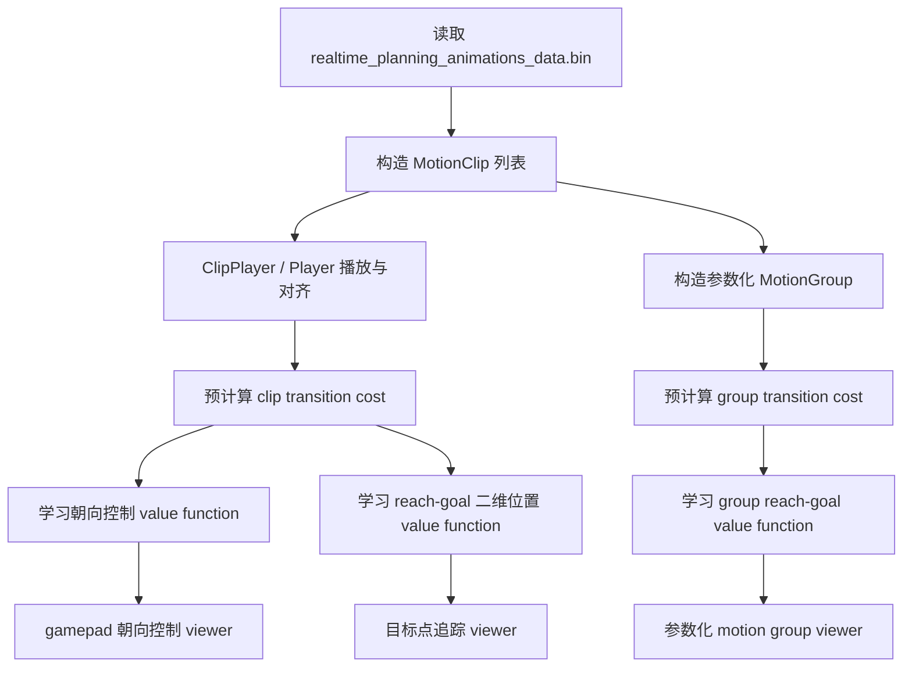
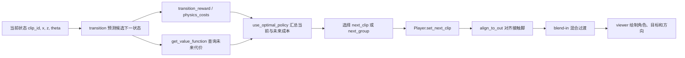
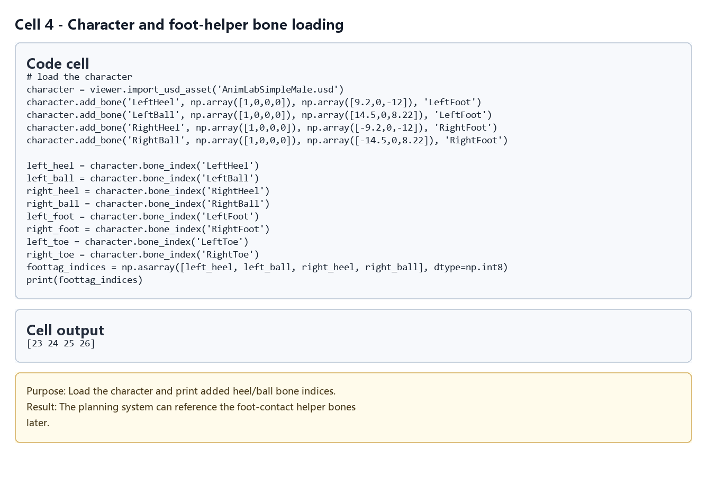
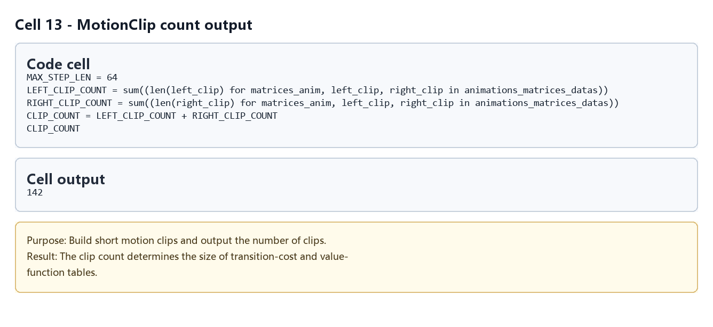
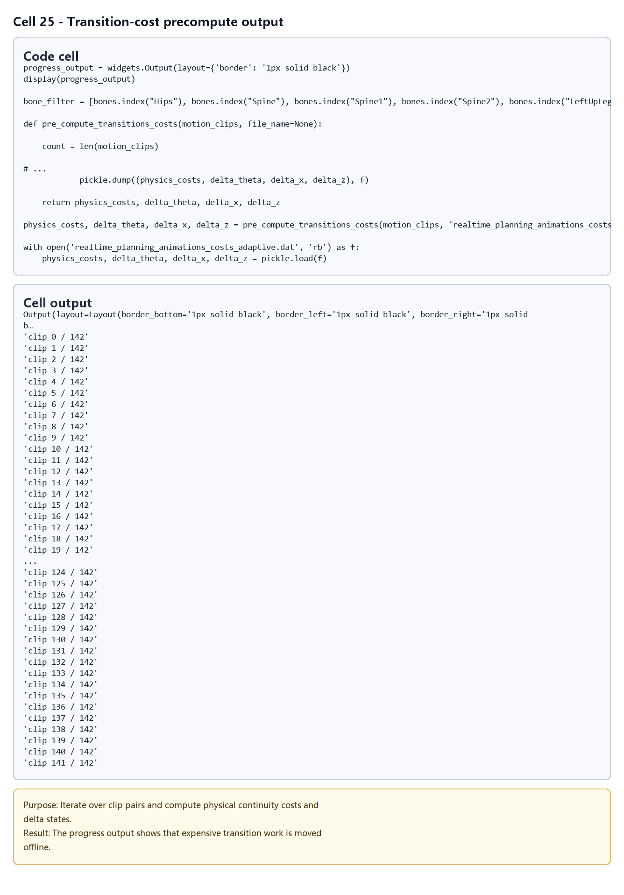
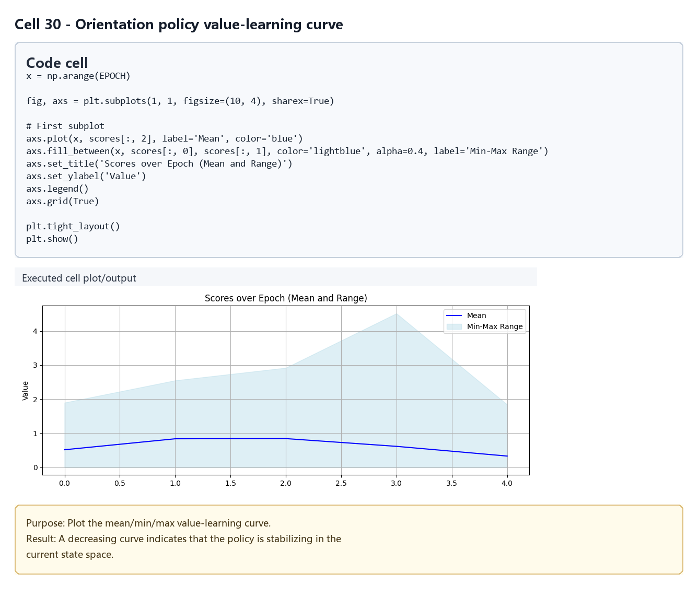
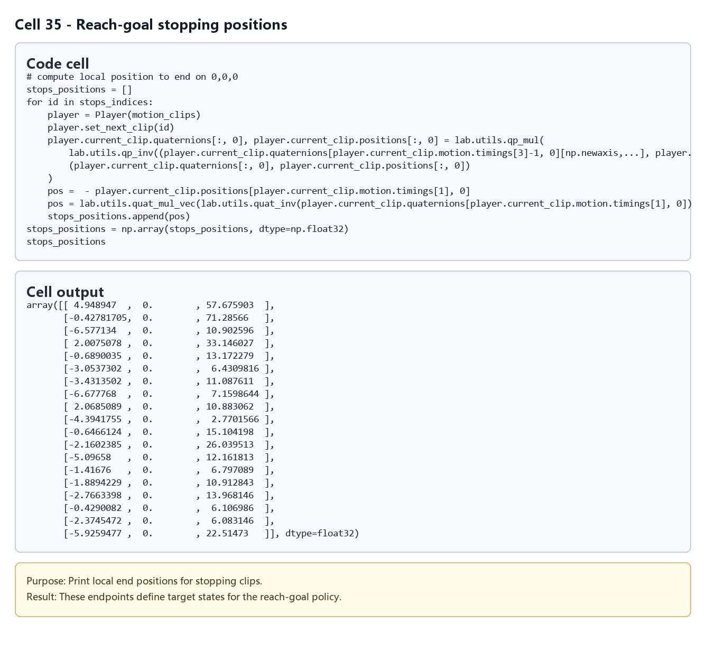
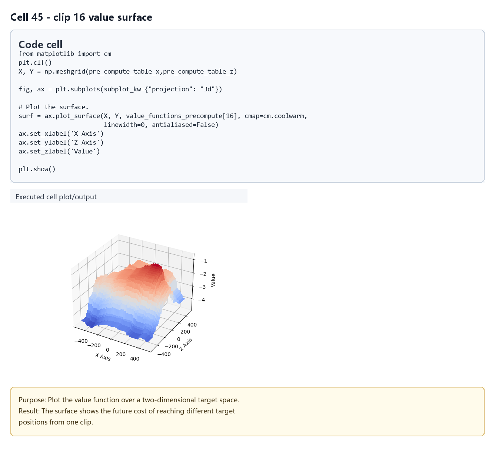
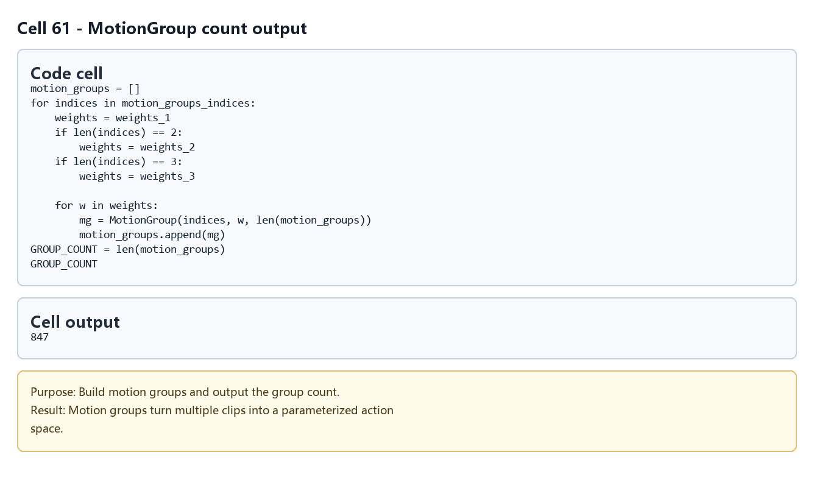
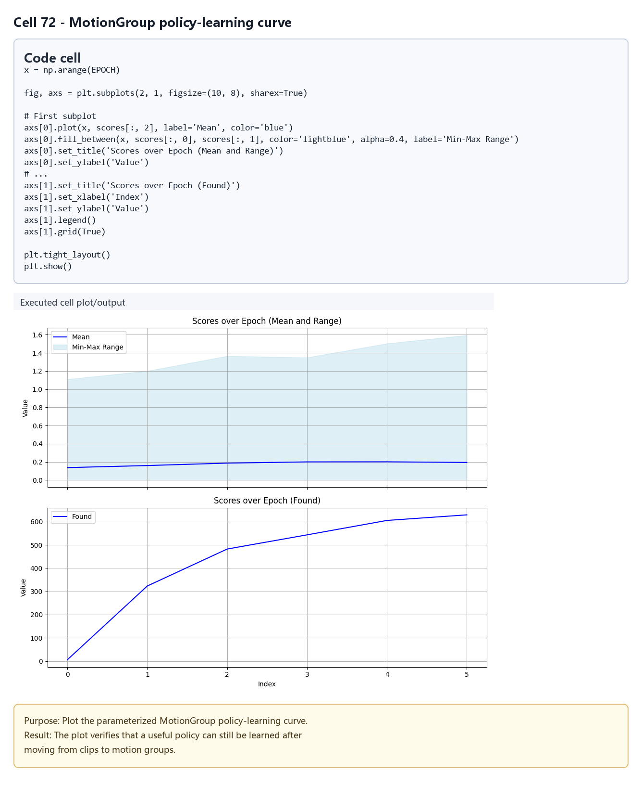

# Real-Time Planning for Parameterized Human Motion

## 元数据

| 字段 | 内容 |
| --- | --- |
| slug | `real_time_planning_for_parameterized_human_motion` |
| source path | [`labs/AnimationPapers/Real-Time Planning for Parameterized Human Motion.ipynb`](../../../../labs/AnimationPapers/Real-Time%20Planning%20for%20Parameterized%20Human%20Motion.ipynb) |
| env prefix | `.envs/rt_param_human` |
| kernel | `animationtech-real_time_planning_for_parameterized_human_motion` |
| validation status | `passed`, `manual_smoke`; 自动执行已通过，交互 viewer 仍建议在 JupyterLab 里人工检查 |

## 问题背景

这篇 notebook 讲的是一个经典实时角色规划问题：角色不是简单播放一段固定动画，而是在每个可切换时刻，根据当前动作片段、目标方向或目标位置，快速选择下一段动作。它把昂贵的搜索和价值评估提前离线算好，运行时只做表查询、代价比较和短窗口切换，因此可以在 viewer 中实时响应控制输入。

本案例比 Near-optimal continuous control 更进一步：Near-optimal 主要在固定 motion clip 集合上学习“下一步怎么走”；这里额外引入参数化动作和 MotionGroup，把多个相近动作按权重混合成可插值的运动族。这样规划器不只是在离散片段之间跳转，还可以在“转身、行走、停止”等语义组内选择不同参数版本，让动作空间更连续，目标追踪也更细腻。

## 阅读前置知识

读这篇时最好先具备四块背景：

- **骨骼动画基础**：知道根骨骼 root、关节 quaternion、局部/世界坐标、forward direction 和 foot contact 的含义。
- **motion clip / motion graph**：理解把长动画切成短片段，并在片段边界做对齐、混合和切换。
- **动态规划与价值函数**：知道即时代价、未来折扣 `ALPHA`、Bellman 更新，以及为什么可以用 value function 近似未来成本。
- **简单机器学习回归**：理解 `ExtraTreesRegressor` 被用来把离散采样到的价值，推广到连续方向或二维目标位置上。

## 代码执行路径

Notebook 的主线可以按“离线预计算 -> 策略学习 -> 在线播放”来读。



更细的运行链路如下：



## 模块拆解

### 1. 数据加载与 viewer 初始化

开头导入 `numpy`、`pickle`、`ipyanimlab`、`ipywidgets`、`ExtraTreesRegressor` 等依赖，并创建 `lab.Viewer(move_speed=5, width=1280, height=720)`。随后导入 `AnimLabSimpleMale.usd` 角色、方向箭头 `displacement.usd` 和目标点 asset。

核心数据来自 `realtime_planning_animations_data.bin`，包含 `animations_matrices_datas` 和 `anim_bones`。前者是预处理好的动画矩阵数据，后者描述骨骼拓扑。最早的 `render(frame, index=0)` 只是做源动画检查：滑动 `index` 可以确认不同原始动画是否正常播放、脚部是否贴地、朝向是否合理。

### 2. MotionClip：把长动画切成规划状态

`compute_root(q, p)` 会从骨骼姿态中整理根节点运动，把角色的水平位移和朝向变成后续可比较的形式。`compute_clip(quats, pos, ranges)` 根据左右脚步态区间截取固定长度片段，并把片段放到统一坐标系里。`compute_constraint_qp(gpos, frame, foot_id, toe_id)` 提取脚跟和脚尖在接触帧的朝向、位置，用作片段对齐和合法转移的约束。

`MotionClip` 是基础状态单元。它把一个 clip 的姿态、位置、timing、接触约束、来源动画 id 和左右脚信息封装起来。后面的转移矩阵、value function、viewer 播放都以 `MotionClip._id` 作为索引，因此它相当于规划图里的节点。

### 3. ClipPlayer / Player：在线播放与局部切换

`ClipPlayer` 管单个片段的帧推进、局部坐标到世界坐标的累积，以及新旧片段之间的对齐。`align_to_out(out_clip)` 是关键：当要从旧片段切到新片段时，它用出脚/入脚的接触约束，把新片段旋转和平移到旧片段末端附近，避免脚步突然跳走。

`Player` 管当前片段和下一片段。`set_next_clip(clip_id)` 只记录下一步选择；真正播放时，`tick()` 会在片段到达可切换区域后完成切换，并在短窗口里做 blend-in。这个设计就是“局部规划”的运行时外壳：策略只负责选下一段，播放器负责让切换看起来连续。

### 4. Transition cost：把“能不能接”量化

`pre_compute_transitions_costs(motion_clips, file_name=None)` 遍历所有片段对，模拟从一个片段切到另一个片段时的混合窗口，计算骨骼速度不连续、姿态跳变和脚接触不匹配带来的物理代价。输出包括：

- `physics_costs`：候选转移的平滑性代价，越小表示越自然。
- `delta_theta`：执行该转移后角色朝向的增量。
- `delta_x` / `delta_z`：执行该转移后局部平面位移的增量。

同脚到同脚、接触侧不匹配或明显非法的转移会被置为很高代价。Notebook 默认读取 `realtime_planning_animations_costs.dat`，避免每次都重新计算完整转移表。

### 5. 朝向控制策略

第一套策略只关心目标朝向误差 `theta`。`pre_compute_table = np.linspace(-np.pi, np.pi, 300)` 把连续角度离散成查询表。核心函数链是：

- `transition(clip_id, x, z, theta, next_clip_id)`：根据候选下一片段，预测新的局部位置和朝向误差。
- `transition_reward(clip_id, next_clip_id)`：读取 `physics_costs`，惩罚不平滑的转移。
- `state_reward(clip_id, theta)`：惩罚当前朝向误差，让角色倾向于朝目标方向行走。
- `get_value_function(value_functions, clip_id, theta_prime)`：查询未来价值。
- `use_optimal_policy(value_functions, alpha, state_clip, state_theta)`：对所有候选下一片段计算“当前代价 + 折扣未来代价”，选择最小者。

`train_optimal_policy()` 反复采样状态、执行 Bellman 更新，再用 `ExtraTreesRegressor(n_estimators=50, n_jobs=-1)` 拟合每个 clip 的一维价值函数。训练结果写入 `realtime_planning_orientation_value_functions.dat`。后面的 gamepad viewer 会读取 `widgets.Controller(index=0)` 的摇杆方向，把摇杆角度转换成 `theta`，再用 `use_optimal_policy` 选择下一步。

### 6. Reach-goal 策略：从朝向误差扩展到二维目标

第二套策略把状态从一维 `theta` 换成目标在角色局部坐标中的 `(x, z)`。`pre_compute_table_x` 和 `pre_compute_table_z` 都覆盖 `[-1000, 1000]`，形成二维价值表。

这里的重点是滚动更新。`transition(clip_id, x, z, next_clip_id)` 预测下一步后目标相对角色的新位置；`transition_inv(previous_clip_id, clip_id, x, z)` 反向推回上一步状态；`rollback_trajectories(...)` 和 `_rollback_all(...)` 从有奖励或有代表性的状态向前回滚，生成更有效的训练样本。这样训练不是盲目铺满整个二维平面，而是围绕真实可到达轨迹更新。

训练阶段用 `Pool().starmap(mpf.reach_train_value_function, args)` 把每个 clip 的二维表拟合拆给 multiprocessing worker。结果缓存在 `realtime_planning_reach_position_value_functions.dat`。viewer 中的目标点 asset 表示用户希望角色到达的位置；角色每到一个切换窗口，就重新用当前目标相对坐标查询策略，这就是“搜索/滚动更新”的实时版本。

### 7. MotionGroup：参数化动作的核心

`MotionGroup(indices, weights, id)` 把多个语义相近的 `MotionClip` 按权重混合成一个新的参数化片段。它不是简单平均坐标，而是对 quaternion 姿态、位置、接触约束和 timing 做一致组合，使输出仍能走原来的 `Player`、transition cost 和 value function 管线。

Notebook 后半段用 `motion_groups_indices` 把动作按 `rotate`、`turn`、`walk`、`stop` 等语义分组，再为每组生成多组权重版本。可以把它理解成：基础 clip 是离散样本，MotionGroup 是在这些样本之间插值出来的连续动作空间。这样规划器可以选择“更偏左转一点”“更像停步一点”的动作，而不是只能从有限 clip 中硬切。

### 8. Group cost 与 group value function

参数化动作生成后，Notebook 重新对 `motion_groups` 运行 `pre_compute_transitions_costs`，读取或生成 `realtime_planning_animations_group_costs.dat`。随后复用 reach-goal 的训练思路，学习 group 级二维目标价值函数，并缓存为 `realtime_planning_reach_position_group_value_functions.dat`。

group 版 `use_optimal_policy` 还会把 group id 映射回 value function 使用的索引集合，并对 transition reward 做权重调整。最终效果是：运行时仍然是“查表选下一步”，但下一步可以是参数化混合动作。

## 关键 cell / 函数深讲

### `render(frame, index=0)`：源数据体检

这个 cell 用来确认 `animations_matrices_datas[index][frame]` 能被角色正确绘制。读输出时看三件事：角色是否站在地面附近、骨架轴是否跟随身体、脚步是否出现明显穿插。这里异常通常说明源数据或骨骼映射有问题，不应直接进入规划阶段。

### `compute_clip` 与 `compute_constraint_qp`：把动作变成可拼接单元

`compute_clip` 负责统一片段长度和局部坐标，解决“不同原始动画长度不同、朝向不同”的问题。`compute_constraint_qp` 负责记录入脚和出脚的接触姿态，解决“新片段应该贴到旧片段哪里”的问题。两者合起来，把动画片段从播放资源变成可搜索状态。

### `pre_compute_transitions_costs`：离线搜索图

这个函数可以视为构建 motion graph 的加权边。每对片段都有一个候选边，边权来自物理连续性；同时记录执行该边之后的朝向和位移增量。后续策略学习不用再打开原始姿态逐帧比较，只需要读 `physics_costs` 和 `delta_*` 表。

### `use_optimal_policy`：运行时决策入口

不论是一维朝向控制还是二维目标到达，运行时入口都类似：枚举所有候选下一片段，先用 `transition` 预测下一状态，再加上 `transition_reward` 和未来 `get_value_function`，最后取代价最小的候选。这个函数就是实时规划器的核心循环。

### `train_optimal_policy`：把未来代价压进表里

训练函数不断生成样本、评估当前策略、拟合回归模型，并把模型预测结果写回预计算表。它的目标不是得到一个神经网络控制器，而是得到一张运行时可快速查询的 value table。`scores` 和 residual 相关输出可以用来判断价值函数是否收敛、哪些区域仍然估计不稳。

### `rollback_trajectories`：面向目标的样本扩展

二维目标空间太大，直接均匀采样会浪费很多点。rollback 从目标附近或已知轨迹状态反向推导可达状态，把训练样本集中到角色真实可能走过的区域。它让 reach-goal 策略更像局部滚动搜索：每一步只看下一段，但价值表已经编码了通向目标的多步路径。

### `MotionGroup.__init__`：参数化动作合成

这个构造函数把一组 clip 和一组权重变成新的 motion object。它保留 `_id`、姿态、位置、timing、约束等接口，因此 `Player` 和 transition cost 不需要知道自己面对的是原始 clip 还是混合 group。这是本 notebook 相比 Near-optimal 更有扩展性的地方。

## 关键数据结构

- `animations_matrices_datas`：原始参数化动画矩阵数据，按动画和帧组织。
- `anim_bones`：骨骼层级和名字信息，用于角色导入和姿态解释。
- `MotionClip`：基础规划节点，包含 `quaternions`、`positions`、`timings`、`constraints_q`、`constraints_p`、来源 id 和脚侧信息。
- `motion_clips`：所有基础 clip 的列表，是 transition cost 和基础策略学习的状态集合。
- `physics_costs`：片段对之间的转移代价矩阵。
- `delta_theta` / `delta_x` / `delta_z`：候选转移产生的朝向和局部位移增量。
- `pre_compute_table`：朝向策略的一维采样网格。
- `pre_compute_table_x` / `pre_compute_table_z`：reach-goal 策略的二维采样网格。
- `value_functions_precompute`：预计算价值表；朝向策略是 `[clip, theta]`，目标位置策略是 `[clip, z, x]`。
- `stops_indices`：可以作为到达目标后终止动作的停止片段索引。
- `MotionGroup` / `motion_groups`：参数化混合动作集合，接口尽量对齐 `MotionClip`。
- `GROUP_VALUE_COUNT`：group 级 value function 的有效索引数量。

## Viewer 输出怎么读

本 notebook 有多段 viewer，各自承担不同检查任务：

- **源动画 viewer**：看原始动画是否能正常播放。这里主要检查骨骼、地面和帧索引。
- **MotionClip viewer**：滑动 `clip_id` 看标准化片段。目标小轴显示接触约束，红/绿骨架线可帮助判断入脚、出脚和混合前后的差异。
- **Player viewer**：观察片段连续播放。若切换处身体突然瞬移或脚大幅滑动，通常说明 transition cost、contact alignment 或 blend window 有问题。
- **朝向控制 viewer**：摇杆或方向箭头表示期望方向。角色不应立刻硬转，而应通过连续步态逐渐降低 `theta`。
- **Reach-goal viewer**：目标点是局部规划的吸引点。角色应该在每个切换窗口重新选择下一步，逐步靠近目标；接近目标后可能转入 stop clip。
- **MotionGroup viewer**：权重滑杆改变混合动作。读这里时重点看插值是否平滑、脚接触是否仍可信。
- **Group reach-goal viewer**：最终综合输出。它展示参数化动作加局部规划能否在更密的动作空间里追踪目标。

## 执行结果的意义

成功运行后，你得到的不是单段动画结果，而是一套实时规划框架：

1. 离线阶段把“哪些动作可以接、接了会往哪走、未来还要付出多少代价”压缩进 `.dat` 缓存。
2. 在线阶段只需要根据当前 clip 和目标状态查表，快速选出下一段动作。
3. 参数化 MotionGroup 扩大了动作空间，让规划器能在离散片段之间做更细粒度选择。
4. viewer 输出把价值函数是否有用转化成可观察行为：是否转向自然、是否接近目标、是否停得住、脚步是否稳定。

因此，这个案例适合用来理解“实时”二字的工程含义：实时不是每帧从头规划全局最优路径，而是把复杂搜索提前做成可查询结构，再在运行时滚动更新局部决策。

## 代码 Cell 与可视化结果

本节按 notebook 的关键 code cell 组织学习素材：每个条目都对应代码目的、实际输出类型、结果意义和 PNG 学习卡片。PNG 由指定 cell 的代码摘要、输出区、viewer/canvas 或图表/日志合成，不使用整页滚动截图替代。

<video controls muted src="assets/00-walkthrough.webm"></video>

[下载 WebM](assets/00-walkthrough.webm)

| Cell | 输出类型 | 代码做什么 | 结果说明什么 | 素材 |
| --- | --- | --- | --- | --- |
| 4 | `log` | Load the character and print added heel/ball bone indices. | The planning system can reference the foot-contact helper bones later. | [PNG](assets/01_source_animation_viewer.png) |
| 13 | `table` | Build short motion clips and output the number of clips. | The clip count determines the size of transition-cost and value-function tables. | [PNG](assets/02_motion_clip_contact_axes.png) |
| 25 | `log` | Iterate over clip pairs and compute physical continuity costs and delta states. | The progress output shows that expensive transition work is moved offline. | [PNG](assets/03_player_transition_blend.png) |
| 30 | `plot` | Plot the mean/min/max value-learning curve. | A decreasing curve indicates that the policy is stabilizing in the current state space. | [PNG](assets/04_orientation_policy_controller.png) |
| 35 | `table` | Print local end positions for stopping clips. | These endpoints define target states for the reach-goal policy. | [PNG](assets/05_reach_goal_target_tracking.png) |
| 45 | `plot` | Plot the value function over a two-dimensional target space. | The surface shows the future cost of reaching different target positions from one clip. | [PNG](assets/06_value_surface_clip16.png) |
| 61 | `table` | Build motion groups and output the group count. | Motion groups turn multiple clips into a parameterized action space. | [PNG](assets/07_motion_group_weight_blend.png) |
| 72 | `plot` | Plot the parameterized MotionGroup policy-learning curve. | The plot verifies that a useful policy can still be learned after moving from clips to motion groups. | [PNG](assets/08_group_reach_goal_result.png) |

### Cell 4 - Character and foot-helper bone loading

- 代码做什么：Load the character and print added heel/ball bone indices.
- 运行后看到什么：运行日志或文本输出。
- 结果说明什么：The planning system can reference the foot-contact helper bones later.



### Cell 13 - MotionClip count output

- 代码做什么：Build short motion clips and output the number of clips.
- 运行后看到什么：表格或结构化数据输出。
- 结果说明什么：The clip count determines the size of transition-cost and value-function tables.



### Cell 25 - Transition-cost precompute output

- 代码做什么：Iterate over clip pairs and compute physical continuity costs and delta states.
- 运行后看到什么：运行日志或文本输出。
- 结果说明什么：The progress output shows that expensive transition work is moved offline.



### Cell 30 - Orientation policy value-learning curve

- 代码做什么：Plot the mean/min/max value-learning curve.
- 运行后看到什么：图表输出。
- 结果说明什么：A decreasing curve indicates that the policy is stabilizing in the current state space.



### Cell 35 - Reach-goal stopping positions

- 代码做什么：Print local end positions for stopping clips.
- 运行后看到什么：表格或结构化数据输出。
- 结果说明什么：These endpoints define target states for the reach-goal policy.



### Cell 45 - clip 16 value surface

- 代码做什么：Plot the value function over a two-dimensional target space.
- 运行后看到什么：图表输出。
- 结果说明什么：The surface shows the future cost of reaching different target positions from one clip.



### Cell 61 - MotionGroup count output

- 代码做什么：Build motion groups and output the group count.
- 运行后看到什么：表格或结构化数据输出。
- 结果说明什么：Motion groups turn multiple clips into a parameterized action space.



### Cell 72 - MotionGroup policy-learning curve

- 代码做什么：Plot the parameterized MotionGroup policy-learning curve.
- 运行后看到什么：图表输出。
- 结果说明什么：The plot verifies that a useful policy can still be learned after moving from clips to motion groups.



## 运行方式

用于学习和交互查看时，启动 AnimationPapers 的 JupyterLab，再打开对应 notebook：

```powershell
powershell -NoProfile -ExecutionPolicy Bypass -File .\tools\start_animationpapers_lab.ps1
```

用于自动化验证或重新生成缓存时，运行对应 case：

```powershell
powershell -NoProfile -ExecutionPolicy Bypass -File .\tools\run_case.ps1 real_time_planning_for_parameterized_human_motion
```

注意：该案例的验证策略是 `manual_smoke`。自动执行状态为 `passed`，但 `viewer`、timeline、controller、3D/plot 输出仍需要在 JupyterLab 中人工确认。若本机没有手柄，方向控制 cell 可以作为代码阅读入口；真正交互时需要可被 `ipywidgets.Controller(index=0)` 识别的设备。
