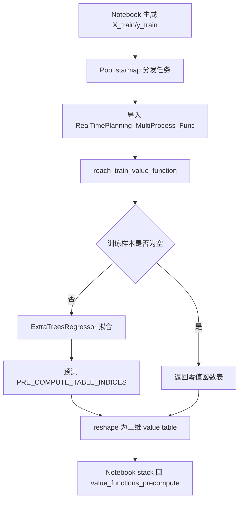
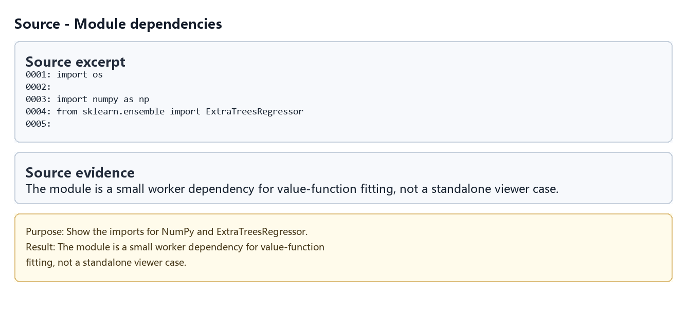
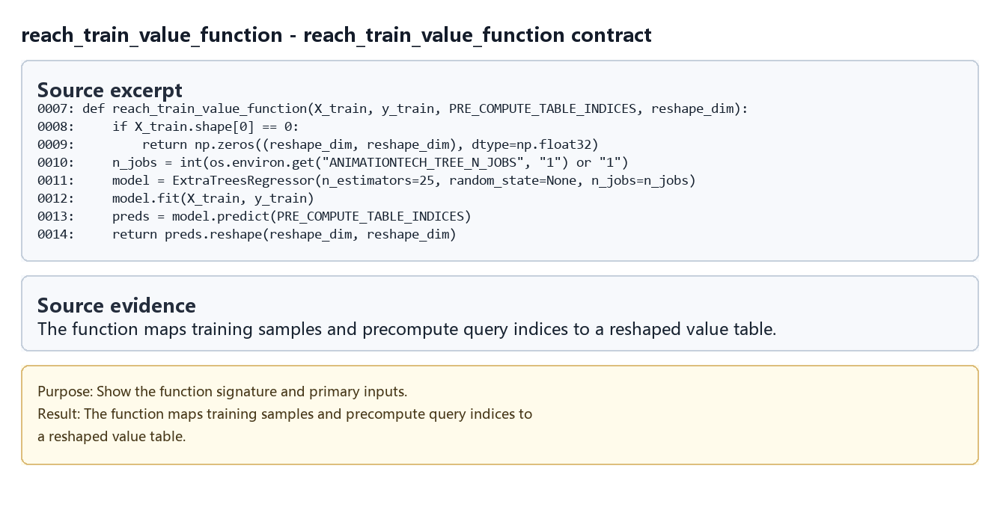
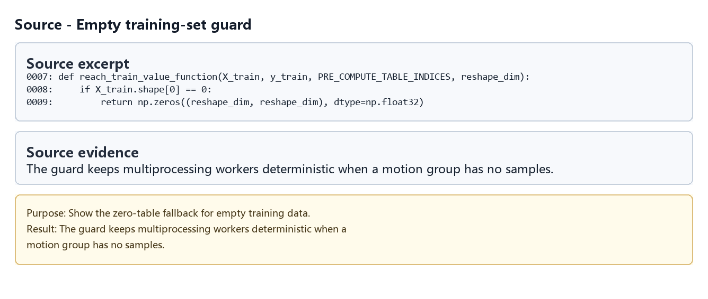
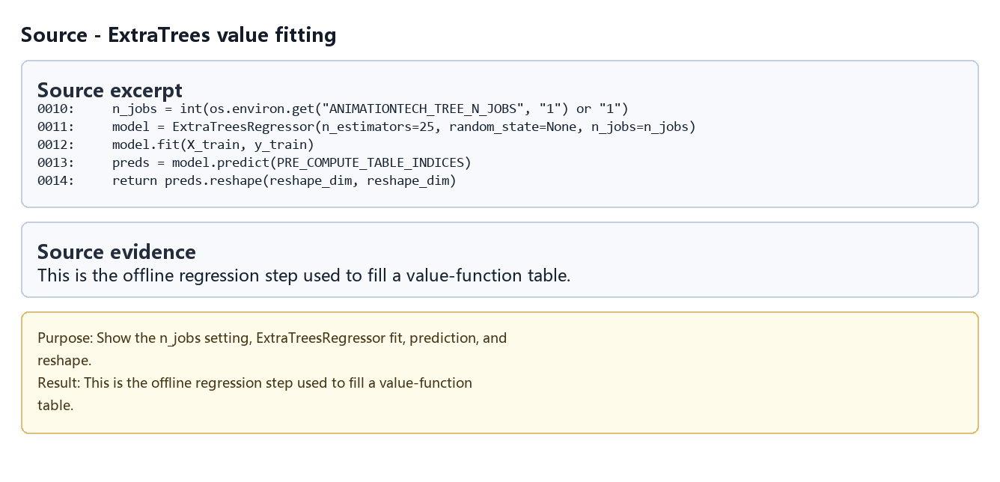
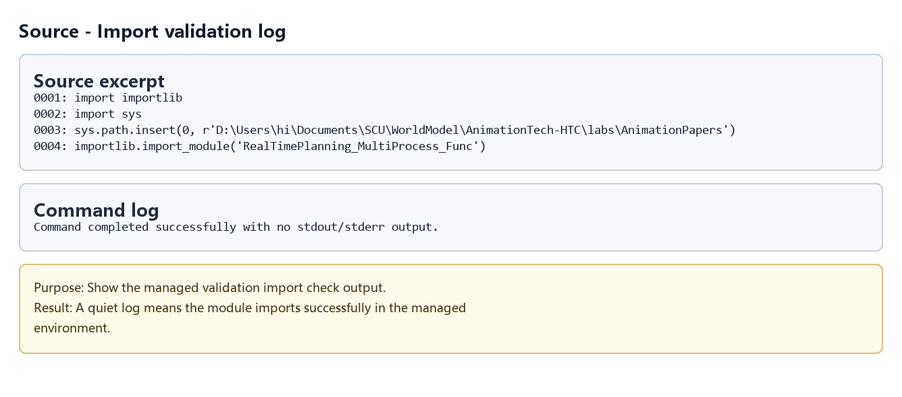

# RealTimePlanning_MultiProcess_Func

## 元数据

| 字段 | 内容 |
| --- | --- |
| slug | `real_time_planning_multiprocess_func` |
| source path | [`labs/AnimationPapers/RealTimePlanning_MultiProcess_Func.py`](../../../../labs/AnimationPapers/RealTimePlanning_MultiProcess_Func.py) |
| env prefix | `.envs/rtp_mp` |
| kernel | `animationtech-real_time_planning_multiprocess_func` |
| validation status | `passed`，`automated`；导入级验证已通过 |

## 问题背景

这个文件不是浏览器中直接学习的 notebook，而是 `Real-Time Planning for Parameterized Human Motion.ipynb` 的支撑模块。Notebook 在训练 reach-goal 值函数时需要对许多 clip 或 motion group 分别拟合二维值函数，如果所有训练逻辑都定义在 notebook cell 内，Windows 的 multiprocessing worker 很难稳定导入目标函数。因此该脚本把 worker 函数提到普通 Python 模块中，让 `Pool.starmap` 可以可靠调用。

模块当前只暴露 `reach_train_value_function`，职责很窄：接收某个状态集合的训练样本和预计算查询网格，拟合 `ExtraTreesRegressor`，再把预测结果 reshape 成 notebook 期望的值函数表。

## 总模块图



## 模块拆解

1. **依赖与资源控制**
   文件导入 `os`、`numpy` 和 `sklearn.ensemble.ExtraTreesRegressor`。函数内部读取环境变量 `ANIMATIONTECH_TREE_N_JOBS`，用它控制每个 ExtraTrees 模型的线程数，避免 multiprocessing 外层进程数和 sklearn 内层线程数互相放大。

2. **空样本保护**
   `reach_train_value_function` 首先检查 `X_train.shape[0]`。如果某个 clip 或 group 当前没有训练样本，函数直接返回 `reshape_dim x reshape_dim` 的 `float32` 零矩阵，保证 notebook 后续 `np.stack(results)` 不会因为缺失模型而失败。

3. **模型训练**
   有样本时，函数创建 `ExtraTreesRegressor(n_estimators=25, random_state=None, n_jobs=n_jobs)`，用传入的 `X_train` 与 `y_train` 拟合局部值函数。这里的输入通常是目标相对位置 `(x, z)`，输出是对应 Bellman 更新得到的值估计。

4. **预计算表输出**
   训练完成后，函数对 `PRE_COMPUTE_TABLE_INDICES` 做批量预测，并 reshape 为 `reshape_dim x reshape_dim`。Notebook 将多个 worker 的结果堆叠成 `value_functions_precompute`，供 `use_optimal_policy` 快速查表。

## 关键数据结构

- `X_train`：二维训练输入，通常表示目标在角色局部坐标中的 `(x, z)` 采样。
- `y_train`：每个训练输入对应的值函数目标。
- `PRE_COMPUTE_TABLE_INDICES`：预计算查询点集合，来自 notebook 中的二维状态网格。
- `reshape_dim`：输出值函数表的宽高。
- `ANIMATIONTECH_TREE_N_JOBS`：控制单个 ExtraTrees 训练并行度的环境变量。
- `ExtraTreesRegressor`：用于拟合离散样本到连续查询网格的回归模型。

## 执行结果的意义

该模块的意义在于让重训练步骤可并行、可导入、可自动验证。对主 notebook 来说，它隐藏了 worker 侧模型训练细节，只返回形状稳定的二维值函数表；对自动化来说，它可以作为独立 `python_module` 做导入级检查，降低 notebook multiprocessing 在不同平台上的失败概率。

## 源码模块与执行证据

本节把 Python module 当作支撑子工程来阅读：每个条目绑定源码片段、命令日志、产物摘要或流程图，说明它如何服务对应 notebook 案例。

[打开/下载 WebM](assets/00-walkthrough.webm)

| 片段 | 输出类型 | 代码/证据做什么 | 结果说明什么 | 素材 |
| --- | --- | --- | --- | --- |
| `imports` | `source_excerpt` | Show the imports for NumPy and ExtraTreesRegressor. | The module is a small worker dependency for value-function fitting, not a standalone viewer case. | [PNG](assets/01_module_imports.png) |
| `reach_train_value_function` | `source_excerpt` | Show the function signature and primary inputs. | The function maps training samples and precompute query indices to a reshaped value table. | [PNG](assets/02_function_contract.png) |
| `empty-guard` | `source_excerpt` | Show the zero-table fallback for empty training data. | The guard keeps multiprocessing workers deterministic when a motion group has no samples. | [PNG](assets/03_empty_training_guard.png) |
| `extra-trees` | `source_excerpt` | Show the n_jobs setting, ExtraTreesRegressor fit, prediction, and reshape. | This is the offline regression step used to fill a value-function table. | [PNG](assets/04_extra_trees_regressor.png) |
| `import-check` | `command_log` | Show the managed validation import check output. | A quiet log means the module imports successfully in the managed environment. | [PNG](assets/05_import_validation_log.png) |

### imports - Module dependencies

- 代码/证据做什么?Show the imports for NumPy and ExtraTreesRegressor.
- 运行后看到什么：源码片段。
- 结果说明什么：The module is a small worker dependency for value-function fitting, not a standalone viewer case.



### reach_train_value_function - reach_train_value_function contract

- 代码/证据做什么?Show the function signature and primary inputs.
- 运行后看到什么：源码片段。
- 结果说明什么：The function maps training samples and precompute query indices to a reshaped value table.



### empty-guard - Empty training-set guard

- 代码/证据做什么?Show the zero-table fallback for empty training data.
- 运行后看到什么：源码片段。
- 结果说明什么：The guard keeps multiprocessing workers deterministic when a motion group has no samples.



### extra-trees - ExtraTrees value fitting

- 代码/证据做什么?Show the n_jobs setting, ExtraTreesRegressor fit, prediction, and reshape.
- 运行后看到什么：源码片段。
- 结果说明什么：This is the offline regression step used to fill a value-function table.



### import-check - Import validation log

- 代码/证据做什么?Show the managed validation import check output.
- 运行后看到什么：命令日志。
- 结果说明什么：A quiet log means the module imports successfully in the managed environment.



## 运行方式

这个脚本是支撑模块，通常不需要直接手动运行，也不会打开 viewer。它由 `real_time_planning_for_parameterized_human_motion` notebook 在训练 reach-goal 值函数时导入：

```python
import RealTimePlanning_MultiProcess_Func as mpf
```

可通过 case runner 做自动化验证：

```powershell
powershell -NoProfile -ExecutionPolicy Bypass -File .\tools\run_case.ps1 real_time_planning_multiprocess_func
```

如需调节 sklearn 内部线程数，可在运行前设置：

```powershell
$env:ANIMATIONTECH_TREE_N_JOBS = "1"
```

## 重点可视化 / 动画

README 中优先引用结果 PNG、GIF 预览和视频链接；代码学习卡保留为复现证据。

[打开/下载总览 WebM](assets/00-walkthrough.webm)

| Cell | 输出类型 | 媒体角色 | 代码目的 | 结果媒体 |
| --- | --- | --- | --- | --- |
| imports | `source_excerpt` | `code_evidence` | Show the imports for NumPy and ExtraTreesRegressor. | [结果 PNG](assets/01_module_imports_result.png) / [代码卡](assets/01_module_imports.png) |
| function-contract | `source_excerpt` | `code_evidence` | Show the function signature and primary inputs. | [结果 PNG](assets/02_function_contract_result.png) / [代码卡](assets/02_function_contract.png) |
| empty-guard | `source_excerpt` | `code_evidence` | Show the zero-table fallback for empty training data. | [结果 PNG](assets/03_empty_training_guard_result.png) / [代码卡](assets/03_empty_training_guard.png) |
| extra-trees | `source_excerpt` | `code_evidence` | Show the n_jobs setting, ExtraTreesRegressor fit, prediction, and reshape. | [结果 PNG](assets/04_extra_trees_regressor_result.png) / [代码卡](assets/04_extra_trees_regressor.png) |
| import-check | `command_log` | `code_evidence` | Show the managed validation import check output. | [结果 PNG](assets/05_import_validation_log_result.png) / [代码卡](assets/05_import_validation_log.png) |

## 代码 Cell 与可视化结果

本节保留每个 cell 的可复现证据。结果 PNG 用于正文阅读，代码卡记录代码摘要与输出来源；有 timeline 或参数滑杆的 cell 同时提供 GIF、MP4 和 WebM。

| Cell / 片段 | 结果说明 | 证据 |
| --- | --- | --- |
| imports | The module is a small worker dependency for value-function fitting, not a standalone viewer case. | [结果 PNG](assets/01_module_imports_result.png) / [代码卡](assets/01_module_imports.png) |
| function-contract | The function maps training samples and precompute query indices to a reshaped value table. | [结果 PNG](assets/02_function_contract_result.png) / [代码卡](assets/02_function_contract.png) |
| empty-guard | The guard keeps multiprocessing workers deterministic when a motion group has no samples. | [结果 PNG](assets/03_empty_training_guard_result.png) / [代码卡](assets/03_empty_training_guard.png) |
| extra-trees | This is the offline regression step used to fill a value-function table. | [结果 PNG](assets/04_extra_trees_regressor_result.png) / [代码卡](assets/04_extra_trees_regressor.png) |
| import-check | A quiet log means the module imports successfully in the managed environment. | [结果 PNG](assets/05_import_validation_log_result.png) / [代码卡](assets/05_import_validation_log.png) |
