# RealTimePlanning_MultiProcess_Func：值函数训练 worker 模块

## 元数据

| 字段 | 值 |
| --- | --- |
| slug | `real_time_planning_multiprocess_func` |
| source path | [`labs/AnimationPapers/RealTimePlanning_MultiProcess_Func.py`](../../../../labs/AnimationPapers/RealTimePlanning_MultiProcess_Func.py) |
| transcript sources | [`docs/transcripts/tDilOjKfBaY_Reinforcement Learning 03 _ Realtime Planning For Parametrized Human Motion_.txt`](<../../../../docs/transcripts/tDilOjKfBaY_Reinforcement Learning 03 _ Realtime Planning For Parametrized Human Motion_.txt>) |
| kind | `python_module` |
| env prefix | `.envs/rtp_mp` |
| kernel | `animationtech-real_time_planning_multiprocess_func` |
| validation status | `passed` (`automated` import-level validation) |

## 问题背景

`RealTimePlanning_MultiProcess_Func.py` 是 `Real-Time Planning for Parameterized Human Motion` 案例的支撑模块，不是单独运行的 viewer。transcript 中真正昂贵的步骤是训练 reach-goal policy 的值函数：每个 clip 或 motion group 都有自己的连续状态值函数，训练后还要把 ExtraTreesRegressor 的预测结果预采样成二维表，供实时 policy 用 NumPy 快速查表。

这个 worker 文件存在的工程原因很具体：Windows 的 `multiprocessing` 使用 spawn 模式，子进程需要能通过普通 Python import 找到目标函数。如果训练函数只写在 notebook cell 里，`Pool.starmap` 很容易无法序列化或无法稳定导入。把 `reach_train_value_function` 提到 `.py` 模块后，notebook 可以把每个 clip/group 的训练样本拆成任务，分发给多个 worker，并把返回的二维 value table 合并回 `value_functions_precompute`。

## 阅读前置知识

- Real-time planning：运行时不重新训练，只在每一帧或每次决策时查预计算 value table，选择未来回报最高的动作。
- Continuous state space：reach-goal policy 的状态通常是角色局部坐标里的目标偏移，例如 `(x, z)`。
- Parametrized action space：论文把多个相似 clip 组成 motion group，再在组内采样 blend 参数；同一组的多个参数化动作共享一套值函数语义。
- ExtraTreesRegressor：用离散采样的 `(state, return)` 拟合连续值函数，比手工挑 basis functions 更少先验。
- Multiprocessing worker contract：worker 必须是顶层可导入函数，输入输出要能 pickle，返回形状要稳定，异常路径要可控。

## 总模块图

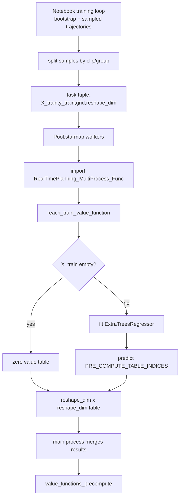

模块职责很窄：它不生成训练样本、不定义 reward、不实现 optimal policy，也不处理 motion group flattening。它只负责把某一个任务的样本拟合成一个可查表的 value table。

## 代码执行路径


`source_path` 只有十几行，因此这篇的 deep-write 重点不是逐行翻译，而是解释它嵌入整套实时规划训练流程时承担的工程责任。

## 模块拆解

### 1. Notebook 侧任务拆分

transcript 中的训练循环会不断生成 trajectory samples，更新 Bellman residual，并重新训练每个 value function。由于每个 clip/group 的样本可以独立拟合，notebook 能把训练集拆成多份任务：每份任务包含 `X_train`、`y_train`、共同的预计算查询网格 `PRE_COMPUTE_TABLE_INDICES`，以及输出表的边长 `reshape_dim`。

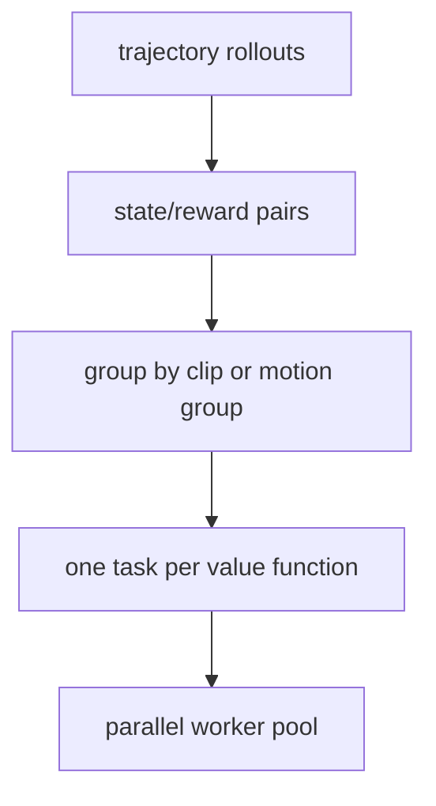

### 2. Worker import 与依赖边界

文件只导入 `os`、`numpy` 和 `sklearn.ensemble.ExtraTreesRegressor`。这说明它是纯计算 worker，不依赖 Jupyter、viewer、animation framework 或 notebook 状态。这个边界对 multiprocessing 很重要：子进程 import 模块时不会尝试打开图形环境，也不会重新执行 notebook cell。

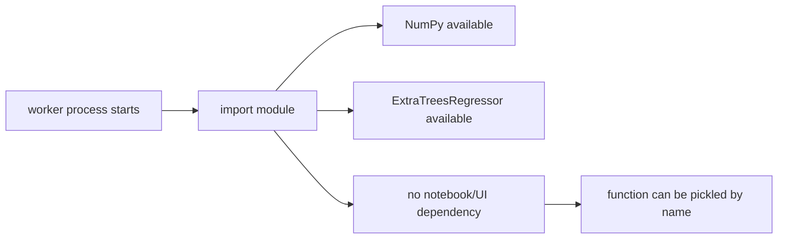

### 3. Empty training-set guard

某些 clip 或 motion group 在当前 epoch 可能没有样本。如果 worker 直接调用 `model.fit`，scikit-learn 会因为空训练集报错；更麻烦的是，主进程收到失败任务后无法合并完整 value table。模块因此先检查 `X_train.shape[0]`，为空就返回一个全零表。

```mermaid
flowchart LR
    A[X_train] --> B{shape[0] == 0?}
    B -->|yes| C[np.zeros reshape_dim x reshape_dim]
    B -->|no| D[continue model training]
    C --> E[stable ndarray return]
    D --> E
```

全零表不是“学到了零价值”，而是一个工程 fallback：它让训练 loop 在样本稀疏阶段保持形状一致，后续 epoch 有样本时再被真实拟合结果替换。

### 4. ExtraTrees value fitting

非空样本会进入 `ExtraTreesRegressor(n_estimators=25, random_state=None, n_jobs=n_jobs)`。`X_train` 是连续状态采样，`y_train` 是当前训练循环估计出的 return 或更新后的 expected reward。fit 完成后，worker 不把树模型返回给 notebook，而是马上对 `PRE_COMPUTE_TABLE_INDICES` 批量预测。

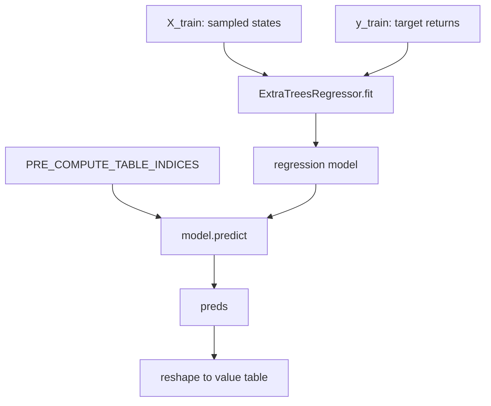

这与 transcript 里的优化方向一致：运行时想用 NumPy 一次性查询所有候选动作的未来回报，而不是对每个候选动作逐个调用树模型。

### 5. 结果合并与实时 policy

worker 返回的是 `reshape_dim x reshape_dim` 的 NumPy 数组。主进程把所有 worker 结果按 clip/group 顺序 stack 起来，形成 `value_functions_precompute`。之后 `use_optimal_policy` 可以把转移后的局部目标位置映射到表索引，读取候选动作的 future reward，再加上 transition reward 和 state reward，挑选最大值。

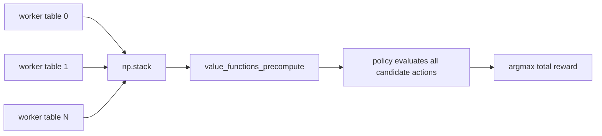

## 关键 cell / 函数深讲

本篇是 `.py` 支撑模块，没有 notebook cell；下面按源码片段和验证步骤对应到函数层面讲解。

### imports - Module dependencies

`imports` 片段证明这个模块的依赖面很小。`os` 只用于读取线程数环境变量，`numpy` 用于返回空表和 ndarray 形状，`ExtraTreesRegressor` 是唯一训练器。

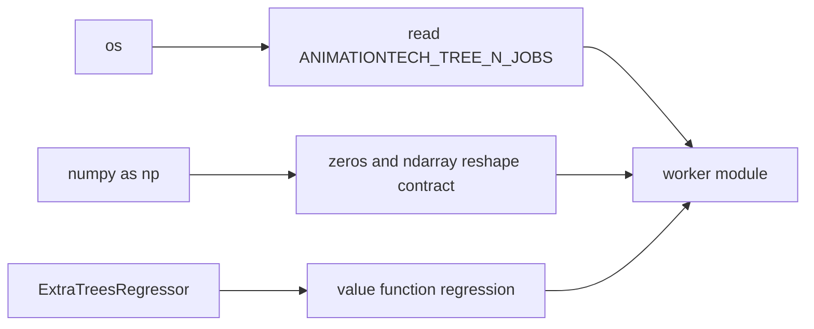

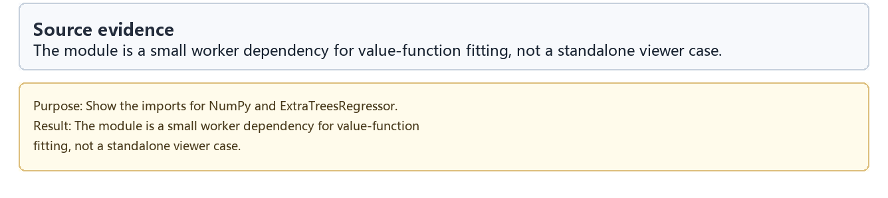

### function-contract - reach_train_value_function

函数签名就是 worker contract：输入训练样本、目标值、预计算查询点和 reshape 维度；输出一个二维 value table。它没有副作用，不写文件，也不依赖全局 notebook 变量。

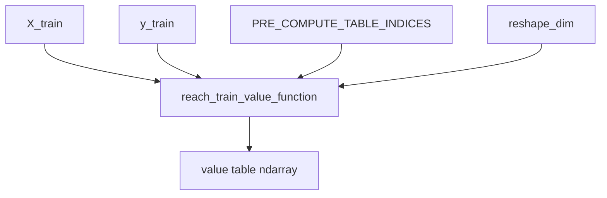

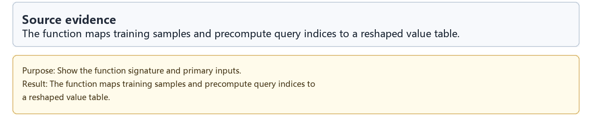

### empty-guard - Empty training-set guard

空样本 guard 是 multiprocessing 场景里最容易被低估的部分。没有它，某个 motion group 一旦暂时没有数据，就会让整轮并行训练失败；有了它，主进程仍能合并完整数量的表。

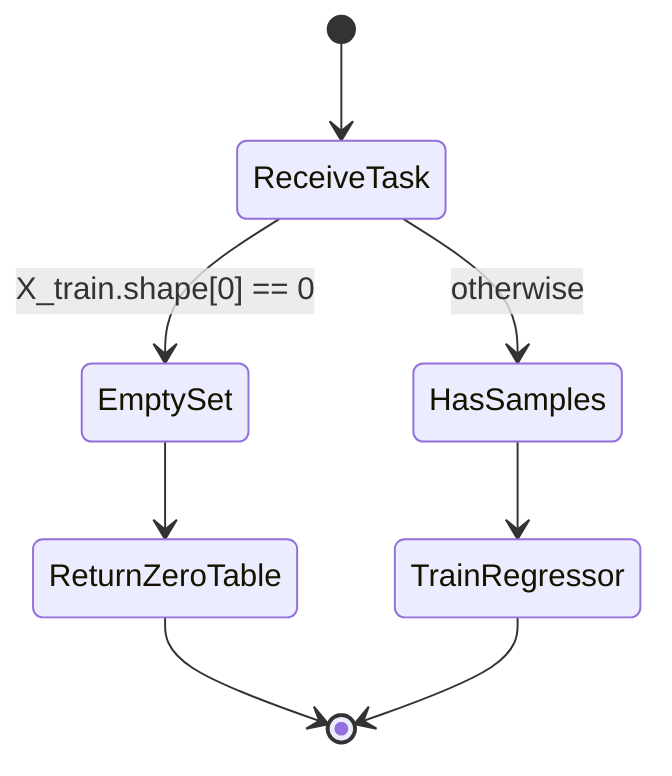

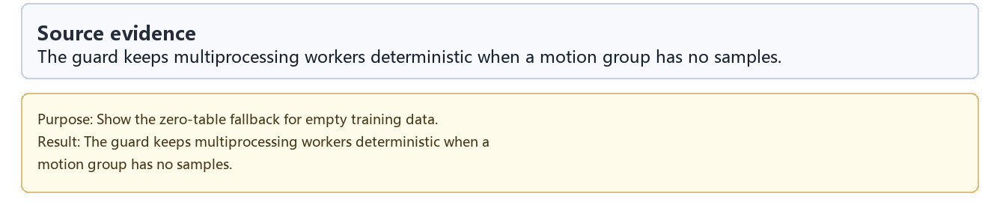

### extra-trees - ExtraTrees value fitting

这段是模块的核心计算。`ANIMATIONTECH_TREE_N_JOBS` 控制 scikit-learn 内部并行度，避免“外层多进程 * 内层多线程”把机器线程数放大到不可控。`n_estimators=25` 是一个偏工程化的折中：足够表达非平滑值函数，又不会让每个 worker 训练过慢。

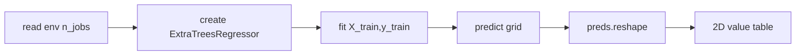

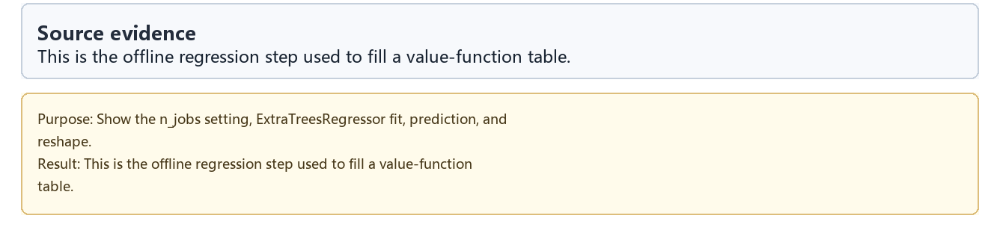

### import-check - Import validation log

`import-check` 不是算法输出，而是发布验证证据：自动化脚本在干净环境中导入这个模块，确认它不会因为 notebook-only 依赖、Maya/UI 依赖或路径副作用而失败。

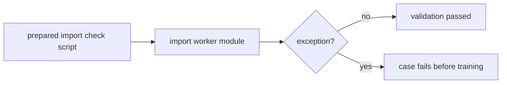

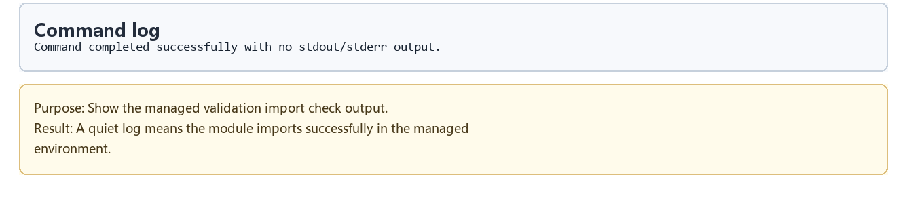

## 关键数据结构

| 名称 | 类型 / 形状 | 生命周期与作用 |
| --- | --- | --- |
| `X_train` | `ndarray [sample_count, state_dim]` | 某个 clip/group 的训练状态样本，通常是目标在角色局部空间的坐标 |
| `y_train` | `ndarray [sample_count]` | 与 `X_train` 对应的 expected return 或 Bellman 更新目标 |
| `PRE_COMPUTE_TABLE_INDICES` | `ndarray [grid_count, state_dim]` | notebook 预先构造的二维查询网格，用于把 regressor 离散化成表 |
| `reshape_dim` | int | 输出 value table 的宽高，要求 `grid_count == reshape_dim * reshape_dim` |
| `ANIMATIONTECH_TREE_N_JOBS` | environment variable | 控制单个 ExtraTreesRegressor 的内部并行度 |
| `model` | `ExtraTreesRegressor` | worker 内部临时对象，不跨进程返回 |
| `preds` | `ndarray [grid_count]` | 对预计算网格的批量预测值 |
| return value | `ndarray [reshape_dim, reshape_dim]` | 主进程可 stack 的 value table |
| `value_functions_precompute` | stacked ndarray | notebook 合并所有 worker 返回值后的实时 policy 查表数据 |

## 执行结果的意义

这个模块的结果不是一张可看的动画，而是一批形状稳定、可合并、可查表的二维值函数。它让 transcript 里“训练很多 value functions，然后运行时快速查未来回报”的思路落到工程实现：训练阶段可以用 ExtraTreesRegressor 适配复杂、不一定平滑的值函数；运行阶段则只面对 ndarray 表，不需要实时跑回归器。

在 parametrized action space 中，这个设计更重要。动作数量会因为 motion group 参数采样而增大，policy 每次决策要评估许多候选动作；预计算表让这些候选可以被向量化查询，而 worker 模块让训练这些表的成本分散到多进程。

## 重点可视化 / 动画

这个模块本身是执行辅助代码，不强行包装成算法动画。正文只引用真实源码摘录、命令日志和 walkthrough；学习卡放在后续证据表里。

| 片段 | 重点媒体 | visual_subject | media_role | 捕获方式 | 结果说明 |
| --- | --- | --- | --- | --- | --- |
| imports | [结果 PNG](assets/01_module_imports_result.png) | Module dependencies | `code_evidence` | `code_evidence` | 证明 worker 依赖面很小 |
| function-contract | [结果 PNG](assets/02_function_contract_result.png) | reach_train_value_function contract | `code_evidence` | `code_evidence` | 展示可被 multiprocessing 调用的函数边界 |
| empty-guard | [结果 PNG](assets/03_empty_training_guard_result.png) | Empty training-set guard | `code_evidence` | `code_evidence` | 空样本仍返回稳定二维表 |
| extra-trees | [结果 PNG](assets/04_extra_trees_regressor_result.png) | ExtraTrees value fitting | `code_evidence` | `code_evidence` | 训练、预测、reshape 的核心路径 |
| import-check | [结果 PNG](assets/05_import_validation_log_result.png) | Import validation log | `code_evidence` | `code_evidence` | 验证模块可导入 |
| walkthrough | [WebM](assets/00-walkthrough.webm) | module walkthrough | 补充证据 | `step_sequence` | 辅助回放源码证据顺序 |

## 源码模块与执行证据

| 片段 | 输出类型 | 媒体角色 | 捕获方式 | 发布必需 | 结果媒体 | 代码学习卡 |
| --- | --- | --- | --- | --- | --- | --- |
| `imports` | `source_excerpt` | `code_evidence` | `code_evidence` | `false` | [PNG](assets/01_module_imports_result.png) | [PNG](assets/01_module_imports.png) |
| `function-contract` | `source_excerpt` | `code_evidence` | `code_evidence` | `false` | [PNG](assets/02_function_contract_result.png) | [PNG](assets/02_function_contract.png) |
| `empty-guard` | `source_excerpt` | `code_evidence` | `code_evidence` | `false` | [PNG](assets/03_empty_training_guard_result.png) | [PNG](assets/03_empty_training_guard.png) |
| `extra-trees` | `source_excerpt` | `code_evidence` | `code_evidence` | `false` | [PNG](assets/04_extra_trees_regressor_result.png) | [PNG](assets/04_extra_trees_regressor.png) |
| `import-check` | `command_log` | `code_evidence` | `code_evidence` | `false` | [PNG](assets/05_import_validation_log_result.png) | [PNG](assets/05_import_validation_log.png) |

## 运行方式

这个脚本通常由 notebook 通过 multiprocessing 导入，不需要手动打开 viewer。自动化验证使用：

```powershell
powershell -NoProfile -ExecutionPolicy Bypass -File .\tools\run_case.ps1 real_time_planning_multiprocess_func
```

如果要控制每个 worker 内部 ExtraTrees 的线程数，可以在运行前设置：

```powershell
$env:ANIMATIONTECH_TREE_N_JOBS = "1"
```

这篇 README 只整理已有源码证据和 transcript 中的工程上下文，不新增媒体或修改训练代码。
