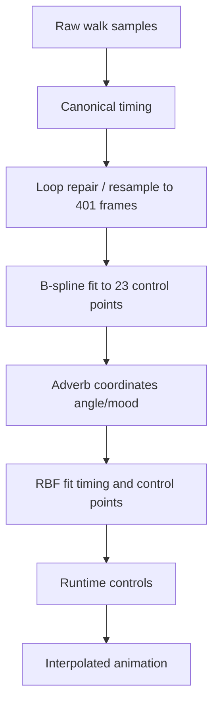
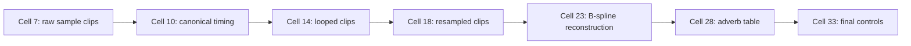
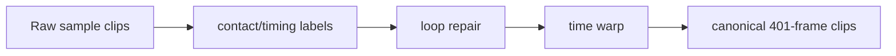
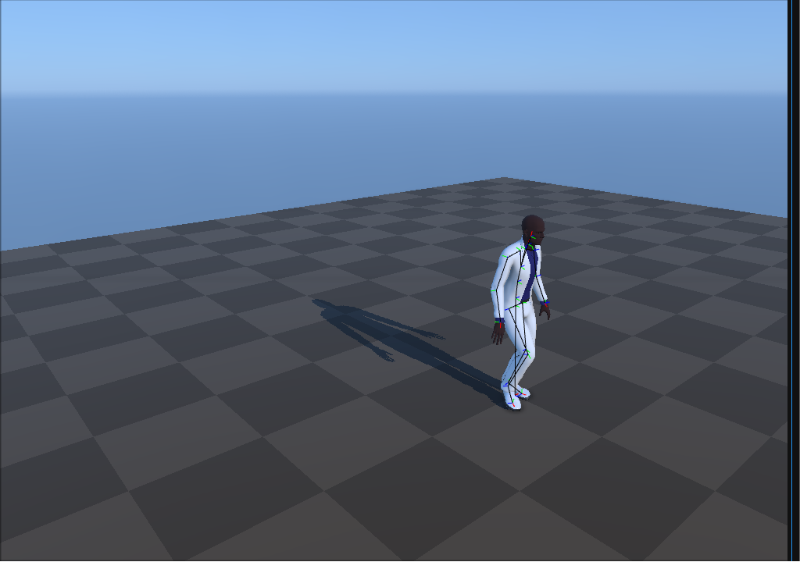
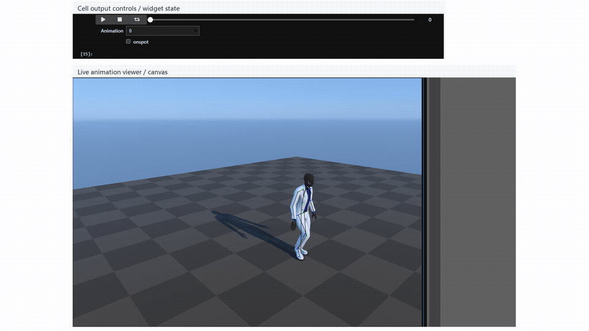
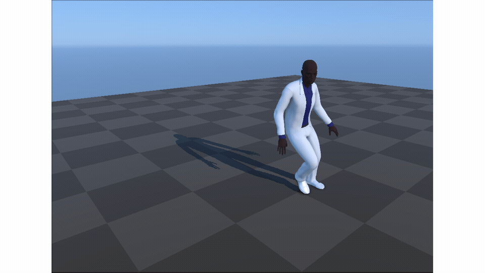
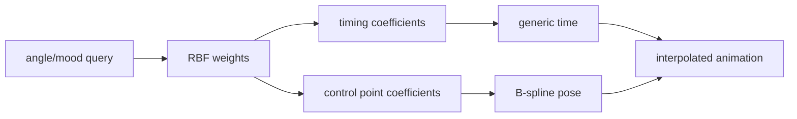
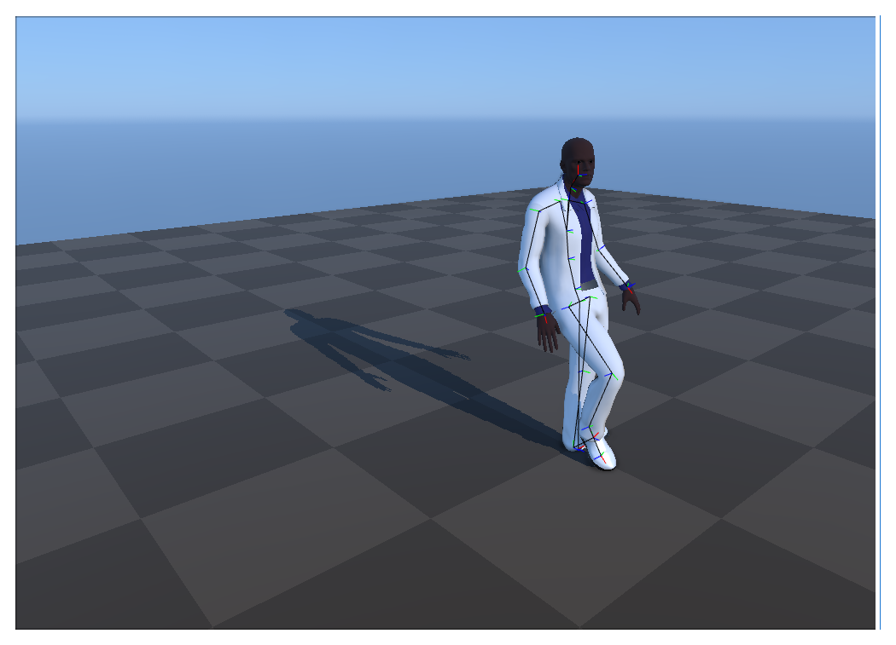
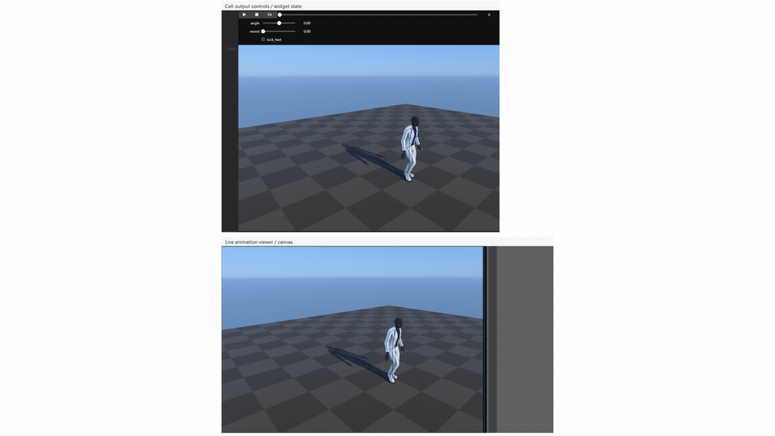
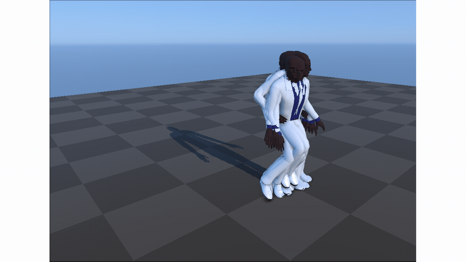

# Verbs and Adverbs：用 RBF 在动作语义空间插值

## 元数据

| 字段 | 内容 |
| --- | --- |
| slug | `verbs_and_adverbs` |
| source path | [`labs/AnimationPapers/Verbs and Adverbs.ipynb`](../../../../labs/AnimationPapers/Verbs and Adverbs.ipynb) |
| transcript sources | [`docs/transcripts/EBosvxpPONY_Verbs and Adverbs_ Multidimensional Motion Interpolation Using Radial Basis Func.txt`](../../../../docs/transcripts/EBosvxpPONY_Verbs and Adverbs_ Multidimensional Motion Interpolation Using Radial Basis Func.txt) |
| env prefix | `.envs/verbs_and_adverbs` |
| kernel | `animationtech-verbs_and_adverbs` |
| validation status | `passed` (`manual_smoke`) |

## 问题背景

这个案例回答语音稿中的核心问题：怎样从有限样例生成新的动作变体。verb 是动作类别，例如 walk；adverb 是风格或方向参数，例如 angle 和 mood。直接 blend 原始 clips 会相位错乱，所以 notebook 先做 canonical timing 和 loop repair，再用 B-spline 压缩曲线，最后用 RBF 在 adverb 空间中插值 timing 和控制点。

## 阅读前置知识

- motion phase / canonical form：不同样例必须先对齐关键接触时刻。
- loop cleanup 与 foot lock：循环动作要避免边界跳变和脚滑。
- uniform cubic B-spline：用少量控制点表示长动画曲线。
- RBF + linear trend：全局趋势由线性项表达，局部风格由径向项补偿。

## 总模块图



## 代码执行路径



## 模块拆解

### 1. Canonical Form

不同样例的脚步相位和循环边界不同。canonical timing 把语义相同的事件对齐，让后续插值发生在相同 phase 上。

### 2. B-spline 曲线表示

统一长度后，每个 motion channel 被拟合成 B-spline 控制点。运行时只需要评估当前 phase 附近的控制点。

### 3. Adverb Space 与 RBF

`adverbs[12,2]` 把样例放到 angle/mood 空间。RBF 对 timing 和每个 B-spline 控制点分别拟合。

## 关键 cell / 函数深讲

### Cell 7-18 - 从原始样例到 canonical clips



前半段 viewer 验证样例是否已同相位。若接触时刻没有对齐，后续插值会把不同步的脚步混在一起。





[打开 MP4](assets/04_resampled_canonical_clips_preview.mp4) / [打开 WebM](assets/04_resampled_canonical_clips_preview.webm)

### Cell 20-23 - B-spline 压缩与重建


B-spline viewer 验证曲线压缩是否仍能播放，而不是只在数值上拟合。




[打开 MP4](assets/06_bspline_reconstruction_viewer_preview.mp4) / [打开 WebM](assets/06_bspline_reconstruction_viewer_preview.webm)

### Cell 26-33 - RBF runtime controls



最终控件同时改变方向和风格。观察重点是动作是否连续、脚步是否还锁得住、风格变化是否不是简单线性混合。





[打开 MP4](assets/08_final_interpolated_adverb_controls_preview.mp4) / [打开 WebM](assets/08_final_interpolated_adverb_controls_preview.webm)

## 关键数据结构

- `ranges`、`animations`、`timings`：样例片段和相位标注。
- `resampled_animations`、`bspline_animations`：统一时间轴和 B-spline 表示。
- `adverbs[12,2]`：angle/mood 参数空间。
- `timings_linear_coefs`、`timings_radial_coefs`：timing 插值模型。
- `animation_linear_coefs`、`animation_radial_coefs`、`Buffer`：动作通道控制点的运行时插值。

## 执行结果的意义

canonical clips 验证相位对齐；B-spline viewer 验证曲线压缩可播放；最终控件验证 adverb 空间能生成连续的新动作。

## 重点可视化 / 动画

本节只放 `key_visual` 与 `key_animation` 的算法结果媒体。代码学习卡不作为正文主视觉；它们只在后续证据表中用于复现 cell 或源码上下文。

[打开/下载总览 WebM](assets/00-walkthrough.webm)



[打开 MP4](assets/01_raw_sample_clips_preview.mp4) / [打开 WebM](assets/01_raw_sample_clips_preview.webm)

| Cell | 输出类型 | 媒体角色 | 可视化主体 | 捕获方式 | 结果媒体 |
| --- | --- | --- | --- | --- | --- |
| Cell 7 | `timeline_viewer` | `key_animation` | Raw sample clip overview: The viewer establishes the motion examples that will be normalized and blended. | `canvas` | [结果 PNG](assets/01_raw_sample_clips_result.png) / [GIF](assets/01_raw_sample_clips_preview.gif) / [MP4](assets/01_raw_sample_clips_preview.mp4) / [WebM](assets/01_raw_sample_clips_preview.webm) |
| Cell 10 | `timeline_viewer` | `key_animation` | Canonical timing and contact inspection: Canonical timing aligns examples before interpolation. | `canvas` | [结果 PNG](assets/02_canonical_timing_contacts_result.png) / [GIF](assets/02_canonical_timing_contacts_preview.gif) / [MP4](assets/02_canonical_timing_contacts_preview.mp4) / [WebM](assets/02_canonical_timing_contacts_preview.webm) |
| Cell 14 | `timeline_viewer` | `key_animation` | Looping animation comparison: Looping makes repeated motion comparable across clips. | `canvas` | [结果 PNG](assets/03_looping_animation_compare_result.png) / [GIF](assets/03_looping_animation_compare_preview.gif) / [MP4](assets/03_looping_animation_compare_preview.mp4) / [WebM](assets/03_looping_animation_compare_preview.webm) |
| Cell 18 | `timeline_viewer` | `key_animation` | Resampled canonical clips: The viewer checks that examples share a common timing domain. | `canvas` | [结果 PNG](assets/04_resampled_canonical_clips_result.png) / [GIF](assets/04_resampled_canonical_clips_preview.gif) / [MP4](assets/04_resampled_canonical_clips_preview.mp4) / [WebM](assets/04_resampled_canonical_clips_preview.webm) |
| Cell 22 | `plot` | `key_visual` | B-spline curve fit: The plot shows how sparse motion samples become smooth parameterized curves. | `plot` | [结果 PNG](assets/05_bspline_fit_plot_result.png) |
| Cell 23 | `timeline_viewer` | `key_animation` | B-spline reconstruction viewer: The viewer validates the curve representation as playable motion. | `canvas` | [结果 PNG](assets/06_bspline_reconstruction_viewer_result.png) / [GIF](assets/06_bspline_reconstruction_viewer_preview.gif) / [MP4](assets/06_bspline_reconstruction_viewer_preview.mp4) / [WebM](assets/06_bspline_reconstruction_viewer_preview.webm) |
| Cell 33 | `timeline_viewer` | `key_animation` | Final interpolated adverb controls: The final viewer shows how verb and adverb coordinates produce a new animation. | `canvas` | [结果 PNG](assets/08_final_interpolated_adverb_controls_result.png) / [GIF](assets/08_final_interpolated_adverb_controls_preview.gif) / [MP4](assets/08_final_interpolated_adverb_controls_preview.mp4) / [WebM](assets/08_final_interpolated_adverb_controls_preview.webm) |


## 代码 Cell 与可视化结果

本节保留每个 cell 的可复现证据。结果 PNG 用于正文阅读，代码卡记录代码摘要与输出来源；有 timeline 或参数滑杆的 cell 同时提供 GIF、MP4 和 WebM。

| Cell / 片段 | 结果说明 | 证据 |
| --- | --- | --- |
| Cell 7 | The viewer establishes the motion examples that will be normalized and blended. | [结果 PNG](assets/01_raw_sample_clips_result.png) / [GIF](assets/01_raw_sample_clips_preview.gif) / [MP4](assets/01_raw_sample_clips_preview.mp4) / [WebM](assets/01_raw_sample_clips_preview.webm) / [代码卡](assets/01_raw_sample_clips.png) |
| Cell 10 | Canonical timing aligns examples before interpolation. | [结果 PNG](assets/02_canonical_timing_contacts_result.png) / [GIF](assets/02_canonical_timing_contacts_preview.gif) / [MP4](assets/02_canonical_timing_contacts_preview.mp4) / [WebM](assets/02_canonical_timing_contacts_preview.webm) / [代码卡](assets/02_canonical_timing_contacts.png) |
| Cell 14 | Looping makes repeated motion comparable across clips. | [结果 PNG](assets/03_looping_animation_compare_result.png) / [GIF](assets/03_looping_animation_compare_preview.gif) / [MP4](assets/03_looping_animation_compare_preview.mp4) / [WebM](assets/03_looping_animation_compare_preview.webm) / [代码卡](assets/03_looping_animation_compare.png) |
| Cell 18 | The viewer checks that examples share a common timing domain. | [结果 PNG](assets/04_resampled_canonical_clips_result.png) / [GIF](assets/04_resampled_canonical_clips_preview.gif) / [MP4](assets/04_resampled_canonical_clips_preview.mp4) / [WebM](assets/04_resampled_canonical_clips_preview.webm) / [代码卡](assets/04_resampled_canonical_clips.png) |
| Cell 22 | The plot shows how sparse motion samples become smooth parameterized curves. | [结果 PNG](assets/05_bspline_fit_plot_result.png) / [代码卡](assets/05_bspline_fit_plot.png) |
| Cell 23 | The viewer validates the curve representation as playable motion. | [结果 PNG](assets/06_bspline_reconstruction_viewer_result.png) / [GIF](assets/06_bspline_reconstruction_viewer_preview.gif) / [MP4](assets/06_bspline_reconstruction_viewer_preview.mp4) / [WebM](assets/06_bspline_reconstruction_viewer_preview.webm) / [代码卡](assets/06_bspline_reconstruction_viewer.png) |
| Cell 28 | The table connects semantic labels to numeric interpolation coordinates. | [结果 PNG](assets/07_adverb_coordinate_table_result.png) / [代码卡](assets/07_adverb_coordinate_table.png) |
| Cell 33 | The final viewer shows how verb and adverb coordinates produce a new animation. | [结果 PNG](assets/08_final_interpolated_adverb_controls_result.png) / [GIF](assets/08_final_interpolated_adverb_controls_preview.gif) / [MP4](assets/08_final_interpolated_adverb_controls_preview.mp4) / [WebM](assets/08_final_interpolated_adverb_controls_preview.webm) / [代码卡](assets/08_final_interpolated_adverb_controls.png) |


## 运行方式

AnimationPapers 案例优先使用：

```powershell
powershell -NoProfile -ExecutionPolicy Bypass -File .\tools\start_animationpapers_lab.ps1
```

单案例验证使用：

```powershell
powershell -NoProfile -ExecutionPolicy Bypass -File .\tools\run_case.ps1 verbs_and_adverbs
```
