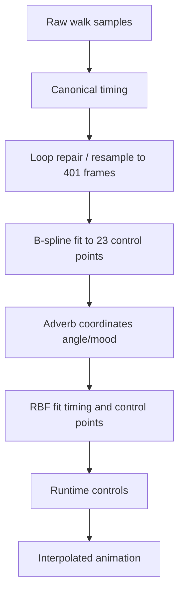
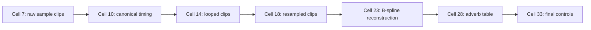
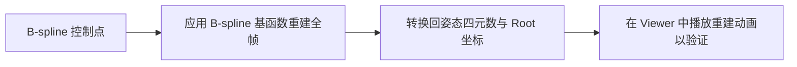
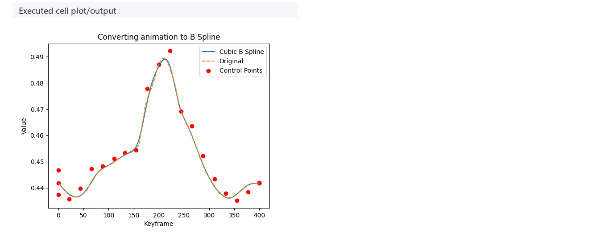

# Verbs and Adverbs：用 RBF 在动作语义空间插值

## 元数据

| 字段 | 内容 |
| --- | --- |
| slug | `verbs_and_adverbs` |
| source path | [`labs/AnimationPapers/Verbs and Adverbs.ipynb`](<../../../../labs/AnimationPapers/Verbs and Adverbs.ipynb>) |
| transcript sources | [`docs/transcripts/EBosvxpPONY_Verbs and Adverbs_ Multidimensional Motion Interpolation Using Radial Basis Func.txt`](<../../../../docs/transcripts/EBosvxpPONY_Verbs and Adverbs_ Multidimensional Motion Interpolation Using Radial Basis Func.txt>) |
| kind | `notebook` |
| env | `.envs/verbs_and_adverbs` |
| kernel | `animationtech-verbs_and_adverbs` |
| validation | `passed` (`manual_smoke`；自动执行通过，viewer 建议 JupyterLab 人工检查) |
| publish tier | `深写完成 + 媒体完整` |
| media quality | key_visual/key_animation 必须是算法输出本身，禁止滚动截图、整页 cell、代码卡裁剪和静态假动画 |

## 问题背景

这个案例回答语音稿中的核心问题：怎样从有限样例生成新的动作变体。verb 是动作类别，例如 walk；adverb 是风格或方向参数，例如 angle 和 mood。直接 blend 原始 clips 会相位错乱，所以 notebook 先做 canonical timing 和 loop repair，再用 B-spline 压缩曲线，最后用 RBF 在 adverb 空间中插值 timing 和控制点。

## 阅读前置知识

- motion phase / canonical form：不同样例必须先对齐关键接触时刻。
- loop cleanup 与 foot lock：循环动作要避免边界跳变和脚滑。
- uniform cubic B-spline：用少量控制点表示长动画曲线。
- RBF + linear trend：全局趋势由线性项表达，局部风格由径向项补偿。

## 总模块图



## 代码执行路径



## 模块拆解

### 1. Canonical Form

不同样例的脚步相位和循环边界不同。canonical timing 把语义相同的事件对齐，让后续插值发生在相同 phase 上。

### 2. B-spline 曲线表示

统一长度后，每个 motion channel 被拟合成 B-spline 控制点。运行时只需要评估当前 phase 附近的控制点。

### 3. Adverb Space 与 RBF

`adverbs[12,2]` 把样例放到 angle/mood 空间。RBF 对 timing 和每个 B-spline 控制点分别拟合。

## 关键 cell / 函数深讲

### Cell 7 - Raw sample clips

渲染所有未经处理的走/跑动作原始片段，作为风格插值系统的输入语料库。


- 代码做什么：原始样本片段概览：viewer 建立后续将被规范化和混合的动作样例。
- 运行后看到什么：`timeline_viewer`
- 结果说明什么：viewer 建立后续将被规范化和混合的动作样例。
- 可视化主体：Raw sample clip overview
- 捕获方式：`canvas`

### Cell 10 - Canonical timing and contact inspection

为了避免直接混合导致错步，将所有片段对齐到一个统一的特征时间轴（Phase），并在此检验接触状态的一致性。


- 代码做什么：规范化时序与接触检查：在插值前先对齐样例时序。
- 运行后看到什么：`timeline_viewer`
- 结果说明什么：Canonical timing aligns examples before interpolation.
- 可视化主体：Canonical timing and contact inspection
- 捕获方式：`canvas`

### Cell 14 - Looping animation comparison

修复动作的首尾循环瑕疵，消除动作接缝处的弹跳感，使得动作可无限播放。


- 代码做什么：循环动画对比：循环化让重复动作可以跨片段比较。
- 运行后看到什么：`timeline_viewer`
- 结果说明什么：Looping makes repeated motion comparable across clips.
- 可视化主体：Looping animation comparison
- 捕获方式：`canvas`

### Cell 18 - Resampled canonical clips

将规整并修复循环后的剪辑重采样到一致的帧数（如 401 帧），确保数据在数组维度上的对齐。


- 代码做什么：重采样后的规范化片段：检查样例是否共享同一时间域。
- 运行后看到什么：`timeline_viewer`
- 结果说明什么：viewer 检查样例是否共享同一时间域。
- 可视化主体：Resampled canonical clips
- 捕获方式：`canvas`

### Cell 22 - B-spline curve fit

对密集的重采样动画执行 B 样条拟合降维，用少量控制点（如 23 个）来表示复杂的曲线，大幅降低插值计算量。


- 代码做什么：B-spline 曲线拟合：展示稀疏动作样本如何变成平滑参数化曲线。
- 运行后看到什么：`plot`
- 结果说明什么：图中展示稀疏动作样本如何变成平滑参数化曲线。
- 可视化主体：B-spline curve fit
- 捕获方式：`plot`

### Cell 23 - B-spline reconstruction viewer

使用降维后的 B 样条控制点重新构建动画并播放，肉眼验证拟合压缩过程没有损失明显的视觉质量。



- 代码做什么：B-spline 重建 viewer：验证曲线表示能否还原为可播放动作。
- 运行后看到什么：`timeline_viewer`
- 结果说明什么：viewer 验证曲线表示能否还原为可播放动作。
- 可视化主体：B-spline reconstruction viewer
- 捕获方式：`canvas`

### Cell 33 - Final interpolated adverb controls

集成径向基函数（RBF），通过交互式的 `angle`（方向）和 `mood`（心情/速度）滑杆，在潜空间实时插值出全新的动作。


- 代码做什么：最终插值后的 adverb 控制：展示 verb/adverb 坐标如何生成新动画。
- 运行后看到什么：`timeline_viewer`
- 结果说明什么：最终 viewer 展示 verb/adverb 坐标如何生成新动画。
- 可视化主体：Final interpolated adverb controls
- 捕获方式：`canvas`

## 关键数据结构

- `ranges`、`animations`、`timings`：样例片段和相位标注。
- `resampled_animations`、`bspline_animations`：统一时间轴和 B-spline 表示。
- `adverbs[12,2]`：angle/mood 参数空间。
- `timings_linear_coefs`、`timings_radial_coefs`：timing 插值模型。
- `animation_linear_coefs`、`animation_radial_coefs`、`Buffer`：动作通道控制点的运行时插值。

## 执行结果的意义

canonical clips 验证相位对齐；B-spline viewer 验证曲线压缩可播放；最终控件验证 adverb 空间能生成连续的新动作。

## 重点可视化 / 动画

本节只保留最能说明算法结果的图像和动画。代码学习卡移到文末证据表，供需要复现或追溯 cell 上下文时查看。


https://github.com/user-attachments/assets/7c36901a-6782-465a-8c6b-281c0e36c487

<video controls muted loop playsinline preload="metadata" width="100%" poster="assets/01_raw_sample_clips_result.png">
  <source src="assets/01_raw_sample_clips_preview.mp4" type="video/mp4">
  <source src="assets/01_raw_sample_clips_preview.webm" type="video/webm">
</video>


**Cell 10 - Canonical timing and contact inspection**

https://github.com/user-attachments/assets/e89b1fd9-6321-4029-b220-d00f449605c8

<video controls muted loop playsinline preload="metadata" width="100%" poster="assets/02_canonical_timing_contacts_result.png">
  <source src="assets/02_canonical_timing_contacts_preview.mp4" type="video/mp4">
  <source src="assets/02_canonical_timing_contacts_preview.webm" type="video/webm">
</video>

**Cell 14 - Looping animation comparison**

https://github.com/user-attachments/assets/47626e48-6d1c-4cdb-af74-13ca3bdbf819

<video controls muted loop playsinline preload="metadata" width="100%" poster="assets/03_looping_animation_compare_result.png">
  <source src="assets/03_looping_animation_compare_preview.mp4" type="video/mp4">
  <source src="assets/03_looping_animation_compare_preview.webm" type="video/webm">
</video>

**Cell 18 - Resampled canonical clips**

https://github.com/user-attachments/assets/10c0e665-0a87-4a2a-b9e4-10a10fc1034f

<video controls muted loop playsinline preload="metadata" width="100%" poster="assets/04_resampled_canonical_clips_result.png">
  <source src="assets/04_resampled_canonical_clips_preview.mp4" type="video/mp4">
  <source src="assets/04_resampled_canonical_clips_preview.webm" type="video/webm">
</video>

**Cell 22 - B-spline curve fit**



**Cell 23 - B-spline reconstruction viewer**

https://github.com/user-attachments/assets/5f02c79f-1ecd-45e2-bd8a-5ec193f24aff

<video controls muted loop playsinline preload="metadata" width="100%" poster="assets/06_bspline_reconstruction_viewer_result.png">
  <source src="assets/06_bspline_reconstruction_viewer_preview.mp4" type="video/mp4">
  <source src="assets/06_bspline_reconstruction_viewer_preview.webm" type="video/webm">
</video>

**Cell 33 - Final interpolated adverb controls**

https://github.com/user-attachments/assets/647b8b0c-9885-4c53-984a-6a5ffefb886d

<video controls muted loop playsinline preload="metadata" width="100%" poster="assets/08_final_interpolated_adverb_controls_result.png">
  <source src="assets/08_final_interpolated_adverb_controls_preview.mp4" type="video/mp4">
  <source src="assets/08_final_interpolated_adverb_controls_preview.webm" type="video/webm">
</video>

| Cell | 输出类型 | 阅读位置 | 可视化主体 | 捕获方式 | 结果媒体 |
| --- | --- | --- | --- | --- | --- |
| Cell 7 | `timeline_viewer` | 核心动画 | 原始样本片段概览：viewer 建立后续将被规范化和混合的动作样例。 | `canvas` | [结果 PNG](assets/01_raw_sample_clips_result.png) / [GIF](assets/01_raw_sample_clips_preview.gif) / [MP4](assets/01_raw_sample_clips_preview.mp4) / [WebM](assets/01_raw_sample_clips_preview.webm) |
| Cell 10 | `timeline_viewer` | 核心动画 | 规范化时序与接触检查：在插值前先对齐样例时序。 | `canvas` | [结果 PNG](assets/02_canonical_timing_contacts_result.png) / [GIF](assets/02_canonical_timing_contacts_preview.gif) / [MP4](assets/02_canonical_timing_contacts_preview.mp4) / [WebM](assets/02_canonical_timing_contacts_preview.webm) |
| Cell 14 | `timeline_viewer` | 核心动画 | 循环动画对比：循环化让重复动作可以跨片段比较。 | `canvas` | [结果 PNG](assets/03_looping_animation_compare_result.png) / [GIF](assets/03_looping_animation_compare_preview.gif) / [MP4](assets/03_looping_animation_compare_preview.mp4) / [WebM](assets/03_looping_animation_compare_preview.webm) |
| Cell 18 | `timeline_viewer` | 核心动画 | 重采样后的规范化片段：检查样例是否共享同一时间域。 | `canvas` | [结果 PNG](assets/04_resampled_canonical_clips_result.png) / [GIF](assets/04_resampled_canonical_clips_preview.gif) / [MP4](assets/04_resampled_canonical_clips_preview.mp4) / [WebM](assets/04_resampled_canonical_clips_preview.webm) |
| Cell 22 | `plot` | 核心图解 | B-spline 曲线拟合：展示稀疏动作样本如何变成平滑参数化曲线。 | `plot` | [结果 PNG](assets/05_bspline_fit_plot_result.png) |
| Cell 23 | `timeline_viewer` | 核心动画 | B-spline 重建 viewer：验证曲线表示能否还原为可播放动作。 | `canvas` | [结果 PNG](assets/06_bspline_reconstruction_viewer_result.png) / [GIF](assets/06_bspline_reconstruction_viewer_preview.gif) / [MP4](assets/06_bspline_reconstruction_viewer_preview.mp4) / [WebM](assets/06_bspline_reconstruction_viewer_preview.webm) |
| Cell 33 | `timeline_viewer` | 核心动画 | 最终插值后的 adverb 控制：展示 verb/adverb 坐标如何生成新动画。 | `canvas` | [结果 PNG](assets/08_final_interpolated_adverb_controls_result.png) / [GIF](assets/08_final_interpolated_adverb_controls_preview.gif) / [MP4](assets/08_final_interpolated_adverb_controls_preview.mp4) / [WebM](assets/08_final_interpolated_adverb_controls_preview.webm) |


## 代码 Cell 与可视化证据

下面是附录式证据索引：结果 PNG 便于快速核对，代码卡用于追溯代码摘要与输出来源；带时间轴或参数滑杆的条目同时保留 GIF、MP4 和 WebM。

| Cell / 片段 | 结果说明 | 证据 |
| --- | --- | --- |
| Cell 7 | viewer 建立后续将被规范化和混合的动作样例。 | [结果 PNG](assets/01_raw_sample_clips_result.png) / [GIF](assets/01_raw_sample_clips_preview.gif) / [MP4](assets/01_raw_sample_clips_preview.mp4) / [WebM](assets/01_raw_sample_clips_preview.webm) / [代码卡](assets/01_raw_sample_clips.png) |
| Cell 10 | Canonical timing aligns examples before interpolation. | [结果 PNG](assets/02_canonical_timing_contacts_result.png) / [GIF](assets/02_canonical_timing_contacts_preview.gif) / [MP4](assets/02_canonical_timing_contacts_preview.mp4) / [WebM](assets/02_canonical_timing_contacts_preview.webm) / [代码卡](assets/02_canonical_timing_contacts.png) |
| Cell 14 | Looping makes repeated motion comparable across clips. | [结果 PNG](assets/03_looping_animation_compare_result.png) / [GIF](assets/03_looping_animation_compare_preview.gif) / [MP4](assets/03_looping_animation_compare_preview.mp4) / [WebM](assets/03_looping_animation_compare_preview.webm) / [代码卡](assets/03_looping_animation_compare.png) |
| Cell 18 | viewer 检查样例是否共享同一时间域。 | [结果 PNG](assets/04_resampled_canonical_clips_result.png) / [GIF](assets/04_resampled_canonical_clips_preview.gif) / [MP4](assets/04_resampled_canonical_clips_preview.mp4) / [WebM](assets/04_resampled_canonical_clips_preview.webm) / [代码卡](assets/04_resampled_canonical_clips.png) |
| Cell 22 | 图中展示稀疏动作样本如何变成平滑参数化曲线。 | [结果 PNG](assets/05_bspline_fit_plot_result.png) / [代码卡](assets/05_bspline_fit_plot.png) |
| Cell 23 | viewer 验证曲线表示能否还原为可播放动作。 | [结果 PNG](assets/06_bspline_reconstruction_viewer_result.png) / [GIF](assets/06_bspline_reconstruction_viewer_preview.gif) / [MP4](assets/06_bspline_reconstruction_viewer_preview.mp4) / [WebM](assets/06_bspline_reconstruction_viewer_preview.webm) / [代码卡](assets/06_bspline_reconstruction_viewer.png) |
| Cell 28 | 表格把语义标签对应到数值插值坐标。 | [结果 PNG](assets/07_adverb_coordinate_table_result.png) / [代码卡](assets/07_adverb_coordinate_table.png) |
| Cell 33 | 最终 viewer 展示 verb/adverb 坐标如何生成新动画。 | [结果 PNG](assets/08_final_interpolated_adverb_controls_result.png) / [GIF](assets/08_final_interpolated_adverb_controls_preview.gif) / [MP4](assets/08_final_interpolated_adverb_controls_preview.mp4) / [WebM](assets/08_final_interpolated_adverb_controls_preview.webm) / [代码卡](assets/08_final_interpolated_adverb_controls.png) |


## 运行方式

AnimationPapers 案例优先使用：

```powershell
powershell -NoProfile -ExecutionPolicy Bypass -File .\tools\start_animationpapers_lab.ps1
```

单案例验证使用：

```powershell
powershell -NoProfile -ExecutionPolicy Bypass -File .\tools\run_case.ps1 verbs_and_adverbs
```
