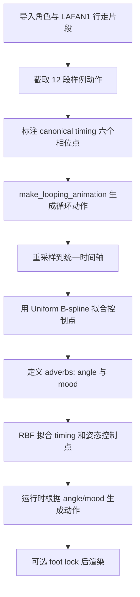
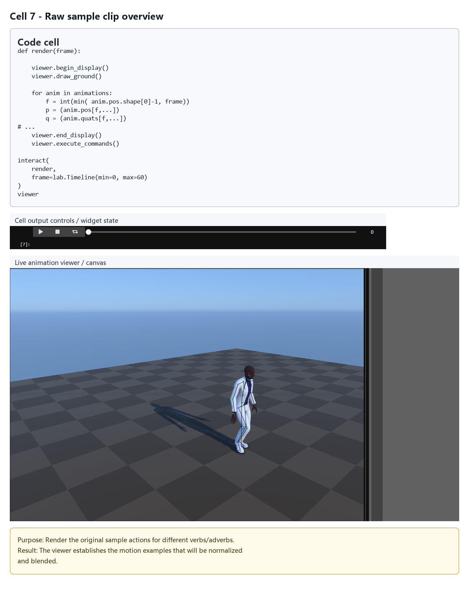
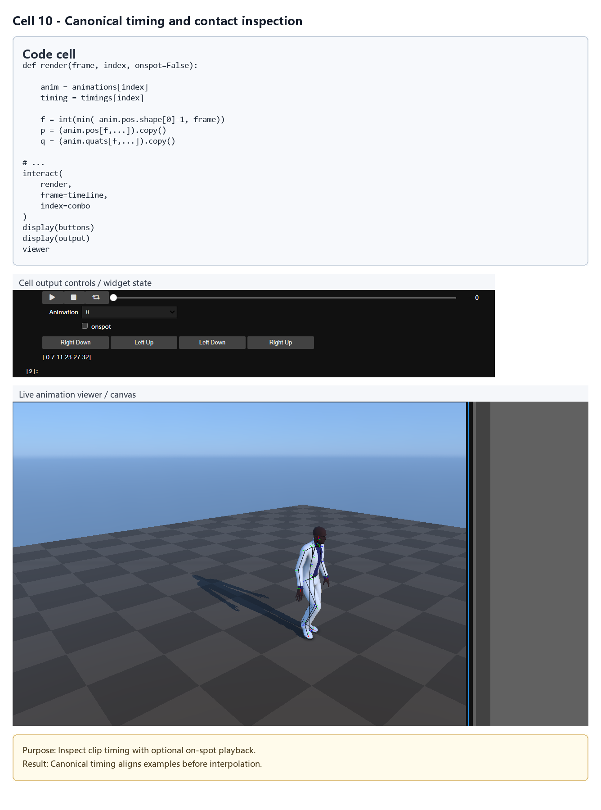
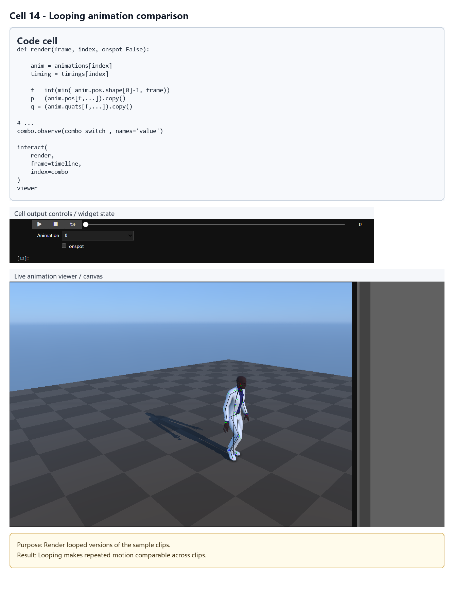
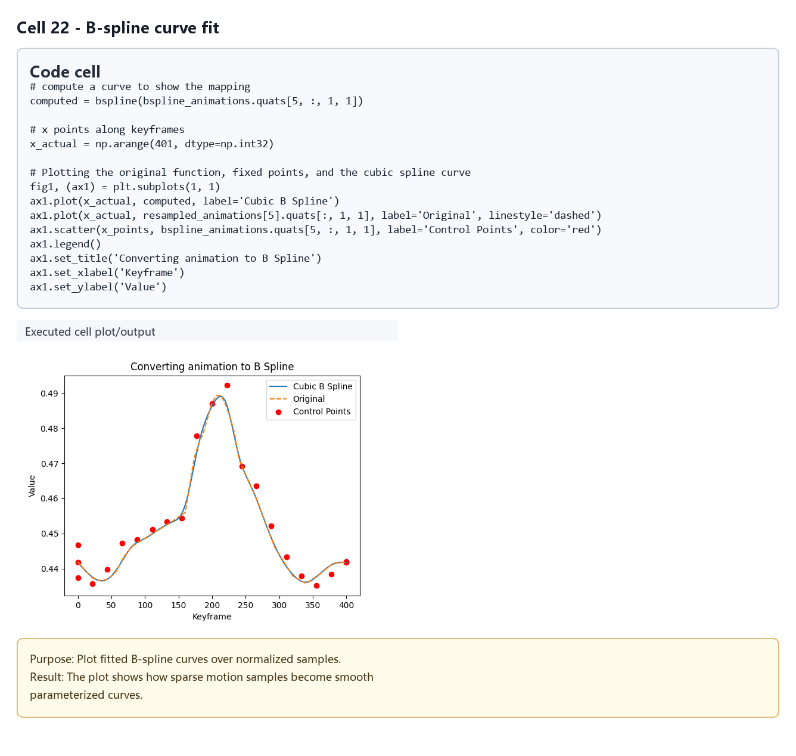
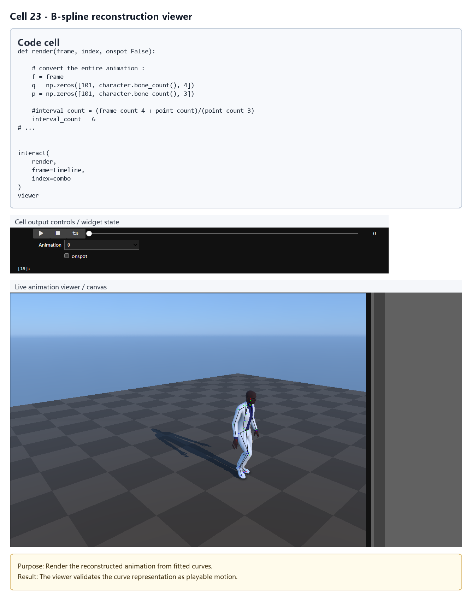
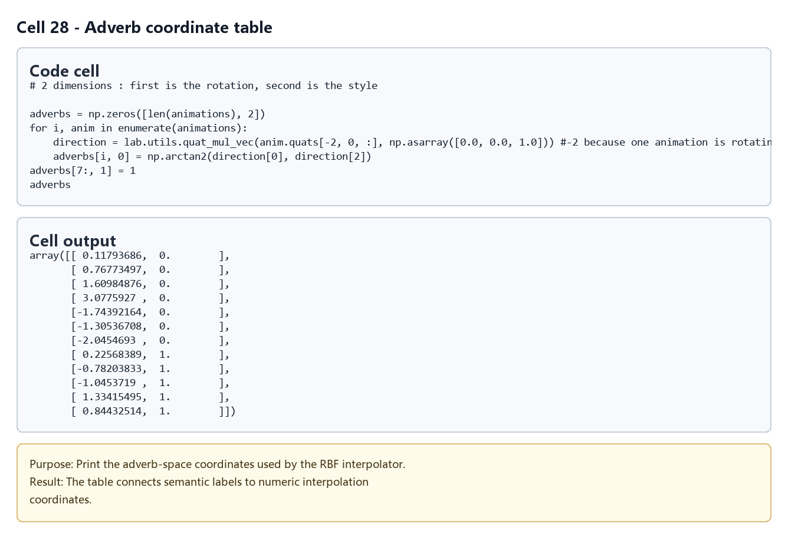
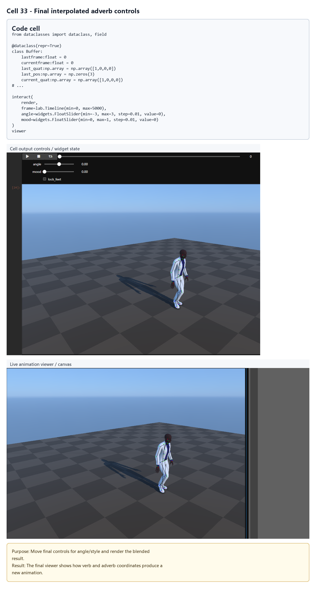

# Verbs and Adverbs：多维动作插值

## 元数据

| 字段 | 值 |
| --- | --- |
| slug | `verbs_and_adverbs` |
| source path | `labs/AnimationPapers/Verbs and Adverbs.ipynb` |
| env prefix | `.envs/verbs_and_adverbs` |
| kernel | `animationtech-verbs_and_adverbs` |
| validation status | `passed`（`manual_smoke`；自动执行通过，仍需 JupyterLab 手动冒烟） |

## 问题背景

Rose、Bodenheimer、Cohen 在 1999 年提出的 Verbs and Adverbs 思路，把一类动作称为 verb，把控制这类动作风格的连续参数称为 adverbs。对行走而言，“走”是 verb，转向角度、情绪或风格强度可以是 adverbs。Notebook 的目标是从多段样例行走动作中学习一个连续插值器，让用户通过 `angle` 和 `mood` 两个滑条生成中间动作。

这个案例的关键不是单纯混合两段 clip，而是先把所有样例变成同一相位、同一时间参数化、可循环的 canonical form，再用 B-spline 表示动作曲线，最后用 RBF 在 adverb 空间内插值 timing 和姿态控制点。

## 总模块图



## 模块拆解

### 1. 样例动作收集

Notebook 从 `walk1_subject5`、`walk3_subject1` 和 `walk3_subject1_mirror` 中截取行走片段。`ranges` 一共给出 12 段样例，其中镜像片段用于扩展转向方向。每段 clip 都通过 `AnimMapper(keep_translation=False, root_motion=True, match_effectors=True, local_offsets={'Hips':[0, 2, 0]})` 映射到统一角色。

### 2. Canonical Form

`timings` 是一个 `[12, 6]` 的整数表，每行标注一段动作的六个关键相位：开始、右脚落地、左脚抬起、左脚落地、右脚抬起、结束。交互控件允许检查或修改这些相位点，并用脚底 target 显示当前帧应被视为接触的脚。

### 3. Make the animation loop

`make_looping_animation(anim, timing)` 修正首尾姿态差，使 clip 可以循环。它先计算首尾 root 与局部骨骼 offset，再只在脚离地的相位内把脚部全局 offset 淡入，最后调用 `lab.utils.limb_ik` 保持脚部约束，减少循环接缝。

### 4. Resample

`warp_curve` 将不同长度、不同相位时间的样例统一到 canonical 时间轴。代码注释中给出的设置是 6 个 keytime、每段 80 个 interval，因此总帧数为 `(6 - 1) * 80 + 1 = 401`。这一步让所有样例可以逐帧对齐比较。

### 5. Uniform B-spline

Notebook 使用 `interval_count = 21` 和 `point_count = 23`，把每段重采样动作拟合成 B-spline 控制点。每个控制点保存每根骨骼的四元数 4 个通道和位置 3 个通道，总计 7 个通道。这样运行时不必直接插值 401 帧，而是插值更紧凑的曲线控制点。

### 6. RBF

`RBF` 类使用紧支撑的 `B3` 基函数，并带线性项。`fit` 会先解线性部分，再对残差解径向基权重；`__call__` 则在给定 adverb 坐标处求出插值值。Notebook 分别为 timing 表和 B-spline 控制点拟合 RBF 系数。

### 7. Define adverbs

`adverbs` 形状为 `[len(animations), 2]`。第一维由动作结束前 root 朝向计算转向角：`arctan2(direction[0], direction[2])`；第二维是风格或 mood，代码中将第 8 段之后的样例设为 `1`，前面的样例为 `0`。

### 8. Interpolate Adverbs

运行时 `render(frame, angle, mood, lock_feet=False)` 先用 RBF 计算当前控制参数下的六个 timing，再把当前帧映射到 generic time。随后取相邻 4 个 B-spline 控制点，对每根骨骼的 7 个通道求值，得到当前姿态。`Buffer` 保存跨帧 root 累积状态；若启用 `lock_feet`，会用 `limb_ik` 将脚部约束重新落实到当前姿态上。

## 关键数据结构

| 名称 | 形状或类型 | 作用 |
| --- | --- | --- |
| `ranges` | `dict[str, list[tuple[int, int]]]` | 从 BVH 中截取样例行走片段 |
| `animations` | `list[lab.Anim]` | 原始样例、循环后样例或重采样样例集合 |
| `timings` | `[12, 6] int` | 每段样例的 canonical 相位标注 |
| `resampled_animations` | `list[lab.Anim]` | 对齐到 401 帧时间轴后的样例 |
| `bspline_animations` | 控制点动画 | B-spline 控制点表示 |
| `adverbs` | `[12, 2]` | 每段样例在 angle/mood 参数空间的位置 |
| `timings_linear_coefs` / `timings_radial_coefs` | `[6, 3]` / `[6, 12]` | timing RBF 系数 |
| `animation_linear_coefs` / `animation_radial_coefs` | `[23, bone_count, 7, 3/12]` | 姿态控制点 RBF 系数 |
| `Buffer` | dataclass | 保存 root 累积、generic time 和脚部锁定缓存 |

## 执行结果的意义

最终交互界面把离散样例动作变成连续控制面：拖动 `angle` 会改变行走方向，拖动 `mood` 会在两类风格之间过渡。Timing 与姿态都经过相同 adverb 坐标插值，因此转向、步态节奏和骨骼姿态会一起变化，而不是只做逐帧线性混合。

## 代码 Cell 与可视化结果

本节按 notebook 的关键 code cell 组织学习素材：每个条目都对应代码目的、实际输出类型、结果意义和 PNG 学习卡片。PNG 由指定 cell 的代码摘要、输出区、viewer/canvas 或图表/日志合成，不使用整页滚动截图替代。

<video controls muted src="assets/00-walkthrough.webm"></video>

[下载 WebM](assets/00-walkthrough.webm)

| Cell | 输出类型 | 代码做什么 | 结果说明什么 | 素材 |
| --- | --- | --- | --- | --- |
| 7 | `timeline_viewer` | Render the original sample actions for different verbs/adverbs. | The viewer establishes the motion examples that will be normalized and blended. | [PNG](assets/01_raw_sample_clips.png) |
| 10 | `timeline_viewer` | Inspect clip timing with optional on-spot playback. | Canonical timing aligns examples before interpolation. | [PNG](assets/02_canonical_timing_contacts.png) |
| 14 | `timeline_viewer` | Render looped versions of the sample clips. | Looping makes repeated motion comparable across clips. | [PNG](assets/03_looping_animation_compare.png) |
| 18 | `timeline_viewer` | Render resampled clips after time normalization. | The viewer checks that examples share a common timing domain. | [PNG](assets/04_resampled_canonical_clips.png) |
| 22 | `plot` | Plot fitted B-spline curves over normalized samples. | The plot shows how sparse motion samples become smooth parameterized curves. | [PNG](assets/05_bspline_fit_plot.png) |
| 23 | `timeline_viewer` | Render the reconstructed animation from fitted curves. | The viewer validates the curve representation as playable motion. | [PNG](assets/06_bspline_reconstruction_viewer.png) |
| 28 | `table` | Print the adverb-space coordinates used by the RBF interpolator. | The table connects semantic labels to numeric interpolation coordinates. | [PNG](assets/07_adverb_coordinate_table.png) |
| 33 | `timeline_viewer` | Move final controls for angle/style and render the blended result. | The final viewer shows how verb and adverb coordinates produce a new animation. | [PNG](assets/08_final_interpolated_adverb_controls.png) |

### Cell 7 - Raw sample clip overview

- 代码做什么：Render the original sample actions for different verbs/adverbs.
- 运行后看到什么：带 timeline 的可播放 viewer。
- 结果说明什么：The viewer establishes the motion examples that will be normalized and blended.



### Cell 10 - Canonical timing and contact inspection

- 代码做什么：Inspect clip timing with optional on-spot playback.
- 运行后看到什么：带 timeline 的可播放 viewer。
- 结果说明什么：Canonical timing aligns examples before interpolation.



### Cell 14 - Looping animation comparison

- 代码做什么：Render looped versions of the sample clips.
- 运行后看到什么：带 timeline 的可播放 viewer。
- 结果说明什么：Looping makes repeated motion comparable across clips.



### Cell 18 - Resampled canonical clips

- 代码做什么：Render resampled clips after time normalization.
- 运行后看到什么：带 timeline 的可播放 viewer。
- 结果说明什么：The viewer checks that examples share a common timing domain.


### Cell 22 - B-spline curve fit

- 代码做什么：Plot fitted B-spline curves over normalized samples.
- 运行后看到什么：图表输出。
- 结果说明什么：The plot shows how sparse motion samples become smooth parameterized curves.



### Cell 23 - B-spline reconstruction viewer

- 代码做什么：Render the reconstructed animation from fitted curves.
- 运行后看到什么：带 timeline 的可播放 viewer。
- 结果说明什么：The viewer validates the curve representation as playable motion.



### Cell 28 - Adverb coordinate table

- 代码做什么：Print the adverb-space coordinates used by the RBF interpolator.
- 运行后看到什么：表格或结构化数据输出。
- 结果说明什么：The table connects semantic labels to numeric interpolation coordinates.



### Cell 33 - Final interpolated adverb controls

- 代码做什么：Move final controls for angle/style and render the blended result.
- 运行后看到什么：带 timeline 的可播放 viewer。
- 结果说明什么：The final viewer shows how verb and adverb coordinates produce a new animation.



## 运行方式

启动 AnimationPapers 的 JupyterLab 环境后，打开 `labs/AnimationPapers/Verbs and Adverbs.ipynb`，选择 kernel `animationtech-verbs_and_adverbs` 按 cell 顺序运行。

```powershell
powershell -NoProfile -ExecutionPolicy Bypass -File .\tools\start_animationpapers_lab.ps1
powershell -NoProfile -ExecutionPolicy Bypass -File .\tools\run_case.ps1 verbs_and_adverbs
```

本文档只整理 notebook 结构与工程含义，未重新执行 notebook。
