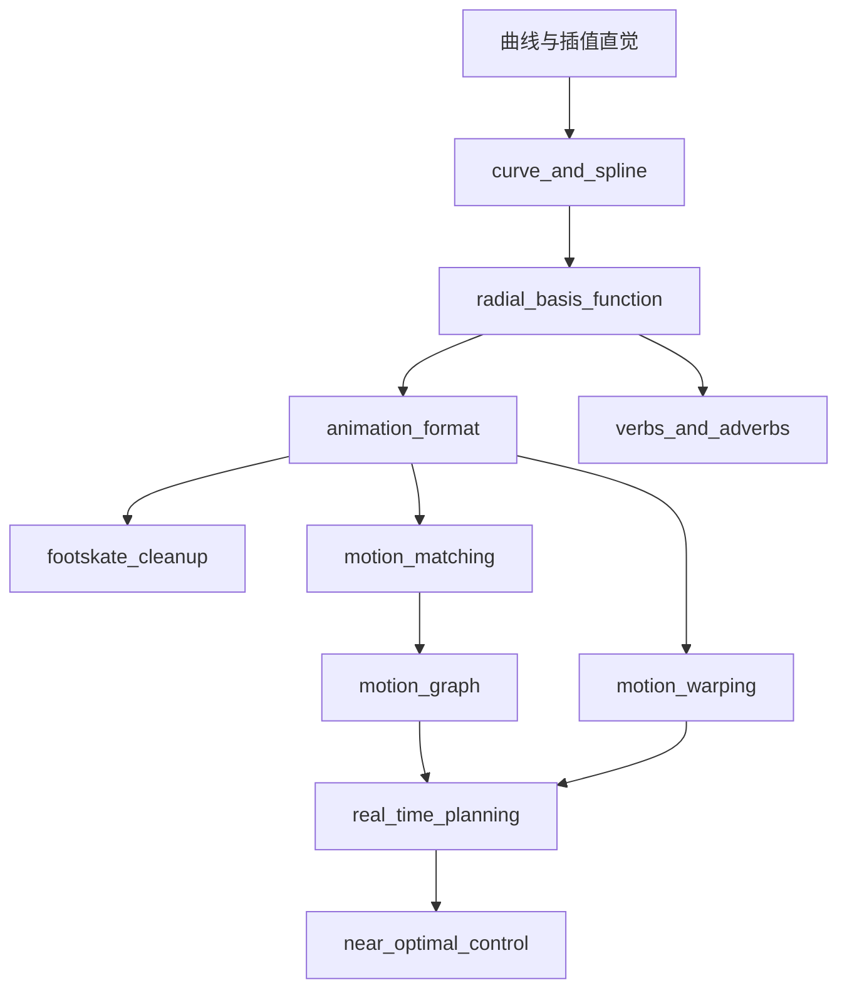
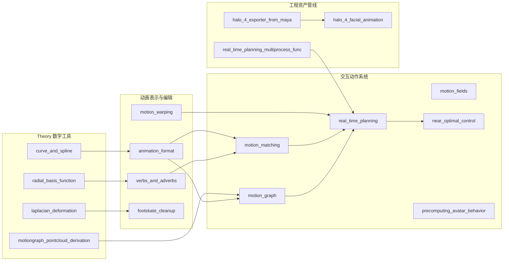

# AnimationTech 博客工程归档

`docs/blog` 是面向学习、复盘和后续发布的中文深讲博客区。它覆盖 `tools/cases.yaml` 中受管的 `labs/AnimationPapers` 与 `labs/Theory` 案例，用工程 Markdown 解释每个案例的模块结构、数据流、关键代码和执行结果意义。

当前发布状态：

- 案例覆盖：19 个受管案例全部有独立子工程、`assets/` 目录、模块图、模块拆解和运行方式。
- 媒体覆盖：19 个案例全部有学习型媒体，包含 142 张 PNG cell/source 学习卡和 19 段短 WebM walkthrough。
- 深写状态：6 个代表案例已经深写完成，剩余 13 个案例保持媒体完整的发布基底，后续可继续扩写正文密度。

## 学习入口

AnimationPapers 的交互学习优先使用稳定 JupyterLab 入口。它会检查环境、kernel 和 study notebook，打开 `.reports/study/AnimationPapers` 中的浏览器安全副本。

```powershell
powershell -NoProfile -ExecutionPolicy Bypass -File .\tools\start_animationpapers_lab.ps1
```

单案例验证和调试使用：

```powershell
powershell -NoProfile -ExecutionPolicy Bypass -File .\tools\run_case.ps1 <slug>
```

Theory 案例通常用 `run_case.ps1 <slug>` 验证。需要交互查看时，从对应 `.envs/<case>/python.exe -m jupyter lab` 启动，并切换到对应 `animationtech-*` kernel。

## 推荐学习路线



建议顺序：

1. 从 [`curve_and_spline`](Theory/curve_and_spline/README.md) 建立插值、参数和连续性的直觉。
2. 读 [`radial_basis_function`](Theory/radial_basis_function/README.md)，理解局部样本如何形成平滑控制场。
3. 读 [`animation_format`](AnimationPapers/animation_format/README.md)，理解后续所有案例的数据载体。
4. 读 [`footskate_cleanup_for_motion_capture_editing`](AnimationPapers/footskate_cleanup_for_motion_capture_editing/README.md)，观察约束如何修复动画伪影。
5. 读 [`motion_matching`](AnimationPapers/motion_matching/README.md) 与 [`motion_graph`](AnimationPapers/motion_graph/README.md)，比较检索式和图式动作合成。
6. 读 [`real_time_planning_for_parameterized_human_motion`](AnimationPapers/real_time_planning_for_parameterized_human_motion/README.md) 与 [`near_optimal_character_animation_with_continuous_control`](AnimationPapers/near_optimal_character_animation_with_continuous_control/README.md)，把动作片段、目标和代价函数连成规划控制系统。

## 案例依赖图



## 按主题索引

| 主题 | 案例 |
| --- | --- |
| 数学基础 | [`curve_and_spline`](Theory/curve_and_spline/README.md), [`radial_basis_function`](Theory/radial_basis_function/README.md), [`radial_basis_function_verbs_and_adverbs`](Theory/radial_basis_function_verbs_and_adverbs/README.md) |
| 几何与距离度量 | [`laplacian_deformation`](Theory/laplacian_deformation/README.md), [`motiongraph_pointcloud_derivation`](Theory/motiongraph_pointcloud_derivation/README.md) |
| 动画数据表示 | [`animation_format`](AnimationPapers/animation_format/README.md), [`motion_warping`](AnimationPapers/motion_warping/README.md), [`verbs_and_adverbs`](AnimationPapers/verbs_and_adverbs/README.md) |
| 约束修复与标注 | [`footskate_cleanup_for_motion_capture_editing`](AnimationPapers/footskate_cleanup_for_motion_capture_editing/README.md), [`knowing_when_to_put_your_foot_down`](AnimationPapers/knowing_when_to_put_your_foot_down/README.md) |
| 检索、图与控制 | [`motion_matching`](AnimationPapers/motion_matching/README.md), [`motion_graph`](AnimationPapers/motion_graph/README.md), [`motion_fields_for_interactive_character_animation`](AnimationPapers/motion_fields_for_interactive_character_animation/README.md) |
| 规划与预计算 | [`real_time_planning_for_parameterized_human_motion`](AnimationPapers/real_time_planning_for_parameterized_human_motion/README.md), [`near_optimal_character_animation_with_continuous_control`](AnimationPapers/near_optimal_character_animation_with_continuous_control/README.md), [`precomputing_avatar_behavior`](AnimationPapers/precomputing_avatar_behavior/README.md), [`real_time_planning_multiprocess_func`](AnimationPapers/real_time_planning_multiprocess_func/README.md) |
| 资产与面部动画 | [`halo_4_facial_animation`](AnimationPapers/halo_4_facial_animation/README.md), [`halo_4_exporter_from_maya`](AnimationPapers/halo_4_exporter_from_maya/README.md) |

## 按输出类型索引

| 输出类型 | 适合看什么 |
| --- | --- |
| `plot` / `formula` / `matrix` | 曲线、公式推导、核矩阵、距离矩阵和训练曲线。 |
| `viewer` / `timeline_viewer` | 角色姿态、动画播放、motion graph 搜索和交互控制结果。 |
| `log` / `table` / `command_log` | 环境验证、数据规模、训练状态、导出路径和脚本运行证据。 |
| `source_excerpt` / `artifact_summary` / `diagram` | Python module 的源码职责、产物结构和与 notebook 的关系。 |

## 深写完成案例

这些案例已经具备更完整的前置知识、代码执行路径、关键 cell / 函数深讲、至少 2 个 Mermaid 图、执行结果读法和素材清单。

| 分组 | slug | 主题 |
| --- | --- | --- |
| AnimationPapers | [`animation_format`](AnimationPapers/animation_format/README.md) | 动画数据格式和通道组织 |
| AnimationPapers | [`footskate_cleanup_for_motion_capture_editing`](AnimationPapers/footskate_cleanup_for_motion_capture_editing/README.md) | 脚滑检测、约束和修复 |
| AnimationPapers | [`motion_matching`](AnimationPapers/motion_matching/README.md) | 特征库检索式角色控制 |
| AnimationPapers | [`motion_graph`](AnimationPapers/motion_graph/README.md) | 动作片段图与转移边 |
| AnimationPapers | [`real_time_planning_for_parameterized_human_motion`](AnimationPapers/real_time_planning_for_parameterized_human_motion/README.md) | 参数化动作实时规划 |
| Theory | [`curve_and_spline`](Theory/curve_and_spline/README.md) | 曲线、样条、参数和连续性 |

## 全量案例索引

| 分组 | slug | 类型 | 发布状态 |
| --- | --- | --- | --- |
| AnimationPapers | [`animation_format`](AnimationPapers/animation_format/README.md) | `notebook` | 深写完成 + 媒体完整 |
| AnimationPapers | [`footskate_cleanup_for_motion_capture_editing`](AnimationPapers/footskate_cleanup_for_motion_capture_editing/README.md) | `notebook` | 深写完成 + 媒体完整 |
| AnimationPapers | [`halo_4_facial_animation`](AnimationPapers/halo_4_facial_animation/README.md) | `notebook` | 媒体完整 + 发布基底 |
| AnimationPapers | [`knowing_when_to_put_your_foot_down`](AnimationPapers/knowing_when_to_put_your_foot_down/README.md) | `notebook` | 媒体完整 + 发布基底 |
| AnimationPapers | [`motion_fields_for_interactive_character_animation`](AnimationPapers/motion_fields_for_interactive_character_animation/README.md) | `notebook` | 媒体完整 + 发布基底 |
| AnimationPapers | [`motion_graph`](AnimationPapers/motion_graph/README.md) | `notebook` | 深写完成 + 媒体完整 |
| AnimationPapers | [`motion_matching`](AnimationPapers/motion_matching/README.md) | `notebook` | 深写完成 + 媒体完整 |
| AnimationPapers | [`motion_warping`](AnimationPapers/motion_warping/README.md) | `notebook` | 媒体完整 + 发布基底 |
| AnimationPapers | [`near_optimal_character_animation_with_continuous_control`](AnimationPapers/near_optimal_character_animation_with_continuous_control/README.md) | `notebook` | 媒体完整 + 交互说明增强 |
| AnimationPapers | [`precomputing_avatar_behavior`](AnimationPapers/precomputing_avatar_behavior/README.md) | `notebook` | 媒体完整 + 发布基底 |
| AnimationPapers | [`real_time_planning_for_parameterized_human_motion`](AnimationPapers/real_time_planning_for_parameterized_human_motion/README.md) | `notebook` | 深写完成 + 媒体完整 |
| AnimationPapers | [`verbs_and_adverbs`](AnimationPapers/verbs_and_adverbs/README.md) | `notebook` | 媒体完整 + 发布基底 |
| AnimationPapers | [`real_time_planning_multiprocess_func`](AnimationPapers/real_time_planning_multiprocess_func/README.md) | `python_module` | 媒体完整 + 源码证据 |
| AnimationPapers | [`halo_4_exporter_from_maya`](AnimationPapers/halo_4_exporter_from_maya/README.md) | `python_module` | 媒体完整 + 源码证据 |
| Theory | [`curve_and_spline`](Theory/curve_and_spline/README.md) | `notebook` | 深写完成 + 媒体完整 |
| Theory | [`laplacian_deformation`](Theory/laplacian_deformation/README.md) | `notebook` | 媒体完整 + 发布基底 |
| Theory | [`motiongraph_pointcloud_derivation`](Theory/motiongraph_pointcloud_derivation/README.md) | `notebook` | 媒体完整 + 发布基底 |
| Theory | [`radial_basis_function`](Theory/radial_basis_function/README.md) | `notebook` | 媒体完整 + 术语说明增强 |
| Theory | [`radial_basis_function_verbs_and_adverbs`](Theory/radial_basis_function_verbs_and_adverbs/README.md) | `notebook` | 媒体完整 + 发布基底 |

## 发布前检查

运行质量门：

```powershell
powershell -NoProfile -ExecutionPolicy Bypass -File .\docs\blog\check_blog_docs.ps1
```

生成只读状态报告：

```powershell
powershell -NoProfile -ExecutionPolicy Bypass -File .\docs\blog\report_blog_docs.ps1
```

检查脚本会确认 manifest 覆盖、README 和 assets 目录、Mermaid 图、核心章节、媒体文件、source 路径、素材引用、导航可达性和常见生成文案瑕疵。报告脚本用于发布前快速查看案例数、媒体数、未引用素材和潜在断链；两个脚本都只读文件，不执行 notebook。

## 目录约定

每个案例目录包含：

- `README.md`：canonical 博客正文。
- `assets/`：PNG 学习卡、WebM walkthrough、图示和后续素材。
- `assets/README.md`：素材清单，说明每个 PNG/WebM 的来源、用途和对应正文位置。

`docs/examples/Footskate Cleanup for Motion Capture Editing.md` 和 PDF 保留为素材源；canonical 工程化版本放在 `docs/blog/AnimationPapers/footskate_cleanup_for_motion_capture_editing/README.md`。

## 未纳入正式归档的参考

`labs/AnimationPapers/Animation Format_inv.ipynb` 当前没有收录在 `tools/cases.yaml` 中，因此不生成正式受管案例目录。它可以作为 `animation_format` 的扩展参考。
