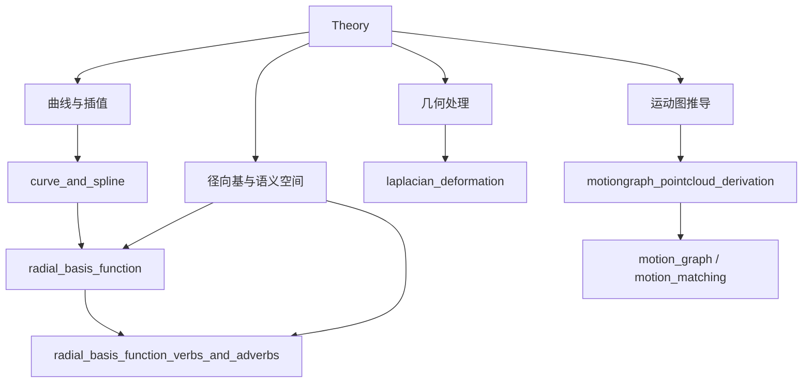

# Theory 博客导航

Theory 分组对应后续动画案例所依赖的数学和几何基础。建议先读曲线、RBF 和 Laplacian，再回到 AnimationPapers 中观察这些工具如何落地到动作插值、约束修复和图结构。

单案例验证使用：

```powershell
powershell -NoProfile -ExecutionPolicy Bypass -File .\tools\run_case.ps1 <slug>
```

发布状态：5 个 notebook 全部有 README、assets 清单、结果媒体和运行入口；每篇都已经补齐前置知识、代码执行路径、关键 cell / 函数深讲、结果读法和素材索引。

## 分组模块图



## 推荐阅读路线

1. [`curve_and_spline`](curve_and_spline/README.md)：先建立参数曲线、控制点、连续性和动画 keyframe 的共同语言。
2. [`radial_basis_function`](radial_basis_function/README.md)：理解局部样本如何通过核函数形成连续插值场。
3. [`radial_basis_function_verbs_and_adverbs`](radial_basis_function_verbs_and_adverbs/README.md)：把 RBF 迁移到语义控制空间。
4. [`laplacian_deformation`](laplacian_deformation/README.md)：理解图结构、约束点和 differential coordinates 如何驱动形变。
5. [`motiongraph_pointcloud_derivation`](motiongraph_pointcloud_derivation/README.md)：把点云距离推导连接到 motion graph 的转移判断。

## 深写完成案例

| slug | 读它时重点看什么 |
| --- | --- |
| [`curve_and_spline`](curve_and_spline/README.md) | 参数、控制点、插值和连续性如何决定曲线形状与运动速度。 |
| [`laplacian_deformation`](laplacian_deformation/README.md) | Laplacian 坐标、锚点约束和旋转不变性如何把局部形变传播到整体网格。 |
| [`motiongraph_pointcloud_derivation`](motiongraph_pointcloud_derivation/README.md) | 从加权点云误差推到 Motion Graph 转移对齐的闭式解。 |
| [`radial_basis_function`](radial_basis_function/README.md) | 从 Gaussian kernel、权重求解和多项式增强理解 RBF 插值。 |
| [`radial_basis_function_verbs_and_adverbs`](radial_basis_function_verbs_and_adverbs/README.md) | 把线性项和 RBF 残差迁移到动作语义控制空间。 |

## 全量案例列表

| slug | 类型 | 发布状态 |
| --- | --- | --- |
| [`curve_and_spline`](curve_and_spline/README.md) | `notebook` | 深写完成 + 媒体完整 |
| [`laplacian_deformation`](laplacian_deformation/README.md) | `notebook` | 深写完成 + 媒体完整 |
| [`motiongraph_pointcloud_derivation`](motiongraph_pointcloud_derivation/README.md) | `notebook` | 深写完成 + 媒体完整 |
| [`radial_basis_function`](radial_basis_function/README.md) | `notebook` | 深写完成 + 媒体完整 |
| [`radial_basis_function_verbs_and_adverbs`](radial_basis_function_verbs_and_adverbs/README.md) | `notebook` | 深写完成 + 媒体完整 |

## 媒体与阅读建议

本分组当前有 42 张结果 PNG、42 张学习卡 PNG、3 个 GIF 预览、3 个 MP4/H.264、3 个 WebM/VP9 和 5 段 walkthrough WebM。素材覆盖图表、公式、矩阵、viewer 和交互控件状态，适合把数学推导和 notebook 输出并排阅读。

先看“总模块图”，建立输入、核心算法和输出之间的关系。再看“代码执行路径”，把 notebook 的 cell 顺序翻译成工程流水线。最后看“执行结果的意义”，明确图像、曲线或数值日志到底在验证什么。

这组案例不依赖 AnimationPapers stable study 目录；它们主要通过 `run_case.ps1 <slug>` 验证，并在需要时手动打开对应 kernel 交互查看。
