# 曲线与样条：从 Bezier 到 B-Spline

## 元数据

| 字段 | 内容 |
| --- | --- |
| slug | `curve_and_spline` |
| source path | [`labs/Theory/curve_and_spline.ipynb`](../../../../labs/Theory/curve_and_spline.ipynb) |
| env prefix | `.envs/curve_and_spline` |
| kernel | `animationtech-curve_and_spline` |
| validation status | `passed` (`automated`) |

## 问题背景

动画里的曲线不只是一条好看的线。它可以是角色手腕在空间中的运动路径，也可以是某个属性随帧号变化的动画曲线，例如位置、旋转角、缩放、表情权重或镜头焦距。曲线系统真正要解决的问题，是如何用少量可编辑的点生成连续、平滑、可预测的中间值。

这个 notebook 从 approximation curve 和 interpolation curve 的区别出发，逐步讲 Bezier、Hermite、Cardinal/Catmull-Rom、均匀三次 B-Spline，以及一维关键帧曲线中的时间参数化问题。前半部分关注几何构造：控制点如何影响曲线、基函数如何分配权重、切线如何控制端点速度。后半部分把这些曲线放回动画时间轴，说明为什么同一套公式遇到非均匀 key time 时会出现“形状看着对，但采样时间不对”的问题。

读完这篇应当能回答几个工程上很常见的问题：为什么 Bezier 曲线通常不穿过中间控制点？为什么 Hermite 要显式给切线？Catmull-Rom 为什么适合“穿过这些点”的路径？B-Spline 为什么常被用于平滑拟合？以及动画曲线里的 `t` 为什么不是天然等于帧号？

## 阅读前置知识

- **线性插值 `lerp`**：理解 `A * (1 - t) + B * t`，并知道 `t = 0` 在起点、`t = 1` 在终点。
- **向量和矩阵乘法**：notebook 会把曲线写成“基函数向量乘控制点矩阵”的形式。
- **多项式函数**：尤其是一、二、三次多项式对曲线形状和斜率的影响。
- **导数概念**：导数可以理解为曲线在某一点的瞬时变化率；在动画里，它对应速度或斜率。
- **关键帧动画常识**：知道 key time、key value、tangent 和 frame sampling 的基本含义即可。

## 核心概念：插值、拟合与参数

**插值 interpolation** 要求曲线穿过给定样本点。Hermite、Cardinal 和 Catmull-Rom 在 notebook 中主要以插值曲线出现：给定关键点后，曲线会经过这些点。动画师常希望角色路径或动画属性在某些帧精确达到指定值，这时插值很自然。

**拟合 approximation / fitting** 不要求穿过每个控制点，而是用控制点塑造整体趋势。Bezier 的中间控制点通常只“拉动”曲线；B-Spline 也多用于平滑地靠近控制点。拟合的好处是稳定、平滑、局部可控，坏处是如果某个点必须被精确命中，就需要额外约束或换用插值形式。

**参数 `t`** 是曲线内部的求值坐标，不等于屏幕 x 坐标，也不必等于帧号。对单段曲线，`t` 通常归一化到 `[0, 1]`；对分段曲线，`t` 可能覆盖多个区间，例如 `[0, 段数]`。在一维动画曲线中，横轴是真实时间或帧号，曲线公式里的 `t` 只是“沿曲线走到哪里”的参数。非均匀关键帧最容易出错的地方，就是把均匀 `t` 当成真实时间。

**控制点 control point** 是可编辑输入，不一定是曲线必经点。Bezier 和 B-Spline 的控制点更像形状手柄；Hermite 的端点是必经点，切线则是速度手柄；Cardinal/Catmull-Rom 用相邻点自动估计切线，因此编辑成本更低。

**连续性 continuity** 描述分段曲线接缝处是否平滑。`C0` 表示位置连续，曲线不断开；`C1` 表示一阶导数连续，速度方向不突然跳变；`C2` 表示二阶导数连续，加速度更平滑。动画中，`C1` 断裂常表现为速度突变，`C2` 不连续则可能让运动的加速度观感不够柔和。

**导数 / 速度** 在二维空间曲线中是切向量，在一维动画曲线中是值随时间变化的斜率。斜率越大，属性变化越快；斜率为 0，则在关键帧附近形成停顿或缓入缓出。

## 总模块图

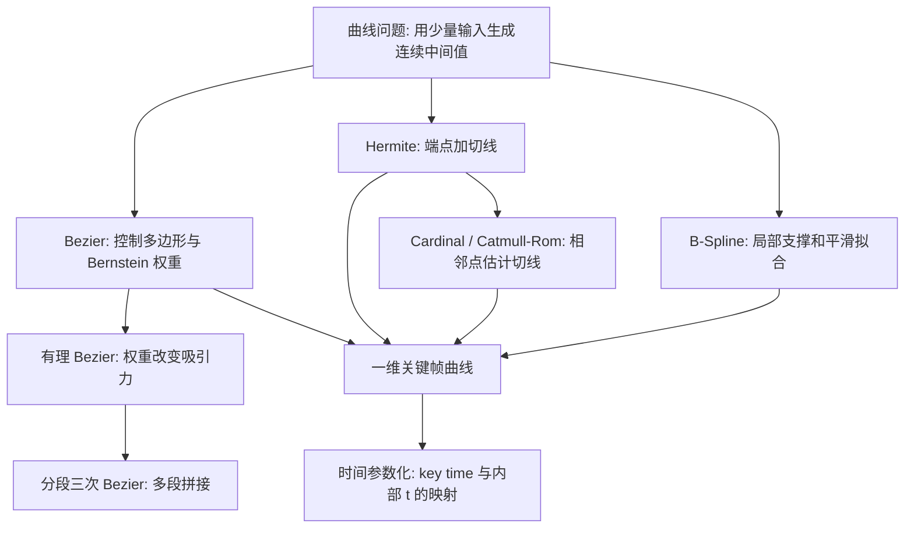

## 代码执行路径

notebook 的执行路径是由简单到复杂、由几何曲线到动画曲线：


这条路径很适合学习：先用 De Casteljau 的几何递推建立直觉，再用 Bernstein 和矩阵形式获得可实现的公式；然后从“控制点拉动曲线”过渡到“端点和切线定义运动”；最后把曲线放进真实关键帧时间轴，观察参数化带来的工程问题。

## 模块拆解

1. **曲线类型总览**

   notebook 首先区分 approximation curve 与 interpolation curve。Bezier 和 B-Spline 属于典型的近似控制：曲线一般经过首尾点，但中间控制点主要影响形状。Hermite 与 Cardinal 更强调插值：曲线穿过给定点，然后通过切线或自动切线控制过点时的方向和速度。

2. **Bezier 与 De Casteljau**

   `castlejau(t, P, ax_draw=None)` 用递归线性插值实现 Bezier 求值。给定控制点 `P` 后，每一层都在相邻点之间做 `lerp`，直到只剩一个点，这个点就是曲线在 `t` 处的位置。交互图里拖动 `x` 滑块时，能看到控制多边形逐层收缩，直观说明 Bezier 曲线为什么被控制多边形包围、为什么中间控制点更像吸引手柄。

3. **Bernstein 基函数与 Bezier 求值**

   `bernstein_basis(n, k, t)` 定义第 `k` 个 Bernstein 基函数，`bezier(P, t)` 则把所有基函数权重乘到对应控制点上再求和。这里的重点是“权重分配”：对任意 `t`，所有 Bernstein 基函数之和为 1，因此曲线点是控制点的加权平均。图像中每条 basis 曲线表示某个控制点在不同 `t` 位置的影响力。

4. **近似函数与有理 Bezier**

   notebook 用 Bernstein 多项式拟合一个一维函数，展示阶数升高后曲线如何更接近目标函数。`rational_bezier(P, w, t)` 又给控制点增加权重 `w`：权重越大，该控制点对曲线的吸引越强。有理形式是许多 CAD 曲线和 NURBS 的基础，因为它能表达普通多项式 Bezier 难以精确表示的形状。

5. **三次 Bezier 与分段拼接**

   `cubic_bezier(P, t)` 固定使用 4 个控制点构造三次 Bezier。三次曲线是动画和图形系统里的常用折中：控制点不多，能表达端点位置和端点切线，又能形成足够自然的缓入缓出。`cubic_bezier_spline(P, t)` 把多段三次 Bezier 串起来，开始进入“分段曲线”的世界。

6. **Hermite 曲线**

   `hermite(Pt, t)` 使用两个端点和两个切线求一段曲线。Hermite 的输入不是纯控制多边形，而是 `[起点值, 起点切线, 终点值, 终点切线]` 这样的语义控制量。对动画来说这非常直接：关键帧值决定曲线穿过哪里，切线决定进入和离开关键帧时的速度。

7. **Cardinal 与 Catmull-Rom**

   `cardinal_to_hermite_with_s(Pts, s)` 和 `cardinal_to_hermite(Pts, tension)` 用相邻点差分估计 Hermite 切线。Catmull-Rom 可以看作 tension 为 0 的 Cardinal 风格插值：它穿过中间点，并自动给出看起来比较自然的切线。`cardinal_continuity` 通过一阶、二阶差分图观察连接处变化，帮助理解位置、速度和加速度连续性的区别。

8. **均匀三次 B-Spline**

   B-Spline 部分先用几何构造展示 De Boor 思路，再用 `fb_0` 到 `fb_3`、`bspline_segment(Pt, t)` 和 `bspline(P, t)` 写成可执行函数。B-Spline 每一段只受附近少数控制点影响，这叫局部支撑。移动一个控制点只影响周围几段，不会像高阶全局多项式那样牵动整条曲线，因此很适合做稳定的动画曲线和平滑路径。

9. **一维关键帧曲线**

   最后一大段把曲线从二维图形切换到一维动画值。`keytimes` 是横轴帧号，`keyvalues` 是关键帧值，`keytangents` 是每个关键帧的斜率。Hermite 示例会把真实帧区间缩放回 `[0, 1]` 再求值；Cardinal 示例对比均匀与非均匀 key time；Bezier 示例用 `find_bezier_root` 根据目标帧号反求内部参数；B-Spline 示例用 `scipy.optimize.minimize` 寻找能最小化误差的控制值。

## 核心函数速览

### `castlejau(t, P, ax_draw=None)`

这个函数是整篇最重要的几何入口。它接收采样参数 `t` 和控制点数组 `P`。当 `P` 只剩一个点时返回该点；否则分别对 `P[:-1]` 和 `P[1:]` 递归求值，再对两边结果做一次线性插值。换句话说，Bezier 曲线并不是神秘公式，而是重复做“在两点之间按比例取点”。

读图时要看三层信息：原始控制点形成的折线、递归中间层的辅助线、最终曲线点。随着 `t` 从 0 走到 1，最终点沿曲线移动；辅助线展示的是当前 `t` 下的构造过程。

### `bernstein_basis(n, k, t)` 与 `bezier(P, t)`

Bernstein 形式把 De Casteljau 的递归几何变成显式权重：

```text
B_k^n(t) = C(n, k) * (1 - t)^(n-k) * t^k
```

`bezier(P, t)` 对每个控制点乘上对应的 `B_k^n(t)` 并求和。basis 图中，峰值靠左的函数主要影响曲线开头，峰值靠右的函数主要影响曲线末尾。所有 basis 加起来为 1，意味着曲线点不会凭空脱离控制点定义出的加权范围。

### `rational_bezier(P, w, t)`

普通 Bezier 只有控制点位置；有理 Bezier 额外引入权重 `w`。函数先计算加权控制点和加权基函数，再用分子除以分母完成归一化。读这类图时，重点看权重变化后曲线是否更靠近某个控制点。权重不是让曲线“必须经过”该点，而是改变该点的吸引力。

### `hermite(Pt, t)` 与 `hermite_spline(P, t)`

Hermite 曲线把控制量改成端点和切线。`Pt` 中偶数位置是点，奇数位置是切线；`hermite_spline` 每次取 4 个量组成一段 `[P0, T0, P1, T1]`。这里的导数意义非常明确：二维曲线中切线是运动方向和速度尺度；一维动画曲线中切线是每帧值变化率。

如果图上某个关键帧的切线很陡，曲线离开该帧时变化就快；如果切线接近水平，曲线会在该帧附近停留更久，形成缓入或缓出。

### `cardinal_to_hermite(Pts, tension)` 与 `cardinal_spline(P, t, tension)`

Cardinal 的核心是自动切线：用前后点差分估计当前点的切线，再交给 Hermite 求值。`tension` 会缩放切线长度。tension 小，曲线更松、更容易外摆；tension 大，切线变短，曲线更贴近折线。notebook 中的注释也提醒：当把 Cardinal 直接搬到非均匀 key time 上时，tension 本身不能解决时间间隔不等的问题。

### `cardinal_continuity(t, points=...)`

这个 cell 用采样点差分近似导数，再画出变化趋势。第一张曲线展示位置，后续差分图展示斜率变化。它的学习价值在于：位置连续不代表速度连续，速度连续也不代表加速度连续。动画里接缝处的抖动、突然变速或不自然的顿挫，往往要从导数连续性里找原因。

### `bspline_segment(Pt, t)` 与 `bspline(P, t)`

均匀三次 B-Spline 每段使用 4 个相邻控制点。`bspline_segment` 计算单段，`bspline` 根据 `t` 所在区间选择对应控制点窗口。和 Bezier 相比，B-Spline 的优势是局部支撑：修改一个控制点只影响附近曲线，整体不会大范围变形。它通常不是为了穿过所有控制点，而是为了生成稳定平滑的近似。

### `find_bezier_root(Pts, at_x)`

一维 Bezier 动画曲线中，横轴本身也是一条 Bezier 曲线。给定某个真实帧号 `at_x`，不能直接把它当 `t` 使用，而要先求解“Bezier 的 x 分量在哪个 `t` 等于这个帧号”。`find_bezier_root` 做的就是这个反解。这个 cell 是从几何曲线走向动画曲线的关键：时间不是被动背景，而是曲线求值的一部分。

### `error_function(y_points)` 与 B-Spline 拟合

最后的拟合示例中，`bspline(P)` 根据候选控制值生成曲线，`error_function(y_points)` 计算曲线采样值与目标函数之间的误差，`minimize` 搜索更合适的控制值。这里的 B-Spline 是拟合问题，不是插值问题：目标不是穿过每个采样点，而是在整体误差最小的意义下得到平滑曲线。

## 关键数据结构

- `P3`、`P4`、`P5`、`BEZIER_CONTROL_SETS`：二维 Bezier 控制点集合，用来比较不同阶数和控制多边形形状。
- `t`、`ts`、`t_curve`：曲线内部参数，常用于 `[0, 1]` 单段采样或多段样条采样。
- `frames`：真实帧号采样序列，用于把一维动画曲线画回时间轴。
- `M`、`Hm`、`CCM`、`BS`、`T`：Bezier、Hermite、Cardinal、B-Spline 的基矩阵或采样矩阵。
- `Pt`、`Pts`、`HPts`：不同曲线函数的输入点集；在 Hermite 中通常交替存储点和切线。
- `keytimes`：关键帧时间，是真实横轴，不应直接等同于曲线内部 `t`。
- `keyvalues`：关键帧上的属性值。
- `keytangents`：关键帧切线，也就是属性值相对时间的变化率。
- `cardinal_pts`、`p_to_hermite`：把 Cardinal 点转成 Hermite 端点和切线后的中间表示。
- `bezier_pts`、`frames_t`：Bezier 时间曲线中的二维控制点和反解得到的内部参数。
- `optimal_y_values`、`cs_optimal`：B-Spline 拟合中优化出的控制值和最终拟合曲线。

## 执行结果的意义

Bezier 交互图的重点是控制多边形与曲线响应。移动中间控制点会拉动曲线，但曲线不一定穿过它；首尾控制点则决定曲线端点。De Casteljau 辅助线说明当前 `t` 下曲线点是怎样一步步插值得到的。

Bernstein basis 图要看每条基函数的峰值位置和总和。某个 basis 在某段 `t` 上越高，对应控制点对该段曲线的影响越强；所有 basis 的总和保持为 1，保证加权平均稳定。

Hermite 图要看端点和切线。端点决定曲线必须经过哪里；切线方向决定离开端点时往哪走；切线长度影响速度感和弯曲幅度。在一维动画图里，切线越陡，数值变化越快。

Cardinal/Catmull-Rom 图要看曲线是否穿过中间点，以及 tension 改变后外摆幅度如何变化。它很适合快速生成穿点路径，但当点在时间轴上不均匀分布时，必须重新考虑时间尺度，否则会把“点序号均匀”误当成“时间均匀”。

B-Spline 图要看平滑性和局部支撑。曲线通常不穿过所有控制点，而是在控制点附近平滑流过。它的优势是稳定、连续性好、局部修改影响有限，因此适合做平滑拟合和可编辑动画曲线。

最后的一维关键帧图是整篇的工程落点。横轴是帧号，纵轴是属性值；灰色采样点和竖线展示每一帧会读到什么值。如果关键帧时间不均匀，曲线内部 `t` 与真实帧号之间的映射必须显式处理。否则曲线公式本身正确，动画采样仍然可能错位。

## 结果阅读导引

本节按 notebook 的关键 code cell 组织学习素材：每个条目都对应代码目的、实际输出类型、结果意义和 PNG 学习卡片。PNG 由指定 cell 的代码摘要、输出区、viewer/canvas 或图表/日志合成，不使用整页滚动截图替代。


| Cell | 输出类型 | 代码做什么 | 结果说明什么 | 素材 |
| --- | --- | --- | --- | --- |
| 13 | `plot` | Plot Bezier curves of different orders with their control points. | The curve is constrained by the control polygon rather than being an isolated function plot. | [PNG](assets/01-bezier-de-casteljau.png) |
| 64 | `plot` | Plot recursively constructed B-Spline basis functions. | Local support explains why one B-Spline control point affects only a local curve span. | [PNG](assets/02-bernstein-basis.png) |
| 22 | `plot` | Connect multiple cubic Bezier spans and draw their control points. | Long paths are built from local spans, and shared endpoints control continuity. | [PNG](assets/03-bezier-control-polygon.png) |
| 15 | `log` | Expand the De Casteljau form using SymPy. | The symbolic output proves that recursive interpolation and Bernstein polynomials describe the same cubic Bezier. | [PNG](assets/04-rational-bezier-weight.png) |
| 24 | `plot` | Compare low-order and cubic polynomial interpolation behavior. | Cubic curves can control both position and derivative, which is why they are common in animation curves. | [PNG](assets/05-cubic-bezier-spline.png) |
| 40 | `plot` | Plot a 2D Hermite curve with endpoint tangent controls. | Velocity and tangent information are as important as position values in animation curves. | [PNG](assets/06-hermite-tangents.png) |
| 56 | `plot` | Plot a Cardinal spline with control points. | Cardinal splines estimate tangents from neighboring points and pass through key points. | [PNG](assets/07-cardinal-tension.png) |
| 62 | `plot` | Plot interpolation points, midpoints, and helper structures for continuity. | The output separates positional continuity, velocity continuity, and higher-order smoothness. | [PNG](assets/08-cardinal-continuity.png) |
| 72 | `plot` | Plot a uniform cubic B-Spline and its control points. | B-Splines are smooth approximations and usually do not pass through every control point. | [PNG](assets/09-bspline-local-support.png) |
| 77 | `plot` | Generate a 1D Hermite curve from key time, key value, and tangent. | This transfers geometric curve ideas to animation-editor keyframe curves. | [PNG](assets/10-keyframe-hermite.png) |
| 83 | `plot` | Compare Cardinal sampling under non-uniform key times. | Treating parameter t as real time can place samples incorrectly. | [PNG](assets/11-nonuniform-cardinal-time.png) |
| 88 | `plot` | Show a non-uniform Bezier time curve and recovered internal parameter. | Animation systems often need to solve internal curve parameters from frame time. | [PNG](assets/12-bezier-time-root.png) |
| 92 | `plot` | Fit a complex sampled function with a uniform cubic B-Spline. | The fitted curve does not need to pass through every sample, but it preserves a stable trend. | [PNG](assets/13-bspline-fitting.png) |

## 关键 cell / 函数深讲

### Cell 13 - Bezier control polygons and curves

展示由不同控制多边形生成的 Bezier 曲线，说明曲线形状是如何被控制点拉动的。


- 代码做什么：Plot Bezier curves of different orders with their control points.
- 运行后看到什么：`plot`
- 结果说明什么：The curve is constrained by the control polygon rather than being an isolated function plot.
- 可视化主体：Bezier control polygons and curves
- 捕获方式：`plot`

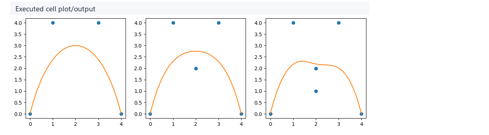

### Cell 64 - Cox-De Boor basis functions

绘制 B-Spline 的基函数曲线，展示其局部支撑性质。


- 代码做什么：Plot recursively constructed B-Spline basis functions.
- 运行后看到什么：`plot`
- 结果说明什么：Local support explains why one B-Spline control point affects only a local curve span.
- 可视化主体：Cox-De Boor basis functions
- 捕获方式：`plot`

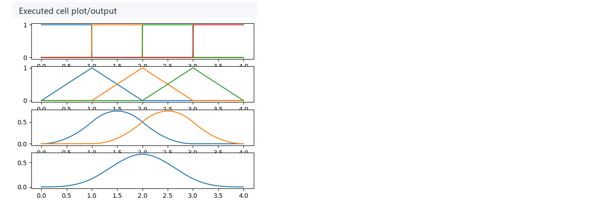

### Cell 22 - Multi-segment Bezier spline

将多段三次 Bezier 曲线连接在一起，展示分段样条的构造。


- 代码做什么：Connect multiple cubic Bezier spans and draw their control points.
- 运行后看到什么：`plot`
- 结果说明什么：Long paths are built from local spans, and shared endpoints control continuity.
- 可视化主体：Multi-segment Bezier spline
- 捕获方式：`plot`

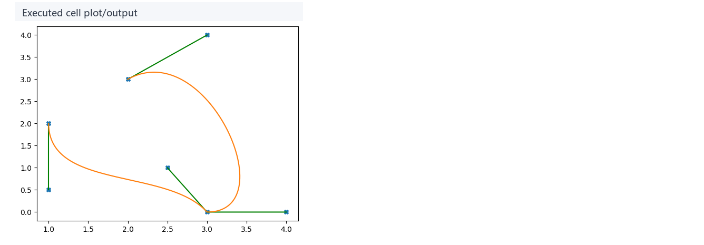

### Cell 15 - De Casteljau versus Bernstein derivation

利用 SymPy 将递归的 De Casteljau 算法展开为符号表达式。


- 代码做什么：Expand the De Casteljau form using SymPy.
- 运行后看到什么：`log`
- 结果说明什么：The symbolic output proves that recursive interpolation and Bernstein polynomials describe the same cubic Bezier.
- 可视化主体：De Casteljau versus Bernstein derivation
- 捕获方式：`log`

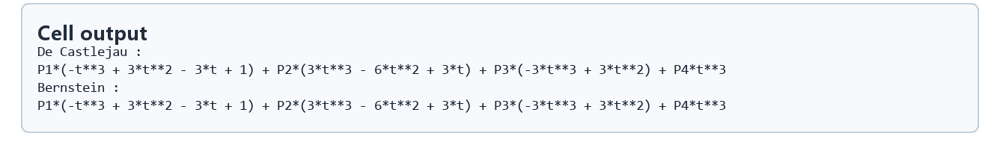

### Cell 24 - Cubic curve shape control

比较低阶多项式与三次多项式的曲线形态。

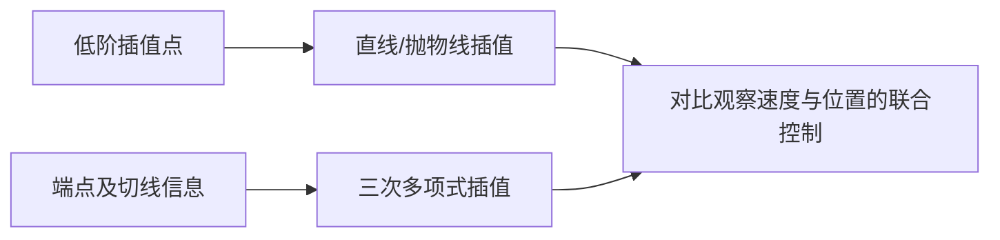

- 代码做什么：Compare low-order and cubic polynomial interpolation behavior.
- 运行后看到什么：`plot`
- 结果说明什么：Cubic curves can control both position and derivative, which is why they are common in animation curves.
- 可视化主体：Cubic curve shape control
- 捕获方式：`plot`

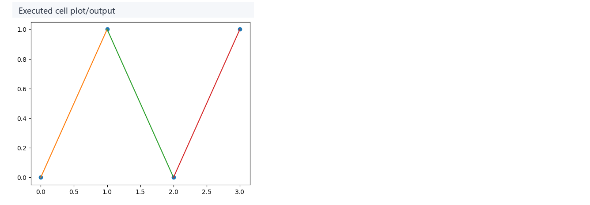

### Cell 40 - Hermite endpoints and tangents

利用端点位置和切线向量绘制 2D Hermite 曲线。

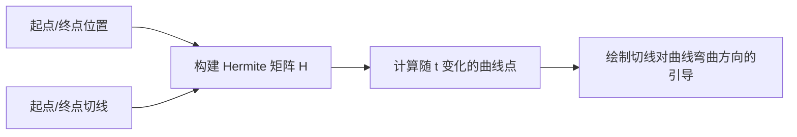

- 代码做什么：Plot a 2D Hermite curve with endpoint tangent controls.
- 运行后看到什么：`plot`
- 结果说明什么：Velocity and tangent information are as important as position values in animation curves.
- 可视化主体：Hermite endpoints and tangents
- 捕获方式：`plot`

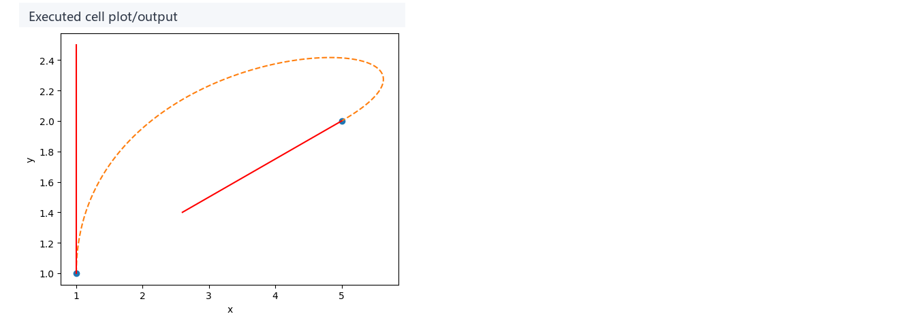

### Cell 56 - Cardinal spline tension

绘制一条通过一系列控制点的 Cardinal 样条，并观察张力（tension）参数的作用。


- 代码做什么：Plot a Cardinal spline with control points.
- 运行后看到什么：`plot`
- 结果说明什么：Cardinal splines estimate tangents from neighboring points and pass through key points.
- 可视化主体：Cardinal spline tension
- 捕获方式：`plot`

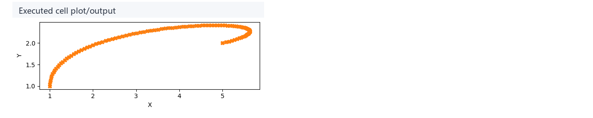

### Cell 62 - Continuity construction

分解样条在连接点处的位置、速度以及更高级别的连续性差异。

```mermaid
flowchart LR
    A[连接点两侧的函数分段] --> B[求取位置值差分]
    B --> C[求取一阶导数（速度）差分]
    C --> D[图表对比各类连续性 (C0/C1)]
```

- 代码做什么：Plot interpolation points, midpoints, and helper structures for continuity.
- 运行后看到什么：`plot`
- 结果说明什么：The output separates positional continuity, velocity continuity, and higher-order smoothness.
- 可视化主体：Continuity construction
- 捕获方式：`plot`

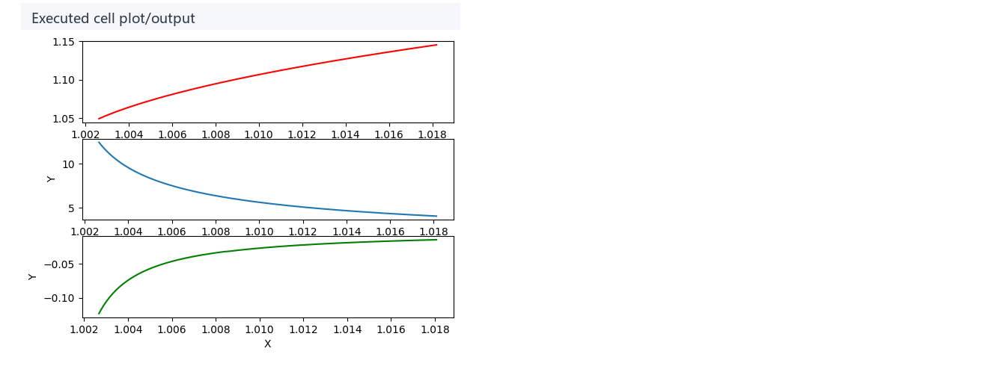

### Cell 72 - Uniform cubic B-Spline

绘制均匀三次 B-Spline，强调其平滑的拟合特点及不强制穿过控制点的特性。


- 代码做什么：Plot a uniform cubic B-Spline and its control points.
- 运行后看到什么：`plot`
- 结果说明什么：B-Splines are smooth approximations and usually do not pass through every control point.
- 可视化主体：Uniform cubic B-Spline
- 捕获方式：`plot`

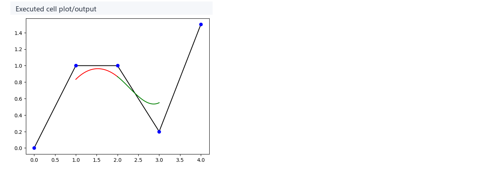

### Cell 77 - 1D Hermite keyframe curve

将前文的几何曲线概念迁移到一维关键帧动画曲线，利用关键时间、关键值和切线生成动画轨迹。

```mermaid
flowchart LR
    A[真实关键帧时间与值] --> B[时间轴参数化至 [0, 1] t]
    C[关键帧切线(变化率)] --> B
    B --> D[计算每一帧的插值输出]
```

- 代码做什么：Generate a 1D Hermite curve from key time, key value, and tangent.
- 运行后看到什么：`plot`
- 结果说明什么：This transfers geometric curve ideas to animation-editor keyframe curves.
- 可视化主体：1D Hermite keyframe curve
- 捕获方式：`plot`

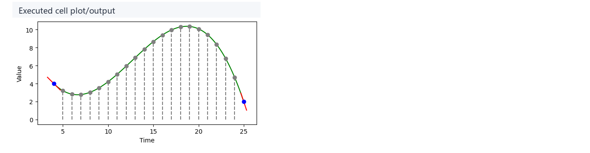

### Cell 83 - Non-uniform Cardinal time

展示在非均匀关键帧时间下，单纯将参数 t 视作真实时间所带来的采样偏移问题。


- 代码做什么：Compare Cardinal sampling under non-uniform key times.
- 运行后看到什么：`plot`
- 结果说明什么：Treating parameter t as real time can place samples incorrectly.
- 可视化主体：Non-uniform Cardinal time
- 捕获方式：`plot`

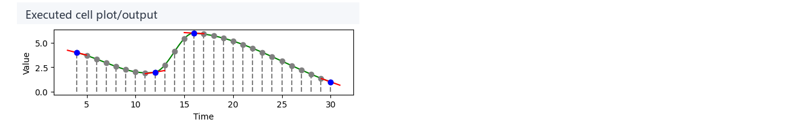

### Cell 88 - Bezier time root solving

演示如何反解 Bezier 参数曲线以找出内部参数 t 对应的真实帧号。


- 代码做什么：Show a non-uniform Bezier time curve and recovered internal parameter.
- 运行后看到什么：`plot`
- 结果说明什么：Animation systems often need to solve internal curve parameters from frame time.
- 可视化主体：Bezier time root solving
- 捕获方式：`plot`

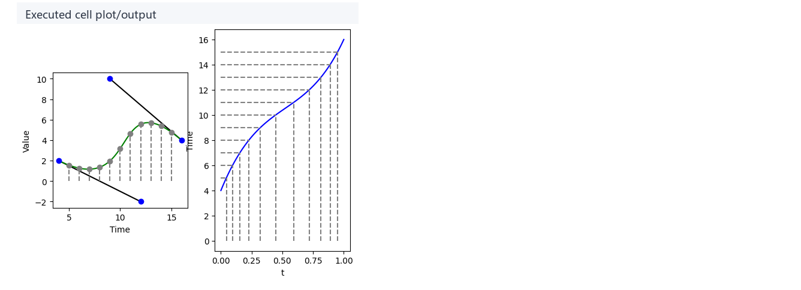

### Cell 92 - B-Spline least-squares fitting

利用最小二乘法拟合 B-Spline 控制点，使其逼近一段复杂的采样函数。


- 代码做什么：Fit a complex sampled function with a uniform cubic B-Spline.
- 运行后看到什么：`plot`
- 结果说明什么：The fitted curve does not need to pass through every sample, but it preserves a stable trend.
- 可视化主体：B-Spline least-squares fitting
- 捕获方式：`plot`

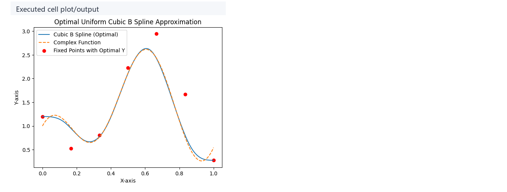

## 运行方式

在仓库根目录运行：

```powershell
powershell -NoProfile -ExecutionPolicy Bypass -File .\tools\run_case.ps1 curve_and_spline
.\.envs\curve_and_spline\python.exe -m jupyter lab --notebook-dir .
```

打开 `labs/Theory/curve_and_spline.ipynb`，选择 kernel `animationtech-curve_and_spline`。如果只想复现验证环境，先运行 `tools/run_case.ps1`；如果想查看交互滑块和图像输出，再启动 Jupyter Lab 并从头执行 notebook。

本文根据 notebook 源内容整理，重点解释执行路径、核心函数和图像阅读方式。

## 重点可视化 / 动画

本节只放真正解释算法结果的图像和动画。代码学习卡不作为正文主视觉；它们只在后续证据表中用于复现 cell 或源码上下文。


| Cell | 输出类型 | 媒体角色 | 可视化主体 | 捕获方式 | 结果媒体 |
| --- | --- | --- | --- | --- | --- |
| Cell 13 | `plot` | 核心图解 | Bezier control polygons and curves: The curve is constrained by the control polygon rather than being an isolated function plot. | `plot` | [结果 PNG](assets/01-bezier-de-casteljau_result.png) |
| Cell 64 | `plot` | 核心图解 | Cox-De Boor basis functions: Local support explains why one B-Spline control point affects only a local curve span. | `plot` | [结果 PNG](assets/02-bernstein-basis_result.png) |
| Cell 22 | `plot` | 核心图解 | Multi-segment Bezier spline: Long paths are built from local spans, and shared endpoints control continuity. | `plot` | [结果 PNG](assets/03-bezier-control-polygon_result.png) |
| Cell 24 | `plot` | 核心图解 | Cubic curve shape control: Cubic curves can control both position and derivative, which is why they are common in animation curves. | `plot` | [结果 PNG](assets/05-cubic-bezier-spline_result.png) |
| Cell 40 | `plot` | 核心图解 | Hermite endpoints and tangents: Velocity and tangent information are as important as position values in animation curves. | `plot` | [结果 PNG](assets/06-hermite-tangents_result.png) |
| Cell 56 | `plot` | 核心图解 | Cardinal spline tension: Cardinal splines estimate tangents from neighboring points and pass through key points. | `plot` | [结果 PNG](assets/07-cardinal-tension_result.png) |
| Cell 62 | `plot` | 核心图解 | Continuity construction: The output separates positional continuity, velocity continuity, and higher-order smoothness. | `plot` | [结果 PNG](assets/08-cardinal-continuity_result.png) |
| Cell 72 | `plot` | 核心图解 | Uniform cubic B-Spline: B-Splines are smooth approximations and usually do not pass through every control point. | `plot` | [结果 PNG](assets/09-bspline-local-support_result.png) |
| Cell 77 | `plot` | 核心图解 | 1D Hermite keyframe curve: This transfers geometric curve ideas to animation-editor keyframe curves. | `plot` | [结果 PNG](assets/10-keyframe-hermite_result.png) |
| Cell 83 | `plot` | 核心图解 | Non-uniform Cardinal time: Treating parameter t as real time can place samples incorrectly. | `plot` | [结果 PNG](assets/11-nonuniform-cardinal-time_result.png) |
| Cell 88 | `plot` | 核心图解 | Bezier time root solving: Animation systems often need to solve internal curve parameters from frame time. | `plot` | [结果 PNG](assets/12-bezier-time-root_result.png) |
| Cell 92 | `plot` | 核心图解 | B-Spline least-squares fitting: The fitted curve does not need to pass through every sample, but it preserves a stable trend. | `plot` | [结果 PNG](assets/13-bspline-fitting_result.png) |


## 代码 Cell 与可视化结果

本节保留每个 cell 的可复现证据。结果 PNG 用于正文阅读，代码卡记录代码摘要与输出来源；有 timeline 或参数滑杆的 cell 同时提供 GIF、MP4 和 WebM。

| Cell / 片段 | 结果说明 | 证据 |
| --- | --- | --- |
| Cell 13 | The curve is constrained by the control polygon rather than being an isolated function plot. | [结果 PNG](assets/01-bezier-de-casteljau_result.png) / [代码卡](assets/01-bezier-de-casteljau.png) |
| Cell 64 | Local support explains why one B-Spline control point affects only a local curve span. | [结果 PNG](assets/02-bernstein-basis_result.png) / [代码卡](assets/02-bernstein-basis.png) |
| Cell 22 | Long paths are built from local spans, and shared endpoints control continuity. | [结果 PNG](assets/03-bezier-control-polygon_result.png) / [代码卡](assets/03-bezier-control-polygon.png) |
| Cell 15 | The symbolic output proves that recursive interpolation and Bernstein polynomials describe the same cubic Bezier. | [结果 PNG](assets/04-rational-bezier-weight_result.png) / [代码卡](assets/04-rational-bezier-weight.png) |
| Cell 24 | Cubic curves can control both position and derivative, which is why they are common in animation curves. | [结果 PNG](assets/05-cubic-bezier-spline_result.png) / [代码卡](assets/05-cubic-bezier-spline.png) |
| Cell 40 | Velocity and tangent information are as important as position values in animation curves. | [结果 PNG](assets/06-hermite-tangents_result.png) / [代码卡](assets/06-hermite-tangents.png) |
| Cell 56 | Cardinal splines estimate tangents from neighboring points and pass through key points. | [结果 PNG](assets/07-cardinal-tension_result.png) / [代码卡](assets/07-cardinal-tension.png) |
| Cell 62 | The output separates positional continuity, velocity continuity, and higher-order smoothness. | [结果 PNG](assets/08-cardinal-continuity_result.png) / [代码卡](assets/08-cardinal-continuity.png) |
| Cell 72 | B-Splines are smooth approximations and usually do not pass through every control point. | [结果 PNG](assets/09-bspline-local-support_result.png) / [代码卡](assets/09-bspline-local-support.png) |
| Cell 77 | This transfers geometric curve ideas to animation-editor keyframe curves. | [结果 PNG](assets/10-keyframe-hermite_result.png) / [代码卡](assets/10-keyframe-hermite.png) |
| Cell 83 | Treating parameter t as real time can place samples incorrectly. | [结果 PNG](assets/11-nonuniform-cardinal-time_result.png) / [代码卡](assets/11-nonuniform-cardinal-time.png) |
| Cell 88 | Animation systems often need to solve internal curve parameters from frame time. | [结果 PNG](assets/12-bezier-time-root_result.png) / [代码卡](assets/12-bezier-time-root.png) |
| Cell 92 | The fitted curve does not need to pass through every sample, but it preserves a stable trend. | [结果 PNG](assets/13-bspline-fitting_result.png) / [代码卡](assets/13-bspline-fitting.png) |
