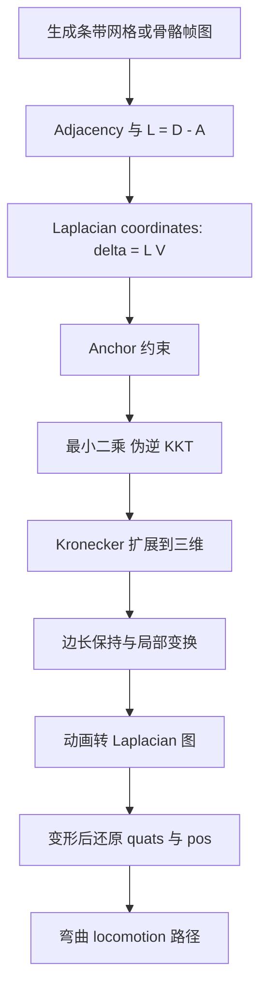
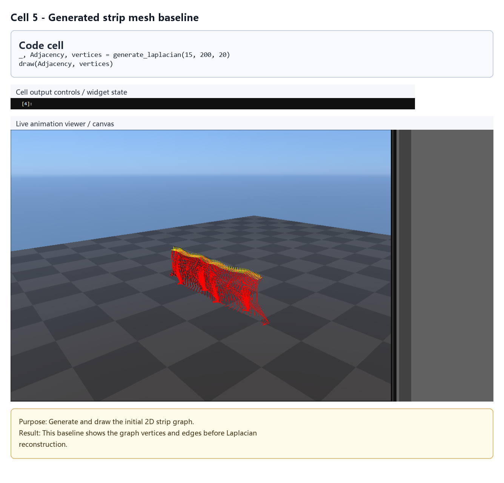
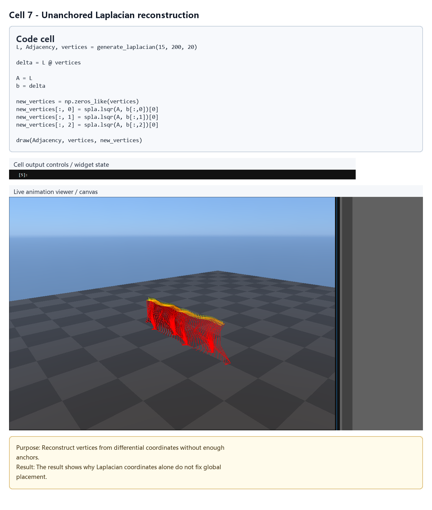
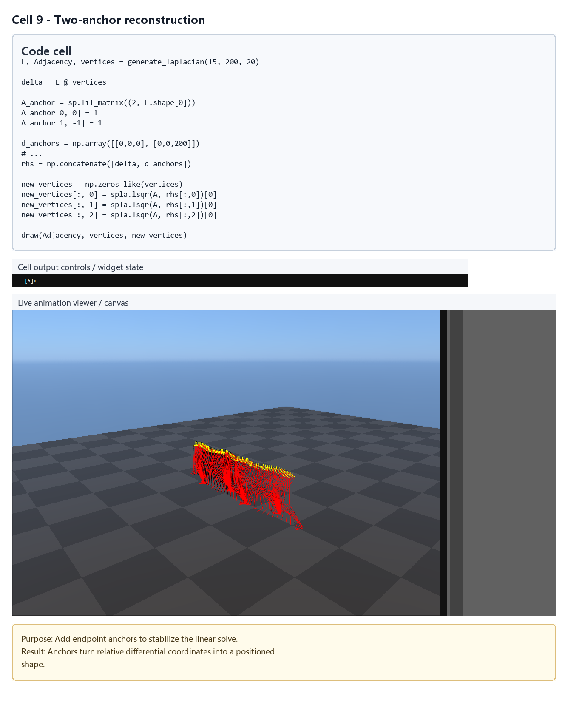
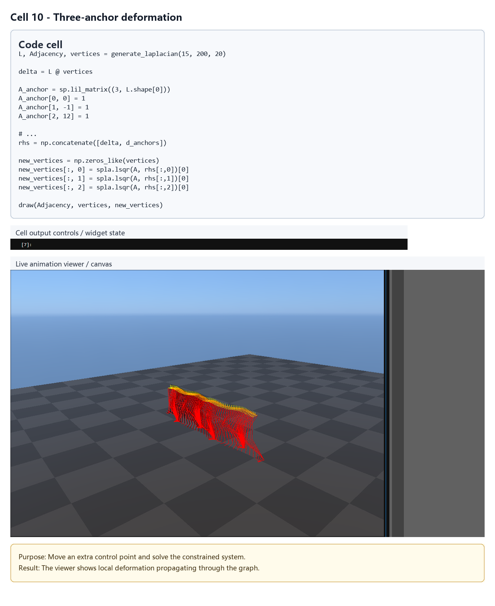
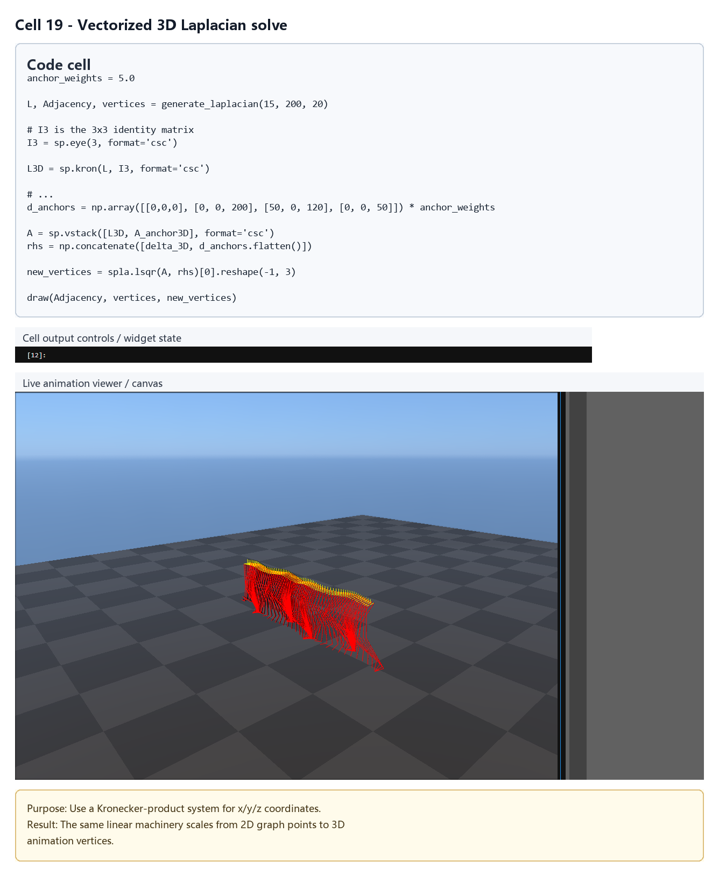
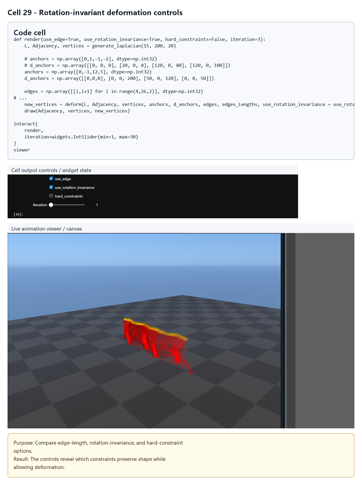
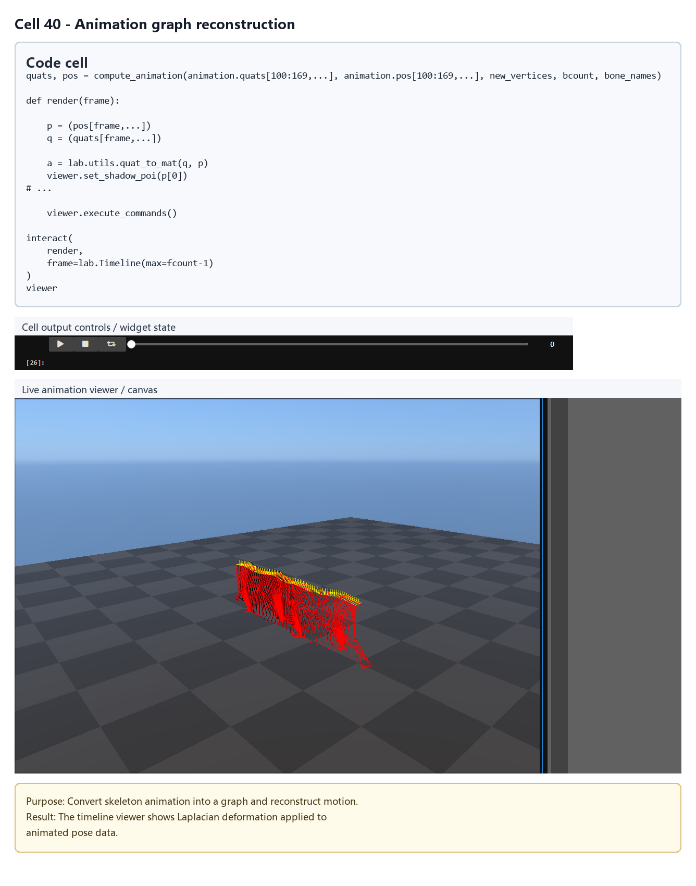
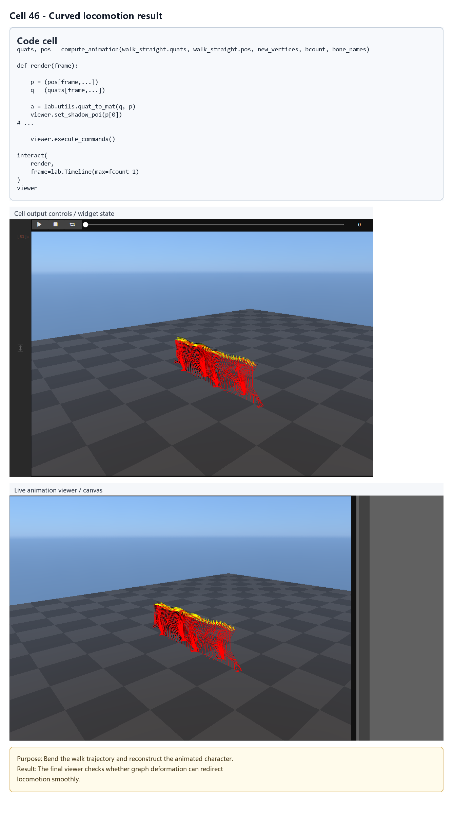

# Laplacian Deformation：网格与动画的局部形状编辑

## 元数据

| 字段 | 内容 |
| --- | --- |
| slug | `laplacian_deformation` |
| source path | [`labs/Theory/laplacian_deformation.ipynb`](../../../../labs/Theory/laplacian_deformation.ipynb) |
| env prefix | `.envs/laplacian_deformation` |
| kernel | `animationtech-laplacian_deformation` |
| validation status | `passed` (`manual_smoke`) |

## 问题背景

Laplacian deformation 的目标是在移动少量控制点时尽量保持网格的局部形状。它把顶点之间的连接关系写成图，用 Laplacian 坐标表示每个顶点相对于邻居的局部差异，再通过 anchor 约束求解新的顶点位置。

这个 notebook 先在一个简单条带网格上推导线性系统、最小二乘、伪逆、KKT 和三维 Kronecker 扩展，再加入边长保持和局部旋转不变项。后半部分把同一套思想用到角色动画：把一段骨骼动画展开成跨帧图，编辑 Laplacian 形状后再还原为动画姿态。

## 总模块图



## 模块拆解

1. **网格与 Laplacian 矩阵**
   `generate_laplacian` 生成条带状顶点和稀疏邻接矩阵，`compute_degree_matrix` 生成度矩阵，最终得到 `L = D - A`。`draw` 使用 viewer 画出原始网格、变形网格和额外边约束。

2. **Laplacian 坐标与基础变形**
   `delta = L @ vertices` 表示局部几何。最简单的求解让新顶点满足 `L V' ~= delta`，说明如果没有额外约束，系统只保留局部差分但缺少全局定位。

3. **Anchor 约束与线性求解**
   notebook 逐步加入 `A_anchor` 和 `d_anchors`，把固定或目标顶点位置拼到 Laplacian 系统里。随后分别展示 normal equations、Moore-Penrose pseudoinverse、KKT system，以及把 `L` 通过 `sp.kron(L, I3)` 扩展到三维一次求解。

4. **边长保持与局部旋转不变**
   边长约束用 `H` 和 `d_lengths` 表示，并在迭代中根据当前顶点更新右端项。局部旋转不变部分对每个顶点邻域拟合局部变换，再用 `update_L_rotation_invariance` 调整 Laplacian 行，减少普通 Laplacian 编辑容易出现的缩放和剪切。

5. **统一的 `deform` 函数**
   `deform` 把 anchor、edge、lock-y、rotation-invariance、hard-constraints 等选项合并到一个求解入口。软约束走 `lsqr`，硬约束走 KKT 风格的稀疏线性系统。

6. **动画转换为 Laplacian 图**
   notebook 加载 `AnimLabSimpleMale.usd` 和 LAFAN1 BVH，取一段 walk 动画。`get_animation` 把每帧的若干骨骼全局位置展开为顶点，`connect_frames` 加入跨帧连接，`get_laplacian` 得到动画图的 Laplacian。

7. **从变形顶点还原动画**
   `compute_animation` 用 FK/IK 在 `quats` 与 `pos` 之间转换，并根据 hips、spine、leg、foot/toe 方向恢复关键骨骼朝向。脚部高度和腿部边长约束用于减少路径编辑后的脚滑和姿态塌陷。

8. **弯曲 locomotion 路径**
   `curve` 把直线路径映射到圆弧路径。最后的交互参数通过 anchor 把整段 walk 的空间轨迹弯曲，再将变形结果还原成可播放动画。

## 关键数据结构

- `Adjacency`、`Degree`、`L`：稀疏图结构与 Laplacian 矩阵。
- `vertices`：网格顶点或动画骨骼采样点；网格中形状类似 `(count * 2, 3)`，动画中形状类似 `(fcount * bcount, 3)`。
- `delta`、`delta3D`、`L3D`：Laplacian 坐标与三维 Kronecker 扩展。
- `A_anchor`、`A_anchor3D`、`d_anchors`、`anchor_indices`、`anchor_positions`：anchor 约束矩阵和目标位置。
- `edges`、`edges_Lengths`、`H`、`d_lengths`：边长保持约束。
- `foot_tags`、`feet_height`、`bone_names`、`bcount`、`fcount`：动画图和脚部约束相关信息。
- `animation.quats`、`animation.pos`、`animation.parents`：角色动画的旋转、位移和层级。
- `update_L_rotation_invariance`、`deform`、`get_animation`、`compute_animation`、`curve`：主要计算流程函数。

## 执行结果的意义

网格实验说明 Laplacian 坐标能保留局部形状，但 anchor 的数量和权重决定全局位置是否稳定。加入边长和局部变换后，变形更接近“移动控制点并拖动周围形状”，而不是把整个网格简单拉伸。

动画实验展示了同一个数学结构可以作用在时空骨骼点云上。把多帧骨骼连接成图之后，路径弯曲不只是移动 root，而是对一段运动进行整体约束求解；脚部高度、腿部长度和局部形状项共同决定最终动画是否保持原有步态。

## 代码 Cell 与可视化结果

本节按 notebook 的关键 code cell 组织学习素材：每个条目都对应代码目的、实际输出类型、结果意义和 PNG 学习卡片。PNG 由指定 cell 的代码摘要、输出区、viewer/canvas 或图表/日志合成，不使用整页滚动截图替代。

<video controls muted src="assets/00-walkthrough.webm"></video>

[下载 WebM](assets/00-walkthrough.webm)

| Cell | 输出类型 | 代码做什么 | 结果说明什么 | 素材 |
| --- | --- | --- | --- | --- |
| 5 | `viewer` | Generate and draw the initial 2D strip graph. | This baseline shows the graph vertices and edges before Laplacian reconstruction. | [PNG](assets/01_strip_mesh_baseline.png) |
| 7 | `viewer` | Reconstruct vertices from differential coordinates without enough anchors. | The result shows why Laplacian coordinates alone do not fix global placement. | [PNG](assets/02_unanchored_reconstruction.png) |
| 9 | `viewer` | Add endpoint anchors to stabilize the linear solve. | Anchors turn relative differential coordinates into a positioned shape. | [PNG](assets/03_two_anchor_solve.png) |
| 10 | `viewer` | Move an extra control point and solve the constrained system. | The viewer shows local deformation propagating through the graph. | [PNG](assets/04_three_anchor_deformation.png) |
| 19 | `viewer` | Use a Kronecker-product system for x/y/z coordinates. | The same linear machinery scales from 2D graph points to 3D animation vertices. | [PNG](assets/05_vectorized_3d_solve.png) |
| 29 | `widget_controls` | Compare edge-length, rotation-invariance, and hard-constraint options. | The controls reveal which constraints preserve shape while allowing deformation. | [PNG](assets/06_rotation_invariance_controls.png) |
| 40 | `timeline_viewer` | Convert skeleton animation into a graph and reconstruct motion. | The timeline viewer shows Laplacian deformation applied to animated pose data. | [PNG](assets/07_animation_graph_deformation.png) |
| 46 | `timeline_viewer` | Bend the walk trajectory and reconstruct the animated character. | The final viewer checks whether graph deformation can redirect locomotion smoothly. | [PNG](assets/08_curved_locomotion_result.png) |

### Cell 5 - Generated strip mesh baseline

- 代码做什么：Generate and draw the initial 2D strip graph.
- 运行后看到什么：可视化 viewer 视口。
- 结果说明什么：This baseline shows the graph vertices and edges before Laplacian reconstruction.



### Cell 7 - Unanchored Laplacian reconstruction

- 代码做什么：Reconstruct vertices from differential coordinates without enough anchors.
- 运行后看到什么：可视化 viewer 视口。
- 结果说明什么：The result shows why Laplacian coordinates alone do not fix global placement.



### Cell 9 - Two-anchor reconstruction

- 代码做什么：Add endpoint anchors to stabilize the linear solve.
- 运行后看到什么：可视化 viewer 视口。
- 结果说明什么：Anchors turn relative differential coordinates into a positioned shape.



### Cell 10 - Three-anchor deformation

- 代码做什么：Move an extra control point and solve the constrained system.
- 运行后看到什么：可视化 viewer 视口。
- 结果说明什么：The viewer shows local deformation propagating through the graph.



### Cell 19 - Vectorized 3D Laplacian solve

- 代码做什么：Use a Kronecker-product system for x/y/z coordinates.
- 运行后看到什么：可视化 viewer 视口。
- 结果说明什么：The same linear machinery scales from 2D graph points to 3D animation vertices.



### Cell 29 - Rotation-invariant deformation controls

- 代码做什么：Compare edge-length, rotation-invariance, and hard-constraint options.
- 运行后看到什么：交互控件状态。
- 结果说明什么：The controls reveal which constraints preserve shape while allowing deformation.



### Cell 40 - Animation graph reconstruction

- 代码做什么：Convert skeleton animation into a graph and reconstruct motion.
- 运行后看到什么：带 timeline 的可播放 viewer。
- 结果说明什么：The timeline viewer shows Laplacian deformation applied to animated pose data.



### Cell 46 - Curved locomotion result

- 代码做什么：Bend the walk trajectory and reconstruct the animated character.
- 运行后看到什么：带 timeline 的可播放 viewer。
- 结果说明什么：The final viewer checks whether graph deformation can redirect locomotion smoothly.



## 运行方式

在仓库根目录运行：

```powershell
powershell -NoProfile -ExecutionPolicy Bypass -File .\tools\run_case.ps1 laplacian_deformation
.\.envs\laplacian_deformation\python.exe -m jupyter lab --notebook-dir .
```

打开 `labs/Theory/laplacian_deformation.ipynb`，选择 kernel `animationtech-laplacian_deformation`。该案例依赖 `lafan1` 和 `ipyanimlab_package_assets` 公开资源；`cases.yaml` 中状态为 `passed`，但 validation mode 是 `manual_smoke`，表示仍需要人工在 JupyterLab 中检查交互 viewer。
