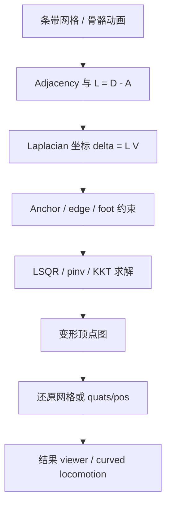
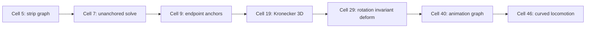
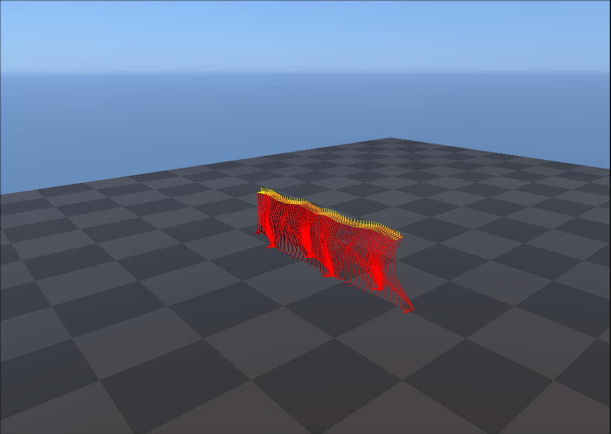
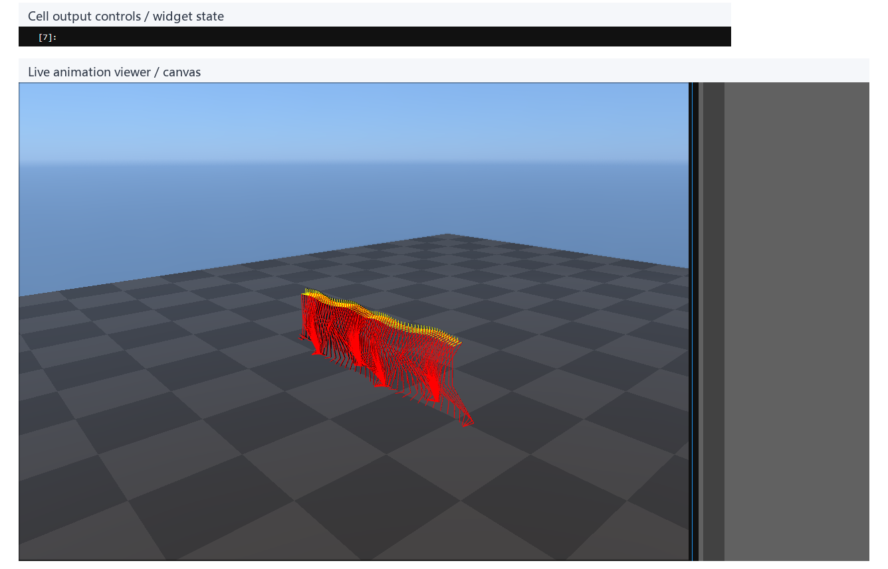
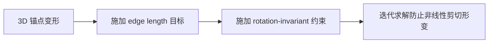
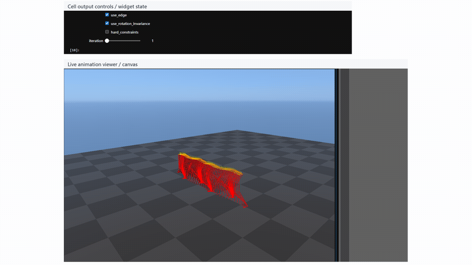
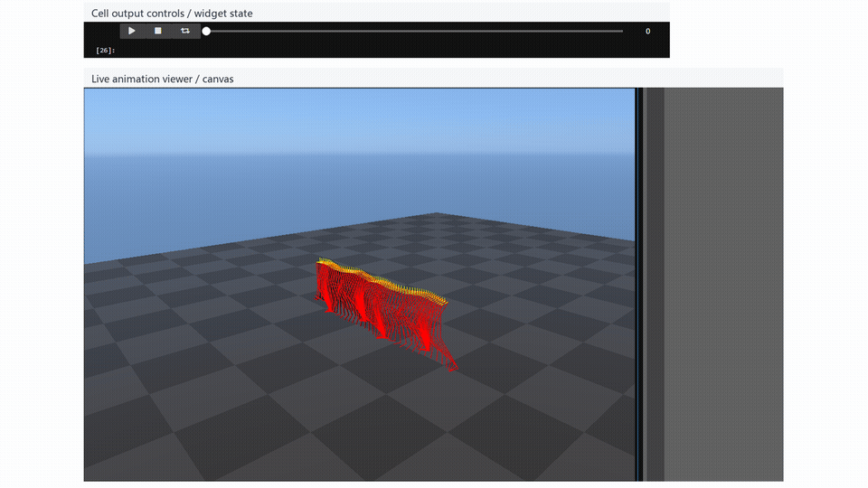
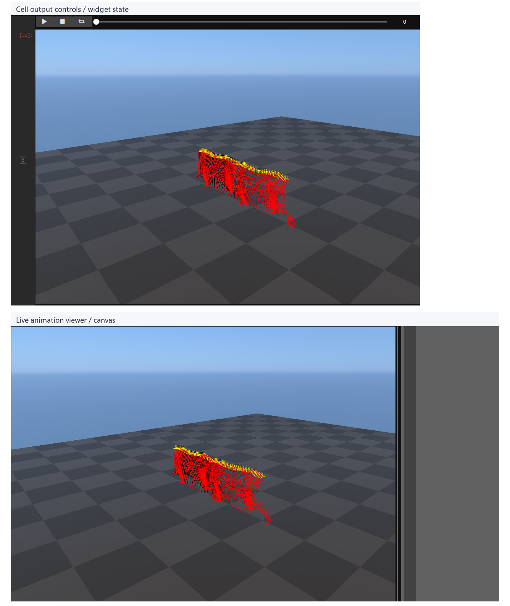
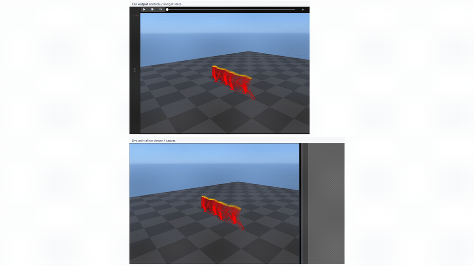

# Laplacian Deformation：网格与动画的局部形状编辑

## 元数据

| 字段 | 内容 |
| --- | --- |
| slug | `laplacian_deformation` |
| source path | [`labs/Theory/laplacian_deformation.ipynb`](../../../../labs/Theory/laplacian_deformation.ipynb) |
| transcript sources | [`docs/transcripts/0hyEbxAQVNY_Laplacian Mesh and Animation Deformation (re-upload).txt`](../../../../docs/transcripts/0hyEbxAQVNY_Laplacian Mesh and Animation Deformation (re-upload).txt) |
| env prefix | `.envs/laplacian_deformation` |
| kernel | `animationtech-laplacian_deformation` |
| validation status | `passed` (`manual_smoke`) |

## 问题背景

Laplacian deformation 解决的是移动少量控制点时尽量保持局部形状的问题。语音稿从图上的局部差分讲起：`delta = L @ V` 记录每个顶点相对邻居的形状，而 anchor 决定这些局部差分最终落在什么全局位置。notebook 先在条带网格上讲 nullspace、anchor、KKT、Kronecker 3D 和 rotation-invariant 约束，再把同一套结构迁移到跨帧骨骼动画图，用路径 anchor、脚高和腿长约束弯曲 locomotion。

## 阅读前置知识

- 图 Laplacian：`L = D - A`、局部差分和平移自由度。
- 最小二乘、伪逆、KKT：软约束和硬约束的求解差异。
- Kronecker product：把 2D 标量系统扩展到 3D 坐标。
- FK/IK、quaternion、foot contact：动画图还原时会用到。

## 总模块图



## 代码执行路径



## 模块拆解

### 1. 图 Laplacian 与局部坐标

`generate_laplacian`、`compute_degree_matrix` 和 `draw` 建立最小演示环境。`delta = L @ vertices` 保留局部形状，但没有 anchor 时无法决定整体位置。

### 2. Anchor 与约束求解

`A_anchor` 和 `d_anchors` 把控制点目标拼到系统中。软约束适合平滑拖拽；硬约束用 KKT 保证指定点严格命中目标。

### 3. 动画作为跨帧图

`get_animation` 把每帧骨骼点展开为顶点，`connect_frames` 加跨帧边，`compute_animation` 再把变形后的点云还原成骨骼动画。

## 关键 cell / 函数深讲

### Cell 5 - Generated strip mesh baseline

生成用于演示 Laplacian 变形的基础条带网格结构。


- 代码做什么：This baseline shows the graph vertices and edges before Laplacian reconstruction.
- 运行后看到什么：`viewer`
- 结果说明什么：生成的基准网格展示了不带有 Laplacian 变形时的图结构。
- 可视化主体：Generated strip mesh baseline
- 捕获方式：`canvas`



### Cell 7 - Unanchored Laplacian reconstruction

展示仅使用 Laplacian 坐标（差分）在无锚点约束下还原的漂移结果。

```mermaid
flowchart LR
    A[Laplacian 矩阵 L] --> B[计算差分 delta = L @ vertices]
    B --> C[使用伪逆还原 V = pinv(L) @ delta]
    C --> D[无 anchor 时全局位置漂移]
```

- 代码做什么：The result shows why Laplacian coordinates alone do not fix global placement.
- 运行后看到什么：`viewer`
- 结果说明什么：仅有局部差分信息无法固定全局位置，结果会发生自由漂移。
- 可视化主体：Unanchored Laplacian reconstruction
- 捕获方式：`canvas`


### Cell 9 - Two-anchor reconstruction

加入两个端点锚点，利用硬约束恢复带有确定位置和形状的网格。


- 代码做什么：Anchors turn relative differential coordinates into a positioned shape.
- 运行后看到什么：`viewer`
- 结果说明什么：锚点将相对的差分坐标转化为了具有绝对定位的形状。
- 可视化主体：Two-anchor reconstruction
- 捕获方式：`canvas`


### Cell 10 - Three-anchor deformation

引入第三个控制点驱动网格形变，观察 Laplacian 变形如何在局部传播。


- 代码做什么：The viewer shows local deformation propagating through the graph.
- 运行后看到什么：`viewer`
- 结果说明什么：可以观察到局部的变形约束如何通过图的 Laplacian 系统平滑传播到整体。
- 可视化主体：Three-anchor deformation
- 捕获方式：`canvas`



### Cell 19 - Vectorized 3D Laplacian solve

将二维系统的标量系统扩展至 3D 的 Kronecker 系统，以支持 3D 角色动画的顶点。


- 代码做什么：The same linear machinery scales from 2D graph points to 3D animation vertices.
- 运行后看到什么：`viewer`
- 结果说明什么：同样的线性机制从二维空间顺利拓展到支持 3D 骨骼和动画顶点。
- 可视化主体：Vectorized 3D Laplacian solve
- 捕获方式：`canvas`


### Cell 29 - Rotation-invariant deformation controls

展示带有 Edge Length 约束和旋转不变约束的滑块控件，通过调节这些约束可以保持原始动画的骨骼长度与局部体积感。



- 代码做什么：The controls reveal which constraints preserve shape while allowing deformation.
- 运行后看到什么：`widget_controls`
- 结果说明什么：控制面板揭示了旋转不变性约束如何在允许变形的同时防止局部网格过度扭曲。
- 可视化主体：Rotation-invariant deformation controls
- 捕获方式：`widget_controls`




<video controls muted loop playsinline preload="metadata" width="100%" poster="assets/06_rotation_invariance_controls_result.png" src="assets/06_rotation_invariance_controls_preview.mp4"></video>

### Cell 40 - Animation graph reconstruction

对实际的角色运动序列提取图结构，验证 Laplacian 框架如何影响带时间轴的跨帧动画。


- 代码做什么：The timeline viewer shows Laplacian deformation applied to animated pose data.
- 运行后看到什么：`timeline_viewer`
- 结果说明什么：时序 viewer 展示了应用于动画姿态数据的三维时空 Laplacian 变形效果。
- 可视化主体：Animation graph reconstruction
- 捕获方式：`canvas`




<video controls muted loop playsinline preload="metadata" width="100%" poster="assets/07_animation_graph_deformation_result.png" src="assets/07_animation_graph_deformation_preview.mp4"></video>

### Cell 46 - Curved locomotion result

通过添加路径 anchor、脚底高度等约束，利用全局图优化直接让角色走出弯曲路径。


- 代码做什么：The final viewer checks whether graph deformation can redirect locomotion smoothly.
- 运行后看到什么：`timeline_viewer`
- 结果说明什么：结果验证了这套基于图的时空变形方案能够稳定、平滑地将角色的运动轨迹重定向到指定的弯曲路线上。
- 可视化主体：Curved locomotion result
- 捕获方式：`canvas`





<video controls muted loop playsinline preload="metadata" width="100%" poster="assets/08_curved_locomotion_result_result.png" src="assets/08_curved_locomotion_result_preview.mp4"></video>

## 关键数据结构

- `Adjacency`、`Degree`、`L`：图结构与 Laplacian 矩阵。
- `vertices`、`delta`、`L3D`：顶点坐标、局部差分和三维扩展系统。
- `A_anchor`、`d_anchors`、`anchor_indices`：控制点约束。
- `edges`、`edges_Lengths`、`H`：边长保持约束。
- `foot_tags`、`feet_height`、`animation.quats/pos/parents`：动画图和骨骼还原数据。

## 执行结果的意义

网格结果验证 anchor 和局部约束如何控制形状传播。动画结果验证同一套数学结构能处理跨帧 motion editing：路径可以被重定向，但局部步态仍应保持。

## 重点可视化 / 动画

本节只放 `key_visual` 与 `key_animation` 的算法结果媒体。代码学习卡不作为正文主视觉；它们只在后续证据表中用于复现 cell 或源码上下文。


<video controls muted loop playsinline preload="metadata" width="100%" poster="assets/06_rotation_invariance_controls_result.png">
  <source src="assets/06_rotation_invariance_controls_preview.mp4" type="video/mp4">
  <source src="assets/06_rotation_invariance_controls_preview.webm" type="video/webm">
</video>


**Cell 40 - Animation graph reconstruction**

<video controls muted loop playsinline preload="metadata" width="100%" poster="assets/07_animation_graph_deformation_result.png">
  <source src="assets/07_animation_graph_deformation_preview.mp4" type="video/mp4">
  <source src="assets/07_animation_graph_deformation_preview.webm" type="video/webm">
</video>

**Cell 46 - Curved locomotion result**

<video controls muted loop playsinline preload="metadata" width="100%" poster="assets/08_curved_locomotion_result_result.png">
  <source src="assets/08_curved_locomotion_result_preview.mp4" type="video/mp4">
  <source src="assets/08_curved_locomotion_result_preview.webm" type="video/webm">
</video>

| Cell | 输出类型 | 媒体角色 | 可视化主体 | 捕获方式 | 结果媒体 |
| --- | --- | --- | --- | --- | --- |
| Cell 5 | `viewer` | `key_visual` | Generated strip mesh baseline: This baseline shows the graph vertices and edges before Laplacian reconstruction. | `canvas` | [结果 PNG](assets/01_strip_mesh_baseline_result.png) |
| Cell 7 | `viewer` | `key_visual` | Unanchored Laplacian reconstruction: The result shows why Laplacian coordinates alone do not fix global placement. | `canvas` | [结果 PNG](assets/02_unanchored_reconstruction_result.png) |
| Cell 9 | `viewer` | `key_visual` | Two-anchor reconstruction: Anchors turn relative differential coordinates into a positioned shape. | `canvas` | [结果 PNG](assets/03_two_anchor_solve_result.png) |
| Cell 10 | `viewer` | `key_visual` | Three-anchor deformation: The viewer shows local deformation propagating through the graph. | `canvas` | [结果 PNG](assets/04_three_anchor_deformation_result.png) |
| Cell 19 | `viewer` | `key_visual` | Vectorized 3D Laplacian solve: The same linear machinery scales from 2D graph points to 3D animation vertices. | `canvas` | [结果 PNG](assets/05_vectorized_3d_solve_result.png) |
| Cell 29 | `widget_controls` | `key_visual` | Rotation-invariant deformation controls: The controls reveal which constraints preserve shape while allowing deformation. | `widget_controls` | [结果 PNG](assets/06_rotation_invariance_controls_result.png) / [GIF](assets/06_rotation_invariance_controls_preview.gif) / [MP4](assets/06_rotation_invariance_controls_preview.mp4) / [WebM](assets/06_rotation_invariance_controls_preview.webm) |
| Cell 40 | `timeline_viewer` | `key_animation` | Animation graph reconstruction: The timeline viewer shows Laplacian deformation applied to animated pose data. | `canvas` | [结果 PNG](assets/07_animation_graph_deformation_result.png) / [GIF](assets/07_animation_graph_deformation_preview.gif) / [MP4](assets/07_animation_graph_deformation_preview.mp4) / [WebM](assets/07_animation_graph_deformation_preview.webm) |
| Cell 46 | `timeline_viewer` | `key_animation` | Curved locomotion result: The final viewer checks whether graph deformation can redirect locomotion smoothly. | `canvas` | [结果 PNG](assets/08_curved_locomotion_result_result.png) / [GIF](assets/08_curved_locomotion_result_preview.gif) / [MP4](assets/08_curved_locomotion_result_preview.mp4) / [WebM](assets/08_curved_locomotion_result_preview.webm) |


## 代码 Cell 与可视化结果

本节保留每个 cell 的可复现证据。结果 PNG 用于正文阅读，代码卡记录代码摘要与输出来源；有 timeline 或参数滑杆的 cell 同时提供 GIF、MP4 和 WebM。

| Cell / 片段 | 结果说明 | 证据 |
| --- | --- | --- |
| Cell 5 | This baseline shows the graph vertices and edges before Laplacian reconstruction. | [结果 PNG](assets/01_strip_mesh_baseline_result.png) / [代码卡](assets/01_strip_mesh_baseline.png) |
| Cell 7 | The result shows why Laplacian coordinates alone do not fix global placement. | [结果 PNG](assets/02_unanchored_reconstruction_result.png) / [代码卡](assets/02_unanchored_reconstruction.png) |
| Cell 9 | Anchors turn relative differential coordinates into a positioned shape. | [结果 PNG](assets/03_two_anchor_solve_result.png) / [代码卡](assets/03_two_anchor_solve.png) |
| Cell 10 | The viewer shows local deformation propagating through the graph. | [结果 PNG](assets/04_three_anchor_deformation_result.png) / [代码卡](assets/04_three_anchor_deformation.png) |
| Cell 19 | The same linear machinery scales from 2D graph points to 3D animation vertices. | [结果 PNG](assets/05_vectorized_3d_solve_result.png) / [代码卡](assets/05_vectorized_3d_solve.png) |
| Cell 29 | The controls reveal which constraints preserve shape while allowing deformation. | [结果 PNG](assets/06_rotation_invariance_controls_result.png) / [GIF](assets/06_rotation_invariance_controls_preview.gif) / [MP4](assets/06_rotation_invariance_controls_preview.mp4) / [WebM](assets/06_rotation_invariance_controls_preview.webm) / [代码卡](assets/06_rotation_invariance_controls.png) |
| Cell 40 | The timeline viewer shows Laplacian deformation applied to animated pose data. | [结果 PNG](assets/07_animation_graph_deformation_result.png) / [GIF](assets/07_animation_graph_deformation_preview.gif) / [MP4](assets/07_animation_graph_deformation_preview.mp4) / [WebM](assets/07_animation_graph_deformation_preview.webm) / [代码卡](assets/07_animation_graph_deformation.png) |
| Cell 46 | The final viewer checks whether graph deformation can redirect locomotion smoothly. | [结果 PNG](assets/08_curved_locomotion_result_result.png) / [GIF](assets/08_curved_locomotion_result_preview.gif) / [MP4](assets/08_curved_locomotion_result_preview.mp4) / [WebM](assets/08_curved_locomotion_result_preview.webm) / [代码卡](assets/08_curved_locomotion_result.png) |


## 运行方式

AnimationPapers 案例优先使用：

```powershell
powershell -NoProfile -ExecutionPolicy Bypass -File .\tools\start_animationpapers_lab.ps1
```

单案例验证使用：

```powershell
powershell -NoProfile -ExecutionPolicy Bypass -File .\tools\run_case.ps1 laplacian_deformation
```
