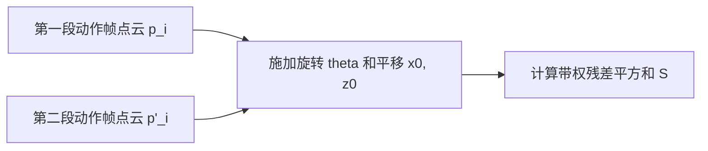
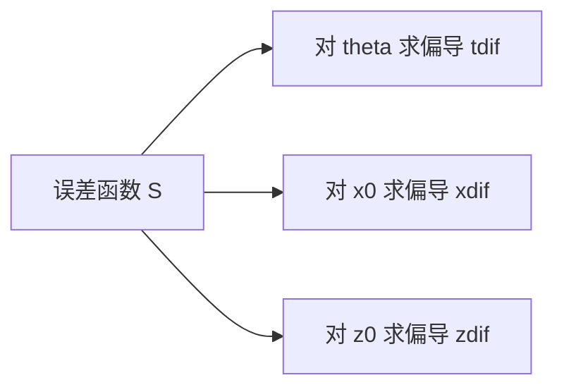
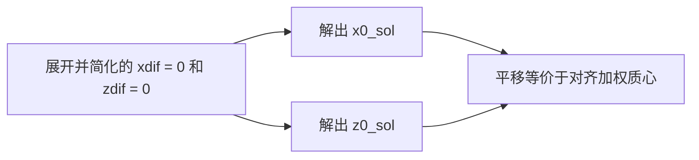

# Motion Graph 点云配准公式推导

## 元数据

| 字段 | 内容 |
| --- | --- |
| slug | `motiongraph_pointcloud_derivation` |
| source path | [`labs/Theory/motiongraph_pointcloud_derivation.ipynb`](../../../../labs/Theory/motiongraph_pointcloud_derivation.ipynb) |
| env prefix | `.envs/motiongraph_pointcloud_derivation` |
| kernel | `animationtech-motiongraph_pointcloud_derivation` |
| validation status | `passed` (`automated`) |

## 问题背景

Motion Graph 需要判断两段动作是否适合连接。常见做法是把候选帧附近的角色关键点看成点云，寻找一个水平面上的旋转 `theta` 和平移 `(x_0, z_0)`，让第二组点云尽量对齐第一组点云。

这个 notebook 不做数值优化，而是用 SymPy 推导带权最小二乘误差的闭式解。推导结果给出了最优旋转和平移的公式，可用于 motion graph transition error 的快速计算。

## 总模块图

```mermaid
flowchart TD
    A[定义两组点云 p_i 与 p'_i] --> B[带权误差 S(theta, x0, z0)]
    B --> C[对 theta x0 z0 求偏导]
    C --> D[令偏导等于 0]
    D --> E[整理加权求和符号]
    E --> F[先解 x0 与 z0]
    F --> G[代回 theta 方程]
    G --> H[得到 atan 闭式解]
```

## 模块拆解

1. **目标函数**
   notebook 从 `S = Sum(w_i ||p_i - T p'_i||^2)` 开始，其中 `T` 是由 `theta`、`x_0`、`z_0` 定义的二维刚体变换。点坐标只保留水平平面的 `x` 和 `z` 分量。

2. **写出 x 与 z 分量的误差**
   误差函数显式展开为每个点的 x 方向和 z 方向残差平方和，权重 `w_i` 允许不同关键点对 transition cost 有不同贡献。

3. **求偏导**
   `tdif`、`xdif`、`zdif` 分别是对 `theta`、`x_0`、`z_0` 的偏导。这个步骤把几何配准问题转成符号方程组。

4. **令偏导为 0 并整理**
   `eq1`、`eq2`、`eq3` 表示一阶最优条件。notebook 用 `factor_terms` 和 `collect` 将三角函数、平移量和加权求和项分离。

5. **替换加权和记号**
   `substitutions` 把 `Sum(w_i x_i)`、`Sum(w_i z_i)`、`Sum(w_i x'_i)`、`Sum(w_i z'_i)` 替换成简洁符号，便于观察最终公式中的加权质心项。

6. **先解平移再解旋转**
   `x0_sol` 和 `z0_sol` 来自 `eq2`、`eq3`。将它们代回 `eq1` 后，剩余方程可整理成 `a sin(theta) + b cos(theta) = 0`，因此 `theta` 可写成 `atan(-b / a)`。

## 关键数据结构

- `x`、`z`、`xp`、`zp`：SymPy `IndexedBase`，分别表示两组点云在水平平面上的坐标。
- `w`：每个点的权重。
- `theta`、`x_0`、`z_0`：待求的旋转和平移变量。
- `S`：带权平方误差目标函数。
- `tdif`、`xdif`、`zdif`：对三个未知量的偏导。
- `eq1`、`eq2`、`eq3`、`eq4`：逐步整理的一阶最优条件。
- `wixi`、`wizi`、`wixip`、`wizip`：加权坐标和的缩写符号。
- `x0_sol`、`z0_sol`、`theta_sol`：最终的闭式解表达式。

## 执行结果的意义

推导结果说明 motion graph 的帧间对齐不必每次都做迭代优化。平移项等价于对齐加权质心；旋转项由加权 cross-like 项和 dot-like 项共同决定，最终落在一个 `atan` 公式里。

这类闭式解适合作为 transition search 的基础工具：先把两段候选动作放到最佳相对位姿，再计算残差大小。残差越小，说明两段动作在空间姿态上越容易无缝连接。

## 代码 Cell 与可视化结果

本节按 notebook 的关键 code cell 组织学习素材：每个条目都对应代码目的、实际输出类型、结果意义和 PNG 学习卡片。PNG 由指定 cell 的代码摘要、输出区、viewer/canvas 或图表/日志合成，不使用整页滚动截图替代。


| Cell | 输出类型 | 代码做什么 | 结果说明什么 | 素材 |
| --- | --- | --- | --- | --- |
| 4 | `formula` | Display the weighted squared-distance objective for point-cloud alignment. | The formula states exactly what motion-graph transition alignment minimizes. | [PNG](assets/01_alignment_objective_formula.png) |
| 6 | `latex` | Differentiate the objective with respect to rotation and translation. | The derivatives define the first-order conditions for the optimal alignment. | [PNG](assets/02_partial_derivatives.png) |
| 8 | `latex` | Expand the derivative equations before substitution. | The raw equations show where the sine, cosine, and translation terms come from. | [PNG](assets/03_expanded_stationarity.png) |
| 13 | `latex` | Introduce compact weighted-sum symbols for the derivation. | The shorthand turns large sums into readable centroid-like expressions. | [PNG](assets/04_weighted_sum_shorthand.png) |
| 16 | `formula` | Solve the translation equations for x0 and z0. | The result separates translation from the remaining rotation solve. | [PNG](assets/05_translation_solution.png) |
| 20 | `formula` | Collect sine/cosine terms and derive the atan form. | The final expression is the closed-form rotation used for point-cloud alignment. | [PNG](assets/06_theta_solution.png) |

## 关键 cell / 函数深讲

### Cell 4 - Weighted point-cloud objective

定义两组点云之间的带权平方误差函数，用以衡量空间对齐的优劣。



- 代码做什么：Display the weighted squared-distance objective for point-cloud alignment.
- 运行后看到什么：`formula`
- 结果说明什么：The formula states exactly what motion-graph transition alignment minimizes.
- 可视化主体：Weighted point-cloud objective
- 捕获方式：`formula`


### Cell 6 - Partial derivatives

将误差目标函数分别对未知的旋转角和两个平移量求偏导数。



- 代码做什么：Differentiate the objective with respect to rotation and translation.
- 运行后看到什么：`latex`
- 结果说明什么：The derivatives define the first-order conditions for the optimal alignment.
- 可视化主体：Partial derivatives
- 捕获方式：`latex`


### Cell 8 - Expanded stationarity equations

展开偏导方程，准备后续分离变量。


- 代码做什么：Expand the derivative equations before substitution.
- 运行后看到什么：`latex`
- 结果说明什么：The raw equations show where the sine, cosine, and translation terms come from.
- 可视化主体：Expanded stationarity equations
- 捕获方式：`latex`


### Cell 13 - Weighted-sum shorthand

用简化的符号替代复杂的加权坐标和，以便于观察公式的物理意义（例如质心）。


- 代码做什么：Introduce compact weighted-sum symbols for the derivation.
- 运行后看到什么：`latex`
- 结果说明什么：The shorthand turns large sums into readable centroid-like expressions.
- 可视化主体：Weighted-sum shorthand
- 捕获方式：`latex`


### Cell 16 - Closed-form translation solution

求解平移的偏导方程，得到 x0 和 z0 的闭式解。



- 代码做什么：Solve the translation equations for x0 and z0.
- 运行后看到什么：`formula`
- 结果说明什么：The result separates translation from the remaining rotation solve.
- 可视化主体：Closed-form translation solution
- 捕获方式：`formula`


### Cell 20 - Final theta solution

将平移解代回旋转方程，分离正余弦并求得解析解 atan 公式。

```mermaid
flowchart LR
    A[将 x0_sol 和 z0_sol 代入 tdif = 0] --> B[化简为 a sin(theta) + b cos(theta) = 0]
    B --> C[提取 theta = atan(-b/a)]
    C --> D[获得纯解析的配准计算公式]
```

- 代码做什么：Collect sine/cosine terms and derive the atan form.
- 运行后看到什么：`formula`
- 结果说明什么：The final expression is the closed-form rotation used for point-cloud alignment.
- 可视化主体：Final theta solution
- 捕获方式：`formula`


## 运行方式

在仓库根目录运行：

```powershell
powershell -NoProfile -ExecutionPolicy Bypass -File .\tools\run_case.ps1 motiongraph_pointcloud_derivation
.\.envs\motiongraph_pointcloud_derivation\python.exe -m jupyter lab --notebook-dir .
```

打开 `labs/Theory/motiongraph_pointcloud_derivation.ipynb`，选择 kernel `animationtech-motiongraph_pointcloud_derivation`。本说明只根据 notebook 源内容整理，没有重新执行 notebook。

## 重点可视化 / 动画

本节只放 `key_visual` 与 `key_animation` 的算法结果媒体。代码学习卡不作为正文主视觉；它们只在后续证据表中用于复现 cell 或源码上下文。


| Cell | 输出类型 | 媒体角色 | 可视化主体 | 捕获方式 | 结果媒体 |
| --- | --- | --- | --- | --- | --- |


## 代码 Cell 与可视化结果

本节保留每个 cell 的可复现证据。结果 PNG 用于正文阅读，代码卡记录代码摘要与输出来源；有 timeline 或参数滑杆的 cell 同时提供 GIF、MP4 和 WebM。

| Cell / 片段 | 结果说明 | 证据 |
| --- | --- | --- |
| Cell 4 | The formula states exactly what motion-graph transition alignment minimizes. | [结果 PNG](assets/01_alignment_objective_formula_result.png) / [代码卡](assets/01_alignment_objective_formula.png) |
| Cell 6 | The derivatives define the first-order conditions for the optimal alignment. | [结果 PNG](assets/02_partial_derivatives_result.png) / [代码卡](assets/02_partial_derivatives.png) |
| Cell 8 | The raw equations show where the sine, cosine, and translation terms come from. | [结果 PNG](assets/03_expanded_stationarity_result.png) / [代码卡](assets/03_expanded_stationarity.png) |
| Cell 13 | The shorthand turns large sums into readable centroid-like expressions. | [结果 PNG](assets/04_weighted_sum_shorthand_result.png) / [代码卡](assets/04_weighted_sum_shorthand.png) |
| Cell 16 | The result separates translation from the remaining rotation solve. | [结果 PNG](assets/05_translation_solution_result.png) / [代码卡](assets/05_translation_solution.png) |
| Cell 20 | The final expression is the closed-form rotation used for point-cloud alignment. | [结果 PNG](assets/06_theta_solution_result.png) / [代码卡](assets/06_theta_solution.png) |
