# Motion Graph 点云配准闭式解推导

## 元数据

| 字段 | 值 |
| --- | --- |
| slug | `motiongraph_pointcloud_derivation` |
| source path | [`labs/Theory/motiongraph_pointcloud_derivation.ipynb`](../../../../labs/Theory/motiongraph_pointcloud_derivation.ipynb) |
| transcript sources | [`docs/transcripts/h1ZpqBlHkk0_MotionGraphs _ Derivation of the closed form solution.txt`](<../../../../docs/transcripts/h1ZpqBlHkk0_MotionGraphs _ Derivation of the closed form solution.txt>) |
| kind | `notebook` |
| env prefix | `.envs/motiongraph_pointcloud_derivation` |
| kernel | `animationtech-motiongraph_pointcloud_derivation` |
| validation status | `passed` (`automated`) |

## 问题背景

Motion Graph 在决定两段动作能否连接时，需要先把两段候选帧附近的角色关键点对齐。讲解里的核心问题是：给定两组水平平面上的点云 `p_i = (x_i, z_i)` 与 `p'_i = (x'_i, z'_i)`，如何找到一个绕竖直轴的旋转 `theta` 和平移 `(x_0, z_0)`，让第二组点云变换后尽量贴近第一组点云。

这个 notebook 不做迭代优化，而是用 SymPy 从带权最小二乘目标出发，推到 `x_0`、`z_0` 与 `theta` 的闭式解。它对应 transcript 中的学习动机：论文直接给出公式，但真正有价值的是看清楚公式怎样从“点云平方距离最小”一步步变成“质心平移 + atan 旋转”。

放到 Motion Graph 语境里，这个闭式解不是一个孤立的几何练习。候选 transition 的两端通常来自不同 clip、不同根节点朝向和不同世界位置；如果直接比较关节点坐标，误差会被全局位姿差污染。这里先求出让后一段动作最贴近前一段动作的水平刚体变换，再把变换后的残差作为 transition cost 的一部分，等价于问：“在允许角色整体转身和挪位以后，这两个姿态窗口本身还差多少？”

## 阅读前置知识

- Motion Graph transition cost：两段动作的连接质量常用姿态差、脚接触和空间对齐误差共同衡量；本文只处理空间点云对齐部分。
- Root / heading alignment：这里仅允许在水平面旋转和平移，`y` 不参与优化，因为角色高度不会随 `theta`、`x_0`、`z_0` 改变。
- 带权最小二乘：`w_i` 让不同骨骼点对 transition error 的贡献不同，例如脚、髋或手可以被赋予不同重要性。
- 一阶最优条件：对目标函数分别求 `theta`、`x_0`、`z_0` 偏导，并令偏导为 0。
- 符号化推导：SymPy 的 `diff`、`expand`、`factor_terms`、`subs`、`solve`、`collect` 分别承担求导、展开、整理、替换、求解和收集三角项的职责。

## 总模块图

```mermaid
flowchart TD
    A[Motion Graph 候选连接<br/>两组点云 p_i 与 p'_i] --> B[只保留水平 x/z 坐标]
    B --> C[建立带权平方误差目标 S]
    C --> D[对 theta/x0/z0 求偏导]
    D --> E[展开一阶最优方程]
    E --> F[引入加权和简写]
    F --> G[先解 translation: x0, z0]
    G --> H[代回 theta 方程]
    H --> I[收集 sin/cos 项]
    I --> J[得到 theta = atan(-B/A)]
```

这张图里的关键顺序是“先平移、后旋转”。平移方程在简写后只依赖 `theta`，所以可以先解出 `x_0(theta)` 和 `z_0(theta)`；代回旋转方程后，复杂的质心项被抵消，剩下的结构才会变成 `A sin(theta) + B cos(theta) = 0`。

## 代码执行路径

```mermaid
flowchart LR
    C0[Cell 0<br/>SymPy/Latex imports] --> C2[Cell 2<br/>symbols and indexed bases]
    C2 --> C4[Cell 4<br/>weighted objective S]
    C4 --> C6[Cell 6<br/>partial derivatives]
    C6 --> C8[Cell 8<br/>expanded stationarity]
    C8 --> C13[Cell 13<br/>weighted shorthand]
    C13 --> C16[Cell 16<br/>translation solve]
    C16 --> C18[Cell 18<br/>substitute into theta eq]
    C18 --> C19[Cell 19<br/>collect sin/cos]
    C19 --> C20[Cell 20<br/>atan theta solution]
```

notebook 的执行路径非常线性。前半段把几何问题翻译成符号方程，后半段不断把公式压缩成论文里可读的记号；每个主要输出都是公式、LaTeX 或符号表达式，不包含交互 viewer。

## 模块拆解

### 1. 几何目标：把第二组点云刚体变换到第一组

目标函数把每个 `p'_i` 先旋转再平移：

```text
x'_i -> x'_i cos(theta) + z'_i sin(theta) + x_0
z'_i -> z'_i cos(theta) - x'_i sin(theta) + z_0
```

然后计算它与 `p_i` 的 x/z 残差平方和。因为目标里已经是平方距离，推导不需要写欧氏距离的平方根。`y` 坐标被 transcript 明确排除：在水平旋转和平移下，`y` 不随未知量变化，放进优化只会贡献常数。

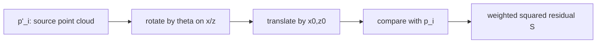

### 2. 一阶最优条件：把配准变成三个方程

Cell 6 对 `S` 求三个偏导：`tdif = dS/dtheta`、`xdif = dS/dx_0`、`zdif = dS/dz_0`。Cell 8 再把它们展开并令其为 0，得到 `eq1`、`eq2`、`eq3`。这是推导中从“几何直觉”进入“代数求解”的分界线。

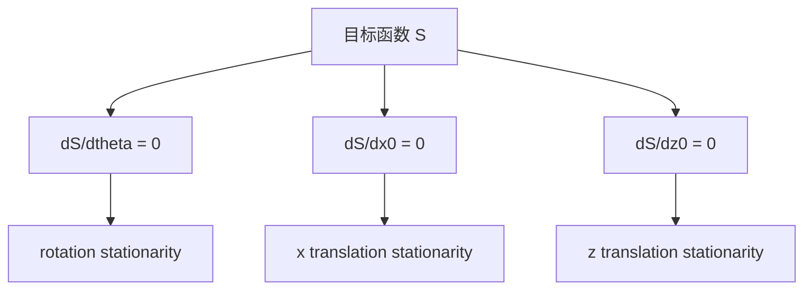

### 3. 加权简写：把大求和压缩成质心式结构

展开后的式子里反复出现 `Sum(w_i x_i)`、`Sum(w_i z_i)`、`Sum(w_i x'_i)`、`Sum(w_i z'_i)`。Cell 13 将它们替换为 `wixi`、`wizi`、`wixip`、`wizip`，相当于把加权坐标和写成论文里的 `\bar{x}`、`\bar{z}`、`\bar{x}'`、`\bar{z}'` 风格记号。

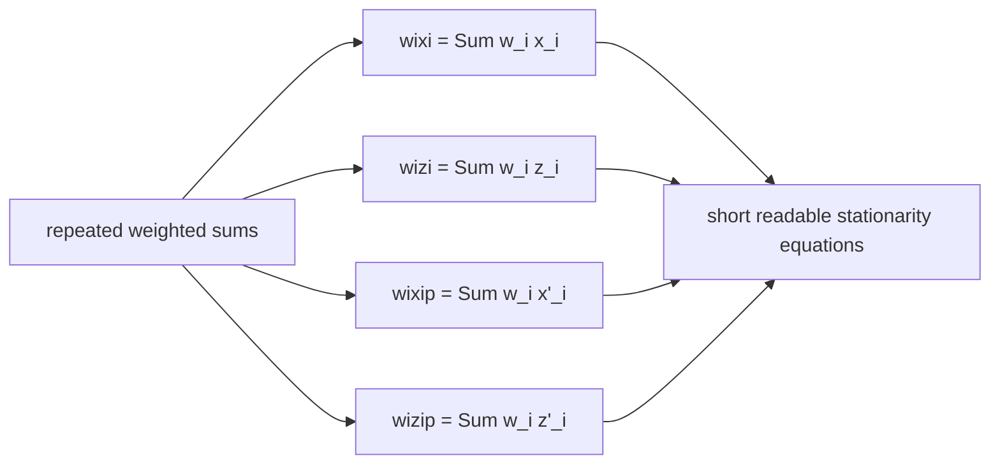

### 4. 平移闭式解：对齐两个加权质心

`eq2` 和 `eq3` 不需要先知道最终的 `theta` 数值，也可以解成 `theta` 的函数。Cell 16 得到的形式可以读作：把旋转后的第二组点云加权质心移到第一组点云加权质心。

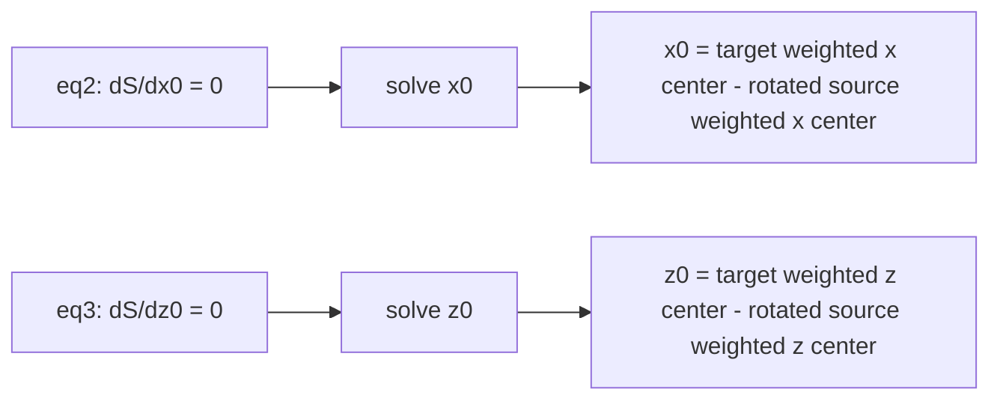

### 5. 旋转闭式解：把剩余方程整理为 atan

Cell 18 把 `x0_sol` 与 `z0_sol` 代回 `eq1`。Cell 19 用 `collect((cos(theta), sin(theta)))` 将式子收集为三角函数项。此时结构已经变成：

```text
A sin(theta) + B cos(theta) = 0
```

所以：

```text
tan(theta) = -B / A
theta = atan(-B / A)
```

```mermaid
flowchart TD
    A[theta stationarity eq1] --> B[substitute x0_sol and z0_sol]
    B --> C[expand and cancel centroid terms]
    C --> D[collect sin(theta) and cos(theta)]
    D --> E[A sin(theta) + B cos(theta) = 0]
    E --> F[theta = atan(-B/A)]
```

实际工程中更常用 `atan2(-B, A)` 的数值形式来保留象限信息；notebook 的符号推导则展示论文公式的代数来源。

## 闭式推导主线

设目标点云为 `p_i = (x_i, z_i)`，待对齐点云为 `p'_i = (x'_i, z'_i)`，权重为 `w_i`。notebook 使用的旋转约定是：

```text
R(theta) p'_i = (x'_i cos(theta) + z'_i sin(theta),
                 z'_i cos(theta) - x'_i sin(theta))
```

因此带权目标函数可以写成：

```text
S(theta, x0, z0) =
  Sum_i w_i [
    (x_i - x0 - x'_i cos(theta) - z'_i sin(theta))^2
  + (z_i - z0 + x'_i sin(theta) - z'_i cos(theta))^2
  ]
```

权重 `w_i` 的位置很重要：它乘在一个完整点对的二维残差上。这样脚、髋、肩等关节点可以按 transition 可靠性或语义重要性调整贡献，而不会破坏“整体刚体对齐”的形式。

一阶最优条件是：

```text
dS/dx0 = 0
dS/dz0 = 0
dS/dtheta = 0
```

Cell 8 展开的三个方程看起来很长，但其中平移方程本质上是加权平均条件。引入：

```text
W      = Sum_i w_i
xbar   = Sum_i w_i x_i
zbar   = Sum_i w_i z_i
xpbar  = Sum_i w_i x'_i
zpbar  = Sum_i w_i z'_i
```

README 和 notebook 中的 `wixi`、`wizi`、`wixip`、`wizip` 分别对应上面的 `xbar`、`zbar`、`xpbar`、`zpbar`；notebook 没有单独替换 `W`，所以最终公式里仍保留 `Sum(w_i)`。用这些简写重读 `dS/dx0 = 0` 与 `dS/dz0 = 0`，可以直接得到：

```text
x0 = (xbar - xpbar cos(theta) - zpbar sin(theta)) / W
z0 = (xpbar sin(theta) + zbar - zpbar cos(theta)) / W
```

这就是“旋转后的 source 加权质心移动到 target 加权质心”。先解平移的意义在于把两个点云的整体位置差解析消掉，让后续旋转只处理围绕质心的相关性。

把 `x0(theta)` 与 `z0(theta)` 代回 `dS/dtheta = 0` 后，所有显式平移项会变成质心校正项，Cell 19 收集后得到：

```text
A sin(theta) + B cos(theta) = 0
```

其中：

```text
A = Sum_i w_i x'_i x_i + Sum_i w_i z'_i z_i
    - (xbar xpbar + zbar zpbar) / W

B = Sum_i w_i x'_i z_i - Sum_i w_i x_i z'_i
    + (xbar zpbar - xpbar zbar) / W
```

于是：

```text
tan(theta) = -B / A
theta = atan(-B / A)
```

`A` 可以理解为去质心后的“同向相关”：source 的 x/z 轴与 target 的 x/z 轴越同向，它越大。`B` 可以理解为去质心后的“交叉相关”：它衡量 source 旋到 target 时还需要多少水平转角。Motion Graph transition alignment 需要的正是这个结果：对每条候选边，用一次公式计算最佳根节点水平变换，再在这个最佳坐标系下评估剩余姿态误差、速度误差或脚接触一致性。

## 关键 cell / 函数深讲

### Cell 4 - Weighted point-cloud objective

Cell 4 显式写出 `S`，也就是 motion graph transition alignment 真正要最小化的量。`w_i` 在求和外层包住每个点的两方向残差平方，说明权重不是只影响某个坐标，而是影响整个对应点。

```mermaid
flowchart LR
    A[x_i,z_i] --> C[residual in x]
    B[x'_i,z'_i] --> D[rotate + translate source]
    D --> C
    D --> E[residual in z]
    C --> F[w_i * (dx^2 + dz^2)]
    E --> F
    F --> G[Sum over i: S]
```

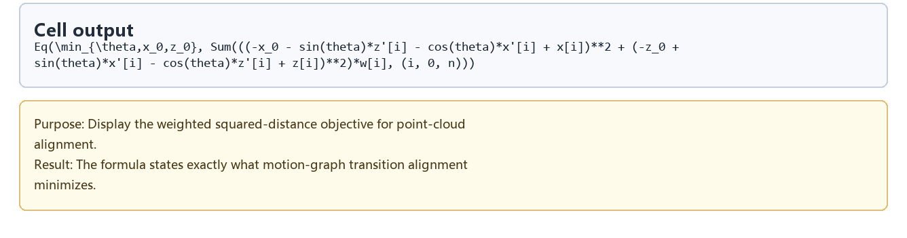

### Cell 6 - Partial derivatives

这一格把优化变量从“待找的姿态差”变成三个方程。`theta` 的偏导较长，因为旋转同时影响 x 和 z；`x_0`、`z_0` 的偏导更像普通线性最小二乘，因为它们只是平移残差。

```mermaid
flowchart TD
    A[S(theta,x0,z0)] --> B[tdif]
    A --> C[xdif]
    A --> D[zdif]
    B --> E[controls rotation equation]
    C --> F[controls x translation]
    D --> G[controls z translation]
```

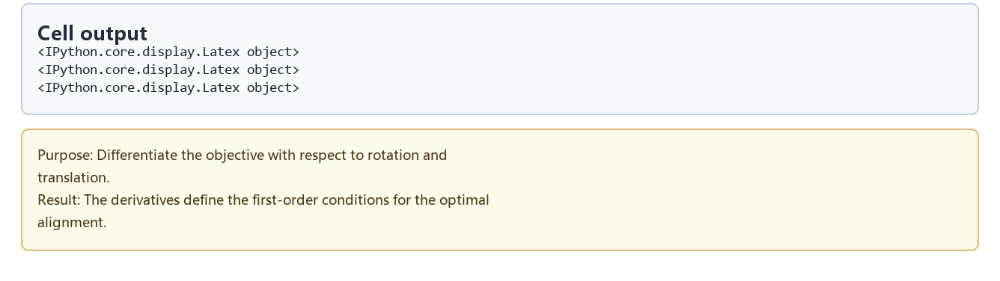

### Cell 8 - Expanded stationarity equations

Cell 8 展开偏导，目的是让所有求和内部项、三角项和平移项暴露出来。此时公式还不好读，但它保留了最完整的代数证据：后面的简写和求解都来自这些原始一阶条件。

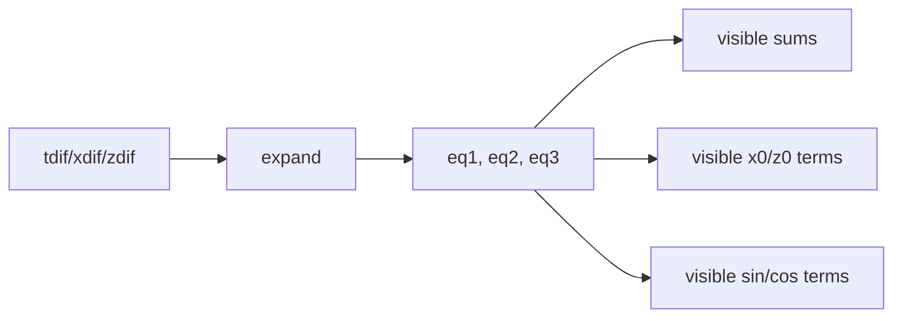

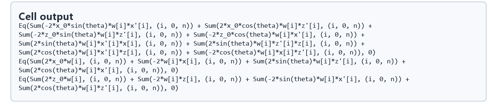

### Cell 13 - Weighted-sum shorthand

这一步不是数学上必要的，但对阅读闭式解非常关键。没有它，`solve` 和 `collect` 生成的式子会被重复求和淹没；有了它，translation 解可以被读成“两个加权中心的差”。

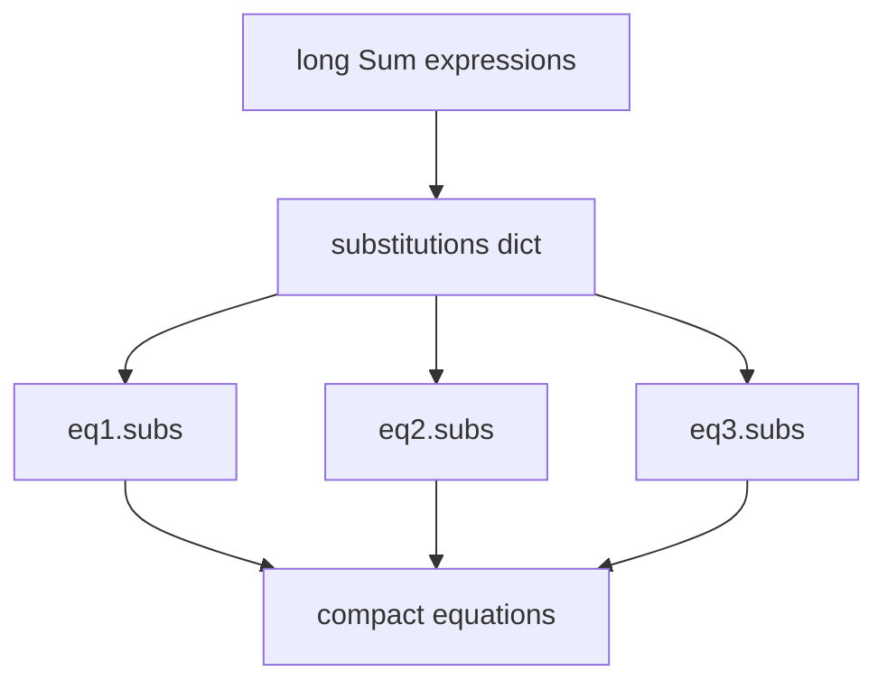

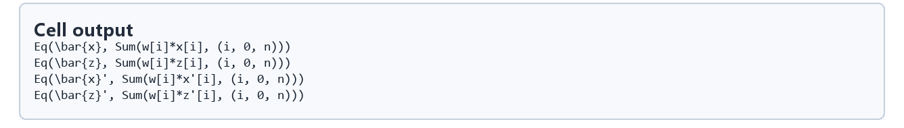

### Cell 16 - Closed-form translation solution

Cell 16 用 `solve(eq2, x_0)` 和 `solve(eq3, z_0)` 得到平移解。注意这里并没有消灭 `theta`：平移是在“给定旋转后”对齐两个加权质心。也正因为平移能先被解析消去，后面的旋转方程才会明显变短。

```mermaid
flowchart LR
    A[compact eq2] --> B[solve for x0]
    C[compact eq3] --> D[solve for z0]
    B --> E[x0_sol(theta)]
    D --> F[z0_sol(theta)]
    E --> G[ready to substitute into eq1]
    F --> G
```

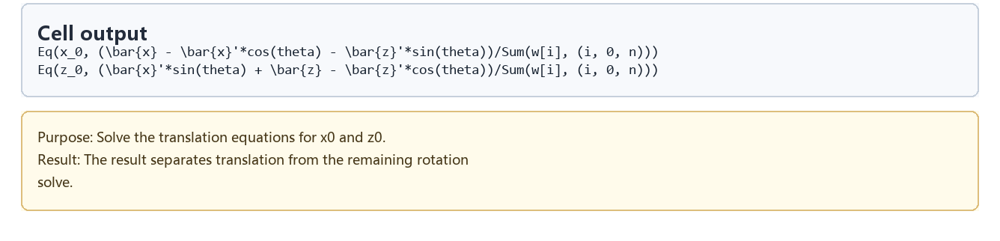

### Cell 20 - Final theta solution

Cell 20 读取 Cell 19 收集出的两个系数，用 `atan(-B/A)` 写出最终旋转。这个结果的意义不是“猜一个旋转”，而是把所有点对、权重和质心修正都汇入一个闭式角度。

```mermaid
flowchart TD
    A[eq4_col] --> B[coefficient of sin(theta): A]
    A --> C[coefficient of cos(theta): B]
    B --> D[tan(theta) = -B/A]
    C --> D
    D --> E[theta_sol]
    E --> F[compute transition alignment without iterative optimizer]
```

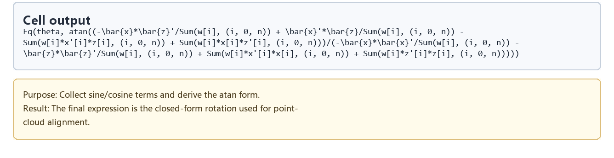

## 关键数据结构

| 名称 | 类型 / 形状 | 作用 |
| --- | --- | --- |
| `x`, `z` | `sympy.IndexedBase` | 第一组点云在水平面的目标坐标 |
| `xp`, `zp` | `sympy.IndexedBase` | 第二组点云在水平面的待变换坐标 |
| `w` | `sympy.IndexedBase` | 每个对应点的权重 |
| `theta`, `x_0`, `z_0` | `sympy.Symbol` | 待求旋转和平移变量 |
| `S` | `sympy.Sum` | 带权平方误差目标函数 |
| `tdif`, `xdif`, `zdif` | symbolic expression | 三个一阶偏导 |
| `eq1`, `eq2`, `eq3` | symbolic equation/expression | 展开和整理后的一阶最优条件 |
| `wixi`, `wizi`, `wixip`, `wizip` | `sympy.Symbol` | 加权坐标和的简写 |
| `substitutions` | dict | 从长求和式到短符号的替换表 |
| `x0_sol`, `z0_sol` | symbolic expression | 平移闭式解 |
| `eq4_col` | symbolic expression | 代回平移后、按 sin/cos 收集的旋转方程 |
| `theta_sol` | symbolic expression | 最终旋转闭式解 |

## 执行结果的意义

这篇的输出是公式证据，而不是动画。Cell 4 说明 transition alignment 最小化什么；Cell 6 和 Cell 8 证明最优条件来自真实偏导；Cell 13 让公式进入可读形式；Cell 16 给出质心式平移；Cell 20 给出旋转角度。串起来看，它解释了 motion graph 里常见的快速对齐为什么可以不做迭代优化。

对工程实现而言，闭式解的好处是稳定和便宜。transition search 往往要比较大量候选边，如果每条边都跑数值优化，代价会很高；有了 `theta`、`x_0`、`z_0` 的闭式解，就能先快速把候选动作放到最佳相对位置，再计算剩余误差作为连接质量。

## 重点可视化 / 动画

本案例的重点是公式推导，没有需要播放的 viewer 动画；正文只引用真实公式结果 PNG 和 walkthrough 证据。学习卡只放在后续证据表，不作为主视觉，也不新增滚动截图或假动画。

| Cell | 重点媒体 | 可视化主体 | 捕获方式 | 结果说明 |
| --- | --- | --- | --- | --- |
| 4 | [公式 PNG](assets/01_alignment_objective_formula_result.png) | Weighted point-cloud objective | `formula` | 明确 transition alignment 的目标函数 |
| 6 | [公式 PNG](assets/02_partial_derivatives_result.png) | Partial derivatives | `formula` | 给出三条一阶最优条件的来源 |
| 8 | [公式 PNG](assets/03_expanded_stationarity_result.png) | Expanded stationarity equations | `formula` | 展示展开后所有三角、平移和求和项 |
| 13 | [公式 PNG](assets/04_weighted_sum_shorthand_result.png) | Weighted-sum shorthand | `formula` | 把重复加权和压缩成可读记号 |
| 16 | [公式 PNG](assets/05_translation_solution_result.png) | Closed-form translation solution | `formula` | 平移解对应加权质心对齐 |
| 20 | [公式 PNG](assets/06_theta_solution_result.png) | Final theta solution | `formula` | 旋转解落到 atan 闭式公式 |
| walkthrough | [WebM](assets/00-walkthrough.webm) | 学习卡顺序回放 | `step_sequence` | 辅助检查公式输出顺序 |

## 代码 Cell 与可视化结果

结果 PNG 是正文阅读证据；代码学习卡只用于追溯 cell 摘要和输出来源。

| Cell | 输出类型 | 媒体角色 | 捕获方式 | 发布必需 | 结果媒体 | 代码学习卡 |
| --- | --- | --- | --- | --- | --- | --- |
| 4 | `formula` | `supporting_evidence` | `formula` | `false` | [PNG](assets/01_alignment_objective_formula_result.png) | [PNG](assets/01_alignment_objective_formula.png) |
| 6 | `latex` | `supporting_evidence` | `formula` | `false` | [PNG](assets/02_partial_derivatives_result.png) | [PNG](assets/02_partial_derivatives.png) |
| 8 | `latex` | `supporting_evidence` | `formula` | `false` | [PNG](assets/03_expanded_stationarity_result.png) | [PNG](assets/03_expanded_stationarity.png) |
| 13 | `latex` | `supporting_evidence` | `formula` | `false` | [PNG](assets/04_weighted_sum_shorthand_result.png) | [PNG](assets/04_weighted_sum_shorthand.png) |
| 16 | `formula` | `supporting_evidence` | `formula` | `false` | [PNG](assets/05_translation_solution_result.png) | [PNG](assets/05_translation_solution.png) |
| 20 | `formula` | `supporting_evidence` | `formula` | `false` | [PNG](assets/06_theta_solution_result.png) | [PNG](assets/06_theta_solution.png) |

## 运行方式

在仓库根目录运行自动化案例检查：

```powershell
powershell -NoProfile -ExecutionPolicy Bypass -File .\tools\run_case.ps1 motiongraph_pointcloud_derivation
```

手动阅读 notebook 时，打开 `labs/Theory/motiongraph_pointcloud_derivation.ipynb`，选择 kernel `animationtech-motiongraph_pointcloud_derivation`。本文只引用已经生成的公式输出与素材。
