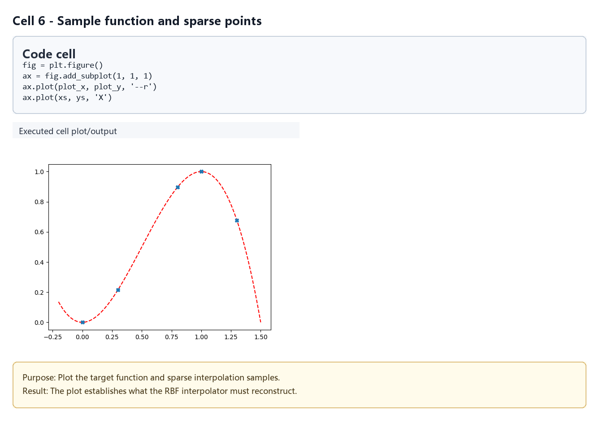
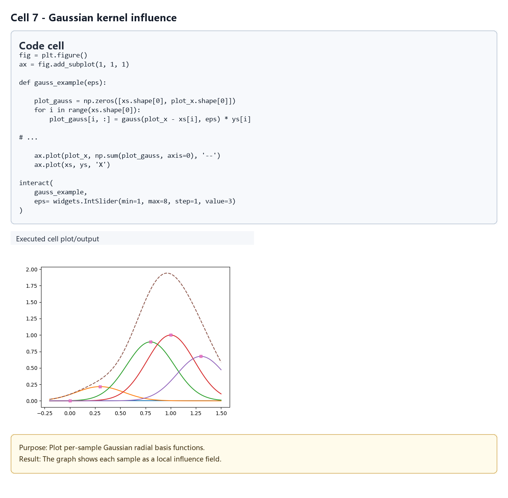
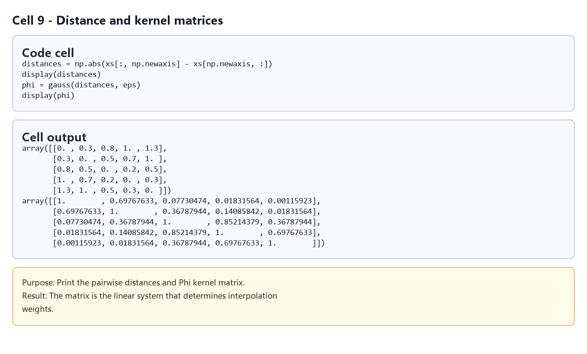
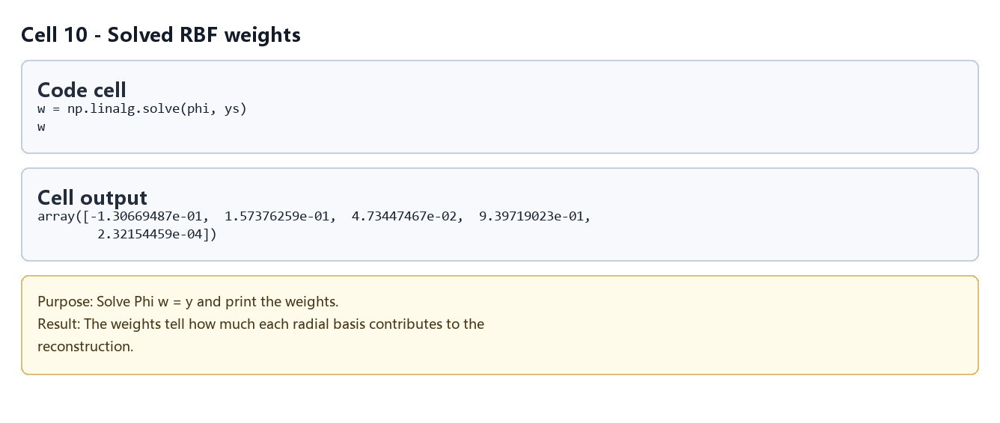
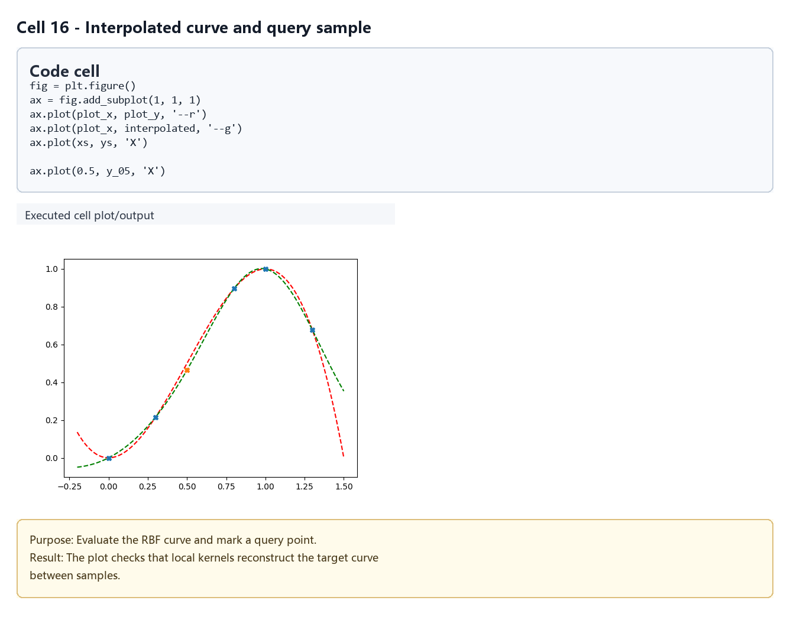
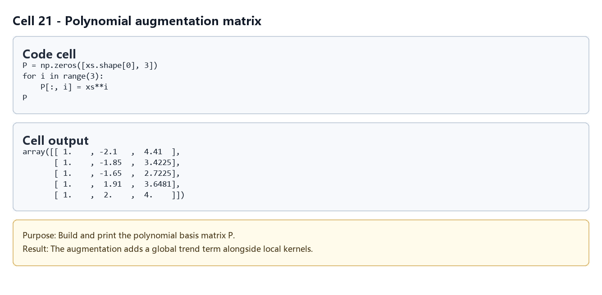
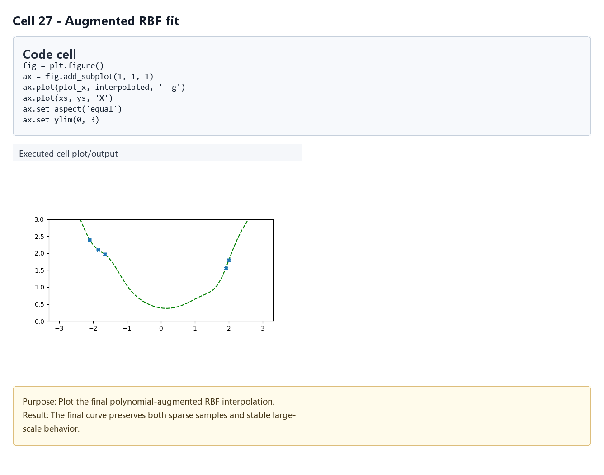

# 径向基函数插值

## 元数据

| 字段 | 内容 |
| --- | --- |
| slug | `radial_basis_function` |
| source path | [`labs/Theory/radial_basis_function.ipynb`](../../../../labs/Theory/radial_basis_function.ipynb) |
| env prefix | `.envs/radial_basis_function` |
| kernel | `animationtech-radial_basis_function` |
| validation status | `passed` (`automated`) |

## 问题背景

径向基函数（RBF）常用于从稀疏样本构造连续函数。它把每个样本点当作一个中心，用只依赖距离的 kernel 描述影响范围，再求一组权重，使插值函数穿过所有样本值。

这个 notebook 以 Gaussian kernel 为例，先展示一维 RBF 的基础插值流程，再讨论 `epsilon` 对形状的影响。最后加入 polynomial augmentation，让 RBF 在样本分布不均或需要全局趋势时更稳定。

和曲线/样条章节相比，RBF 也在做“从离散控制信息生成连续值”，但它的控制量不是 Bezier 或 B-Spline 那样的控制点序列，而是样本中心、距离 kernel 和求解出的权重。用于动作插值时，可以把姿态样本、控制器状态或特征空间位置看作 RBF 中心；查询姿态到各中心的距离决定每个样本对最终结果的影响。

## 总模块图

```mermaid
flowchart TD
    A[样本点 xs 与函数值 ys] --> B[Gaussian kernel phi(r)]
    B --> C[距离矩阵 distances]
    C --> D[Kernel 矩阵 Phi]
    D --> E[求解权重 w]
    E --> F[查询点插值]
    F --> G[观察 epsilon 影响]
    G --> H[Polynomial augmentation]
    H --> I[扩展线性系统求解]
```

## 模块拆解

1. **Gaussian kernel 定义**
   `gauss(radius, epsilon)` 实现 `exp(-(epsilon * radius)^2)`。kernel 只依赖查询点到样本中心的距离，因此是径向函数。

2. **构造示例函数和样本**
   `example_function` 提供一维目标函数，`xs` 是少量样本位置，`ys` 是对应函数值。`plot_x` 和 `plot_y` 用于对比真实函数与插值曲线。

3. **观察单个 kernel 的形状**
   `gauss_example` 画出每个样本中心对应的 Gaussian 曲线。交互参数 `eps` 展示 kernel 宽度对局部性和平滑性的影响：`epsilon` 越大，影响范围越窄。

4. **求解基础 RBF 权重**
   notebook 先计算样本之间的 `distances`，再得到 `phi = gauss(distances, eps)`。线性系统 `phi @ w = ys` 的解 `w` 会缩放每个 kernel，使组合函数穿过样本点。

5. **查询点与连续插值**
   对单个点 `0.5`，计算它到所有样本点的距离并用 `np.dot(phi, w)` 得到插值值。对 `plot_x` 重复同样流程，就得到连续插值曲线。

6. **Polynomial augmentation**
   在样本分布更分散的例子里，纯 RBF 可能缺少合理的全局趋势。notebook 构造多项式基 `P = [1, x, x^2]`，并求解块矩阵系统：

   ```text
   [ Phi  P ] [ w ] = [ f ]
   [ P^T  0 ] [ c ]   [ 0 ]
   ```

   其中 `w` 是径向权重，`c` 是多项式系数。

## 与曲线和动作插值的术语关系

- **样本中心 vs 控制点**：曲线章节里的控制点按序定义形状；RBF 的中心点定义影响源，通常存在于一维时间、二维平面或更高维特征空间中。
- **kernel 权重 vs basis 权重**：Bezier/B-Spline 使用多项式 basis 随 `t` 分配控制点影响；RBF 使用距离 kernel 随查询位置分配样本影响。
- **插值 vs 拟合**：基础 RBF 解线性系统后会穿过样本值，语义上接近插值曲线；加入正则化或改为最小二乘时，也可以转向拟合。
- **epsilon vs tension / tangent**：`epsilon` 控制 RBF 影响范围，类似在调局部性和平滑性；它不等同于 Cardinal 的 `tension` 或 Hermite 的 tangent，但都在影响过渡形状。
- **动作插值**：在动作系统中，RBF 常用于 pose blending、控制器空间插值和高维参数到动作值的映射；曲线样条更常用于时间轴上的单通道动画值或空间路径。

## 关键数据结构

- `xs`、`ys`：样本中心和目标函数值。
- `plot_x`、`plot_y`：用于绘图的密集采样点和真实函数值。
- `eps`：Gaussian kernel 的形状参数。
- `distances`：样本点或查询点到样本中心的距离矩阵。
- `phi`：RBF kernel 矩阵。
- `w`：求解出的径向权重。
- `interpolated`：在 `plot_x` 上计算出的插值结果。
- `P`：polynomial augmentation 中的多项式基矩阵。
- `extended_phi`、`extended_ys`：拼接多项式约束后的扩展线性系统。
- `gauss`、`example_function`、`gauss_example`：主要函数。

## 执行结果的意义

基础插值图说明 RBF 通过“每个样本一个 kernel，再求权重”的方式精确穿过样本点。`epsilon` 的交互图让人直观看到局部性和平滑性之间的取舍：kernel 太宽会过度平滑，太窄会在样本之间产生不稳定形状。

Polynomial augmentation 的结果说明，RBF 不一定只负责完整函数本身。让多项式项表达全局趋势、径向项表达局部残差，通常能得到更可靠的外推和更自然的曲线形状。

把它和曲线章节连起来看，可以把 RBF 理解为另一种连续插值工具：样条通常沿时间或点序构造连续曲线，RBF 则根据“离哪些样本更近”来混合结果。后续学习动作插值、pose space deformation 或 controller-driven deformation 时，这个距离驱动的视角会非常有用。

## 代码 Cell 与可视化结果

本节按 notebook 的关键 code cell 组织学习素材：每个条目都对应代码目的、实际输出类型、结果意义和 PNG 学习卡片。PNG 由指定 cell 的代码摘要、输出区、viewer/canvas 或图表/日志合成，不使用整页滚动截图替代。

[打开/下载 WebM](assets/00-walkthrough.webm)

| Cell | 输出类型 | 代码做什么 | 结果说明什么 | 素材 |
| --- | --- | --- | --- | --- |
| 6 | `plot` | Plot the target function and sparse interpolation samples. | The plot establishes what the RBF interpolator must reconstruct. | [PNG](assets/01_sample_function_points.png) |
| 7 | `plot` | Plot per-sample Gaussian radial basis functions. | The graph shows each sample as a local influence field. | [PNG](assets/02_gaussian_kernel_influence.png) |
| 9 | `matrix` | Print the pairwise distances and Phi kernel matrix. | The matrix is the linear system that determines interpolation weights. | [PNG](assets/03_distance_kernel_matrix.png) |
| 10 | `table` | Solve Phi w = y and print the weights. | The weights tell how much each radial basis contributes to the reconstruction. | [PNG](assets/04_rbf_weights.png) |
| 16 | `plot` | Evaluate the RBF curve and mark a query point. | The plot checks that local kernels reconstruct the target curve between samples. | [PNG](assets/05_interpolated_query_result.png) |
| 21 | `matrix` | Build and print the polynomial basis matrix P. | The augmentation adds a global trend term alongside local kernels. | [PNG](assets/06_polynomial_basis_matrix.png) |
| 27 | `plot` | Plot the final polynomial-augmented RBF interpolation. | The final curve preserves both sparse samples and stable large-scale behavior. | [PNG](assets/07_augmented_rbf_fit.png) |

### Cell 6 - Sample function and sparse points

- 代码做什么：Plot the target function and sparse interpolation samples.
- 运行后看到什么：图表输出。
- 结果说明什么：The plot establishes what the RBF interpolator must reconstruct.



### Cell 7 - Gaussian kernel influence

- 代码做什么：Plot per-sample Gaussian radial basis functions.
- 运行后看到什么：图表输出。
- 结果说明什么：The graph shows each sample as a local influence field.



### Cell 9 - Distance and kernel matrices

- 代码做什么：Print the pairwise distances and Phi kernel matrix.
- 运行后看到什么：矩阵或数组输出。
- 结果说明什么：The matrix is the linear system that determines interpolation weights.



### Cell 10 - Solved RBF weights

- 代码做什么：Solve Phi w = y and print the weights.
- 运行后看到什么：表格或结构化数据输出。
- 结果说明什么：The weights tell how much each radial basis contributes to the reconstruction.



### Cell 16 - Interpolated curve and query sample

- 代码做什么：Evaluate the RBF curve and mark a query point.
- 运行后看到什么：图表输出。
- 结果说明什么：The plot checks that local kernels reconstruct the target curve between samples.



### Cell 21 - Polynomial augmentation matrix

- 代码做什么：Build and print the polynomial basis matrix P.
- 运行后看到什么：矩阵或数组输出。
- 结果说明什么：The augmentation adds a global trend term alongside local kernels.



### Cell 27 - Augmented RBF fit

- 代码做什么：Plot the final polynomial-augmented RBF interpolation.
- 运行后看到什么：图表输出。
- 结果说明什么：The final curve preserves both sparse samples and stable large-scale behavior.



## 运行方式

在仓库根目录运行：

```powershell
powershell -NoProfile -ExecutionPolicy Bypass -File .\tools\run_case.ps1 radial_basis_function
.\.envs\radial_basis_function\python.exe -m jupyter lab --notebook-dir .
```

打开 `labs/Theory/radial_basis_function.ipynb`，选择 kernel `animationtech-radial_basis_function`。本说明只根据 notebook 源内容整理，没有重新执行 notebook。

## 重点可视化 / 动画

README 中优先引用结果 PNG、GIF 预览和视频链接；代码学习卡保留为复现证据。

[打开/下载总览 WebM](assets/00-walkthrough.webm)

| Cell | 输出类型 | 媒体角色 | 代码目的 | 结果媒体 |
| --- | --- | --- | --- | --- |
| Cell 6 | `plot` | `key_visual` | Plot the target function and sparse interpolation samples. | [结果 PNG](assets/01_sample_function_points_result.png) / [代码卡](assets/01_sample_function_points.png) |
| Cell 7 | `plot` | `key_visual` | Plot per-sample Gaussian radial basis functions. | [结果 PNG](assets/02_gaussian_kernel_influence_result.png) / [代码卡](assets/02_gaussian_kernel_influence.png) |
| Cell 9 | `matrix` | `supporting_evidence` | Print the pairwise distances and Phi kernel matrix. | [结果 PNG](assets/03_distance_kernel_matrix_result.png) / [代码卡](assets/03_distance_kernel_matrix.png) |
| Cell 10 | `table` | `supporting_evidence` | Solve Phi w = y and print the weights. | [结果 PNG](assets/04_rbf_weights_result.png) / [代码卡](assets/04_rbf_weights.png) |
| Cell 16 | `plot` | `key_visual` | Evaluate the RBF curve and mark a query point. | [结果 PNG](assets/05_interpolated_query_result_result.png) / [代码卡](assets/05_interpolated_query_result.png) |
| Cell 21 | `matrix` | `supporting_evidence` | Build and print the polynomial basis matrix P. | [结果 PNG](assets/06_polynomial_basis_matrix_result.png) / [代码卡](assets/06_polynomial_basis_matrix.png) |
| Cell 27 | `plot` | `key_visual` | Plot the final polynomial-augmented RBF interpolation. | [结果 PNG](assets/07_augmented_rbf_fit_result.png) / [代码卡](assets/07_augmented_rbf_fit.png) |

## 代码 Cell 与可视化结果

本节保留每个 cell 的可复现证据。结果 PNG 用于正文阅读，代码卡记录代码摘要与输出来源；有 timeline 或参数滑杆的 cell 同时提供 GIF、MP4 和 WebM。

| Cell / 片段 | 结果说明 | 证据 |
| --- | --- | --- |
| Cell 6 | The plot establishes what the RBF interpolator must reconstruct. | [结果 PNG](assets/01_sample_function_points_result.png) / [代码卡](assets/01_sample_function_points.png) |
| Cell 7 | The graph shows each sample as a local influence field. | [结果 PNG](assets/02_gaussian_kernel_influence_result.png) / [代码卡](assets/02_gaussian_kernel_influence.png) |
| Cell 9 | The matrix is the linear system that determines interpolation weights. | [结果 PNG](assets/03_distance_kernel_matrix_result.png) / [代码卡](assets/03_distance_kernel_matrix.png) |
| Cell 10 | The weights tell how much each radial basis contributes to the reconstruction. | [结果 PNG](assets/04_rbf_weights_result.png) / [代码卡](assets/04_rbf_weights.png) |
| Cell 16 | The plot checks that local kernels reconstruct the target curve between samples. | [结果 PNG](assets/05_interpolated_query_result_result.png) / [代码卡](assets/05_interpolated_query_result.png) |
| Cell 21 | The augmentation adds a global trend term alongside local kernels. | [结果 PNG](assets/06_polynomial_basis_matrix_result.png) / [代码卡](assets/06_polynomial_basis_matrix.png) |
| Cell 27 | The final curve preserves both sparse samples and stable large-scale behavior. | [结果 PNG](assets/07_augmented_rbf_fit_result.png) / [代码卡](assets/07_augmented_rbf_fit.png) |
