# 径向基函数插值：从稀疏样本到连续函数场

## 元数据

| 字段 | 内容 |
| --- | --- |
| slug | `radial_basis_function` |
| source path | [`labs/Theory/radial_basis_function.ipynb`](<../../../../labs/Theory/radial_basis_function.ipynb>) |
| transcript sources | [`docs/transcripts/luX11STn1Uk_Radial Basis Function.txt`](<../../../../docs/transcripts/luX11STn1Uk_Radial Basis Function.txt>) |
| kind | `notebook` |
| env | `.envs/radial_basis_function` |
| kernel | `animationtech-radial_basis_function` |
| validation | `passed` (`automated`) |
| publish tier | `媒体完整 + 发布基底` |
| media quality | key_visual/key_animation 必须是算法输出本身，禁止滚动截图、整页 cell、代码卡裁剪和静态假动画 |

## 问题背景

RBF（Radial Basis Function）解决的是一个很常见的问题：我们只知道少量样本点的值，却希望在样本之间得到一条平滑、连续、并且穿过样本的函数。语音稿里反复强调的直觉是，RBF 不先假设一条全局曲线，而是把每个已知样本当成一个影响源；查询点离哪些样本近，就更强地感受到哪些样本的影响。

这个 notebook 用一维函数做最小可视化版本。输入是稀疏采样位置 `xs` 和函数值 `ys`，核心是 Gaussian kernel：

```text
Phi(r) = exp(-(epsilon * r)^2)
```

它只依赖距离 `r`，所以叫“径向”。`epsilon` 控制距离被放大的速度：值越大，Gaussian 越窄，样本影响越局部；值越小，影响越宽，样本之间耦合越强。如果只是把每个样本中心的 Gaussian 曲线直接相加，结果会过冲或下陷；真正的 RBF 插值会先组成 kernel matrix `Phi_ki = Phi(|x_k - x_i|)`，再求解一组权重 `w`，让 `sum_i w_i Phi(|x_k - x_i|) = y_k` 在所有样本点同时成立。后半段引入 polynomial augmentation，把全局二次趋势交给多项式项，把局部偏差交给 RBF 项，解释为什么纯 Gaussian RBF 擅长插值但不擅长外推。

## 阅读前置知识

读这篇前，最好先确认五件事：

1. 线性系统 `A x = b`：RBF 的权重不是手调出来的，而是从 kernel matrix 直接求解。
2. NumPy broadcasting：`xs[:, None] - xs[None, :]` 会一次性得到样本两两距离矩阵。
3. kernel / basis 的区别：kernel 是“距离到影响值”的函数，basis 是最终组合中的一列或一个影响源。
4. 插值与外推的差异：穿过样本之间的区域叫插值；跑到样本覆盖范围之外叫外推，RBF 在这里需要额外趋势项帮助。
5. 块矩阵约束：polynomial augmentation 会把 `Phi`、`P`、`P^T` 放进同一个线性系统，读懂它比只看最终曲线更重要。

这篇是后续 `radial_basis_function_verbs_and_adverbs` 的数学前置：后者把这里的一维样本点换成高维 adverb 坐标，把标量函数值换成动作参数或颜色自由度。

## 总模块图

```mermaid
flowchart TD
    A[稀疏样本函数 xs, ys] --> B[Gaussian basis phi(r)]
    B --> C[样本两两距离矩阵 distances]
    C --> D[Kernel matrix Phi]
    D --> E[求解 Phi * w = ys]
    E --> F[查询点距离到所有样本中心]
    F --> G[矩阵乘法得到插值曲线]
    G --> H[观察插值好、外推弱]
    H --> I[构造 polynomial basis P]
    I --> J[扩展块矩阵求解 w 与 c]
    J --> K[局部 RBF + 全局 affine/quadratic 趋势]
```

## 代码执行路径

notebook 的执行顺序可以读成一条“从样本到可查询函数”的管线。

```mermaid
sequenceDiagram
    participant Data as xs / ys
    participant Kernel as gauss(radius, eps)
    participant Matrix as Phi matrix
    participant Solver as np.linalg.solve
    participant Query as plot_x / x=0.5
    participant Aug as polynomial augmentation
    participant Plot as matplotlib

    Data->>Kernel: 定义样本中心和 Gaussian 形状
    Data->>Matrix: 计算两两距离 distances
    Kernel->>Matrix: Phi = gauss(distances, eps)
    Matrix->>Solver: 解 Phi * w = ys
    Query->>Kernel: 计算查询点到各中心的 kernel 值
    Solver->>Query: dot(phi, w) 得到插值结果
    Data->>Aug: 构造 P = [1, x, x^2]
    Aug->>Solver: 解扩展块矩阵 [Phi P; P^T 0]
    Solver->>Plot: 绘制基础 RBF 与增强 RBF
```

工程上要注意，Cell 13 只计算单个查询点 `0.5`，Cell 15 把同一件事批量化到 `plot_x`。RBF 的数学公式看起来像求和，但实际代码尽量写成矩阵乘法，这样可以一次性处理许多查询点。本文只使用元信息中列出的 notebook 和 transcript 作为解释来源，所有图片都引用已有 `assets` 输出。

## 模块拆解

### 1. 样本函数与中心点

前半段的 `example_function(x) = -2*x^3 + 3*x^2` 只是一个可观察的真值函数。`xs = [0, .3, .8, 1.0, 1.3]` 是我们假装“真实测到”的稀疏点，`ys = example_function(xs)` 是这些点上的函数值。

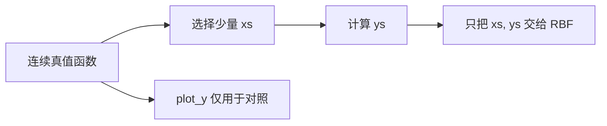

**执行结果怎么看：** Cell 6 的红色虚线是真值，叉号是稀疏样本。RBF 后续不能“偷看”红线，它只能用叉号重建中间形状。

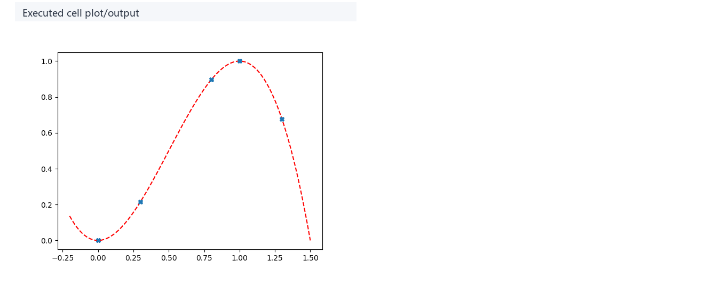

### 2. Gaussian basis 与 epsilon

`gauss(radius, epsilon)` 把距离转换成影响强度。距离越近，值越接近 1；距离越远，值越接近 0。这里的 `radius` 可以是单个数，也可以是距离矩阵；NumPy 会把 `exp(-(epsilon * radius)^2)` 逐元素应用到每个距离上。`epsilon` 决定钟形曲线宽窄：越大越窄、越局部，越小越宽、越平滑但也越容易让远样本互相干扰。

```mermaid
flowchart LR
    A[查询点 x] --> B[计算 radius = x - x_i]
    B --> C[Phi = exp(-(eps * radius)^2)]
    C --> D[得到样本 i 对 x 的影响]
```

**执行结果怎么看：** Cell 7 显示每个样本中心各自形成一个局部影响场。语音稿里提到，如果直接把这些曲线相加，要么整体过冲，要么在样本间下陷，所以需要下一步求权重。

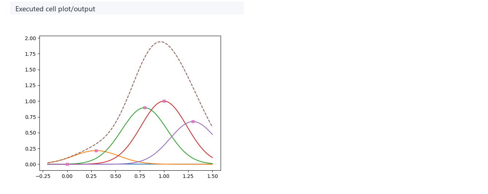

### 3. Kernel matrix 与权重求解

RBF 插值的关键是让组合函数穿过所有样本。对第 `k` 个样本点来说：

```text
f(x_k) = sum_i w_i * Phi(|x_k - x_i|)
```

把所有样本点一起写成矩阵形式，就是：

```text
Phi * w = ys
```

```mermaid
flowchart LR
    A[xs 列向量] --> B[两两相减取绝对值]
    B --> C[distances 矩阵]
    C --> D[gauss(distances, eps)]
    D --> E[Phi]
    F[ys] --> G[solve(Phi, ys)]
    E --> G
    G --> H[w]
```

**执行结果怎么看：** Cell 9 的距离矩阵对角线为 0，因为每个样本到自己距离为 0；经过 Gaussian 后，`Phi` 对角线变成 1。非对角元素描述样本之间的相互影响，越接近 1 表示两个中心越难被区分。Cell 10 的 `w` 不是样本值本身，而是每个 basis 需要放大或反向抵消多少，才能让总和穿过所有点。

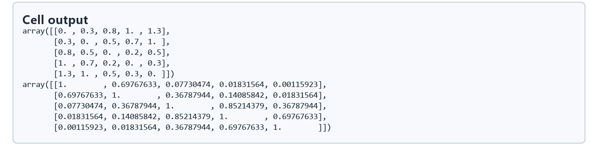

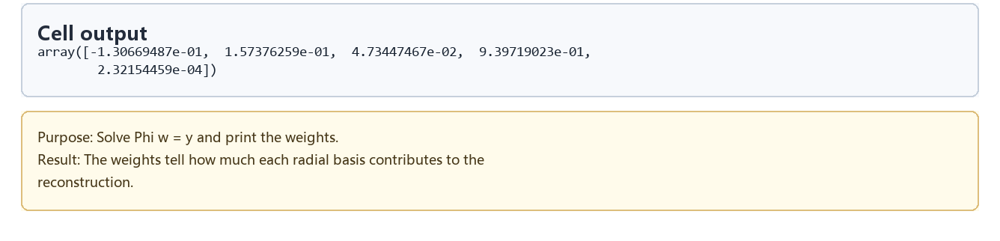

### 4. 查询点与连续插值曲线

求出 `w` 后，新查询点不再参与解线性系统。它只需要计算自己到所有样本中心的距离，走同一个 Gaussian kernel，再与 `w` 点乘。样本阶段的 `Phi` 是 `[n,n]`，查询阶段的 `query Phi` 是 `[m,n]`；两者使用同一个 kernel，但承担的角色不同。

```mermaid
flowchart LR
    A[query x 或 plot_x] --> B[到每个 xs 的距离]
    B --> C[phi_query]
    C --> D[dot(phi_query, w)]
    D --> E[单点 y_05 或整条 interpolated 曲线]
```

**执行结果怎么看：** Cell 16 中绿色曲线是 RBF 插值，红色虚线是真值，叉号是样本。绿色线应穿过样本点；样本之间越接近红线，说明当前 kernel 宽度和样本分布越适合这个函数。样本范围之外的趋势不可靠，这就是后面要加多项式项的原因。

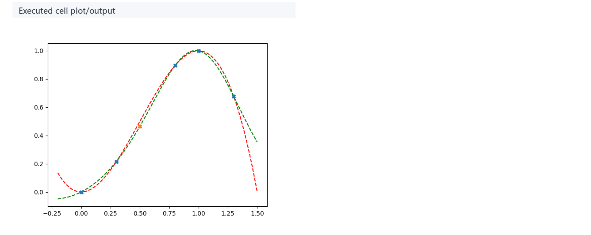

### 5. Polynomial augmentation

纯 RBF 只看局部距离，遇到两个样本簇分布很远、整体趋势又很明显的情况，外推会往 0 或奇怪方向塌。notebook 后半段改用近似二次函数的数据，并构造：

```text
P = [1, x, x^2]

[ Phi  P ] [ w ] = [ ys ]
[ P^T  0 ] [ c ]   [ 0  ]
```

这里 `w` 是径向项权重，`c` 是多项式系数。最终函数可以读作 `f(x)=phi(x)w + P(x)c`：多项式项负责常数、斜率和二次弯曲这类低频趋势，RBF 项负责样本附近的剩余形状。`P^T w = 0` 这一组约束避免径向项和多项式项互相抢同一个全局趋势，否则同一段变化可能被两套参数重复解释，外推会更不稳定。

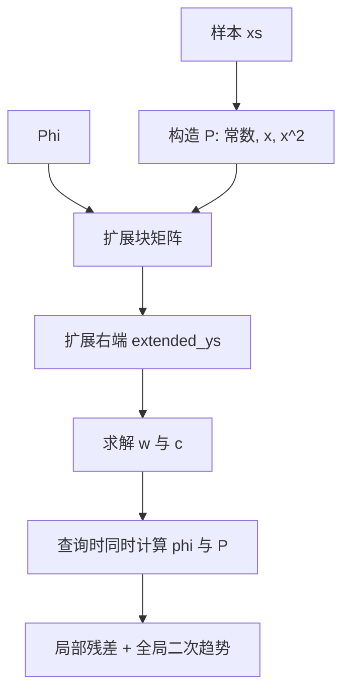

**执行结果怎么看：** Cell 21 的 `P` 告诉读者多项式基如何由样本坐标生成。Cell 27 的曲线显示增强后的 RBF 不再只靠 Gaussian 钟形曲线硬撑，而是能用二次项解释大趋势，用径向项补局部差异。这个拆分正对应后续动作语义插值里的 “linear term + residual radial coefficients”。

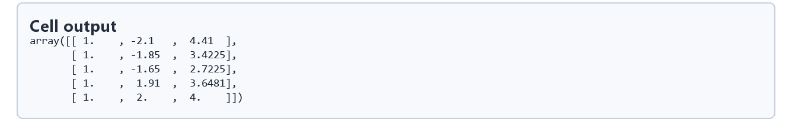

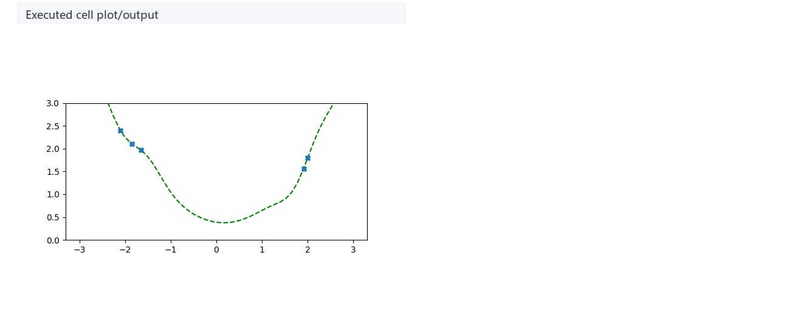

## 关键 cell / 函数深讲

### Cell 6 - Sample function and sparse points

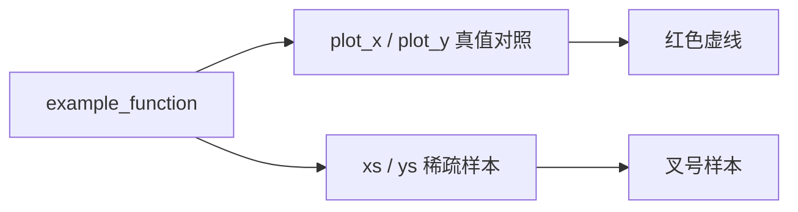

- 代码做什么：画出目标函数和稀疏插值样本。
- 运行后看到什么：一条真值曲线和 5 个已知样本点。
- 结果说明什么：后续 RBF 的输入只有 `xs, ys`，红线只是用于验证重建效果。
- 可视化主体：Sample function and sparse points。
- 捕获方式：`plot`，来自 executed plot output。

### Cell 7 - Gaussian kernel influence

```mermaid
flowchart LR
    A[xs 中每个中心] --> B[plot_x - xs_i]
    B --> C[gauss(..., eps)]
    C --> D[乘以 ys_i 只为展示高度]
    D --> E[每个样本的局部影响曲线]
```

- 代码做什么：把每个样本中心对应的 Gaussian radial basis 画出来。
- 运行后看到什么：多个以样本为中心的钟形影响曲线。
- 结果说明什么：RBF 的局部性来自距离 kernel，但直接相加不是最终插值。
- 可视化主体：Gaussian kernel influence。
- 捕获方式：`plot`。

### Cell 9 / 10 - Kernel matrix and weights

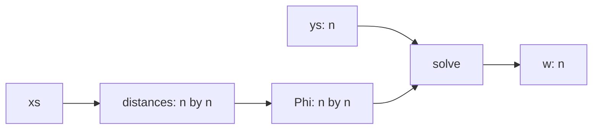

- 代码做什么：打印样本两两距离、kernel matrix，并求解 `Phi w = ys`。
- 运行后看到什么：一个对称距离矩阵、一个对称 `Phi` 矩阵，以及权重向量。
- 结果说明什么：RBF 的权重是为“穿过样本值”服务的，不等于样本值本身。
- 可视化主体：Distance and kernel matrices / Solved RBF weights。
- 捕获方式：`table`。

### Cell 16 - Interpolated curve and query sample

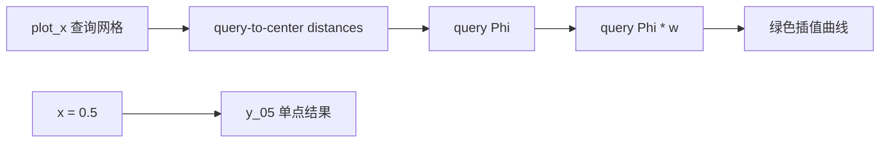

- 代码做什么：对整条查询网格批量计算 RBF 插值，并标出 `x=0.5` 的单点结果。
- 运行后看到什么：真值、RBF 插值、样本点和一个查询点。
- 结果说明什么：矩阵乘法版本和数学求和等价，但更适合批量绘图和工程实现。
- 可视化主体：Interpolated curve and query sample。
- 捕获方式：`plot`。

### Cell 21 / 27 - Polynomial augmented RBF

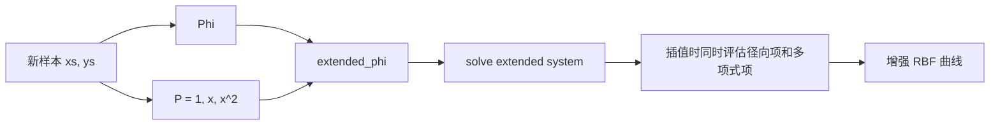

- 代码做什么：构造多项式基矩阵，求解扩展线性系统，并绘制增强后的插值。
- 运行后看到什么：`P` 矩阵和一条带全局二次趋势的最终曲线。
- 结果说明什么：augmented affine / polynomial terms 给 RBF 提供外推趋势，径向项只负责局部修正。
- 可视化主体：Polynomial augmentation matrix / Augmented RBF fit。
- 捕获方式：`table` 与 `plot`。

## 关键数据结构

| 名称 | 形状或类型 | 作用 |
| --- | --- | --- |
| `xs` | `[n]` | 样本中心的位置，也就是每个 radial basis 的中心。 |
| `ys` | `[n]` | 每个中心处必须被插值函数命中的目标值。 |
| `plot_x` / `plot_y` | `[m]` | 绘图用查询网格和真值对照；`plot_y` 不参与求解。 |
| `eps` | scalar | Gaussian kernel 宽度参数，控制局部性和平滑性。 |
| `distances` | `[n, n]` 或 `[m, n]` | 样本到样本、查询点到样本的距离矩阵。 |
| `phi` / `Phi` | `[n, n]` 或 `[m, n]` | 距离经过 kernel 后形成的 basis matrix。 |
| `w` | `[n]` | 径向基权重；控制每个样本中心的局部 basis 如何被放大、压低或反向抵消。 |
| `c` | `[3]` | polynomial augmentation 中的多项式系数，对应常数、一次、二次趋势。 |
| `interpolated` | `[m]` | 对查询网格求得的连续插值结果。 |
| `P` | `[n, 3]` 或 `[1, 3]` | 多项式基矩阵，这里对应常数项、一次项和二次项。 |
| `extended_phi` | `[n+3, n+3]` | 把 kernel matrix 与 polynomial constraints 合并后的块矩阵。 |
| `extended_ys` | `[n+3]` | 样本值加上约束右端 0。 |

## 执行结果的意义

基础 RBF 图说明：只要 kernel matrix 可解，RBF 可以精确穿过给定样本，并在样本之间产生平滑曲线。读图时不要只看曲线是否“像红线”，还要看它是否命中叉号；命中样本是插值系统求解正确的第一指标。

Gaussian kernel 图说明：`epsilon` 不是简单的“越大越好”。kernel 太宽时，远处样本相互干扰强，组合容易过度平滑；kernel 太窄时，样本之间缺少支撑，曲线可能下陷或不稳定。

增强 RBF 图说明：当样本分布不能覆盖外推区域时，RBF 自己不知道“应该继续沿二次趋势走”。加入 `P=[1,x,x^2]` 后，全局趋势由多项式项承接，径向项只处理样本附近的残差。换句话说，纯 RBF 解的是“所有形状都由局部中心解释”，增强 RBF 解的是“全局趋势先解释，局部误差再修正”。这就是后续动作语义空间里“linear terms + radial residuals”的数学原型。

## 重点可视化 / 动画

正文重点媒体只引用真实算法输出。学习卡仅作为后面的复现证据，不作为主视觉；`00-walkthrough.webm` 是学习卡串联视频，也不替代本文核心结果图。

| Cell | 重点媒体 | 可视化主体 | 捕获方式 | 结果说明什么 |
| --- | --- | --- | --- | --- |
| 6 | [结果 PNG](assets/01_sample_function_points_result.png) | Sample function and sparse points | `plot` | 建立 RBF 必须从稀疏点重建的目标。 |
| 7 | [结果 PNG](assets/02_gaussian_kernel_influence_result.png) | Gaussian kernel influence | `plot` | 展示每个样本作为局部影响源的形状。 |
| 16 | [结果 PNG](assets/05_interpolated_query_result_result.png) | Interpolated curve and query sample | `plot` | 验证求解权重后，查询点可由 kernel 值与权重组合得到。 |
| 21 | [结果 PNG](assets/06_polynomial_basis_matrix_result.png) | Polynomial basis matrix | `table` | 展示多项式增强项如何把样本坐标变成全局趋势基。 |
| 27 | [结果 PNG](assets/07_augmented_rbf_fit_result.png) | Augmented RBF fit | `plot` | 展示多项式增强如何改善稀疏样本下的全局趋势。 |

## 代码 Cell 与可视化证据

| Cell | 输出类型 | 媒体角色 | 捕获方式 | 发布必需 | 结果媒体 | 代码学习卡 |
| --- | --- | --- | --- | --- | --- | --- |
| 6 | `plot` | 核心图解 | `plot` | `true` | [PNG](assets/01_sample_function_points_result.png) | [PNG](assets/01_sample_function_points.png) |
| 7 | `plot` | 核心图解 | `plot` | `true` | [PNG](assets/02_gaussian_kernel_influence_result.png) | [PNG](assets/02_gaussian_kernel_influence.png) |
| 9 | `matrix` | `supporting_evidence` | `table` | `false` | [PNG](assets/03_distance_kernel_matrix_result.png) | [PNG](assets/03_distance_kernel_matrix.png) |
| 10 | `table` | `supporting_evidence` | `table` | `false` | [PNG](assets/04_rbf_weights_result.png) | [PNG](assets/04_rbf_weights.png) |
| 16 | `plot` | 核心图解 | `plot` | `true` | [PNG](assets/05_interpolated_query_result_result.png) | [PNG](assets/05_interpolated_query_result.png) |
| 21 | `matrix` | `supporting_evidence` | `table` | `false` | [PNG](assets/06_polynomial_basis_matrix_result.png) | [PNG](assets/06_polynomial_basis_matrix.png) |
| 27 | `plot` | 核心图解 | `plot` | `true` | [PNG](assets/07_augmented_rbf_fit_result.png) | [PNG](assets/07_augmented_rbf_fit.png) |

## 运行方式

在仓库根目录运行：

```powershell
powershell -NoProfile -ExecutionPolicy Bypass -File .\tools\run_case.ps1 radial_basis_function
.\.envs\radial_basis_function\python.exe -m jupyter lab --notebook-dir .
```

打开 `labs/Theory/radial_basis_function.ipynb`，选择 kernel `animationtech-radial_basis_function`，按 cell 顺序运行。本文根据 notebook、素材清单与对应 transcript 整理；正文媒体均来自现有 `assets` 中的真实 notebook 输出。
