# RBF Verbs and Adverbs：动作语义空间中的线性项与径向残差

## 元信息

| 字段 | 值 |
| --- | --- |
| slug | `radial_basis_function_verbs_and_adverbs` |
| source path | [`labs/Theory/radial_basis_function_verbs_and_adverbs.ipynb`](../../../../labs/Theory/radial_basis_function_verbs_and_adverbs.ipynb) |
| transcript sources | [`docs/transcripts/rL0pEfXbQ6g_Radial Basis Function _ Multidimensional Motion Interpolation.txt`](../../../../docs/transcripts/rL0pEfXbQ6g_Radial%20Basis%20Function%20_%20Multidimensional%20Motion%20Interpolation.txt) |
| kind | `notebook` |
| env prefix | `.envs/rbf_verbs_adv` |
| kernel | `animationtech-radial_basis_function_verbs_and_adverbs` |
| validation status | `passed` (`automated`) |
| publish tier | `深写完成 + 媒体完整` |

## 问题背景

Verbs and Adverbs 论文里的 “verb” 指动作类型，例如走、跑、转身；“adverb” 指调节动作风格或状态的连续参数，例如向左、向右、开心、疲惫、快、慢。论文真正要做的是：给定少量示例动作，在高维 adverb 空间里插值出每个骨骼自由度的参数，从而得到可连续调节的动作。

这个理论 notebook 把问题压缩成可视化版本：二维网格点代表语义位置，RGB 颜色代表动作自由度。为了模拟论文中的高维输入，二维坐标会被编码成四个非负 adverb 通道：right、left、up、down。输出也不是单个标量，而是 3 个颜色通道；这对应动画里“多个骨骼自由度一起被同一个语义坐标驱动”。因此，图上的颜色不是装饰，而是把高维动作参数场投影成可检查的三通道结果。

核心思想不是直接用 RBF 拟合完整输出，而是先做线性近似，再让 RBF 只拟合线性模型留下的 residuals：

```text
final(p) = linear(p) + radial_residual(p)
```

语音稿里给出的动机很重要：线性项提供稳定、可外推的全局趋势；径向项只在样本附近补局部细节，避免远处不相关动作互相影响。这正是从基础 RBF 走向动作语义空间的关键一步：语义坐标负责“想要什么风格”，线性项给出粗略参数，RBF residual 再把示例动作附近的细节补回去。

## 阅读前置知识

读这篇前，建议先理解：

1. 基础 RBF：样本中心、距离矩阵、kernel matrix、权重求解，见 [`radial_basis_function`](../radial_basis_function/README.md)。
2. 最小二乘：线性项不是精确插值，而是找到能最好解释所有样本的全局 hyperplane。
3. 高维坐标：这里图上是二维点，但算法真正操作的是四维 `adverbs`。
4. 多输出拟合：RGB 三个通道一起求解，对应动画系统里多个 DOF 一起求系数。
5. compact support：三次 B-spline kernel 在归一化距离大于 2 后影响为 0，远样本会被自然屏蔽。
6. 残差建模：这里的 RBF 不直接拟合 `data`，而是拟合 `data - linear_prediction`，这是理解论文动机的关键。

## 总模块图

```mermaid
flowchart TD
    A[二维语义样本 points] --> B[样本输出 data: RGB / DOF]
    A --> C[编码为四维 adverbs]
    C --> D[adverb_matrix = 1 + adverb channels]
    D --> E[最小二乘求 linear_coefficients]
    E --> F[线性颜色场 linear_color]
    B --> G[residuals = data - linear prediction]
    C --> H[四维样本距离矩阵]
    H --> I[nearest-neighbor alphas]
    I --> J[Cubic B-spline basis B3(d/alpha)]
    J --> K[求 radial_coefficients]
    F --> L[final_color = linear_color + radial residual field]
    K --> L
    L --> M[RBF 类封装 fit / call]
```

## 代码执行路径

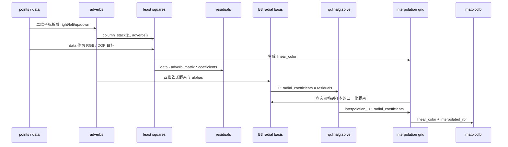

执行时有两个“坐标世界”要分清：`points` 只是为了画图好理解的二维位置；`adverbs` 才是线性项和 RBF 距离真正使用的特征空间。本文只使用元信息中列出的 notebook 和 transcript 作为解释来源，正文图片都来自已有 `assets`，不生成新媒体，也不把学习卡当主视觉。

## 模块拆解

### 1. 从二维点到四维 adverb 坐标

notebook 先定义 7 个样本点和对应 RGB 值。随后把每个二维点拆成四个非负通道：

```text
right = max(x, 0)
left  = abs(min(x, 0))
up    = max(y, 0)
down  = abs(min(y, 0))
```

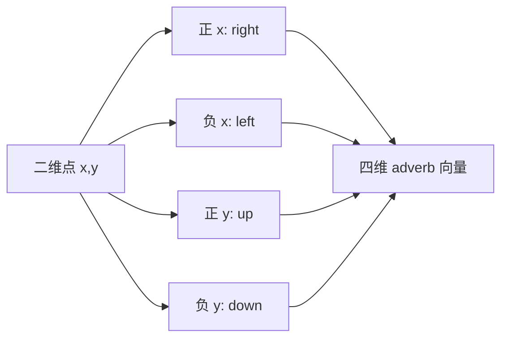

**执行结果怎么看：** Cell 3 的颜色点是语义样本，Cell 4 的矩阵是算法实际输入。把左右、上下拆成非负通道后，虽然图还是二维，模型已经具备高维 adverb 空间的形式。真实动作系统可以把这些通道换成“快/慢”“开心/疲惫”“左转/右转”等连续控制维度。

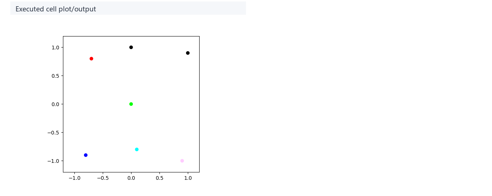

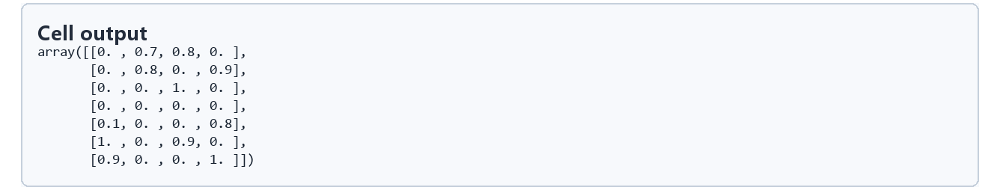

### 2. 线性项：动作参数场的全局趋势

论文中的线性项可以理解成“adverb 空间里的超平面”。给定 `n` 个样本和 `d` 个输出自由度，这一步求的是矩阵 `C`，让 `adverb_matrix @ C` 尽量接近样本输出 `data`。notebook 用：

```python
adverb_matrix = np.column_stack([np.ones(adverbs.shape[0]), adverbs])
linear_coefficients = np.linalg.lstsq(adverb_matrix, data, rcond=None)[0]
```

对 RGB 三个输出通道同时求解。结果矩阵有 5 行：常数项 + 四个 adverb 通道；有 3 列：R、G、B 三个 DOF。它不是精确插值器，而是动作参数场的低频骨架：远离样本时仍能给出连续结果，靠近样本时允许后续 residual 修正。

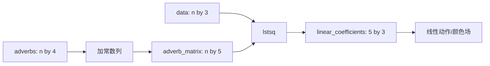

**执行结果怎么看：** Cell 7 的系数说明每个 adverb 通道如何推动每个输出自由度。Cell 9 的线性颜色场平滑、可外推，但不能精确命中所有样本，这些误差会成为 RBF 层的输入。

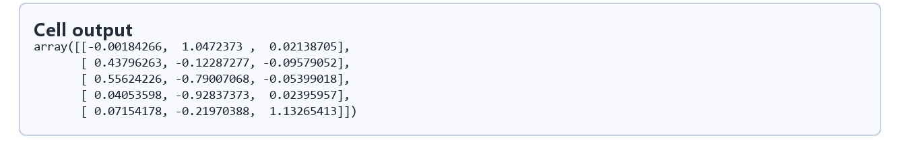

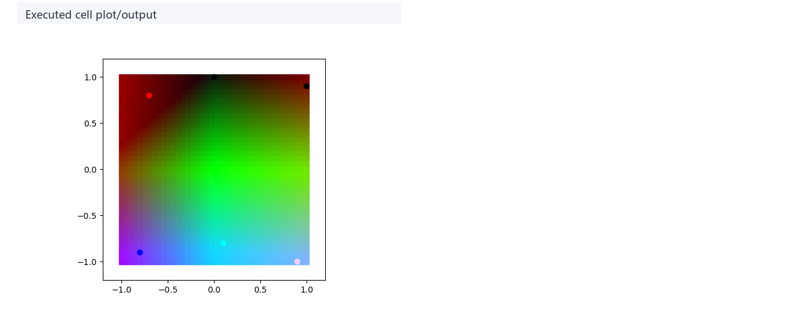

### 3. residuals：把局部风格细节交给 RBF

线性模型的预测值是 `adverb_matrix @ linear_coefficients`。真实样本 `data` 减去它，得到 `residuals`。这一步把问题从“拟合完整动作”改成“拟合线性模型没解释掉的局部差值”，也就是论文里更稳定的 linear term + radial basis correction 思路。

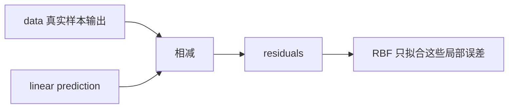

**执行结果怎么看：** Cell 11 的 residual 表不是噪声表，而是“线性趋势解释不了的动作风格”。在动作系统里，它可以对应某个方向上手臂摆幅、躯干倾斜或脚步节奏的局部偏差。后续径向系数要命中的正是这些残差，而不是原始 `data`。

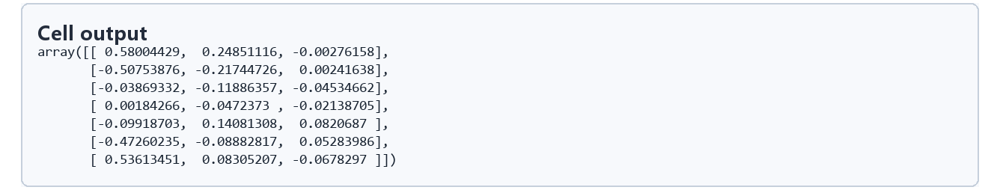

### 4. Cubic B-spline basis 与局部支撑半径

基础 RBF 篇用 Gaussian kernel，它理论上对任意远处都有非零影响。本篇使用 cubic B-spline cross section `B3`，归一化距离超过 2 后直接变成 0。每个样本还会根据最近邻距离得到自己的 `alpha`，让支撑半径随样本分布自适应：样本密集处影响范围更小，样本稀疏处影响范围更大。

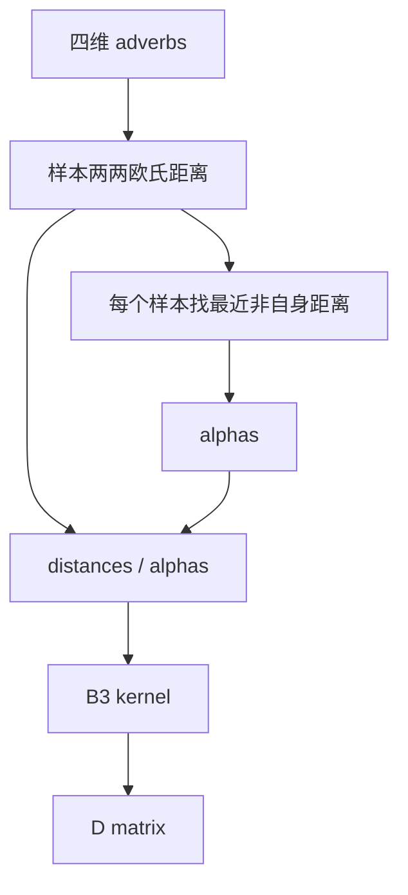

**执行结果怎么看：** Cell 14 的 B3 曲线展示了 compact support。Cell 20 的求解结果说明：距离矩阵先被 `alpha` 归一化，再送入 `B3` 形成 residual 的 kernel matrix `D`。远于 2 的样本影响归零，RBF 修正因此偏局部，不会让很远的动作样本强行互相拉扯。

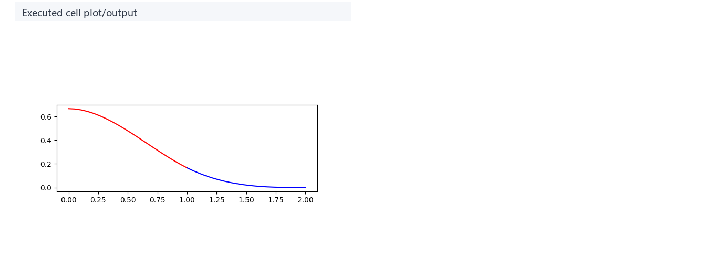

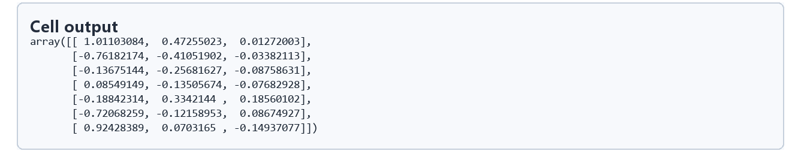

### 5. 最终动作参数场与 `RBF` 类封装

查询网格先用线性项得到 `linear_color`，再用 `interpolation_D @ radial_coefficients` 得到残差修正，最后相加：

```text
final_color = linear_color + interpolated_rbf
```

后面的 `RBF` 类把这些步骤封装成 `fit(data)` 和 `__call__(linear, radial, adverbs)`。这样同一组 adverb 样本可以重复拟合不同输出：颜色、骨骼旋转、平移通道或其他动作参数。工程意义是把“语义插值坐标”与“具体输出自由度”解耦，运行时只需要给定新的 adverb 向量即可查询动作参数。

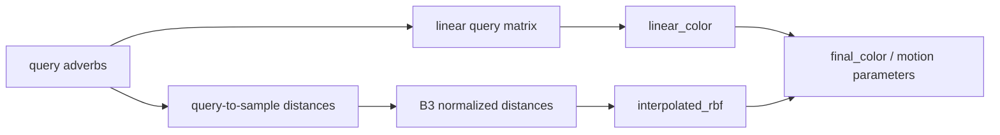

**执行结果怎么看：** Cell 21 的最终场应同时保留线性场的整体方向和样本附近的局部颜色特征。对应到动画，就是动作风格可以连续调节，同时在示例动作附近回到正确的参数值。颜色过渡越连续，表示语义插值越平滑；样本附近越接近原始颜色，表示 residual correction 越好地保留了示例动作。

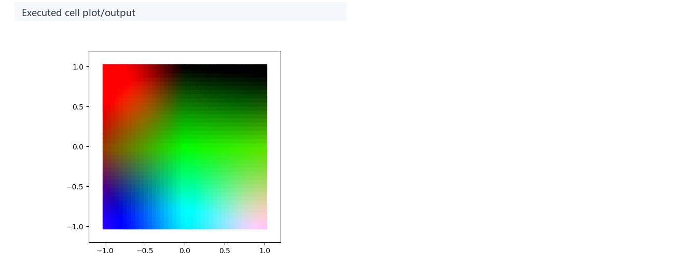

## 关键 cell / 函数深讲

### Cell 3 - Sample adverb color space

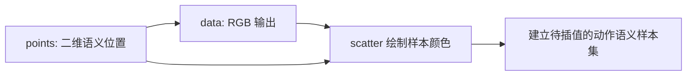

- 代码做什么：绘制二维 adverb 空间中的样本点。
- 运行后看到什么：7 个带颜色的样本位置。
- 结果说明什么：这些点模拟少量已制作的示例动作，颜色模拟动作自由度。
- 可视化主体：Sample adverb color space。
- 捕获方式：`plot`。

### Cell 4 - Four-dimensional adverb encoding

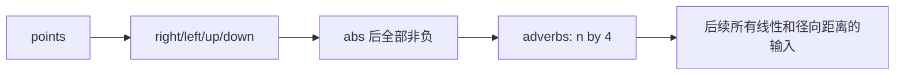

- 代码做什么：把二维坐标编码成四个 adverb 分量。
- 运行后看到什么：每行一个样本、每列一个 adverb 通道的矩阵。
- 结果说明什么：动作语义空间可以高于可视化平面维度，算法只关心特征向量。
- 可视化主体：Four-dimensional adverb encoding。
- 捕获方式：`table`。

### Cell 7 / 9 - Linear coefficients and field

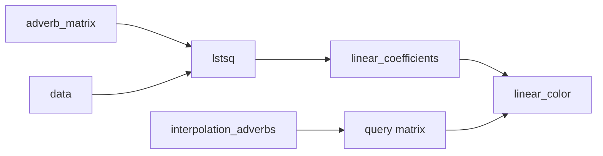

- 代码做什么：用最小二乘拟合线性项，并把它应用到 40 x 40 查询网格。
- 运行后看到什么：系数表和一张平滑颜色场。
- 结果说明什么：线性项给动作参数场一个稳定大趋势，但它不是精确插值器。
- 可视化主体：Linear model coefficients / Linear color field。
- 捕获方式：`table` 与 `plot`。

### Cell 11 - Linear residuals

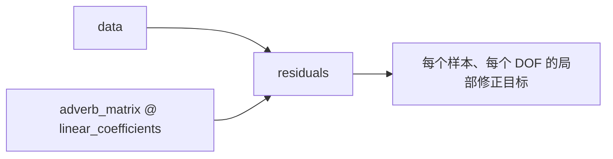

- 代码做什么：计算线性模型在样本点上的误差。
- 运行后看到什么：7 x 3 的 residual 表。
- 结果说明什么：RBF 不再负责完整颜色/动作，而只负责把线性项没解释好的部分补回来。
- 可视化主体：Linear residuals。
- 捕获方式：`table`。

### Cell 14 / 20 - B3 basis and radial coefficient solve

```mermaid
flowchart LR
    A[adverbs] --> B[四维距离矩阵]
    B --> C[alphas 最近邻尺度]
    C --> D[distances / alphas]
    D --> E[D = B3(...)]
    F[residuals] --> G[solve(D, residuals)]
    E --> G
    G --> H[radial_coefficients]
```

- 代码做什么：定义 compact-support B3 kernel，构造 `D` 矩阵并求解 residual 权重。
- 运行后看到什么：B3 曲线、距离尺度、`D` 矩阵和径向系数。
- 结果说明什么：每个样本只修正附近语义区域，远样本不会对当前查询产生过强影响。
- 可视化主体：Cubic B-spline radial basis / Radial coefficient solve。
- 捕获方式：`plot` 与 `table`。

### Cell 21 - Residual-corrected RBF field

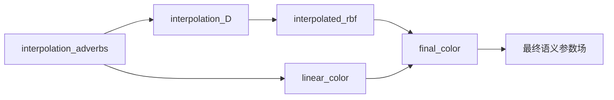

- 代码做什么：在查询网格上叠加线性项和 RBF residual correction。
- 运行后看到什么：最终颜色场。
- 结果说明什么：这张图就是动作参数场的二维投影；在动作系统里同一机制会输出多骨骼、多通道参数。
- 可视化主体：Residual-corrected RBF field。
- 捕获方式：`plot`。

### `RBF.fit` / `RBF.__call__`

```mermaid
flowchart TD
    A[RBF(adverbs)] --> B[预计算 adverb_matrix, distances, alphas, D]
    C[fit(data)] --> D[linear_coefficients]
    C --> E[radial_coefficients for residuals]
    F[__call__(linear, radial, query_adverbs)] --> G[linear query]
    F --> H[radial query]
    G --> I[interpolated output]
    H --> I
```

- 代码做什么：把散落在 notebook 中的线性拟合、残差拟合和查询评估封装为可复用类。
- 运行后看到什么：Cell 24 用三行代码重建颜色场，Cell 25 复用同一类处理一维函数。
- 结果说明什么：真实动画工程会预先固定 adverb 样本，反复对不同 DOF 调用 `fit`，再在运行时用 `__call__` 查询。

## 关键数据结构

| 名称 | 形状或类型 | 作用 |
| --- | --- | --- |
| `points` | `[7, 2]` | 为了可视化而设置的二维语义位置。 |
| `data` | `[7, 3]` | 每个样本的 RGB 输出；类比动作里的多个 DOF。 |
| `adverbs` | `[7, 4]` | right、left、up、down 四维语义坐标，算法真正使用的输入。 |
| `adverb_matrix` | `[7, 5]` | 常数列加四个 adverb 通道，用于线性最小二乘。 |
| `linear_coefficients` | `[5, 3]` | 每个输出通道对应的线性系数，表示常数项和四个 adverb 通道如何推动输出。 |
| `interpolation_positions` | `[1600, 2]` | 绘图用二维查询网格。 |
| `interpolation_adverbs` | `[1600, 4]` | 查询网格对应的四维 adverb 表示。 |
| `linear_color` | `[1600, 3]` | 线性项在查询网格上的输出。 |
| `residuals` | `[7, 3]` | 样本处线性预测与真实输出之间的差值，是径向层真正要拟合的目标。 |
| `distances` | `[7, 7]` | 样本在四维 adverb 空间中的两两欧氏距离。 |
| `alphas` | `[7]` | 每个样本到最近邻的距离，用于归一化 B3 支撑半径。 |
| `D` | `[7, 7]` | B3 kernel matrix，用于求 residual 权重；对应基础 RBF 篇中的 `Phi`。 |
| `radial_coefficients` | `[7, 3]` | 每个样本、每个输出通道的径向残差权重，用来把 residuals 插值到查询位置。 |
| `final_color` | `[1600, 3]` | 线性项加径向残差后的最终参数场。 |
| `RBF` | class | 封装预计算、拟合和查询流程，便于复用于不同输出通道。 |

## 执行结果的意义

Cell 3 和 Cell 4 说明输入空间的语义转换：图上的左、右、上、下不是简单坐标轴，而是可以被扩展到任意风格参数的 adverb 维度。真实动画中，`points` 会换成示例动作的语义标签或控制参数。

Cell 7 和 Cell 9 说明线性项的角色：它是全局趋势和外推兜底。即使查询点远离所有样本，线性模型仍能给出一个连续输出；这正好弥补基础 RBF 外推弱的问题。在线性项之上再加 residual，语义空间就既能平滑移动，又能在示例附近保留具体动作特征。

Cell 11、14、20、21 说明径向残差项的角色：RBF 不再“统治”整个输出，而是只修正线性项在样本附近的误差。`alphas` 和 B3 compact support 让每个样本的影响范围跟局部样本密度相关，减少远距离动作互相污染。最终图的意义不是“生成好看的颜色”，而是证明同一个流程可以把少量动作样本扩展成连续可查询的动作参数场。

## 重点可视化 / 动画

正文重点媒体只引用 `key_visual` 的真实算法输出。学习卡和 `00-walkthrough.webm` 只作为复现或学习证据，不作为主视觉。

| Cell | 重点媒体 | 可视化主体 | 捕获方式 | 结果说明什么 |
| --- | --- | --- | --- | --- |
| 3 | [结果 PNG](assets/01_sample_adverb_space_result.png) | Sample adverb color space | `plot` | 把语义方向与观察到的样本输出联系起来。 |
| 4 | [结果 PNG](assets/02_4d_adverb_encoding_result.png) | Four-dimensional adverb encoding | `table` | 展示二维演示坐标如何变成算法实际使用的高维特征。 |
| 9 | [结果 PNG](assets/04_linear_color_field_result.png) | Linear color field | `plot` | 展示线性项能表达的全局趋势和局限。 |
| 14 | [结果 PNG](assets/06_cubic_bspline_basis_result.png) | Cubic B-spline radial basis | `plot` | 展示 compact-support kernel 的局部影响形状。 |
| 21 | [结果 PNG](assets/08_final_rbf_field_result.png) | Residual-corrected RBF field | `plot` | 展示线性趋势加 RBF 残差后的最终动作参数场。 |

## 代码 Cell 与可视化结果

| Cell | 输出类型 | 媒体角色 | 捕获方式 | 发布必需 | 结果媒体 | 代码学习卡 |
| --- | --- | --- | --- | --- | --- | --- |
| 3 | `plot` | `key_visual` | `plot` | `true` | [PNG](assets/01_sample_adverb_space_result.png) | [PNG](assets/01_sample_adverb_space.png) |
| 4 | `matrix` | `supporting_evidence` | `table` | `false` | [PNG](assets/02_4d_adverb_encoding_result.png) | [PNG](assets/02_4d_adverb_encoding.png) |
| 7 | `table` | `supporting_evidence` | `table` | `false` | [PNG](assets/03_linear_coefficients_result.png) | [PNG](assets/03_linear_coefficients.png) |
| 9 | `plot` | `key_visual` | `plot` | `true` | [PNG](assets/04_linear_color_field_result.png) | [PNG](assets/04_linear_color_field.png) |
| 11 | `table` | `supporting_evidence` | `table` | `false` | [PNG](assets/05_linear_residuals_result.png) | [PNG](assets/05_linear_residuals.png) |
| 14 | `plot` | `key_visual` | `plot` | `true` | [PNG](assets/06_cubic_bspline_basis_result.png) | [PNG](assets/06_cubic_bspline_basis.png) |
| 20 | `matrix` | `supporting_evidence` | `table` | `false` | [PNG](assets/07_radial_system_solve_result.png) | [PNG](assets/07_radial_system_solve.png) |
| 21 | `plot` | `key_visual` | `plot` | `true` | [PNG](assets/08_final_rbf_field_result.png) | [PNG](assets/08_final_rbf_field.png) |

## 运行方式

在仓库根目录运行：

```powershell
powershell -NoProfile -ExecutionPolicy Bypass -File .\tools\run_case.ps1 radial_basis_function_verbs_and_adverbs
.\.envs\rbf_verbs_adv\python.exe -m jupyter lab --notebook-dir .
```

打开 `labs/Theory/radial_basis_function_verbs_and_adverbs.ipynb`，选择 kernel `animationtech-radial_basis_function_verbs_and_adverbs`，按 cell 顺序运行。本文根据 notebook、manifest 与对应 transcript 整理；正文媒体均来自现有 `assets` 中的真实 notebook 输出。
