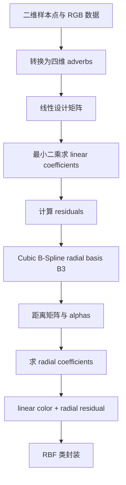
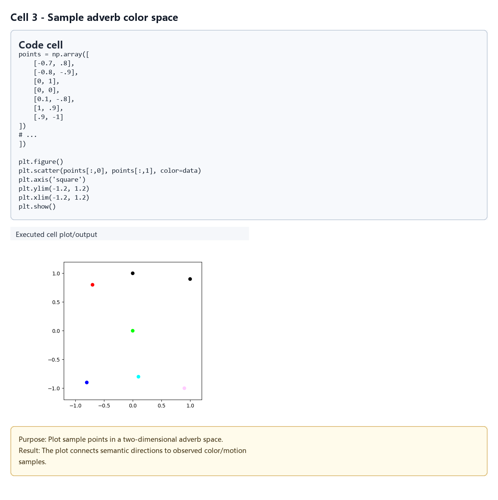
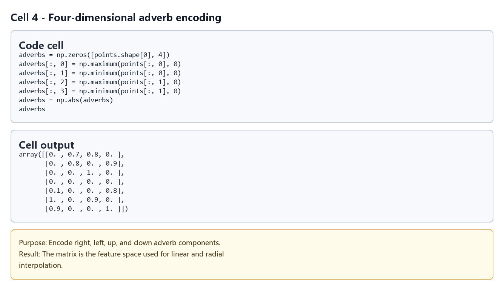
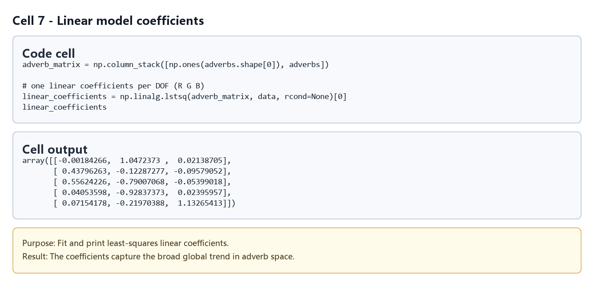
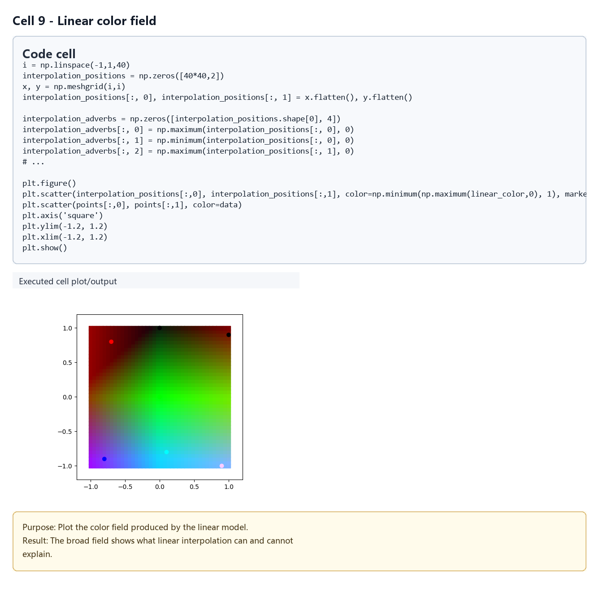
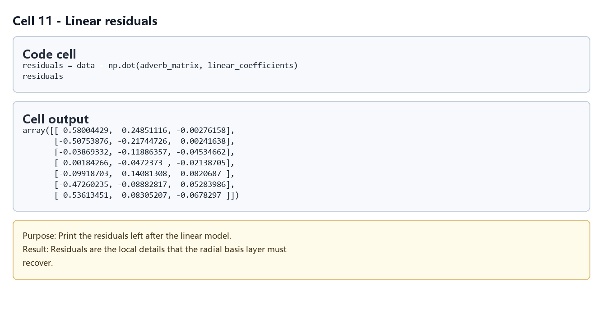
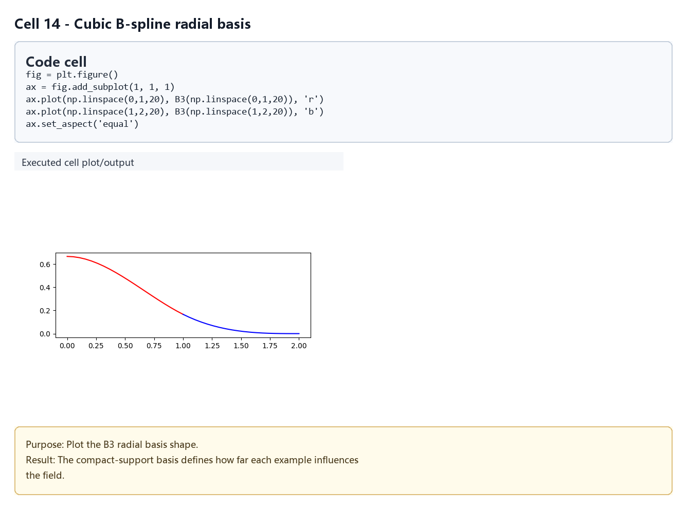
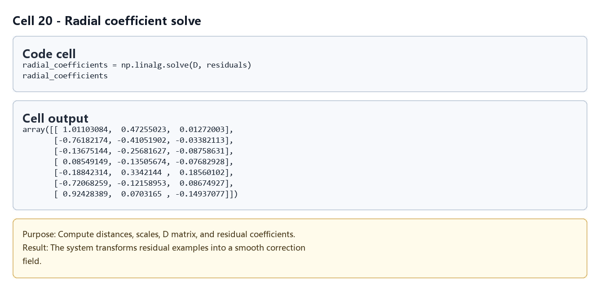
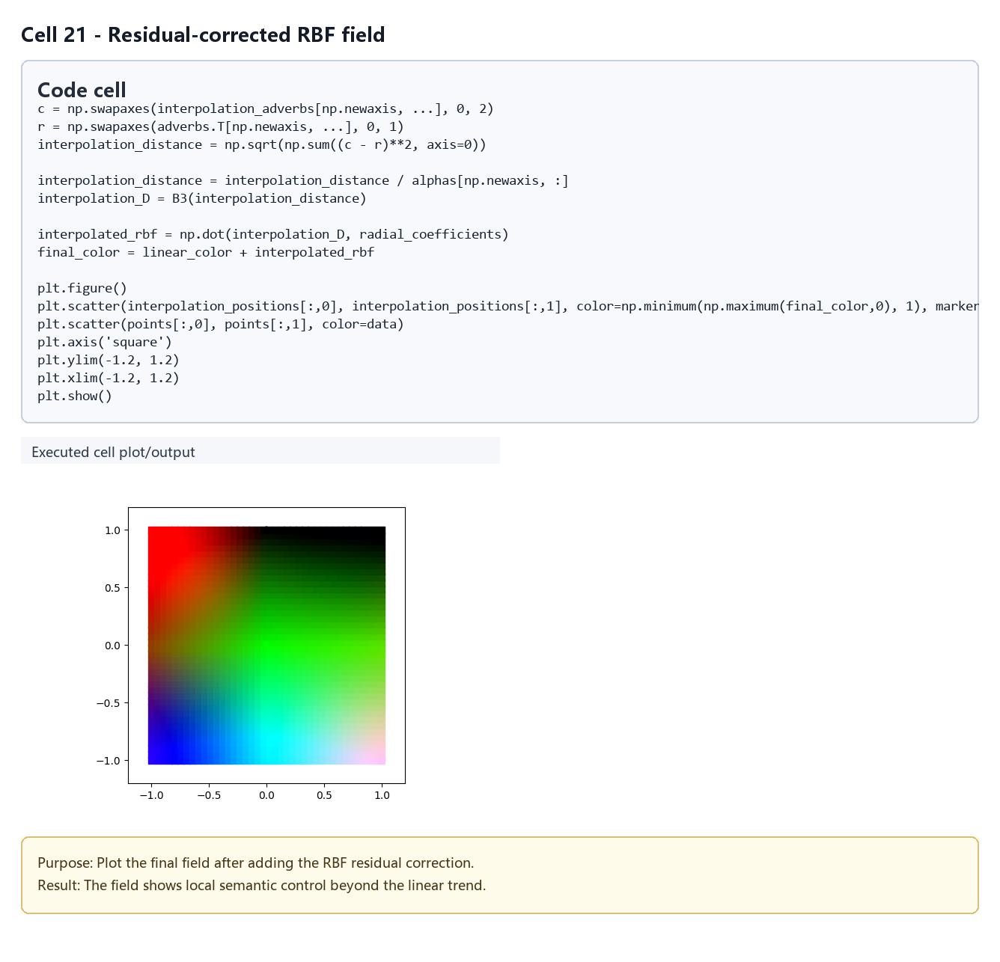

# RBF Verbs and Adverbs：线性项与残差径向项

## 元数据

| 字段 | 内容 |
| --- | --- |
| slug | `radial_basis_function_verbs_and_adverbs` |
| source path | [`labs/Theory/radial_basis_function_verbs_and_adverbs.ipynb`](../../../../labs/Theory/radial_basis_function_verbs_and_adverbs.ipynb) |
| env prefix | `.envs/rbf_verbs_adv` |
| kernel | `animationtech-radial_basis_function_verbs_and_adverbs` |
| validation status | `passed` (`automated`) |

## 问题背景

Verbs and Adverbs 思路里，“verb”表示动作类型或基础行为，“adverb”表示调节动作风格的连续参数。论文实现会在多维 adverb 空间中根据少量样本插值出动作自由度。

这个 notebook 用二维网格点模拟 adverb 空间，用 RGB 颜色模拟动作自由度。它不直接用 RBF 拟合全部输出，而是先求线性近似，再对线性残差做径向基函数插值。这种拆分对应论文中“linear coefficients + radial basis coefficients”的实现方式。

## 总模块图



## 模块拆解

1. **Verbs and Adverbs 示例设定**
   notebook 用 `points` 表示二维位置，用 `data` 表示每个位置的 RGB 颜色。二维位置被转换成四维 `adverbs`：右、左、上、下四个方向通道分别由坐标正负部分得到。

2. **插值位置网格**
   `interpolation_positions` 和 `interpolation_adverbs` 构造密集查询网格，便于把插值结果画成连续颜色场。

3. **线性近似**
   `adverb_matrix = column_stack([ones, adverbs])` 为每个自由度建立线性回归输入。`linear_coefficients = lstsq(adverb_matrix, data)` 得到每个 RGB 通道的线性项，`linear_color` 是只使用线性项的插值结果。

4. **残差计算**
   `residuals = data - adverb_matrix @ linear_coefficients` 表示线性模型没能解释的局部细节。后续 RBF 只拟合这些残差，而不是重新拟合完整颜色。

5. **Cubic B-Spline radial basis**
   `B3` 定义三次 B-Spline 形状的径向基函数。notebook 计算样本 adverb 之间的 `distances`，并为每个样本估计 `alphas`，用最近邻距离控制径向影响半径。

6. **求解 radial coefficients**
   `D = B3(distances / alphas)` 是径向基矩阵，`radial_coefficients = solve(D, residuals)` 让径向项精确补回样本残差。

7. **组合最终插值**
   查询网格上先算 `linear_color`，再用 `interpolation_D @ radial_coefficients` 得到 `interpolated_rbf`，最终 `final_color = linear_color + interpolated_rbf`。

8. **封装为 `RBF` 类**
   `RBF` 类把 `B3`、`alphas`、线性设计矩阵、`fit` 和 `__call__` 合到一起。后续既用它插值颜色，也用一维 `example_function` 验证同一套类接口。

## 关键数据结构

- `points`：二维样本位置。
- `data`：每个样本的 RGB 输出，模拟动作自由度。
- `adverbs`：由二维位置转换出的四维 adverb 表示。
- `adverb_matrix`、`linear_coefficients`：线性近似的设计矩阵和系数。
- `interpolation_positions`、`interpolation_adverbs`：查询网格及其 adverb 表示。
- `linear_color`、`residuals`、`final_color`：线性结果、残差和最终组合结果。
- `B3`：三次 B-Spline 径向基函数。
- `distances`、`alphas`、`D`、`radial_coefficients`：RBF 残差拟合所需矩阵和系数。
- `RBF`：封装线性加残差 RBF 插值流程的类。

## 执行结果的意义

线性插值图展示了 adverb 空间中的大趋势，但它通常不能穿过所有样本输出。残差 RBF 图说明局部径向项如何补偿线性模型的误差，让最终结果既保留整体方向性，又能精确还原样本点。

这种拆分对动画参数化很有意义：线性部分提供稳定、可解释的全局控制，径向残差负责样本附近的风格细节。`alphas` 的最近邻尺度让每个样本的影响范围随样本分布自动调整。

## 代码 Cell 与可视化结果

本节按 notebook 的关键 code cell 组织学习素材：每个条目都对应代码目的、实际输出类型、结果意义和 PNG 学习卡片。PNG 由指定 cell 的代码摘要、输出区、viewer/canvas 或图表/日志合成，不使用整页滚动截图替代。

[打开/下载 WebM](assets/00-walkthrough.webm)

| Cell | 输出类型 | 代码做什么 | 结果说明什么 | 素材 |
| --- | --- | --- | --- | --- |
| 3 | `plot` | Plot sample points in a two-dimensional adverb space. | The plot connects semantic directions to observed color/motion samples. | [PNG](assets/01_sample_adverb_space.png) |
| 4 | `matrix` | Encode right, left, up, and down adverb components. | The matrix is the feature space used for linear and radial interpolation. | [PNG](assets/02_4d_adverb_encoding.png) |
| 7 | `table` | Fit and print least-squares linear coefficients. | The coefficients capture the broad global trend in adverb space. | [PNG](assets/03_linear_coefficients.png) |
| 9 | `plot` | Plot the color field produced by the linear model. | The broad field shows what linear interpolation can and cannot explain. | [PNG](assets/04_linear_color_field.png) |
| 11 | `table` | Print the residuals left after the linear model. | Residuals are the local details that the radial basis layer must recover. | [PNG](assets/05_linear_residuals.png) |
| 14 | `plot` | Plot the B3 radial basis shape. | The compact-support basis defines how far each example influences the field. | [PNG](assets/06_cubic_bspline_basis.png) |
| 20 | `matrix` | Compute distances, scales, D matrix, and residual coefficients. | The system transforms residual examples into a smooth correction field. | [PNG](assets/07_radial_system_solve.png) |
| 21 | `plot` | Plot the final field after adding the RBF residual correction. | The field shows local semantic control beyond the linear trend. | [PNG](assets/08_final_rbf_field.png) |

### Cell 3 - Sample adverb color space

- 代码做什么：Plot sample points in a two-dimensional adverb space.
- 运行后看到什么：图表输出。
- 结果说明什么：The plot connects semantic directions to observed color/motion samples.



### Cell 4 - Four-dimensional adverb encoding

- 代码做什么：Encode right, left, up, and down adverb components.
- 运行后看到什么：矩阵或数组输出。
- 结果说明什么：The matrix is the feature space used for linear and radial interpolation.



### Cell 7 - Linear model coefficients

- 代码做什么：Fit and print least-squares linear coefficients.
- 运行后看到什么：表格或结构化数据输出。
- 结果说明什么：The coefficients capture the broad global trend in adverb space.



### Cell 9 - Linear color field

- 代码做什么：Plot the color field produced by the linear model.
- 运行后看到什么：图表输出。
- 结果说明什么：The broad field shows what linear interpolation can and cannot explain.



### Cell 11 - Linear residuals

- 代码做什么：Print the residuals left after the linear model.
- 运行后看到什么：表格或结构化数据输出。
- 结果说明什么：Residuals are the local details that the radial basis layer must recover.



### Cell 14 - Cubic B-spline radial basis

- 代码做什么：Plot the B3 radial basis shape.
- 运行后看到什么：图表输出。
- 结果说明什么：The compact-support basis defines how far each example influences the field.



### Cell 20 - Radial coefficient solve

- 代码做什么：Compute distances, scales, D matrix, and residual coefficients.
- 运行后看到什么：矩阵或数组输出。
- 结果说明什么：The system transforms residual examples into a smooth correction field.



### Cell 21 - Residual-corrected RBF field

- 代码做什么：Plot the final field after adding the RBF residual correction.
- 运行后看到什么：图表输出。
- 结果说明什么：The field shows local semantic control beyond the linear trend.



## 运行方式

在仓库根目录运行：

```powershell
powershell -NoProfile -ExecutionPolicy Bypass -File .\tools\run_case.ps1 radial_basis_function_verbs_and_adverbs
.\.envs\rbf_verbs_adv\python.exe -m jupyter lab --notebook-dir .
```

打开 `labs/Theory/radial_basis_function_verbs_and_adverbs.ipynb`，选择 kernel `animationtech-radial_basis_function_verbs_and_adverbs`。本说明只根据 notebook 源内容整理，没有重新执行 notebook。

## 重点可视化 / 动画

README 中优先引用结果 PNG、GIF 预览和视频链接；代码学习卡保留为复现证据。

[打开/下载总览 WebM](assets/00-walkthrough.webm)

| Cell | 输出类型 | 媒体角色 | 代码目的 | 结果媒体 |
| --- | --- | --- | --- | --- |
| Cell 3 | `plot` | `key_visual` | Plot sample points in a two-dimensional adverb space. | [结果 PNG](assets/01_sample_adverb_space_result.png) / [代码卡](assets/01_sample_adverb_space.png) |
| Cell 4 | `matrix` | `supporting_evidence` | Encode right, left, up, and down adverb components. | [结果 PNG](assets/02_4d_adverb_encoding_result.png) / [代码卡](assets/02_4d_adverb_encoding.png) |
| Cell 7 | `table` | `supporting_evidence` | Fit and print least-squares linear coefficients. | [结果 PNG](assets/03_linear_coefficients_result.png) / [代码卡](assets/03_linear_coefficients.png) |
| Cell 9 | `plot` | `key_visual` | Plot the color field produced by the linear model. | [结果 PNG](assets/04_linear_color_field_result.png) / [代码卡](assets/04_linear_color_field.png) |
| Cell 11 | `table` | `supporting_evidence` | Print the residuals left after the linear model. | [结果 PNG](assets/05_linear_residuals_result.png) / [代码卡](assets/05_linear_residuals.png) |
| Cell 14 | `plot` | `key_visual` | Plot the B3 radial basis shape. | [结果 PNG](assets/06_cubic_bspline_basis_result.png) / [代码卡](assets/06_cubic_bspline_basis.png) |
| Cell 20 | `matrix` | `supporting_evidence` | Compute distances, scales, D matrix, and residual coefficients. | [结果 PNG](assets/07_radial_system_solve_result.png) / [代码卡](assets/07_radial_system_solve.png) |
| Cell 21 | `plot` | `key_visual` | Plot the final field after adding the RBF residual correction. | [结果 PNG](assets/08_final_rbf_field_result.png) / [代码卡](assets/08_final_rbf_field.png) |

## 代码 Cell 与可视化结果

本节保留每个 cell 的可复现证据。结果 PNG 用于正文阅读，代码卡记录代码摘要与输出来源；有 timeline 或参数滑杆的 cell 同时提供 GIF、MP4 和 WebM。

| Cell / 片段 | 结果说明 | 证据 |
| --- | --- | --- |
| Cell 3 | The plot connects semantic directions to observed color/motion samples. | [结果 PNG](assets/01_sample_adverb_space_result.png) / [代码卡](assets/01_sample_adverb_space.png) |
| Cell 4 | The matrix is the feature space used for linear and radial interpolation. | [结果 PNG](assets/02_4d_adverb_encoding_result.png) / [代码卡](assets/02_4d_adverb_encoding.png) |
| Cell 7 | The coefficients capture the broad global trend in adverb space. | [结果 PNG](assets/03_linear_coefficients_result.png) / [代码卡](assets/03_linear_coefficients.png) |
| Cell 9 | The broad field shows what linear interpolation can and cannot explain. | [结果 PNG](assets/04_linear_color_field_result.png) / [代码卡](assets/04_linear_color_field.png) |
| Cell 11 | Residuals are the local details that the radial basis layer must recover. | [结果 PNG](assets/05_linear_residuals_result.png) / [代码卡](assets/05_linear_residuals.png) |
| Cell 14 | The compact-support basis defines how far each example influences the field. | [结果 PNG](assets/06_cubic_bspline_basis_result.png) / [代码卡](assets/06_cubic_bspline_basis.png) |
| Cell 20 | The system transforms residual examples into a smooth correction field. | [结果 PNG](assets/07_radial_system_solve_result.png) / [代码卡](assets/07_radial_system_solve.png) |
| Cell 21 | The field shows local semantic control beyond the linear trend. | [结果 PNG](assets/08_final_rbf_field_result.png) / [代码卡](assets/08_final_rbf_field.png) |
