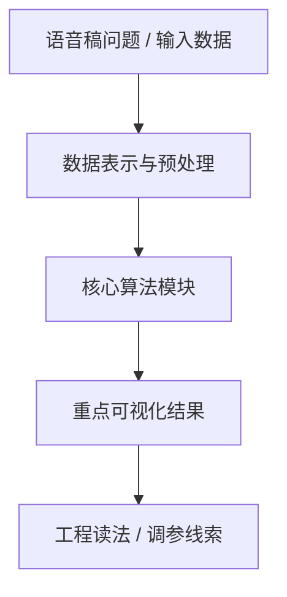
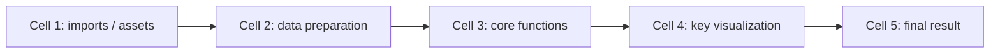

# <案例标题>

## 元数据

| 字段 | 值 |
| --- | --- |
| slug | `<slug>` |
| source path | [`<source>`](../../../../<source>) |
| transcript sources | [`<transcript>`](../../../../<transcript>) |
| kind | `notebook` / `python_module` |
| env | `<env_prefix>` |
| kernel | `<kernel_name>` |
| validation | `passed` |
| publish tier | `深写完成 + 媒体完整` / `媒体完整 + 发布基底` |
| media quality | `key_visual/key_animation 必须是算法输出本身，禁止滚动截图、整页 cell、代码卡裁剪和静态假动画` |

## 问题背景

说明这个案例解决的动画、数学或工程问题。写清楚输入、输出、核心约束，以及语音稿中强调的学习动机。

## 阅读前置知识

- 需要理解的数学概念。
- 需要熟悉的数据结构或动画术语。
- 与其他案例的依赖关系。

## 总模块图



## 代码执行路径



用工程语言说明 notebook/script 的执行顺序，而不是逐行翻译代码。

## 模块拆解

### 1. <模块名称>

模块职责、输入、输出，以及它在整条链路里的位置。


**执行结果怎么看：** 说明本模块输出代表什么，读者应该从图、曲线、viewer 或日志中看懂什么。

## 关键 cell / 函数深讲

### Cell <index> - <标题>

这段 cell 承担的职责、关键参数和容易误解的地方。


- 代码做什么：`<code_purpose>`
- 运行后看到什么：`<output_type>`
- 结果说明什么：`<result_meaning>`
- 可视化主体：`<visual_subject>`
- 捕获方式：`<capture_kind>` / `<capture_selector>`


若本 cell 有 timeline 或参数滑杆，正文必须先放可直接预览的 GIF，再放本地 Markdown 预览更稳定的 direct-src 视频标签。GitHub README 会过滤仓库相对路径的 `<video>`，所以 repo-local MP4/WebM 只能作为源码语义和本地预览；线上要显示真正播放器时，必须改用 GitHub attachment 或 user-images 视频 URL。GIF 是 GitHub README 的保底可动预览，不需要读者额外打开：


`github_video_url` 可选；拿到 GitHub attachment / user-images URL 后，把裸 URL 放在 GIF 和本地播放器之间，GitHub README 会把它渲染为真正播放器：

<github_video_url>

<video controls muted loop playsinline preload="metadata" width="100%" poster="assets/<result_file>.png" src="assets/<file>.mp4"></video>

## 关键数据结构

- `<name>`：含义、shape 或字段组成。
- `<name>`：生命周期，以及它在哪些模块之间传递。

## 执行结果的意义

- 图像或 viewer：说明能观察到什么现象。
- 曲线或数值：说明它验证了哪条算法假设。
- 视频或 GIF：说明 timeline/参数变化展示了什么动态行为。
- 文件产物或日志：说明它在工程链路中的用途。

## 重点可视化 / 动画

正文只引用有意义的算法输出媒体：plot、table、formula、canvas、viewer 或控件状态。禁止把浏览器滚动截图、整页 cell 截图、代码学习卡裁剪图、Jupyter chrome 截图或静态图平移缩放生成的假动画放在本节。

动画正文必须先放 GIF 预览，再放 direct-src `<video>` 本地预览。MP4/H.264 作为本地预览主文件，WebM/VP9 保留在 manifest、素材清单和证据表中。GitHub 线上若过滤 repo-relative `<video>`，GIF 仍必须直接可见；要让线上显示真正视频播放器，必须在正文中加入 `github_video_url` 裸 URL。

| Cell | 重点媒体 | 可视化主体 | 捕获方式 | 结果说明什么 |
| --- | --- | --- | --- | --- |
| `<cell_index>` | [结果图](assets/<result_file>.png) / `<video>` / [GIF](assets/<preview>.gif) | `<visual_subject>` | `<capture_kind>` | `<result_meaning>` |

## 代码 Cell 与可视化证据

notebook 案例使用本节记录可复现证据。每个条目绑定 cell、输出类型、媒体角色、结果媒体和代码学习卡；`card_file` 只作为附录证据，不能替代正文中的重点结果媒体。

| Cell | 输出类型 | 媒体角色 | 捕获方式 | 发布必需 | 结果媒体 | 代码学习卡 |
| --- | --- | --- | --- | --- | --- | --- |
| `<cell_index>` | `<output_type>` | `<media_role>` | `<capture_kind>` | `<publish_media_required>` | [PNG](assets/<result_file>.png) | [PNG](assets/<card_file>.png) |

python module 案例把本节标题替换为 `## 源码模块与执行证据`，并使用 source path、symbol、command log 或 artifact summary 来说明可复现证据。

## 运行方式

AnimationPapers notebook 优先使用：

```powershell
powershell -NoProfile -ExecutionPolicy Bypass -File .\tools\start_animationpapers_lab.ps1
```

单案例验证使用：

```powershell
powershell -NoProfile -ExecutionPolicy Bypass -File .\tools\run_case.ps1 <slug>
```

## 发布验收清单

本地检查只保证 README 写法、manifest 字段和媒体文件存在；GitHub 最终渲染结果必须以上线页面为准。处理完成后由 Codex 自行打开 GitHub 页面核对，不需要向用户确认是否可以访问。

```powershell
powershell -NoProfile -ExecutionPolicy Bypass -File .\docs\blog\check_blog_docs.ps1 -Strict
powershell -NoProfile -ExecutionPolicy Bypass -File .\docs\blog\report_blog_docs.ps1
rg -n "打开 MP4|打开 WebM|打开/下载" docs/blog --glob README.md
```

验收标准：

- `check_blog_docs.ps1 -Strict` 通过。
- `report_blog_docs.ps1` 中 `Legacy link-only video opens` 为 `0`，`Embedded WebM without MP4 companion` 为 `0`，`Potential issues` 为 `0`。
- `rg` 不应在任何博客 README 中找到旧式视频入口。
- `ffprobe` 抽查重点动画：MP4 为 H.264，WebM 为 VP9。

## GitHub 发布验证

推送后打开对应 GitHub README 页面，而不是只看本地 Markdown。以 Footskate 为例：

<https://github.com/EvihGraphics/AnimationTech-HTC/tree/main/docs/blog/AnimationPapers/footskate_cleanup_for_motion_capture_editing>

线上检查项：

- 正文动画至少必须显示 GIF 可动预览，不允许退回“打开 MP4 / 打开 WebM / 打开下载”链接。
- 如果已经配置 `github_video_url`，正文动画还必须显示为 GitHub 内嵌播放器。
- `key_animation` 的本地播放器必须使用 MP4/H.264 direct `src`，manifest 和证据表仍必须保留 WebM/VP9。
- 实际点击播放器，确认 Footskate 的 Final Processing 动画可以播放。
- 如果 repo-relative `<video src="assets/...">` 被 GitHub 过滤或不能播放，则把视频上传为 GitHub attachment，并把 `github_video_url` 裸 URL 放入 README；仍然保持 GIF 保底预览，不恢复 link-only 写法。

当前经验记录：本地严格检查已经能保证 README 中存在 direct-src `<video>` 和 MP4/WebM 文件证据；GitHub public `main` 会过滤 repo-relative `<video>`，因此没有 attachment/user-images URL 时，线上直接可见的动态展示应以 GIF 为准。

## 素材清单

每个案例在 `assets/README.md` 中维护素材清单。正文只引用已经存在的结果 PNG、GIF、MP4 或 WebM 文件，并说明它们来自哪个 cell、源码片段或命令输出；重点媒体还必须说明 `visual_subject`、`capture_kind` 和 `media_provenance`。若有 GitHub attachment / user-images 视频 URL，在 manifest step 中记录 `github_video_url`，并在 README 正文同一动画位置放置该裸 URL。
