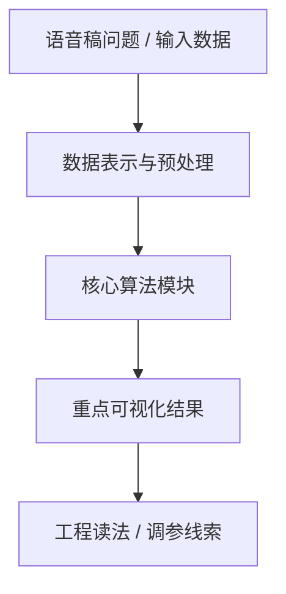
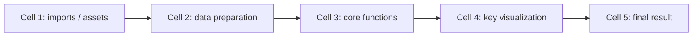

# <案例标题>

## 元数据

| 字段 | 值 |
| --- | --- |
| slug | `<slug>` |
| source path | [`<source>`](../../../../<source>) |
| transcript sources | [`<transcript>`](../../../../<transcript>) |
| kind | `notebook` / `python_module` |
| env | `<env_prefix>` |
| kernel | `<kernel_name>` |
| validation | `passed` |
| publish tier | `深写完成 + 媒体完整` / `媒体完整 + 发布基底` |

## 问题背景

说明这个案例解决的动画、数学或工程问题。写清楚输入、输出、核心约束，以及语音稿中强调的学习动机。

## 阅读前置知识

- 需要理解的数学概念。
- 需要熟悉的数据结构或动画术语。
- 与其他案例的依赖关系。

## 总模块图



## 代码执行路径



用工程语言说明 notebook/script 的执行顺序，而不是逐行翻译代码。

## 模块拆解

### 1. <模块名称>

模块职责、输入、输出，以及它在整条链路里的位置。


**执行结果怎么看：** 说明本模块输出代表什么，读者应该从图、曲线、viewer 或日志中看懂什么。

## 关键 cell / 函数深讲

### Cell <index> - <标题>

这段 cell 承担的职责、关键参数和容易误解的地方。


- 代码做什么：`<code_purpose>`
- 运行后看到什么：`<output_type>`
- 结果说明什么：`<result_meaning>`


若本 cell 有 timeline 或参数滑杆，在正文中优先放 GIF 预览，并把 MP4/WebM 作为 GitHub 可点击播放/下载链接：


[打开 MP4](assets/<file>.mp4) / [打开 WebM](assets/<file>.webm)

## 关键数据结构

- `<name>`：含义、shape 或字段组成。
- `<name>`：生命周期，以及它在哪些模块之间传递。

## 执行结果的意义

- 图像或 viewer：说明能观察到什么现象。
- 曲线或数值：说明它验证了哪条算法假设。
- 视频或 GIF：说明 timeline/参数变化展示了什么动态行为。
- 文件产物或日志：说明它在工程链路中的用途。

## 重点可视化 / 动画

正文优先引用结果图、GIF 预览和视频链接；代码学习卡只作为证据或附录，不作为主要视觉素材。

| Cell | 重点媒体 | 代码做什么 | 结果说明什么 |
| --- | --- | --- | --- |
| `<cell_index>` | [结果图](assets/<result_file>.png) / [GIF](assets/<preview>.gif) | `<code_purpose>` | `<result_meaning>` |

## 代码 Cell 与可视化证据

notebook 案例使用本节记录可复现证据。每个条目绑定 cell、输出类型、媒体角色、结果媒体和代码学习卡。

| Cell | 输出类型 | 媒体角色 | 结果媒体 | 代码学习卡 |
| --- | --- | --- | --- | --- |
| `<cell_index>` | `<output_type>` | `<media_role>` | [PNG](assets/<result_file>.png) | [PNG](assets/<card_file>.png) |

python module 案例把本节标题替换为 `## 源码模块与执行证据`，并使用 source path、symbol、command log 或 artifact summary 来说明可复现证据。

## 运行方式

AnimationPapers notebook 优先使用：

```powershell
powershell -NoProfile -ExecutionPolicy Bypass -File .\tools\start_animationpapers_lab.ps1
```

单案例验证使用：

```powershell
powershell -NoProfile -ExecutionPolicy Bypass -File .\tools\run_case.ps1 <slug>
```

## 素材清单

每个案例在 `assets/README.md` 中维护素材清单。正文只引用已经存在的结果 PNG、GIF、MP4 或 WebM 文件，并说明它们来自哪个 cell、源码片段或命令输出。
